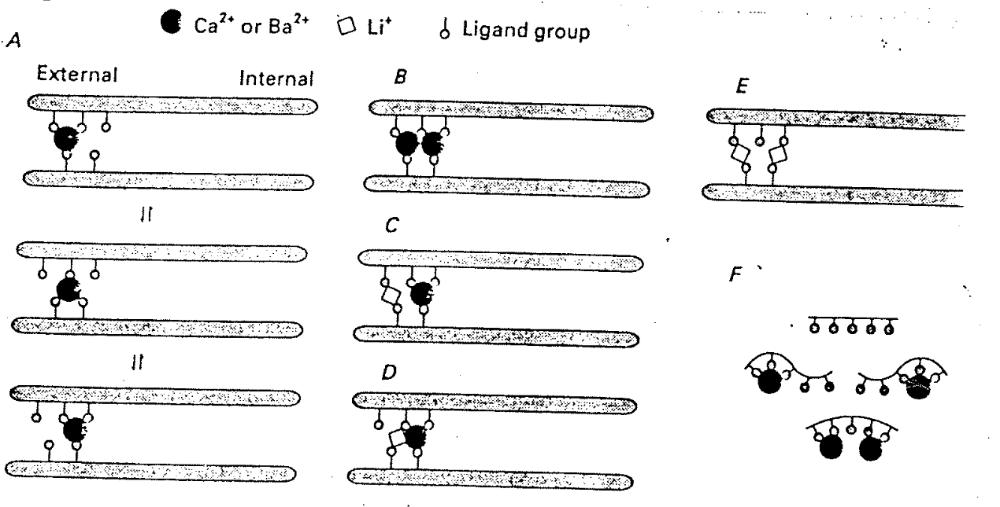
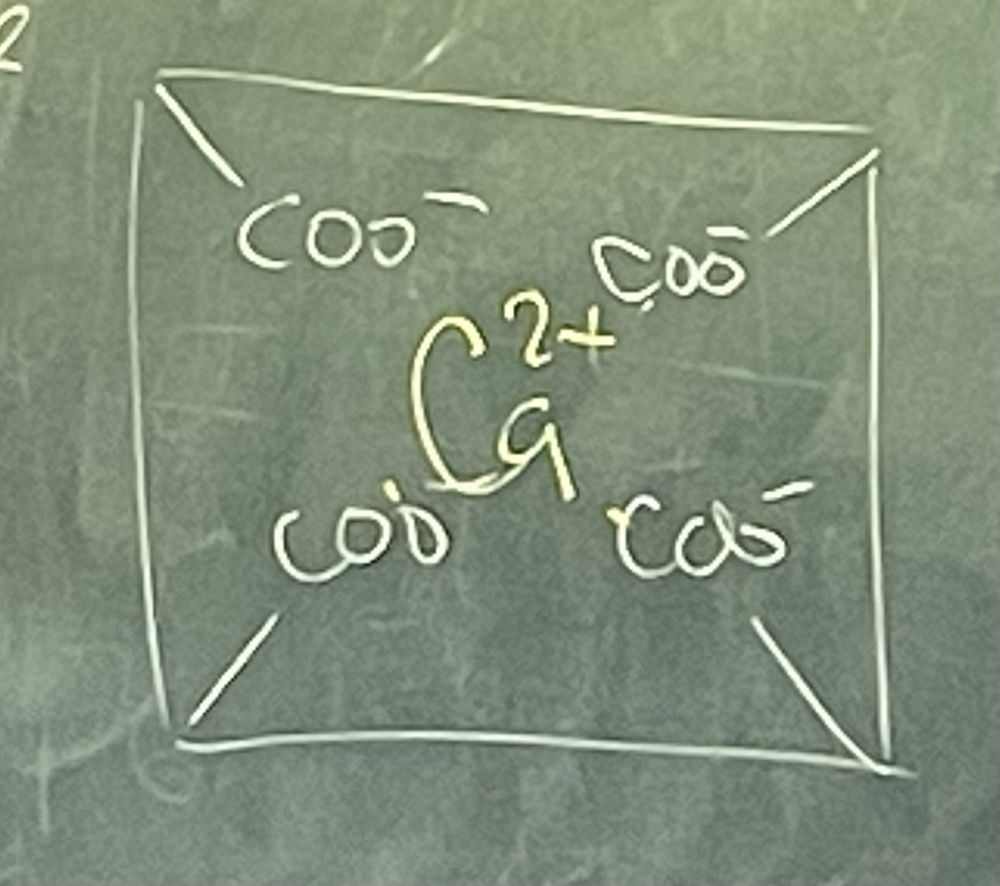
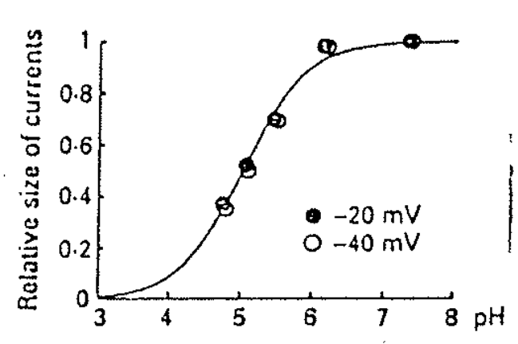
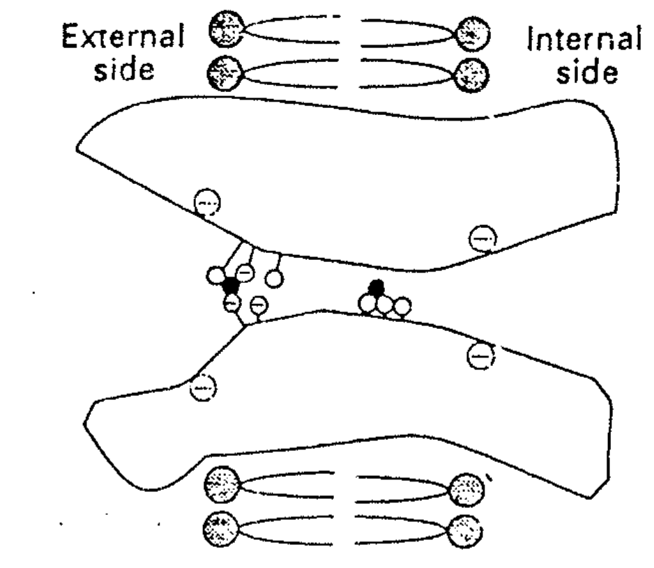

# 實際 Mechanism

## 內文

1. 圖 A：鈣可以在 ligand group 中間反覆橫跳
2. 圖 B：如果有第二個 Ca 擠進來，則這兩個 Ca 的 free energy 都會一起提高 ⇒ 這兩個人有一個要走 ⇒ 有一半的機率是原本裡面這顆被擠掉（成功）、有一半的機率是新來的這顆被擠掉（通過失敗，回到原點），所以 Ca 的 On rate 要這麼快（因為有一半機率會失敗）
3. 圖 C & D：**Li 跟 ligand group 的 affinity 很差，即 Li bind 上來的 free energy 很高，即這個 configuation 的出現機率很低（這三句話是同一件事），**但只要 Li 濃度夠高，仍然能 bind 上去然後把 Ca 擠掉
4. 所以在 $3 < P_{Ca} < 6$ 的時候，鈣牢牢卡住位置根本不下來，因此通過的 Na / Li 電流超低
5. 跟 Ca 的結合力這麼強的東西，是不是很像 EDTA？（下圖為 EDTA）
   
6. 如何讓 EDTA 與 Ca 的結合力變差？給予大量的 H+，把 COO-變成 COOH
   ⇒ 對 Ca channel 滴定，測量不同酸鹼值下的 Ca current，發現確實在酸的環境下 Ca current 變得超級小
   
7. 下圖為 Binding site 卡通圖，可以發現確實 Selective site 在 External，而 internal 有很多親和力小很多（沒什麼 selectivity）的 binding site
   
