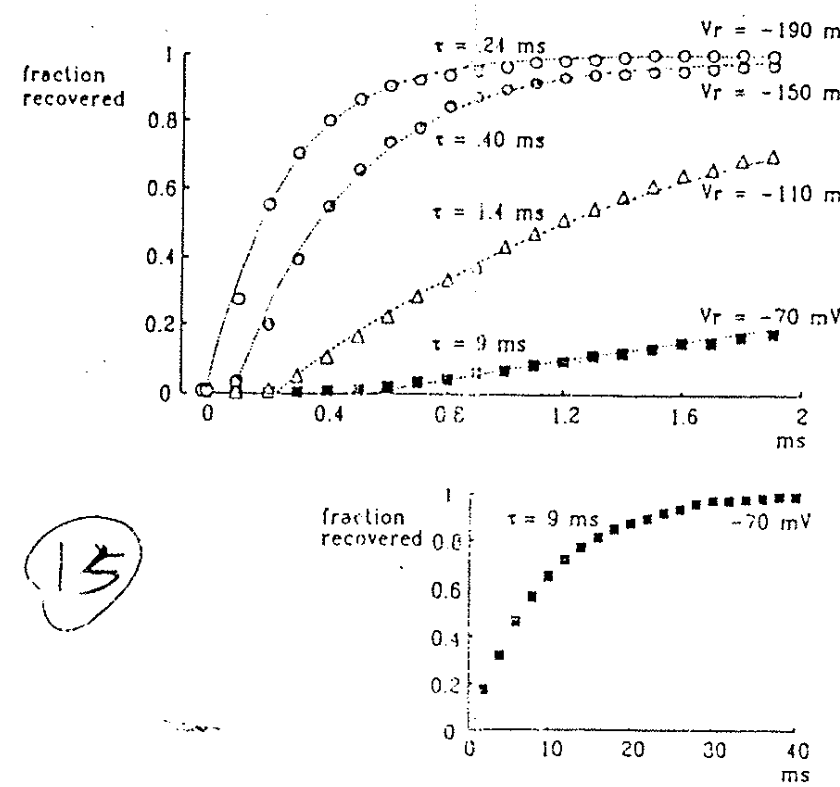
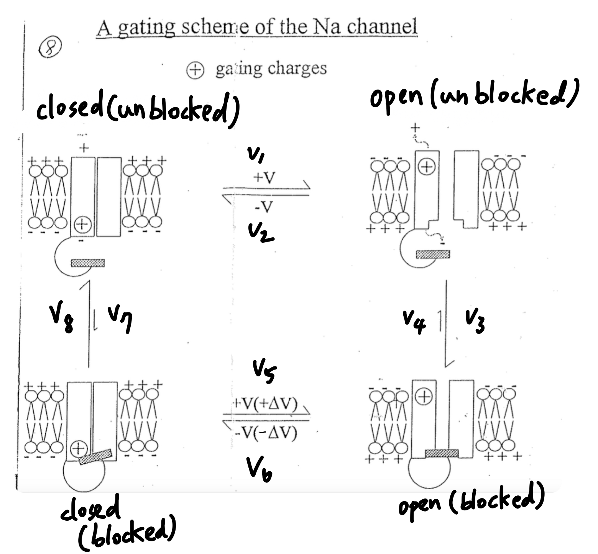
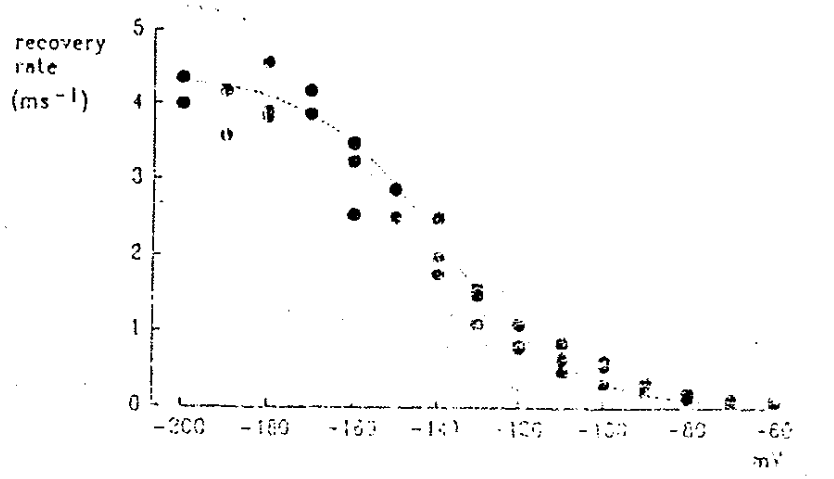

# 更新 Na channel 模型：Recovery delay ⇒ 4 phase model

## 內文
Bezanilla & Amstrong 的 $\ce{C <=>[v_\alpha][v_\beta] O <=>[v_\gamma][v_\delta] I}$ 模型仍然有問題

1. **<u>問題一</u>**：在 Action potential 的 repolarize 階段，所有 channel 想從 I state 變回 C state 都要經過 O state
   ⇒ 此時大量的 $\ce{Na+}$ 就會經由這些 Open Channel 灌進細胞，這樣還怎麼 repolarize? 不合理
2. **<u>問題二</u>**：Action potential 間隔都都非常短，如果 $v_\delta$ 太小的話根本無法這麼快從 I state 變回 C state，而如果 $v_\delta$ 太大的話則無法讓平衡狀態下 $[I] \gg [O]$
   如下圖，實驗證實 hyperpolarization 下 Na channel recover 的 time constant $\tau$ 超級小（且大致呈現 exponential ，蠻合理的）
   
3. **<u>問題三</u>**：但是也看到上圖，在 channel 開始 recover 之前，依然有一個 delay。為什麼？

New model for Na channel

1. 如上圖，既然是 ball and chain model，那可以改畫成四種不同的 state（事實上因為 Na channel 要打開三道門，因此可以畫得更複雜，不過 scheme 的目的是簡化複雜的流程以幫助思考，因此只要把關鍵畫出來就好）
   1. 四個 state 分別簡寫為 $C_u、O_u、C_b、O_b$
   2. 上圖手寫的 $v_1 \sim v_8$ 代表八個反應的反應速率，而印刷的大寫 V 代表電位差
2. 只要 $v_3 \gg v_4$ 且 $v_8 \gg v_7$，就可以達成
   1. channel 從 I state 變回 C state 的時候不需要經過 O state ⇒ 解決問題一
   2. channel 從 I state 變回 C state 時候不用塞在緩慢的 $v_4$，而是可以從 $v_8$ 高速公路回 C state ⇒ 解決問題二
3. 如果要做到 $v_3 \gg v_4$ 且 $v_8 \gg v_7$ ，則代表
   1. 在 $O_b$ state 那顆 Ball 跟通道蛋白黏的很緊
   2. 在 $C_b$ state 那顆 Ball 跟通道蛋白黏的很鬆，很容易就掉下來
   ⇒ 代表 $v_6$ 需要的能量比 $v_2$ 還高，除了要讓門關起來之外還需要讓球變的比較鬆，即需要做額外的非電功
   ⇒ 因此 $v_6$ 反應需要很負的電壓，來對通道蛋白做額外的功（因此圖中額外加上 $\Delta V$），即如果 -60 mV 就可以讓大部分 $O_u$ 變成 $C_u$，則可能需要 -80 mV 才能讓 $O_b$ 變成 $C_b$
4. recover 之前，有一個 delay 是因為要讓 $\ce{O_b ->[v_6] C_b }$ ⇒ 解決問題三
5. 如下圖為不同電位下的 recover time：在 hyperpolarization 的電位越來越負的時候，recovery rate 並不會無限變快而是到某個程度就飽和了 ⇒ 因為原本的速率決定步驟是 $v_6$ (voltage dependent)，但是當 $v_6$ 夠快之後速率決定步驟變成 $v_8$ (voltage independent)，因此整體 recovery rate 並不會隨著電位更負而更快了
   
   因為 $v_8$ 是 voltage independent ，亦即沒辦法用測量 Gating current 的方式測量 $v_8$，但是可以測量飽和 recovery rate = 每毫秒 4 個（如上圖），這即是 $v_8$ 的速度
