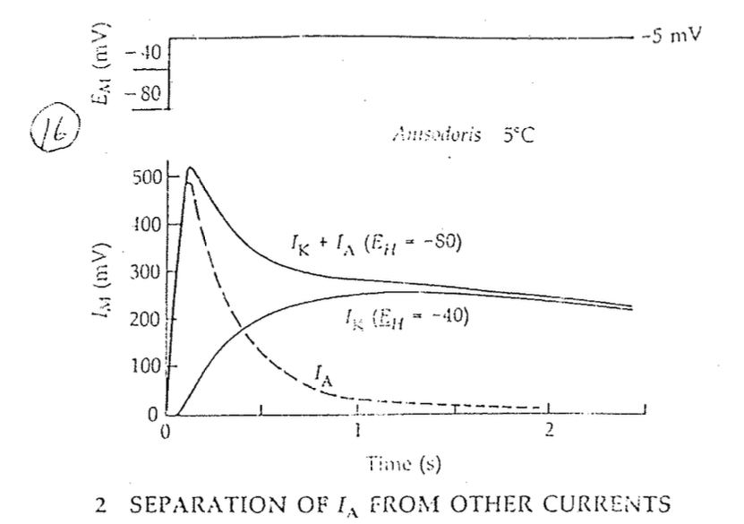

# 會 inactivate 的 channel，越 depolarize 越不會有反應（都 i 掉了）（以 A type K channel 為例）

## 內文

1. 如上圖，$I_A$（A type K channel）會 inactivation，而 $I_K$（Delay rectifier K channel）不會
2. -40 mV 時 A type K channel 已經 I 掉了，所以膜電位 -40mV → 0 mV 時電流剩下 $I_K$，與 -80mV → 0 mV 時的電流 $I_A + I_K$ 相減即為 $I_A$
3. 為什麼 -40 mV 時 A type K channel 已經 i 掉了？
   1. 先對兩 channel 做以下假設
      1. -80 mV 時兩 channel [C]:[O] 均為 1000:1
      2. -40 mV 時兩 channel [C]:[O] 均為 10:1
      3. 不管何時 A type K channel [O]:[I] 均為 1:100（Voltage independent）
   2. -40 mV 時 delay rectifier K channel（$I_K$）[C]:[O] 為 10:1 ，那還有 90% 的 delay rectifier K channel 在 [C] state
   3. -40 mV 時 A type K channel（$I_A$） [C]:[O]:[I] 為 10:1:100 ，那只剩 10% 的 A type K channel 在 [C] state ，之後還可以打開
4. 所以對於 會 I 的 channel，越 depolarize 越不會有反應（都 i 掉了）
