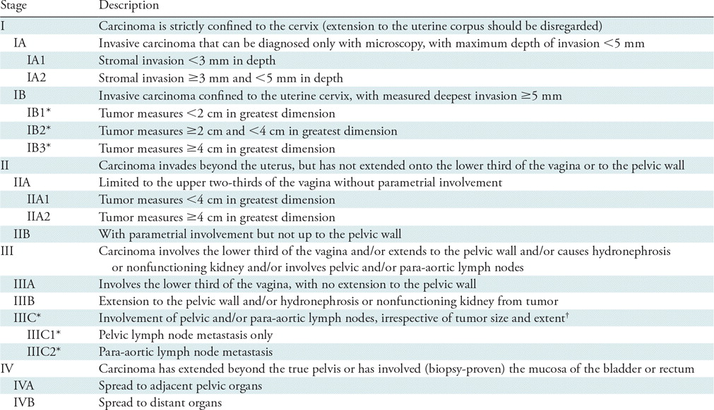
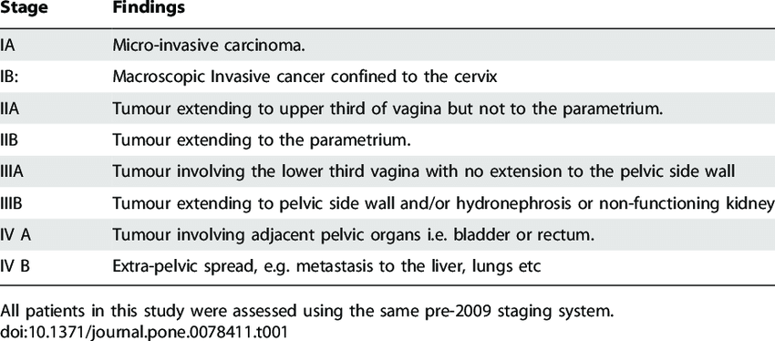

# FIGO stage for cervical cancer：cervix (1) ⇒ upper vagina / uterus (2) ⇒ lower vagina / pelvis (3) ⇒ bladder / rectum (4) 侵犯深度：1A1 ≤ 3mm ⇒ 1A2 ≤ 5 mm，大小：1B1 < 2cm ⇒ 1B2 < 4 cm 注意：先 pelvis ⇒ 才 bladder

## 內文

