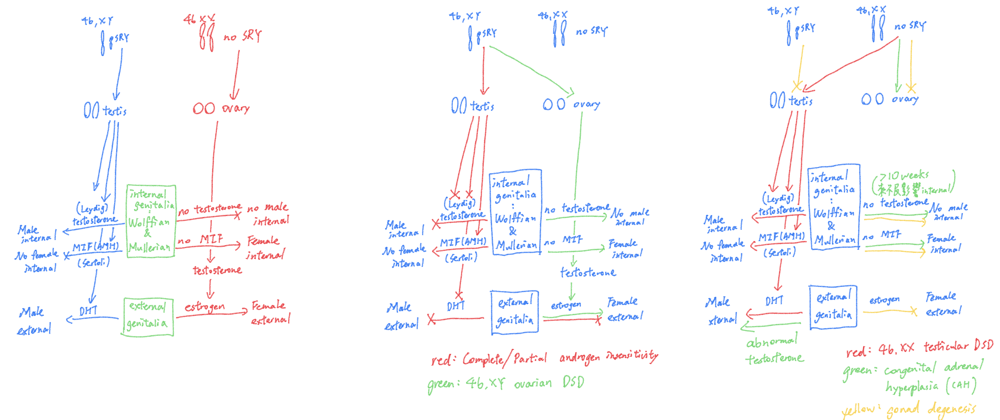

# Disorder of Sex Development (DSD)

## 內文

[NCBI - WWW Error Blocked Diagnostic](https://pubmed.ncbi.nlm.nih.gov/30803928/)

[[Disorder of Sex Development (DSD)/圖一：testis & ovarian pathway，上圈 mutation 導致 XY|摘要]]

[[Disorder of Sex Development (DSD)/圖二：sex hormone pathway，黃色部份 mutation 導致|摘要]]

- 注意：21 deficiency ⇒ Aldo 過少（CAH）；17 deficiency ⇒ Aldo 過多（Androgen deficiency）

1. chromosomal DSD: 染色體有問題，不是 46XX 或 46XY
   1. 45,X (Turner syndrome) ⇒ gonadal dysgenesis ⇒ amenorrhea
   2. 47,XXY (Klinefelter syndrome)
   3. 45,X/46,XY (mixed gonadal dysgenesis, sometimes a cause of ovotesticular DSD)
   4. 46,XX/46,XY (chimeric, sometimes a cause of ovotesticular DSD)
      - 注意：有 moscaicism 容易造成 gonaldoblastoma ⇒ 預防性切除
2. 46XX DSD : gonad / internal genitalia / external genitalia 有問題都算
   1. Androgen Exposure
      1. Congenital adrenal hyperplasia（圖二）
      2. Fetoplacental / Maternal Source (drug, tumor)
   2. Testicular DSD: SRY translocation to X chromosome + SOX9 duplication，使 gonad 莫名其妙變成睪丸（圖一）
   3. XX gonadal dysgenesis（圖一）
3. 46XY DSD : gonad / internal genitalia / external genitalia 有問題都算
   1. Androgen deficiency ( 產不出 androgen )（圖二）
   2. Androgen activity deficiency: Androgen receptor mutation ⇒ Complete / Partial androgen insensitivity syndrome
   3. XY gonadal agenesis（圖一）
4. Ovotesticular DSD（圖一）：真陰陽人
