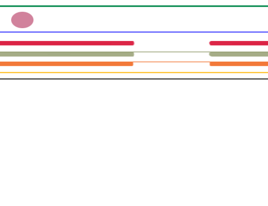

# Hernia

## 內文

1. [[Hernia/圖示|扁平]]
2. 生理學：testis 因為被 gubernaculum（即女性的round ligament）拉著，會拉著腹膜 （變成 tunica vaginalis）一起掉下來
3. Diseases：
   1. 拉得不夠下來 ⇒ cryptorchidism （隱睪症）：腹膜那層（綠色）上下連太緊，要手術進去斷開。就算睪丸在陰囊裡，只要不夠低不夠鬆都算是 cryptorchidism
   2. 腹膜中間通道有通，腸子直接從 internal ring 的洞裡凸出來 ⇒ direct hernia
   3. ovary 假裝自己是 testis，順著同樣的通道滑出腹腔 ⇒ sliding hernia
      - 注意：腸子在腹膜裡面，所以叫 direct hernia；卵巢在腹膜外面，所以叫 sliding（溜滑梯是在滑梯的外面、上面溜，而不是在滑梯裡面溜）
   4. 腸子另外找地方凸出來 ⇒ indirect hernia
