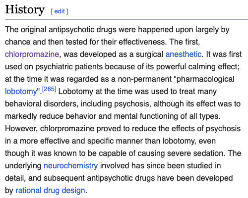

# Psychiatry

## 內文
[[Psychiatry/會談 （待補）|摘要]]

[[Psychiatry/Diseases|摘要]]

[[Psychiatry/Drugs（待補）|摘要]]

[[Psychiatry/國考相關|摘要]]

### 零星補充

先讀探索大腦的會談地圖（很重要）

一定要注意是否同時有生理疾病：內分泌（ex 失眠與甲狀腺有關）、神經（RBD、restless leg）

1. MDD with anxious distress容易偽裝成anxiety disorder

2. MDD的無力容易偽裝成 insomnia 導致的無力

3. 要聚焦Core symptom，drive、興趣都是湊 criteria 與開啟話題用的

4. 治好MDD以後盡快開始Taper BZD 用越久越難taper

5. Taper BZD的順序是安眠 => 抗焦慮（降階） 如果taper安眠受不了可以加一點抗焦慮

6. Anxiety disorder 最好還是 ssri 不過 BZD 病人才感覺有效 但病人會把不舒服歸咎於 ssri

小孩：如何去要東西（有沒有把你當空氣？

**三點式確認：看你 看想要的東西 再確認你有看到**

delusional perception: 杯弓蛇影

persecutory delusion

負性症狀：4A

alcohol: 分出 withdrawal or toxication, Lab data (electrolyte, liver?, ??)可用，確認 last spring, 有無其他 substance

congruent delusion:

incongruent delusion:

dopamine: reward

d-anhedonia, Parkinson-like

serotonin: happiness

d-OCD-like, impulsive

norepinephrine: energy, arousal

CBT: [https://www.centreofexcellence.com/shop/cognitive-behavioural-therapy-cbt-diploma-course-2/](https://www.centreofexcellence.com/shop/cognitive-behavioural-therapy-cbt-diploma-course-2/)

失眠 & 強迫症 心理治療比藥物有效
