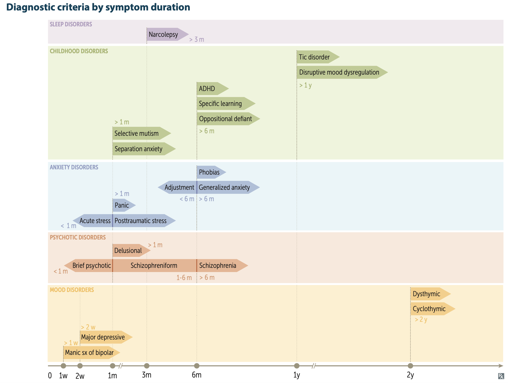

# Diseases

## 內文

[[Diseases/Schizophrenia|摘要]]

[[Diseases/Bipolar disorder|摘要]]

[[Diseases/Major depressive disorder|摘要]]

[[Diseases/Anxiety disorder|摘要]]

[[Diseases/Somatoform disorder 身體化症|摘要]]

[[Diseases/Personality disorder|摘要]]

[[Diseases/Delirium ⇒ 治 underlying，真的不得已可以用 anti-psychotic|摘要]]

[[Diseases/Autism spectrum disorder(ASD) 待補|摘要]]

[[Diseases/ADHD 待補|摘要]]

急診與病房：病房期望調藥與診斷 but 急診期望判斷 Risk
