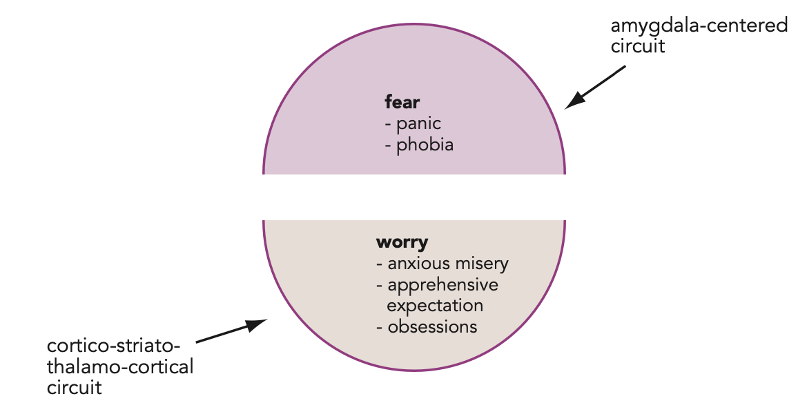
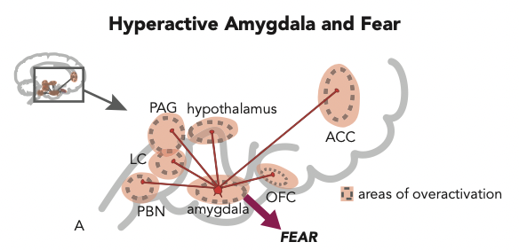
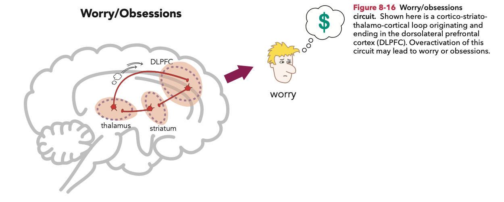

# Etiology: 古典制約(conditioning)

## 內文
1. Anxiety 可以分成區分成amygdala控制的<u>**fear**</u> & cortico-striatal 控制的 <u>**worry**</u>
   
2. Fear pathway: amygdala 支配其他腦區，產生一系列生理反應
   
   1. anterior cingulate cortex (ACC) & orbitofrontal
      cortex (OFC) ⇒ Affect(情緒) of fear
   2. periaqueductal gray (PAG) ⇒ motor response (僵住、逃跑)
   3. hypothalamus ⇒ endocrine response (HPA axis ⇒ cortisol)
   4. parabrachial nucleus (PBN) ⇒ breathing output (呼吸淺快、氣喘發作)
   5. locus coeruleus (LC) ⇒ autonomic responses (HR↑, BP↑)
      - 注意：locus coeruleus 釋放的 norepinephrine 除了有 autonomic function 之外，也會回傳到 amygdala 形成 hyperarousal(α1, nightmare, sweating, panic attack) & fear reconsolidation (β1)
   6. hippocampus ⇒ re-experiencing
3. Worry/obsesssions(強迫思考) circuit: cortico-striato-thalamo-cortical (CSTC) circuits
   
