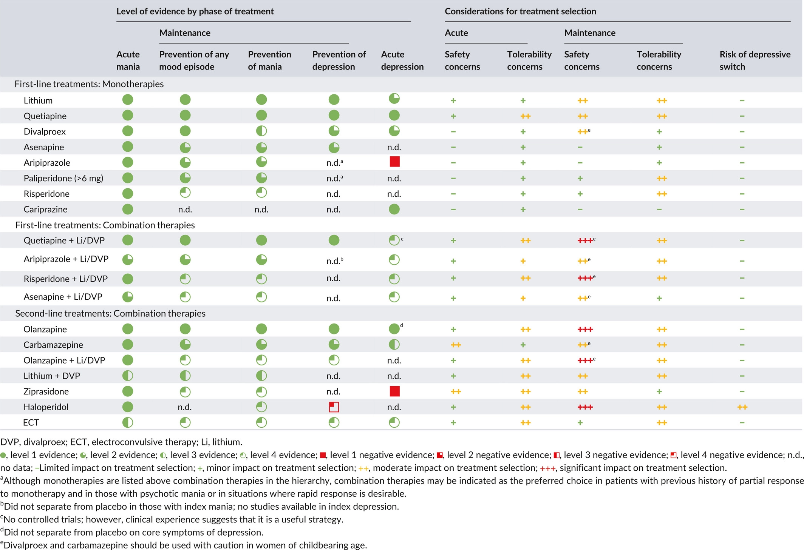
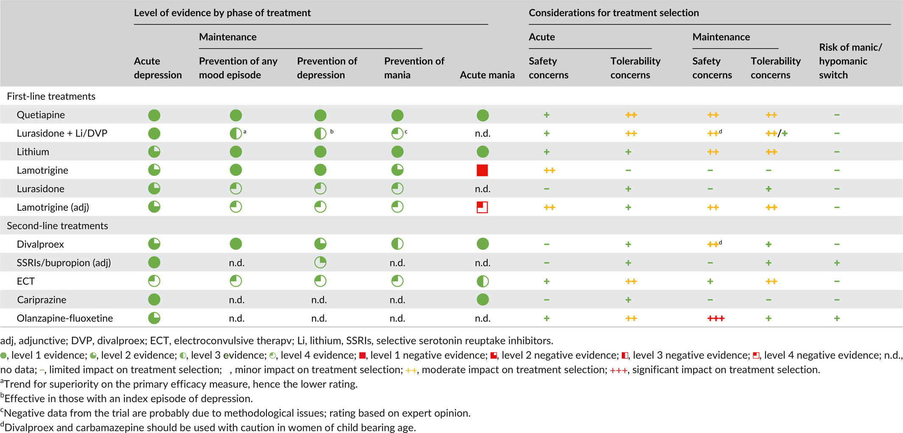
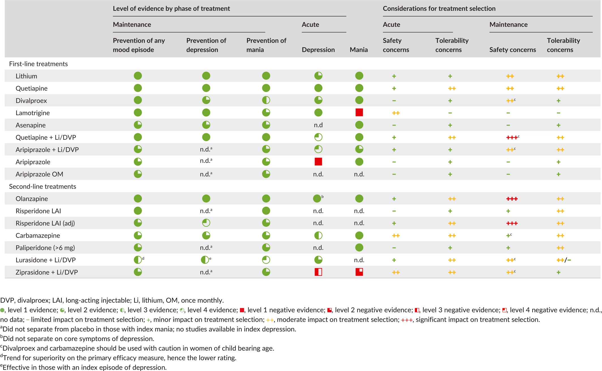

# Treatment: 區分 acute treatment(for ↓ suicidal & homocidal risk) & maintenance

## 內文
- 注意：非藥物治療的輔助很重要：Psychoeducation (PE), Cognitive behavioural therapy (CBT), Family-focused therapy (FFT), Interpersonal and social rhythm therapy (IPSRT)

1. Acute treatment for mania: <u>**mood stablizers**</u>(lithium, depakine, NO lamotrigine) <u>**& quetiapine**</u>(Seroquel) <u>**≥**</u> <u>**atypical antipsychotic**</u> (aripiprazole, cariprazine, paliperidone, risperidone, asenapine)

2. Acute treatment for depression in bipolar: **<u>quetiapine</u>**(Seroquel) **<u>≥ mood stablizers</u>** (lithium, lamotrigine) **<u>& lurasidone</u>**(Latuda) **<u>≥ other antipsychotics.</u>** <u>**No antidepressents alone.**</u>

3. Maintenance treatment: <u>**quetiapine**</u>(Seroquel) <u>**& mood stablizers**</u>(lithium, depakine, lamotrigine) <u>**≥ other atypical antipsychotics**</u> (aripiprazole, lurasidone, paliperidone, risperidone, olanzapine, asenapine)

Ref: [Canadian Network for Mood and Anxiety Treatments (](https://onlinelibrary.wiley.com/doi/10.1111/bdi.12609)[**CANMAT**](https://onlinelibrary.wiley.com/doi/10.1111/bdi.12609)[) and International Society for Bipolar Disorders (](https://onlinelibrary.wiley.com/doi/10.1111/bdi.12609)[**ISBD**](https://onlinelibrary.wiley.com/doi/10.1111/bdi.12609)[) 2018 guidelines](https://onlinelibrary.wiley.com/doi/10.1111/bdi.12609)
