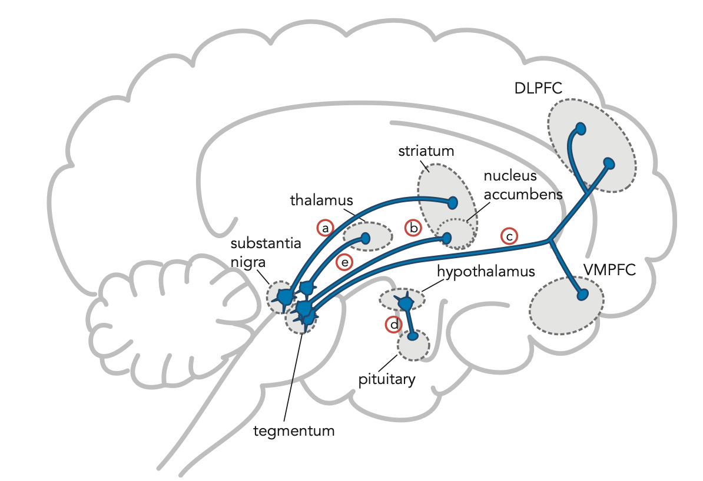

# Dopamine pathway

## 內文

1. **nigrostriatal** dopamine pathway: direct & indirect pathway, classical pathway for Parkinson’s
2. **mesolimbic** dopamine pathway: reward & motivation & pleasure, major cause of positive symptoms(delusions, hallucinations, impulsivity, aggression) in psychosis

   [[Dopamine pathway/nigrostriatal + mesolimbic ⇒ mesostriatal|摘要]]
3. **mesocortical** dopamine pathway: negative symptoms in schizophrenia
   1. **dorsolateral prefrontal cortex (DLPFC)**: executive functioning (cognitive symptoms)
   2. **ventromedial prefrontal cortex (VMPFC):** emotions(affective & mood symptoms)
4. **tuberoinfundibular** dopamine pathway: dopamine inhibit prolactin
5. **The fifth** dopamine pathway: function not yet understood
