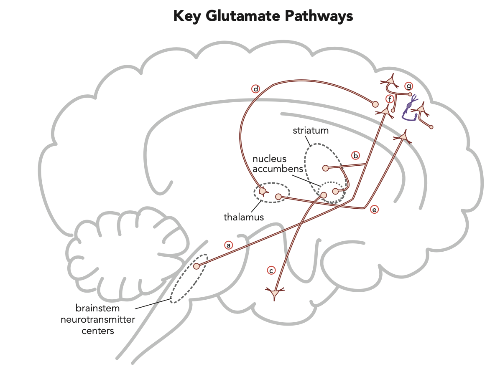

# Glutamate pathway

## 內文
mainly from cortex ⇒ brainstem neurotransmitter center ⇒ activates **mesolimbic** dopamine pathway & inhibits **mesocortical** dopamine pathway

**Psychosis in Dementia:** destroy some glutamatergic pyramidal neurons & GABAergic interneurons while leaving others intact ⇒ hyperactive of cortico-brainstem glutamate projection

**Psychosis in Ketamine/PCP:** block intracortical NMDA receptor ⇒ hypoactive of intracortical GABA interneuron ⇒ hyperactive of cortico-brainstem glutamate projection

