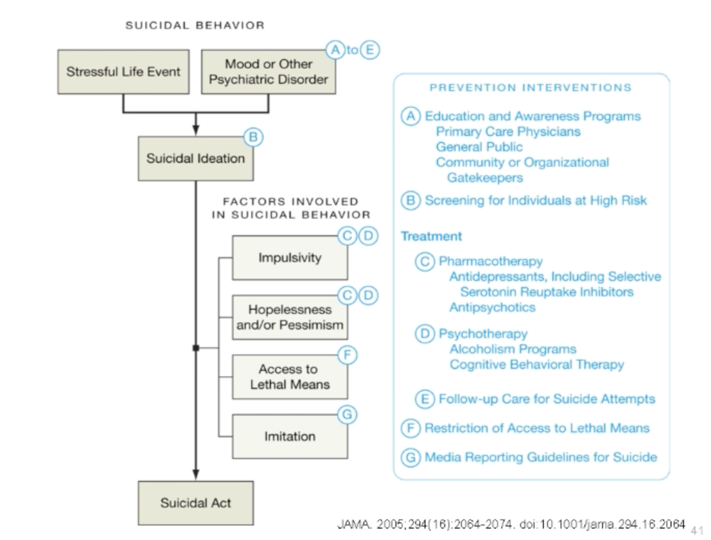

# 想法＆動機 ⇒ 自殺行為

## 內文

1. 人格特質 ex 容易衝動 、悲觀無助
2. 容易知道結束生命的方法：醫師、藥師、軍警、鐵路局員工
3. 模仿效應：讓沒想到的人想到原來可以這樣做

<u>**解決方法**</u>：把上面那些問題解決

1. 藥物治療
2. 心理治療：最好長期治療with固定治療，學會與他人的互動模式/界線，覺察、表達自己需求，處理負面情緒
3. 把危險區域、物品隔開 ex 鐵絲網 農藥，因為大部分自殺的人往往是一時衝動、衝動過了就沒了
4. 避免模仿效應
