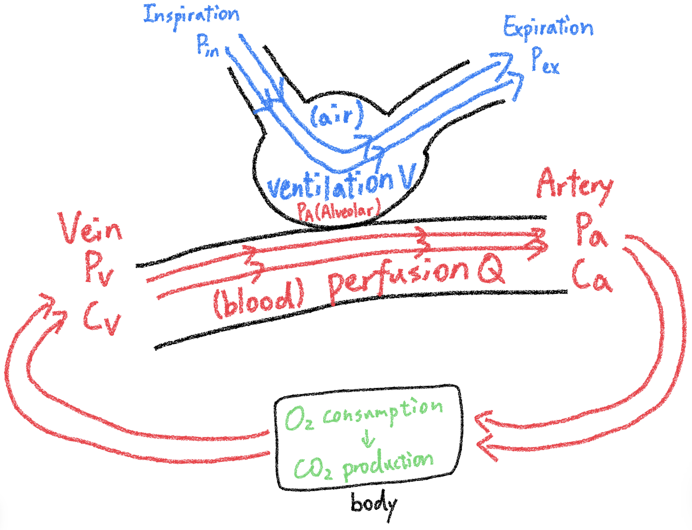

# Gas Dynamic

## 內文

### 參數介紹

1. Content (C，含量)：血液中所含某氣體的**<u>含量</u>**，單位為 ml/dl
2. Pressure (P，分壓)：血液中、空氣中所含某氣體的**<u>分壓</u>**，單位為 mm-Hg
3. Content 與 Pressure 的關係
   1. 對於二氧化碳而言，可以看成 $C_{CO_2} \propto {P}_{CO_2}$（實際上並不完全是，也與酸鹼度、溫度、氧氣濃度有關）

      [[Gas Dynamic/CCO2 與 PCO2 的關係|摘要]]
   2. 因為氧氣大多溶於血紅素中，因此 $C_{O_2}$ 與 ${P}_{O_2}$ 並非簡單線性關係：
      - $C_{O_2} = {O_2}_{binded} + {O_2}_{unbinded} = S_{O_2} * Hb * 1.34 + P_{O_2}*0.0031$
        - $S_{O_2}$ (Saturation) 即血紅素與氧氣的結合率
        - 1.34 代表平均 1 g Hb 會攜帶 1.34 ml 的 $O_2$

      [[Gas Dynamic/SO2 與 PO2 的關係：注意溫度升高、血液變酸時曲線會右移|摘要]]

### 理想氣體方程式

對於任何氣體而言，透過呼吸從空氣中 獲得 / 排出 的量，必然等於血液中 增加 / 減少 的量

此關係可以用理想氣體方程式所表達：

$$
P\dot V = \dot n RT
$$

1. 左邊第一項 $P = P_{in} - P_{ex}$ 即為從空氣中 獲得 / 排出 的氣體（分壓）
   1. 從空氣中獲得的氧氣為 ${P_{in}}_{O_2} - {P_{ex}}_{O_2}$
      - ${P_{in}}_{O_2} = FiO_2 * (P_{atm} - P_{H_2O}) = 0.21 * (760 - 47) = 150$
   2. 從空氣中排出的二氧化碳為 ${P_{ex}}_{CO_2} - {P_{in}}_{CO_2}$
      - ${P_{in}}_{CO_2} = 0$
2. 左邊第二項 $\dot V = RR (V_T - V_D)$ 即為單位時間內的通氣量
   1. $RR$ (Respiratory rate) ：每分鐘呼吸次數
   2. $V_T$ (Tidal volume)：平均一次吸氣所吸進的氣體體積
   3. $V_D$ (Dead space)：吸進去了，但是留在氣管等地方導致沒參與氣體交換的氣體體積
3. 右邊第一項 $\dot n = Q(C_{a} - C_{v})$ 即為單位時間內血液 增加 / 減少 的氣體（數量）
   1. $\dot n$ 亦為身體 消耗 / 產生 的氣體數量
      1. 身體消耗氧氣的數量 ${O_2}_{consumption} = \dot n_{O_2}$
      2. 身體產生二氧化碳的數量 ${CO_2}_{production} = \dot n_{CO_2}$
      3. 定義 RQ (respiratory quotient) 為 $RQ = \frac{{CO_2}_{production}}{{O_2}_{consumption}} = \frac{\dot n_{CO_2}} {\dot n_{O_2}}\approx 0.8$，即身體每消耗一個氧氣會生成 0.8 個二氧化碳
   2. $Q \propto$ Cardiac Output，也和血管自身狀況有關
   3. $C_{a} - C_{v}$ 代表氣體溶於血液後在血液中增加的量
      1. 氧氣增加的量為 ${C_{a}}_{O_2} - {C_{v}}_{O_2}$
      2. 二氧化碳減少的量為 ${C_{v}}_{CO_2} - {C_{a}}_{CO_2}$

可以看出式子左邊的 $P\dot V$ 與肺泡中的氣體有關，右邊的 $\dot n RT$ 與血液中的氣體有關

### 將氧氣 & 二氧化碳分別帶入

$P\dot V = \dot n RT$ **方程式**

$\begin {cases}
({P_{ex}}_{CO_2} -0) \dot V = {CO_2}_{production} RT= Q  ({C_{v}}_{CO_2} - {C_{a}}_{CO_2}) RT \\
({P_{in}}_{O_2} - {P_{ex}}_{O_2}) \dot V  = {O_2}_{consumption} RT= Q  ({C_{a}}_{O_2} - {C_{v}}_{O_2}) RT
\end {cases}$

- 正常狀態下假設 $P_a = P_A = P_{ex}$（詳情見後面 Fick’s law）

1. 第一式可以改寫為
   $$
   {P_{A}}_{CO_2} = {P_{ex}}_{CO_2} = \frac{{CO_2}_{production} RT}{\dot V}
   $$
   即呼出的二氧化碳濃度與單位時間內的通氣量 $\dot V = RR (V_T - V_D)$ 成反比，與二氧化碳生成量 ${CO_2}_{production}$ 成正比
2. 將兩式相除可得 $\frac{{P_{ex}}_{CO_2} }{{P_{in}}_{O_2} - {P_{ex}}_{O_2} }= \frac{{CO_2}_{production} RT}{{O_2}_{consumption} RT} = RQ$ ，進一步簡化 ⇒
   $$
   {P_{A}}_{O_2} = {P_{ex}}_{O_2} = {P_{in}}_{O_2} - \frac{{P_{ex}}_{CO_2}}{RQ} = FiO_2 * (P_{atm} - P_{H_2O}) -  \frac{{P_{A}}_{CO_2}}{RQ}
   $$
   此式稱為 **<u>Alveolar gas equation</u>**
3. 這兩式提取出 $\frac{\dot V}{Q}$ 可以寫成
   $$
   \frac{\dot V}{Q} = \frac{({C_{v}}_{CO_2} - {C_{a}}_{CO_2}) RT}{({P_{ex}}_{CO_2} -0)} = \frac{({C_{a}}_{O_2} - {C_{v}}_{O_2}) RT}{({P_{in}}_{O_2} - {P_{ex}}_{O_2}) }
   $$
   若簡單的假設 $C_{CO_2}\propto {P}_{CO_2}$、$C_{O_2}\propto {P}_{O_2}$（這個假設顯然很多錯誤，但夠用了），可以推出與課本上相似的 V/Q mismatch 圖形

   [[Gas Dynamic/我的模擬圖 對比 網路上的圖|摘要]]
   1. 當 $\dot V = 0$ 時稱為 Shunt，即有血液但無氣體到達的地方，此時 $C_{a} - C_{v} = 0$
   2. 當 $Q = 0$ 時稱為 Dead space，即有氣體但無血液到達的地方，此時 $P_{in} - P_{ex} = 0$

### 其他參數：

$D_LCO$、A-a gradient

1. 肺泡與血管間其實有隔閡，而氣體經由擴散而通過的速度遵守 **<u>Fick’s law</u>：**
   $\dot V_{gas}  =  \frac{AD}{\Delta x}\Delta P = D_L \Delta P$ 。其中 $D_L =  \frac{AD}{\Delta x}$ 即為**<u>擴散係數</u>**
   1. A 為表面積，D 為物質本身的擴散常數，$\Delta x$ 為隔閡厚度，$\Delta P$ 為兩側分壓差
      ⇒ 影響 $D_L$ 的因子有：
      1. ILD、Fibrosis 讓厚度變厚 ⇒ $D_L$ 下降
      2. Emphysema 讓交換表面積變小 ⇒ $D_L$ 下降
      3. 運動讓 $D_L$ 上升（不知道為啥）

      [[Gas Dynamic/擴散進去以後還需要與紅血球結合，不過因為結合率 theta 太高了所以就當作沒差|摘要]]
      - 擴散常數 $D \propto \frac{Sol}{\sqrt{M.W.}}$，其中 Sol 為溶解度，M.W. 為分子量
   2. 不同氣體有不同的 $D_L$
      1. $D_L$ 大的氣體很容易穿透肺壁 ⇒ 交換效率取決於血液流量，稱為 **<u>perfusion-limited</u>**
      2. $D_L$ 小的氣體不容易穿透肺壁 ⇒ 交換效率取決於擴散速度，稱為 **<u>diffusion-limited</u>**
         - 因為 $D_L$ 通常不變，所以唯一增加擴散速度 $\dot V_{gas}$ 的方法是增加壓力差 $\Delta P$
      3. 二氧化碳的 $D_L$ 很大 ⇒ 二氧化碳為 perfusion-limited gas
      4. 正常人氧氣的 $D_L$ 算大 ⇒ 氧氣為 perfusion-limited gas ⇒ 增加 Cardiac Output 可以增加氧氣供給
      5. $D_L$ 下降太多的病人 ⇒ 氧氣為 diffusion-limited gas ⇒ 增加 Cardiac Output 無法增加氧氣供給，要給高壓氧
      6. CO(一氧化碳) 的 $D_L$ 很小，較好測量，因此都用 $D_LCO$ 當做擴散指標
   3. 對於正常人而言，$P_a = P_A = P_{ex}$（即氧氣、二氧化碳都是 perfusion-limited gas，肺壁兩側氣體完全交換）

   [[Gas Dynamic/Fick's law 圖示|摘要]]
2. **<u>A-a gradient</u>**：什麼人的 ${P_{A}}_{O_2}> {P_{a}}_{O_2}$ ？
   1. $D_L$ 太小 ⇒ 氧氣還沒交換完
   2. $\dot V/Q$ mismatch ⇒ 有部分血管沒交換到氧氣

   [[Gas Dynamic/↑ A-a gradient and Normal A-a gradient|摘要]]
