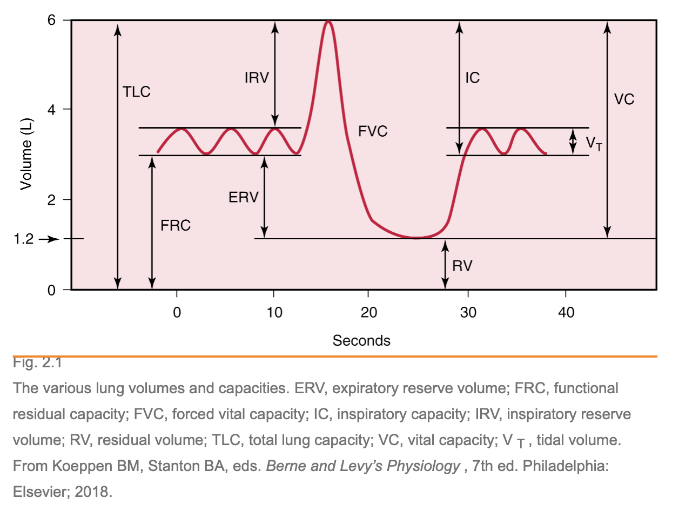
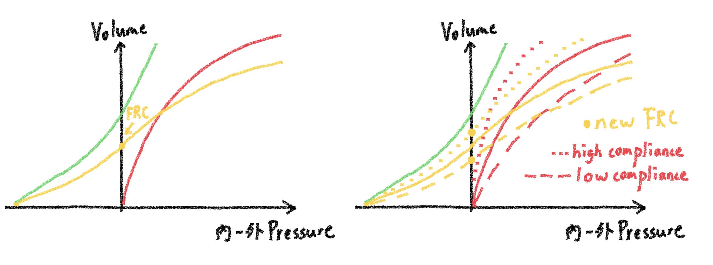
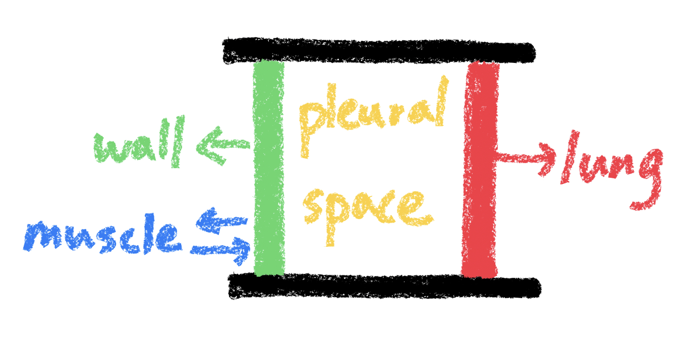
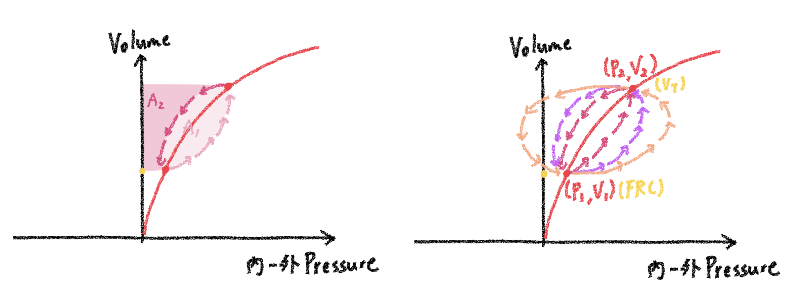
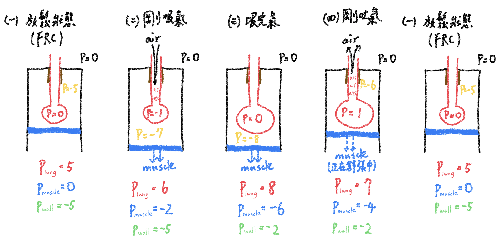
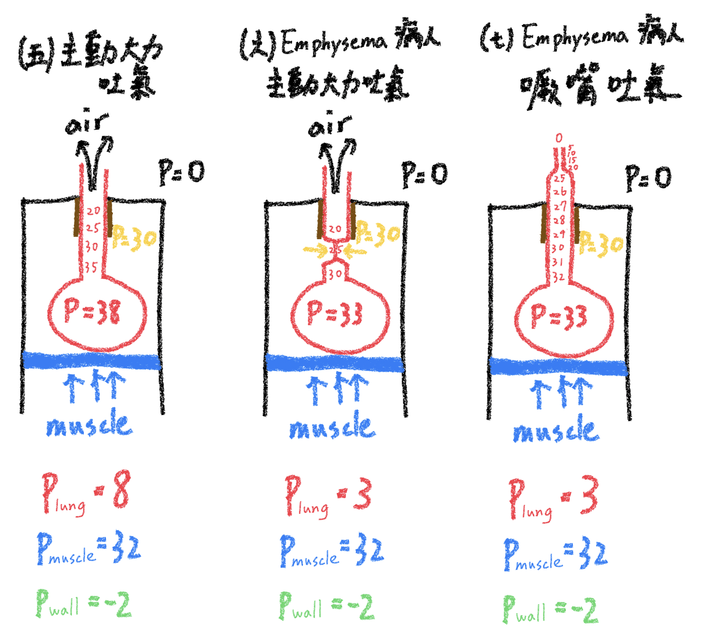

# Mechanical dynamic

## 內文
### Lung volumes

### P-V curve 與 compliance （靜態的肺）

1. 肺的運動由內外兩層組成：外層是 chest wall，內層是 lung。
2. 這兩層結構各自有各自的 compliance，如上面的 P-V 圖
   1. chest wall 的 compliance 曲線為綠色
   2. lung 的 compliance 曲線為紅色：Pressure < 0 時肺泡就會塌縮，因此就沒有體積
   3. 黃色曲線為 chest wall + lung 兩條曲線的總和
3. 黃色線的 P = 0 點為 FRC，但注意此時並非沒有受力，而是 lung 往內的力會與 chest wall 往外的力拔河，形成平衡（如下圖）
   
4. 某些疾病會影響到 lung 的 compliance：
   1. ILD、Fibrosis 會增加 lung 的 compliance（讓肺變硬）
   2. emphysema 會破壞 lung 的 compliance（讓肺變軟、脆弱）

### P-V loop 與 hysteresis (Work of Breathing)（動態的肺）

1. compliance 並非單純的一條曲線；在吸氣與呼氣時會是不同的曲線（以上左圖為例）
   1. 吸氣時是淺粉色箭頭：外力做功 $W = \int F ds = \int P dV= A_1 + A_2$
   2. 吐氣時是深粉色箭頭：lung 回彈時會釋放的能量 $W = \int F ds = \int P dV= A_2$
   ⇒ 即一次呼吸（吸 + 吐）總做功為 $A_1$
2. 影響 P-V loop 面積的因素：
   1. 肺的表面張力：surfactant 不夠的話會需要額外施力來打開與擴大肺泡
   2. Restrictive lung disease：同樣 volume 下需要更多的 pressure，相當於 P-V curve 跟P-V loop 面積一起橫向放大
   3. Obstructive lung disease： airway 本身的 resistance 即會消耗能量
   ⇒ 對於這些病患而言，想吸進同樣體積的空氣，需要花更多的能量

### 呼吸循環的細節

1. 吸氣：muscle 施力讓 chest wall 擴張，讓 pleural space 壓力變更負
   ⇒ 肺泡內壓力變成負壓，於是空氣流入肺泡
   ⇒ 肺泡擴張，直到肺泡內壓力變成 0 (擴張的量要遵守 P-V curve)
2. 輕鬆吐氣：muscle 漸漸放鬆，讓 pleural space 壓力沒有那麼負
   ⇒ 肺泡內壓力變成正壓，於是空氣流出肺泡
   ⇒ 肺泡回彈，直到肺泡內壓力變成 0 (回彈的量要遵守 P-V curve，不過吐氣結束以後會回到 FRC)
   
3. 大力吐氣：muscle 往內大力推，讓 pleural space 變成正壓，如上圖
   ⇒ pleural space 內的正壓大力擠壓肺泡與氣管，於是空氣流出肺泡
   注意：因為氣管內會形成氣體的梯度，因此在某個點（稱為 end pressure point）以後氣管內的壓力會小於 pleural space 的壓力
   1. 對於正常人而言，end pressure point 以上的地方都有氣管軟骨保護，因此沒問題
   2. 對於 emphysema 的病人而言，end pressure point 在沒有氣管軟骨保護的位置，因此巨大的 plerual pressure 會把這一段氣管壓扁，讓吐氣更困難
   3. 解法：噘嘴吐氣，這樣就可以讓 end pressure point 到達有氣管軟骨保護的位置

[[Mechanical dynamic/一次呼吸循環在課本上的示意圖|摘要]]
