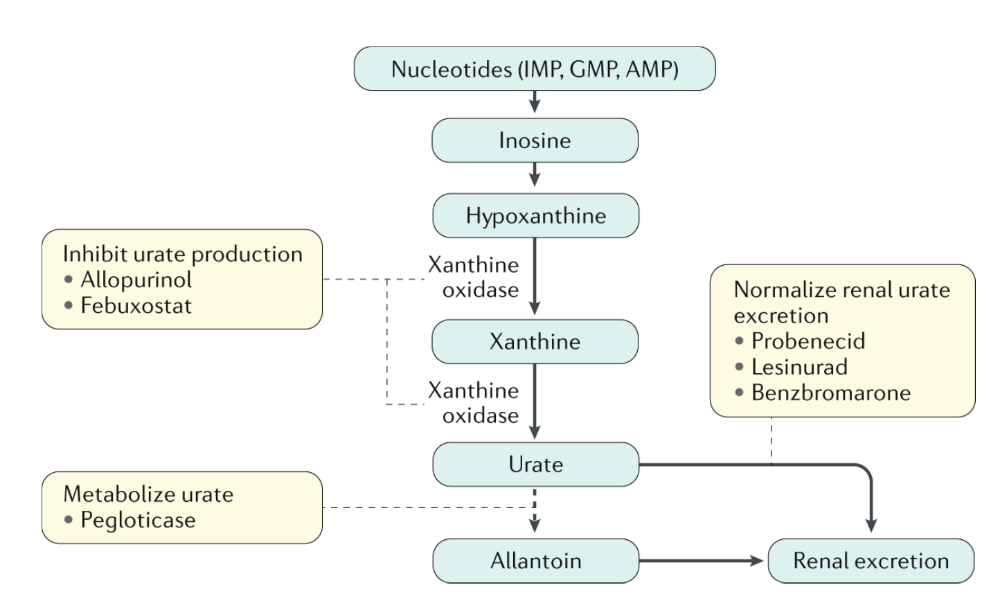

# Gout: genetic disease，腎臟排尿算出問題 ⇒ 高尿酸血症 ⇒ 尿酸沉積在關節液，飲食調整有幫助但有限

## 內文
- 注意：Pseudogout — calcium phosphate deposit in big joint（acute phase 治療一樣）

1. 何時開始治療：
   1. > 7 mg/dL + 高尿酸血相關疾病（gouty arthritis / tophi / urinary stone）
   2. > 9 mg/dL + 非高尿酸血相關慢性疾病（CKD, HTN, DM, CAD, Metabolic syndrome）
   3. ≥ 10 mg/dL ⇒ 全部建議治療
   4. 低尿酸 (<7 mg/dL) 也可能有 gout attack，高尿酸也可能沒有，但 gout attack 發生機率與血中尿酸有高度正相關
2. 急性期治療：**Anti-inflammation（此時不需降尿酸**，會更嚴重；可能是因為會暴露更多尿酸結晶表面出來**）**
   1. **NSAIDs, Colchicine, Steroids**
3. 慢性期治療：降尿酸，Start low go slow，需等急性期完全結束
   
