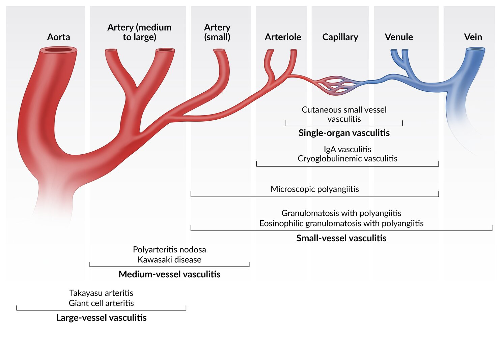

# Vasculitis

## 內文
corticosteroid ± cyclophosphamide (Giant cell arteritis 可用 MTX)

Lab: ESR, CRP, anemia, antibody if related

idiopathic, autoimmune, infection(ex: HCV)

IC 沈澱相關 (immune complex)：ANCA類、IgA (HSP)、Cryoglobulinemia、Polyarteritis nodosa

### Large vessel disease

1. Giant cell arteritis 頸動脈分支
   1. 伴隨 **polymyalgia rheumatica**
   2. constitutional symptom + **<u>headache</u>** + Jaw claudication （頭部血管都有影響 ex: **眼**）
   3. macrophage ⇒ giant cell (granuloma) ⇒ intima 發炎爛掉
2. Takayasu arteritis 主動脈弓
   1. **pulseless brachial and radial a. & 左右手血壓差大**
   2. Granulomatous inflammation of the aorta and its major branches

### Medium vessel disease

1. Kawasaki disease ⇒ aspirin + IVIG
2. Polyarteritis nodosa：HBV HCV related **IC 沈澱** ⇒ GI, renal, cardiac arteries & aneurysm

### Small vessel disease

1. Granulomatosis with polyangiitis: **c-ANCA (anti-PR3)**, Wegener
2. Eosinophilic granulomatosis with polyangiitis: **p-ANCA (anti-MPO)**, Churg-Strauss ⇒ 氣喘、過敏性鼻炎、神經炎
3. Microscopic polyangiitis: **p-ANCA (anti-MPO)**, no granuloma
4. IgA vasculitis: HSP(Henoch-Schonlein purpura)
   1. 上呼吸道感染 ⇒ **IC 沈澱**
   2. supportive care 就好，嚴重給steroid
5. Cryoglobulinemic vasculitis

### Variable vessel disease

1. Behcet disease：HLA-B51, recurrent painful oral & genital ulcer, uveitis
2. Cogan syndrome
