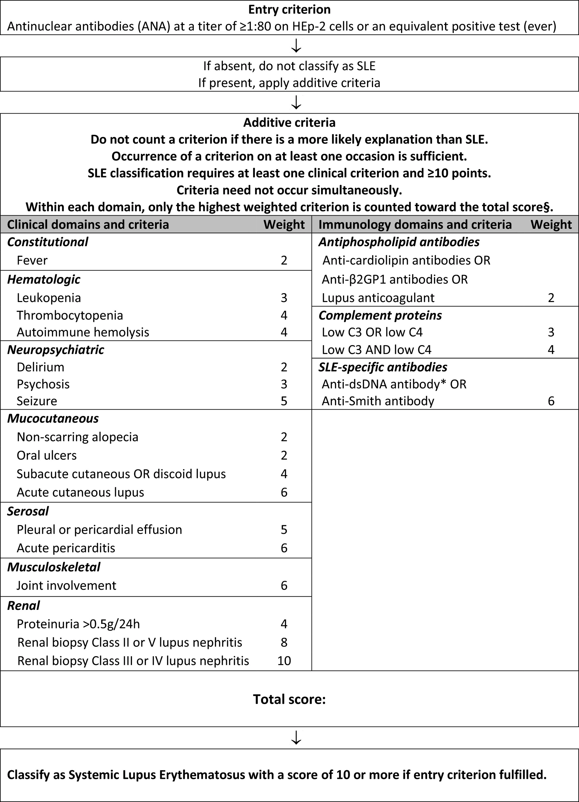

# Special cases

## 內文
Edema

1. BPH / sympathomimetic / anti-cholinergic / post-operative / alcohol / UTI ⇒ acute urine retention ⇒ Hydronephrosis

Secondary hypertension

pulse abnormality

hypervisicosity: [Hyperviscosity Syndrome | Tulane University School Medicine Critical Care Project (ccproject.com)](http://tulane.ccproject.com/hyperviscosity-syndrome/)

SLE Eular guideline

