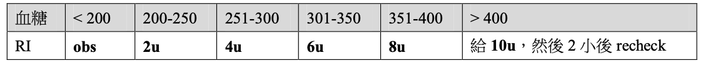
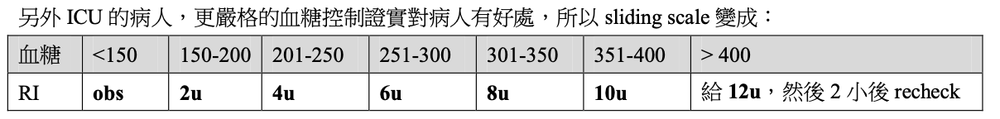

# 值班會用到的血糖控制

## 內文
1. Blood Suger = <u>125 + (HbA1c % -6) x 30</u> or <u>100 + (</u><u>HbA1c % -5</u><u>) ×35</u>
2. Regular insulin 1U 約可以降 25 mg/dL 血糖或 5~15 g 葡萄糖（給 D5W 時可以計算一下）
3. Sliding scale：因為是量完馬上給，所以對病人比較不好，長期下來還是要好好調藥
   
   
4. 住院血糖持續 ≥ 180 mg/dL，建議開始使用胰島素 ⇒ 訂定個人化血糖目標（ex: AC < 150）
5. 測血糖時機：若血糖高，請先確認進食時間和測血糖的時間。
   1. 用口進食：TIDAC （餐前）+ HS
   2. 管灌進食（一天灌五或六次管灌營養品）：可測 1、3、5 餐和睡前
   3. 禁食：每 4-6 小時測量血糖一次。
      - 通常在禁食時應停止速效胰島素使用，但仍建議長效胰島素繼續使用原先 80% 左右的劑量，較符合生理所需。
