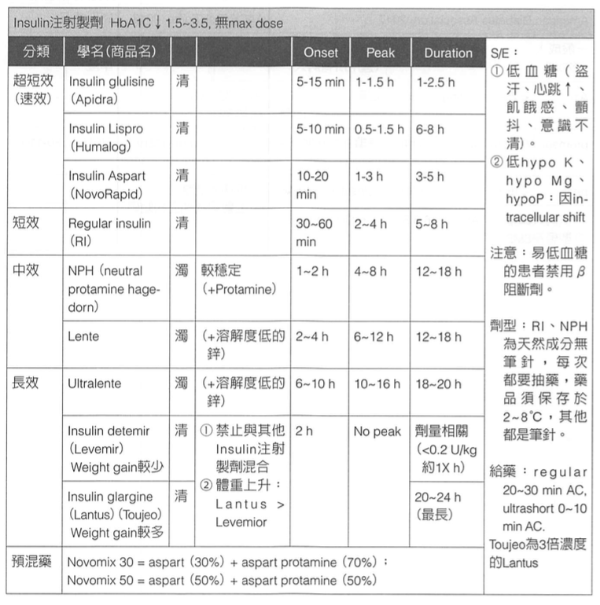

# 糖尿病藥物個論

## 內文
1. Metformin：很棒，增加 insulin sensitivity，降 MI、便宜、可抑制食慾
   1. 腎功能不好者會 lactic acidosis：Cre > 4 停用、AKI / ACKD 停用、Cre > 1.5 要小心但可用
   2. If eGFR 30–60，做 CT(w/ 含碘 contrast) 前後兩天要暫停使用
   3. 副作用 GI upset 是 dose dependent ⇒ 可以考慮先減量而不是完全停掉
2. SGLT2i：神藥，insulin independent，保護 CKD(不管嚴重程度) / HF 用藥，但會 DKA / UTI
   1. eGFR ≥ 20 前都可以開始用，用到開始洗腎 or 移植
3. GLP-1 RA、Incretin（GLP-1 & GIP）：由腸子 K cell/L cell 偵測 glucose 分泌，由 DPP4 分解，促進胰島素分泌、抑制升糖素分泌、抑制胃排空、抑制食慾，因此促進體重下降。非常安全的降血糖藥
4. DPP4i：不會增加體重，單獨使用時，較少發生低血糖
   1. 可能產生輕微感染如鼻咽炎及產生急性胰臟炎等副作用
   2. 除了linagliptin外，均需根據腎功能減少劑量
5. TZD 保存 beta cell，減少 stroke、MI 但增加 HF（edema）、fracture、weight gain
   1. TZD 促進肌肉利用血糖
   2. 容易 edema，因此雖然藥是肝代謝，但是腎差的不要亂用
   3. 在容易腫的病人身上可以考慮減半
   4. Fluid overload（例如 pulmonary edema）、HF（NYHA Fc III-IV）、肝功能異常禁用
   5. 單純的 MI（沒有合併 pulmonary edema）則不需禁用
   6. 效果慢（需幾個禮拜才見效，6-12週最大療效），長期用有好處，但住院中緩不濟急
6. Insulin：只有 Regular insulin & NPH 是真正的 insulin，其他都是 analog
   
7. [[糖尿病藥物個論/其他：老藥，但沒有 Guideline 在用了|扁平]]
