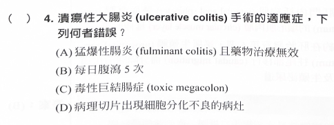

# 國考豆知識

## 內文
- 看清楚題目：問的是手術適應症，不是大腸癌症
  

重要的 Score: Child-Pugh, cha2ds2-vasc, Bishop, Apgar

electrolyte 正常值：Na 136~144, K 3.7~5.1, Ca 8.5~10 or 2.1~2.5

低血鉀、高血鈣 ⇒ 無力，高血鉀 ⇒ 心律不整，低血鈣 ⇒ 痙攣

低血鉀 ⇒ 腸阻塞

X-link: OTC deficiency, G6PD deficiency, Lesch-Nyhan syndrome (HGPRT defect), Fabry disease, Hunter disease, Duchenne and Becker muscular dystrophies, hemophilia, Bruton agammaglobulinemia, SCID, Adrenoleukodystrophy

α-blocker 血管舒張 (易姿勢性低血壓) β-blocker 心跳放慢

**QT prolong** ( ⇒ torsade ): **低鉀 低鈣 低鎂 低甲狀腺 低體溫 抗心律不整 quinolone 抗精神 顱內出血**

torsade 治療：MgSO4, isoproterenol (跳得快可以縮短QT), overriding pacing (90~110, 跳得快可以縮短QT), 矯正原因

高頻聲音：機械性腸阻塞時小腸（無動性阻塞聲音小）、心包膜炎時 friction rub

不管哪種心衰竭，BNP 都會上升

右心室梗塞禁止 NTG 要 hydration

嗎啡：1. 止痛 2. 使消化道平滑肌收縮，抑制胃及腸道運動，減少胃液膽汁及內臟液之分泌，提高肛門括約肌緊張，綜合以上作用而呈強烈止瀉作用 ⇒ spasm of the sphincter of Oddi 時不可用

[[國考豆知識/呼吸音|摘要]]

[[國考豆知識/心音|摘要]]

[[國考豆知識/腫瘤相關|摘要]]

[[國考豆知識/內分泌相關|摘要]]

膽鹽溶石劑 (ursodeoxycholic acid, UDCA) 適應症：Cholesterol Stone 之溶解 ， pigmented stone (calcified stone) 無效。 石頭大小 <1.5 cm 。 膽道通暢無阻塞 。

nonselective β -blockers 可以降低 portal vein 壓力 (預防 EV bleeding)

Helicobacter pylori 治療四週後追蹤（停PPI 七天後吹氣）

[[Liver & GI/Pancreatitis/Ranson Score for acute pancreatitis prognosis|摘要]]

[[Hema/Anemia/重要參數：RPI RDW serumFe Ferritin TIBC %saturation Hb/RPI (造血能力)= RI (Reticulocyte 數)／ 校正數字 (1.02.5)|摘要]]

MCV: 指每個 RBC 的平均體積, MCH: 指每個 RBC 內所含 Hb 的平均量 = Hb / RBC count (個/cc), MCHC: 指 每升 RBC 中平均所含 Hb 濃度 = Hb / Hct (%)

先天性血友病 關節易出血；後天性血友病 皮膚黏膜出血

VWD & uremic bleeding 可以給 estrogen 止血

Xanthoma 的 risk factor 包括高血糖、高 cholesterol、高 TG 、 甲狀腺低下 、 primary biliary cirrhosis 以及 cancer 等 ， 主要分布於關節 、 四肢伸側及肌腱處

降低 HAP 風險：抬 30-45 度避免嗆咳

增加 HAP 風險：胃藥、插管、鎮靜/麻醉

urticaria ⇒ anti-histamine (H1 > H2)

anaphylactic shock ⇒ epinephine + 輸液

urticaria vasculitis ⇒ steroid, colchicine, hydroxychoroquine

chronic urticaria ⇒ anti-histamine, hydroxychoroquine, cyclosporine, anti-IgE(omalizumab)

HLA-DR2: Goodpasture’s、MS

HLA-DR3: Graves’s、MG、SLE、PSC

HLA-DR4: RA、PV

HLA-DR5: Hashimoto’s

在 ileum 吸收的東西有：bile acid、B12

其他都在 jejunum

肝病病人使用腎毒性藥物易達到中毒的劑量，這類病人最好**避免使用 aminoglycosides**(i.e. tobramycin etc.)

自發性腹膜炎：單菌種，不須考慮厭氧，GNB (E.coli) > GPC 但抗生素都要加

mesenteric angina：腸半缺血，吃完兩小時會痛

內痔流血 外痔癢痛

先橫膈 ⇒ 食道胃交界

HBV DNA 才重要 HBV RNA 不重要

多房性包蟲囊腫 ⇒ Echinococcus 蜂巢狀 Cyst

脂肪肝 CT 暗 echo 亮

hepatic vein thrombosis 可以肝移植，但是 portal vein thrombosis 不行

<u>**急性膽囊水腫：膽道塞住、細菌感染、寄生蟲感染、病毒性肝炎、血管炎、sickle cell / thalassemia、長期禁食、壞死性腸炎**</u>

不會急性膽囊水腫：Reye syndrome 、 cystic fibrosis

IgA 兩三天 PSGN 一個月

NTM rapid grower: abscess, c, f (avium 是 slow)

肌肉放鬆劑 ex: α-blocker, β-agonist, CCB, BZD 減少 LES 收縮力 增加 GERD 機率

飯前：PPI, quinolone

飯後：NSAID（降副作用）, metformin（降副作用）

Aspirin, Keto, Indomethacin, Naproxen 傷腸胃 不傷心臟

COX-2 inhibitor (celecoxib), Ibuprofen 傷心臟 不傷腸胃

其他 NSAID 介於中間

thymoma 相關：myasthenia gravis, superior vena cava syndrome, pure red cell aplasia, Good syndrome

myasthenia gravis(proximal muscle weakness): Avoid drugs affects neuromuscular junction ex: aminoglycosides, fluoroquinolones, mood-stablizer, 麻醉藥

[[國考豆知識/心臟核醫掃描座標；SPECT 看血流 F-18 FDG 看心肌死了沒 (休眠算活著)|摘要]]

Castell's sign: splenomegaly

[[國考豆知識/原發性 varicose vein ⇒ 家族史；次發性：深層靜脈問題 ⇒ 靜脈高壓 ⇒ 淺也有問題了|摘要]]

AF 風險因子包含: 高血壓、 糖尿病、心血管疾病、AF 家族史、肥胖、睡眠呼吸問題，部分病人也與甲狀腺亢進、急性酒精中毒、肺栓塞、MI 有關

右心衰竭時，BNP 也會增加

furosemide ⇒ 高尿酸血症

外傷、高血壓、懷孕、bicuspid aortic valve、感染、marfan / Ehlers-Danlos ⇒ acute aortic syndrome

[[國考豆知識/refered pain 肩 ⇒ 橫膈：左肩 心、胸、脾。右肩 肝膽|摘要]]

electrical alternans ⇒ cardiac temponade

pulsus alternans ⇒ left heart failure

pulsus paradoxus

Kussmaul's breathing：酸中毒、橋腦傷

Cheyne-Stokes：兩側大腦損傷、CHF、**central sleep apnea**

Kussmaul's sign：吸氣 JVP上升 ⇒ pericarditis（temponade 不會有，要 RV 真的很硬）

cardiac tamponade：**Beck's triad** (低血壓 + **JVP** 上升 + **distant heart sounds)**

運動心電圖可以診斷 ACS 但是靜態不行

EF < 35% + NYHA class 2/3 ⇒ ICD （class 4 可能要想一下，一直電不太好）

KatG、inhA ⇒ 抗 INH

NSAID-induced pulmonary eosinophilic syndrome ⇒ bronchoalveolar lavage

呼吸器相關：病人頭部抬高30~45度

vitamin C 增加尿中草酸濃度

AIN ⇒ 輕度蛋白尿 & 血尿，大部分無症狀

tolvaptan、ACEi、ARB 治 ADPKD

ADPKD 常合併 MVP

FSGS：ACEi / ARB 、steroid (primary FSGS)

anti-resorptive drugs 可以預防壓迫性骨折

甲狀腺指標看 Tg

lipodystrophic DM (leptin deficiency)⇒ recombinant humanleptin

Grave’s 有 80% 有 anti-TPO (hashimoto)

splenectomy indication: AIHA, ITP, sickle cell

不可以乾洗手：明顯髒污、C. difficle、HAV、Norovirus、Rotavirus

只有 meningitis(太危險，假設抗藥) 遇到 GPC 要直上 Vanco，其他都不用

neutropenic fever 抗生素沒用 ⇒ 先考慮黴菌

BCG 不能防肺結核 但是降低重症

Legionella & pneumococcus 可以尿液檢測

呼吸衰竭：第一型缺氧 第二型 CO2 太多

[[國考豆知識/Q fever 空氣傳播 ⇒ doxycycline|摘要]]

Acute rheumatic fever 的人大部分都會變成 RHD

[[國考豆知識/HLA|摘要]]

懷孕急救用藥、電擊都跟一般人一樣

Opioid 可以幫助癌末呼吸困難的病人

pleural effusion 生化檢測:

1. Uncomplicated (exudative): protein / serum protein > 0.5, LDH / serum > 0.6

2. Complicated / empyema ⇒ 需要引流手術
   1. 有看到菌
   2. WBC 高、glucose < 40、LDH > 1000、pH < 7.2

跌到的外在因素：藥物、鞋子、環境

<u>**acetazolamide**</u> (是一種 sulfa drug): 治 Periodic paralysis、IICP、glaucoma、高山症

術前抗血小板 (Aspirin, Clopidogrel) & wafarin：7 天

術前 NOAC：2 天

Murphy's sign (+) 為急性膽囊炎的專一性檢查 (pancreatic cancer 不會有)

desmoplastic reaction: 乳房腫瘤附近纖維化 (免疫反應)

BI-RADS category：

Category 0: 評估不完整 ⇒ 加做超音波

Category 1: <u>**Negative**</u> finding

Category 2: <u>**Benign**</u> finding

Category 3: <u>**Probably benign**</u> ⇒ 6 個月追蹤一次

Category 4 & 5: <u>**suspicious malignant**</u> ⇒ <u>**切片**</u>

- Category 4A: <u>**2~10%**</u>
- Category 4B: **<u>10~50%</u>**
- Category 4C: **<u>50~95%</u>**
- Category 5: <u>**> 95%**</u>

Category 6: biopsy 早就確定惡性了

乳癌 ER+ or PR+：停經前 tamoxifen ，停經後 aromatase inhibitor

tamoxifen 副作用：停經症候群 + 子宮內膜癌 + 靜脈栓塞

如果需要化療 那就先化療

aneursym: 胸>6 or 腹>5 or 長的速度很快 (每年 0.5cm)

aneursym 常見原因：粥狀動脈硬化

不管 graft 怎麼取皮都至少會取到部分真皮層

開放式氣胸：有一個開放的洞

老人容易 SDH

斜頸症：SCM 纖維化 (右邊 SCM 居多)，常合併 DDH，若復健無效 ⇒ >18 個月可手術

omphalocele: Wilm’s tumor + 大舌頭低血糖

gastroschisis：小腸閉鎖

隱睪症 兩歲以前動手術

體重 < 2kg、ICH、不可逆肺部疾病 不能 ECMO

C-C fistula 首選治療：栓塞

尿道損傷不能放尿管 (禁忌症)

CMV infection 不能捐眼角膜

posttransplantation lymphoproliferative disorder ⇒ EBV

Tibial artery 分前後，fibula nerve 分深淺

tarsal tunnal 為 posterior tibial artery + tibial nerve + TP + flexor\*2

anterior tibial artery 配 deep fibula nerve

脊椎側彎 >20 度 背架，>45度手術

肺腺癌型態？

[[國考豆知識/Ulnar nerve ⇒ claw hand, Median nerve ⇒ ape hand|摘要]]

foot drop ⇒ deep fibular nerve

功能性電刺激 (functional electrical stimulation, FES) 就是電<u>**壞掉的神經**</u>

肌腱痛 ⇒ NSAID、steroid

< 20 歲會得的骨癌：**Osteochondroma、Osteoid osteoma、Osteosarcoma (Metaphysis)、Ewing sarcoma (四個都在長骨，都男性居多)**

其他：**Osteoma ⇒ 臉，Osteoblastoma ⇒ 脊椎，Giant cell tumor (osteoclastoma)⇒ 膝蓋 Epiphysis，Chondrosarcoma ⇒ 骨盆**

抽菸降低 子宮肌瘤 & UC 的機率 (抽菸還是會造成 CD) ，其他都是惡化

皮膚科：

[[國考豆知識/和內科疾病相關的皮膚病變|摘要]]

Stevens-Johnson syndrome (<10%) vs toxic epidermal necrolysis (>30%)

[[國考豆知識/infective endocarditis sign|摘要]]

KOH spagetti and meat ball ⇒ 汗斑 (M. furfur)

verruca vulgaris (疣) ⇒ HPV

淋巴水腫 ⇒ 免疫反應 ⇒ 脂肪 & 膠原蛋白堆積

wide pulse pressure: DBP 少 (AR、PDA)、SBP 多 (hyperthyroidism、發燒) ⇒ 沒有 AS

Mirizzi’s syndrome ⇒ cystic duct 結石

小腸腫瘤：淋巴瘤常見於 ileum，最常見 sarcoma 為 leiomyosarcoma

SLE CNS 最先出現 cognitive change

familial Mediterranean fever: cyclic periodic fever, 先天免疫失調

環甲膜切開術禁忌症： < 12 歲、喉部骨折

Opioid 抑制鈣離子通道，並啟動鉀離子通道 ⇒ hyperpolarization

轉移到眼：男肺女乳

Everolimus 可以治 insulinoma (NET)

退化脊椎前彎會痛 滑脫前彎會舒服

Randall's plaque ⇒ 草酸鈣

硫酸銨鎂結石 ⇒ proteus UTI

Dopamine 促進射精 Serotonin 抑制射精 ⇒ 早洩用 SSRI
