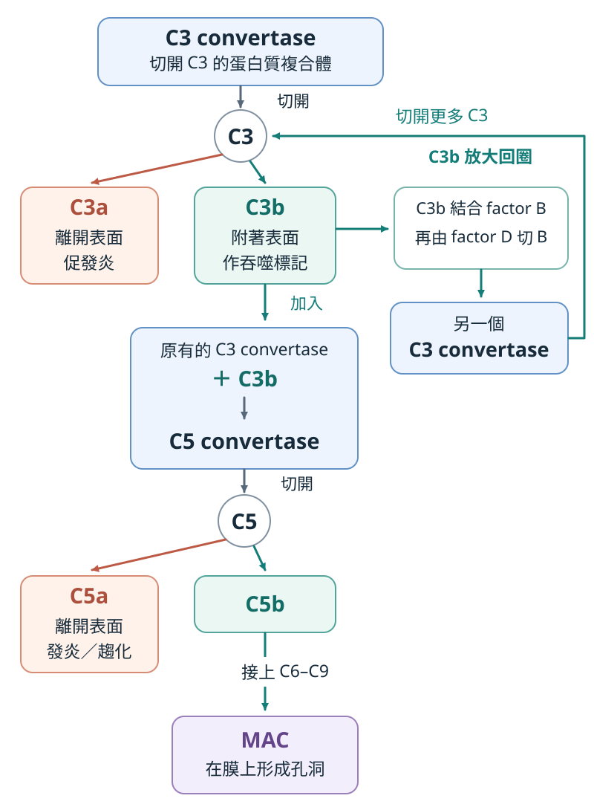
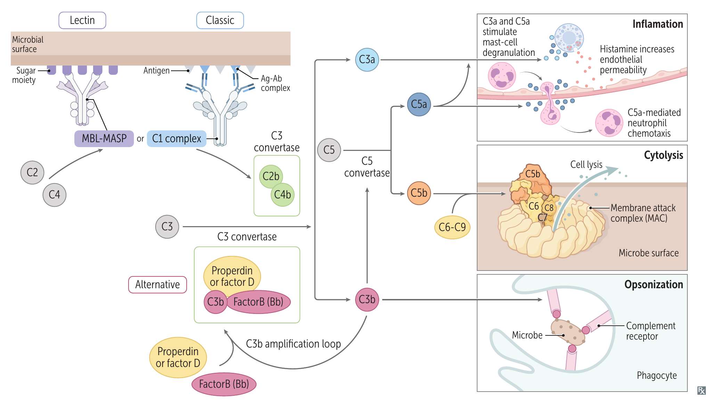

# Complement 補體系統

## 內文

補體是一群主要由肝臟製造、在血中循環的蛋白質，平時多處於未活化狀態。遇到適當刺激後，部分蛋白被切成作用不同的片段；其中一些片段再組成酵素複合體，切開其他補體成分，使反應放大。

這個反應會在目標表面留下方便吞噬的標記，也會釋出發炎訊號；繼續往下進行，還能在部分目標的膜上形成孔洞。以下先看共同經過的 **C3、C5**，再看不同刺激如何啟動它們。

### 一、切開 C3，讓標記目標與發炎同時發生

**C3 convertase 是「能切開 C3 的蛋白質複合體」**。幾個補體蛋白在目標表面組合後，就能把血中接近的 C3 切成兩個作用不同的片段：

| C3 被切成 | 片段往哪裡去？ | 接著做什麼？ |
|---|---|---|
| **C3a** | 離開反應表面，作用於附近細胞 | 促進 mast cell 釋放 histamine 等介質，使血管通透性增加，讓液體與血中蛋白質更容易進入組織。 |
| **C3b** | 可附著在附近的病原表面 | 包被目標後，讓吞噬細胞較容易辨認、結合與吞入病原。這種幫助吞噬的作用叫 **opsonization**。 |

**C3b 的清除作用**，可依包被的目標來看：

1. **包被病原，促進吞噬**：C3b 與 IgG 是主要 opsonins。吞噬細胞如何用不同 receptor 辨認這些標記，再吞入、清除目標，見 [[吞噬後如何殺菌]]。
   - **莢膜菌**：莢膜會妨礙吞噬細胞結合細菌，所以 C3b／IgG 的包被尤其重要。
   - **脾功能失常**：IgM 減少，使補體活化與 C3b 的 opsonization 減弱，因此莢膜菌更難清除，見 [[莢膜菌的辨認與吞噬]]。
2. **包被 immune complexes，幫助清除**：immune complexes 是抗原與抗體形成的複合體，C3b 也可附著於其上，協助清除。

### 二、C3b 讓反應放大，也讓反應繼續切到 C5

附著在表面的 C3b，除了作為吞噬標記，還能參與組成切割補體的複合體：

1. **組成更多 C3 convertase，放大反應**：C3b 結合 factor B；factor D 將 B 切開，留下 Bb，形成 **C3bBb**。
   - 新形成的 C3 convertase 再切開更多 C3，產生更多 C3b；這些 C3b 又能參與組成新的複合體，回到同一步。切割 C3 的複合體越多，反應便持續放大。
2. **形成 C5 convertase，開始切 C5**：原有的 C3 convertase 再結合 C3b，就成為 **C5 convertase**，能把 C5 切成 C5a、C5b。

   | C5 被切成 | 接著做什麼？ | 結果 |
   |---|---|---|
   | **C5a** | 促進 mast cell 釋放介質，也吸引、活化 neutrophil 等吞噬細胞 | 加強發炎；引導白血球移向反應處的作用稱 **chemotaxis**。 |
   | **C5b** | 接上 C6、C7、C8，再讓 C9 聚合，在目標膜上形成孔洞 | 組成 **MAC（membrane attack complex，C5b–9）**，直接破壞膜。對抗 gram-negative bacteria，尤其 Neisseria，很重要。 |

   - **發炎片段的分類**：FA 將 C3a、C4a、C5a 並列為 **anaphylatoxins**。前述 mast cell 機制以 C3a、C5a 為主；C4a 的受體與效應不能直接視為與它們相同。

- **對照共同反應圖**：C3a、C5a 主要作用於附近細胞、促進發炎；C3b 留下吞噬標記，C5b 則開始組裝破膜的 MAC。

  

  圖中回到 C3 的箭頭，是 C3b 協助組成更多 C3 convertase；往下到 C5 的箭頭，是 C3b 加入既有 convertase，改變它能切割的對象。依 First Aid 2026 書頁 104 與補體機制繪製。

### 三、不同刺激，如何組成最初的 C3 convertase？

前面已經知道 C3 convertase 會做什麼。接下來比較它怎麼形成：**抗體、微生物表面的醣類，以及持續少量發生的 C3 活化，都能成為起點。**

| 路徑 | 起點：誰辨認什麼？ | 如何組成 C3 convertase？ |
|---|---|---|
| **classical pathway** | IgM／IgG 先結合抗原，**C1q 再結合抗體的 Fc 部分** | C1 複合體中的 C1r、C1s 接著活化。C1s 切割 C4、C2，使留下的片段在表面形成 **C4b2b**。 |
| **lectin pathway** | **MBL（mannose-binding lectin）** 結合微生物表面的 mannose 等醣類 | MBL 攜帶的 **MASP（MBL-associated serine protease）** 切割 C4、C2，同樣形成 **C4b2b**。 |
| **alternative pathway** | 不需抗體或 MBL 先辨認。血中少量 C3 自發水解，經後續反應產生少量 C3b | 若 C3b 留在適合反應的表面，就能結合 factor B，由 factor D 切割 B，形成 **C3bBb**；**properdin 使這個複合體較不易解離**。 |

1. **Classical pathway 與 lectin pathway 形成相同的 C3 convertase**：**C4b2b／C4b2a** 是同一種複合體的不同命名。此處跟隨 First Aid 使用 C4b2b；傳統教材常寫 C4b2a。
   - **Classical pathway 連接抗體辨認與補體作用**：補體屬於先天免疫；抗體則把後天免疫辨認到的目標，接到補體的清除作用。
2. **Alternative pathway：分清最初啟動與後續放大**。
   - **啟動**：最初的自發水解產物是 **C3(H₂O)**。它先結合 factor B；factor D 切開 B，留下的 Bb 與 C3(H₂O) 組成能切 C3 的複合體，再切其他 C3、產生少量 C3b。**自發水解本身不等於把 C3 切成 C3a、C3b。**
   - **放大**：C3b 若附著在缺乏適當抑制的表面，便能沿用前面的 C3bBb 回圈。**不管 C3b 最初由哪條路徑產生，都能進入這個回圈**，所以 alternative pathway 也能放大另外兩條路徑。
   - **分清 factor D 與 properdin**：factor D 負責切 B；properdin 負責穩定已形成的 C3bBb。下方 FA 原圖的「properdin or factor D」不能理解成兩者可以互換。

- **對照入口與後續反應**：先找圖中的三個入口，再看它們匯合到 C3、C5，最後分向發炎、吞噬與破膜。

  

  來源：First Aid 2026，書頁 104（PDF 第 126 頁）。C4b2b 的命名與 factor D／properdin 的分工，依上方相應路徑的說明判讀。

### 四、限制活化，才能保護自己的細胞

補體能放大、能破膜，也就需要限制反應的蛋白。它們作用的位置不同，缺少時造成的問題也不同。

| 調控蛋白 | 作用位置 | 缺少保護時的主要問題 |
|---|---|---|
| **C1 inhibitor（C1-INH）** | 補體前段，以及 bradykinin 的產生 | 補體消耗增加／bradykinin-mediated angioedema |
| **CD55／DAF（decay-accelerating factor）** | Convertase 階段 | C3b 包被與血管外清除增加 |
| **CD59／MIRL（membrane inhibitor of reactive lysis）** | MAC 階段 | 破膜造成血管內溶血 |

1. **C1-INH：補體消耗與 bradykinin 水腫是不同結果**。其調控不足可見於 [[Hereditary angioedema 遺傳性血管性水腫]] 的部分類型。

   [[C1-INH 與 bradykinin 的調控]]

2. **CD55／CD59：膜表面的保護依賴正常固定**。[[Paroxysmal nocturnal hemoglobinuria]] 是兩種保護同時減少的例子，也可用來理解阻斷 C5 與 C3 的差別。

   [[GPI anchor 與 CD55／CD59 的補體保護]]

### 五、缺少清除作用，或持續活化，都會造成疾病

補體不足會使病原或 immune complexes 難以清除；若補體反應發生在血球或自身組織，原有的清除機制也可能造成傷害。

1. **缺少清除作用**：依缺少的成分，回推哪種清除功能不足，以及較容易出現的疾病。

   [[補體缺陷與感染]]

2. **活化造成組織損傷**：同樣的清除作用發生在血球或自身組織時，便可能造成傷害。

   | 反應如何開始？ | 哪個作用造成傷害？ | 可能表現 |
   |---|---|---|
   | **抗體結合細胞表面抗原、活化補體** | C3b 包被該細胞，使它被清除；MAC 也可破膜 | Type II [[Hypersensitivity 四型]] 的部分反應，例如 [[Acute hemolytic transfusion reaction]]。 |
   | **Immune complexes 沉積、持續活化補體** | 補體招募 neutrophil，其釋放的酵素可傷害組織；活化也消耗補體 | Type III [[Hypersensitivity 四型]]；活動性 [[SLE (polyarthritis)]] 可見 C3、C4 降低。 |

- **由反應位置判讀功能檢驗**：看哪條入口的反應受損，再判斷是路徑特有成分、共同的 C3，還是後面的 MAC 出問題。

  [[補體功能檢驗：CH50／AH50]]

### 來源

First Aid 2026：書頁 96、102–105、108、110–112、116、418、428。為解釋 C3 水解與放大過程，參考 [C3 自發水解的原始研究](https://pubmed.ncbi.nlm.nih.gov/6586103/)；機制亦可對照 [Janeway 補體章](https://www.ncbi.nlm.nih.gov/books/NBK27100/)。命名與 C4a 的補充依據為 [C2 片段命名建議](https://www.frontiersin.org/journals/immunology/articles/10.3389/fimmu.2019.01308/full)、[C4a 受體的原始研究](https://pubmed.ncbi.nlm.nih.gov/28973891/)。
