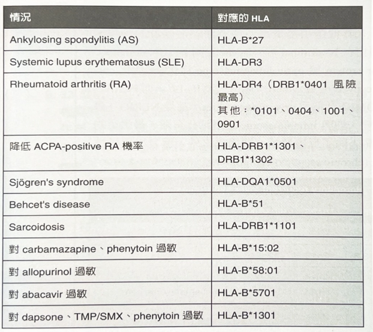

# HLA-MHC

## 摘要
（待補 by claude）

## 內文
### Class I vs Class II（誰呈現給誰）
（待補 by claude）

### 疾病關聯
- HLA-DR2：Goodpasture's、MS
- HLA-DR3：Graves's、MG、SLE、PSC
- HLA-DR4：RA、PV
- HLA-DR5：Hashimoto's
- HLA-B27：（待補 by claude）

### 藥物基因（HLA 與藥物過敏）
（待補 by claude）

