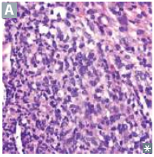

# Inflammation 發炎

## 內文

組織受到感染或損傷時，原本在局部的細胞會發出訊號，讓血中的白血球與蛋白質進入組織。這種反應稱 **inflammation**：它清除致傷原因與死亡細胞，也啟動修復。血管變化、細胞清除、全身反應與修復可以重疊進行。

### 一、組織出現什麼變化，會引起發炎？

1. **感染提供病原成分，受傷也能提供刺激**

   細菌、病毒等可提供被免疫受體辨認的成分；trauma、缺血造成的 necrosis，以及無法清除的 foreign bodies，也能引起反應。因此，發炎不代表一定有感染。

   以細胞死亡為例，關鍵不只在於細胞「有沒有死」，還在於內容物如何被處理：

   | 細胞死亡方式 | 內容物如何處理 | 與發炎的關係 |
   |---|---|---|
   | **Necrosis** | Plasma membrane 受損，細胞內容物外漏。 | 外漏成分可成為損傷訊號，引起局部發炎；缺血的組織即使沒有病原，也能出現這種反應。 |
   | **Apoptosis** | 細胞縮小、分成 apoptotic bodies，再被 macrophage 等細胞吞噬；膜通常仍完整。 | 通常不伴顯著發炎。它也可用於移除反應結束後不再需要的免疫細胞。 |

2. **反應過強、持續太久或辨認錯誤，也會傷害宿主**

   過強的全身反應可造成 septic shock；TB 等持續感染可使反應長期存在；SLE 等自身免疫疾病則可能讓反應指向自己的組織。後面的差別，在於刺激能否清除、發炎發生在哪裡，以及修復能否恢復原有構造。

### 二、局部細胞發出訊號，讓血管與全身參與反應

**Acute inflammation** 通常在數秒至數分鐘內開始，持續數分鐘至數天，組織中常見 neutrophils 與 edema。已有的抗體、mast cells 與血漿蛋白也能參與，不必等待這次感染重新製造抗體。

圖中密集的發炎細胞呈多葉或分葉深色細胞核，可對照 acute inflammation 常見的 neutrophil 浸潤。來源：First Aid 2026，書頁 210／PDF 232；原圖解析度有限，適合辨認整體浸潤，不作精細細胞形態圖。

[[發炎訊號與局部、全身反應|全文|群組縮排]]

### 三、白血球需要停下、穿出血管，才能到達刺激處

血管通透性增加讓液體與蛋白質進入組織；白血球則還要完成黏附與移行。兩者是不同過程，可同時發生。

[[白血球如何離開血管|全文|群組縮排]]

### 四、到達局部後，清除作用也可能損傷附近組織

1. **吞噬細胞先吞入，再以酵素與氧化物清除**

   Neutrophil、macrophage 結合目標後，用細胞膜包圍它，形成 phagosome；再與含分解酵素的 lysosome 融合。IgG、C3b 包被目標可幫助吞入，但吞入後仍需要殺菌。

   [[吞噬後如何殺菌]]

   **ROS（reactive oxygen species）與分解酵素也能傷害自身組織**：ROS 可氧化膜脂質、改變蛋白質、傷害 DNA；neutrophil 的 lysosomal enzymes 可消化組織。例如細菌性 abscess 可出現 liquefactive necrosis，其中包含 neutrophils 與細胞碎屑。

2. **目標的位置、大小不同，所需效應細胞也不同**

   | 局部的清除問題 | 相應作用 |
   |---|---|
   | 病原已利用自身細胞複製，例如病毒感染 | Type I IFN（interferon）限制病毒複製；NK（natural killer）或 CD8 T cell 可使受感染細胞 apoptosis。辨認與殺傷見 [[IFN 與 NK 如何對抗病毒]]。 |
   | Helminth 太大，難以整個吞入 | Eosinophil 向細胞外釋放顆粒，損傷寄生蟲表面；同樣的顆粒在過敏時也可傷害自身組織。IL-5 與抗體如何協助，見 [[先天免疫 Innate immunity]]。 |
   | 病原持續存在，需要抗原特異性的反應 | Dendritic cell 將局部抗原帶到引流 lymph node，將蛋白質分解為 peptide，以 MHC（major histocompatibility complex）這種表面蛋白展示片段，配合共刺激活化相應 T cell。T cell 再增強局部細胞作用，見 [[抗原呈現與 T cell 活化]]。 |

3. **清除能力不足，與清除反應指向自己，造成不同問題**

   - **不能有效清除刺激**：LAD（leukocyte adhesion deficiency）影響白血球到達局部；CGD（chronic granulomatous disease）影響吞入後的 oxidative burst。刺激留下來，感染與發炎就可能持續。缺陷比較見 [[Congenital Immunodeficiency]]。
   - **辨認自身或無害抗原**：抗體與 T cell 仍能啟動同樣的效應機制，造成 hypersensitivity。其傷害可能來自血管介質、補體與 neutrophil，或 T cell 的作用；各型不能全記成「抗體破壞細胞」。

   [[免疫反應如何造成組織損傷|全文|群組縮排]]

### 五、刺激消退或持續，決定清除與修復如何接續

[[發炎的消退、持續與慢性變化|全文|群組縮排]]

### 六、修復如何恢復組織，又為什麼可能留下 scar？

[[傷口修復與疤痕形成|全文|群組縮排]]

### 來源

First Aid for the USMLE Step 1 **2026**。本 PDF 的實體頁碼＝書頁＋22。

- **Pathology—Inflammation**：書頁 209–214／PDF 231–236，包括局部與全身反應、ESR、acute／chronic inflammation、白血球移行、granuloma、wound healing 與 scar。
- **Pathology 其他內容**：書頁 202–208／PDF 224–230，核對持續刺激、細胞損傷、apoptosis／necrosis、ROS 與 AA amyloidosis；書頁 222／PDF 244，核對致癌病原的疾病配對。
- **Immunology**：書頁 97–108、110–111、114–115、119；訊號、補體、細胞作用、hypersensitivity、免疫缺陷及藥物作用依相應正本延伸。各模組另列實際使用的頁碼與補充來源。
