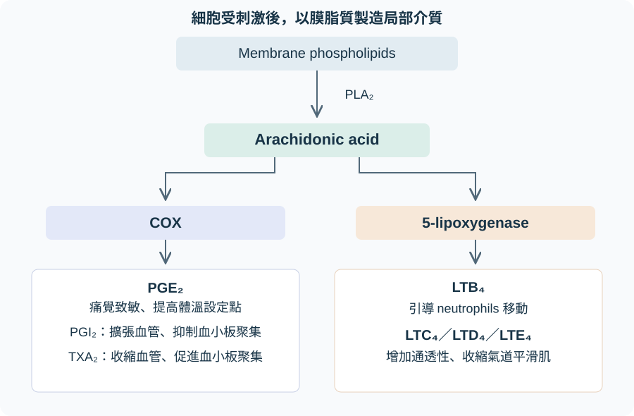

# Arachidonic acid 與發炎介質

## 內文

Histamine 可由 mast cell 的預存顆粒迅速釋出；prostaglandins 與 leukotrienes 則是細胞受到刺激後，利用膜上的脂質製造的介質。它們能改變血管、痛覺與白血球移動，但各種產物的作用不同。

### 一、同一種原料，經不同酵素形成不同產物

1. **先從細胞膜取得 arachidonic acid**

   **PLA₂（phospholipase A₂）** 是切開 membrane phospholipids 的酵素，讓 arachidonic acid 釋出。Arachidonic acid 是後續合成的原料，不是受體或 cytokine。

2. **COX 與 5-lipoxygenase 將原料送往不同反應**

   | 合成分支 | 產物 | 與發炎或血管的關係 |
   |---|---|---|
   | **COX（cyclooxygenase）** | Prostaglandins，包括 **PGE₂** | PGE₂ 參與痛覺致敏與提高體溫設定點；部分 prostaglandins 使血管擴張。 |
   | COX | **PGI₂（prostacyclin）** | 使血管擴張、抑制 platelet aggregation。 |
   | COX | **TXA₂（thromboxane A₂）** | 使血管收縮、促進 platelet aggregation，與 PGI₂ 形成對照。 |
   | **5-lipoxygenase** | **LTB₄（leukotriene B₄）** | 吸引 neutrophils 移向反應處。 |
   | 5-lipoxygenase | **LTC₄、LTD₄、LTE₄** | 增加血管通透性，並使 bronchial smooth muscle 收縮。 |

   

   先找膜脂質與 arachidonic acid，再沿兩個酵素分支找產物。圖只整理本節的發炎與血管作用；COX 還有其他生理產物。依 First Aid 2026 書頁 209、495 整理繪製。

### 二、阻斷位置不同，減少的反應也不同

| 介入方式 | 阻斷哪裡 | 可以由位置推想的結果 |
|---|---|---|
| **Glucocorticoids** | 抑制 PLA₂；也限制 NF-κB（nuclear factor κB）調控的發炎基因表現 | 減少脂質介質的原料供應，也降低多種 cytokines 與 COX-2 的產生；影響不只一種 prostaglandin。 |
| **NSAIDs（nonsteroidal anti-inflammatory drugs）** | 抑制 COX；aspirin 不可逆，其他傳統 NSAIDs 多為可逆；celecoxib 選擇性抑制 COX-2 | 減少 prostaglandins 等 COX 產物，因此可減少發炎、疼痛與發燒；並非直接阻斷 5-lipoxygenase。 |
| **Zileuton** | 抑制 5-lipoxygenase | 減少 leukotriene 合成。 |
| **Montelukast、zafirlukast** | 阻斷 cysteinyl-leukotriene receptor | 減少 LTC₄／D₄／E₄ 的相關作用，不能由此推成也阻斷 LTB₄ 的 neutrophil chemotaxis。 |
| **Acetaminophen** | 主要在 CNS 抑制 COX，周邊作用有限 | 可以退燒、止痛，但不具實用的抗發炎作用。 |

Glucocorticoids 也會改變白血球在血管壁與循環中的分布，因此血中 neutrophil 增加不代表局部清除變強，見 [[白血球如何離開血管]]。疾病治療與用藥選擇見 [[免疫抑制劑]]；此表是在比較反應的阻斷位置。

### 來源

First Aid 2026：書頁 119、209、495–496、705／PDF 141、231、517–518、727。PGE₂ 的發燒與疼痛作用來自書頁 209；cysteinyl-leukotriene receptor 的範圍以書頁 705 的 CysLT₁ 圖核對。
