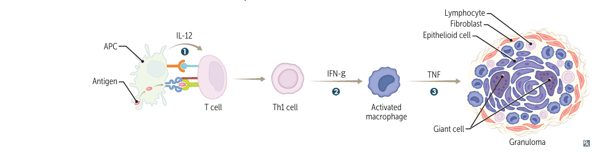
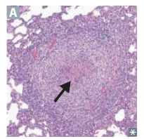

# Granuloma 的形成與結構

## 內文

**Granuloma 是以活化 macrophages 聚集為主的一種慢性發炎構造**。當刺激難以完全清除時，局部細胞將它圍住，限制其散布；刺激仍可能留在裡面，因此 granuloma 不代表病原已被殺光。

### 一、持續的抗原反應，讓 T cell 與 macrophage 互相增強

以 TB 等需要持續 T-cell 反應的情況為例：

1. **APC 提供抗原與 IL-12，使相應 CD4 T cell 走向 Th1 反應**

   APC（antigen-presenting cell）將蛋白質分解為 peptide，以 MHC II（major histocompatibility complex class II）這種表面蛋白展示片段，供 CD4 T cell 辨認；共刺激配合抗原辨認使細胞活化，IL-12（interleukin-12）則促進 Th1 分化。呈現與活化的完整條件見 [[抗原呈現與 T cell 活化]]。

2. **Th1 的 IFN-γ 增強 macrophage**

   IFN-γ（interferon-γ）使 macrophage 加強清除已吞入病原的能力。若刺激仍存在，抗原呈現與 T-cell 訊號便能繼續，讓 macrophage 持續活化。

3. **活化的 macrophages 聚集，部分融合成 giant cells**

   活化的 macrophage 可呈現 **epithelioid cell** 外觀：胞質豐富、染成粉紅色。數個 macrophages 融合可形成 **multinucleated giant cell**。周圍常有 lymphocytes，持續反應還可伴隨 fibroblasts 與 fibrosis。

   **TNF（tumor necrosis factor）有助 granuloma 的形成與維持**。阻斷 TNF 後，原本受限制的 TB 可能重新活化、散布；這解釋了 anti-TNF 用藥前評估 latent TB 的必要性。臨床評估與用藥內容見 [[免疫抑制劑]]。

   

   由左往右看訊號與細胞變化，最右側再看 epithelioid cells、giant cell 與外圍 lymphocytes。此圖以 T-cell 參與的反應為例；foreign-body granuloma 不必都經過同樣的抗原特異性 Th1 步驟。來源：First Aid 2026，書頁 213／PDF 235。

### 二、中心有沒有壞死，是形態分類；病因要另外判斷

| 形態 | 中心所見 | 典型關聯 |
|---|---|---|
| **Caseating granuloma** | 中心有 caseous necrosis，殘留顆粒狀碎屑。 | 常見於 TB、部分真菌感染。 |
| **Noncaseating granuloma** | 沒有中心 caseous necrosis。 | 常見於 sarcoidosis、Crohn disease 等非感染病因。 |

**形態提供線索，不能單靠「有沒有壞死」排除感染。** 同一類形態可有不同病因，病理、染色、培養與臨床資料仍需合併判斷。

箭頭指向中央較淡、缺乏完整細胞的壞死區，周圍是發炎細胞。這張圖看組織構造，上圖看細胞如何形成構造。來源：First Aid 2026，書頁 213／PDF 235。

病因比較與疾病入口見 [[Granuloma (innate immunity)]]。

### 三、圍住刺激的同時，也可能影響器官功能

1. **Fibrosis 與持續發炎可損傷器官**：即使刺激的散布受到限制，周圍組織仍可能因長期發炎、纖維化而失去功能。
2. **活化的 macrophage 可增加 vitamin D 活化**：1α-hydroxylase 將 25-OH vitamin D 轉成活性的 1,25-(OH)₂ vitamin D，增加腸道鈣吸收，因此部分 granulomatous disease 會有 hypercalcemia。
3. **受損組織也可留下局部鈣化**：TB 等 granulomatous inflammation 可有 dystrophic calcification，也就是鈣沉積在受損組織。它與前一項因 vitamin D 活性增加而出現的全身 hypercalcemia，是不同問題。
4. **Granuloma 與 granulation tissue 不同**：前者以活化 macrophages 聚集為主；後者是修復傷口時，由新生血管、fibroblasts 等組成的組織，見 [[傷口修復與疤痕形成]]。

### 來源

First Aid 2026：書頁 100–101、106、205、207、213／PDF 122–123、128、227、229、235。

形態不能單獨決定病因的補充：[500 例肺部 granulomas 的多國病理研究](https://pubmed.ncbi.nlm.nih.gov/22011444/)；foreign-body 與 immune granuloma 的區分：[Granuloma，NCBI Bookshelf](https://www.ncbi.nlm.nih.gov/books/NBK554586/)。
