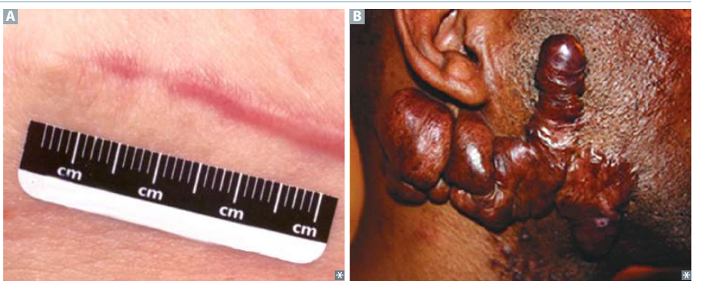

# 傷口修復與疤痕形成

## 內文

組織受損後，需要先止血、清理死亡組織，再補上缺損、重整結構。**細胞再生足以恢復時，可接近原有構造；再生不足時，則以結締組織填補，形成 scar**。嚴重急性傷害與慢性傷害都可能留下 scar。

### 一、止血、清理、增生與重塑會互相重疊

下列時間是典型傷口的近似範圍。不同細胞的工作會交錯，不能理解成前一階段完全結束，下一階段才開始。

| 階段與典型時間 | 主要參與細胞 | 正在完成什麼 |
|---|---|---|
| **Inflammatory phase**：受傷後至約第 3 天 | Platelets、neutrophils、macrophages。 | 形成血塊；血管通透性增加，neutrophils 移入；約 2 天後 macrophages 明顯參與清除碎屑。 |
| **Proliferative phase**：約第 3 天起至數週 | Fibroblasts、myofibroblasts、endothelial cells、keratinocytes、macrophages。 | 長出新血管，形成 **granulation tissue**，沉積 **type III collagen**；上皮細胞增生覆蓋表面，血塊逐漸消退，myofibroblasts 收縮使傷口縮小。 |
| **Remodeling phase**：約第 1 週起，可持續 6 個月以上 | Fibroblasts。 | 分解並重新排列基質，以 **type I collagen 取代 type III collagen**，提高組織的 tensile strength。 |

**Granulation tissue 是修復中的組織**：新生血管提供血流，fibroblasts 製造基質。它與 [[Granuloma 的形成與結構|granuloma]] 的 macrophage 聚集是不同概念。

### 二、生長訊號分別促進血管、細胞與基質的修復

| 訊號或酵素 | 作用對象與改變 |
|---|---|
| **FGF（fibroblast growth factor）、VEGF（vascular endothelial growth factor）** | 促進 angiogenesis，使修復區形成新血管。 |
| **TGF-β（transforming growth factor-β）** | 參與 angiogenesis、fibrosis。它可以限制免疫反應，同時促進基質沉積；這兩種作用指向不同工作。 |
| **PDGF（platelet-derived growth factor）** | 由活化 platelets、macrophages 分泌；促進 fibroblast 生長以製造 collagen，也促進 vascular remodeling 與 smooth-muscle cell migration。 |
| **EGF（epidermal growth factor）** | 經具 tyrosine-kinase 活性的 receptor 傳訊，促進細胞生長，例如 EGFR／ErbB1。 |
| **Matrix metalloproteinases** | 分解細胞外基質，使組織能重新排列與塑形；不是只製造 collagen 而不移除舊基質。 |

### 三、Collagen 需要合成與重整，傷口才逐漸變牢固

1. **合成不足，增生階段就會受影響**

   Vitamin C 或 copper 缺乏可使 proliferative phase 延遲。Vitamin C 參與 collagen 的 proline／lysine hydroxylation；copper 是 lysyl oxidase 所需的輔因子，參與後續 cross-linking。

2. **重塑也需要分解原有基質**

   Collagenases 需要 zinc 才能正常作用，會分解早期 type III collagen，配合 type I collagen 的沉積。Zinc 缺乏也會延遲傷口癒合。

3. **Scar 的強度上升，但不完全回到原組織**

   約 3 個月時可恢復原組織 **70–80% 的 tensile strength**，之後增加有限。表面已閉合，不代表內部 collagen 已完成重塑。

### 四、Collagen 沉積過多，形成異常 scar

過多 TGF-β 與異常疤痕形成有關。比較時先看 scar 是否超出原傷口，再看 collagen 排列與復發情況：

| 比較面向 | Hypertrophic scar | Keloid scar |
|---|---|---|
| **範圍** | 留在原傷口邊界內。 | 超出原傷口，可呈 clawlike 延伸；常見於耳垂、臉部、上肢。 |
| Collagen 沉積 | 增加；FA 以 type III 多於 type I 描述。 | 明顯增加；FA 以 type I 多於 type III 描述。 |
| Collagen 排列 | 較平行。 | 較紊亂。 |
| 復發 | 較不常見。 | 較常見。 |
| 傾向 | FA 未列特定族群傾向。 | 深色皮膚者發生率較高。 |

左側 A 留在原傷口範圍內；右側 B 超出原傷口，形成明顯隆起。外觀圖用來對照範圍，不能單靠照片判斷 collagen 類型。來源：First Aid 2026，書頁 214／PDF 236。臨床處理見 [[Keloid 蟹足腫]]。

### 來源

First Aid 2026：書頁 212、214／PDF 234、236。Collagen 合成與輔因子：書頁 48／PDF 70。
