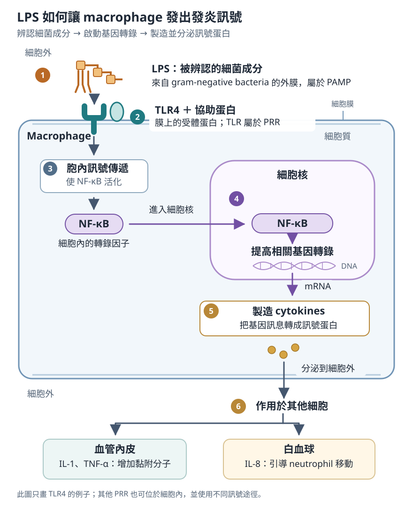

# 先天免疫 Innate immunity

## 內文

### 一、組織遇到感染或受傷，局部細胞先辨認變化

1. **屏障先阻止病原進入**
   - 完整上皮阻隔病原。
   - 呼吸道纖毛把黏液與其中的物質往外清除。
   - 腸道 Paneth cell 分泌 defensins、lysozyme 等防禦蛋白，也分泌 TNF（tumor necrosis factor）。

   病原越過屏障後，會接觸原本就在組織中的 **macrophage、dendritic cell** 等細胞。

2. **辨認刺激後，將訊號傳入細胞**

   以 macrophage 遇到 gram-negative bacteria 的 **LPS（lipopolysaccharide）** 為例：
   1. **TLR4 辨認 LPS**：LPS 是細菌外膜的成分；macrophage 表面的 **TLR4（Toll-like receptor 4）** 與協助蛋白辨認它，再將訊號傳進 macrophage。LPS 是被辨認的東西，TLR4 是我們的細胞用來辨認它的受體。
   2. **NF-κB 使細胞製造發炎訊號**：收到訊號後，**NF-κB（nuclear factor κB）** 可被活化並進入細胞核。它是 transcription factor，能讓相關基因被轉錄、產生製造蛋白質所需的 RNA，使細胞製造、分泌促發炎的 **cytokines**。

   Cytokines 是細胞之間傳訊的蛋白，能讓附近血管、血中白血球也對局部感染作出反應，詳見 [[細胞激素 Cytokines]]。

   **被辨認的成分、辨認者與後續訊號，各有不同角色：**

   | 角色 | 名詞 | 它是什麼、有哪些例子 |
   |---|---|---|
   | 來自病原、被辨認的成分 | **PAMP（pathogen-associated molecular pattern）** | 多種病原共有的分子成分，例如 LPS、細菌 flagellin、病毒核酸。 |
   | 來自受損自身細胞、被辨認的成分 | **DAMP（damage-associated molecular pattern）** | 細胞受損後，原本位於細胞內的物質可釋出並引起反應，例如 mitochondrial DNA、histones、heat shock proteins。因此沒有感染，組織受傷也能引起發炎。 |
   | 辨認這些成分的受體 | **PRR（pattern recognition receptor）** | 見於 macrophage、dendritic cell、neutrophil 等細胞。TLR 是其中一類，TLR4 是這一類的成員。 |
   | 收到刺激後，改變基因轉錄的蛋白 | **NF-κB** | 位於細胞內，將「受體收到刺激」接到「細胞製造發炎訊號」；它不是用來直接接觸 LPS 的表面受體。 |

   

   圖中依序是細胞外的刺激、膜上的受體與細胞內的訊號。這是 LPS／TLR4 的例子，其他辨認受體的位置與訊號路徑可能不同。

3. **PRR 的位置不同，能接觸到的成分也不同**

   - **細胞表面**：接觸細胞外的成分。
   - **Endosome 膜上**：辨認已被攝入的核酸。
   - **Cytosol 內**：也有感測核酸的蛋白。

   因此，PRR 不全在細胞表面，TLR 也不是所有 PRR 的總稱。

4. **使用原有的辨認工具，能很快開始反應**

   先天免疫使用基因原有編碼的辨認工具，可在數分鐘至數小時內反應，不需先經特異性增殖才能開始工作。B／T cell 則在發育時靠 V(D)J 重組產生各自的辨認能力；先天免疫也不建立 B／T cell 那樣的抗原特異性記憶。

### 二、局部訊號使血管改變，讓白血球與蛋白質進入組織

發炎把更多能清除病原的細胞與蛋白質送到局部。以下作用可並行發生。

1. **讓白血球停下、離開血管，再移向刺激處**
   - **IL-1（interleukin-1）、TNF-α 作用於內皮**，使內皮增加黏附分子。Neutrophil 先在血管壁 rolling，再牢固黏附、穿過內皮。
   - **IL-8 等 chemotactic signals 引導移動**：離開血管後，neutrophil 沿訊號移向感染或受傷的位置。

   各步驟的分子配對，以及哪一步受阻會造成什麼結果，見 [[白血球如何離開血管]]。

2. **增加局部血流與血管通透性，讓蛋白質進入組織**
   - 局部 mast cell 可釋放 **histamine**，參與血管變化；血流增加、液體進入組織，使患處出現紅、熱、腫。
   - 血中的 **complement** 蛋白進入組織、活化後，可幫助吞噬、招募白血球，或破壞部分病原的膜，見 [[Complement 補體系統]]。

   Mast cell、血中 basophil 與 eosinophil 在位置、分泌物及過敏作用上的差別，見 [[先天免疫細胞的辨認與分泌物]]。

3. **訊號傳到全身，使其他器官參與反應**
   - **發燒**：IL-1、TNF-α 可改變體溫調節。
   - **肝臟增加 acute-phase proteins**：IL-6 作用於肝臟，增加 CRP（C-reactive protein）等蛋白；CRP 能結合目標、幫助清除。

   發燒的機制、局部紅腫熱痛與各種蛋白質的比較，見 [[發炎訊號與局部、全身反應]]。

### 三、目標的位置與大小不同，清除方法也不同

1. **能吞入的微生物：由吞噬細胞吞入，再在細胞內殺死**

   Neutrophil 是急性發炎的重要吞噬細胞；macrophage 除了吞噬病原，也清除死亡細胞與碎屑，並藉 cytokines 調整局部反應。

   [[吞噬後如何殺菌]]

2. **病毒已在自身細胞內：限制複製，並清除受感染細胞**

   病毒依賴宿主細胞製造新的病毒。IFN（interferon）限制病毒複製，NK（natural killer）cell 則可使受感染的自身細胞死亡；這些作用可以並行。

   [[IFN 與 NK 如何對抗病毒]]

3. **大型 helminth 難以整個吞入：將顆粒釋放到細胞外**

   大型寄生蟲無法像一個細菌那樣被整個包進 phagosome。**Eosinophil 可把顆粒內容物釋放到寄生蟲表面**，其中 **MBP（major basic protein）** 等蛋白可損傷 helminth。
   - **IL-5 增強 eosinophil 的反應**：Th2（type 2 helper T）cell 分泌 IL-5，促進 eosinophil 生長、分化與活化。
   - **抗體可協助辨認目標**：對部分寄生蟲，IgE 等抗體先結合其表面，eosinophil 再藉 Fc receptor 結合抗體，對目標釋放顆粒。
   - **同樣的顆粒也可能傷害自身組織**：過敏反應招募、活化 eosinophil 時，釋出的顆粒可造成組織損傷，見 [[Hypersensitivity 四型]]。

   IL-5 與抗體是後天免疫增強先天效應細胞的例子。其他顆粒成分、外觀與細胞比較見 [[先天免疫細胞的辨認與分泌物]]。

### 四、Dendritic cell 將反應接到 T cell，活化的 T cell 也能回頭增強先天細胞

1. **Dendritic cell 攝入抗原，並啟動相應的 naive T cell**

   Macrophage 與 dendritic cell 都能攝入物質；dendritic cell 特別適合將局部的抗原帶到引流 lymph node，啟動尚未活化的 T cell。這可與前面的局部清除同時進行。

   [[抗原呈現與 T cell 活化]]

2. **活化的 T cell 以 cytokines 增強其他細胞的工作**

   例如 **Th1（type 1 helper T）cell 的 IFN-γ 可增強 macrophage 殺菌**，幫它清除已吞入的病原。Macrophage 的 IL-12 又能促進 Th1 反應，也可活化 NK；各訊號的來源、作用與回饋見 [[細胞激素 Cytokines]]。

   先天與後天免疫會在反應中互相增強，並非其中一種開始後，另一種便停止。

### 五、刺激消退或持續，決定反應的後續走向

1. **刺激消退：限制發炎，清理並修復組織**

   Macrophage 清除死亡細胞與碎屑；IL-10、TGF-β（transforming growth factor-β）等訊號限制發炎，組織進入修復。各訊號的作用見 [[細胞激素 Cytokines]]。

2. **刺激持續：發炎與修復可同時進行**

   反應可能成為 chronic inflammation；部分持續刺激會形成 [[Granuloma 的形成與結構|granuloma]]。不同走向與調控見 [[發炎的消退、持續與慢性變化]]。

清除、慢性反應與修復的完整銜接見 [[inflammation|Inflammation 發炎]]。

### 哪個清除環節受損，會出現哪類感染

細胞數量不足、無法移出血管，以及吞入後無法有效殺菌，會影響不同的清除環節；感染差異見 [[Immunocompromised]]。

### 來源

1. **First Aid 2026**：書頁 97–101、103–104、106–108、110、209–212、369、412–415、679–680。屏障、發炎、吞噬、細胞分工與抗原呈現分散在不同章節，此處依反應過程整理。
2. **辨認刺激與細胞內訊號**：[TLR4 與 LPS 的結合](https://www.nature.com/articles/nature07830)、[TLR 訊號與 NF-κB／cytokine 基因表現](https://www.nature.com/articles/41131)、[NF-κB 轉核與 TNF 分泌](https://pubmed.ncbi.nlm.nih.gov/10531202/)、[胞內 TLR](https://www.nature.com/articles/ni1028)、[胞內病毒 RNA 感測](https://pubmed.ncbi.nlm.nih.gov/15208624/)、[受傷後 mitochondrial DAMP 引起發炎](https://www.nature.com/articles/nature08780)。
3. **Eosinophil 的細胞外殺傷**：[MBP 沉積](https://pubmed.ncbi.nlm.nih.gov/2461091/)、[MBP 對寄生蟲表面的作用](https://pubmed.ncbi.nlm.nih.gov/4025686/)、[IgE 與 eosinophil 對特定寄生蟲的反應](https://pubmed.ncbi.nlm.nih.gov/8114916/)。
4. NK 殺傷與抗原呈現的補充來源，分別列在 [[IFN 與 NK 如何對抗病毒]]、[[抗原呈現與 T cell 活化]]。
