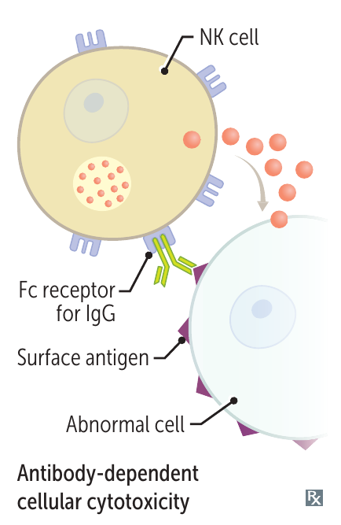

# IFN 與 NK 如何對抗病毒

## 內文

病毒需要利用宿主細胞製造新的病毒。感染時，細胞可用 **IFN（interferon）** 改變自己與附近細胞的狀態，限制病毒複製；**NK（natural killer）cell** 則能清除受感染細胞。這些反應可以同時進行。

### 一、Type I IFN 改變細胞狀態，限制病毒複製

被病毒感染的細胞可製造 **IFN-α、IFN-β**，作用於自己與附近帶有相應受體的細胞。它們可以造成不同改變：

1. **減少蛋白質合成，限制病毒複製**：細胞啟動抗病毒反應後，蛋白質合成減少，使病毒較難利用宿主細胞製造新的病毒；這可限制 RNA、DNA 病毒。

2. **增加 MHC I 表現，幫助 CD8 T cell 辨認抗原**：MHC I（major histocompatibility complex class I）把細胞內蛋白質的 peptide 呈現在表面，供 CD8 T cell 的 **TCR（T-cell receptor）** 辨認。Type I IFN 可增加 MHC I 表現，幫助這種抗原呈現。
   - 這裡的辨認者是 **CD8 T cell**；下文 NK 的受體則可從 MHC I 接收抑制訊號。它們使用 MHC I 的方式不同，不能把「提高 MHC I」直接等同「讓 NK 更容易殺傷」。
   - Peptide–MHC 與 T cell 活化的關係，見 [[抗原呈現與 T cell 活化]]。

3. **增強 NK 活性**：Type I IFN 也能作用於 NK，使其殺傷活性增加。這是對 NK 本身的作用，與前一項改變目標細胞的 MHC I 表現不同。

Type I IFN 的作用亦參與抗腫瘤免疫。它與後文 **IFN-γ** 增強 macrophage 殺菌的工作不同。

### 二、NK 接觸目標，整合活化與抑制訊號

**NK cell** 是 lymphoid origin 的先天免疫細胞，能殺傷病毒感染細胞及某些腫瘤細胞。它不需由 TCR 辨認特定 peptide–MHC 組合。

- **辨認標記**：NK 帶有 CD16、CD56；CD56 是辨認 NK 的提示標記。CD16 可辨認抗體的 Fc，作用見下方抗體參與的辨認方式。

NK 可從目標表面與周圍 cytokines 收到不同訊號；以下是不同來源的訊號，可以同時參與判斷，並非依序完成的步驟。

1. **辨認目標本身的表面訊號**

   | 目標表面的情況 | NK 接收到的訊號 |
   |---|---|
   | **Stress ligands 增加**：細胞受感染、壓力或惡性轉化時，某些表面分子出現或增加 | 這些分子結合 NK 的活化受體，促進殺傷。 |
   | **MHC I 可被 NK 的抑制受體辨認** | 抑制訊號限制 NK 對該細胞的殺傷。 |

   - **MHC I 減少**時，這部分抑制變弱；仍需合併活化訊號判斷。活化訊號足夠、抑制減弱時，才較容易引起殺傷。

2. **目標已被 IgG 包被時，以 CD16 辨認抗體**

   IgG 先附著於目標細胞，NK 的 **CD16 結合 IgG 的 Fc**，將活化訊號傳入 NK，再接到下節的顆粒殺傷。這稱為 **ADCC（antibody-dependent cell-mediated cytotoxicity）**。

   

   圖中 IgG 先結合目標，NK 再辨認 IgG 的 Fc；此處與前項的辨認方式，都可接到下節的顆粒殺傷。來源：First Aid 2026，書頁 110（PDF 第 132 頁）。

   抗體將辨認目標的能力接到 NK 的作用；其他抗體功能見 [[抗體結合目標後的作用]]。

3. **周圍 cytokines 改變 NK 的活性**

   除前述 IFN-α、IFN-β，**IL-2（interleukin-2）、IL-12** 也可增強 NK 活性。IL-2 亦促進 NK 生長；各 cytokine 的來源與作用見 [[細胞激素 Cytokines]]。

### 三、NK 對目標釋放顆粒，引發 apoptosis

辨認方式不同，仍可接到同一個殺傷過程：

1. **對著目標釋放顆粒**：NK 的 cytoplasmic lytic granules 含 perforin、granzymes；NK 活化後，將這些內容物釋向接觸的目標細胞。
2. **讓目標細胞啟動死亡程序**：perforin 的成孔作用幫助 granzymes 進入目標細胞，granzymes 再啟動 **apoptosis**。受感染細胞死亡後，病毒便失去可繼續利用的宿主細胞。
   - 這個過程是在清除異常的宿主細胞，不是把細胞外的微生物吞進 NK 內分解。
   - [[後天免疫 ② 細胞（T）|CD8 T cell]] 也使用 perforin／granzymes；兩者辨認目標的方式不同。

### 四、NK 也分泌 IFN-γ，把反應接回 macrophage

**分泌 IFN-γ 是 NK 的另一個作用**，可與殺傷目標同時發生，不必等目標死亡才開始。它把 NK 的反應接到 macrophage 清除已吞入病原的工作。

| IFN | 主要作用對象 | 主要作用 |
|---|---|---|
| **Type I：IFN-α／β** | 感染細胞、附近細胞與 NK | 限制病毒複製、增加 MHC I 表現，並增強 NK 活性。 |
| **IFN-γ** | Macrophage 等細胞 | 增強殺死已吞入病原的能力；也提高 MHC 表現與抗原呈現。 |

IFN-γ 也可由 T cell 分泌；完整作用與回饋關係，見 [[後天免疫 ② 細胞（T）|Th1／NK 的 IFN-γ 作用]]。

### 來源

First Aid 2026：書頁 97、99、106–108、110、415。

- Type I IFN、MHC I／CD8 與 NK 的不同關係：[Molecular Biology of the Cell：Innate Immunity](https://www.ncbi.nlm.nih.gov/books/NBK26846/)。
- NK 活化／抑制平衡：[訊號整合](https://pubmed.ncbi.nlm.nih.gov/19636352/)、[stress ligands](https://pubmed.ncbi.nlm.nih.gov/10426993/)。
- 顆粒如何引發目標死亡：[perforin 與 granzyme 傳遞](https://pubmed.ncbi.nlm.nih.gov/23377437/)。
