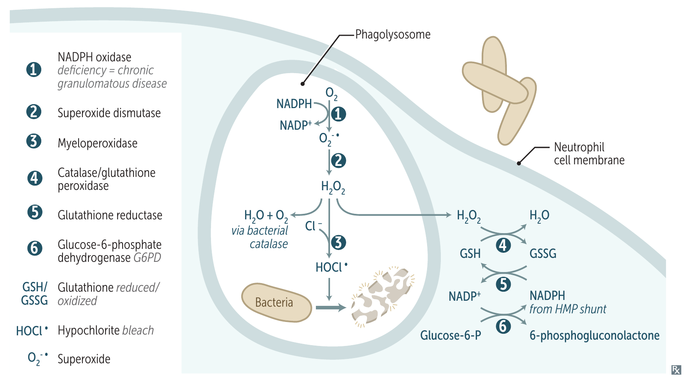

# 吞噬後如何殺菌

## 內文
### 一、先結合、吞入，再與 lysosome 融合

1. **以表面受體結合目標**

   Neutrophil、macrophage 能以表面受體結合微生物。目標也可先被 IgG 或 complement C3b 包被，吞噬細胞再用相應受體結合這些包被分子，使目標更容易被結合、吞入，稱 **opsonization**。
   - **IgG、C3b 是主要 opsonins**；macrophage 表面有 Fc receptor、C3b receptor，可用來結合被包被的目標。Opsonization 幫助的是吞入這一步，吞入後仍需殺菌。
   - C3b 除了幫助吞噬病原，也參與 immune-complex 清除；這個其他用途見 [[Complement 補體系統]]。

2. **用細胞膜包圍目標，形成 phagosome**

   吞噬細胞讓細胞膜包圍已結合的微生物，把它包進細胞內的囊泡，稱 phagosome。

3. **與 lysosome 融合，讓酵素與 ROS 清除病原**

   含有消化酵素的 lysosome 與 phagosome 融合，形成 **phagolysosome**。其中的酵素與 ROS（reactive oxygen species）一起參與殺死、分解微生物。
   - **融合受損，吞入也難以清除**：例如 [[Congenital Immunodeficiency|Chédiak-Higashi syndrome]] 的 LYST（lysosomal trafficking regulator）缺陷，使 phagosome–lysosome fusion 受損。

### 二、Respiratory burst：用氧製造殺菌物質

1. **NADPH oxidase 啟動氧化物生成**

   Neutrophil、monocyte 等細胞活化 NADPH oxidase 後，利用 NADPH（reduced nicotinamide adenine dinucleotide phosphate）的還原力，在 phagosome 內使用氧快速產生 ROS，稱 respiratory／oxidative burst。後續反應將產物繼續轉成殺菌物質：

   | 反應 | 酵素與作用 |
   |---|---|
   | **O₂ → O₂•⁻** | NADPH oxidase 以 NADPH 的還原力產生 superoxide。 |
   | **O₂•⁻ → H₂O₂** | Superoxide dismutase 形成 hydrogen peroxide。 |
   | **H₂O₂ ＋ Cl⁻ → HOCl** | MPO（myeloperoxidase）進一步產生殺菌物質。 |

   Oxidative burst 也會伴隨 lysosomal enzymes 釋放。氧化物和吞噬後的酵素作用一起參與殺菌。

   

   圖中央顯示殺菌用氧化物的生成；右側則是利用 glutathione 清除氧化物的反應，下一節接著說明。左側編號對應圖中的酵素。來源：First Aid 2026，書頁 107（PDF 第 129 頁）。

   - **MPO 的其他關聯**：MPO 含藍綠色 heme pigment，與痰液顏色有關；MPO deficiency 的臨床內容見 [[Congenital Immunodeficiency]]。

2. **NADPH oxidase 缺陷，使 ROS 產生減少**

   NADPH oxidase 缺陷使 respiratory burst 減少，造成 [[Congenital Immunodeficiency|CGD（chronic granulomatous disease）]]。缺少自己製造的氧化物後，病原能否提供 H₂O₂ 就有差別：
   - **病原產生的 H₂O₂ 可成為補充來源**：吞噬細胞仍可能利用這些 H₂O₂。
   - **Catalase-positive 病原會分解自己的 H₂O₂**：這個補充來源也減少，因此 CGD 特別易感染部分 catalase-positive 病原，例如 S. aureus、Aspergillus。病原清單與檢查見 [[Congenital Immunodeficiency]]。

### 三、清除過量氧化物，並再生所需材料

NADPH 不只參與製造 ROS，也參與抗氧化。清除反應、GSH 的再生與 NADPH 的供應各有不同作用：

1. **移除 H₂O₂**

   Catalase、glutathione peroxidase 可移除 H₂O₂。Glutathione peroxidase 使用還原型 GSH（glutathione），使它變成氧化型 GSSG（glutathione disulfide）。

2. **把 GSSG 還原成 GSH，繼續清除氧化物**

   Glutathione reductase 利用 NADPH，將 GSSG 還原為 GSH。再生的 GSH 又能供 glutathione peroxidase 使用，回到前面的 H₂O₂ 清除反應。

3. **由 HMP shunt 提供 NADPH**

   G6PD（glucose-6-phosphate dehydrogenase）參與 pentose phosphate／HMP（hexose monophosphate）shunt，提供 NADPH。因此，NADPH 一方面供 NADPH oxidase 製造氧化物，另一方面也讓 glutathione reductase 再生 GSH。RBC 的抗氧化缺陷另見 [[G6PD deficiency]]。

### 四、顆粒內的殺菌與分解工具

Neutrophil 的顆粒內含有殺菌與分解工具，參與前述的病原清除。下表依顆粒類型比較其中成分：

| 顆粒 | 成分 |
|---|---|
| **Specific granules** | LAP（leukocyte alkaline phosphatase）、collagenase、lysozyme、lactoferrin。 |
| **Azurophilic granules（lysosomes）** | Proteinases、acid phosphatase、MPO、β-glucuronidase。 |

顆粒提供的工具與 ROS 反應會配合使用：例如 MPO 就參與前述 HOCl 的形成。因此，不能把所有殺菌作用都等同 ROS。

### 來源

First Aid 2026：書頁 104、107–108、115、126、412。
