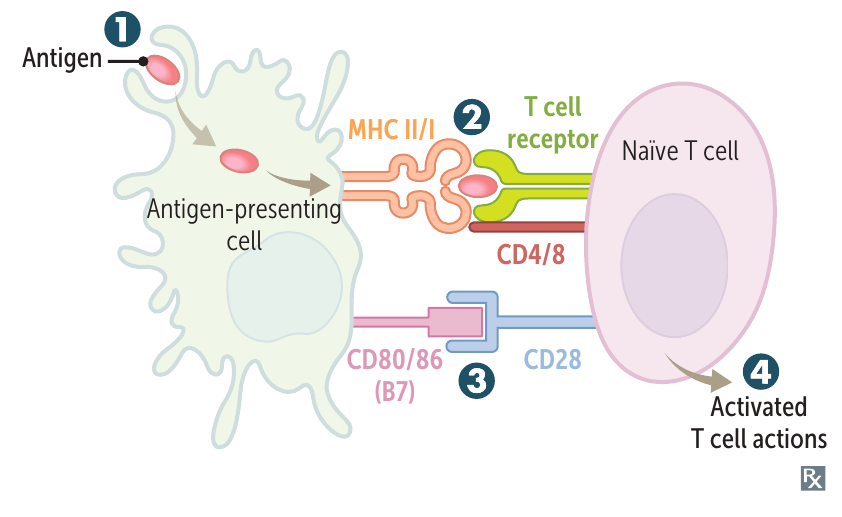
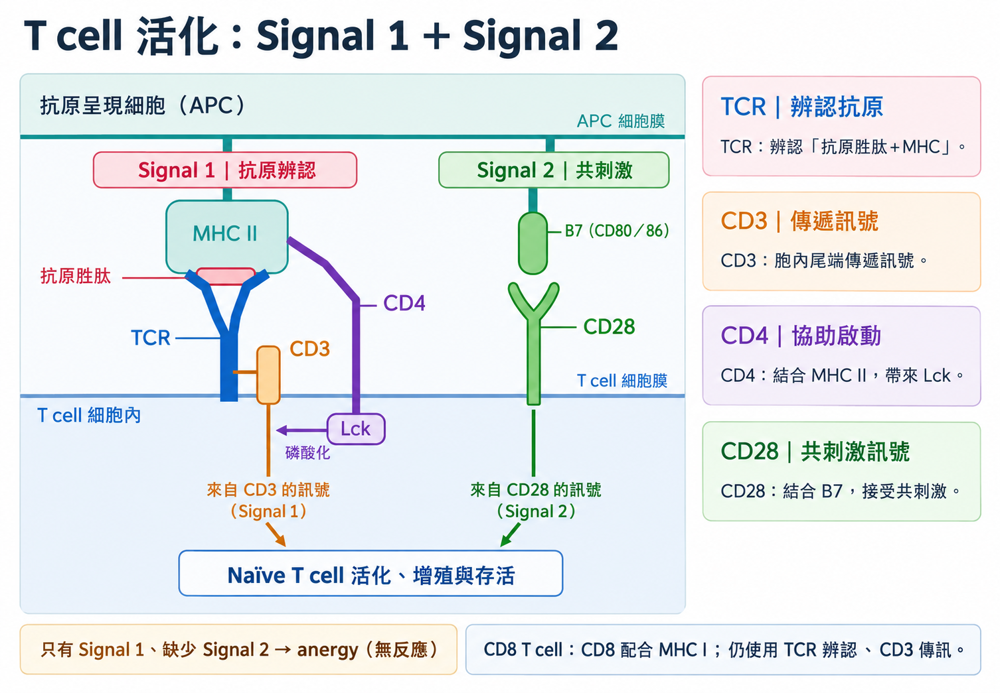

# 抗原呈現與 T cell 活化

## 內文

**APC（antigen-presenting cell）** 包括 dendritic cell、Langerhans cell、macrophage、B cell。啟動 naive T cell 時，dendritic cell 特別重要：它攝入局部抗原、移往引流 lymph node，使相應的 T cell 有機會接觸抗原。

1. **分解蛋白質，再把 peptide 放到細胞表面**

   Dendritic cell 將攝入的蛋白質分解成 **peptide，也就是蛋白質的短片段**；**MHC（major histocompatibility complex）是用來展示 peptide 的表面蛋白**；適合的片段載到 MHC 上，再隨 MHC 出現在細胞表面。分解、處理抗原稱 antigen processing；將 peptide–MHC 展示在表面稱 antigen presentation。

   | 呈現的情況 | 如何送到相應 T cell |
   |---|---|
   | **攝入的外來抗原，以 MHC II 呈現** | 相應 CD4 T cell 的 TCR（T-cell receptor）辨認 peptide–MHC II。MHC II 如何載入片段，見 [[MHC II 的抗原載入]]。 |
   | **細胞內產生的抗原，以 MHC I 呈現** | 相應 CD8 T cell 的 TCR 辨認 peptide–MHC I。 |
   | **部分攝入的外來抗原，改以 MHC I 呈現** | 稱 **cross-presentation**。Dendritic cell 可藉此提供 CD8 T cell 所需的抗原訊號。 |

   TCR 辨認的是 **peptide 與 MHC 的組合**，不是整個被吞入的病原。MHC I／II 的完整比較見 [[HLA-MHC]]。

2. **提供抗原訊號與共刺激，使 naive T cell 活化**

   | 訊號 | APC 與 T cell 如何接觸 | 對 T cell 的作用 |
   |---|---|---|
   | **Signal 1：抗原辨認** | Peptide–MHC 結合相應 TCR；**CD3 將訊號傳入細胞**。 | 指定這次由哪個能辨認抗原的 T cell 反應。 |
   | **Signal 2：共刺激** | APC 的 **B7（CD80／86）** 結合 T cell 的 **CD28**。 | 配合抗原訊號，支持 T cell 增殖與存活。 |

   收到相應的抗原訊號與共刺激後，T cell 可活化、增殖，再依其他訊號分化成不同功能的細胞；分工見 [[後天免疫 ② 細胞（T）]]。

   **只有抗原刺激、缺少共刺激**時，可進入 anergy，之後再遇到該抗原也無法正常活化。Cross-presentation 只交代 MHC I 上的抗原從哪裡來；啟動 naive CD8 T cell 仍需共刺激等活化條件。

   

   圖中 MHC II／CD4 與 MHC I／CD8 是不同配對，B7／CD28 提供共刺激。來源：First Aid 2026，書頁 101（PDF 第 123 頁）。

   

   第一張圖看 APC 與 T cell 的接觸；這張圖進一步區分 TCR、CD3 與 CD4 的工作。

### 來源

First Aid for the USMLE Step 1 2026：書頁 99–101；[Janeway：naive T cell 活化](https://www.ncbi.nlm.nih.gov/books/NBK27118/)。

TCR／CD3／CD4：[分工](https://pubmed.ncbi.nlm.nih.gov/26109064/)、[複合體結構](https://pmc.ncbi.nlm.nih.gov/articles/PMC3325661/)。
