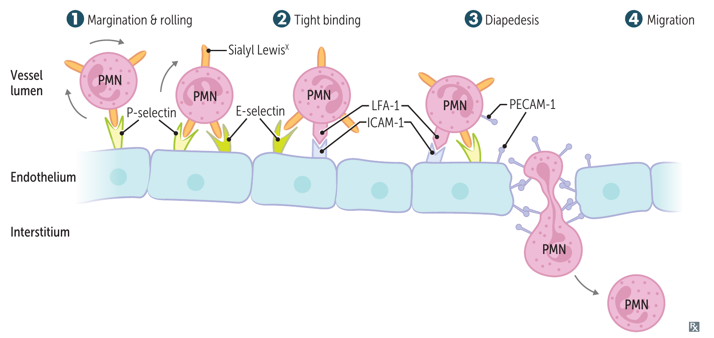

# 白血球如何離開血管

## 內文
血中有 neutrophil，不代表它已經抵達感染處。白血球必須在血管壁停下、穿出血管，再走向刺激處；這個過程主要發生於 **postcapillary venules**。

### 一、從血管腔到感染組織

1. **Margination、rolling：靠近血管壁並滾動**

   白血球靠近血管壁，以 selectin 的接觸在內皮上滾動。IL-1（interleukin-1）、TNF（tumor necrosis factor）使內皮增加 E-selectin；P-selectin 可從 Weibel-Palade bodies 移到內皮表面。

2. **Adhesion：牢固黏附在內皮上**

   白血球的 integrin 與內皮分子結合，使細胞牢固黏附。

3. **Transmigration：穿過內皮、離開血管**

   白血球穿過內皮細胞之間，離開血管，這個過程也稱 diapedesis。

4. **Migration：沿 chemotactic signals 移向刺激處**

   進入間質後，白血球沿 chemotactic signals 移向感染或受傷處。
   - **Chemotactic signals** 包括 C5a、IL-8、LTB4（leukotriene B4）、5-HETE（5-hydroxyeicosatetraenoic acid）、kallikrein、platelet-activating factor、細菌的 N-formylmethionyl peptides。
   - LTB4 與 5-HETE 來自 arachidonic acid 相關路徑；5-HETE 為 leukotriene precursor。

圖上方是血管腔，下方是組織；沿箭頭看白血球如何由血中抵達刺激處。來源：First Aid 2026，書頁 211（PDF 第 233 頁）。

前面 rolling、adhesion 與 transmigration 使用不同的分子配對：

| 步驟 | 內皮／組織側 | 白血球側 |
|---|---|---|
| Rolling | **E-selectin、P-selectin** | **Sialyl Lewis X** |
| Rolling | **GlyCAM-1（glycosylation-dependent cell adhesion molecule-1）、CD34** | **L-selectin** |
| Adhesion | **ICAM-1（intercellular adhesion molecule-1，CD54）** | **CD11／18 integrins：LFA-1（lymphocyte function-associated antigen-1）、Mac-1（macrophage-1 antigen）** |
| Adhesion | **VCAM-1（vascular cell adhesion molecule-1，CD106）** | **VLA-4（very late antigen-4）integrin** |
| Transmigration | **PECAM-1（platelet endothelial cell adhesion molecule-1，CD31）** | **PECAM-1（CD31）** |

### 二、移行步驟或招募訊號受損，白血球就難以到達局部

1. **Rolling 受損：LAD2**

   Sialyl Lewis X 減少，使白血球與 selectin 的接觸受損，造成 LAD2（leukocyte adhesion deficiency type 2）。

2. **牢固黏附受損：LAD1**

   CD18 integrin 缺陷使牢固黏附與移出受損，見 [[Congenital Immunodeficiency|LAD1]]。Neutrophil 留在血中卻無法有效到達感染處，因此血中數量可高，但患部缺少 neutrophil／pus，傷口修復也受影響。

3. **招募功能不足：Job syndrome**

   Th17（type 17 helper T cell）招募功能不足，也可使 neutrophil 難以聚集於感染處，見 [[Congenital Immunodeficiency|Job syndrome]]。這裡受影響的是招募功能，不是前兩項的 selectin／integrin 配對，也與單純血中 neutrophil 太少不同。

### 三、血中數量與到達組織的能力，要分開理解

1. **造血提供白血球**

   白血球的供應受造血調控。T cell 的 IL-3 支持 bone marrow stem cell 生長、分化，作用類似 GM-CSF（granulocyte-macrophage colony-stimulating factor）；對不同髓系細胞的作用見 [[細胞激素 Cytokines]]。臨床 neutropenia 的感染風險與處置見 [[Neutropenia]]。

2. **血中數量增加，未必代表清除能力變強**

   Glucocorticoids 可使原本靠近血管壁的白血球回到循環，稱 demargination，並減少移出血管，因此血中 neutrophil 數量升高。它同時抑制 NF-κB（nuclear factor κB）與多種 cytokines，見 [[免疫抑制劑]]。

### 來源

First Aid 2026：書頁 106、114–115、119、210–211、412、429。
