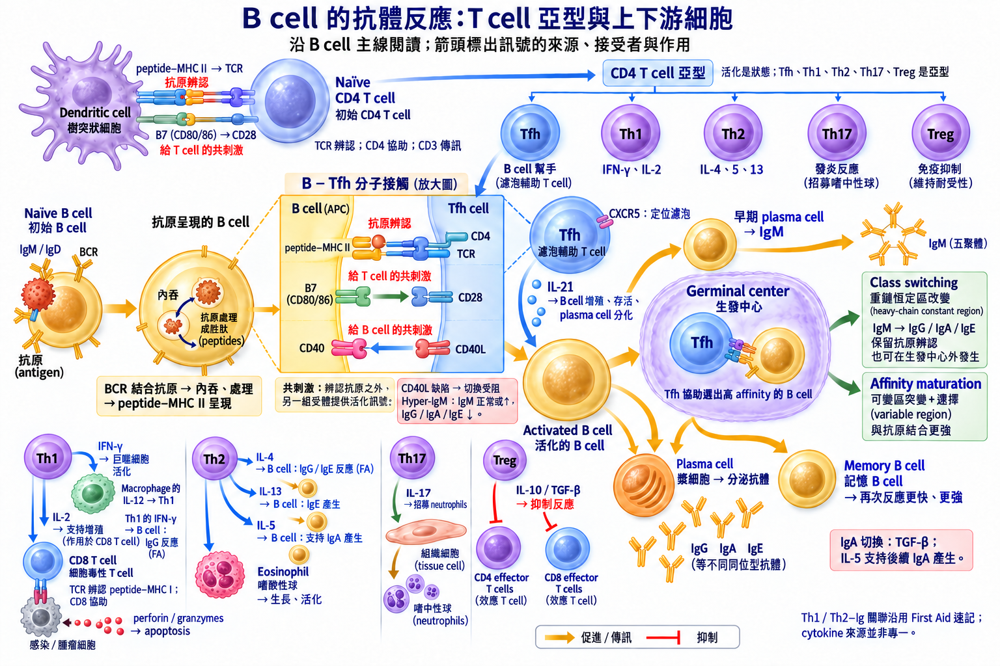

# 後天免疫 ① 體液（B／抗體）

## 內文
### B cell 如何產生抗體

1. **骨髓製造與成熟**

   | 階段 | 機轉 |
   |---|---|
   | 產生抗原辨認的多樣性 | RAG1／2 重組 light chain 的 **VJ**、heavy chain 的 **V(D)J** TdT（terminal deoxynucleotidyl transferase）隨機添加核苷酸，heavy／light chains 隨機配對 |
   | 成熟 naïve B cell | 表面同時表現 **IgM、IgD**，作為 BCR（B-cell receptor） 其他表面分子：CD19／CD20（個別作用待補）、**CD21（EBV receptor）** |
   | 成熟受阻 | **BTK 缺陷 → B cell 無法成熟 → B cell 缺如、各類 Ig↓**：[[Congenital Immunodeficiency\|Bruton agammaglobulinemia]] |

2. **到周邊淋巴器官、遇到抗原**

   - Lymph node cortex 的 **follicle**：初級濾泡未活化；次級濾泡有 **germinal center**，B cell 增殖、改善抗體反應。
   - 脾臟 white pulp 的 follicle 有 B cell；marginal zone 的特殊 B cell 與 macrophage 接觸血中抗原。
   - **BCR 直接結合抗原 → 內吞、處理**；含蛋白質的抗原可切成 peptide，以 **MHC II** 呈現給 T cell。

   | 抗原 | 抗原呈現 | 抗體反應 |
   |---|---|---|
   | **T-dependent**：含蛋白質，如 diphtheria toxoid | TCR 辨認 B cell 的 peptide–MHC II | 接受 T cell 幫助 → class switching、免疫記憶 |
   | **T-independent**：不含 peptide，如 LPS、莢膜多醣 | 無法以 peptide–MHC 呈現給 T cell | 免疫原性較弱；PPSV23 為此類疫苗 |

3. **B cell 接受 T cell 的幫助**

   **Tfh、Th1、Th2 都是 CD4 helper T cell 的亞型；「已活化」是狀態。**
   **共刺激**：辨認抗原之外，另一組受體提供活化訊號。

   | B cell 在做什麼 | T cell 如何參與 |
   |---|---|
   | 呈現抗原給 T cell | **B cell 的 peptide–MHC II → T cell 的 TCR** B cell 的 **B7（CD80／86）→ T cell 的 CD28**：共刺激是**給 T cell** |
   | 接收活化、切換訊號 | **T cell 的 CD40L → B cell 的 CD40**：共刺激是**給 B cell**，配合 cytokines → 活化、class switching |
   | 在濾泡／germinal center 改善抗體 | **Tfh（T follicular helper cell）** 以 CXCR5 定位濾泡 **CD40L、IL-21** 支持 B cell 存活、選出高 affinity 的 B cell、促進 plasma cell 分化 |
   | 生長、分化，改變 Ig 類別 | **Th1：IFN-γ；Th2：IL-4、IL-5、IL-13**，與 Ig 的對照見下方 IL-4／5 促進 B cell 生長，IL-5 也促進分化 |

4. **活化後：抗體切換、改善結合、分泌與記憶**

   | 變化 | 機轉 | 功能與疾病 |
   |---|---|---|
   | **Class／isotype switching** | 接受 CD40L＋cytokines → 重組 **heavy-chain constant region**，由 IgM 切換為 IgG／IgA／IgE 可在 germinal center 進行；重組酵素與 DNA 步驟待補 | **改變類別與作用，保留原本的抗原辨認** **CD40L 缺陷 → 切換受阻 → IgM 正常或↑、IgG／IgA／IgE↓**：[[Congenital Immunodeficiency\|Hyper-IgM]] |
   | **Somatic hypermutation → affinity maturation** | **Variable region** 產生變異；在 germinal center 接受 Tfh 幫助，選出更能結合抗原的 B cell | **與抗原結合更強** |
   | **Plasma cell** | B cell 分化為分泌抗體的細胞；lymph node 的 medullary cords 可見 | **分泌 antibody** B cell 分化受損 → plasma cells↓、Ig↓：[[Congenital Immunodeficiency\|CVID（common variable immunodeficiency）]] |
   | **Memory B cell** | 保留能辨認該抗原的 B cell | 再次遇到同一抗原 → 反應更快、更強 |

### 抗體的結構、種類與作用

**基本單位：2 條 heavy chains＋2 條 light chains，以 disulfide bonds 連接。**

| 部位 | 結構與作用 |
|---|---|
| **Fab**（fragment, antigen binding） | Heavy＋light chain 組成；末端 variable／hypervariable regions 結合抗原的 epitope **Idiotype** 對應抗原結合部位 |
| **Fc** | Heavy-chain constant region；carboxy terminal，帶 carbohydrate side chains 決定 **isotype（Ig 類別）**；結合補體或免疫細胞的 Fc receptor |
| **Hinge** | 讓 Fab 雙臂彎曲，同時結合多個 epitope |

- **Affinity**：單一位點的結合強度；**avidity**：多個位點一起結合的總強度（如 IgM pentamer）。
- **Neutralization**：阻止病原黏附細胞、毒素發揮作用。
- **Opsonization**：標記病原，促進吞噬；IgM／IgG 活化 [[Complement 補體系統]]，亦可促進調理、溶解病原。

#### 抗體五類

| Ig 類別 | 形式／分布 | 促進產生或切換的訊號 | 主要作用 | 相關疾病 |
|---|---|---|---|---|
| **IgM** | B cell 表面 monomer；分泌為 **pentamer＋J chain** | 初次反應**最先產生** | 表面抗原受體；活化補體 | Cold [[Autoimmune hemolytic anemia\|AIHA]] Hyper-IgM：正常或↑，其他 Ig↓ |
| **IgG** | Monomer；**血清最多** | Th1： **IFN-γ** Th2：**IL-4** | 再次反應主要抗體；活化補體、opsonization、中和毒素／病毒 **唯一可過胎盤**，提供嬰兒被動免疫，出生後逐漸下降 | Warm [[Autoimmune hemolytic anemia\|AIHA]] |
| **IgA** | 血中 monomer；分泌為 **dimer＋J chain** 淚液、唾液、黏液、母乳；**總產量最多** | **TGF-β：促進 IgA 切換** Th2 **IL-5：支持後續 IgA 產生** | GI tract（如 Peyer patches）產生；阻止病原黏附黏膜，防禦 Giardia；**不活化補體** Transcytosis 穿過上皮，取得 **secretory component** → 保護 Fc 免受腔內 proteases 分解 | [[Congenital Immunodeficiency\|IgA deficiency]]：GI／呼吸道感染，尤其 Giardia 腸道感染 血品 IgA 可引發 anaphylaxis Celiac 血清學可能偽陰性 |
| **IgE** | Monomer；結合 mast cell、basophil | Th2：**IL-4** 促進切換 **IL-13** 促進產生 | Allergen 使表面 IgE cross-link → 釋放 histamine 等 活化 eosinophil，參與抗寄生蟲反應 | [[Hypersensitivity 四型\|Type I 過敏]] [[Congenital Immunodeficiency\|Job syndrome]]：**IgE↑** |
| **IgD** | Monomer；成熟 naïve B cell 表面；血清量低 | 與 IgM 同時表現 | 表面抗原受體 | 待補 |

### 免疫記憶與應用

| 抗原接觸 | 反應 |
|---|---|
| **初次** | 先產生 IgM，再進行 class switching、建立記憶 |
| **再次** | Memory B cell → 更快、更強；IgG 為主要抗體 |

| | 主動免疫 | 被動免疫 |
|---|---|---|
| 來源 | 接觸抗原，自己產生免疫反應 | 取得現成抗體 |
| 速度／持續 | 起效較慢；有記憶、維持較久 | 起效快；保護隨抗體消退 |
| 例子 | 自然感染、疫苗、toxoid | 母體 IgG、母乳 IgA、antitoxin、單株抗體、IVIG（intravenous immunoglobulin） |

HBV 或 rabies 暴露後，可併用主動與被動免疫。

[[Immunocompromised|B cell／抗體缺損 → 莢膜菌]]

[[後天免疫 ② 細胞（T）|T cell 亞群與其他功能]]

### 來源

First Aid 2026 Immunology：書頁 94、96–103、106、108、114–115（PDF 頁碼＝書頁＋22）；Th1／Th2–Ig 依 p.106。

Tfh：[CD40L／IL-21、affinity selection 與 plasma cell 分化](https://pmc.ncbi.nlm.nih.gov/articles/PMC5030190/)、[人類 Tfh 的 IL-21 與抗體分泌](https://pubmed.ncbi.nlm.nih.gov/22250083/)。

IgA 補正：[TGF-β／切換（人類）](https://pubmed.ncbi.nlm.nih.gov/9820493/)；[IL-5／分泌（小鼠）](https://pubmed.ncbi.nlm.nih.gov/15493259/)。
