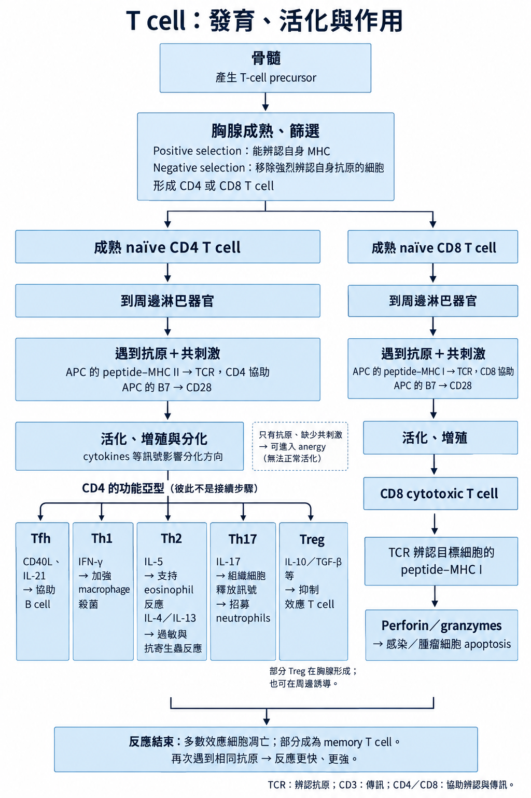

# 後天免疫 ② 細胞（T）

## 內文
### T cell 分化（CD4 vs CD8）

1. 骨髓製造

   骨髓產生 T-cell precursor → 胸腺成熟、篩選 → 到周邊淋巴器官接受抗原刺激。

   | T cell | 配對的 MHC | 主要作用 |
   |---|---|---|
   | CD4：helper T cell | MHC II | 分泌 cytokines、活化其他白血球、協助 B cell 製造抗體 |
   | CD8：cytotoxic T cell | MHC I | 誘導病毒感染細胞、腫瘤細胞與移植物細胞 apoptosis |

   - 抗原呈現的配對：**CD4 × MHC II = 8；CD8 × MHC I = 8**。詳見 [[HLA-MHC]]。
   - T cell 分布：lymph node 的 **paracortex**；脾臟 white pulp 的 **PALS（periarteriolar lymphatic sheath）**。
   - B、T cell 在發育時經 V(D)J recombination 產生辨認抗原的多樣性；活化後可形成 memory cells，再次遇到相同抗原時反應更快、更強。

2. 胸腺篩選

   胸腺 cortex 以未成熟 T cell 為主，medulla 以成熟 T cell 為主；篩選前可見同時表現 CD4、CD8 的 double-positive thymocyte。

   | 篩選 | 位置 | 如何決定存活 |
   |---|---|---|
   | Positive selection | Cortex | TCR（T-cell receptor）能辨認自身 peptide–MHC → 得到存活訊號 |
   | Negative selection | Medulla | 與自身抗原結合太強 → apoptosis，或成為 Treg **AIRE（autoimmune regulator）** 參與此篩選 |

### 活化訊號（TCR–MHC、共刺激）

[[抗原呈現與 T cell 活化|全文|群組縮排]]

- 活化的 helper T cell 分泌 cytokines；**IL-2（interleukin-2）支持 T cell 增殖**，其他作用對象見 [[細胞激素 Cytokines]]。
- IL-2 的轉錄、IL-2R 與下游 mTOR 是不同的藥物作用位置，見 [[免疫抑制劑]]。
- 周邊耐受在胸腺外限制自體反應：anergy、Treg suppression、Fas–FasL apoptosis；失去耐受 → autoimmunity。

### T cell 綜覽（CD4／CD8）

| T cell 類別 | 亞型 | 誘導訊號 | 分泌／釋放物與後續 | 表面分子與作用 | 抑制訊號 |
|---|---|---|---|---|---|
| T cell 綜論 | << | 抗原辨認＋共刺激（見上方） | 參與 [[Hypersensitivity 四型\|Type IV hypersensitivity]]、急性／慢性細胞性[[移植免疫 (Transplant immunology)\|移植排斥]] | **TCR（T-cell receptor）**：接觸「peptide＋MHC」，決定辨認哪個抗原 **CD3**：與 TCR 組成複合體，胞內尾端傳遞訊號 **CD28**：結合 APC 的 B7（CD80／86）→ 共刺激 | Treg 抑制 effector function |
| **CD4 T cell** | 綜覽 | Peptide–MHC II → TCR，加上 B7 → CD28 共刺激 | 見各亞群 | **CD4**：結合 MHC II 的另一處，帶來 Lck → 促進 CD3 磷酸化、啟動訊號 CXCR4／CCR5：HIV coreceptors | 見各亞群 |
| ^^ | Th1 | IFN-γ、IL-12 | **IL-2** → cytotoxic T cell（CD8）等細胞生長 **IFN-γ** 促進 macrophage 的 classical activation（M1），增強殺菌、偏向促發炎；參與 [[Granuloma (innate immunity)\|granuloma]] 形成 IFN-γ 亦增加 MHC 表現／抗原呈現，促進 IgG class switching | **CD40L → macrophage 的 CD40**，配合 IFN-γ → 加強殺死吞入的微生物 Macrophage 也以抗原呈現活化 lymphocyte | IL-4、IL-10 |
| ^^ | Th2 | IL-2、IL-4 | 分泌 **IL-4、5、6、10、13** **B cell**：IL-4 促進生長，影響 IgE／IgG class switching **B cell／eosinophil**：IL-5 促進生長、分化；支持 B cell 產生 IgA（切換由 TGF-β 促進） **限制發炎**：IL-10 降低 MHC II／Th1 cytokines，抑制活化的 macrophage、dendritic cell **Macrophage**：IL-4、IL-13 促進 alternative activation，偏向修復與抗發炎 **IgE**：IL-13 也促進 IgE 產生 | 待補 | IFN-γ |
| ^^ | Th17 | TGF-β、IL-1、IL-6 | **IL-17、21、22** → neutrophil 浸潤，參與對抗胞外細菌與黴菌 | 待補 | IFN-γ、IL-4 |
| ^^ | Treg | TGF-β、IL-2 | **限制免疫反應**：TGF-β、IL-10、IL-35 抑制 CD4／CD8 effector function，維持耐受、避免自體免疫 **修復**：TGF-β 也參與 angiogenesis、fibrosis | **CD25：IL-2 receptor α chain**，參與接收 IL-2 訊號  | IL-6 |
| ^^ | Tfh（T follicular helper cell） | 待補 | **IL-21** → 支持 [[後天免疫 ① 體液（B／抗體）\|B cell]] 抗體反應、affinity maturation | **CXCR5**：定位至濾泡／germinal center **CD40L → B cell 的 CD40**：協助 B cell 活化 | 待補 |
| **CD8 T cell** | << | Peptide–MHC I → TCR IL-2 支持生長 | 釋放含 **perforin、granzyme B** 的預製顆粒 → 目標細胞 apoptosis [[IFN 與 NK 如何對抗病毒\|NK]] 也使用 perforin／granzymes | **CD8**：結合 MHC I，帶來 Lck 協助 CD3 傳訊 | Treg |

**MHC I 減少時：**

- **CD8**：靠 MHC I 上的抗原辨認目標，因此較難辨認目標。
- **NK**：原本受到 MHC I 的抑制，抑制減弱後就較容易殺傷。

### 免疫缺陷與感染

[[醫學筆記/Infectious Disease/Immunocompromised|T cell 缺損 → 胞內菌／病毒／PJP]]

[[醫學筆記/Infectious Disease/Immunocompromised/Congenital Immunodeficiency]]

### 來源

First Aid for the USMLE Step 1 2026，Immunology：書頁 94、96–101、106、108、114–118（PDF 頁碼＝書頁＋22）。

CD25：[IL2RA／CD25](https://www.ncbi.nlm.nih.gov/gene/3559)、[活化 CD8 T cell 的 CD25 表現](https://pubmed.ncbi.nlm.nih.gov/20096608/)。

Tfh：[濾泡定位與 B-cell help](https://pubmed.ncbi.nlm.nih.gov/11104797/)、[CD40L／IL-21 與 germinal center 反應](https://pmc.ncbi.nlm.nih.gov/articles/PMC5030190/)。

TCR／CD3／CD4：[分工](https://pubmed.ncbi.nlm.nih.gov/26109064/)、[複合體結構](https://pmc.ncbi.nlm.nih.gov/articles/PMC3325661/)。

IgA 機轉補正：[TGF-β 促進切換（人類 B cell）](https://pubmed.ncbi.nlm.nih.gov/9820493/)；[IL-5 支持已切換 B cell 的 IgA 分泌（小鼠實驗）](https://pubmed.ncbi.nlm.nih.gov/15493259/)，區分 FA 的切換速記與後續產生。
