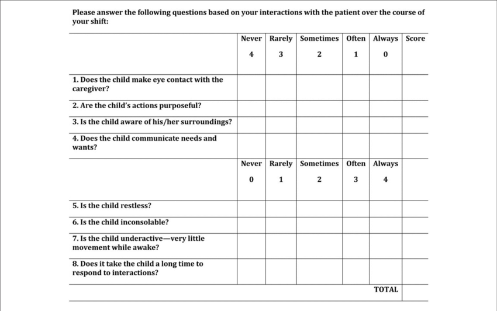
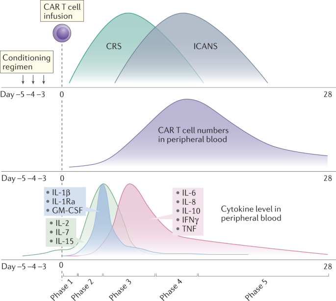
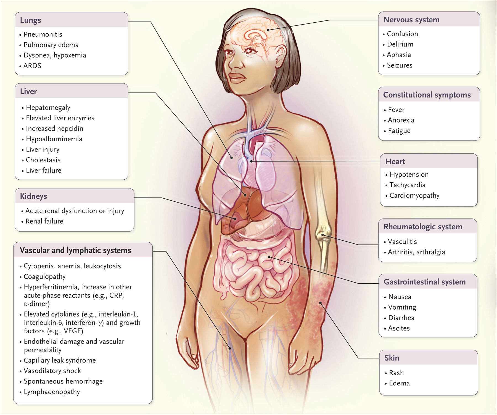

# CRS & ICANS post CAR-T

## 內文
CRS：注意三件事 O2? Hypotension? Fever?(⇒ infection focus?)

Biomarker: CRP, ferritin & IL-6

CAPD（兒童 delirium 分級）

ICE score（成人 ICANS 分級）

[NEJM：CAR-T 綜論](https://www.nejm.org/doi/full/10.1056/NEJMra2026131)
