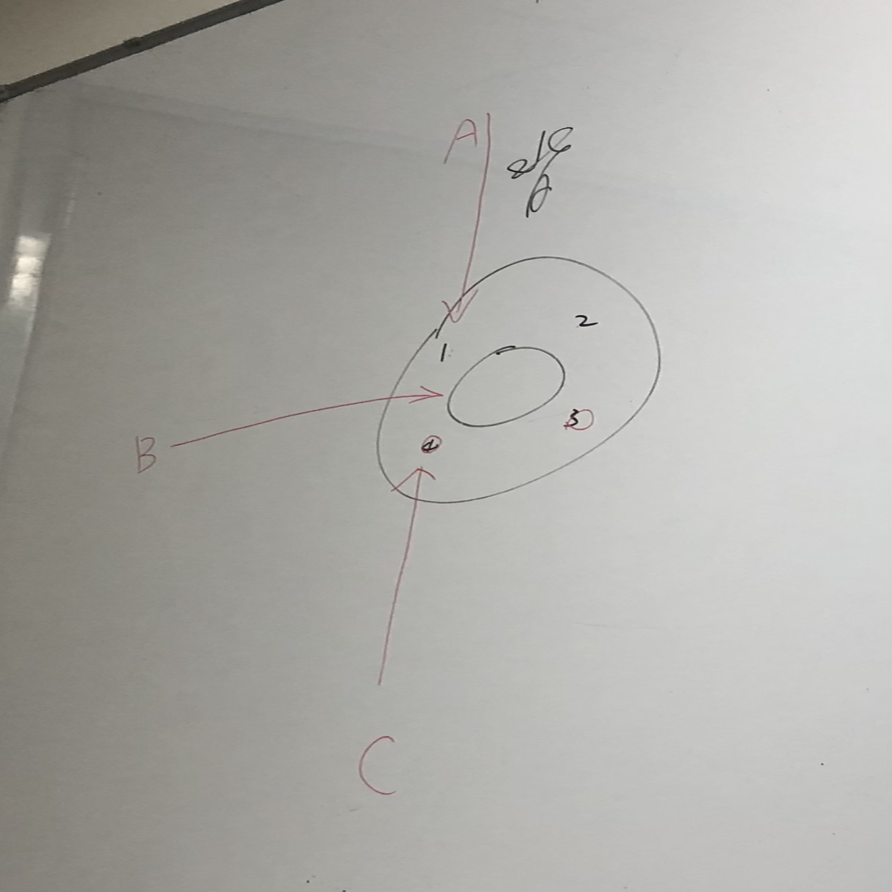

# 傷口縫合

## 內文
目的：加速癒合、止血、防止感染、美觀

傷口評估：乾不乾淨、深度、大小、有沒有傷到vital organ/神經/肌腱/血管

不能縫：動物咬傷，會怕縫起來裡面感染

還是需要縫：傷口很大或是傷口在臉

確認縫的時候裡面沒有foreign body

記得打local（麻手指要用digital block：左右MCP各2cc，從手背打←下圖選A因為手被比較不sensitive，不會痛）

縫線：

1. 可吸收：Chromic(7-10 d for口腔內)、Vicryl(1m，for體內)
2. 不可吸收：Prolene(單股)、Nylon(單股)、Silk(多股，摩擦力高，可用於如CVP/chest tube等地方綁管子，但小心用於體表容易感染)

粗細：臉上5-6(跟頭髮一樣細)，身體3-4，頭皮2-3

縫法：simple好看；mattress for深傷口（表面高低落差大難對齊）；深傷口高低落差大亦可以縫兩層（都simple，深層用可吸收）

傷口癒合因素：病患自己的factor(老、DM、血友病、其他體質？)，造成傷害的機轉、縫的技術

縫合需注意姿勢要舒服，因為要縫好一段時間
