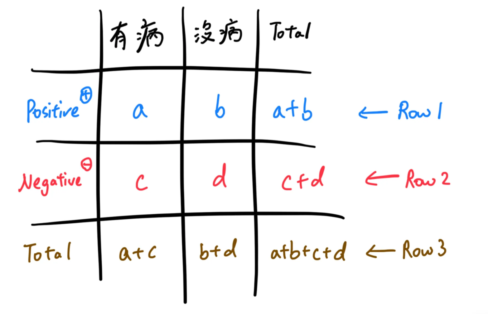
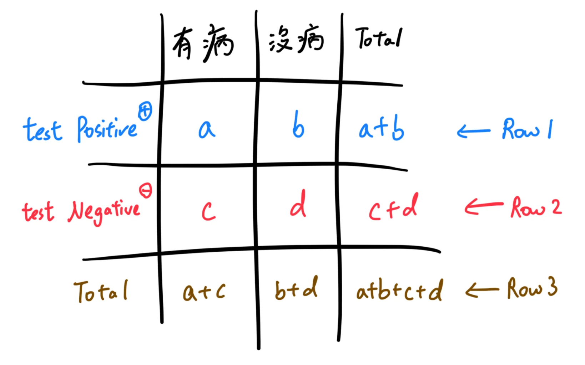
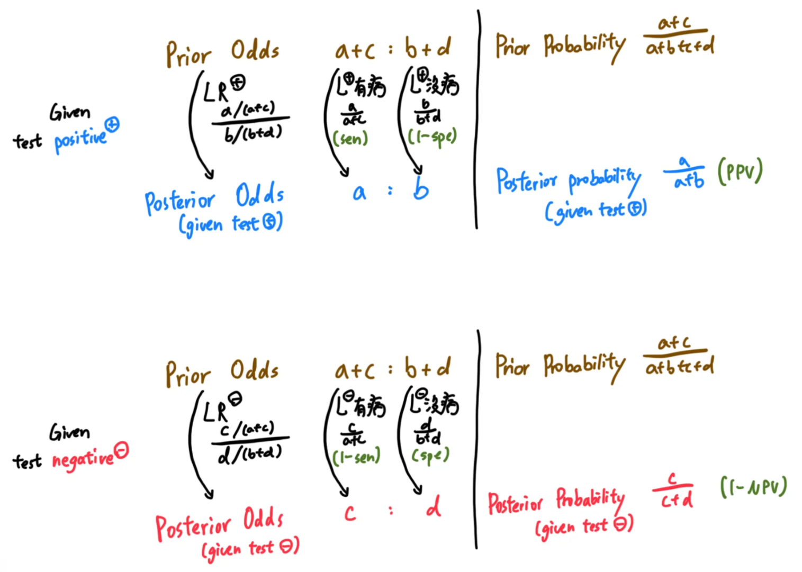
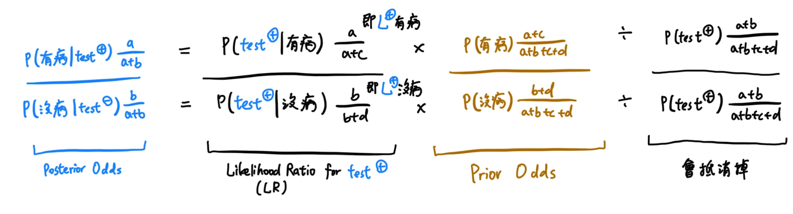
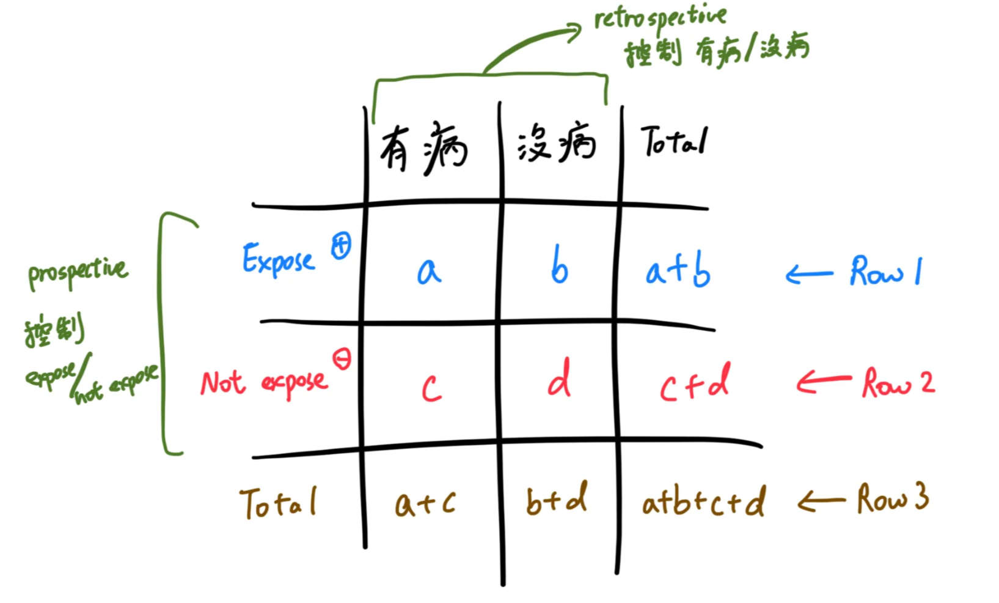
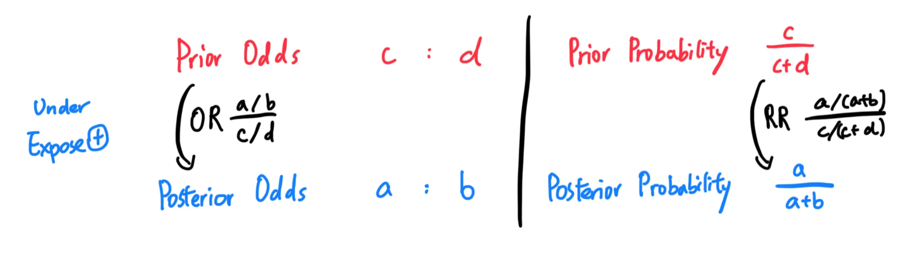

# 生物統計 Statistics

## 內文

數學工具定義

[[生物統計 Statistics/Likelihood & Likelihood Ratio (LR)|全文|群組縮排]]

[[生物統計 Statistics/Odds & Odds Ratio (OR)|全文|群組縮排]]

[[生物統計 Statistics/Probability & Relative Risk (RR)|全文|群組縮排]]

$\text{F1 score} = \frac{2*\text{Precision} * \text{Recall}}{\text{Precision} + \text{Recall}} = \cfrac{a}{a+\frac{b+c}{2}}$

應用場景一：Diagnostic test

應用場景二：Drug / Exposure analysis

