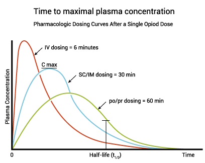

# 疼痛分四種：somatic、visceral、neurogenic、cancer

## 內文
1. **Somatic pain**：給 **Acetaminophen, NSAID**(長期高劑量用的話有GI、心臟、腎毒性，COX2比一般NSAID好)
   - 注意：Keto 對 Renal Colic 有效
2. **Visceral pain**：給 **opioid類** (morphine, bain, tramadol, fentanyl, …)
   - 注意：非癌 somatic & visceral 可以

     step on

     從最弱藥種 ex: Acetaminophen, Tramadol 開始給，BID=>TID=>換更強
3. **Neurogenic pain**：給 **anticonvulsants**(抗癲癇) and **antidepressants**, ex: lyrica、tofranil
4. **Cancer(mixed) pain & Hospice**（腦心肺肝腎器質性病變、衰竭）：**不需要step on**，直接上strong **morphine**（NSAID還是可以當輔助舒緩somatic pain）
   1. 因為怕副作用，initial dose 從單次 PRN 3mg 開始給 (breakthrough)，不過副作用（Drowsy, Delirium, Lethargy）除了 constipation & miosis 以外都會有 tolerance（所以用 opioid 很需要瀉藥，縮瞳除了給 clerk 做PE以外不會怎樣）
      - 注意：到達藥物作用巔峰（peak）的時候要去看一下病人的狀況，如果還在痛、又沒有什麼副作用就可以加量了，不用讓病人繼續等繼續痛苦

        
   2. 如果PRN 不夠（一天要求三次以上），就開始給長效(cycle basal)
   3. 如果 cycle basal 不夠：在 cycle basal 基礎上給 PRN，此時需要從 cycle basal 推算 PRN，Daily 劑量 / 6 = PRN dose，記得換算時也要轉換針劑與口服的濃度
   - Treatment goal : PRN ≤ 3 （最好0~1）; severity（痛苦分數） ≤3
