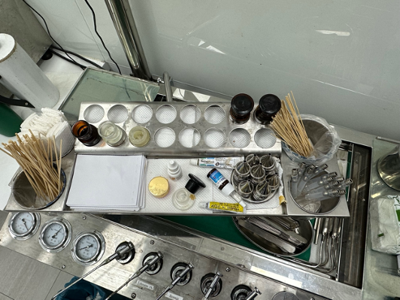

# 治療檯藥罐（右到左）

- BI (Betadine)：消毒
- ATT / Albothyl Concentrate (Policresulen)：用於口腔潰瘍的化學灼燒
  - 傳統上用硝酸銀較具刺激性
- Hydrocortisone acetate（美時皮質醇軟膏 1%）
- Bosmin + Lidocaine (B+L)
- 碘甘油（最左邊深褐色玻璃罐）

### 使用方式

- 嚴重鼻竇炎、擦耳朵：B+L
- 咽喉發炎：(B+L)＋碘甘油（塗在軟顎；塗完後三十分鐘可以進食）
- 外耳炎：(B+L)＋BI or 皮質醇
- Oral ulcer：ATT

