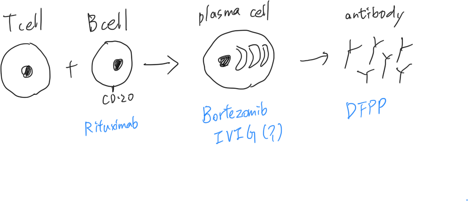

# 藥物：desensitization

## 內文

Rituximab: anti-CD20, 針對一般 B cell，但 plasma cell 上 CD20 不多所以比較無效

Bortezomib: proteosome inhibitor，阻止大量分泌蛋白質的細胞 （plasma cell）

DFPP: 血球回來，血漿洗第二次讓小分子蛋白回來，中間的Ig就會被洗掉（凝血蛋白也會一起洗掉，要補）

IVIG: 機制眾說紛紜，在這裡應該是用 negative feedback

先 DFPP ⇒ Bor ⇒ IVIG (思考一下原理，不能亂改順序)
