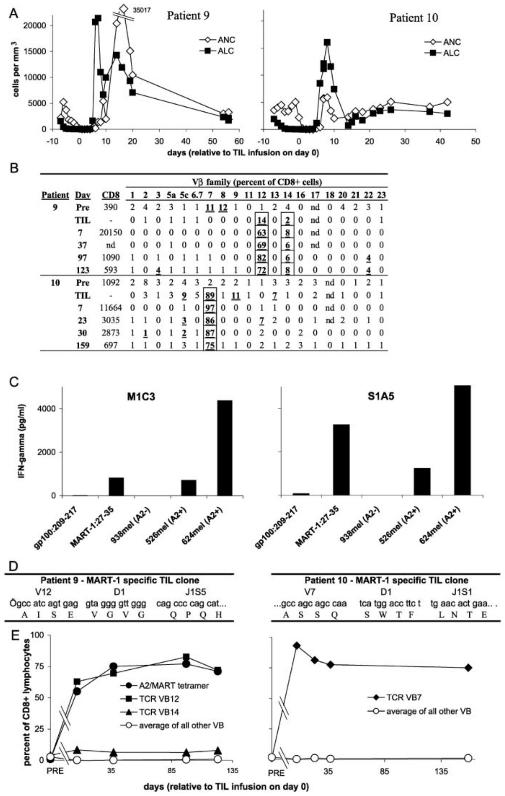
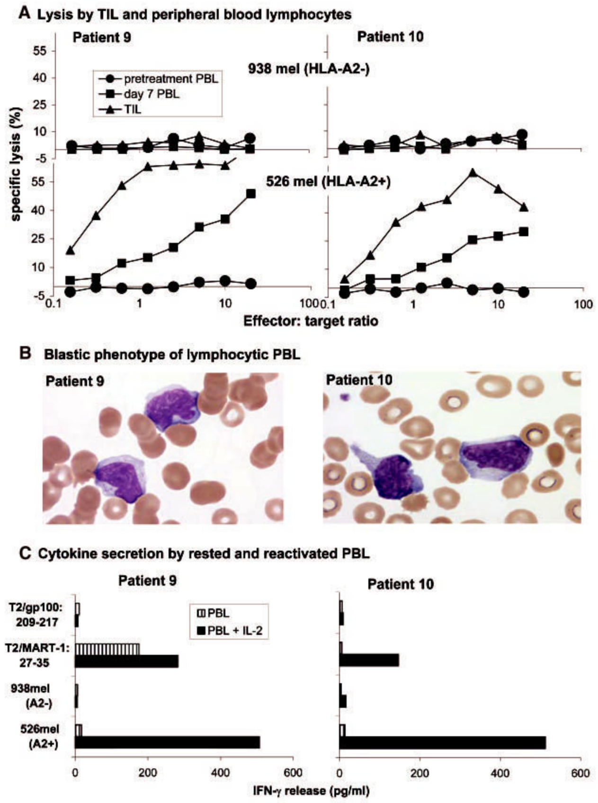
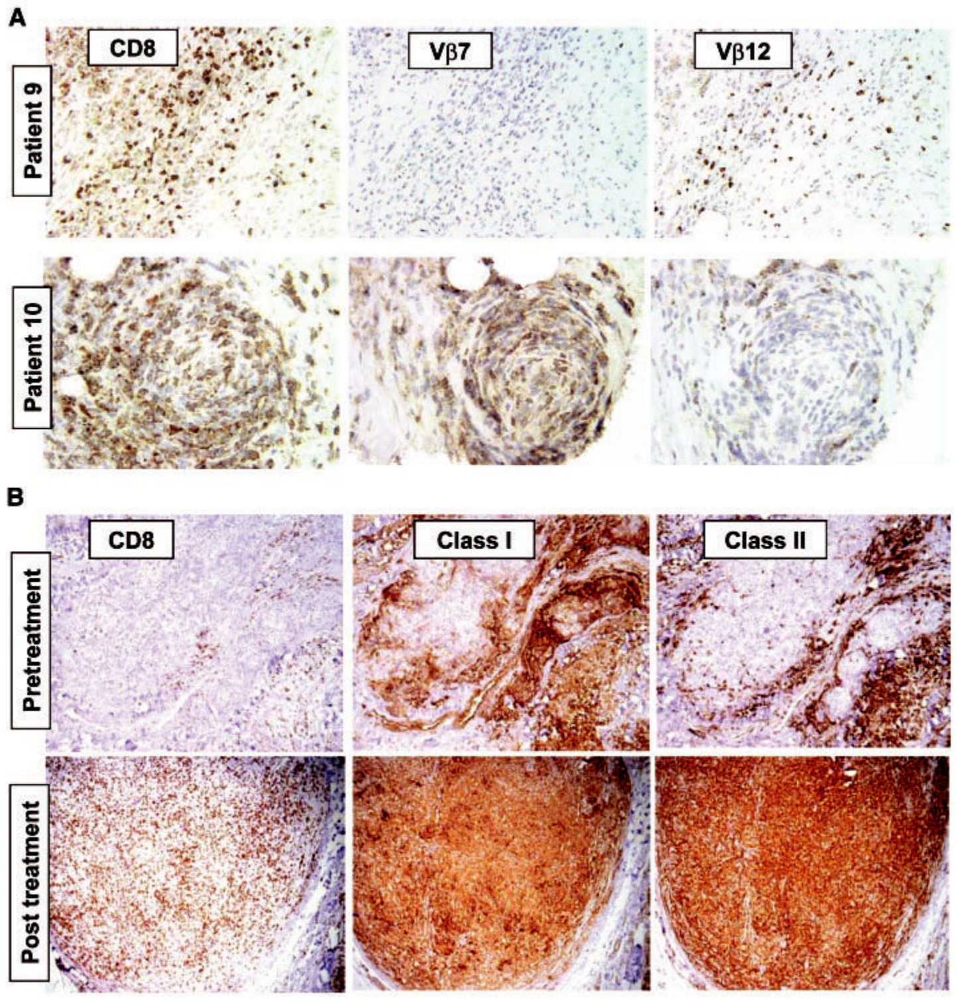

NIH Public Access

**Author Manuscript**

*Science.* Author manuscript; available in PMC 2007 January 5.

Published in final edited form as:  
*Science.* 2002 October 25; 298(5594): 850–854.

# Cancer Regression and Autoimmunity in Patients After Clonal Repopulation with Antitumor Lymphocytes

Mark E. Dudley¹, John R. Wunderlich¹, Paul F. Robbins¹, James C. Yang¹, Patrick Hwu¹, Douglas J. Schwartzentruber¹, Suzanne L. Topalian¹, Richard Sherry¹, Nicholas P. Restifo¹, Amy M. Hubicki¹, Michael R. Robinson², Mark Raffeld³, Paul Duray³, Claudia A. Seipp¹, Linda Rogers-Freezer¹, Kathleen E. Morton¹, Sharon A. Mavroukakis¹, Donald E. White¹, and Steven A. Rosenberg¹,*

1Surgery Branch, National Cancer Institute; National Institutes of Health, Bethesda, MD 20902, USA.

2National Eye Institute; National Institutes of Health, Bethesda, MD 20902, USA.

3Laboratory of Pathology, National Cancer Institute; National Institutes of Health, Bethesda, MD 20902, USA.

*To whom correspondence should be addressed. E-mail: SAR@nih.gov

## Abstract

We report here the adoptive transfer, to patients with metastatic melanoma, of highly selected tumor-reactive T cells directed against overexpressed self-derived differentiation antigens after a nonmyeloablative conditioning regimen. This approach resulted in the persistent clonal repopulation of T cells in those cancer patients, with the transferred cells proliferating in vivo, displaying functional activity, and trafficking to tumor sites. This led to regression of the patients’ metastatic melanoma as well as to the onset of autoimmune melanocyte destruction. This approach presents new possibilities for the treatment of patients with cancer as well as patients with human immunodeficiency virus-related acquired immunodeficiency syndrome and other infectious diseases.

Immunotherapy of patients with cancer requires the in vivo generation of large numbers of highly reactive antitumor lymphocytes that are not restrained by normal tolerance mechanisms and are capable of sustaining immunity against solid tumors. Immunization of melanoma patients with cancer antigens can increase the number of circulating CD8+ cytotoxic T lymphocyte precursor cells (pCTLs), but to date this has not correlated with clinical tumor regression, suggesting a defect in function or activation of the pCTLs (1).

Adoptive cell transfer therapies provide the opportunity to overcome tolerogenic mechanisms by enabling the selection and activation of highly reactive T cell subpopulations and by manipulation of the host environment into which the T cells are introduced. However, prior clinical trials, including the transfer of highly active antitumor T cell clones, failed to demonstrate engraftment and persistence of the transferred cells (2-5). Lymphodepletion can have a marked effect on the efficacy of T cell transfer therapy in murine models (6-9) and may depend on the destruction of regulatory cells, disruption of homeostatic T cell regulation, or abrogation of other normal tolerogenic mechanisms.

<table>
<caption class="caption" data-source-pages="10" id="paragraph-11">Table 1 Patient demographics, treatments received, and clinical outcomes.</caption>
<thead><tr><th colspan="2"></th><th colspan="4" scope="colgroup">Treatment*</th><th colspan="3"></th></tr><tr>
<th scope="col">Patient</th>
<th scope="col">Age/ sex</th>
<th scope="col">Cells infused† (× 10⁻¹⁰)</th>
<th scope="col">CD8/ CD4 phenotype (%)‡</th>
<th scope="col">Antigen specificity§</th>
<th scope="col">IL-2 (doses)</th>
<th scope="col">Sites of evaluable metastases</th>
<th scope="col">Response duration (months) ∥</th>
<th scope="col">Autoimmunity</th>
</tr></thead><tbody>
<tr><td>1</td><td>18/ M</td><td>2.3</td><td>11/39</td><td>Other</td><td>9</td><td>Lymph(axillary, nodes mesenteric, pelvic)</td><td>PR (24 +)¶</td><td>None</td></tr>
<tr><td>2</td><td>30/F</td><td>3.5</td><td>83/15</td><td>MART-1, gp100</td><td>8</td><td>Cutaneous, subcutaneous</td><td>PR (8)</td><td>Vitiligo</td></tr>
<tr><td>3</td><td>43/F</td><td>4.0</td><td>44/58</td><td>gp100</td><td>5</td><td>Brain, cutaneous, liver, lung</td><td>NR</td><td>None</td></tr>
<tr><td>4</td><td>57/F</td><td>3.4</td><td>56/52</td><td>gp100</td><td>9</td><td>Cutaneous, subcutaneous</td><td>PR (2)</td><td>None</td></tr>
<tr><td>5</td><td>53/ M</td><td>3.0</td><td>16/85</td><td>Other</td><td>7</td><td>Brain, lung, lymph nodes</td><td>NR-mixed</td><td>None</td></tr>
<tr><td>6</td><td>37/F</td><td>9.2</td><td>65/35</td><td>Other</td><td>6</td><td>Lung, intraperitoneal, subcutaneous</td><td>PR (15 +)</td><td>None</td></tr>
<tr><td>7</td><td>44/ M</td><td>12.3</td><td>61/41</td><td>MART-1</td><td>7</td><td>Lymph nodes, subcutaneous</td><td>NR-mixed</td><td>Vitiligo</td></tr>
<tr><td>8</td><td>48/ M</td><td>9.5</td><td>48/52</td><td>gp100</td><td>12</td><td>Subcutaneous</td><td>NR</td><td>None</td></tr>
<tr><td>9</td><td>57/ M</td><td>9.6</td><td>84/13</td><td>MART-1</td><td>10</td><td>Cutaneous, subcutaneous</td><td>PR (10 +)</td><td>Vitiligo</td></tr>
<tr><td>10</td><td>55/ M</td><td>10.7</td><td>96/2</td><td>MART-1</td><td>12</td><td>Lymph nodes, cutaneous, subcutaneous</td><td>PR (9+)¶</td><td>Uveitis</td></tr>
<tr><td>11</td><td>29/ M</td><td>13.0</td><td>96/3</td><td>MART-1</td><td>12</td><td>Liver, pericardial, subcutaneous</td><td>NR-mixed</td><td>Vitiligo</td></tr>
<tr><td>12</td><td>37/F</td><td>13.7</td><td>72/24</td><td>MART-1</td><td>11</td><td>Liver, lung, gallbladder, lymph nodes</td><td>NR-mixed</td><td>None</td></tr>
<tr><td>13</td><td>41/F</td><td>7.7</td><td>92/8</td><td>MART-1</td><td>11</td><td>Subcutaneous</td><td>NR</td><td>None</td></tr>
</tbody></table>

*Each patient was treated with chemotherapy (27) starting 7 days before cell administration, consisting of 2 days of cyclophosphamide at 60 mg per kg of body weight, followed by 5 days of fludarabine at 25 mg/m². On the day after the final dose of fludarabine, when circulating lymphocyte and neutrophil counts had dropped to less than 20/mm³, each patient received an intravenous infusion of autologous lymphocytes over approximately 30 to 60 min. After cell infusion, patients received high-dose IL-2 therapy consisting of 720,000 IU/kg by bolus intravenous infusion every 8 hours to tolerance (10). Some patients with mixed or responding lesions received an additional course of cell transfer therapy.

†T cell cultures for infusion were derived from TILs by minor modifications of established techniques (2,5). Multiple cultures were started from each resected melanoma specimen and were screened independently by cytokine secretion assay for recognition of autologous tumor cells (if available) and HLA-A2 tumor cell lines (11). TIL cultures that exhibited specific tumor cell recognition were expanded for treatment using one or two cycles of a rapid expansion protocol (28) with irradiated allogeneic feeder cells, OKT3 (anti-CD3) antibody, and 6000 IU per ml of IL-2.

‡Percent of lymphocyte gated cells from the infusion sample that stained with each antibody. Values do not add to 100% if a significant fraction of infused cells was double negative or double positive for CD4 and CD8 antigen expression.

§Antigen specificity was determined by cytokine release assay (11). Other: recognition of autologous tumor cells but no HLA-A2-restricted epitope derived from MART-1, tyrosinase, tyrosinase related protein 1 (TRP1), TRP2, NY-ESO-1, gp100, MAGE1, or MAGE3.

∥NR, no response; PR, partial response.

¶Microscopic residual focus of disease resected; patient remains free of disease (11). Patient 1 had a 6-mm brain density that increased to 8 mm at 8 months. After localized stereotactic radiotherapy, the density disappeared.

To determine whether prior lymphodepletion might improve the persistence and function of adoptively transferred cells, 13 HLA-A2+ patients with metastatic melanoma received immunodepleting chemotherapy with cyclophosphamide and fludarabine for 7 days before the adoptive transfer of highly selected tumor-reactive T cells and high-dose interleukin-2 (IL-2) therapy (10) (Table 1). These patients all had progressive disease refractory to standard therapies, including high-dose IL-2, and eight patients also had progressive disease despite aggressive chemotherapy. The patients received an average of 7.8 × 10¹⁰ cells (range, 2.3 × 10¹⁰ to 13.7 × 10¹⁰) and an average of nine doses of IL-2 (range, 5 to 12 doses). The T cells used for treatment were derived from tumor-infiltrating lymphocytes (TILs) and were rapidly expanded in vitro (11). All cultures were highly reactive when stimulated with an HLA-A2+ melanoma or an autologous melanoma cell line (Table 1 and table S1).

Six of the 13 patients had objective clinical responses to treatment and four others demonstrated mixed responses, with significant shrinkage of one or more metastatic deposits (11). Objective tumor regression was seen in the lung, liver, lymph nodes, and intraperitoneal masses and at cutaneous and subcutaneous sites. Five patients, all with evidence of concomitant cancer regression, demonstrated signs of autoimmune melanocyte destruction, including four patients with vitiligo and one patient with anterior uveitis (Table 1). All patients recovered from treatment with absolute neutrophil counts greater than 500/mm³ by day 11 after T cell infusion but with slower recovery of CD4+ cells, as expected after fludarabine therapy (12).

Fig 1. (A) Patient 9 (left) and patient 10 (right) exhibited a profound lymphocytosis after treatment. ALCs (solid squares) and absolute neutrophil counts (ANCs) (open diamonds) are plotted over time. The upper limit of normal for ALCs is 4800 cells/mm³. (B) Individual Vβs that were overrepresented in the infused cells (TILs) of patients 9 and 10 dominated the TCR repertoire of PBLs sampled after treatment (11). Values in the “CD8” column indicate the absolute number of CD8+ cells/mm³ of peripheral blood on the indicated day. PRE, pretreatment PBL; nd, not done. (C) T cell clones derived from the infused TILs by limiting dilution specifically recognized the MART-1: 27-35 peptide and HLA-A2+ melanoma cell lines by cytokine secretion assay (11). M1C3 is a Vβ12+ clone from patient 9 and S1A5 is a Vβ7+ clone from patient 10. (D) The DNA and predicted protein sequences of complementarity-determining region 3 (CDR3) of the TCR β chains of a Vβ12+ T cell clone from the infused TILs of patient 9 (left) or a Vβ7+ T cell clone derived from the TILs of patient 10 (right) are shown. Although both clones recognize the MART-1 antigen, no CDR3 sequence similarity between the clones is evident. (E) MART-1-reactive clones persisted as the predominant lymphocyte population in the peripheral blood for more than 4 months. PBL samples from patient 9 (left) or patient 10 (right) at the indicated days after cell transfer were analyzed by FACS (11) using antibodies specific for the indicated TCR Vβ families (Vβ7, solid diamonds; Vβ12, solid squares; Vβ14, solid triangles; average of other Vβs, open circles) or HLA-A2/MART-1: 26-35(27L) tetrameric complexes (A2/MART tetramer, solid circles). Lymphocytes from patient 10 reacted only with the native MART-1: 27-35 peptide, not the altered MART-1: 26-35(27L) peptide (14).

To investigate the function and fate of the transferred T cell populations, T cell receptor (TCR) expression was examined using a panel of beta chain variable region (Vβ)-specific antibodies in the six patients for whom peripheral blood samples were available at 1 week and approximately 1 month after cell transfer (table S2). Vβ expression was highly skewed in five of the six administered TILs, and these same Vβ families were also overrepresented in the peripheral blood of the patients at 1 week after cell transfer. Patient 9 and patient 10 exhibited clinical and laboratory findings after treatment that represent the achievement of a primary goal of adoptive immunotherapy. Within a few days of cessation of IL-2 therapy after TIL transfer, patients 9 and 10 demonstrated a pronounced lymphocytosis, with absolute lymphocyte counts (ALCs) reaching peak levels in peripheral blood of over 21,000 cells/mm³ on day 7 after cell infusion for patient 9, and over 16,000 cells/mm³ on day 8 after cell infusion for patient 10 (Fig. 1A). PBLs from patient 9 sampled at the peak of the lymphocytosis were 94% CD8+, of which 63% expressed Vβ12. Even more pronounced skewing of the T cell repertoire was observed in PBLs of patient 10 sampled at the peak of lymphocytosis, when 96% of the lymphocytes were CD8+, of which 97% expressed Vβ7 (Fig. 1B). Extreme skewing of TCR Vβ expression in the administered TIL and post-treatment PBL samples was confirmed using reverse transcription polymerase chain reaction (RT-PCR) with PCR primers that were designed to amplify all Vβ gene families (11). Thus, at both the RNA and protein levels, individual TCR Vβ families constituted a majority of the lymphocytes from the peripheral blood of patients 9 and 10 1 week after TIL transfer.

A Vβ12+ T cell clone from the administered TILs of patient 9 and a Vβ7+ clone from the TILs of patient 10, obtained by limiting dilution cloning and examined by cytokine secretion assay, exhibited specificity for the MART-1: 27-35 epitope and strong recognition of HLA-A2+ melanoma cells (Fig. 1C). MART-1/melan-A is a normal, nonmutated differentiation antigen expressed on melanomas and normal melanocytes (13). The nucleotide sequence of the clonotypically unique TCR beta chain V(D)J regions was determined from MART-1 reactive Vβ12+ and Vβ7+ T cell clones from the TILs of patients 9 and 10 (Fig. 1D). Although the clones from both patients recognized the MART-1 antigen, no primary TCR sequence similarity in the antigen-combining region was evident. Additional nucleotide sequence analysis of the V(D)J regions of six DNA clones each from the infused TILs and the post-treatment PBLs of patient 9 demonstrated that the Vβ12+ cells consisted of a clonally expanded cell population expressing the same MART-1-reactive TCR sequence shown in Fig. 1D. Similar results were obtained for the Vβ7+ cells from TILs and post-treatment PBLs of patient 10 (11). Thus, clonal MART-1-reactive T cell populations within the TILs infused into patients 9 and 10 repopulated the immune systems of these patients. Furthermore, these results suggested that the individual clones had undergone significant expansion in vivo. Patient 9 had more than 5.0 × 10¹⁰ circulating Vβ12+ lymphocytes; the patient was initially infused with approximately 1.2 × 10¹⁰ Vβ12+ TILs. Patient 10 had at least 5.6 × 10¹⁰ circulating Vβ7+ lymphocytes; the patient was initially infused with 9.5 × 10¹⁰ Vβ7+ TILs. Even without accounting for additional cells within lymphoid tissues or infiltrating into solid tissues, the preponderance of only a single clone in the peripheral blood of these two patients during their lymphocytic episodes was striking and indicated that the in vivo expansion of highly avid, functional antitumor lymphocytes had been achieved.

Although the absolute lymphocyte counts decayed to normal levels after 3 to 4 weeks in patients 9 and 10, the composition of the resulting lymphocyte pool remained highly skewed for over 4 months. As measured by antibody to Vβ12 and by A2/MART-1 tetramer fluorescence-activated cell sorting (FACS) (11) analysis, the MART-1-reactive clone in patient 9 remained above 60% of the CD8+ lymphocytes for over 123 days (Fig. 1E). Patient 10 retained the MART-1-reactive Vβ7+ T cell at a level of more than 75% of the CD8+ cells throughout the course of the study (over 159 days from the date of TIL transfer).

Fig 2. (A) The infused TILs (triangles) and PBLs collected 7 days after cell transfer (squares), but not pretreatment PBLs (circles), from patient 9 (left) and patient 10 (right) specifically lysed the HLA-A2+ melanoma cell line 526 (lower graphs) but not the HLA-A2- melanoma cell line 938 (upper graphs) (11). (B) Blood smears obtained from patient 9 (left) and patient 10 (right) during the lymphocytic episodes showed the highly activated phenotype of the lymphocytes, which show irregular and hyperchromatic nuclei, a high nuclear-to-cytoplasmic ratio, toxic granulation, and the presence of Dohle bodies. (C) PBLs collected 9 days (patient 9, left) or 8 days (patient, 10 right) after cell transfer were cultured overnight in the absence (striped boxes) or presence (solid boxes) of 600 IU/ml of IL-2, washed extensively, and tested for cytokine release when stimulated with the indicated target cells.

High levels of specific lysis of MART-1: 27-35 peptide pulsed targets (14) and MART-1-expressing HLA-A2+ tumor cell lines (Fig. 2A) were observed in the infused TILs and in the post-infusion PBLs. Blood smears of PBLs from patients 9 and 10 demonstrated that the circulating lymphocytes exhibited an atypical activated blastic morphology (Fig. 2B), consistent with their direct ex vivo lytic function. After overnight activation in IL-2 of post-transfer PBLs from patients 9 and 10, specific cytokine secretion to MART-1 peptide and HLA-A2+ tumors was evident, including interferon-γ (IFN-γ) (Fig. 2C), granulocyte-macrophage colony-stimulating factor, and tumor necrosis factor-α (14). These results suggested that the persistent in vivo expanded cells observed in both patients could express lytic activity as well as antigen-specific proinflammatory cytokine secretion after activation in situ.

Fig 3. (A) Antibodies specific for CD8 and TCR Vβ reveal tissue infiltration by a limited repertoire of T cells (11). Twenty days after cell transfer in patient 9, a resected tumor nodule contains diffusely infiltrating lymphocytes consisting of CD8+ Vβ12+ T cells, but no Vβ7+ T cells. Similarly, a residual tumor nodule biopsied 14 days after cell transfer from patient 10 exhibited few viable tumor cells but contained areas densely infiltrated by CD8+ Vβ7+ T cells, with few Vβ12+ cells. (B) A tumor lesion excised from patient 9 before nonmyeloablating chemotherapy (“pretreatment”) exhibited scant CD8+ cells (left), strong stromal cell staining but weak staining of tumor cells with antibody to MHC class I (center), and sporadic cell staining with an antibody to MHC class II (probably tumor macrophages) but minimal staining of tumor cells (right). In contrast, a sample resected 57 days after cell transfer (“post treatment”) exhibited a dense, diffuse CD8+ infiltrate and ubiquitous expression of both MHC class I and class II molecules in tumor cells.

Pretreatment tumor biopsy samples from patients 9 and 10 contained minimal lymphocytic infiltration (Fig. 3). After treatment, the biopsied specimens contained large areas of necrotic tumor and areas of dense, diffuse lymphocytic infiltrates. Immunohistochemical staining revealed that the lymphocytic infiltrates consisted predominantly of CD8+ cells (Fig. 3, A and B). The infiltrating T cells from patient 9 were predominantly Vβ12+ but not Vβ7+, whereas T cells infiltrating tumor tissue from patient 10 were predominantly Vβ7+ but not Vβ12+ (Fig. 3A). RT-PCR and nucleotide sequence analysis of RNA from biopsied tumor specimens from patient 9 obtained 20 days after cell transfer demonstrated that the predominant Vβ12+ cells expressed the MART-1-reactive TCR sequence (11). Both major histocompatibility complex (MHC) class I and MHC class II antigens were highly expressed in tumor deposits after therapy but were expressed only at low levels or not at all in tumors before TIL treatment (Fig. 3B), which was probably the result of IFN-γ secretion by the infiltrating lymphocytes (15). Thus, the proliferating, adoptively transferred antitumor cells were capable of trafficking to and infiltrating into tumor deposits.

Six patients, including patients 9 and 10, exhibited significant regression of metastatic melanoma, and five patients exhibited the onset of antimelanocyte autoimmunity (Table 1 and fig. S1). Patient 9 exhibited regression of more than 95% of his cutaneous and subcutaneous melanoma, ongoing at over 10 months, and developed vitiligo on his forearms. At four months after cell infusion, patient 9, who was Epstein-Barr virus (EBV) seronegative before treatment, developed an EBV-related lymphoproliferative disease that has been reported in EBV-seronegative patients receiving allogeneic transplants (16,17), and he is undergoing treatment for this problem. One other patient (patient 5) developed an opportunistic infection during treatment, a respiratory syncytial virus that lasted for 1 week and then cleared. Patient 10 exhibited regression of more than 99% of his nodal, cutaneous, and subcutaneous melanoma deposits, ongoing at over 9 months. Fourteen days after cell infusion, during the active regression of melanoma, patient 10 developed bilateral acute anterior uveitis, characterized by a fibrinous pupillary membrane that has responded to steroid eye drops, and he remains healthy with normal vision (fig. S1).

This high frequency and extended persistence of individual T cell clones reactive with nonmutated self-antigens in humans has not previously been seen. Limited persistence of transferred cultured T cells reactive with viral antigens such as cytomegalovirus and human immunodeficiency virus has been reported but rarely at levels exceeding a few percent of circulating cells (17-21), although higher levels have been observed during the acute phase of infectious mononucleosis (22,23).

The clinical and immunological findings from the patients reported here contrast sharply with our previous experience in investigating the adoptive transfer of cloned CD8+ T cells (including 15 patients who received cloned cells after nonmyeloablative conditioning), which did not result in any objective responses or any persistence of the transferred cells (5), and our experience with gene-modified TILs, which did not persist at high levels (24). One factor limiting in vivo persistence of CD8+ T cell clones as compared to the rapidly expanded TIL cultures reported here is the potential role of the transferred CD4+ (Table 1) cells, which have been shown in murine and human studies to play a role in the persistence of CD8+ cells (19, 25). Other factors may include an inherent proliferative impediment of clones expanded in vitro, the diversity of cell reactivities transferred, or disordered trafficking after multiple anti-CD3-mediated expansions. The nonmyeloablative conditioning regimen may have eliminated regulatory cells or altered homeostatic mechanisms that limit lymphocyte numbers and thus played a role in enabling the in vivo proliferation of the transferred cells (26).

In summary, treatment with autologous T cell transfer and high-dose IL-2 therapy after nonmyeloablative lymphodepleting chemotherapy resulted in the rapid growth in vivo of clonal populations of T cells specific for the MART-1 melanocyte differentiation antigen, and resulted in the destruction of metastatic tumors and autoimmune attack on normal tissues that expressed the MART-1 antigen. These cases demonstrate that adoptive transfer of tumor-reactive lymphocytes after nonmyeloablative conditioning can be an effective treatment for patients with metastatic cancer. Furthermore, this report establishes the principle that normally expressed “selfantigens” can be useful as targets for human tumor immunotherapy if the autoimmune consequences of such treatment are tolerable or locally controllable, as may be the case for patients with a variety of common cancers such as those of the prostate, breast, ovary, or thyroid, the functions of which are not necessary for survival or can readily be replaced. A similar approach could be applied to other tumor histologies or to infectious diseases, such as acquired immunodeficiency virus, for which functionally active lymphocytes can be selected in vitro.

## Supplementary Material

Refer to Web version on PubMed Central for supplementary material.

## References and Notes

1. Rosenberg SA, et al. Nature Med 1998;4:321. [PubMed: 9500606]

2. Rosenberg SA, et al. J. Natl. Cancer Inst 1994;86:1159. [PubMed: 8028037]

3. Yee C, et al. J. Exp. Med 2000;192:1637. [PubMed: 11104805]

4. Dudley ME, et al. J. Immunother 2001;24:363. [PubMed: 11565838]

5. Dudley ME, et al. J. Immunother 2002;25:243. [PubMed: 12000866]

6. Berenson JR, Einstein AB Jr. Fefer A. J. Immunol 1975;115:234. [PubMed: 1080165]

7. Eberlein TJ, Rosenstein M, Rosenberg SA. J. Exp. Med 1982;156:385. [PubMed: 6980254]

8. North RJ. J. Exp. Med 1982;155:1063. [PubMed: 6460831]

9. Rosenberg SA, Spiess P, Lafreniere R. Science 1986;233:1318. [PubMed: 3489291]

10. Rosenberg SA, Yang JC, White DE, Steinberg SM. Ann. Surg 1998;228:307. [PubMed: 9742914]

11. Materials and methods are available as supporting material. Science. Online

12. Cheson BD. J. Clin. Oncol 1995;13:2431. [PubMed: 7666104]

13. Kawakami Y, et al. Proc. Natl. Acad. Sci. U.S.A 1994;91:3515. [PubMed: 8170938]

14. Dudley, ME., et al. unpublished observations

15. Boehm U, Klamp T, Groot M, Howard JC. Annu. Rev. Immunol 1997;15:749. [PubMed: 9143706]

16. O’Reilly RJ, et al. Important Adv. Oncol 1996;1996:149.

17. Rooney CM, et al. Blood 1998;92:1549. [PubMed: 9716582]

18. Riddell SR, et al. Science 1992;257:238. [PubMed: 1352912]

19. Walter EA, et al. N. Engl. J. Med 1995;333:1038. [PubMed: 7675046]

20. Mitsuyasu RT, et al. Blood 2000;96:785. [PubMed: 10910888]

21. Walker RE, et al. Blood 2000;96:467. [PubMed: 10887107]

22. Callan MF, et al. J. Clin. Invest 2000;106:1251. [PubMed: 11086026]

23. Hislop AD, Annels NE, Gudgeon NH, Leese AM, Rickinson AB. J. Exp. Med 2002;195:893. [PubMed: 11927633]

24. Rosenberg SA, et al. N. Engl. J. Med 1990;323:570. [PubMed: 2381442]

25. Matloubian M, Concepcion RJ, Ahmed R. J. Virol 1994;68:8056. [PubMed: 7966595]

26. Jameson SC. Nature Rev. Immunol 2002;2:547. [PubMed: 12154374]

27. Childs R, et al. N. Engl. J. Med 2000;343:750. [PubMed: 10984562]

28. Riddell SR, Greenberg PD. J. Immunol. Methods 1990;128:189. [PubMed: 1691237]

29. The authors thank the clinical fellows and nursing staffs on the 2E and 2J wards of the Clinical Center, NIH, for excellent patient care; the technicians in the Surgery Branch TIL lab, NCI, for generation of the T cell cultures; C. Yee and S. Riddell for help in the early stages of this project; and M. Bishop and J. Gea-Banacloche for advice on patient care related to infectious disease
