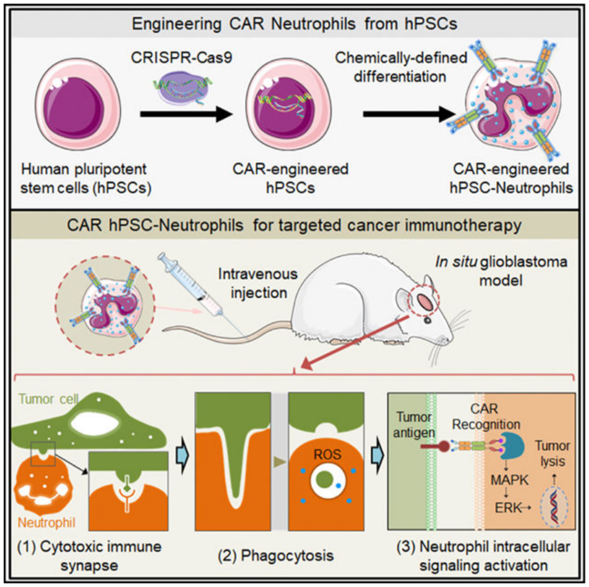
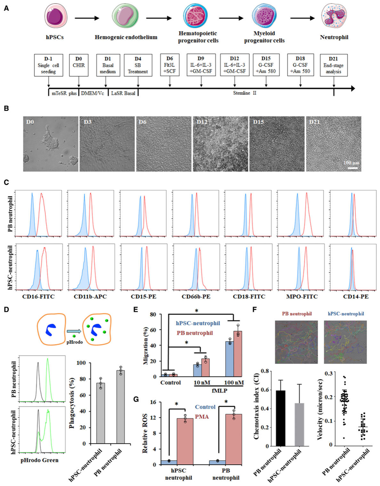
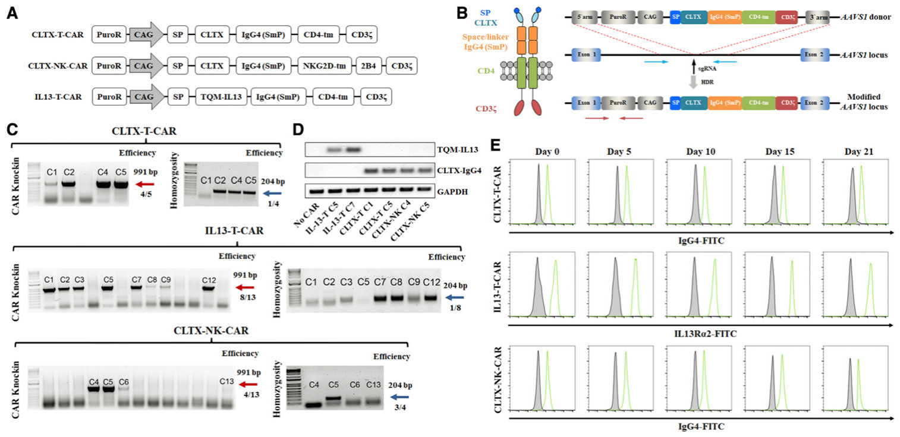
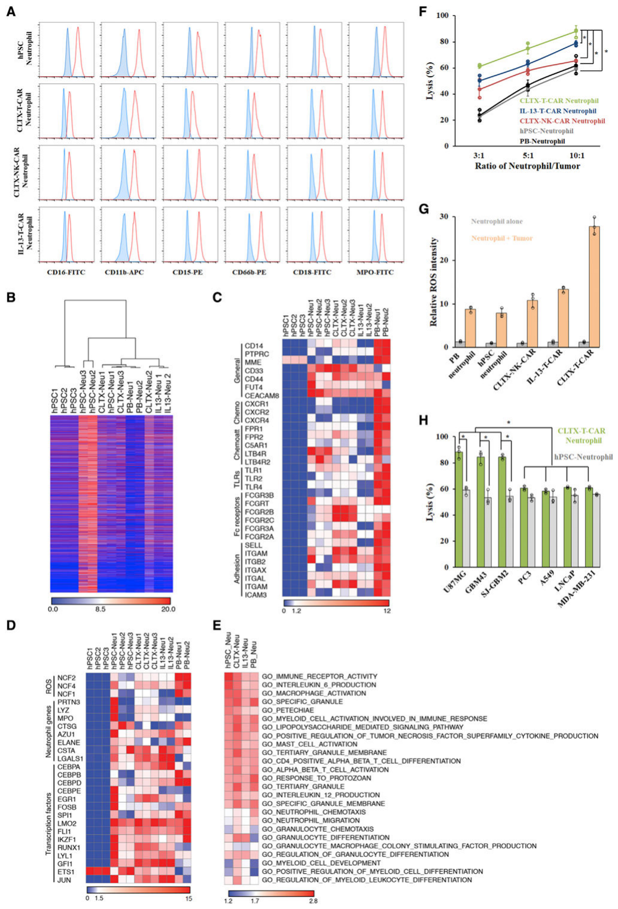
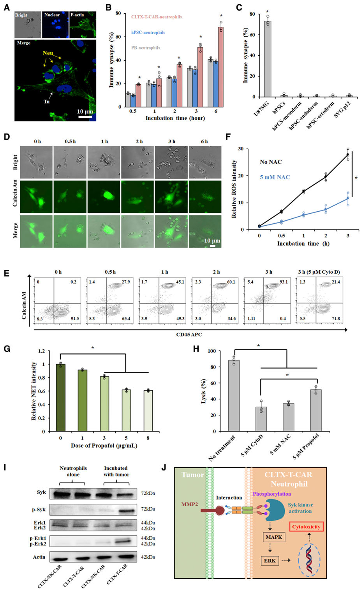
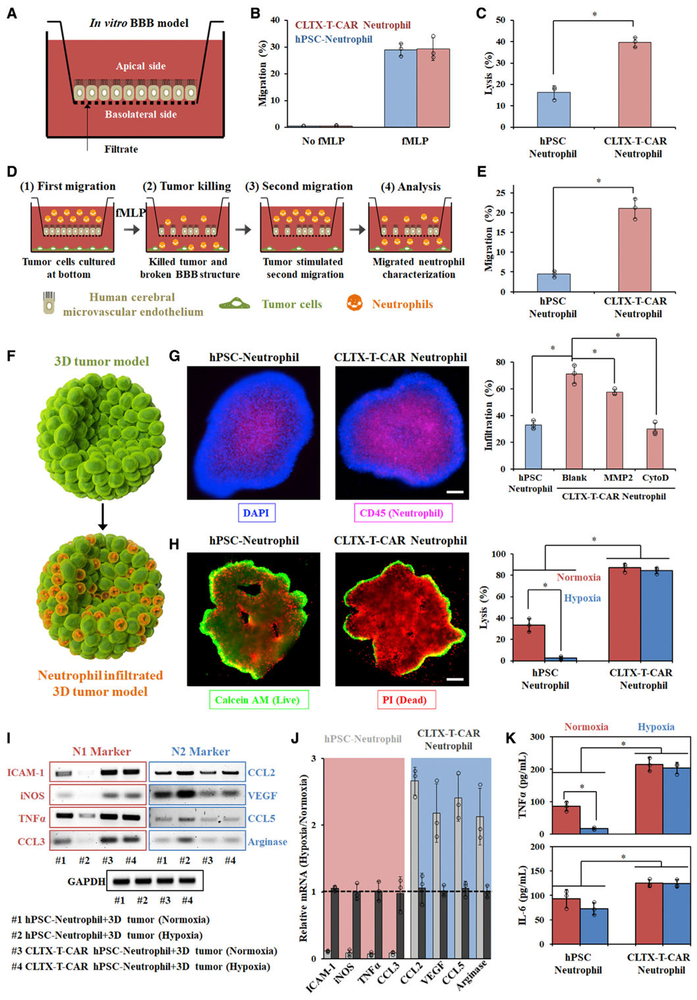
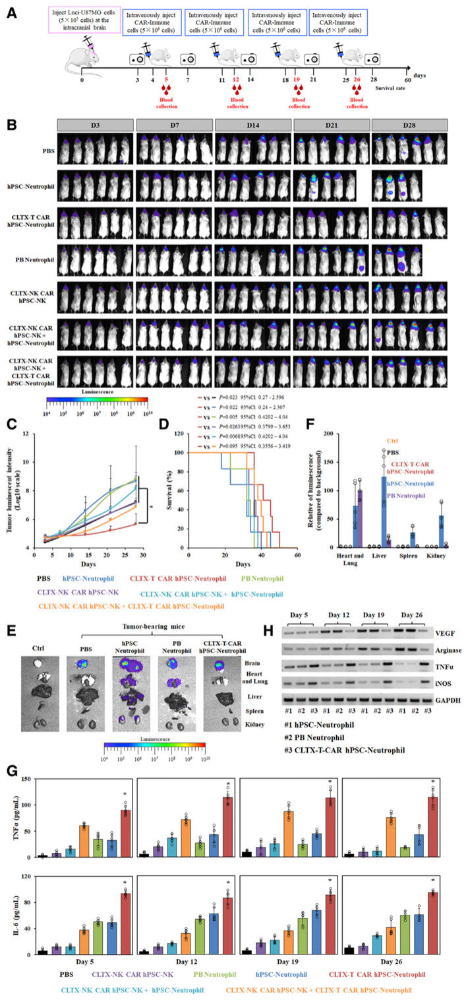

HHS Public Access

Author manuscript

*Cell Rep.* Author manuscript; available in PMC 2022 July 27.

Published in final edited form as:  
*Cell Rep.* 2022 July 19; 40(3): 111128. doi:[10.1016/j.celrep.2022.111128](https://doi.org/10.1016/j.celrep.2022.111128).

# Engineering chimeric antigen receptor neutrophils from human pluripotent stem cells for targeted cancer immunotherapy

Yun Chang1,2,7, Ramizah Syahirah3,7, Xuepeng Wang5, Gyuhyung Jin1,2, Sandra Torregrosa-Allen2, Bennett D. Elzey2,4, Sydney N. Hummel1, Tianqi Wang3, Can Li1, Xiaojun Lian6,*, Qing Deng2,3,*, Hal E. Broxmeyer5, Xiaoping Bao1,2,8,*

1Davidson School of Chemical Engineering, Purdue University, West Lafayette, IN 47907, USA

2Purdue University Center for Cancer Research, West Lafayette, IN 47907, USA

3Department of Biological Sciences, Purdue University, West Lafayette, IN 47907, USA

4Department of Comparative Pathobiology, Purdue University, West Lafayette, IN 47907, USA

5Department of Microbiology and Immunology, Indiana University School of Medicine, Indianapolis, IN 46202, USA

6Department of Biomedical Engineering, The Huck Institutes of the Life Sciences, Department of Biology, The Pennsylvania State University, University Park, PA 16802, USA

7These authors contributed equally

8Lead contact

## SUMMARY

Neutrophils, the most abundant white blood cells in circulation, are closely related to cancer development and progression. Healthy primary neutrophils present potent cytotoxicity against various cancer cell lines through direct contact and via generation of reactive oxygen species. However, due to their short half-life and resistance to genetic modification, neutrophils have not yet been engineered with chimeric antigen receptors (CARs) to enhance their antitumor cytotoxicity for targeted immunotherapy. Here, we genetically engineered human pluripotent stem cells with synthetic CARs and differentiated them into functional neutrophils by implementing a chemically defined platform. The resulting CAR neutrophils present superior and specific cytotoxicity against tumor cells both *in vitro* and *in vivo*. Collectively, we established a robust platform for massive production of CAR neutrophils, paving the way to myeloid cell-based therapeutic strategies that would boost current cancer-treatment approaches.

This is an open access article under the CC BY-NC-ND license (<http://creativecommons.org/licenses/by-nc-nd/4.0/>).

*Correspondence: lian@psu.edu (X.L.), qingdeng@purdue.edu (Q.D.), bao61@purdue.edu (X.B.).

## AUTHOR CONTRIBUTIONS

Y.C., R.S., Q.D., and X.B. conceived and designed the experiments. G.J., S.N.H., T.W., C.L., and X.L. contributed to the study design and assisted in data collection and analysis. Y.C., S.T.-A., B.D.E., and X.B. designed and performed *in vivo* experiments. Y.C., X.W., and H.E.B. designed and performed the hypoxia-related experiments. Y.C. and X.B. wrote the manuscript with support from all authors.

## SUPPLEMENTAL INFORMATION

Supplemental information can be found online at <https://doi.org/10.1016/j.celrep.2022.111128>.

## DECLARATION OF INTERESTS

A patent related to this manuscript is under application (Y.C., R.S., Q.D., and X.B.).

## Graphical Abstract

## In brief

Neutrophils are important innate immune cells that mediate both protumor and antitumor activities. Chang et al. genetically engineer human pluripotent stem cells to produce chimeric antigen receptor (CAR) neutrophils that display superior antitumor activities and improve survival in an *in situ* glioblastoma xenograft model.

## INTRODUCTION

Neutrophils, the most abundant circulating leukocytes in humans, accumulate in many types of tumors and represent a significant portion of tumor-infiltrating cells (Eruslanov et al., 2017; Ilie et al., 2012; Jaillon et al., 2020; Zhao et al., 2020). Due to their heterogeneity and plasticity in the tumor microenvironment (TME), neutrophils have demonstrated contradictory protumor and antitumor effects during tumor evolution. For instance, tumor-associated neutrophils present direct or antibody-dependent cytotoxicity against solid tumors (Kargl et al., 2019; Matlung et al., 2018), whereas they also facilitate angiogenesis, promote tumor metastasis, and suppress antitumor function of other cells in the TME (Coffelt et al., 2015, 2016; Huo et al., 2019). Protumor neutrophils also reduce the efficacy of cancer therapies (Itatani et al., 2020), including immunotherapies, leading to the development of neutrophil-targeted strategies for treating various cancers. However, given the high heterogeneity of neutrophils in the TME (Lecot et al., 2019; Sagiv et al., 2015), general suppression via small molecules or antibodies may eliminate both protumor and antitumor neutrophils and decrease the efficacy of neutrophil-targeted therapy. Furthermore, neutropenia or other adverse effects may develop in patients with cancer and increase risk of infections (McDermott et al., 2010). Thus, alternative neutrophil-targeting approaches are needed to realize their full potential in cancer treatment.

For the past decade, chimeric antigen receptors (CARs) have been used in T and natural killer (NK) cells to boost their anti-tumor effects (Feins et al., 2019; June and Sadelain, 2018; June et al., 2018; Lim and June, 2017; Mehta and Rezvani, 2018; Zhu et al., 2018), revolutionizing the field of cancer immunotherapy. More recently, engineering macrophages with CARs programmed them as antitumor effector cells and improved their phagocytosis (Klichinsky et al., 2020). Given their similarity to macrophages and shared innate antitumor response, neutrophils may also present enhanced tumoricidal activities after CAR engineering. Indeed, CD4ζ chimeric immune receptors improved cytolysis of neutrophils against HIV envelope (Env)-transfected cells *in vitro* with a lysis efficiency of ~10% at an effector-to-target ratio of 10:1 (Roberts et al., 1998), which is possibly due to the gene silencing during neutrophil differentiation from CD34+ progenitors. Similar antitumor cytotoxicity was also observed in anti-CD19 CAR myeloid cells derived from hematopoietic progenitors (Harrer et al., 2018; De Oliveira et al., 2013). These prior studies encouraged our interest in the search of alternative cell sources and preparation approaches for CAR neutrophils.

Here, we first developed a chemically defined, feeder-free platform for robust generation of neutrophils from human pluripotent stem cells (hPSCs) by applying stage-specific signaling modulators. Based on previous studies (Kim et al., 2020; Li et al., 2018; Nguyen et al., 2012; Wang et al., 2020a), we synthesized and knocked 3 different glioblastoma (GBM)-targeting CARs into the *AAVS1* safe-harbor locus in hPSCs by CRISPR-Cas9-mediated homologous recombination and assessed their ability in improving neutrophil-mediated tumor killing. We found the CLTX-T-CAR construct, composed of chlorotoxin (CLTX) (Wang et al., 2020a), a 36-amino acid GBM-targeting peptide found in *Leiurus quinquestriatus* scorpion venom, CD4 transmembrane domain, and CD3ζ intracellular domain, as best in enhancing antitumor cytotoxicity of hPSC-derived neutrophils. The resulting CLTX-T-CAR neutrophils presented a typical neutrophil phenotype and killed tumor cells through specific binding to GBM via membrane-associated matrix metalloproteinase 2 (MMP2). Compared with wild-type neutrophils, NK, and CAR NK cells, systemically administered CLTX-T-CAR neutrophils significantly inhibited tumor growth in an *in situ* GBM xenograft model and prolonged animal survival. Collectively, our neutrophil differentiation platform in combination with gene-editing techniques may provide a realistic approach to manufacture CAR neutrophils for targeted immunotherapy, thus paving the way to myeloid cell-based therapeutic strategies that would enhance the efficacy of current immunotherapies.

## RESULTS

### Chemically defined condition allows robust generation of functional neutrophils

Hematopoietic progenitor induction is the first step to generate neutrophils from hPSCs (Brok-Volchanskaya et al., 2019; Lachmann et al., 2015; Saeki et al., 2009; Sweeney et al., 2016; Trump et al., 2019). Hematopoietic stem and progenitor cells (HSPCs) arise from arterial vasculatures in the aorta-gonad-mesonephros (AGM) region through endothelial-to-hematopoietic transition (EHT) (Bertrand et al., 2010; Boisset et al., 2010; Kissa and Herbomel, 2010). We induced homogeneous CD34+CD31+ hemogenic endothelium (HE) from hPSCs via small-molecule activation of Wnt signaling (Figures S1A and S1B) (Bao et al., 2015; Lian et al., 2014). The resulting HE also expressed SOX17 (Figures S1B–S1D), a transcription factor expressed in AGM vascular structures and required for HSPC generation (Clarke et al., 2013; Kim et al., 2007; Ng et al., 2016). Transforming growth factor beta (TGFβ) inhibitor SB431542 (SB) significantly promoted EHT for generation of CD45+CD43+ HSPCs (Chang et al., 2022) that co-expressed definitive markers CD44 (Fidanza et al., 2019; Oatley et al., 2020) and RUNX1c (Ng et al., 2016) (Figures S1E–S1H). The resulting HSPCs also maintained a high viability after freeze thaw (Figures S1I and S1J).

Figure 1. hPSC-derived neutrophils adopt a molecular and functional phenotype similar to primary neutrophils

(A) Schematic of optimized neutrophil differentiation from hPSCs under chemically defined conditions.

(B) Representative bright-field images of neutrophil differentiation at indicated days: day-0 hPSCs, day-3 mesoderm, day-6 hemogenic endothelium, day-12 hematopoietic stem and progenitor cells, day-15 myeloid progenitor cells, and day-21 neutrophils. Scale bars, 100 µm.

(C) Flow cytometry analysis of generated neutrophils is shown. Peripheral blood (PB) neutrophils were used as a positive control.

(D) Phagocytosis of pHrodo *E. coli* particles by hPSC-derived neutrophils.

(E) Transwell migration analysis of hPSC-derived neutrophils in the absence or presence of chemoattractant (10 and 100 nM fMLP). Data are represented as mean ± SD of three independent replicates, *p < 0.05.

(F) Representative tracks, mean velocity, and chemotaxis index of hPSC-derived and PB neutrophils during chemotaxis are shown.

(G) Reactive oxygen species (ROS) production of hPSC-derived and PB neutrophils with or without phorbol 12-myristate 13-acetate (PMA) treatment. Data are represented as mean ± SD of three independent replicates, *p < 0.05. CHIR, CHIR99021; SB, SB431542; SCF, stem cell factor; G-CSF, granulocyte colony-stimulating factor; GM-CSF, granulocyte-macrophage colony-stimulating factor; Vc, vitamin C.

To make myeloid progenitors, hPSC-derived HSPCs were treated with granulocyte-macrophage colony-stimulating factor (GM-CSF), interleukin-3 (IL-3), and IL-6 from day 9 (Figure S2A). Floating myeloid progenitors collected at different days presented both GM and macrophage (M) colony-forming potential (Figures S2B and S2C), which increased from day 12 to 18 and decreased afterward. To induce neutrophil specification, day-15 myeloid progenitors were treated with G-CSF, which significantly decreased the number of CD14+ monocytes/macrophages compared with GM-CSF (Figures S2D and S2E). To identify optimal myeloid progenitors for neutrophil differentiation, floating cells at days 12, 15, and 18 were treated with G-CSF and AM580 (Figure S2F). The efficiency of neutrophil differentiation increased from day 15 to 21 and significantly decreased afterward, possibly due to the short lifespan of neutrophils (Figures S2G and S2H). We next identified day-15 cells with 6-day treatment of G-CSF and AM580 as the optimal condition for neutrophil differentiation in ~21 days (Figures 1A and 1B). We sorted CD16− cells from neutrophil differentiation cultures and determined that they were composed of ~20% FcεR1α+ basophils and ~74% EPX+ eosinophils (Figures S2I and S2J). The resulting neutrophils displayed a typical neutrophil morphology (Figures S2K and S2L) and manifested high expression levels of neutrophil markers (Figure 1C), including CD16, CD11b, CD15, CD66b, CD18, and MPO, compared with their counterparts in peripheral blood (PB).

To evaluate the function of hPSC-derived neutrophils, we performed phagocytosis and chemotaxis assays. Similar to PB neutrophils, hPSC-derived cells effectively phagocytosed pHrodo *E. coli* bioparticles (Figure 1D) and displayed excellent migration ability in transwell and microfluidic chemotaxis models (Figures 1E and 1F) (Afonso et al., 2013). We also measured the production of reactive oxygen species (ROS) from hPSC-derived neutrophils, which generated comparable ROS to PB neutrophils in response to phorbol 12-myristate 13-acetate (PMA) (Figure 1G). Collectively, we established a chemically defined platform for robust neutrophil production with a yield of ~20 neutrophils per hPSC, highlighting its potential applications in studying neutrophil biology and treating neutropenia.

### *AAVS1*-targeted CAR knockin improves antitumor cytotoxicity of hPSC-derived neutrophils

Figure 2. Construction of chimeric antigen receptor (CAR) knockin H9 hPSCs using CRISPR-Cas9

(A) Schematic of CLTX-T-CAR, CLTX-NK-CAR, and TQM-IL13-T-CAR, composed of a signal peptide (SP), a glioblastoma-targeting extracellular domain chlorotoxin (CLTX), or quadruple mutant IL-13 (TQM13), an Fc domain IgG4 (SmP), a transmembrane domain CD4-tm, and an intracellular domain CD3ζ. CLTX-NK-CAR also includes a 2B4 co-stimulatory domain.

(B) Schematic of CLTX-T-CAR construct and targeted knockin strategy at *AAVS1* safe-harbor locus. Vertical arrow indicates *AAVS1* targeting sgRNA. Red and blue horizontal arrows indicate primers for assaying targeting efficiency and homozygosity, respectively.

(C) PCR genotyping of single-cell-derived hPSC clones after puromycin selection is shown, and the expected PCR product for correctly targeted *AAVS1* site is 991 bp (red arrow) with an efficiency of 4 clones from a total of 5, 8 clones from a total of 13, and 4 clones from a total of 13 for CLTX-T-CAR, IL13-T-CAR, and CLTX-NK-CAR, respectively. A homozygosity assay was performed on the knockin clones, and those without 240 bp PCR products were homozygous (blue arrow).

(D and E) Heterozygous clones of CLTX-T-CAR C5, IL13-T-CAR C7, and CLTX-NK-CAR C5 were selected for subsequent studies. Representative RT-PCR (D) and flow cytometry (E) analyses of IL-13 and CLTX-IgG4 expression on wild-type and CAR knockin hPSCs during neutrophil differentiation are shown.

Healthy primary neutrophils present potent tumor-killing activity against various cancer cell lines (Yan et al., 2014). Thus, we sought to determine whether hPSC-derived neutrophils are able to directly kill tumor cells and whether CAR expression could enhance their antitumor cytotoxicity. To achieve stable and uniform CAR expression on neutrophils, we knocked CAR constructs into the *AAVS1* locus in hPSCs via Cas9-mediated homologous recombination (Figures 2A–2C). Three different anti-GBM CARs were designed using T or NK cell-specific activation domains: CLTX-T-CAR (Wang et al., 2020a), IL-13 receptor alpha 2 (IL-13Rα2)-targeted quadruple mutant IL-13 (TQM13) T-CAR (IL13-T-CAR) (Kim et al., 2020; Nguyen et al., 2012), and CLTX-NK-CAR (Li et al., 2018). PCR genotyping showed that 60% (3 out of 5), 53.8% (7 out of 13), and 7.7% (1 out of 13) of hPSC clones were targeted in one allele (heterozygous) and 20% (1 out of 5), 7.7% (1 out of 13), and 23.1% (3 out of 13) in both alleles (homozygous) for CLTX-T-CAR, IL-13-T-CAR, and CLTX-NK-CAR (Figure 2C), respectively. While we used a relatively specific guide RNA (gRNA) for *AAVS1* targeting, off targeting remains a major concern. Our sequencing results indicated no detectable insertion or deletion (indel) formation in 5 top off-target sites (Table S1), consistent with previous reports on the specificity of Cas9 editing in hPSCs (Bao et al., 2019; Chen et al., 2015). Stable CAR expression on hPSCs was confirmed by RT-PCR analysis of CLTX-immunoglobulin G4 (IgG4) and IL-13 fragments (Figures 2D and S3A) and flow cytometry analysis of anti-IgG4 (SmP)-fluorescein isothiocyanate (FITC) and IL13Rα2-FITC (Figure 2E) during neutrophil differentiation. Notably, CAR-expressing hPSCs retained high expression levels of pluripotent markers SSEA-4 and OCT-4 and the potential of neutrophil differentiation (Figures S3B–S3D).

Figure 3. Neutrophils derived from CAR knockin hPSCs display enhanced antitumor cytotoxicity

(A) Flow cytometry analysis of neutrophils derived from different hPSCs is shown.

(B–E) RNA sequencing analysis was performed on hPSC-derived and PB neutrophils.

(B) Hierarchical clustering of RNA sequencing (RNA-seq) expression data of hPSCs and hPSC-derived and PB neutrophils.

(C and D) Heatmaps show selected general surface markers, chemokines (Chemos), chemoattractants (Chemoatts), Toll-like receptors (TLRs), Fc receptors, adhesion molecules (C), ROS-generation-related genes, other neutrophil-function-related genes, and transcription factors (D).

(E) Gene set enrichment analysis (GSEA) was performed, and heatmaps show 16 signaling pathways (p < 0.05) that were commonly enriched in each group relative to hPSCs. Commonly enriched gene sets related to myeloid, granulocyte, and neutrophil development and function are also listed.

(F) Cytotoxicity against U87MG cells was performed at different effector-to-target ratios using indicated neutrophils. Data are represented as mean ± SD of three independent replicates, *p < 0.05.

(G) ROS generation from different neutrophils co-cultured with or without U87MG cells was measured.

(H) Cytotoxicity of CLTX-T-CAR hPSC neutrophils against various tumor cells at a ratio of 10:1 is shown. Data are represented as mean ± SD of three independent replicates. *p < 0.05, glioblastoma versus non-glioblastoma tumor.

CAR-expressing hPSC-neutrophils displayed similar surface phenotypes as wild-type controls (Figure 3A). We next performed bulk RNA sequencing (RNA-seq) analysis on hPSC-derived and primary neutrophils. Hierarchical clustering of global transcriptome showed that hPSC-derived neutrophils were closely related to their counterparts in PB and distinct from undifferentiated hPSCs (Figure 3B). We also performed principal-component analysis on gene-expression data to explore the developmental relationship between different cell types. Neutrophils derived from wild-type or CAR-expressing hPSCs clustered closely with each other and were relatively far away from hPSCs in the three-dimensional (3D) principal-component score plot (Figure S3E), consistent with hierarchical clustering analysis. Notably, the distance between hPSC-derived and PB neutrophils indicated potential immaturity of hPSC-derived neutrophils in terms of phenotype and function, such as migration and chemotaxis. Compared with hPSCs, most expression patterns of key surface markers and transcription factors were identical in different groups of hPSC-derived and primary neutrophils (Figures 3C and 3D). RNA-seq data also confirmed expression of *ITGAM (CD11b)*, *FUT4 (CD15)*, *FCGR3A (CD16)*, *CEACAM8 (CD66b)*, *ITGB2 (CD18)*, and *MPO* in hPSC-derived and primary neutrophils. Similarly, other surface receptors, including Toll-like receptors (TLRs), adhesion molecules such as *SELL* and *ITGAX*, key transcription factors such as *SPI1 (PU.1)*, *CEBPA (C/EBP-α)*, and *CEBPE (C/EBP-ε)*, functional genes such as *PRTN3* and *MPO*, and genes involved in ROS production such as *NCF2* and *NCF4*, are expressed at levels similar to that found in primary neutrophils (Table S2 and S3), consistent with previous studies (Rincón et al., 2018; Sweeney et al., 2016). Despite the similarities, significant differences between hPSC-derived and primary neutrophils are also apparent. For instance, transcription factors associated with myeloid or granulocyte progenitors, such as *RUNX1* (Sweeney et al., 2016) and *GFI1* (Lawrence et al., 2018), retained high expression levels in hPSC-derived neutrophils, indicating an immature phenotype and/or high heterogeneity of neutrophil differentiation cultures. Chemokines and chemoattractants, including C-X-C motif chemokine receptors (CXCRs) and formyl peptide receptors (FPRs), displayed lower expression levels than PB neutrophils, suggesting less sensitivity of hPSC-derived neutrophils to chemoattractants. Similar to PB neutrophils, a unique N1 or N2 transcriptional profile (Shaul et al., 2016) was not observed in fresh hPSC neutrophils (Figure S3F) since they expressed a subset of N1 and N2 genes at both high and low levels (Table S4). To further compare different neutrophils, we performed gene set enrichment analysis (GSEA) to identify significantly enriched signaling pathways (p < 0.05) in neutrophils relative to hPSCs. Among the top 150 enriched gene sets, we observed that 16 pathways (Figure S3G), including gene sets related to lipopolysaccharide, pro-inflammatory, and immunoregulatory cytokine production, were commonly enriched in each neutrophil group (Figures 3E; Table S5–S8). As expected, all neutrophils showed Gene Ontology (GO) enrichment in neutrophil chemotaxis, migration, and granulocyte differentiation. Notably, PB neutrophils displayed 55 specific enriched pathways, including TLR, neutrophil chemotaxis, and activation, that were not among the top 150 enriched gene sets in other groups. Compared with wild-type controls, CAR-expressing neutrophils displayed enrichment in 29 gene sets related to immune response, cell-cell adhesion, and phagocytosis (Figure S3H), which may partially contribute to their enhanced antitumor activities. Compared with IL-13-CAR, CLTX-CAR promoted higher expression levels of these signaling pathways in neutrophils, indicating a potentially better antitumor activity of CLTX-CAR neutrophils.

Consistent with enhanced anti-GBM cytotoxicity of CLTX (Wang et al., 2020a) and TQM13 (Kim et al., 2020) CAR T cells, CAR neutrophils presented improved tumor-killing ability compared with wild-type hPSC-derived or PB neutrophils (Figure 3F). Among different CAR groups, CLTX-T-CAR neutrophils displayed superior tumor-killing activities. Neutrophils could also release cytotoxic ROS to kill target cells, and the kinetics of ROS production in different neutrophils coincided with their increased tumor-killing abilities (Figure 3G), indicating potential involvement of ROS in neutrophil-mediated tumor killing. In addition, enhanced antitumor cytotoxicity was observed in the co-incubation of CLTX-T-CAR neutrophils and GBM cells, including the U87MG cell line, primary adult GBM43 cells, and pediatric SJ-GBM2 cells (Figure 3H), but not with other cancer cells, suggesting their high specificity against GBM. Notably, CLTX-T-CAR neutrophils did not kill normal hPSCs, hPSC-derived cells, or non-tumor glial cells (Figures S3I and S3J), consistent with a previous report that neutrophils do not kill healthy epithelial cells (Yan et al., 2014). Collectively, hPSC-derived CAR neutrophils presented enhanced antitumor cytotoxicity and produced more ROS *in vitro*.

### CLTX-T-CAR hPSC-neutrophil-mediated GBM killing involves phagocytosis, ROS production, and NET formation

Figure 4. CLTX-T-CAR neutrophil-mediated tumor lysis involves phagocytosis, ROS production, and NET formation

(A and B) Representative images of immunological synapses indicated by polarized F-actin accumulation at the interface between CAR neutrophils and tumor cells are shown in (A), and the numbers of formed synapses are quantified in (B). Neu, neutrophils; Tu, tumor cells. Scale bars, 10 µm.

(C) The numbers of immunological synapses formed between CLTX-T-CAR neutrophils and indicated cells were quantified. Data are represented as mean ± SD of three independent replicates.

(D and E) Time-dependent phagocytosis of glioblastoma cells by neutrophils is shown. Phagocytosis was significantly blocked when treated with 5-µM cytochalasin D (CytoD). Representative bright-field (bright) and fluorescent images of phagocytotic disruption of Calcein-AM-labeled tumor cells (D) and flow cytometry analysis of CLTX-T-CAR neutrophils during phagocytosis (E) are shown. Scale bars, 10 µm.

(F) ROS generation during CLTX-T-CAR neutrophil phagocytosis with or without 5-mM acetylcysteine (NAC) was quantified.

(G) Formation of neutrophil extracellular traps (NETs) in CLTX-T-CAR neutrophils treated with indicated doses of propofol was quantified using PicoGreen.

(H) Tumor lysis of CLTX-T-CAR neutrophils treated with or without 5-µM CytoD, 5-mM NAC, and 5-µM propofol was quantified.

(I) Total and phospho-protein analysis of Syk-Erk signaling pathway in cell lysates of CLTX-T-CAR and CLTX-NK-CAR neutrophils via western blotting was performed with or without tumor cell coincubation.

(J) Schematic of activated Syk-Erk signaling pathway in CAR neutrophils after binding to MMP2.

To explore the underlying mechanism of CAR-neutrophil-mediated antitumor cytotoxicity, direct effector-target interactions were investigated since neutrophil-tumor conjugate formation was required for neutrophil cytotoxicity (Matlung et al., 2018). Immunological synapses between neutrophils and tumor cells formed after a 30-min co-culture and increased proportionally with incubation time (Figures 4A and 4B). As expected, more effector-target interactions were observed between CLTX-T-CAR neutrophils and tumor cells compared with PB and hPSC neutrophils, whereas immunological synapses did not form between CAR neutrophils and normal hPSCs, hPSC-derived cells, or non-tumor glial cells (Figure 4C), highlighting their specificity against tumor cells. Live-cell imaging revealed that CAR neutrophils actively migrated toward tumor cells and uptook pre-loaded cytosolic Calcein-AM dye as early as half an hour following co-incubation (Figures 4D and 4E). Phagocytosis of tumor cells by neutrophils was significantly reduced after treatment of 5-µM cytochalasin D (CytoD), a chemical that inhibits phagocytosis (Esmann et al., 2010) and neutrophil extracellular trap (NET) formation (Neubert et al., 2018). Furthermore, the dynamics of ROS release agreed well with the kinetics of neutrophil phagocytosis and was significantly blocked by N-acetyl cysteine (NAC) (Figure 4F). PicoGreen staining demonstrated a significant decrease of NET formation in neutrophils treated with 3 µg/mL or more of propofol (Figure 4G) (Meier et al., 2019). While all three inhibitors significantly blocked tumor lysis by CAR neutrophils, GBM cells demonstrated a higher viability under CytoD and NAC conditions (Figure 4H). Consistent with previous reports (Matlung et al., 2018; Yan et al., 2014), our data showed that tumor killing of hPSC-derived neutrophils involves phagocytosis, ROS release, and NET formation.

### CLTX-T-CAR hPSC neutrophils specifically bind to GBM via MMP2

To further explore the molecular mechanism underlying CAR-enhanced antitumor cytotoxicity, we determined to use an inducible Cas13d-mediated gene knockdown platform (Jiang et al., 2022) (Figure S4A) to identify potential CLTX ligands, including chloride channels (CLCN3), phospholipid protein annexin A2 (ANXA2), and MMP2, as previously reported (Wang et al., 2020a). After drug selection, ~78% of transfected GBM cells expressed Cas13d as indicated by EGFP expression (Figures S4B and S4C) upon doxycycline (DOX) treatment. RT-PCR analysis confirmed successful knockdown of *CLCN3*, *ANXA2*, and *MMP2* in U87MG cells (Figures S4D–S4F). Similar to the scramble control in short hairpin RNA (shRNA) system (Lian et al., 2013), we used non-targeting Cas13d single gRNA as a negative control, and off-target knockdown effects were not observed (Figure S4G). Notably, knockdown of *MMP2*, but not *CLCN3* or *ANXA2*, significantly reduced CLTX-T-CAR neutrophil-mediated tumor killing. To further determine the relationship between CAR-neutrophil activity and *MMP2*, we assessed expression levels of *ANXA2*, *CLCN3*, and *MMP2* in different tumor cells. As expected, U87MG, GBM43, and SJ-GBM cells displayed the highest expression levels of *MMP2* (Figure S4H). Linear regression analysis demonstrated that tumor lysis of CLTX-T-CAR neutrophils is most likely dependent on *MMP2* expression (Figures S4I–S4K). On the contrary, *MMP2* is expressed at a low to negligible level in normal SVG p12 glial cells and hPSC-derived somatic cells (Figures S4L), consistent with their minimal apoptosis in CAR-neutrophil-mediated lysis (Figure 4C). These findings demonstrate that MMP2 is required for CLTX-T-CAR recognition and activation of CAR neutrophils to kill tumor cells. This also suggests the safety of CLTX-T-CAR neutrophils in future clinical applications given the low or negligible MMP2 expression on human normal tissues compared with GBM (Itoh, 2015; Lyons et al., 2002).

We next investigated downstream signaling in activated neutrophils after binding to MMP2-expressing tumor cells. Primary neutrophils display antibody-dependent cellular cytotoxicity toward tumor cells via phagocytosis, which is mediated by Fcγ receptor and its downstream signaling pathways, including tyrosine kinase Syk (Matlung et al., 2018). CLTX-T-CAR neutrophils displayed stronger phosphorylated activation of Syk (p-Syk) upon GBM stimulation compared with their counterparts with CLTX-NK-CAR (Figure 4I). Notably, significantly increased extra-cellular-signal-regulated kinase (Erk) 1/2 (p-Erk1/2), a key signaling mediator involved in lymphoid-mediated cytotoxicity (Li et al., 2018), was also observed in GBM-stimulated CLTX-T-CAR hPSC neutrophils. This indicates potential activation of the Syk-vav1-Erk pathway in activated neutrophils (Figure 4J), reminiscent of signaling transduction in CAR hPSC-NK cells.

### CLTX-T-CAR hPSC neutrophils display high transmigration and antitumor activities in biomimetic tumor models *in vitro*

Figure 5. Functional evaluation of CLTX-T-CAR hPSC-neutrophils using glioblastoma (GBM) microenvironment mimicking models *in vitro*

(A) Schematic of *in vitro* blood-brain barrier (BBB) model.

(B and C) Transwell migration analysis of wild-type and CLTX-T-CAR neutrophils with or without 100-nM fMLP (B), and their anti-GBM cytotoxicity (C) was assessed in the BBB model.

(D and E) Schematic (D) and quantification (E) of second migration of different neutrophils across BBB were shown.

(F) Schematic of neutrophil-infiltrated three-dimensional (3D) tumor model *in vitro*.

(G) Representative fluorescent images and quantification of infiltrated wild-type and CLTX-T-CAR neutrophils in 3D tumor models were shown. Data are represented as mean ± SD of three independent replicates, *p < 0.05.

(H) Phenotype analysis of tumor-infiltrated neutrophils was performed under normoxia or hypoxia.

(H) Live/dead staining of 3D tumor model was performed 24 h after neutrophil infiltration, and corresponding tumor-killing efficiency was quantified using a cytotoxicity kit. Data are represented as mean ± SD of three independent replicates, *p < 0.05. Scale bars, 200 µm.

(I and J) RT-PCR analysis (I) and quantification (J) of N1 and N2 markers on wild-type and CLTX-T-CAR neutrophils isolated from 3D tumor models were shown. Data are mean ± SD in (I).

(K) Cytokine release in the media after neutrophil-tumor co-culture was measured by ELISA.

To further evaluate the activities of CAR neutrophils, we implemented a transwell-based blood-brain barrier (BBB) model using human cerebral microvascular endothelial cells (Figure S4M). While CAR-expressing and wild-type neutrophils displayed similar transmigration activity across the BBB in response to N-formylmethionine-leucyl-phenylalanine (fMLP), CAR neutrophils demonstrated higher tumor-killing ability after migration (Figure 5A–5C). Furthermore, CLTX-T-CAR neutrophils retained high transmigration ability during their second trafficking across the BBB in response to tumor cells (Figures 5D and 5E). A 3D GBM model was also implemented to better mimic *in vivo* TME (Figure 5F). Compared with wild-type controls, CLTX-T-CAR neutrophils exhibited higher tumor infiltrating in a 3D tumor model and tumor killing (Figures 5G and H) under both hypoxia (3% O₂) and normoxia (21% O₂). Pre-treating neutrophils with soluble MMP2 and CytoD significantly reduced tumor-infiltrating activity and antitumor cytotoxicity of CAR neutrophils (Figures S4N and S4O), consistent with our observation in monolayer cell cultures. To further explore molecular mechanism underlying antitumor and protumor activities of wild-type and CAR neutrophils under hypoxia, a common feature of immunosuppressive TME that shapes antitumor N1 or protumor N2 phenotype of infiltrated neutrophils (Fridlender et al., 2009; Shaul et al., 2016), we performed RT-PCR analysis on the isolated neutrophils. Compared with normoxia, hypoxia significantly decreased expression of N1 markers, including *ICAM-1*, *iNOS*, *TNFα*, and *CCL3*, and increased N2 markers, including *CCL2*, *VEGF*, *CCL5*, and *Arginase*, in wild-type hPSC neutrophils (Figures 5I and 5J). On the contrary, CLTX-T-CAR neutrophils retained high expression levels of N1 markers under hypoxia. We next used ELISA to detect human cytokine production in the media after neutrophil tumor co-culture (Figure 5K). Both wild-type and CAR neutrophils produced tumor necrosis factor alpha (TNF-α) and IL-6 after tumor stimulation, and CAR neutrophils maintained the highest levels of both cytokines under hypoxia and normoxia. Notably, hypoxia significantly reduced cytokine release in wild-type neutrophils. Taken together, CLTX-T-CAR neutrophils sustained an antitumor phenotype and retained high transmigration ability and antitumor cytotoxicity under TME-mimicking hypoxic conditions, highlighting their potential application in targeted immunotherapy.

### CLTX-T-CAR hPSC neutrophils display enhanced activity against GBM *in vivo*

To determine the function of CLTX-T-CAR neutrophils *in vivo*, we implemented an *in situ* xenograft model via intracranial injection of luciferase-expressing GBM cells. Neutrophils were administrated intratumorally or intravenously to determine their *in vivo* antitumor activities compared with hPSC-derived NK cells (Jung et al., 2022) (Figures S5A–S5E). Notably, CLTX-T-CAR neutrophils are more effective in killing GBM cells than CLTX-NK-CAR NK cells *in vitro*, and the combinatory effect between CAR neutrophils and CAR NK cells was not observed. In the intratumoral injection experiment, tumor-bearing mice were administrated a single dose of PBS or hPSC-derived cells 3 h following tumor cell inoculation (Figure S5F). Bioluminescent imaging (BLI) was performed weekly to monitor tumor growth after initial imaging on day 3. Compared with PBS, treatment with hPSC-derived neutrophils or NK cells significantly reduced tumor burden (Figures S5G and S5H). As expected, hPSC-derived CLTX-NK-CAR NK cells and CLTX-T-CAR neutrophils displayed higher antitumor cytotoxicity than their wild-type controls in mice with a stable body weight (Figure S5I). Notably, one of the PBS-treated, tumor-bearing mice died at day 30 due to the over-growth of brain tumor (Figure S5J).

Figure 6. *In vivo* antitumor activities of hPSC-derived CLTX-T-CAR neutrophils and CLTX-NK-CAR NK cells were assessed via intravenous injection

(A) Schematic of intravenous injection of CAR neutrophils and/or CAR NK cells for *in vivo* antitumor cytotoxicity study. 5 × 10⁵ luciferase (Luci)-expressing U87MG cells were implanted into the right forebrain of NRG mice. After 4 days, mice were intravenously treated with PBS or hPSC-derived cells weekly for about a month.

(B and C) Time-dependent tumor burden was determined (B) and quantified (C) by bioluminescent imaging (BLI) at indicated days. Data are mean ± SD for the mice in (B) (n = 6).

(D) Kaplan-Meier curve demonstrating survival of experimental mice is shown.

(E and F) Organs harvested from dead mice were subjected for bioluminescent imaging (E) and quantified in (F). Data are mean ± SD for the mice in (E) (n = 6).

(G) Levels of human tumor necrosis factor alpha (TNF-α) and IL-6 in mouse blood were measured by ELISA.

(H) Wild-type and CAR neutrophils were isolated from mouse blood 24 h after systemic injection of neutrophils at the indicated days in (A) and subjected for RT-PCR analysis of N1 and N2 markers.

We next investigated *in vivo* activities of CAR neutrophils via weekly intravenous administration of neutrophils into tumor-bearing mice (Figure 6A). To track *in vivo* biodistribution and trafficking of CAR neutrophils, we pre-labeled them with Cy5 and performed fluorescence imaging 1, 5, and 24 h after systemic injection (Figures S6A and S6B). Neutrophils trafficked to the whole mouse body in an hour and retained a similar biodistribution in 5 h after neutrophil injection. Compared with wild-type controls, CAR neutrophils effectively crossed the BBB and trafficked to GBM xenograft in mouse brain after 24 h (Figures S6C and S6D). Significant changes of body weight were not observed across experimental groups during the intravenous study (Figure S6E). Consistent with the intratumoral study, CAR neutrophils displayed higher antitumor cytotoxicity than PBS and wild-type controls in mice according to BLI analysis (Figures 6B and 6C) as well as bright-field and H&E staining images of GBM xenografts (Figures S6F and S6G). Notably, mice treated with CLTX-T-CAR neutrophils demonstrated a significantly reduced tumor burden compared with those treated with CAR NK cells, suggesting superior abilities of neutrophils in crossing the BBB and penetrating GBM xenograft in mice. In contrast to CAR neutrophils, weekly administration of wild-type hPSC-derived or PB neutrophils significantly promoted tumor growth in mouse brain with or without CAR NK cells and resulted in mouse death as early as day 21 (Figure 6D). Despite the rarity of extraneural metastasis of GBM (Rosen et al., 2018), systemic metastasis occurred in xenograft mice treated with wild-type hPSC or PB neutrophils, as determined by BLI images of *ex vivo* organs and/or tissues (Figures 6E and 6F), suggesting a potential role of neutrophils in the extracranial metastasis of GBM in human patients (Liang et al., 2014; Wang et al., 2020b).

We next measured human cytokine release in plasma of different mouse groups. All non-PBS experimental groups produced detectable TNF-α and IL-6 in plasma from day 5 to 26, and CAR neutrophils maintained the highest levels of both cytokines (Figure 6G). To further explore the underlying mechanism of neutrophil-mediated metastasis, we harvested human neutrophils from mouse blood and performed N1 or N2 phenotype analysis. Tumor xenografts significantly decreased expression of N1 markers, including *iNOS* and *TNFα*, and increased N2 markers, including *VEGF* and *Arginase* (Shaul et al., 2016), in wild-type hPSC or PB neutrophils (Figures 6H and S6H). On the contrary, CLTX-T-CAR neutrophils retained high expression levels of N1 markers, consistent with their strong antitumor cytotoxicity and cytokine release in tumor-bearing mice. This observation was further confirmed by immunostaining analysis of tumor slices (Figures S6I and S6J). Collectively, our findings clearly demonstrated that hPSC-derived CAR neutrophils can sustain an antitumor phenotype and efficiently kill tumor cells under TME-like conditions, highlighting their potential application in targeted immunotherapy.

## DISCUSSION

While immunotherapy has been developed to treat hematologic malignancies, *de novo* and acquired resistance to targeted cancer therapy is commonly observed in solid tumors due to the complex TME, in which neutrophils are key players (Devlin et al., 2020; Kalafati et al., 2020; Ponzetta et al., 2019). Improved understanding of neutrophil contributions to the TME has increased our interest in reprograming and/or depleting protumor neutrophils as an alternative approach to treat cancer (Kalafati et al., 2020). Unlike previous neutrophil-depletion approaches, we demonstrate here the feasibility of using CARs to program and maintain neutrophils as antitumor effector cells, representing an advanced neutrophil-based immunotherapy that may complement standard cancer treatments and boost their efficacy.

Due to the short life of primary neutrophils and their resistance to genome editing, engineering hPSCs with synthetic CARs would be an ideal approach to produce off-the-shelf CAR neutrophils. To achieve this goal, we first developed a chemically defined platform for robust production of neutrophils from hPSCs using stage-specific signaling pathway modulators. Based on previous studies, we designed and assessed three different CAR constructs with NK or T cell-specific transmembrane and intracellular activation domains in enhancing neutrophil-mediated tumor killing. CLTX-T-CAR that contains a GBM-binding peptide CLTX and T cell-specific signaling domains markedly improved tumor antigen-specific cytotoxicity of hPSC neutrophils to a level comparable to CAR T cells with a similar CLTX-T-CAR (Wang et al., 2020a) and superior to CAR macrophages with an anti-CD19 CAR *in vitro* (Klichinsky et al., 2020), though *in vivo* quantitative comparison data are unavailable due to the different mouse models used. Notably, systemically administered CAR neutrophils presented superior anti-GBM activities in mice compared with hPSC-derived CAR NK cells, possibly due to a better ability of neutrophils to cross the BBB and penetrate GBM xenografts. In future studies, it will be interesting to investigate whether neutrophil-specific transmembrane and activation domains can be used to establish neutrophil-specific CAR constructs (Roberts et al., 1998). Using an inducible gene knockdown system, we identified MMP2 on GBM cells as the target of CLTX binding and recognition that triggers CAR activation in neutrophils. Molecular mechanism investigation revealed that CLTX-T-CAR triggers known downstream intracellular signaling pathways that mediate phagocytosis against tumor cells. While selected gene-expression profiles, including N1/N2 markers and functional gene-expression patterns, in CAR neutrophils indicated a sustained antitumor phenotype under various TME-like conditions, more authentic markers enabling the tracking of plastic neutrophils are still needed to validate the phenotype and safety of *in vivo* CAR neutrophils after infusion. Hypoxia reduced ROS generation in wild-type, but not CAR-expressing neutrophils, and thus oxidative stress genes are worthy of further investigation.

In summary, the CAR-neutrophil engineering platform described here may serve as a scalable strategy to make off-the-shelf neutrophils as standardized cellular products for clinical applications in cancer and neutropenia treatment. Given the relative ease of gene editing in hPSCs, other genetic modifications, such as multiple CAR expressions, can also be performed to achieve optimal therapeutic effects in CAR neutrophils. Due to their native ability to cross the BBB and penetrate brain parenchyma, neutrophil-mediated delivery of therapeutic drugs into brain has improved GBM diagnosis and treatment (Wu et al., 2018; Xue et al., 2017), and such a combination may further enhance antitumor activities of hPSC-derived CAR neutrophils. Importantly, stable CAR-expressing hPSC lines can be also used to produce off-the-shelf CAR T and NK cells.

### Limitations of the study

The U87MG line used here provides a proof of concept of anti-tumor activity of CAR neutrophils, but these findings need validation in models that represent the heterogeneity of tumors found in human patients. Since limited antitumor cytotoxicity of CAR neutrophils was observed, direct comparison of therapeutic efficacy between CAR neutrophils and CAR T cells, and the investigation of combinatory therapies, are also needed to better evaluate their clinical applications. In addition, the effects of neutrophils on lymphoid infiltration and the immuno-landscape in GBM have not been examined due to our limited access to suitable humanized animal models of GBM. Co-administration of CAR neutrophils, T cells, and NK cells into immunodeficient mice may provide more insight into the dynamics of tumor niche in GBM after neutrophil injection. Significant IL-6 production was observed in host mice treated with CAR neutrophils, which may lead to cytokine release syndrome (CRS) in patients. Safety studies with IL-6 blockers are thus essential to assess potential severe adverse events of using CAR neutrophils and to determine if CRS is caused by increased IL-6 (Le et al., 2018; Morris et al., 2022). The implementation of a pre-clinical animal study, such as dogs with spontaneous glioma, with a focus on long-term survival and side effects of animals will also be important to better evaluate the therapeutic effects and optimize the doses of CAR neutrophils following multidisciplinary clinical treatment with maximal surgical resection and radiotherapy/chemotherapy.

## STAR★METHODS

### RESOURCE AVAILABILITY

**Lead contact—**Further information and request for reagents and resources should be directed to and will be fulfilled by the lead contact, Xiaoping Bao (bao61@purdue.edu).

**Materials availability—**Human pluripotent stem cell lines H9, H1, 6-9-9 and 19-9-11 were obtained from WiCell, and CAR-expressing hPSC lines generated in this study are available with required Material Transfer Agreement.

### Data and code availability

- RNA-sequencing datasets generated during this study are available at NCBI GEO with accession number: GSE188393.
- This study does not generate custom code.
- Any additional information required to re-analyze the data reported in this paper is available from the lead contact upon request.

### EXPERIMENTAL MODEL AND SUBJECT DETAILS

**GBM xenograft mouse models—**All mouse experiments were approved by the Purdue Animal Care and Use Committee (PACUC). Female 6- to 10-week-old immunodeficient NOD.Cg-*RAG1tm1MomIL2rgtm1Wjl*/SzJ (NRG) mice were bred and maintained by the Biological Evaluation Core at the Purdue University Center for Cancer Research. *In situ* xenograft murine models were constructed via intracranial injection of 5×10⁵ luciferase-expressing GBM cells into the brain of immunodeficient mice. For intratumoral administration, 5×10⁶ neutrophils or 5×10⁶ NK cells were injected 3 days after tumor cell inoculation to evaluate their *in vivo* antitumor activities. For intravenous administration, 5×10⁶ neutrophils, 5×10⁶ NK cells + neutrophils (1:1), or 5×10⁶ NK cells were intravenously injected at day 4, day 11, day 18, and day 25. Blood was collected from these groups at day 5, day 12, day 19, and day 26. Tumor burden was monitored by bioluminescence imaging (BLI) system (Spectral Ami Optical Imaging System) and weight body of experimental mice was measured about once per week. Collected blood cells were stained with CD45 and analyzed in the Accuri C6 plus flow cytometer (Beckton Dickinson) after washing with PBS−/− solution containing 0.5% BSA. Collected mouse blood was further analyzed by enzyme-linked immunosorbent assay (ELISA) for human TNFα and IL-6 (Invitrogen). At the end of treatment, tumors were collected for H&E staining. For *in vivo* biodistribution analysis, fluorescence images were captured by Spectral Ami Optical Imaging System after Cy5 (Lumiprobe) labeled neutrophils intravenously injected 1, 5, and 24 h.

### METHOD DETAILS

**Donor plasmid construction—**The donor plasmids targeting *AAVS1* locus were constructed as previously described (Chang et al., 2020). Briefly, to generate CAG-IL13 T-CAR plasmid, TQM-IL13 CAR fragment (Kim et al., 2020) was amplified from Addgene plasmid #154054 and then cloned into the *AAVS1*-Puro CAG-FUCCI donor plasmid (Addgene; #136934), replacing the FUCCI cassette. For CAG-CLTX T-CAR plasmid, chlorotoxin sequence containing a signal peptide was directly synthesized (GeneWiz) and used to replace the IL-13 sequence in CAG-IL13 T-CAR. For CAG-CLTX NK-CAR plasmid, the conjugated NKG2D, 2B4 and CD3-ζ sequence was directly synthesized and used to replace CD4tm and CD3-ζ sequence in CAG-CLTX T-CAR. All CAR constructs were sequenced and submitted to Addgene (#157742, #157743 and #157744).

**Maintenance and differentiation of hPSCs—**H9, H1, 6-9-9 and 19-9-11 hPSC lines were obtained from WiCell and maintained on Matrigel- or iMatrix 511-coated plates in mTeSR plus medium. For neutrophil differentiation, hPSCs were dissociated with 0.5 mM EDTA and seeded onto iMatrix 511-coated 24-well plate in mTeSR plus medium with 5 µM Y27632 for 24 h (day −1). At day 0, cells were treated with 6 µM CHIR99021 (CHIR) in DMEM medium supplemented with 100 µg/mL ascorbic acid (DMEM/Vc), followed by a medium change with LaSR basal medium (advanced DMEM/F12, 2.5 mM GlutaMAX and 100 µg/mL ascorbic acid) from day 1 to day 4. 50 ng/mL VEGF was added to the medium from day 2 to day 4 for female hPSC lines. At day 4, medium was replaced by Stemline II medium (Sigma) supplemented with 10 µM SB431542, 25 ng/mL SCF and FLT3L. On day 6, SB431542-containing medium was aspirated and cells were maintained in Stemline II medium with 50 ng/mL SCF and FLT3L. At day 9 and day 12, the top half medium was aspirated and changed with 0.5 mL fresh Stemline II medium containing 50 ng/mL SCF, 50 ng/mL FLT3L and 25 ng/mL GM-CSF. Day 15 floating cells were gently harvested and filtered for terminal neutrophil differentiation in Stemline II medium supplemented with 1X GlutaMAX, 150 ng/mL G-CSF, and 2.5 µM retinoic acid agonist AM580. Half medium change was performed every 3 days, and mature neutrophils could be harvested for analysis starting from day 21. For NK cell differentiation, day 15 floating hematopoietic stem and progenitor cells were gently harvested, filtered with a cell strainer, and cultured on OP9-DLL4 (kindly provided by Dr. Igor Slukvin) monolayer (2×10⁴ cells/mL) in NK cell differentiation medium: α-MEM medium supplemented with 20% FBS, 5 ng/mL IL-7, 5 ng/mL FTL3L, 25 ng/mL SCF, 5 ng/mL IL-15, and 35 nM UM171. NK cell differentiation medium was changed every 3 days, and the floating cells were transferred onto fresh OP9-DLL4 monolayer every 6 days.

**Nucleofection and genotyping of hPSCs—**To increase cell viability, 10 µM Y27632 was used to treat hPSCs 3–4 hr or overnight before nucleofection. Cells were then singularized by Accutase for 8–10 min, and 1–2.5 × 10⁶ hPSCs were nucleofected with 6 µg SpCas9 AAVS1 gRNA T2 (Addgene; #79888) and 6 µg CAR donor plasmids in 100 µL human stem cell nucleofection solution (Lonza; #VAPH-5012) using program B-016 in a Nucleofector 2b. Nucleofected cells were seeded into one well of a Matrigel-coated 6-well plate in 3 mL pre-warmed mTeSR plus or mTeSR1 with 10 µM Y27632. 24 hr later, the medium was changed with fresh mTeSR plus or mTeSR1 containing 5 µM Y27632, followed by a daily medium change. When cells were more than 80% confluent, drug selection was performed with 1 µg/mL puromycin (Puro) for 24 h. Once cells recovered, 1 µg/mL Puro was applied for about 1 week. Individual clones were then picked using a microscope inside a tissue culture hood and expanded for 2–5 days in each well of a 96-well plate pre-coated with Matrigel, followed by a PCR genotyping. The genomic DNA of single clone-derived hPSCs was extracted in 40 µL QuickExtract™ DNA Extraction Solution (Epicentre; #QE09050). 2×GoTaq Green Master Mix (Promega; #7123) was used to perform the genomic DNA PCR. For positive genotyping, the following primer pair with an annealing temperature Tm of 65°C was used: CTGTTTCCCCTTCCCAGGCAGGTCC and TCGTCGCGGGTGGCGAGGCGCACCG. For homozygous screening, we used the following set of primer sequences: CGGTTA ATGTGGCTCTGGTT and GAGAGAGATGGCTCCAGGAA with an annealing temperature Tm of 60°C.

**Hematopoietic colony forming and wright-giemsa staining—**Collected cells were grown in 1.5 mL of cytokine containing MethoCult H4434 medium (StemCell Technologies, Vancouver) at 37°C. Hematopoietic colonies were scored for colony forming units (CFUs) according to cellular morphology. To assess cell morphology, neutrophils were fixed on glass slides and stained with Wright-Giemsa solution (Sigma-Aldrich).

**Flow cytometry analysis—**Differentiated cells were gently pipetted and filtered through a 70 or 100 µm strainer sitting on a 50 mL tube. The cells were then pelleted by centrifugation and washed twice with PBS −/− solution containing 1% BSA. Cells were stained with appropriate conjugated antibodies for 25 min at room temperature in dark, and analyzed in an Accuri C6 plus cytometer (Beckton Dickinson) after washing with BSA-containing PBS −/− solution. FlowJo software was used to process the collected flow data.

**Transwell migration assay—**Differentiated neutrophils were resuspended in HBSS buffer and allowed to migrate for 2 h toward fMLP (10 nM and 100 nM). Cells that migrated to the lower chamber were released with 0.5 M EDTA and counted using Accuri C6 plus cytometer (Beckton Dickinson). Live neutrophils were gated and analyzed in FlowJo software. The neutrophil counts were then normalized by the total numbers of cells added to each well

**2D chemotaxis assay—**Differentiated neutrophils were resuspended in HBBS with 20 mM HEPES and 0.5% FBS, and loaded into collagen-coated IBIDI chemotaxis µ-slides, which were then incubated at 37°C for 30 min for cells to attach. 15 µL of 1000 nM fMLP was loaded into the right reservoir yielding a final fMLP concentration of 187 nM. Cell migration was recorded every 60 s for a total of 120 min using LSM 710 (with Ziess EC Plan-NEOFLUAR 10X/0.3 objective) at 37°C. Cells were tracked with ImageJ plug-in MTrackJ.

**Phagocytosis of *E.coli* BioParticles—**Phagocytosis was assessed using pHrodo Green *E.coli* BioParticles Conjugate according to the manufacturer’s protocol. In brief, pHrodo Green *E. coli* beads were resuspended in 2 mL of PBS and sonicated with an ultrasonicator 3 times. Beads per assay (100 mL) were opsonized by mixing with opsonizing reagent at a ratio of 1:1 and incubated at 37°C for 1 h. Beads were washed 3 times with mHBSS buffer by centrifugation at 4°C, 1,500 RCF for 15 min, and resuspended in mHBSS buffer. Differentiated neutrophils were resuspended in 100 µL of opsonized solution and incubated at 37°C for 1 h, followed by flow cytometry analysis using an Accuri C6 plus cytometer (Beckton Dickinson).

**Neutrophil-mediated *in vitro* cytotoxicity assay—**Cell viability was analyzed by flow cytometry. Briefly, 100 µL of tumor cells (50,000 cells/mL) were mixed with 100 µL of 150,000, 250,000 and 500,000 cells/mL neutrophils in 96 well plates, and then incubated at 37°C, 5% CO₂ for 24 h. For cytochalasin D treatment, neutrophils were treated with 5 µM Cytochalasin D before incubation with tumor cells. For N-acetylcysteine (NAC) treatment, 5 mM NAC were added during the incubation of neutrophils with tumor cells. For propofol treatment, 1, 3, 5, and 8 µg/mL of propofol was added during the incubation of neutrophils with tumor cells. To harvest all the cells, cell-containing medium was transferred into a new round-bottom 96-well plate, and 50 µL of trypsin-EDTA was added to the empty wells. After a 5-min incubation at 37°C, attached cells were dissociated and transferred into the same wells of round-bottom 96-well plate with suspension cultures. All the cells were pelleted by centrifuging the 96-well plate at 300 ×g, 4°C for 4 min, and washed with 200 µL of PBS −/− solution containing 0.5% BSA. Pelleted cell mixtures were then stained with CD45 antibody and Calcein AM for 30 min at room temperature, and analyzed in the Accuri C6 plus cytometer (Beckton Dickinson).

**Inducible gene knockdown in glioblastoma cells—**To achieve inducible gene knockdown in glioblastoma cells, a PiggyBac (PB)-based inducible Cas13d plasmid (Addgene #155184) was implemented. *CLCN3*, *ANXA2*, and *MMP2* targeting sgRNAs were designed using an online tool (<https://cas13design.nygenome.org/>) and cloned into the gRNA backbone to make *CLCN3*, *ANXA2*, and *MMP2* targeting plasmids (Addgene #170824–170830). The resulting sgRNA plasmids along with the hyPBase (kindly provided by Dr. Pentao Liu) and Cas13d plasmids were then introduced into U87MG cells via PEI transfection. After 2 to 4 days, transfected cells were treated with 5 µg/mL puromycin for one or two days to select drug-resistant tumor cells. After recovering, survived tumor cells were maintained under puromycin condition to avoid potential silencing of the integrated transgenes.

**Bulk RNA sequencing and data analysis—**Total RNA of sorted hPSC-derived CD16+ and peripheral blood neutrophils was prepared with Direct-zol RNA MiniPrep Plus kit (Zymo Research) according to the manufacturer’s instructions. RNA samples were then prepared and performed in Illumina HiSeq 2500 by the Center for Medical Genomics at Indiana University. HISAT2 program (Kim et al., 2019) was employed to map the resulting sequencing reads to the human genome (hg 19), and the python script rpkmforgenes.py (Ramsköld et al., 2009) was used to quantify the RefSeq transcript levels (RPKMs). The original fastq files and processed RPKM text files were submitted to NCBI GEO (GSE188393). Principal component analysis (PCA) was performed in R program, and pathway enrichment analysis was performed using GSEA software (Subramanian et al., 2005). Gene expression data for each cell type were compared with that of hPSCs and significantly enriched gene ontology (p < 0.05) were considered for further analysis. MATLAB (Mathworks) and Microsoft Excel were used to identify the unique and common pathways in different cell types. Heatmaps and hierarchical clustering analysis of selected gene subsets after normalization were then plotted using Morpheus (Broad Institute). Venn diagram was plotted using online tool VENNY2.1 (<https://bioinfogp.cnb.csic.es/tools/venny/>).

**Conjugate formation assay—**To visualize immunological synapses, 100 µL of U87MG cells (50,000 cells/mL) were seeded onto wells of 96-well plate and incubated at 37°C for 12 h, allowing them to attach. 100 µL neutrophils (500,000 cells/mL) were then added onto the target U87MG cells and incubated for 6 h before fixation with 4% paraformaldehyde (in PBS). Cytoskeleton staining was then performed using an F-actin Visualization Biochem Kit (Cytoskeleton Inc.).

**Phagocytosis of tumor cells—**The transfer of membrane and cellular content from tumor cells to neutrophils was investigated using both microscope and flow cytometry analysis. Target tumor cells were labeled with Calcein-AM (1 µM) for 30 min at 37°C. After washing with PBS, Calcein-AM labeled tumor cells were then incubated with neutrophils at a neutrophil-to-tumor ratio of 10:1. At different time points (between 0 and 6 h), the resulting co-culture samples were imaged by a Leica DMi-8 fluorescent microscope. For the cytochalasin D treatment, neutrophils were pretreated with 5 µM cytochalasin D for 3 h before incubation with Calcein-AM labeled tumor cells. The floating neutrophils were collected for CD45 staining and analyzed in the Accuri C6 plus flow cytometer (Beckton Dickinson) after washing with PBS−/− solution containing 0.5% BSA.

**Measurement of neutrophil extracellular trap (NET) formation—**100 µL of U87MG cells (30,000 cells/mL) were seeded into wells of a 96-well plate 12 h before adding neutrophils at a neutrophil-to-tumor ratio of 10:1. For propofol treatment, 1, 3, 5, and 8 µg/mL of propofol was added during the incubation of neutrophils with tumor cells. After co-incubation for 12 h, the resulting cells were centrifuged for 5 min at 200 Xg, and extracellular DNA in the supernatant samples was quantified using the Quant-iT PicoGreen dsDNA Assay Kit (Invitrogen) and characterized by the SpectraMax iD3 microplate reader (Molecular Devices, Sunnyvale, CA, USA).

**Measurement of reactive oxygen species (ROS) production in neutrophils—**100 µL of U87MG cells (30,000 cells/mL) were seeded into wells of a 96-well plate 12 h before adding neutrophils at a neutrophil-to-tumor ratio of 10:1. For NAC treatment, 5 mM NAC were added during the incubation of neutrophils with tumor cells. After co-incubation for 12 h, the resulting cell mixture was treated with 10 µM H₂DCFDA at 37°C for 50 min and then the fluorescence emission signal (480–600 nm) was collected in a SpectraMax iD3 microplate reader (Molecular Devices, Sunnyvale, CA, USA) with an excitation wavelength of 475 nm.

**Blood-brain-barrier (BBB) transmigration assay—***In vitro* BBB model was constructed with HBEC-5i cells in a transwell cell culture plate. Briefly, HBEC-5i cells (1×10⁵ cells/well) were seeded onto the upper chamber of the transwell pre-coated with gelatin (1% w:v) in 24-well transwell plates (8 µm pore size, 6.5 mm diameter, Corning), and maintained in DMEM/F12 medium containing 10% FBS. 2×10⁵ neutrophils were then added to the upper chamber, and FBS-free medium with or without fMLP (10 nM) was added to the lower chamber. After 3 h of incubation, cell cultures were collected from the upper or lower chamber to calculate neutrophil numbers. For cytotoxicity analysis, 2 × 10⁴ U87MG cells were seeded at the lower chamber 12 h before adding neutrophils (2×10⁵ cells) to the upper chamber, and FBS-free medium with fMLP (10 nM) was then added to the lower chamber. 12 h after incubation, tumor cell viability was determined by flow cytometry analysis. For the second migration analysis, 2×10⁵ neutrophils from the bottom chamber of first migration were seeded on the upper chamber of second transwell BBB model, and the migrated neutrophils toward target tumor cells in the bottom chamber was quantified.

**Neutrophil infiltration of 3D tumor spheroids—**3D tumor spheroids were obtained using the hanging drop method. Briefly, U87MG cells were suspended in MEM medium with 10% FBS and 0.3% methylcellulose at 2×10⁶ cells/mL and deposited onto an inverted lid of 96-well plate as an individual drop using a 20 µL pipettor. The cover lid was then placed back onto the PBS-filled bottom chamber and incubated at 37°C and 5% CO₂. The hanging drops were monitored daily until cell aggregates were formed in ~5–7 days. Each cell aggregate was transferred to a single well of a 24-well plate for the subsequent analysis. To assess the tumor penetration capability of CLTX T-CAR neutrophils, 2×10⁵ neutrophils/well were added to the wells of 24-well plate and incubated with the tumor spheroids. For the matrix metallopeptidase-2 (MMP2) analysis, CLTX T-CAR neutrophils were treated with 50 ng/mL MMP2 for 3 h before incubation with 3D tumor model. For the cytochalasin D treatment, CLTX T-CAR neutrophils were pretreated with 5 µM cytochalasin D for 3 h before incubation with 3D tumor cells. After co-incubation for 24 h, the tumor spheroids were fixed and stained for CD45 and DAPI. For the cytotoxicity analysis, both live/dead staining and CytoTox-GloTM Cytotoxicity Assay kit (Promega) were employed. For the live/dead staining, mixture of neutrophils and tumor spheroids were stained with 1 µM Calcein-AM (Invitrogen) and 1 µM propidium iodide (PI, Invitrogen). Stained cells were then imaged using a Leica DMi-8 fluorescent microscope. CytoTox-GloTM Cytotoxicity Assay was characterized by a SpectraMax iD3 microplate reader (Molecular Devices, Sunnyvale, CA, USA).

### QUANTIFICATION AND STATISTICAL ANALYSIS

Data are presented as mean ± standard deviation (SD). Statistical significance was determined by Student’s *t*-test (two-tail) between two groups, and three or more groups were analyzed by one-way analysis of variance (ANOVA). p < 0.05 was considered statistically significant.

## Supplementary Material

Refer to Web version on PubMed Central for supplementary material.

## ACKNOWLEDGMENTS

We gratefully acknowledge the Purdue Flow Cytometry and Cell Separation Facility, the Biological Evaluation Core, and support from the Purdue University Center for Cancer Research (P30CA023168). We also thank Dr. Sandro Matosevic for providing us GBM cells and de-identified blood samples and Dr. Edouard G. Stanley and Andrew G. Elefanty for H9 SOX17-mCherry/RUNX1c-GFP dual-reporter line. We are also grateful for the support from the Showalter Research Trust (Young Investigator Award to X.B.), NSF CBET (grant no. 2143064 to X.B.), NSF CBET (grant no. 1943696 to X.L.), NIH NIGMS (grant no. R35GM119787 to Q.D.), NIH NHLBI (grant no. R35HL139599 to H.E.B.), and NIH NIDDK (grant no. U54DK106846 to H.E.B.).

## REFERENCES

Afonso PV, McCann CP, Kapnick SM, and Parent CA (2013). Discoidin domain receptor 2 regulates neutrophil chemotaxis in 3D collagen matrices. Blood 121, 1644–1650. [PubMed: 23233663]

Bao X, Adil MM, Muckom R, Zimmermann JA, Tran A, Suhy N, Xu Y, Sampayo RG, Clark DS, and Schaffer DV (2019). Gene editing to generate versatile human pluripotent stem cell reporter lines for analysis of differentiation and lineage tracing. Stem. Cell 37, 1556–1566.

Bao X, Lian X, Dunn KK, Shi M, Han T, Qian T, Bhute VJ, Canfield SG, and Palecek SP (2015). Chemically-defined albumin-free differentiation of human pluripotent stem cells to endothelial progenitor cells. Stem Cell Res. 15, 122–129. [PubMed: 26042795]

Bertrand JY, Chi NC, Santoso B, Teng S, Stainier DYR, and Traver D (2010). Haematopoietic stem cells derive directly from aortic endothelium during development. Nature 464, 108–111. [PubMed: 20154733]

Boisset J-C, van Cappellen W, Andrieu-Soler C, Galjart N, Dzierzak E, and Robin C (2010). In vivo imaging of haematopoietic cells emerging from the mouse aortic endothelium. Nature 464, 116–120. [PubMed: 20154729]

Brok-Volchanskaya VS, Bennin DA, Suknuntha K, Klemm LC, Huttenlocher A, and Slukvin I (2019). Effective and rapid generation of functional neutrophils from induced pluripotent stem cells using ETV2-modified mRNA. Stem Cell Rep. 13, 1099–1110.

Chang Y, Hellwarth PB, Randolph LN, Sun Y, Xing Y, Zhu W, Lian XL, and Bao X (2020). Fluorescent indicators for continuous and lineage-specific reporting of cell-cycle phases in human pluripotent stem cells. Biotechnol. Bioeng 117, 2177–2186. [PubMed: 32277708]

Chang Y, Syahirah R, Oprescu SN, Wang X, Jung J, Cooper SH, Torregrosa-Allen S, Elzey BD, Hsu AY, Randolph LN, et al. (2022). Chemically-defined generation of human hemogenic endothelium and definitive hematopoietic progenitor cells. Biomaterials 285, 121569. [PubMed: 35567999]

Chen Y, Cao J, Xiong M, Petersen AJ, Dong Y, Tao Y, Huang CTL, Du Z, and Zhang SC (2015). Engineering human stem cell lines with inducible gene knockout using CRISPR/Cas9. Cell Stem Cell 17, 233–244. [PubMed: 26145478]

Clarke RL, Yzaguirre AD, Yashiro-Ohtani Y, Bondue A, Blanpain C, Pear WS, Speck NA, and Keller G (2013). The expression of Sox17 identifies and regulates haemogenic endothelium. Nat. Cell. Biol 15, 502–510. [PubMed: 23604320]

Coffelt SB, Kersten K, Doornebal CW, Weiden J, Vrijland K, Hau CS, Verstegen NJM, Ciampricotti M, Hawinkels LJAC, Jonkers J, and de Visser KE (2015). IL-17-producing γδ T cells and neutrophils conspire to promote breast cancer metastasis. Nature 522, 345–348. [PubMed: 25822788]

Coffelt SB, Wellenstein MD, and De Visser KE (2016). Neutrophils in cancer: neutral no more. Nat. Rev. Cancer 16, 431–446. [PubMed: 27282249]

De Oliveira SN, Ryan C, Giannoni F, Hardee CL, Tremcinska I, Katebian B, Wherley J, Sahaghian A, Tu A, Grogan T, et al. (2013). Modification of hematopoietic stem/progenitor cells with CD19-specific chimeric antigen receptors as a novel approach for cancer immunotherapy. Hum. Gene. Ther 24, 824–839. [PubMed: 23978226]

Devlin JC, Zwack EE, Tang MS, Li Z, Fenyo D, Torres VJ, Ruggles KV, and Loke P (2020). Distinct features of human myeloid cell cytokine response profiles identify neutrophil activation by cytokines as a prognostic feature during tuberculosis and cancer. J. Immunol 204, 3389–3399. [PubMed: 32350082]

Eruslanov EB, Singhal S, and Albelda SM (2017). Mouse versus human neutrophils in cancer: a major knowledge gap. Trends Cancer 3, 149–160. [PubMed: 28718445]

Esmann L, Idel C, Sarkar A, Hellberg L, Behnen M, Möller S, van Zandbergen G, Klinger M, Köhl J, Bussmeyer U, et al. (2010). Phagocytosis of apoptotic cells by neutrophil granulocytes: diminished proinflammatory neutrophil functions in the presence of apoptotic cells. J. Immunol 184, 391–400. [PubMed: 19949068]

Feins S, Kong W, Williams EF, Milone MC, and Fraietta JA (2019). An introduction to chimeric antigen receptor (CAR) T-cell immunotherapy for human cancer. Am. J. Hematol 94, S3–S9.

Fidanza A, Romanò N, Ramachandran P, Tamagno S, Lopez-Yrigoyen M, Taylor AH, Easterbrook J, Henderson B, Axton R, Henderson NC, et al. (2019). Single cell transcriptome analysis reveals markers of naïve and lineage-primed hematopoietic progenitors derived from human pluripotent stem cells. Preprint at bioRxiv. 602565.

Fridlender ZG, Sun J, Kim S, Kapoor V, Cheng G, Ling L, Worthen GS, and Albelda SM (2009). Polarization of tumor-associated neutrophil phenotype by TGF-β: “N1” versus “N2” TAN. Cancer Cell. 16, 183–194. [PubMed: 19732719]

Harrer DC, Dörrie J, and Schaft N (2018). Chimeric antigen receptors in different cell types: new vehicles join the race. Hum. Gene. Ther 29, 547–558. [PubMed: 29320890]

Huo X, Li H, Li Z, Yan C, Agrawal I, Mathavan S, Liu J, and Gong Z (2019). Transcriptomic profiles of tumor-associated neutrophils reveal prominent roles in enhancing angiogenesis in liver tumorigenesis in zebrafish. Sci. Rep 9, 1509. [PubMed: 30728369]

Ilie M, Hofman V, Ortholan C, Bonnetaud C, Coëlle C, Mouroux J, and Hofman P (2012). Predictive clinical outcome of the intratumoral CD66b-positive neutrophil-to-CD8-positive T-cell ratio in patients with resectable non-small cell lung cancer. Cancer 118, 1726–1737. [PubMed: 21953630]

Itatani Y, Yamamoto T, Zhong C, Molinolo AA, Ruppel J, Hegde P, Taketo MM, and Ferrara N (2020). Suppressing neutrophil-dependent angiogenesis abrogates resistance to anti-VEGF antibody in a genetic model of colorectal cancer. Proc. Natl. Acad. Sci. USA 117, 21598–21608. [PubMed: 32817421]

Itoh Y (2015). Membrane-type matrix metalloproteinases: their functions and regulations. Matrix Biol. 44–46, 207–223.

Jaillon S, Ponzetta A, Di Mitri D, Santoni A, Bonecchi R, and Mantovani A (2020). Neutrophil diversity and plasticity in tumour progression and therapy. Nat. Rev. Cancer 20, 485–503. [PubMed: 32694624]

Jiang Y, Hoenisch RC, Chang Y, Bao X, Cameron CE, and Lian XL (2022). Robust genome and RNA editing via CRISPR nucleases in PiggyBac systems. Bioact. Mater 14, 313–320. [PubMed: 35386818]

June CH, and Sadelain M (2018). Chimeric antigen receptor therapy. N. Engl. J. Med 379, 64–73. [PubMed: 29972754]

June CH, O’Connor RS, Kawalekar OU, Ghassemi S, and Milone MC (2018). CAR T cell immunotherapy for human cancer. Science 359, 1361–1365. [PubMed: 29567707]

Jung J, Chang Y, Jin G, Lian X, and Bao X (2022). Temporal expression of transcription factor ID2 improves natural killer cell differentiation from human pluripotent stem cells. ACS Synth. Biol

Kalafati L, Kourtzelis I, Schulte-Schrepping J, Li X, Hatzioannou A, Grinenko T, Hagag E, Sinha A, Has C, Dietz S, et al. (2020). Innate immune training of granulopoiesis promotes anti-tumor activity. Cell 183, 771–785.e12. [PubMed: 33125892]

Kargl J, Zhu X, Zhang H, Yang GHY, Friesen TJ, Shipley M, Maeda DY, Zebala JA, McKay-Fleisch J, Meredith G, et al. (2019). Neutrophil content predicts lymphocyte depletion and anti-PD1 treatment failure in NSCLC. JCI Insight 4, 130850. [PubMed: 31852845]

Kim D, Paggi JM, Park C, Bennett C, and Salzberg SL (2019). Graph-based genome alignment and genotyping with HISAT2 and HISAT-genotype. Nat. Biotechnol 37, 907–915. [PubMed: 31375807]

Kim GB, Aragon-Sanabria V, Randolph L, Jiang H, Reynolds JA, Webb BS, Madhankumar A, Lian X, Connor JR, Yang J, and Dong C (2020). High-affinity mutant Interleukin-13 targeted CAR T cells enhance delivery of clickable biodegradable fluorescent nanoparticles to glioblastoma. Bioact. Mater 5, 624–635. [PubMed: 32405577]

Kim I, Saunders TL, and Morrison SJ (2007). Sox17 dependence distinguishes the transcriptional regulation of fetal from adult hematopoietic stem cells. Cell 130, 470–483. [PubMed: 17655922]

Kissa K, and Herbomel P (2010). Blood stem cells emerge from aortic endothelium by a novel type of cell transition. Nature 464, 112–115. [PubMed: 20154732]

Klichinsky M, Ruella M, Shestova O, Lu XM, Best A, Zeeman M, Schmierer M, Gabrusiewicz K, Anderson NR, Petty NE, et al. (2020). Human chimeric antigen receptor macrophages for cancer immunotherapy. Nat. Biotechnol, 1–7. [PubMed: 31919444]

Lachmann N, Ackermann M, Frenzel E, Liebhaber S, Brennig S, Happle C, Hoffmann D, Klimenkova O, Lüttge D, Buchegger T, et al. (2015). Large-scale hematopoietic differentiation of human induced pluripotent stem cells provides granulocytes or macrophages for cell replacement therapies. Stem Cell Rep. 4, 282–296.

Lawrence SM, Corriden R, and Nizet V (2018). The ontogeny of a neutrophil: mechanisms of granulopoiesis and homeostasis. Microbiol. Mol. Biol. Rev 82. e00057–17. [PubMed: 29436479]

Le RQ, Li L, Yuan W, Shord SS, Nie L, Habtemariam BA, Przepiorka D, Farrell AT, and Pazdur R (2018). FDA approval summary: tocilizumab for treatment of chimeric antigen receptor T cell-induced severe or life-threatening cytokine release syndrome. Oncology 23, 943–947.

Lecot P, Sarabi M, Pereira Abrantes M, Mussard J, Koenderman L, Caux C, Bendriss-Vermare N, and Michallet MC (2019). Neutrophil heterogeneity in cancer: from biology to therapies. Front. Immunol 10, 2155. [PubMed: 31616408]

Li Y, Hermanson DL, Moriarity BS, and Kaufman DS (2018). Human iPSC-derived natural killer cells engineered with chimeric antigen receptors enhance anti-tumor activity. Cell Stem Cell 23, 181–192.e5. [PubMed: 30082067]

Lian X, Bao X, Al-Ahmad A, Liu J, Wu Y, Dong W, Dunn KK, Shusta EV, and Palecek SP (2014). Efficient differentiation of human pluripotent stem cells to endothelial progenitors via small-molecule activation of WNT signaling. Stem Cell Rep. 3, 804–816.

Lian X, Zhang J, Azarin SM, Zhu K, Hazeltine LB, Bao X, Hsiao C, Kamp TJ, and Palecek SP (2013). Directed cardiomyocyte differentiation from human pluripotent stem cells by modulating Wnt/β-catenin signaling under fully defined conditions. Nat. Protoc 8, 162–175. [PubMed: 23257984]

Liang J, Piao Y, Holmes L, Fuller GN, Henry V, Tiao N, and De Groot JF (2014). Neutrophils promote the malignant glioma phenotype through S100A4. Clin. Cancer Res 20, 187–198. [PubMed: 24240114]

Lim WA, and June CH (2017). The principles of engineering immune cells to treat cancer. Cell 168, 724–740. [PubMed: 28187291]

Lyons SA, O’Neal J, and Sontheimer H (2002). Chlorotoxin, a scorpion-derived peptide, specifically binds to gliomas and tumors of neuroectodermal origin. Glia 39, 162–173. [PubMed: 12112367]

Matlung HL, Babes L, Zhao XW, van Houdt M, Treffers LW, van Rees DJ, Franke K, Schornagel K, Verkuijlen P, Janssen H, et al. (2018). Neutrophils kill antibody-opsonized cancer cells by trogoptosis. Cell Rep. 23, 3946–3959.e6. [PubMed: 29949776]

McDermott DH, De Ravin SS, Jun HS, Liu Q, Priel DAL, Noel P, Takemoto CM, Ojode T, Paul SM, Dunsmore KP, et al. (2010). Severe congenital neutropenia resulting from G6PC3 deficiency with increased neutrophil CXCR4 expression and myelokathexis. Blood 116, 2793–2802. [PubMed: 20616219]

Mehta RS, and Rezvani K (2018). Chimeric antigen receptor expressing natural killer cells for the immunotherapy of cancer. Front. Immunol 9, 283. [PubMed: 29497427]

Meier A, Chien J, Hobohm L, Patras KA, Nizet V, and Corriden R (2019). Inhibition of human neutrophil extracellular trap (NET) production by propofol and lipid emulsion. Front. Pharmacol 10, 323. [PubMed: 31024300]

Morris EC, Neelapu SS, Giavridis T, and Sadelain M (2022). Cytokine release syndrome and associated neurotoxicity in cancer immunotherapy. Nat. Rev. Immunol 22, 85–96. [PubMed: 34002066]

Neubert E, Meyer D, Rocca F, Günay G, Kwaczala-Tessmann A, Grandke J, Senger-Sander S, Geisler C, Egner A, Schön MP, et al. (2018). Chromatin swelling drives neutrophil extracellular trap release. Nat. Commun 9, 3767. [PubMed: 30218080]

Ng ES, Azzola L, Bruveris FF, Calvanese V, Phipson B, Vlahos K, Hirst C, Jokubaitis VJ, Yu QC, Maksimovic J, et al. (2016). Differentiation of human embryonic stem cells to HOXA+ hemogenic vasculature that resembles the aorta-gonad-mesonephros. Nat. Biotechnol 34, 1168–1179. [PubMed: 27748754]

Nguyen V, Conyers JM, Zhu D, Gibo DM, Hantgan RR, Larson SM, Debinski W, and Mintz A (2012). A novel ligand delivery system to non-invasively visualize and therapeutically exploit the IL13Rα2 tumor-restricted biomarker. Neuro Oncol. 14, 1239–1253. [PubMed: 22952195]

Oatley M, Bölükbası ÖV, Svensson V, Shvartsman M, Ganter K, Zirngibl K, Pavlovich PV, Milchevskaya V, Foteva V, Natarajan KN, et al. (2020). Single-cell transcriptomics identifies CD44 as a marker and regulator of endothelial to haematopoietic transition. Nat. Commun 11, 586. [PubMed: 31996681]

Ponzetta A, Carriero R, Carnevale S, Barbagallo M, Molgora M, Perucchini C, Magrini E, Gianni F, Kunderfranco P, Polentarutti N, et al. (2019). Neutrophils driving unconventional T cells mediate resistance against murine sarcomas and selected human tumors. Cell 178, 346–360.e24. [PubMed: 31257026]

Ramsköld D, Wang ET, Burge CB, and Sandberg R (2009). An abundance of ubiquitously expressed genes revealed by tissue transcriptome sequence data. PLoS Comput. Biol 5, e1000598. [PubMed: 20011106]

Rincón E, Rocha-Gregg BL, and Collins SR (2018). A map of gene expression in neutrophil-like cell lines. BMC. Genom 191, 1–17.

Roberts MR, Cooke KS, Tran AC, Smith KA, Lin WY, Wang M, Dull TJ, Farson D, Zsebo KM, and Finer MH (1998). Antigen-specific cytolysis by neutrophils and NK cells expressing chimeric immune receptors bearing zeta or gamma signaling domains. J. Immunol 161, 375–384. [PubMed: 9647246]

Rosen J, Blau T, Grau SJ, Barbe MT, Fink GR, and Galldiks N (2018). Extracranial metastases of a cerebral glioblastoma: a case report and review of the literature. Case Rep. Oncol 11, 591–600. [PubMed: 30283316]

Saeki K, Saeki K, Nakahara M, Matsuyama S, Nakamura N, Yogiashi Y, Yoneda A, Koyanagi M, Kondo Y, and Yuo A (2009). A feeder-free and efficient production of functional neutrophils from human embryonic stem cells. Stem Cell. 27, 59–67.

Sagiv JY, Michaeli J, Assi S, Mishalian I, Kisos H, Levy L, Damti P, Lumbroso D, Polyansky L, Sionov RV, et al. (2015). Phenotypic diversity and plasticity in circulating neutrophil subpopulations in cancer. Cell Rep. 10, 562–573. [PubMed: 25620698]

Shaul ME, Levy L, Sun J, Mishalian I, Singhal S, Kapoor V, Horng W, Fridlender G, Albelda SM, and Fridlender ZG (2016). Tumor-associated neutrophils display a distinct N1 profile following TGFb modulation: a transcriptomics analysis of pro- vs. antitumor TANs. OncoImmunology 5, e1232221. [PubMed: 27999744]

Subramanian A, Tamayo P, Mootha VK, Mukherjee S, Ebert BL, Gillette MA, Paulovich A, Pomeroy SL, Golub TR, Lander ES, and Mesirov JP (2005). Gene set enrichment analysis: a knowledge-based approach for interpreting genome-wide expression profiles. Proc. Natl. Acad. Sci. USA 102, 15545–15550. [PubMed: 16199517]

Sweeney CL, Teng R, Wang H, Merling RK, Lee J, Choi U, Koontz S, Wright DG, and Malech HL (2016). Molecular analysis of neutrophil differentiation from human induced pluripotent stem cells delineates the kinetics of key regulators of hematopoiesis. Stem Cell. 34, 1513–1526.

Trump LR, Nayak RC, Singh AK, Emberesh S, Wellendorf AM, Lutzko CM, and Cancelas JA (2019). Neutrophils derived from genetically modified human induced pluripotent stem cells circulate and phagocytose bacteria in vivo. Stem Cells Transl. Med 8, 557–567. [PubMed: 30793529]

Wang D, Starr R, Chang WC, Aguilar B, Alizadeh D, Wright SL, Yang X, Brito A, Sarkissian A, Ostberg JR, et al. (2020a). Chlorotoxin-directed CAR T cells for specific and effective targeting of glioblastoma. Sci. Transl. Med 12.

Wang T, Cao L, Dong X, Wu F, De W, Huang L, and Wan Q (2020b). LINC01116 promotes tumor proliferation and neutrophil recruitment via DDX5-mediated regulation of IL-1β in glioma cell. Cell Death Dis. 11, 302. [PubMed: 32358484]

Wu M, Zhang H, Tie C, Yan C, Deng Z, Wan Q, Liu X, Yan F, and Zheng H (2018). MR imaging tracking of inflammation-activatable engineered neutrophils for targeted therapy of surgically treated glioma. Nat. Commun 9, 4777. [PubMed: 30429468]

Xue J, Zhao Z, Zhang L, Xue L, Shen S, Wen Y, Wei Z, Wang L, Kong L, Sun H, et al. (2017). Neutrophil-mediated anticancer drug delivery for suppression of postoperative malignant glioma recurrence. Nat. Nanotechnol 12, 692–700. [PubMed: 28650441]

Yan J, Kloecker G, Fleming C, Bousamra M, Hansen R, Hu X, Ding C, Cai Y, Xiang D, Donninger H, et al. (2014). Human polymorphonuclear neutrophils specifically recognize and kill cancerous cells. OncoImmunology 3, e950163. [PubMed: 25610737]

Zhao Y, Rahmy S, Liu Z, Zhang C, and Lu X (2020). Rational targeting of immunosuppressive neutrophils in cancer. Pharmacol. Ther 212, 107556. [PubMed: 32343986]

Zhu H, Lai Y-S, Li Y, Blum RH, and Kaufman DS (2018). Concise review: human pluripotent stem cells to produce cell-based cancer immunotherapy. Stem Cell. 36, 134–145.

## Highlights

- A chemically defined protocol for massive production of neutrophils from hPSCs
- CAR constructs significantly enhance antitumor activity of hPSC-derived neutrophils
- CAR engineering sustains the antitumor N1 phenotype in hPSC-derived neutrophils
- CAR neutrophils display superior tumor-infiltrating and antitumor activities

<table>
<caption data-paragraph="234" data-source-pages="34" id="p234">KEY RESOURCES TABLE</caption>
<colgroup><col class="resource-col"/><col class="source-col"/><col class="identifier-col"/></colgroup>
<thead><tr><th scope="col">REAGENT or RESOURCE</th><th scope="col">SOURCE</th><th scope="col">IDENTIFIER</th></tr></thead>
<tbody>
<tr class="table-section" data-row="0" data-source-pages="34"><th colspan="3" scope="rowgroup">Antibodies</th></tr>
<tr data-row="1" data-source-pages="34"><td>CD45-PE</td><td>BD Biosciences</td><td>Cat#555483; RRID: AB_395875</td></tr>
<tr data-row="2" data-source-pages="34"><td>CD45-APC</td><td>BD Biosciences</td><td>Cat#555485; RRID: AB_398600</td></tr>
<tr data-row="3" data-source-pages="34"><td>CD45-FITC</td><td>BioLegend</td><td>Cat#304006; RRID: AB_314394</td></tr>
<tr data-row="4" data-source-pages="34"><td>CD34-FITC</td><td>Miltenyi Biotec</td><td>Cat#130113178; RRID: AB_2726005</td></tr>
<tr data-row="5" data-source-pages="34"><td>CD34-APC</td><td>Miltenyi Biotec</td><td>Cat#130113176; RRID: AB_2726003</td></tr>
<tr data-row="6" data-source-pages="34"><td>SOX17-APC</td><td>R&amp;D Systems</td><td>Cat#IC1924A; RRID: AB_1964715</td></tr>
<tr data-row="7" data-source-pages="34"><td>VE-cadherin</td><td>Santa Cruz</td><td>Cat#sc9989; RRID: AB_2077957</td></tr>
<tr data-row="8" data-source-pages="34"><td>CD66b-PE</td><td>BD Biosciences</td><td>Cat#561650; RRID: AB_10894591</td></tr>
<tr data-row="9" data-source-pages="34"><td>MPO-FITC</td><td>Thermo Fisher Scientific</td><td>Cat#11129941; RRID: AB_10596363</td></tr>
<tr data-row="10" data-source-pages="34"><td>CD11b-APC</td><td>BD Biosciences</td><td>Cat#561015; RRID: AB_10561676</td></tr>
<tr data-row="11" data-source-pages="34"><td>CD16-FITC</td><td>BD Biosciences</td><td>Cat#556618; RRID: AB_396490</td></tr>
<tr data-row="12" data-source-pages="34"><td>CD18-FITC</td><td>Miltenyi Biotec</td><td>Cat#130120322; RRID: AB_2784021</td></tr>
<tr data-row="13" data-source-pages="34"><td>CD14-Alexa 488</td><td>BD Biosciences</td><td>Cat#561706; RRID: AB_10924601</td></tr>
<tr data-row="14" data-source-pages="34"><td>CD15-PE</td><td>BD Biosciences</td><td>Cat#562371; RRID: AB_11154049</td></tr>
<tr data-row="15" data-source-pages="34"><td>CD44-FITC</td><td>BD Biosciences</td><td>Cat#555478; RRID: AB_395870</td></tr>
<tr data-row="16" data-source-pages="34"><td>Actin-stain™ 488 Phalloidin</td><td>Cytoskeleton</td><td>Cat#PHDG1; RRID: N/A</td></tr>
<tr data-row="17" data-source-pages="34"><td>Syk Rb mAb</td><td>Cell Signaling</td><td>Cat#13198T; RRID: AB_2687924</td></tr>
<tr data-row="18" data-source-pages="34"><td>p-Syk Rb mAb</td><td>Cell Signaling</td><td>Cat#2710T; RRID: AB_2197222</td></tr>
<tr data-row="19" data-source-pages="34"><td>MAPK Rb mAb</td><td>Cell Signaling</td><td>Cat#4695T; RRID: AB_390779</td></tr>
<tr data-row="20" data-source-pages="34"><td>p-MAPK Rb mAb</td><td>Cell Signaling</td><td>Cat#4370T; RRID: AB_2315112</td></tr>
<tr data-row="21" data-source-pages="34"><td>SSEA-4 Ms IgG</td><td>Santa Cruz</td><td>Cat#sc-21704; RRID: AB_628289</td></tr>
<tr data-row="22" data-source-pages="34"><td>OCT-3/4 Ms IgG</td><td>Santa Cruz</td><td>Cat#sc-5279; RRID: AB_628051</td></tr>
<tr data-row="23" data-source-pages="34"><td>Anti-Rb IgG HRP</td><td>Cell Signaling</td><td>Cat#7074S; RRID: AB_2099233</td></tr>
<tr data-row="24" data-source-pages="34"><td>β-actin Rb mAb</td><td>Cell Signaling</td><td>Cat#5125S; RRID: AB_1903890</td></tr>
<tr data-row="25" data-source-pages="34"><td>IgG4 pFc’</td><td>SouthernBiotech</td><td>Cat#9190–02; RRID: AB_2796682</td></tr>
<tr data-row="26" data-source-pages="34"><td>Anti-βIII tubulin</td><td>Abcam</td><td>Cat#ab18207; RRID: AB_444319</td></tr>
<tr data-row="27" data-source-pages="34"><td>HNF4A</td><td>DSHB</td><td>Cat# PCRP-HNF4A-2A8; RRID: AB_2618713</td></tr>
<tr data-row="28" data-source-pages="34"><td>Troponin T</td><td>Lab Vision</td><td>Cat#MS-295-P1; RRID: AB_61808</td></tr>
<tr data-row="29" data-source-pages="34"><td>Alexa 488 Goat anti-Ms IgG1</td><td>Thermo Fisher Scientific</td><td>Cat#A-21121; RRID: AB_2535764</td></tr>
<tr data-row="30" data-source-pages="34"><td>Alexa 488 Goat anti-Rb IgG</td><td>Thermo Fisher Scientific</td><td>Cat#A-11008; RRID: AB_143165</td></tr>
<tr data-row="31" data-source-pages="34"><td>Alexa 594 Goat anti-Ms IgG2b</td><td>Thermo Fisher Scientific</td><td>Cat#A-21145; RRID: AB_2535781</td></tr>
<tr data-row="32" data-source-pages="34"><td>Alexa 594 Goat anti-Rb IgG</td><td>Thermo Fisher Scientific</td><td>Cat#A-11012; RRID: AB_2534079</td></tr>
<tr data-row="33" data-source-pages="34"><td>Alexa 647 Goat anti-Rb IgG</td><td>Thermo Fisher Scientific</td><td>Cat#A-21244; RRID: AB_2535812</td></tr>
<tr data-row="34" data-source-pages="34"><td>CD56-APC</td><td>BioLegend</td><td>Cat#362503; RRID: AB_2563912</td></tr>
<tr data-row="35" data-source-pages="34"><td>CD14-PE</td><td>BD Biosciences</td><td>Cat#555398; RRID: AB_395799</td></tr>
<tr data-row="36" data-source-pages="34"><td>CD10-FITC</td><td>BioLegend</td><td>Cat#312207; RRID: AB_314918</td></tr>
<tr data-row="37" data-source-pages="34"><td>CD107a-PE</td><td>Thermo Fisher Scientific</td><td>Cat#12-1071-82; RRID: AB_657554</td></tr>
<tr data-row="38" data-source-pages="34"><td>IFNγ-APC</td><td>BD Biosciences</td><td>Cat#554702; RRID: AB_398580</td></tr>
<tr data-row="39" data-source-pages="34"><td>CD314-PE</td><td>BD Biosciences</td><td>Cat#557940; RRID: AB_396951</td></tr>
<tr data-row="40" data-source-pages="35"><td>CD335-PE</td><td>BD Biosciences</td><td>Cat#557991; RRID: AB_396974</td></tr>
<tr data-row="41" data-source-pages="35"><td>CD336-PE</td><td>BioLegend</td><td>Cat#325107; RRID: AB_756099</td></tr>
<tr data-row="42" data-source-pages="35"><td>CD158e1-FITC</td><td>BioLegend</td><td>Cat#312705; RRID: AB_314944</td></tr>
<tr data-row="43" data-source-pages="35"><td>FcεR1α-PE</td><td>BD Biosciences</td><td>Cat#566608; RRID: N/A</td></tr>
<tr data-row="44" data-source-pages="35"><td>EPX</td><td>Abcam</td><td>Cat#ab65319; RRID: AB_10712964</td></tr>
<tr data-row="45" data-source-pages="35"><td>IgG4 Fc-PE</td><td>SouthernBiotech</td><td>Cat#9200–09; RRID: AB_2796693</td></tr>
<tr class="table-section" data-row="46" data-source-pages="35"><th colspan="3" scope="rowgroup">Bacterial and virus strains</th></tr>
<tr data-row="47" data-source-pages="35"><td>Stbl3™ chemically competent <i>E. coli</i></td><td>Thermo Fisher Scientific</td><td>Cat#C7373-03</td></tr>
<tr class="table-section" data-row="48" data-source-pages="35"><th colspan="3" scope="rowgroup">Biological samples</th></tr>
<tr data-row="49" data-source-pages="35"><td>Human primary neutrophils</td><td>This paper</td><td>N/A</td></tr>
<tr class="table-section" data-row="50" data-source-pages="35"><th colspan="3" scope="rowgroup">Chemicals, peptides, and recombinant proteins</th></tr>
<tr data-row="51" data-source-pages="35"><td>Matrigel</td><td>Corning</td><td>Cat#356234</td></tr>
<tr data-row="52" data-source-pages="35"><td>iMatrix-511</td><td>Iwai North America Inc</td><td>Cat#N-892021</td></tr>
<tr data-row="53" data-source-pages="35"><td>mTeSR™ plus</td><td>StemCell Technologies</td><td>Cat#100–0276</td></tr>
<tr data-row="54" data-source-pages="35"><td>MethoCult™ H4434</td><td>StemCell Technologies</td><td>Cat#04434</td></tr>
<tr data-row="55" data-source-pages="35"><td>Stemline II medium</td><td>Sigma Aldrich</td><td>Cat#S0192</td></tr>
<tr data-row="56" data-source-pages="35"><td>MEM medium</td><td>Thermo Fisher Scientific</td><td>Cat#42360032</td></tr>
<tr data-row="57" data-source-pages="35"><td>EDTA</td><td>Thermo Fisher Scientific</td><td>Cat#15575020</td></tr>
<tr data-row="58" data-source-pages="35"><td>Y-27632</td><td>Cayman Chemical</td><td>Cat#10005583</td></tr>
<tr data-row="59" data-source-pages="35"><td>Nucleofector™ Kit 1</td><td>LONZA</td><td>Cat#VAPH-5012</td></tr>
<tr data-row="60" data-source-pages="35"><td>HEPES</td><td>Thermo Fisher Scientific</td><td>Cat#15630080</td></tr>
<tr data-row="61" data-source-pages="35"><td>DNA Extraction solution</td><td>Epicentre</td><td>Cat#QE09050</td></tr>
<tr data-row="62" data-source-pages="35"><td>2 × GoTag Green Master Mix</td><td>Promega</td><td>Cat#7123</td></tr>
<tr data-row="63" data-source-pages="35"><td>CHIR99021</td><td>Cayman Chemical</td><td>Cat#13122</td></tr>
<tr data-row="64" data-source-pages="35"><td>DMEM</td><td>Thermo Fisher Scientific</td><td>Cat#11965118</td></tr>
<tr data-row="65" data-source-pages="35"><td>Ascorbic acid</td><td>Sigma Aldrich</td><td>Cat#A8960</td></tr>
<tr data-row="66" data-source-pages="35"><td>Wright-Giemsa Stain</td><td>Sigma Aldrich</td><td>Cat#WG16</td></tr>
<tr data-row="67" data-source-pages="35"><td>BSA</td><td>Sigma Aldrich</td><td>Cat#A1923</td></tr>
<tr data-row="68" data-source-pages="35"><td>Fetal bovine serum</td><td>Thermo Fisher Scientific</td><td>Cat#26140</td></tr>
<tr data-row="69" data-source-pages="35"><td>GlutaMAX</td><td>Thermo Fisher Scientific</td><td>Cat#35050079</td></tr>
<tr data-row="70" data-source-pages="35"><td>pHrodo™ Green BioParticles</td><td>Thermo Fisher Scientific</td><td>Cat#P35366</td></tr>
<tr data-row="71" data-source-pages="35"><td>DCF</td><td>Sigma Aldrich</td><td>Cat#D6883</td></tr>
<tr data-row="72" data-source-pages="35"><td>Calcein AM</td><td>Thermo Fisher Scientific</td><td>Cat#C1430</td></tr>
<tr data-row="73" data-source-pages="35"><td>Propidium Iodide</td><td>Thermo Fisher Scientific</td><td>Cat#P1304MP</td></tr>
<tr data-row="74" data-source-pages="35"><td>DAPI</td><td>Thermo Fisher Scientific</td><td>Cat#62248</td></tr>
<tr data-row="75" data-source-pages="35"><td>N-Formyl-Met-Leu-Phe</td><td>Sigma Aldrich</td><td>Cat#F3506</td></tr>
<tr data-row="76" data-source-pages="35"><td>PMA</td><td>Sigma Aldrich</td><td>Cat#P1585</td></tr>
<tr data-row="77" data-source-pages="35"><td>Human VEGF</td><td>PEPROTECH</td><td>Cat#100–20</td></tr>
<tr data-row="78" data-source-pages="35"><td>Human SCF</td><td>PEPROTECH</td><td>Cat#300–07</td></tr>
<tr data-row="79" data-source-pages="35"><td>Human Flt3-ligand</td><td>PEPROTECH</td><td>Cat#300–19</td></tr>
<tr data-row="80" data-source-pages="35"><td>Human GM-CSF</td><td>PEPROTECH</td><td>Cat#300–03</td></tr>
<tr data-row="81" data-source-pages="36"><td>Human G-CSF</td><td>PEPROTECH</td><td>Cat#300–23</td></tr>
<tr data-row="82" data-source-pages="36"><td>SB-431542</td><td>Cayman Chemical</td><td>Cat#13031</td></tr>
<tr data-row="83" data-source-pages="36"><td>AM580</td><td>Cayman Chemical</td><td>Cat#15261</td></tr>
<tr data-row="84" data-source-pages="36"><td>Puromycin</td><td>Cayman Chemical</td><td>Cat#13884</td></tr>
<tr data-row="85" data-source-pages="36"><td>Blasticidin S</td><td>Thermo Fisher Scientific</td><td>Cat#R21001</td></tr>
<tr data-row="86" data-source-pages="36"><td>16% Formaldehyde</td><td>Thermo Fisher Scientific</td><td>Cat#28906</td></tr>
<tr data-row="87" data-source-pages="36"><td>N-acetyl-L-Cysteine</td><td>Cayman Chemical</td><td>Cat#20261</td></tr>
<tr data-row="88" data-source-pages="36"><td>Propofol</td><td>Sigma</td><td>Cat#PHR1663</td></tr>
<tr data-row="89" data-source-pages="36"><td>Cytochalasin D</td><td>Cayman Chemical</td><td>Cat#11330</td></tr>
<tr data-row="90" data-source-pages="36"><td>Cyanine5</td><td>Lumiprobe</td><td>Cat#13020</td></tr>
<tr class="table-section" data-row="91" data-source-pages="36"><th colspan="3" scope="rowgroup">Critical commercial assays</th></tr>
<tr data-row="92" data-source-pages="36"><td>IL-6 ELISA Kit</td><td>Thermo Fisher Scientific</td><td>Cat#KHC0061</td></tr>
<tr data-row="93" data-source-pages="36"><td>TNFα ELISA Kit</td><td>Thermo Fisher Scientific</td><td>Cat#KHC3011</td></tr>
<tr class="table-section" data-row="94" data-source-pages="36"><th colspan="3" scope="rowgroup">Deposited data</th></tr>
<tr data-row="95" data-source-pages="36"><td>Neutrophil: bulk RNA-seq</td><td>This paper</td><td>GSE188393</td></tr>
<tr class="table-section" data-row="96" data-source-pages="36"><th colspan="3" scope="rowgroup">Experimental models: Cell lines</th></tr>
<tr data-row="97" data-source-pages="36"><td>Human embryonic stem cell: H9</td><td>WiCell</td><td>N/A</td></tr>
<tr data-row="98" data-source-pages="36"><td>Human embryonic stem cell: H1</td><td>WiCell</td><td>N/A</td></tr>
<tr data-row="99" data-source-pages="36"><td>Human induced pluripotent stem cell: 6-9-9</td><td>WiCell</td><td>N/A</td></tr>
<tr data-row="100" data-source-pages="36"><td>Human induced pluripotent stem cell: 19-9-11</td><td>WiCell</td><td>N/A</td></tr>
<tr data-row="101" data-source-pages="36"><td>HBEC-5i</td><td>ATCC</td><td>Cat#CRL-3245</td></tr>
<tr class="table-section" data-row="102" data-source-pages="36"><th colspan="3" scope="rowgroup">Experimental models: Organisms/strains</th></tr>
<tr data-row="103" data-source-pages="36"><td>Mouse: NOD.Cg-<i>RAG1tm1Mom IL2rgtm1Wjl</i>/SzJ (NRG)</td><td>Jackson Laboratory</td><td>CAT#007799</td></tr>
<tr class="table-section" data-row="104" data-source-pages="36"><th colspan="3" scope="rowgroup">Oligonucleotides</th></tr>
<tr data-row="105" data-source-pages="36"><td>Forward primer for AAVS1 positive genotyping: CTGTTTCCCCTTC<wbr/>CCAGGCAGGTCC</td><td>This paper</td><td>N/A</td></tr>
<tr data-row="106" data-source-pages="36"><td>Reverse primer for AAVS1 positive genotyping: TCGTCGCGGGTGG<wbr/>CGAGGCGCACCG</td><td>This paper</td><td>N/A</td></tr>
<tr data-row="107" data-source-pages="36"><td>Forward primer for AAVS1 homozygote screening: CGGTTAATGTGGCTCTGGTT</td><td>This paper</td><td>N/A</td></tr>
<tr data-row="108" data-source-pages="36"><td>Reverse primer for AAVS1 homozygote screening: GAGAGAGATGGCTCCAGGAA</td><td>This paper</td><td>N/A</td></tr>
<tr data-row="109" data-source-pages="36"><td>Forward primer for human TNFα gene: CAGAGGGCCTGTACCTCATC</td><td>This paper</td><td>N/A</td></tr>
<tr data-row="110" data-source-pages="36"><td>Reverse primer for human TNFα gene: GGAAGACCCCTCCCAGATAG</td><td>This paper</td><td>N/A</td></tr>
<tr data-row="111" data-source-pages="36"><td>Forward primer for human iNOS gene: CTCTATGTTTGCGGGGATGT</td><td>This paper</td><td>N/A</td></tr>
<tr data-row="112" data-source-pages="37"><td>Reverse primer for human iNOS gene: TTCTTCGCCTCGTAAGGAAA</td><td>This paper</td><td>N/A</td></tr>
<tr data-row="113" data-source-pages="37"><td>Forward primer for human VEGF gene: AAGGAGGAGGGCAGAATCAT</td><td>This paper</td><td>N/A</td></tr>
<tr data-row="114" data-source-pages="37"><td>Reverse primer for human VEGF gene: ATCTGCATGGTGATGTTGGA</td><td>This paper</td><td>N/A</td></tr>
<tr data-row="115" data-source-pages="37"><td>Forward primer for human arginase gene: GGCTGGTCTGCTTGAGAAAC</td><td>This paper</td><td>N/A</td></tr>
<tr data-row="116" data-source-pages="37"><td>Reverse primer for human arginase gene: CTTTTCCCACAGACCTTGGA</td><td>This paper</td><td>N/A</td></tr>
<tr class="table-section" data-row="117" data-source-pages="37"><th colspan="3" scope="rowgroup">Recombinant DNA</th></tr>
<tr data-row="118" data-source-pages="37"><td>TQM IL-13 CAR</td><td>Addgene</td><td>Cat#154054; RRID: Addgene_154,054</td></tr>
<tr data-row="119" data-source-pages="37"><td>AAVS1-Puro CAG FUCCI</td><td>Addgene</td><td>Cat#136934; RRID: Addgene_136,934</td></tr>
<tr data-row="120" data-source-pages="37"><td>AAVS1-Puro CAG IL13-CAR</td><td>This paper</td><td>Addgene#157742</td></tr>
<tr data-row="121" data-source-pages="37"><td>AAVS1-Puro CAG CLTX-T-CAR</td><td>This paper</td><td>Addgene#157743</td></tr>
<tr data-row="122" data-source-pages="37"><td>AAVS1-Puro CAG CLTX-NK-CAR</td><td>This paper</td><td>Addgene#157744</td></tr>
<tr data-row="123" data-source-pages="37"><td>SpCas9 AAVS1 gRNA T2</td><td>Addgene</td><td>Cat#79888; RRID: Addgene_79,888</td></tr>
<tr data-row="124" data-source-pages="37"><td>XLone-Puro Cas13d-eGFP U6 BbsI</td><td>Addgene</td><td>Cat#155184; RRID: Addgene_155,184</td></tr>
<tr class="table-section" data-row="125" data-source-pages="37"><th colspan="3" scope="rowgroup">Software and algorithms</th></tr>
<tr data-row="126" data-source-pages="37"><td>FlowJo</td><td><a href="http://www.flowjo.com/">http://www.flowjo.com/</a></td><td>N/A</td></tr>
<tr data-row="127" data-source-pages="37"><td>ImageJ</td><td><a href="https://imagej.nih.gov/ij/">https://imagej.nih.gov/ij/</a></td><td>N/A</td></tr>
<tr data-row="128" data-source-pages="37"><td>Aura imaging software</td><td><a href="https://spectralinvivo.com/software/">https://spectralinvivo.com/software/</a></td><td>N/A</td></tr>
</tbody>
</table>
