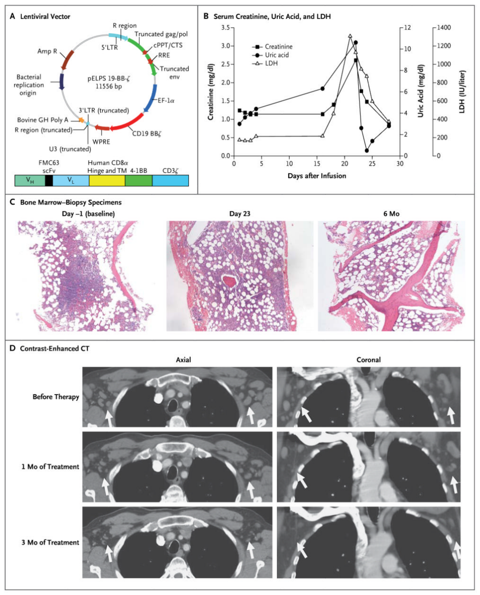
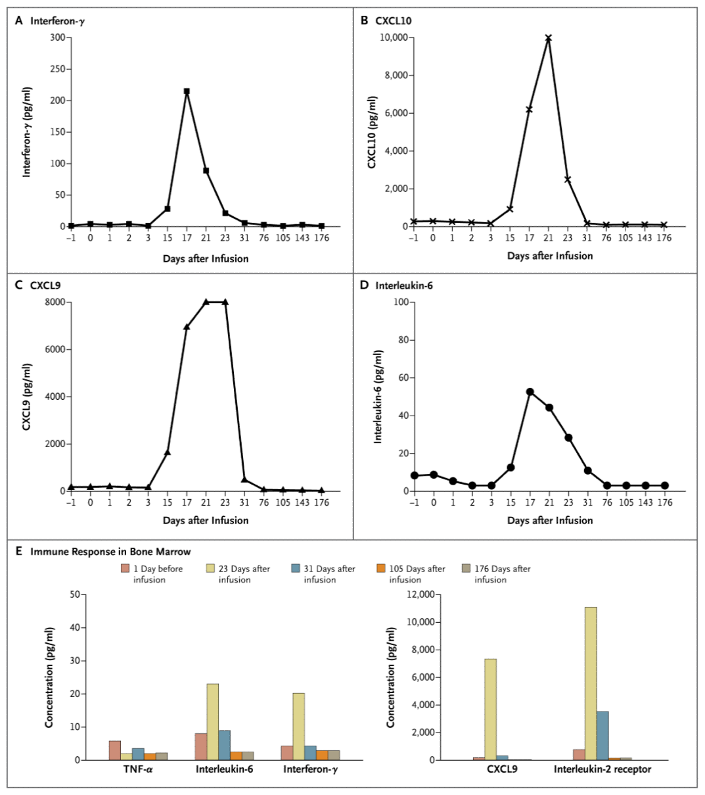
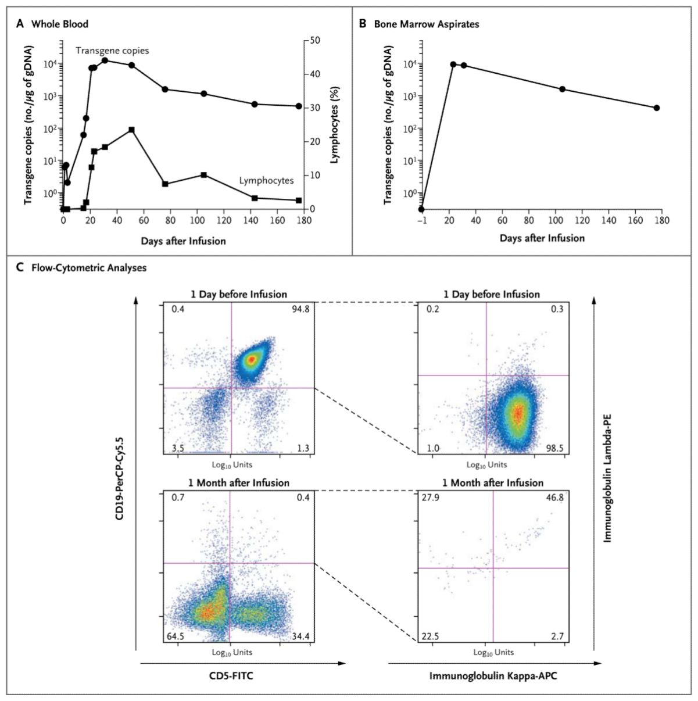

NIH Public Access  
Author Manuscript

*N Engl J Med.* Author manuscript; available in PMC 2012 June 29.

Published in final edited form as:  
*N Engl J Med.* 2011 August 25; 365(8): 725–733. doi:[10.1056/NEJMoa1103849](https://doi.org/10.1056/NEJMoa1103849).

# Chimeric Antigen Receptor–Modified T Cells in Chronic Lymphoid Leukemia

David L. Porter, M.D., Bruce L. Levine, Ph.D., Michael Kalos, Ph.D., Adam Bagg, M.D., and Carl H. June, M.D.

Abramson Cancer Center (D.L.P., B.L.L., M.K., A.B., C.H.J.), the Department of Medicine (D.L.P.), the Department of Pathology and Laboratory Medicine (B.L.L., M.K., A.B., C.H.J.), and the Abramson Family Cancer Research Institute (B.L.L., M.K., C.H.J.), Perelman School of Medicine, University of Pennsylvania, Philadelphia.

Address reprint requests to Dr. Porter at the Division of Hematology and Oncology, University of Pennsylvania Medical Center, 3400 Civic Center Blvd., PCAM 2 West Pavilion, Philadelphia, PA 19104, or at david.porter@uphs.upenn.edu..

Copyright © 2011 Massachusetts Medical Society.

## SUMMARY

We designed a lentiviral vector expressing a chimeric antigen receptor with specificity for the B-cell antigen CD19, coupled with CD137 (a costimulatory receptor in T cells [4-1BB]) and CD3-zeta (a signal-transduction component of the T-cell antigen receptor) signaling domains. A low dose (approximately 1.5×10⁵ cells per kilogram of body weight) of autologous chimeric antigen receptor–modified T cells reinfused into a patient with refractory chronic lymphocytic leukemia (CLL) expanded to a level that was more than 1000 times as high as the initial engraftment level in vivo, with delayed development of the tumor lysis syndrome and with complete remission. Apart from the tumor lysis syndrome, the only other grade 3/4 toxic effect related to chimeric antigen receptor T cells was lymphopenia. Engineered cells persisted at high levels for 6 months in the blood and bone marrow and continued to express the chimeric antigen receptor. A specific immune response was detected in the bone marrow, accompanied by loss of normal B cells and leukemia cells that express CD19. Remission was ongoing 10 months after treatment. Hypogammaglobulinemia was an expected chronic toxic effect.

With the use of gene-transfer techniques, T cells can be genetically modified to stably express antibodies on their surface, conferring new antigen specificity. Chimeric antigen receptors combine an antigen-recognition domain of a specific antibody with an intracellular domain of the CD3-zeta chain or FcγRI protein into a single chimeric protein.1,2 Although chimeric antigen receptors can trigger T-cell activation in a manner similar to that of endogenous T-cell receptors, a major impediment to the clinical application of this technique to date has been limited in vivo expansion of chimeric antigen receptor T cells and disappointing clinical activity.3,4 Chimeric antigen receptor–mediated T-cell responses can be further enhanced with the addition of a costimulatory domain. In preclinical models, we found that inclusion of the CD137 (4-1BB) signaling domain significantly increases antitumor activity and in vivo persistence of chimeric antigen receptors as compared with inclusion of the CD3-zeta chain alone.5,6

In most cancers, tumor-specific antigens for targeting are not well defined, but in B-cell neoplasms, CD19 is an attractive target. Expression of CD19 is restricted to normal and malignant B cells and B-cell precursors.7 We have initiated a pilot clinical trial of treatment with autologous T cells expressing an anti-CD19 chimeric antigen receptor (CART19); three patients have been treated. Here we report on the immunologic and clinical effects of in vivo T-cell treatment with chimeric antigen receptors in one of the patients, who had advanced, p53-deficient CLL.

## CASE REPORT

The patient received a diagnosis of stage I CLL in 1996. He first required treatment after 6 years of observation for progressive leukocytosis and adenopathy. In 2002, he was treated with two cycles of rituximab plus fludarabine; this treatment resulted in normalization of blood counts and partial resolution of adenopathy. In 2006, he received four cycles of rituximab and fludarabine for disease progression, again with normalization of blood counts and partial regression of adenopathy. This response was followed by a 20-month progression-free interval and a 2-year treatment-free interval. In February 2009, he had rapidly progressive leukocytosis and recurrent adenopathy. His bone marrow was extensively infiltrated with CLL. Cytogenetic analysis showed that 3 of 15 cells contained a deletion of chromosome 17p, and fluorescence in situ hybridization (FISH) testing showed that 170 of 200 cells had a deletion involving *TP53* on chromosome 17p. He received rituximab with bendamustine for one cycle and three additional cycles of bendamustine without rituximab (because of a severe allergic reaction). This treatment resulted in only transient improvement in lymphocytosis. Progressive adenopathy was documented by means of computed tomography (CT) after therapy.

In December 2009, autologous T cells were collected by means of leukapheresis and cryopreserved. The patient then received alemtuzumab (an anti-CD52, mature-lymphocyte, cell-surface antigen) for 11 weeks, with improved hematopoiesis and a partial resolution of adenopathy. Over the next 6 months, he had stable disease with persistent, extensive marrow involvement and diffuse adenopathy with multiple 1- to 3-cm lymph nodes. In July 2010, the patient was enrolled in a phase 1 clinical trial of chimeric antigen receptor–modified T cells.

## METHODS

### STUDY DESIGN

The trial (ClinicalTrials.gov number, NCT01029366) was designed to assess the safety and feasibility of infusing autologous CART19 T cells in patients with relapsed or refractory B-cell neoplasms. The trial was approved by the institutional review board at the University of Pennsylvania. The study was conducted in accordance with the protocol (available with the full text of this article at NEJM.org). No commercial sponsor was involved in the study.

### STUDY PROCEDURES

We designed a self-inactivating lentiviral vector (GeMCRIS 0607-793), which was subjected to preclinical safety testing, as reported previously.5 Methods of T-cell preparation have also been described previously.8 Quantitative polymerase-chain-reaction (PCR) analysis was performed to detect chimeric antigen receptor T cells in blood and bone marrow. The lower limit of quantification was determined from the standard curve; average values below the lower limit of quantification (i.e., reportable but not quantifiable) are considered approximate. The lower limit of quantification of the assay was 25 copies per microgram of genomic DNA.

Soluble-factor analysis was performed with the use of serum from whole blood and bone marrow that was separated into aliquots for single use and stored at −80°C. Quantification of soluble cytokine factors was performed with the use of Luminex bead-array technology and reagents from Life Technologies.

## RESULTS

### CELL INFUSIONS

Figure 1. Clinical Response in the Patient

Panel A shows the lentiviral vector used to infect T cells from the patient. A pseudotyped, clinical-grade lentiviral vector of vesicular stomatitis virus protein G (pELPs 19-BB-z) directing expression of anti-CD19 scFv derived from FMC63 murine monoclonal antibody, human CD8α hinge and transmembrane domain, and human 4-1BB and CD3ζ signaling domains was produced. Details of the CAR19 transgene, at the bottom of the panel, show the major functional elements. The figure is not to scale. 3′LTR denotes 3′ long terminal repeat; 5′LTR, 5′ long terminal repeat; Amp R, ampicillin resistance gene; Bovine GH Poly A, bovine growth hormone with polyadenylation tail; cPPT/CTS, central polypurine tract with central termination sequence; EF-1α, elongation factor 1-alpha; env, envelope; gag, group-specific antigen; pol, HIV gene encoding polymerase and reverse transcriptase; R, repeat; RRE, rev response element; scFv, single-chain variable fragment; TM, transmembrane; and WPRE, woodchuck hepatitis virus post-transcriptional regulatory element. Panel B shows serum creatinine, uric acid, and lactate dehydrogenase (LDH) levels from day 1 to day 28 after the first CART19-cell infusion. The peak levels coincided with hospitalization for the tumor lysis syndrome. Panel C shows bone marrow–biopsy specimens obtained 3 days after chemotherapy (day −1, before CART19-cell infusion) and 23 days and 6 months after CART19-cell infusion (hematoxylin and eosin). The baseline specimen shows hypercellular bone marrow (60%) with trilineage hematopoiesis, infiltrated by predominantly interstitial aggregates of small, mature lymphocytes that account for 40% of total cellularity. The specimen obtained on day 23 shows residual lymphoid aggregates (10%) that were negative for chronic lymphoid leukemia (CLL), with a mixture of T cells and CD5-negative B cells. The specimen obtained 6 months after infusion shows trilineage hematopoiesis, without lymphoid aggregates and continued absence of CLL. Panel D shows contrast-enhanced CT scans obtained before the patient was enrolled in the study and 31 days and 104 days after the first infusion. The preinfusion CT scan reveals 1-to-3-cm bilateral masses. Regression of axillary lymphadenopathy occurred within 1 month after infusion and was sustained. Arrows highlight various enlarged lymph nodes before therapy and lymphnode responses on comparable CT scans after therapy.

Autologous T cells from the patient were thawed and transduced with lentivirus to express the CD19-specific chimeric antigen receptor (Fig. 1A). Four days before cell infusion, the patient received chemotherapy designed for depletion of lymphocytes (pentostatin at a dose of 4 mg per square meter of body-surface area and cyclophosphamide at a dose of 600 mg per square meter) without rituximab.9 Three days after chemotherapy but before cell infusion, the bone marrow was hypercellular with approximately 40% involvement by CLL. Leukemia cells expressed kappa light chain and CD5, CD19, CD20, and CD23. Cytogenetic analysis showed two separate clones, both resulting in loss of chromosome 17p and the *TP53* locus (46,XY,del(17)(p12)[5]/46,XY,der(17)t(17;21)(q10;q10)[5]/46,XY[14]). Four days after chemotherapy, the patient received a total of 3×10⁸ T cells, of which 5% were transduced, for a total of 1.42×10⁷ transduced cells (1.46×10⁵ cells per kilogram) split into three consecutive daily intravenous infusions (10% on day 1, 30% on day 2, and 60% on day 3). No postinfusion cytokines were administered. No toxic effects of infusions were noted.

### CLINICAL RESPONSE AND EVALUATIONS

Fourteen days after the first infusion, the patient began having chills and low-grade fevers associated with grade 2 fatigue. Over the next 5 days, the chills intensified, and his temperature escalated to 39.2°C (102.5°F), associated with rigors, diaphoresis, anorexia, nausea, and diarrhea. He had no respiratory or cardiac symptoms. Because of the fevers, chest radiography and blood, urine, and stool cultures were performed, and were all negative or normal. The tumor lysis syndrome was diagnosed on day 22 after infusion (Fig. 1B). The uric acid level was 10.6 mg per deciliter (630.5 μmol per liter), the phosphorus level was 4.7 mg per deciliter (1.5 mmol per liter) (normal range, 2.4 to 4.7 mg per deciliter [0.8 to 1.5 mmol per liter]), and the lactate dehydrogenase level was 1130 U per liter (normal range, 98 to 192). There was evidence of acute kidney injury, with a creatinine level of 2.60 mg per deciliter (229.8 μmol per liter) (baseline level, <1.0 mg per deciliter [<88.4 μmol per liter]). The patient was hospitalized and treated with fluid resuscitation and rasburicase. The uric acid level returned to the normal range within 24 hours, and the creatinine level within 3 days; he was discharged on hospital day 4. The lactate dehydrogenase level decreased gradually, becoming normal over the following month.

By day 28 after CART19-cell infusion, adenopathy was no longer palpable, and on day 23, there was no evidence of CLL in the bone marrow (Fig. 1C). The karyotype was now normal in 15 of 15 cells (46,XY), and FISH testing was negative for deletion *TP53* in 198 of 200 cells examined; this is considered to be within normal limits in negative controls. Flow-cytometric analysis showed no residual CLL, and B cells were not detectable (<1% of cells within the CD5 + CD10 − CD19 + CD23 + lymphocyte gate). CT scanning performed on day 31 after infusion showed resolution of adenopathy (Fig. 1D).

Three and 6 months after CART19-cell infusion, the physical examination remained unremarkable, with no palpable adenopathy, and CT scanning performed 3 months after CART19-cell infusion showed sustained remission (Fig. 1D). Bone marrow studies at 3 and 6 months also showed no evidence of CLL by means of morphologic analysis, karyotype analysis (46,XY), or flow-cytometric analysis, with a continued lack of normal B cells as well. Remission had been sustained for 10 months as of this writing.

### TOXICITY OF CART19 CELLS

The cell infusions had no acute toxic effects. The only serious (grade 3 or 4) adverse event noted was the grade 3 tumor lysis syndrome described above. The patient had grade 1 lymphopenia at baseline and grade 2 or 3 lymphopenia beginning on day 1 and continuing through the most recent follow-up visit, 10 months after therapy. Grade 4 lymphopenia, with an absolute lymphocyte count of 140 cells per cubic millimeter, was recorded on day 19, but from day 22 through the most recent followup visit, the absolute lymphocyte count ranged between 390 and 780 cells per cubic millimeter (grade 2 or 3 lymphopenia). The patient had transient grade 1 thrombocytopenia (platelet count, 98,000 to 131,000 per cubic millimeter) from day 19 through day 26 and grade 1 or 2 neutropenia (absolute neutrophil count, 1090 to 1630 per cubic millimeter) from day 17 through day 33. Other signs and symptoms that were probably related to the study treatment included grade 1 and 2 elevations in aminotransferase and alkaline phosphatase levels, which developed 17 days after the first infusion and resolved by day 33. Grade 1 and 2 constitutional symptoms consisted of fevers, chills, diaphoresis, myalgias, headache, and fatigue. Grade 2 hypogammaglobulinemia was corrected with infusions of intravenous immune globulin.

### ANALYSIS OF SERUM AND BONE MARROW CYTOKINES

Figure 2. Serum and Bone Marrow Cytokines before and after Chimeric Antigen Receptor T-Cell Infusion

Serial measurements of the cytokine interferon-γ (Panel A), the interferon-γ–stimulated chemokines C-X-C motif chemokine 10 (CXCL10) (Panel B) and C-X-C motif ligand 9 (CXCL9) (Panel C), and interleukin-6 (Panel D) were measured at the indicated time points. The increases in these inflammatory cytokines and chemokines coincided with the onset of the tumor lysis syndrome. Low levels of interleukin-6 were detected at baseline, whereas interferon-γ, CXCL9, and CXCL10 were below the limits of detection at baseline. Standard-curve ranges for the analytes and baseline values in the patient, given in parentheses, were as follows: interferon-γ, 11.2 to 23,972 pg per milliliter (1.4 pg per milliliter); CXCL10, 2.1 to 5319 pg per milliliter (274 pg per milliliter); CXCL9, 48.2 to 3700 pg per milliliter (177 pg per milliliter); interleukin-6, 2.7 to 4572 pg per milliliter (8.3 pg per milliliter); tumor necrosis factor α (TNF-α), 1.9 to 4005 pg per milliliter (not detectable); and soluble interleukin-2 receptor, 13.4 to 34,210 pg per milliliter (644 pg per milliliter). Panel E shows the induction of the immune response in bone marrow. The cytokines TNF-α, interleukin-6, interferon-γ, chemokine CXCL9, and soluble interleukin-2 receptor were measured in supernatant fluids obtained from bone marrow aspirates on the indicated days before and after CART19-cell infusion. The increases in levels of interleukin-6, interferon-γ, CXCL9, and soluble interleukin-2 receptor coincided with the tumor lysis syndrome, peak chimeric antigen receptor T-cell infiltration, and eradication of the leukemic infiltrate.

The patient’s clinical response was accompanied by a delayed increase in levels of inflammatory cytokines (Fig. 2A through 2D), with levels of interferon-γ, the interferon-γ–responsive chemokines CXCL9 and CXCL10, and interleukin-6 that were 160 times as high as baseline levels. The temporal rise in cytokine levels paralleled the clinical symptoms, peaking 17 to 23 days after the first CART19-cell infusion.

The supernatants from serial bone marrow aspirates were measured for cytokines and showed evidence of immune activation (Fig. 2E). Significant increases in interferon-γ, CXCL9, interleukin-6, and soluble interleukin-2 receptor were noted, as compared with the baseline levels on the day before T-cell infusion; the values peaked on day 23 after the first CART19-cell infusion. The increase in bone marrow cytokines coincided with the elimination of leukemia cells from the marrow. Serum and marrow tumor necrosis factor α remained unchanged.

### EXPANSION AND PERSISTENCE OF CHIMERIC ANTIGEN RECEPTOR T CELLS

Figure 3. Expansion and Persistence of Chimeric Antigen Receptor T Cells In Vivo

Genomic DNA (gDNA) was isolated from samples of the patient’s whole blood (Panel A) and bone marrow aspirates (Panel B) collected at serial time points before and after chimeric antigen receptor T-cell infusion and used for quantitative real-time polymerase-chain-reaction (PCR) analysis. As assessed on the basis of transgenic DNA and the percentage of lymphocytes expressing CAR19, the chimeric antigen receptor T cells expanded to levels that were more than 1000 times as high as initial engraftment levels in the peripheral blood and bone marrow. Peak levels of chimeric antigen receptor T cells were temporally correlated with the tumor lysis syndrome. A blood sample obtained on day 0 and a bone marrow sample obtained on day −1 had no PCR signal at baseline. Flow-cytometric analysis of bone marrow aspirates at baseline (Panel C) shows predominant infiltration with CD19+CD5+ cells that were clonal, as assessed by means of immunoglobulin kappa light-chain staining, with a paucity of T cells. On day 31 after infusion, CD5+ T cells were present, and no normal or malignant B cells were detected. The numbers indicate the relative frequency of cells in each quadrant. Both the x axis and the y axis show a log₁₀ scale. The gating strategy involved an initial gating on CD19+ and CD5+ cells in the boxes on the left, and the subsequent identification of immunoglobulin kappa and lambda expression on the CD19+CD5+ subset (boxes on the right).

Real-time PCR detected DNA encoding anti-CD19 chimeric antigen receptor (CAR19) beginning on day 1 after the first infusion (Fig. 3A). More than a 3-log expansion of the cells in vivo was noted by day 21 after infusion. At peak levels, CART19 cells in blood accounted for more than 20% of circulating lymphocytes; these peak levels coincided with the occurrence of constitutional symptoms, the tumor lysis syndrome (Fig. 1B), and elevations in serum cytokine levels (Fig. 2A through 2D). CART19 cells remained detectable at high levels 6 months after the infusions, though the values decreased by a factor of 10 from peak levels. The doubling time of chimeric antigen receptor T cells in blood was approximately 1.2 days, with an elimination half-life of 31 days.

### CHIMERIC ANTIGEN RECEPTOR T CELLS IN BONE MARROW

CART19 cells were identified in bone marrow specimens beginning 23 days after the first infusion (Fig. 3B) and persisted for at least 6 months, with a decay half-life of 34 days. The highest levels of CART19 cells in the bone marrow were identified at the first assessment 23 days after the first infusion and coincided with induction of an immune response, as indicated by cytokine-secretion profiles (Fig. 2E). Flow-cytometric analysis of bone marrow aspirates indicated a clonal expansion of CD5+CD19+ cells at baseline that was absent 1 month after infusion and in a sample obtained 3 months after infusion (data not shown). Normal B cells were not detected after treatment (Fig. 3C).

## DISCUSSION

We report the delayed development of the tumor lysis syndrome and a complete response 3 weeks after treatment with autologous T cells genetically modified to target CD19 through transduction with a lentivirus vector expressing anti-CD19 linked to CD3-zeta and CD137 (4-1BB) signaling domains. Genetically modified cells were present at high levels in bone marrow for at least 6 months after infusion. The generation of a CD19-specific immune response in bone marrow was demonstrated by temporal release of cytokines and ablation of leukemia cells that coincided with peak infiltration of chimeric antigen receptor T cells. Development of the tumor lysis syndrome after cellular immunotherapy has not been reported previously.10 The finding that chimeric antigen receptor T cells are capable of extensive proliferation and cytotoxicity in vivo indicates the need for caution in the design of clinical trials when chimeric antigen receptors with new specificities are tested.11

Genetic manipulation of autologous T cells to target specific tumor antigens is an attractive strategy for cancer therapy.3,4 An important feature of this approach is that chimeric antigen receptor T cells can recognize tumor targets in an HLA-unrestricted manner, so that “off-the-shelf” chimeric antigen receptors can be constructed for tumors with a wide variety of histologic features. We used HIV-derived lentiviral vectors for cancer therapy, an approach that may have some advantages over the use of retroviral vectors.12

In previous trials of chimeric antigen receptor T cells, objective tumor responses have been modest, and in vivo proliferation of modified cells has not been sustained.13-15 We developed a second-generation chimeric antigen receptor designed to address this limitation by incorporation of the CD137 (4-1BB) signaling domain, on the basis of our preclinical observation that this molecule promoted the persistence of antigen-specific and antigen-nonspecific chimeric antigen receptor T-cells.5,6 Brentjens and colleagues reported preliminary results of a clinical trial of CD19-targeted chimeric antigen receptors linked to a CD28 signaling domain and found transient tumor responses in two of three patients with advanced CLL16; however, the chimeric antigen receptors rapidly disappeared from the circulation.

It was unexpected that the very low dose of chimeric antigen receptor T cells that we infused would result in a clinically evident antitumor response. Indeed, the infused dose of 1.5×10⁵ chimeric antigen receptor T cells per kilogram was several orders of magnitude below doses used in previous studies of T cells modified to express chimeric antigen receptors or transgenic T-cell receptors.13,16-18 We speculate that the chemotherapy may potentiate the effects of chimeric antigen receptor T cells in several ways, including increasing engraftment and migration to tumor cells,19 as well as potentiating the ability of chimeric antigen receptor T cells to kill stressed tumor cells that would otherwise survive the chemotherapy.20,21 Whether the inclusion of exogenous cytokines would further increase the activity of chimeric antigen receptor T cells is not known.

The prolonged persistence of CART19 cells in the blood and bone marrow of our patient may result from inclusion of the 4-1BB signaling domain. It is likely that the CART19-cell–mediated elimination of normal B cells facilitated the induction of immunologic tolerance to the chimeric antigen receptor, since the CART19 cells that express the single-chain Fv antibody fragment containing murine sequences were not rejected. Given the absence of detectable CD19-positive leukemia cells in this patient, it is possible that homeostasis of the chimeric antigen receptor T cells was achieved at least in part from stimulation delivered by early B-cell progenitors as they began to emerge in the bone marrow. We speculate that this would be a new mechanism to maintain “memory” chimeric antigen receptor T cells.

Although CD19 is an attractive tumor target, with expression limited to normal and malignant B cells, there is concern that persistence of the chimeric antigen receptor T cells will mediate long-term B-cell deficiency. In fact, in our patient, B cells were absent from the blood and bone marrow for at least 6 months after infusion. This patient did not have recurrent infections. Targeting B cells through CD20 with rituximab is an effective and relatively safe strategy for patients with B-cell neoplasms, and long-term B-cell lymphopenia is manageable.22 Patients treated with rituximab have been reported to have a return of B cells within months after discontinuation of therapy. It is not yet clear whether such recovery will occur in patients whose anti–B-cell T cells persist in vivo.

Patients who have CLL with *TP53* deletions have short remissions after standard therapies.23 Allogeneic bone marrow transplantation has been the only approach that has induced long-term remissions in patients with advanced CLL.24 However, the resulting potent graft-versus-tumor effect is associated with considerable morbidity because of the high frequency of chronic graft-versus-host disease, which is often especially severe in older patients — those who are typically affected by CLL.24,25 Our study suggests that genetically modified autologous T cells may circumvent this limitation.

The delayed onset of the tumor lysis syndrome and cytokine secretion, combined with vigorous in vivo chimeric antigen receptor T-cell expansion and prominent antileukemia activity, points to substantial and sustained effector functions of the CART19 cells. Our early research highlights the potency of this therapy and provides support for the detailed study of autologous T cells genetically modified to target CD19 (and other targets) through transduction of a chimeric antigen receptor linked to potent signaling domains. Unlike antibody-mediated therapy, chimeric antigen receptor–modified T cells have the potential to replicate in vivo, and long-term persistence could lead to sustained tumor control. Two other patients with advanced CLL have also received CART19 infusions according to this protocol, and all three have had tumor responses.26 These findings warrant continued study of CD19-redirected T cells for B-cell neoplasms.

## Acknowledgments

Supported in part by grants from the National Institutes of Health (K24 CA11787901, 1PN2-EY016586, and R01CA120409), the Alliance for Cancer Gene Therapy, and the Leukemia and Lymphoma Society (7000-02).

Disclosure forms provided by the authors are available with the full text of this article at NEJM.org.

We thank Irina Kulikovskaya for the quantitative polymerase-chain-reaction (Q-PCR) assay; Erica Suppa and Casey Krebs for the Luminex assay; Jennifer Wright for Q-PCR assay development; John Scholler for assay development; Tatiana Mikheeva for sample processing; Qun-Bin Xiong for flow-cytometric analysis; Zhaohui Zheng, Julio Cotte, Andrea Brennan, and members of the Clinical Cell and Vaccine Production facility for developing methods for clinical-scale ex vivo lentiviral transduction and for cell manufacturing; the Human Immunology Core for reagents; Boro Dropulic (Lentigen) for clinical-grade vector production; Elizabeth Veloso, Lester Lledo, Joan Gilmore, Gwendolyn Binder, and Anne Chew for assistance in clinical research support; Sharyn Katz for assistance with imaging; and Stephan Schuster, Elizabeth Hexner, Stephan Grupp, Carmine Carpenito, Michael Milone, and Donald Siegel for advice.

## REFERENCES

1. Gross G, Waks T, Eshhar Z. Expression of immunoglobulin-T-cell receptor chimeric molecules as functional receptors with antibody-type specificity. Proc Natl Acad Sci U S A. 1989; 86:10024–8. [PubMed: 2513569]

2. Irving BA, Weiss A. The cytoplasmic domain of the T cell receptor zeta chain is sufficient to couple to receptor-associated signal transduction pathways. Cell. 1991; 64:891–901. [PubMed: 1705867]

3. Sadelain M, Brentjens R, Rivière I. The promise and potential pitfalls of chimeric antigen receptors. Curr Opin Immunol. 2009; 21:215–23. [PubMed: 19327974]

4. Jena B, Dotti G, Cooper LJ. Redirecting T-cell specificity by introducing a tumor-specific chimeric antigen receptor. Blood. 2010; 116:1035–44. [PubMed: 20439624]

5. Milone MC, Fish JD, Carpenito C, et al. Chimeric receptors containing CD137 signal transduction domains mediate enhanced survival of T cells and increased antileukemic efficacy in vivo. Mol Ther. 2009; 17:1453–64. [PubMed: 19384291]

6. Carpenito C, Milone MC, Hassan R, et al. Control of large, established tumor xe-nografts with genetically retargeted human T cells containing CD28 and CD137 domains. Proc Natl Acad Sci U S A. 2009; 106:3360–5. [PubMed: 19211796]

7. Uckun FM, Jaszcz W, Ambrus JL, et al. Detailed studies on expression and function of CD19 surface determinant by using B43 monoclonal antibody and the clinical potential of anti-CD19 immunotoxins. Blood. 1988; 71:13–29. [PubMed: 3257143]

8. Porter DL, Levine BL, Bunin N, et al. A phase 1 trial of donor lymphocyte infusions expanded and activated ex vivo via CD3/CD28 costimulation. Blood. 2006; 107:1325–31. [PubMed: 16269610]

9. Lamanna N, Kalaycio M, Maslak P, et al. Pentostatin, cyclophosphamide, and rituximab is an active, well-tolerated regimen for patients with previously treated chronic lymphocytic leukemia. J Clin Oncol. 2006; 24:1575–81. [PubMed: 16520464]

10. Baeksgaard L, Sørensen J. Acute tumor lysis syndrome in solid tumors — a case report and review of the literature. Cancer Chemother Pharmacol. 2003; 51:187–92. [PubMed: 12655435]

11. Kohn DB, Dotti G, Brentjens R, et al. CARS on track in the clinic. Mol Ther. 2011; 19:432–8. [PubMed: 21358705]

12. June CH, Blazar BR, Riley JL. Engineering lymphocyte subsets: tools, trials and tribulations. Nat Rev Immunol. 2009; 9:704–16. [PubMed: 19859065]

13. Kershaw MH, Westwood JA, Parker LL, et al. A phase I study on adoptive immunotherapy using gene-modified T cells for ovarian cancer. Clin Cancer Res. 2006; 12:6106–15. [PubMed: 17062687]

14. Till BG, Jensen MC, Wang J, et al. Adoptive immunotherapy for indolent non-Hodgkin lymphoma and mantle cell lymphoma using genetically modified autologous CD20-specific T cells. Blood. 2008; 112:2261–71. [PubMed: 18509084]

15. Pule MA, Savoldo B, Myers GD, et al. Virus-specific T cells engineered to coexpress tumor-specific receptors: persistence and antitumor activity in individuals with neuroblastoma. Nat Med. 2008; 14:1264–70. [PubMed: 18978797]

16. Brentjens R, Yeh R, Bernal Y, Riviere I, Sadelain M. Treatment of chronic lymphocytic leukemia with genetically targeted autologous T cells: case report of an unforeseen adverse event in a phase I clinical trial. Mol Ther. 2010; 18:666–8. [PubMed: 20357779]

17. Morgan RA, Yang JC, Kitano M, Dudley ME, Laurencot C, Rosenberg SA. Case report of a serious adverse event following the administration of T cells transduced with a chimeric antigen receptor recognizing ERBB2. Mol Ther. 2010; 18:843–51. [PubMed: 20179677]

18. Johnson LA, Morgan RA, Dudley ME, et al. Gene therapy with human and mouse T-cell receptors mediates cancer regression and targets normal tissues expressing cognate antigen. Blood. 2009; 114:535–46. [PubMed: 19451549]

19. Klebanoff CA, Khong HT, Antony PA, Palmer DC, Restifo NP. Sinks, suppressors and antigen presenters: how lymphodepletion enhances T cell-mediated tumor immunotherapy. Trends Immunol. 2005; 26:111–7. [PubMed: 15668127] Trends Immunol. 2005; 26:298. Erratum.

20. Zitvogel L, Apetoh L, Ghiringhelli F, Kroemer G. Immunological aspects of cancer chemotherapy. Nat Rev Immunol. 2008; 8:59–73. [PubMed: 18097448]

21. Ramakrishnan R, Assudani D, Nagaraj S, et al. Chemotherapy enhances tumor cell susceptibility to CTL-mediated killing during cancer immunotherapy in mice. J Clin Invest. 2010; 120:1111–24. [PubMed: 20234093]

22. Molina A. A decade of rituximab: improving survival outcomes in non-Hodgkin’s lymphoma. Annu Rev Med. 2008; 59:237–50. [PubMed: 18186705]

23. Döhner H, Fischer K, Bentz M, et al. p53 gene deletion predicts for poor survival and non-response to therapy with purine analogs in chronic B-cell leukemias. Blood. 1995; 85:1580–9. [PubMed: 7888675]

24. Gribben JG, Hosing C, Maloney DG. Stem cell transplantation for indolent lymphoma and chronic lymphocytic leukemia. Biol Blood Marrow Transplant. 2011; 17(Suppl):S63–S70. [PubMed: 21195313]

25. Sorror ML, Storer BE, Maloney DG, Sandmaier BM, Martin PJ, Storb R. Out-comes after allogeneic hematopoietic cell transplantation with nonmyeloablative or myeloablative conditioning regimens for treatment of lymphoma and chronic lymphocytic leukemia. Blood. 2008; 111:446–52. [PubMed: 17916744]

26. Kalos M, Levine BL, Porter DL, et al. T cells with chimeric antigen receptors have potent antitumor effects and can establish memory in patients with advanced leukemia. Sci Transl Med. 2011; 3:95ra73.
