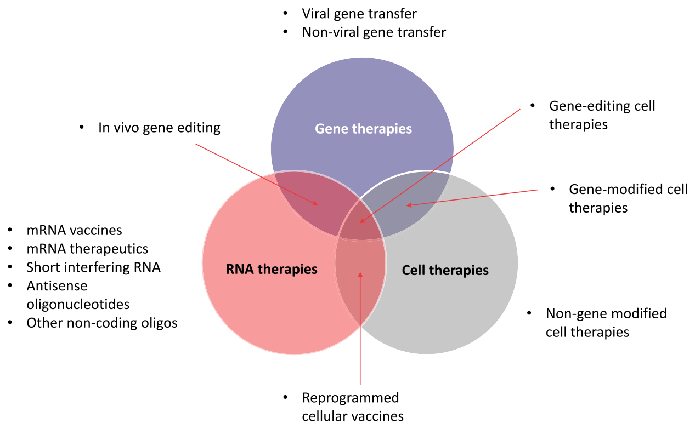
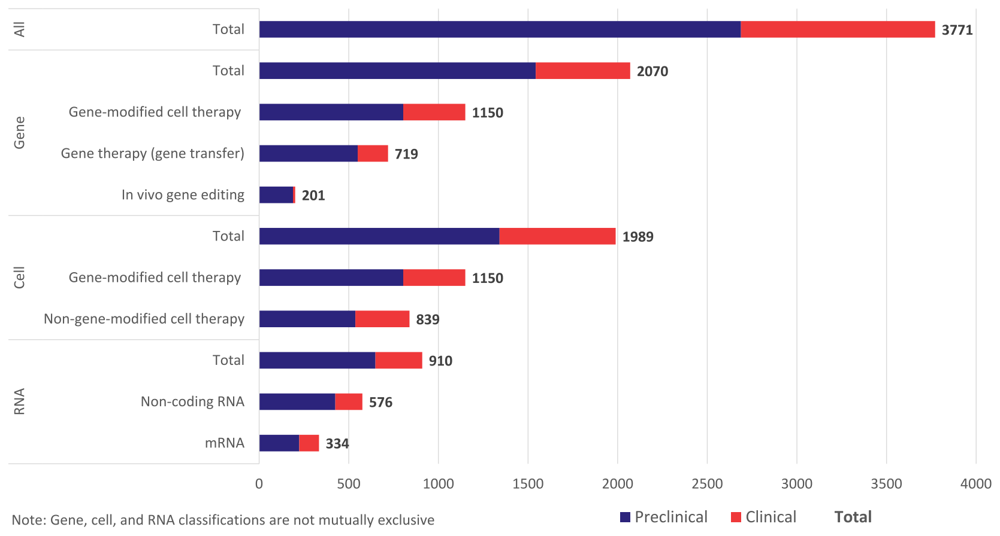
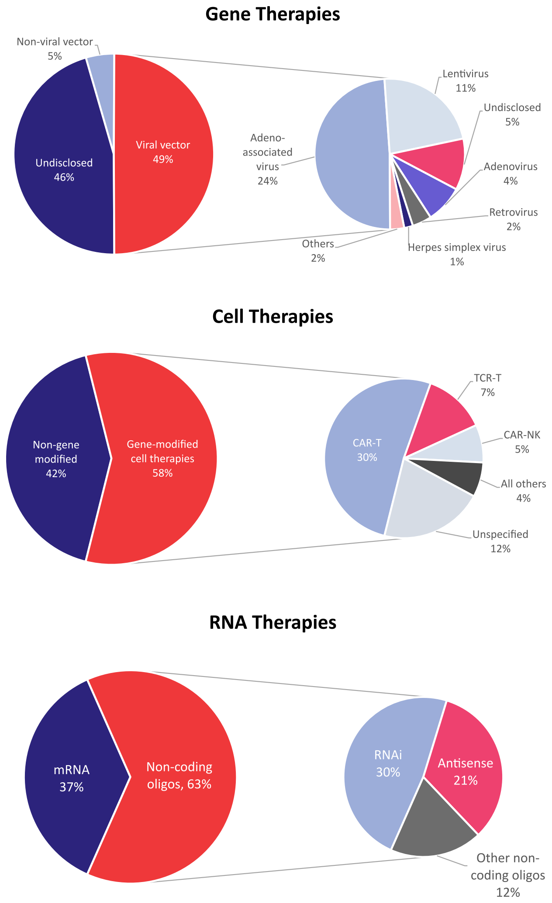
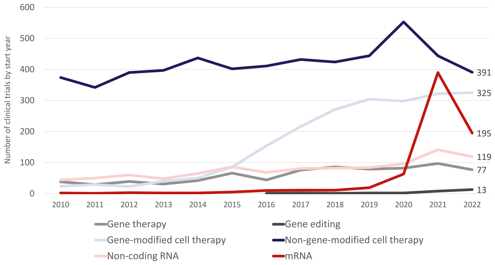
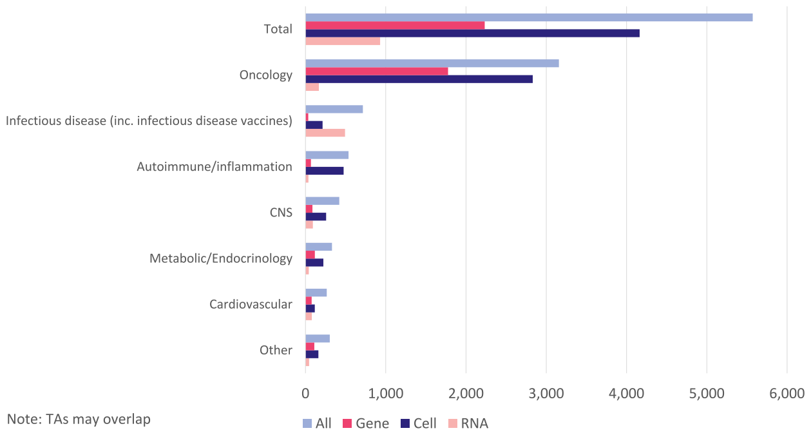
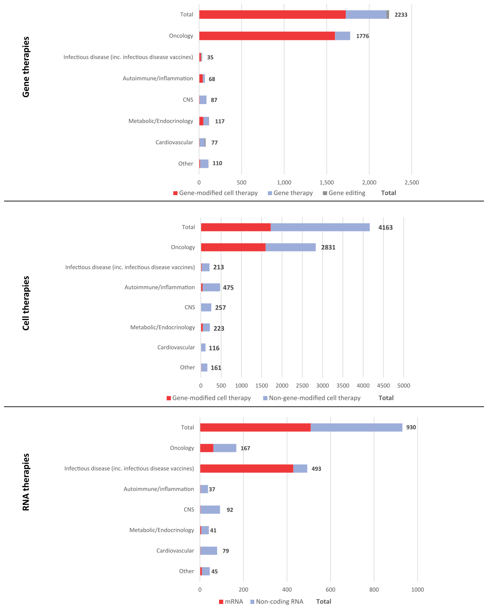

Molecular Therapy  ·  Review

# The state of cell and gene therapy in 2023

Daniel Chancellor,2 David Barrett,1 Ly Nguyen-Jatkoe,2 Shardha Millington,2 and Fenwick Eckhardt2

1American Society of Gene & Cell Therapy, Waukesha, WI, USA; 2Citeline, London, UK

Correspondence: David Barrett, American Society of Gene & Cell Therapy, Waukesha, WI, USA. E-mail: dbarrett@asgct.org

https://doi.org/10.1016/j.ymthe.2023.11.001  ·  Molecular Therapy Vol. 31 No 12 December 2023

Progress in the understanding of human diseases has coincided with the advent of precision medicine, whereby the underlying genetic and molecular contributors can be used as diagnostic and therapeutic biomarkers. To address these, drug developers have designed a range of different treatment strategies, including gene therapy, which the American Society of Gene and Cell Therapy defines as the use of genetic material to treat or prevent disease. A number of approaches exist, including the delivery of genetic material in vivo or ex vivo, as well as the use of RNA species to alter gene expression in particular disease states. Through the end of the first quarter of 2023, there were more than 100 different approved gene, cell, and RNA therapies throughout the world, with over 3,700 more in clinical and preclinical development. This review comprehensively captures the landscape for such advanced therapies, including the different genetic technologies used and diseases targeted in clinical trials.

## INTRODUCTION

Figure 1. Current universe of advanced therapies, including areas of overlap.

Gene, cell, and RNA therapies, collectively called cell and gene therapies (CGTs) in this review, represent the cutting edge of drug discovery (Figure 1). Owing to their precise nature, targeted against the genetic and molecular drivers of disease, these therapeutic approaches are the embodiment of precision medicine. CGTs may provide patients with a given disease, in which the causation is well known and characterized, a therapy specifically designed to correct the root genetic cause. Identifying a need to accurately report on the state of clinical and preclinical development of these therapies, the American Society of Gene and Cell Therapy (ASGCT) initiated a partnership with Citeline in 2021. The purpose of the partnership is for Citeline and ASGCT to jointly acquire, develop, and maintain relevant industry corporate, financial, and clinical data that can be used to report regularly on the performance of the gene, cell, RNA, and regenerative medicine sectors.

CGTs may provide patients with certain diseases, in which the root genetic causation is well known and characterized, a therapy specifically designed to correct such causes, by delivering genetic material that modifies the expression of the target gene. Recent advances for the treatment of spinal muscular atrophy (SMA), an autosomal recessive disease, have yielded two examples of new advanced genetic therapies. Nusinersen (Spinraza; Biogen) is an antisense oligonucleotide (ASO), a single-stranded nucleic acid matched to a specific sequence in intron 7 of SMN2 pre-mRNA. This mechanism causes splicing correction and production of full-length functional SMN protein, with accompanying clinical benefit for SMA patients of all ages.1 Pediatric patients younger than 2 years now also have the gene therapy onasemnogene abeparvovec (Zolgensma; Novartis) as a one-time, potentially curative treatment option. Onasemnogene abeparvovec is an adeno-associated virus (AAV) vector-based gene therapy that delivers a functional copy of the SMN1 gene encoding SMN protein to motor neuron cells.2 This restores SMN levels and reverses skeletal muscle atrophy, with clinical benefits demonstrated for up to 7.5 years thus far.3

Cell therapies, the so-called living drugs, can harness similar genetic engineering techniques to enhance or modify their natural capabilities. Currently, such reprogramming is commonly applied to white blood cells or hematopoietic stem cells, creating powerful therapeutic strategies in oncology and immunology settings. The most prevalent example of genetically engineered cell therapies is chimeric antigen receptor T cells (CAR-Ts). In the classic design of first-generation autologous CAR-T therapies such as tisagenlecleucel (Kymriah; Novartis) and axicabtagene ciloleucel (Yescarta; Gilead), a patient’s own T cells are harvested and engineered to express CAR constructs that target CD19.4 These are powerful agents that have produced high response rates in clinical trials of patients with advanced B cell malignancies.5 As the technology evolves, alternative CAR constructs are being explored alongside allogeneic, or “off the shelf,” T cells with multiple genetic changes, and expressing CARs on other types of immune cells such as natural killer (NK) cells and macrophages. The full potential of cell therapies is being extrapolated broadly to the field of regenerative medicine, aided by the ability to precisely control gene expression. Pharmaceutical and biotechnology companies have active cell therapy programs in diseases as diverse as diabetes, heart failure, and multiple sclerosis.

As the intermediate species between genes and proteins in the central dogma of biology, RNA has an incredibly versatile potential. This includes gene silencing and activation via complementary base pairing to pre-mRNA in the form of ASOs and short interfering RNA (siRNA). More recently, mRNA has been used to produce the antigenic severe acute respiratory syndrome-coronavirus-2 (SARS-CoV-2) Spike protein in the hundreds of millions of individuals who have received coronavirus disease 2019 (COVID-19) vaccines designed by Moderna and BioNTech. The same concept can be applied for the in vivo production of therapeutic proteins and monoclonal antibodies, although this approach is more experimental. RNA can also enable the creation of gene and cell therapies when it is used as a precursor for the proteins and enzymes required for genetic engineering mechanisms. The areas of overlap between gene, cell, and RNA therapies offer the potential for incredibly powerful and targeted drugs.

Gene editing is one such example that came to the fore in 2021 following the proof-of-concept data for NTLA-2001 in transthyretin (TTR) amyloidosis.6 NTLA-2001 is a CRISPR-based drug designed to halt the expression of misfolded TTR, which causes neuropathy and cardiomyopathy in affected patients. NTLA-2001 comprises oligonucleotides encapsulated within lipid nanoparticles (LNPs), taking the form of a guide RNA (gRNA) sequence that directs the gene editing machinery to the correct location, as well as mRNA, which encodes Cas9 protein for DNA cutting. In interim data from a Phase I trial, patients receiving NTLA-2001 achieved a 92% reduction in serum TTR protein at the highest dose at day 28, showing the powerful potential of in vivo gene editing.7 The potential also exists for ex vivo editing of cell therapies using RNA scaffolds, thereby combining all three novel drug modalities in a single treatment.

## APPROVED THERAPIES WORLDWIDE

Table 1. All approved gene, cell, and RNA therapies as of June 2023

| Gene therapies (including genetically modified cell therapies) |  |  |  |  |  |  |
| --- | --- | --- | --- | --- | --- | --- |
| Product name | Generic name | Originator company | Modality | Disease(s) | Year first approved | Locations approved |
| Vyjuvek | beremagene geperpavec | Krystal Biotech | HSV-1 gene therapy | Epidermolysis bullosa | 2023 | US |
| Adstiladrin | nadofaragene firadenovec | Merck | Adenoviral gene therapy | Bladder cancer | 2022 | US |
| Hemgenix | etranacogene dezaparvovec | uniQure | AAV5 gene therapy | Hemophilia B | 2022 | US, EU, UK |
| Roctavian | valoctocogene roxaparvovec | BioMarin | AAV5 gene therapy | Hemophilia A | 2022 | EU, UK |
| Upstaza | eladocagene exuparvovec | PTC Therapeutics | AAV2 gene therapy | Aromatic L-amino acid decarboxylase (AADC) deficiency | 2022 | EU, UK |
| Carvykti | ciltacabtagene autoleucel | Legend Biotech | CAR-T | Myeloma | 2022 | US, EU, UK, Japan |
| Skysona | elivaldogene autotemcel | Bluebird Bio | Genetically modified autologous CD34+ HSCs | Adrenoleukodystrophy | 2021* | US (*was approved in the EU then withdraw) |
| Delytact | Teserpaturev | Daiichi Sankyo | Oncolytic virus | Cancer, brain | 2021 | Japan |
| Benoda | relmacabtagene autoleucel | JW Therapeutics | CAR-T | Cancer, lymphoma, B-cell, diffuse large; Cancer, lymphoma, follicular | 2021 | China |
| Abecma | idecabtagene vicleucel | Bluebird Bio | CAR-T | Myeloma | 2021 | US, EU, UK, Canada, Japan |
| Breyanzi | lisocabtagene maraleucel | Bristol-Myers Squibb | CAR-T | Cancer, lymphoma, B-cell, diffuse large; Cancer, lymphoma, follicular | 2021 | EU, UK, US, Japan, Canada, Switzerland |
| Libmeldy | atidarsagene autotemcel | GSK | Genetically modified autologous CD34+ HSPCs | Leukodystrophy, metachromatic | 2020 | EU, UK |
| Tecartus | brexucabtagene autoleucel | Gilead Sciences | CAR-T | Cancer, leukaemia, acute lymphocytic, Cancer, lymphoma, mantle cell | 2020 | EU, UK, US, Australia |
| Zynteglo | betibeglogene autotemcel | Bluebird Bio | Genetically modified autologous CD34+ HSCs | Thalassaemia | 2019* | US (*was approved in the EU then withdraw) |
| Collategene | beperminogene perplasmid | AnGes | Plasmid DNA | Ischaemia, limb | 2019 | Japan |
| Zolgensma | onasemnogene abeparvovec | Regenxbio | AAV9 gene therapy | Muscular atrophy, spinal | 2018 | Australia, EU, Japan, US, Brazil, Canada, Israel, China, UK |
| Luxturna | voretigene neparvovec | Roche | AAV2 gene therapy | Leber’s congenital amaurosis; Retinitis pigmentosa | 2017 | Canada, US, Australia, EU, UK, South Korea |
| Yescarta | axicabtagene ciloleucel | Gilead Sciences | CAR-T | Cancer, lymphoma, B-cell, diffuse large; Cancer, lymphoma, follicular | 2017 | Japan, China, Canada, EU, US, UK, Australia |
| Kymriah | tisagenlecleucel-t | Novartis | CAR-T | Cancer, leukaemia, acute lymphocytic; Cancer, lymphoma, B-cell, diffuse large; Cancer, lymphoma, follicular | 2017 | US, EU, UK, Japan, Australia, Switzerland, Canada, South Korea |
| Strimvelis | autologous CD34+ enriched cells | GSK | Genetically modified autologous CD34+ HSPCs | Adenosine deaminase deficiency | 2016 | EU, UK |
| Imlygic | talimogene laherparepvec | Amgen | Oncolytic virus | Melanoma | 2015 | EU, UK, US, Australia, |
| Neovasculgen | VEGF gene therapy | Human Stem Cells Institute | Plasmid vector gene therapy | Ischaemia, limb; Peripheral vascular disease | 2011 | Russia, EU |
| Rexin-G | Rexin-G | Epeius Biotechnologies | Retroviral gene therapy | Cancer, solid | 2006 | Philippines |
| Oncorine | H-101; recombinant human adenovirus type 5 injection | Shanghai Pharmaceuticals Holding | Genetically modified oncolytic adenovirus | Cancer, head and neck; Cancer, nasopharyngeal | 2005 | China |
| Gendicine | recombinant Human Ad-p53 Injection | Shenzhen SiBiono GeneTech | Adenoviral gene therapy | Cancer, head and neck | 2004 | China |

Table 2. All approved nongenetically modified cell therapies as of June 2023

| Product name | Generic name | Originator company | Modality | Disease(s) | Year first approved | Locations approved |
| --- | --- | --- | --- | --- | --- | --- |
| Omisirge | Omidubicel | Gamida Cell | Hematopoietic progenitor stem cells | Stem cell engraftment | 2023 | USA |
| Vyznova | Corneal endothelial cell therapy | Aurion Biotech | Corneal endothelial cells | Corneal dystrophy | 2023 | Japan |
| Tab-cel | Tabelecleucel | Atara Biotherapeutics | T cell immunotherapy | Posttransplant lymphoproliferative disorder | 2022 | EU, UK |
| Sakracy | Autologous cultured oral mucosal epithelium | Hirosaki Lifescience Innovation | Mucosal epithelium | Limbal stem cell deficiency | 2022 | Japan |
| Trinity ELITE | Cellular allograft | Orthofix | Mesenchymal stem cells, osteoprogenitor cells, and demineralized cortical bone | Musculoskeletal disease | 2021 | USA |
| Stemedyne-MSC | Mesenchymal bone marrow–derived stem cells | Stemedica | Mesenchymal stem cells | Infarction, myocardial | 2021 | Kazakhstan |
| CardioRel | Autologous mesenchymal stem cell therapy | Reliance Life Sciences | Mesenchymal stem cells | Infarction, myocardial | 2021 | India |
| Rethymic | Allogeneic processed thymus tissue-agdc | Sumitomo Dainippon Pharma | Thymus tissue-agdc | DiGeorge syndrome | 2021 | USA |
| Ocural | Autologous cultured oral mucosal epithelium | Teijin Pharma | Mucosal epithelium | Limbal stem cell deficiency | 2021 | Japan |
| Stratagraft | Allogenic skin tissue cells | Mallinckrodt | Dermal and epidermal cells | Wound healing | 2021 | USA |
| Kaloderm | Allogeneic keratinocyte therapy | Tego Science | Keratinocytes | Burns; ulcer, diabetic | 2020 | South Korea, Indonesia, Mongolia |
| Nepic | Autologous corneal epithelium cells | Teijin Pharma | Epithelial cells | Limbal stem cell deficiency | 2020 | Japan |
| StemSpine | Autologous stem cell therapy | Creative Medical Technologies | Bone marrow aspirate | Pain, musculoskeletal; regeneration, cartilage, intervertebral disc | 2019 | USA |
| FemCelz | Female sexual dysfunction stem cell therapy | Creative Medical Technologies | Stem cells, including hematopoietic and mesenchymal stem cells | Sexual dysfunction, female | 2019 | EU, UK, USA |
| CartiLife | Autologous chondrocytes | Biosolution Co. | Chondrocytes | Arthritis, osteo | 2019 | South Korea |
| Cellistem | Umbilical cord mesenchymal stem cells | Cells for Cells | Mesenchymal stem cells | Arthritis, osteo; heart failure | 2018 | Chile |
| Epicel | Cultured epidermal autograft | Vericel Innovative Cellular Therapeutics | Epidermal cells | Burns | 2018 | USA |
| Stemirac | Stemirac | Nipro | Mesenchymal stem cells | Spinal cord injury | 2018 | Japan |
| Kyslecel | Minimally manipulated autologous pancreatic islets | Orgenesis | Pancreatic islet cells | Pancreatitis | 2018 | USA |
| Alofisel | Darvadstrocel | Takeda | Adipose-derived stem cells | Anal fistula, Crohn disease | 2018 | EU, Israel, Japan, UK |
| Spherox | Spheroids of human autologous matrix-associated chondrocytes | co.don | Chondrocytes | Regeneration, cartilage, orthopediac lesion | 2017 | EU, UK |
| Keraheal-Allo | Allogeneic keratinocytes | Biosolution Co. | Keratinocytes | Burns | 2017 | South Korea |
| Keraheal | Autologous keratinocytes | Biosolution Co. | Keratinoyctes | Burns | 2017 | South Korea |
| Apceden | Autologous dendritic cells | APAC Biotech | Dendritic cell immunotherapy | Colorectal cancer, non-small cell lung cancer, ovarian cancer, prostate cancer | 2017 | India |
| Chondron | Autologous chondrocytes | Sewon Cellontech | Chondrocytes | Regeneration, cartilage, orthopediac lesion | 2017 | China, India, Malaysia, Singapore, EU, South Korea, UK |
| Chondroseal | Chondroseal | Theracell Advanced Biotechnology | Adipose-derived stem cells | Regeneration, cartilage, orthopediac lesion | 2016 | UK |
| Cartil-S | Cartil-S | Theracell Advanced Biotechnology | Adipose-derived stem cells | Arthritis, osteo | 2016 | UK |
| AlloStem | Allogeneic adipose-derived mesenchymal stem cells | AlloSource | Mesenchymal stem cells | Regeneration, bone | 2016 | USA |
| Stempeucel | Allogeneic mesenchymal stem cells | Stempeutics | Mesenchymal stem cells | Ischemia, limb | 2016 | India |
| NeuroNata-R | Lenzumestrocel | Corestem | Mesenchymal stem cells | Amyotrophic lateral sclerosis | 2015 | South Korea |
| CureSkin | CureSkin | S.Biomedics | Skin cell therapy | Wound healing | 2015 | South Korea |
| TCD-51073 | Autologous myoblast cell therapy | Precigen | Myoblasts | Heart failure | 2015 | Japan |
| Holoclar | Autologous corneal epithelial cells | Holostem Terapie Avanzate | Corneal epithelial cells | Limbal stem cell deficiency | 2015 | EU, UK |
| Novocart 3D | Autologous chondrocyte transplantation system | Aesculap Biologics | Chondrocytes | Regeneration, cartilage, orthopediac lesion | 2014 | Germany, Switzerland |
| Ortho-ATI | Autologous tenocyte implantation | Orthocell | Tenocytes | Regeneration, ligament; regeneration, tendon | 2014 | Australia, China, New Zealand |
| Ortho-ACI | Autologous chondrocyte implantation | Orthocell | Chondrocytes | Regeneration, cartilage | 2014 | Australia |
| HiQCell | HiQCell | Regeneus | Adipose tissue stem cells | Arthritis, osteo; tendinitis | 2014 | Australia |
| Cupistem | Autologous adipose-derived stem cell therapy | Bukwang Pharmaceutical | Adipose-derived stem cells | Anal fistula | 2014 | South Korea |
| Carticel | Autologous cultured chondrocytes | Sanofi | Chondrocytes | Regeneration, cartilage, orthopediac lesion | 2014 | USA |
| Carticel II | Matrix-induced autologous chondrocyte implantation | Sanofi | Chondrocytes | Regeneration, cartilage, orthopediac lesion | 2013 | USA |
| Ryoncil | Remestemcel-L | Smith & Nephew | Mesenchymal stromal cells | Graft-versus-host disease | 2012 | Japan |
| Gintuit | Allogeneic keratinocytes/fibroblasts/collagen | Organogenesis | Dermal fibroblasts/keratinocytes/collagen | Regeneration, soft tissue, gingival | 2012 | USA |
| Cartistem | Human umbilical cord blood–derived mesenchymal stem cells | Medipost | Mesenchymal stem cells | Arthritis, osteo; regeneration, cartilage, orthopediac lesion | 2012 | South Korea |
| JACC | Autologous cultured cartilage | Teijin Pharma | Chondrocytes | Regeneration, cartilage, orthopediac lesion | 2012 | Japan |
| Hearticellgram-AMI | Autologous mesenchymal stem cell therapy | Pharmicell | Mesenchymal stem cells | Infarction, myocardial | 2011 | South Korea |
| Ossron | Autologous osteoblasts | Sewon Cellontech | Osteoblasts | Osteonecrosis; regeneration, bone, cancer-related bone loss; regeneration, bone, fracture healing | 2011 | South Korea |
| Provenge | Sipuleucel-T | Dendreon | Autologous dendritic cell vaccine | Prostate cancer | 2010 | USA |
| MPCs, autologous, bone repair | MPCs, autologous, bone repair | Mesoblast | MPCs | Regeneration, bone, fracture healing | 2010 | Australia |
| CreaVax-RCC | CreaVax-RCC | CreaGene | Dendritic cell vaccine | Renal cancer | 2010 | South Korea |
| De Novo NT | De novo natural tissue graft | Zimmer Biomet | Chondrocytes | Regeneration, cartilage, orthopediac lesion | 2007 | USA |
| Immuncell-LC | Autologous CIK cells and activated cytotoxic T lymphocytes | GC Biopharma | T cell immunotherapy | Liver cancer | 2007 | South Korea |
| Holoderm | Autologous keratinocyte therapy | Tego Science | Keratinocytes | Burns | 2007 | South Korea |
| Jacemin | Autologous cultured keratinocytes | Teijin Pharma | Keratinocytes | Burns, epidermolysis bullosa, melasma, vitiligo | 2007 | Japan |
| OsteoCel | OTI-050 | Smith & Nephew | Osteocytes derived from mesenchymal stem cells | Regeneration, bone, cancer-related bone loss; regeneration, bone, craniomaxillofacial; regeneration, bone, dental; regeneration, bone, spinal fusion | 2005 | USA |
| M-Vax | Dinitrophenyl-modified autologous tumor vaccine | AVAX Technologies | Tumor cell vaccine | Melanoma | 2005 | EU |
| EpiDex | HEALIVA 001 | Integra LifeSciences | Epidermal keratinocytes | Ulcer, diabetic | 2002 | EU |
| OrCel | Bilayered cellular matrix | Forticell Bioscience | Bilayered cellular matrix | Burns, epidermolysis bullosa | 2001 | USA |
| Melacine | Melanoma vaccine | GlaxoSmithKline | Melanoma cell vaccine | Melanoma | 1999 | Canada |
| TransCyte | Dermagraft-TC | Advanced Tissue Sciences | Dermal and epidermal cells | Burns | 1997 | USA |
| Dermagraft | ABH-001 | Advanced Tissue Sciences | Dermal fibroblasts | Ulcer, diabetic | 1997 | Australia, Canada, EU, China, New Zealand, UK, USA, Israel, Singapore |
| Apligraf | Apligraf | Organogenesis | Epidermal keratinocytes and dermal fibroblasts | Ulcer, diabetic; ulcer, venostasis; wound healing | 1997 | Canada, USA, Saudi Arabia, Switzerland |
| ProChon | Autologous chondrocyte tissue implant | Ocugen | Chondrocytes | Regeneration, cartilage, orthopediac lesion | Unknown | EU, Israel |

MPCs, mesenchymal precursor cells.

Table 3. All approved RNA therapies, including emergency authorizations for COVID-19 vaccines, as of June 2023

| Product name | Generic name | Originator company | Modality | Disease(s) | Year first approved | Locations approved |
| --- | --- | --- | --- | --- | --- | --- |
| Qalsody | Tofersen | Ionis Pharmaceuticals | Antisense therapy | Amyotrophic lateral sclerosis | 2023 | USA |
| ARCT 154 | COVID-19 mRNA vaccine | Arcturus Therapeutics | mRNA vaccine | Infection, coronavirus, novel coronavirus prophylaxis | 2023 | Japan |
| Amvuttra | Vutrisiran | Alnylam | RNAi | Amyloidosis, TTR-related hereditary | 2022 | EU, USA, UK |
| ARCoV | COVID-19 mRNA vaccine | Suzhou Abogen Biosciences | mRNA vaccine | Infection, coronavirus, novel coronavirus prophylaxis | 2022 | Indonesia |
| Spikevax Bivalent Original/Omicron | Bivalent COVID-19 vaccine | Moderna | mRNA vaccine | Infection, coronavirus, novel coronavirus prophylaxis | 2022 | UK, Australia, EU, Canada, Japan, Singapore, South Korea, China, USA |
| COVID-19 vaccine | Bivalent COVID-19 vaccine | BioNTech | mRNA vaccine | Infection, coronavirus, novel coronavirus prophylaxis | 2022 | UK, USA |
|  | SYS6006; COVID-19 mRNA vaccine | CSPC Pharmaceutical | mRNA vaccine | Infection, coronavirus, novel coronavirus prophylaxis | 2022 | China |
| Nulibry | Fosdenopterin | Orphatec | Oligonucleotide-derived therapy | Molybdenum cofactor deficiency | 2021 | USA, EU, Israel, UK |
| Gemcovac | COVID-19 mRNA vaccine | Emcure Pharmaceuticals | mRNA vaccine | Infection, coronavirus, novel coronavirus prophylaxis | 2021 | India |
| Comirnaty | Tozinameran | BioNTech | mRNA vaccine | Infection, coronavirus, novel coronavirus prophylaxis | 2020 | Australia, EU, Brazil, Canada, Ghana, Israel, Japan, Kuwait, Malaysia, Mexico, New Zealand, Rwanda, Singapore, South Africa, South Korea, UK, UAE, USA, China, Bahrain, Chile, Colombia, Indonesia, Oman, Sri Lanka, Thailand, Vietnam, Egypt, Indonesia |
| Oxlumo | Lumasiran | Alnylam | RNAi | Hyperoxaluria | 2020 | EU, USA, Brazil, UK |
| Leqvio | Inclisiran | Alnylam | RNAi | Atherosclerosis, heterozygous familial hypercholesterolaemia, hypercholesterolaemia | 2020 | EU, USA, Australia, UK |
| Amondys 45 | Casimersen | Sarepta Therapeutics | Antisense therapy | Dystrophy, Duchenne muscular | 2020 | USA |
| Spikevax | 2019-nCoV vaccine | Moderna | mRNA vaccine | Infection, coronavirus, novel coronavirus prophylaxis | 2020 | Canada, EU, Israel, Nigeria, UK, USA, Japan, South Korea, Australia, Botswana, Brunei, Indonesia, India, Vietnam, Thailand, China, Singapore, Saudi Arabia, Qatar, Paraguay, Mexico, Philippines |
| Waylivra | Volanesorsen | Ionis Pharmaceuticals | Antisense therapy | Hypertriglyceridaemia, lipoprotein lipase deficiency | 2019 | EU, UK, Brazil, Canada, |
| Viltepso | Viltolarsen | Nippon Shinyaku | Antisense therapy | Dystrophy, Duchenne muscular | 2019 | Japan, USA |
| Vyondys 53 | Golodirsen | Sarepta Therapeutics | Antisense therapy | Dystrophy, Duchenne muscular | 2019 | USA |
| Givlaari | Givosiran | Alnylam | RNAi | Porphyria | 2019 | Canada, EU, UK, USA, Israel, Brazil, Japan |
| Onpattro | Patisiran | Alnylam | RNAi | Amyloidosis, TTR-related hereditary | 2018 | EU, Canada, Israel, Japan, Brazil, USA, UK, China |
| Tegsedi | Inotersen | Ionis Pharmaceuticals | Antisense therapy | Amyloidosis, TTR-related hereditary | 2018 | EU, Canada, UK, USA, Brazil |
| Ampligen | Rintatolimod | AIM ImmunoTech | Mismatched double-stranded RNA | Chronic fatigue syndrome | 2016 | Argentina |
| Spinraza | Nusinersen | Ionis Pharmaceuticals | Antisense therapy | Muscular atrophy, spinal | 2016 | Australia, EU, USA, Canada, China, Israel, South Korea, UK, Japan, Argentina, Brazil, Colombia |
| Exondys 51 | Eteplirsen | Sarepta Therapeutics | Antisense therapy | Dystrophy, Duchenne muscular | 2016 | USA |
| Kynamro | Mipomersen sodium | Ionis Pharmaceuticals | Antisense therapy | Homozygous familial hypercholesterolaemia | 2013 | Argentina, South Korea, USA, Mexico |

Globally, there are now 111 different gene, cell, or RNA therapies that have been approved in at least one country globally (Tables 1, 2, and 3). The majority of these (73) are cell-based therapies (Tables 1 and 2), 11 of which involve genetic modification, referred to in this paper as “genetically modified cell therapies.” There are a further 14 approved gene therapies that act through gene transfer. The remaining 24 approvals are for RNA-based drugs, which include 16 noncoding oligonucleotides and 8 mRNA-based COVID-19 vaccines (Table 3).

In 2022, 12 first approvals across gene, cell, and RNA therapies occurred, 5 of which were for gene transfer/genetically modified cell therapies. This makes 2022 a milestone year for gene transfer therapies in particular. Notably, these approvals introduced the first gene therapy options for both hemophilia A and B patients, in the form of valoctocogene roxaparvovec (Roctavian; BioMarin) and etranacogene dezaparvovec (Hemgenix; CSL Behring and uniQure), respectively. Both are examples of AAV5 gene therapies using a liver-specific promoter; however, although Roctavian delivers and expresses a B-domain-deleted human factor VIII coding sequence,8 Hemgenix delivers and expresses a hyperactive factor IX transgene.9 Besides gene therapies, first approvals in 2022 also included tabelecleucel (Tab-cel; Atara Biotherapeutics), the first-approved allogeneic T cell immunotherapy, and a continuation of the response to the COVID-19 pandemic with the approval (including emergency use authorizations) of 4 new mRNA vaccines.

Moving into 2023, 6 first-time approvals were granted in the first 5 months: 1 gene transfer therapy, 2 nongenetically modified cell therapies, and 3 RNA therapies. Tofersen (Qalsody; Ionis Pharmaceuticals and Biogen), the first treatment to target the genetic cause of amyotrophic lateral sclerosis, is an ASO that induces Rnase H-mediated degradation of SOD1 mRNA, reducing the synthesis of the SOD1 protein.10 Also approved this year was beremagene geperpavec (Vyjuvek; Krystal Biotech). Not only is this the first gene therapy for the treatment of wounds in patients with dystrophic epidermolysis bullosa but it is also the first-ever topical gene therapy to be approved. Beremagene geperpavec is a herpes simplex virus 1 (HSV-1)-based gene therapy that delivers COL7A1 with the aim of reducing C7 protein.11

## STATE OF THE DRUG PIPELINE

Figure 2. Biopharmaceutical industry pipeline of gene, cell, and RNA-based drugs under active development.

As of June 2023, there were 3,771 advanced genetic therapies under active development in the biopharmaceutical industry pipeline (Figure 2), according to the global research and development database Pharmaprojects. This number includes 2,070 drugs (55%) with a gene therapy classification, 1,989 (53%) that are cell therapies, and a further 910 (24%) that belong to the RNA class. As previously noted, the gene, cell, and RNA therapy classifications are not mutually exclusive and so these totals do not sum, but rather 1,192 (32%) of these drugs have at least 2 qualifying classifications. Gene-modified cell therapies is the most common example of this, with a total of 1,150 programs in active development.

A majority of the industry pipeline is in the preclinical stages and has not yet advanced to human clinical trials. Of all 3,771 disclosed drug candidates, only 1,083 (29%) are in clinical development. The ratio is similar across all 3 advanced drug modalities. This emphasis toward preclinical assets is a common observation for any drug class because the biopharmaceutical industry prioritizes drug candidates and invests in a decreasing number of assets through each sequential stage of development. It is also likely that this is a notable underestimate of the true total, because a sizable number of preclinical candidates will not be disclosed in publicly available sources.

### Gene therapies

Within the gene therapy pipeline, the major classification is whether the gene therapy is the drug or whether gene modification creates the drug. This is equivalent to in vivo gene therapy (via transfer or editing of genetic material) versus ex vivo gene-modified cell therapies. These broad groups are totaled separately in Figure 2; genetically modified cell therapies are the most common type of gene therapy, with a total of 1,150 in active development (56% of total gene therapies). Gene therapies that involve the transfer of new genetic material are the next most common (719; comprising 35% of all gene therapies), ahead of the emerging class of in vivo gene editors (201; 10% of total gene therapies).

Figure 3. Divisions of gene, cell, and RNA therapy pipeline by technology.

Gene therapies can be delivered in a number of different ways, including viral vectors, nonviral vectors, and physical methods such as electroporation (Figure 3). These each have their own advantages and limitations, and the diversity in delivery approaches is used to create gene therapies with different characteristics. Considerations when choosing the optimal delivery vehicle include packaging capacity, genome integration, duration of expression, target specificity, and safety.

Viral vectors are by far the most common, accounting for over 90% of gene therapies with a known delivery method. Among these, AAVs are the most studied because they have a very limited ability to integrate into the patient genome, with lower innate immunogenicity.12 AAV is therefore the predominant choice for in vivo gene therapy, with considerable investigation into different serotypes with discrete tropisms for particular cell types. Nearly half (49%) of all of the viral gene therapies under active development use AAV as the vector of choice (Figure 3). Lentiviruses are also commonly used as vectors in ex vivo applications in which genome integration is desired, thereby allowing continued gene expression following cell division. One such example is gene-modified hematopoietic stem cells expressing hemoglobin for the treatment of β-thalassemia and sickle cell disease, the most advanced example being betibeglogene autotemcel (Zynteglo; Bluebird Bio).13 Lentiviral vectors account for 26% of disclosed viral gene therapies, well ahead of less prevalent vectors such as adenovirus (9%), retrovirus (5%), and HSV (2%).

Nonviral and physical methods for delivering gene therapies into cells are in the minority. Early approaches involved electroporation to transiently increase cell membrane permeability, while newer enhancements include the design of virus-like particles and LNPs. LNPs in particular are preferentially used for gene editing approaches because their larger packaging capacity enables the delivery of the necessary gRNA and endonuclease machinery.

### Cell therapies

Biopharmaceutical companies are strongly embracing gene modification technologies to potentiate or create therapeutic activities for a range of cell types (Figure 3). Such gene-modified cell therapies now outnumber unmodified cell therapies by 1,150 (58%) to 839 (42%). Among these, CAR-T approaches are the most prevalent, representing 30% of active pipeline cell programs in the industry. CD-19-targeting CAR-Ts provided the proof-of-concept that autologous T cells could be retrained and harnessed to treat certain hematological malignancies. Programs against a wide range of different antigens are under development, including B cell maturation antigen, CD22, mesothelin, and many others. Buoyed by the early clinical successes of tisagenlecleucel and axicabtagene ciloleucel, and reflecting the opportunities to improve upon patient safety and manufacturing processes, a large cohort of next-generation CAR-Ts is under investigation. The first CAR-T therapies are limited by the occurrence of serious adverse events relating to cytokine release syndrome and neurotoxicity, which necessitates continuous monitoring postinfusion.14 Furthermore, CAR-T manufacturing is a multistep process that requires 3–4 weeks for the “vein-to-vein” time (from first extraction of the patient’s own blood cells to the reinfusion of the patient’s genetically modified T cells) of current autologous therapies.15 Accordingly, follow-on CAR-Ts and other gene-modified cell therapies for oncology are designed to make improvements in these areas. One major strategy is through allogeneic CAR-T cells, whereby the T cells are produced from healthy donors and undergo multiple gene engineering steps to express CAR and mitigate the risk of immunogenicity. There are currently 142 active allogeneic CAR-T programs in development, the most advanced of which are in Phase II development.

Beyond CAR-Ts, the most common gene-modified cell therapies include T cell receptor (TCR) T cells and CAR-natural killer (CAR-NK) cells. As of June 2023, there are 146 TCR-T therapies in development and a further 88 CAR-NKs. Both are less mature drug classes than CAR-Ts, although the TCR class achieved a notable milestone with its first US Food and Drug Administration approval in January 2022 for the metastatic uveal melanoma drug tebentafusp (Kimmtrak; Immunocore).16 TCRs are notably differentiated from CAR-Ts because they are not limited to antigens expressed on the cell surface but rather can extend to intracellular antigens, and therefore the treatment of solid tumors. However, TCRs require the involvement of major histocompatibility complex in recognizing these antigens and thus faces the challenge of allelic diversity in human leukocyte antigen (HLA) genes.17 CAR-NK is an emerging modality with three proposed advantages over CAR-Ts, namely, with lower potential for tumor antigen escape and improved safety profile and without the requirement for HLA matching, improving amenability for allogeneic delivery.18

### RNA therapies

RNA is the least commonly investigated advanced genetic modality, with a pipeline under half the size of that for gene- and cell-based drugs. There are 910 RNA-based therapeutics under active development, the majority of which (576; 63%) use RNA to regulate the translation and effect of proteins (Figure 3). Such noncoding oligomers are diverse in their design, either as single- or double-stranded species that are sequence matched to a corresponding genetic sequence, or that form tertiary structures with varying pharmacological effects. The remainder (334; 37%) are direct coding sequences of mRNA that are translated in vivo by the ribosome into proteins. This is commonly used as a vaccination strategy, in which the resulting protein is antigenic such as in the design of mRNA-based SARS-CoV-2 vaccines. Of the 334 mRNA-based products in the pipeline, 199 are designed in such a way as to raise an immune response, whereas the remaining drugs are designed to produce a therapeutic protein or whose mechanism is not disclosed.

Within the noncoding cohort of RNA therapies, RNAi therapies outnumber the second of the 2 most prominent subcategories, ASOs, by 277 to 191. The rate at which new RNAi assets are being created is greater. ASO is the more mature technology and relies upon single-stranded nucleic acids that are sequence matched to a target length of pre-mRNA. ASO binding triggers a range of outcomes such as alternative processing and target degradation. By contrast, RNAi relies upon double-stranded sections of siRNA to harness the RNA-induced silencing complex, which has a natural and essential role in gene expression, to induce RNA cleavage.19 Depending on the target pre-mRNA, both approaches can yield a range of outcomes, from gene silencing or activation to modification of splicing.

Outside of these two main noncoding classes, there are myriad other uses for RNA at the experimental stage. These include microRNA, short activating RNA, circular RNA, and tRNA, among others. As discussed previously, there is another use of RNA therapeutically in the form of gRNA, an essential part of CRISPR-based gene editing.

## CLINICAL DEVELOPMENT LANDSCAPE

Figure 4. Number of clinical trials initiated each year for gene, cell, and RNA therapies.

As the pipeline for gene, cell, and RNA therapies expands, the rate of new clinical trial initiation is generally increasing. However, in 2022 a 20% decrease from the record number of new trials and the percent increase observed in 2021 occurred. As shown in Figure 4, the recent growth has been driven most notably by clinical trials of mRNA-based drugs, primarily in response to the SARS-CoV-2 pandemic.20 A total of 195 mRNA clinical trials were initiated in 2022, which is just over 10 times higher than the corresponding pre-pandemic number in 2019, but half the corresponding number in 2021. There were more trials initiated of non-gene-modified cell therapies than any other class in 2022 (391), although the consistent growth of gene-modified cell therapies has closed the gap considerably, with 325 trials initiated in 2022.

There are relatively few clinical trials for in vivo gene therapies compared to the size of the drug pipeline described earlier in this review. Thirteen such studies for in vivo gene editing initiated in 2022, including first-in-human studies of EBT-101 (CRISPR therapy; Excision BioTherapeutics) in HIV-1 infection, SNIPR-001 (CRISPR-based therapy; SNIPR Biome) for Escherichia coli infection, and HMI-103 (nuclease-free gene editing therapy; Homology Medicines) for phenylketonuria. A total of 77 clinical trials for gene transfer therapies began in 2022, which is a decrease since the record 97 that were initiated in 2021. A similar trajectory can be plotted for noncoding RNA approaches, noting a strong uptick in 2021 to 141 studies initiated, followed by a drop in 2022 to 119.

In total, there are 5,572 clinical trials for advanced genetic therapies currently active. This number includes trials that are ongoing (open for enrollment, closed, or temporarily closed) as well as those planned by sponsors but not yet initiated. These active clinical trials account for 31% of all of the clinical development recorded so far within Trialtrove for gene, cell, and RNA therapies, with the total landscape containing 18,185 known clinical trials. The remainder of this review focuses on active clinical trials within each drug modality.

Figure 5. Breakdown of active gene, cell, and RNA therapy clinical trials by status and therapy area (TA).

As shown in Figure 5, there are more active cell therapy trials (4,163) than either gene (2,233) or RNA therapy (930). For both cell and gene therapy, oncology is the leading therapy area under investigation, accounting for 80% of all gene therapy trials and 68% of cell therapies. Oncology is only the second most common clinical setting for RNA therapies (18%), behind infectious diseases (53%). For the combined total of active advanced genetic therapy trials, the remaining therapy areas by decreasing number of studies are infectious diseases, autoimmune/inflammation, CNS, metabolic/endocrinology, and cardiovascular. All of these represent minority areas of investigation behind oncology.

### Gene therapies

Figure 6. Therapy area concentration for active clinical trials of gene, cell, and RNA therapies Please note that therapeutic areas may overlap.

The concentration of gene therapy trials in oncology is intense, accounting for 1,776 of 2,233 (80%, Figure 6). The main reason for this is the predominance of gene-modified cell therapies in cancer indications, in particular CAR-Ts being studied for hematologic malignancies. Such cell therapies are only very rarely studied clinically in nononcology indications. For in vivo gene therapy approaches, there is greater diversity across the range of therapy areas, reflecting the wide number of monogenic diseases and broad symptomatology that may result. Nevertheless, oncology is still the most common clinical setting for in vivo gene transfer therapies, ahead of CNS, metabolic and endocrinology, and cardiovascular conditions. Ophthalmology, in particular, rare inherited retinal disorders, is also a prevalent area of clinical investigation; these trials are included within the “Other” grouping.

### Cell therapies

As noted above, gene-modified cell therapies are almost exclusively studied in oncology indications (Figure 6). However, for the group of non-gene-modified cell therapies, the breadth of therapeutic areas is notable. Although oncology is in the lead overall, there are large numbers of active cell therapy trials within autoimmunity and inflammation (475), CNS (257), and infectious diseases (213). These include diseases such as graft-versus-host disease, osteoarthritis, pain, and a large cohort of COVID-19 trials involving stem cell therapies.

### RNA therapies

The distribution of active clinical trials for RNA drugs is highly variable, depending on whether the therapy is an mRNA-based vaccine or therapeutic, or a noncoding oligonucleotide-based drug such as RNAi or antisense. There are slightly fewer active trials of noncoding RNA-based drugs (421) compared to mRNA (509), and these trials are spread across a wider range of therapeutic areas (Figure 6). Again, the lead setting for noncoding RNA drugs is oncology (105 trials), although development in CNS (89), cardiovascular diseases (76), and infectious diseases (64) is not far behind. Similar to gene therapy approaches, this reflects the broad nature of diseases that are amenable to treatment via silencing or modification of the expression of single genes. A large majority of active mRNA drug trials are for the treatment or prevention of infectious diseases (429), of which COVID-19 is almost exclusively the focus (384). Beyond the current pandemic, the clinical investigation of mRNA in other infectious diseases includes influenza, cytomegalovirus, and HIV. There are also 62 active clinical trials for mRNA-based drugs in oncology, largely in the vaccination setting for personalized neoantigens or tumor-associated antigens. These span a range of different solid tumors, with non-small cell lung cancer, head and neck cancer, melanoma, and breast cancer being the most common indications.

## FUTURE PERSPECTIVES

Standing at over 3,700 developmental candidates, the pipeline for advanced genetic therapies is both growing and diversifying. Gene and cell therapies are expanding well beyond their original proof-of-concept indications, and the COVID-19 pandemic has validated the potential of RNA vaccines. In particular, the areas of overlap between these technologies offers the promise of highly sophisticated and targeted new drugs. This enables the treatment of an increasing number of diseases, particularly for patients with rare inherited monogenic diseases or biomarker-defined cancers. Encouragingly, the biopharmaceutical industry is making the transition between scientific discovery and clinical advances at scale and pace, as evidenced by the acceleration in new clinical trials for advanced genetic therapies. At the start of 2023 there were just under 5,600 active trials for such agents, and with more than 1,000 new trials initiating each year, therapeutic breakthroughs are beckoning. This momentum is carrying forward into new approvals and broader commercial availability, with the approval of 12 new therapies in 2022, and the landscape now totaling 111 different approved gene, cell, or RNA therapies as of June 2023. Looking ahead, this proliferation will continue because gene, cell, and RNA therapies occupy an increasing influence in and share of the wider biopharmaceutical research and development landscape.

## ACKNOWLEDGMENTS

The authors wish to acknowledge the leadership of the ASGCT Board of Directors for establishing the Society’s quarterly Landscape Report; the many Citeline employees who make meaningful contributions to the Landscape Reports as well as this paper; Devin Rose and Alex Wendland for their work in creating and promoting the Landscape Reports; and the entire staff of ASGCT, who support our members and whose efforts advance the knowledge, education, and awareness of cell and gene therapy.

## AUTHOR CONTRIBUTIONS

The project was conceptualized and administered by D.B. The paper was written, reviewed, and edited by S.M., D.C., L.N.-J, and F.E. The paper was reviewed and edited by D.B.

## DECLARATION OF INTERESTS

D.B. is an employee of ASGCT. S.M., D.C., and F.E. are employees of Citeline. L.N.-J. is a former employee of Citeline. ASGCT and Citeline are partners in the development of the underlying data, which is derived from Citeline products and made available in the Gene, Cell & RNA Therapy Landscape quarterly data report.

## REFERENCES

1. Goodkey, K., Aslesh, T., Maruyama, R., and Yokota, T. (2018). Nusinersen in the Treatment of Spinal Muscular Atrophy. Methods Mol. Biol. 1828, 69–76.

2. Hoy, S.M. (2019). Onasemnogene Abeparvovec: First Global Approval. Drugs 79, 1255–1262.

3. Novartis. (2023). Novartis Shares Zolgensma Long-Term Data Demonstrating Sustained Durability up to 7.5 Years Post-dosing; 100% Achievement of All Assessed Milestones in Children Treated Prior to SMA Symptom Onset. https://www.novartis.com/news/media-releases/novartis-shares-zolgensma-long-term-data-demonstrating-sustained-durability-75-years-post-dosing-100-achievement-all-assessed-milestones-children-treated-prior-sma-symptom-onset.

4. Guedan, S., Calderon, H., Posey, A.D., Jr., and Maus, M.V. (2019). Engineering and Design of Chimeric Antigen Receptors. Mol. Ther. Methods Clin. Dev. 12, 145–156.

5. Boyiadzis, M.M., Dhodapkar, M.V., Brentjens, R.J., Kochenderfer, J.N., Neelapu, S.S., Maus, M.V., Porter, D.L., Maloney, D.G., Grupp, S.A., Mackall, C.L., et al. (2018). Chimeric antigen receptor (CAR) T therapies for the treatment of hematologic malignancies: clinical perspective and significance. J. Immunother. Cancer 6, 137.

6. Gillmore, J.D., Gane, E., Taubel, J., Kao, J., Fontana, M., Maitland, M.L., Seitzer, J., O’Connell, D., Walsh, K.R., Wood, K., et al. (2021). CRISPR-Cas9 In Vivo Gene Editing for Transthyretin Amyloidosis. N. Engl. J. Med. 385, 493–502.

7. Intellia Therapeutics (2022). Intellia and Regeneron Announce Initial Data from the Cardiomyopathy Arm of Ongoing Phase 1 Study of NTLA-2001, an Investigational CRISPR Therapy for the Treatment of Transthyretin (ATTR) Amyloidosis. https://ir.intelliatx.com/news-releases/news-release-details/intellia-and-regeneron-announce-initial-data-cardiomyopathy-arm.

8. Ozelo, M.C., Mahlangu, J., Pasi, K.J., Giermasz, A., Leavitt, A.D., Laffan, M., Symington, E., Quon, D.V., Wang, J.D., Peerlinck, K., et al. (2022). Valoctocogene Roxaparvovec Gene Therapy for Hemophilia A. N. Engl. J. Med. 386, 1013–1025.

9. Thornburg, C.D. (2021). Etranacogene dezaparvovec for hemophilia B gene therapy. Ther. Adv. Rare Dis. 2, 26330040211058896.

10. Miller, T.M., Cudkowicz, M.E., Genge, A., Shaw, P.J., Sobue, G., Bucelli, R.C., Chiò, A., Van Damme, P., Ludolph, A.C., Glass, J.D., et al. (2022). Trial of Antisense Oligonucleotide Tofersen for SOD1 ALS. N. Engl. J. Med. 387, 1099–1110.

11. Guide, S.V., Gonzalez, M.E., Bağcı, I.S., Agostini, B., Chen, H., Feeney, G., Steimer, M., Kapadia, B., Sridhar, K., Quesada Sanchez, L., et al. (2022). Trial of Beremagene Geperpavec (B-VEC) for Dystrophic Epidermolysis Bullosa. N. Engl. J. Med. 387, 2211–2219.

12. Mendell, J.R., Al-Zaidy, S.A., Rodino-Klapac, L.R., Goodspeed, K., Gray, S.J., Kay, C.N., Boye, S.L., Boye, S.E., George, L.A., Salabarria, S., et al. (2021). Current Clinical Applications of In Vivo Gene Therapy with AAVs. Mol. Ther. 29, 464–488.

13. Magrin, E., Miccio, A., and Cavazzana, M. (2019). Lentiviral and genome-editing strategies for the treatment of β-hemoglobinopathies. Blood 134, 1203–1213.

14. Schubert, M.-L., Schmitt, M., Wang, L., Ramos, C.A., Jordan, K., Müller-Tidow, C., and Dreger, P. (2021). Side-effect management of chimeric antigen receptor (CAR) T-cell therapy. Ann. Oncol. 32, 34–48.

15. Ghosh, A., and Gheorghe, D. (2019). CAR T-Cell Therapies: Current Limitations & Future Opportunities. Cell & Gene. https://www.cellandgene.com/doc/car-t-cell-therapies-current-limitations-future-opportunities-0001.

16. Immunocore. (2022). Immunocore announces FDA approval of KIMMTRAK® (tebentafusp-tebn) for the treatment of unresectable or metastatic uveal melanoma. https://ir.immunocore.com/news-releases/news-release-details/immunocore-announces-fda-approval-kimmtrakr-tebentafusp-tebn.

17. Gaissmaier, L., Elshiaty, M., and Christopoulos, P. (2020). Breaking Bottlenecks for the TCR Therapy of Cancer. Cells 9, 2095.

18. (2019). Natural killer cells for cancer immunotherapy: a new CAR is catching up. EBioMedicine 39, 1–2.

19. Bajan, S., and Hutvagner, G. (2020). RNA-Based Therapeutics: From Antisense Oligonucleotides to miRNAs. Cells 9, 137.

20. (2023). Trialtrove (Citeline).
