# The Device Physics of Cellular Logic Gates

Ron Weiss\* and Subhayu Basu†

Princeton University

\*rweiss@ee.princeton.edu†basu@ee.princeton.edu

## Abstract

Biochemical logic circuits that precisely control gene activity in cells are useful for creating novel living organisms with well-defined purposes and behaviors. An important element in designing and implementing these circuits is matching logic gates such that the couplings produce the correct behavior. In this paper, we report *in-vivo* experimental results that examine and optimize the steady state behavior of cellular logic gates and genetic circuits synthesized in our lab. The optimized gates have the desired input/output characteristics for constructing robust genetic logic circuits of significant complexity.

## 1   Introduction

Cells are attractive for many programmed applications because of their miniature scale, energy efficiency, ability to self-reproduce, and capacity to manufacture biochemical products. Applications include nanoscale fabrication, embedded intelligence in materials, sensor/effector arrays, patterned biomaterial manufacturing, improved pharmaceutical synthesis, and programmed therapeutics. For such applications, precise and programmed control of gene activity can be accomplished by incorporating synthetic biochemical logic circuits into the cells.

As the first step in making programmed cell behavior a practical and useful engineering discipline, we constructed a library of cellular gates that implement the not, implies, and and logic functions. Chemical concentrations of specific DNA-binding proteins and inducer molecules represent the logic signals. The logic gates perform computation using DNA-binding proteins, inducer molecules that interact with the proteins, and segments of DNA that regulate the expression of the proteins[5, 11]. In our experiments, we constructed synthetic gene circuits using the *lacI*, *tetR*, and *cI* repressor proteins, integrated the circuits into *Escherichia coli* bacterial hosts, and communicated with the programmed cells using IPTG and aTc inducer molecules.

An important element of *biocircuit design* is matching logic gates such that the couplings produce the correct behavior. Naturally occurring components have widely varying kinetic characteristics and arbitrarily composing them into circuits is not likely to work. Recent work on synthetic gene networks in bacteria have reported an operational toggle switch[2] and a ring oscillator[1], but have also revealed the difficulty of constructing even the simplest circuits. In this paper, we demonstrate *genetic process engineering* – modifying the DNA encoding of genetic elements until they achieve the desired behavior for composition into reliable circuits of significant complexity. The genetic modifications produce components that implement digital computation with good noise margins and signal restoration. Here we report on device physics experiments that examine and modify the steady state behavior of genetic circuits and logic gates.

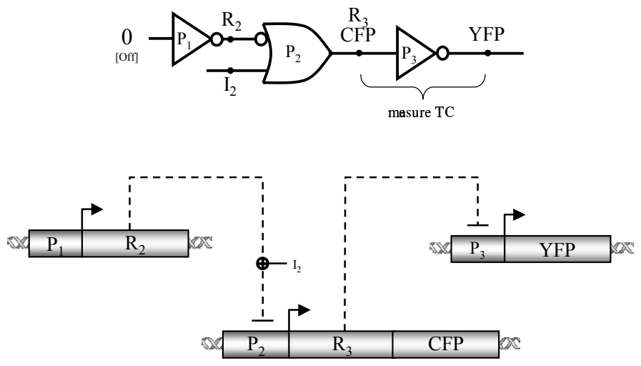

Figure 1: Genetic circuit diagram to measure the device physics of an \(R\_3/P\_3\) inverter: digital logic circuit and the genetic regulatory network implementation (\(P\_x\): promoters, \(R\_x\): repressors, CFP/YFP: reporters)

Figure 1 shows the wiring diagram of genetic circuits we constructed to measure the device physics of two seperate inverters, one based on the *lacI* repressor / *p(lac)* promoter, and the other based on the *cI* repressor / \(\lambda P\_{(R)}\) promoter. Since the \(R\_2\) repressor input to the \(P\_2\) implies ([not *x*] or *y*) gate is constantly high, the level of the inducer molecule input \(I\_2\) determines the level of the repressor \(R\_3\). \(R\_3\) is the input protein to the \(R\_3/P\_3\) inverter gate under study. The cyan fluorescent protein (CFP) transcribed along with \(R\_3\) reports the level of the input signal, while the yellow fluorescent protein (YFP) simultaneously reports the output signal expressed from the \(R\_3/P\_3\) inverter. The output of this circuit is the logical not of the inducer input signal.

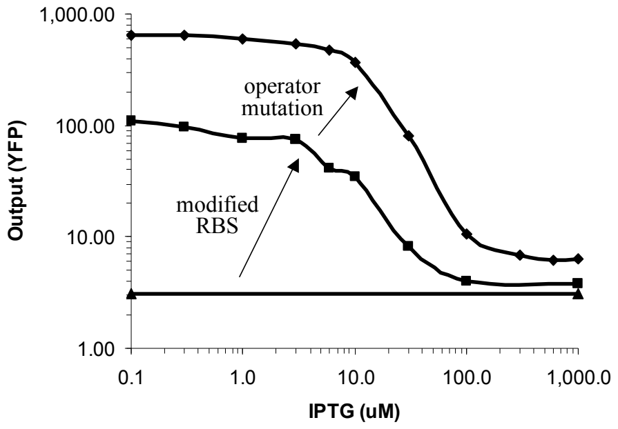

Figure 2: Genetic process engineering of the \(\mathit{cI}/\lambda P\_{(R-O12)}\) inverter. A series of genetic modifications converts a non-functional circuit into one that achieves the desired input/output behavior.

A transfer function is the relation between the input signal and the output signal of a gate or a circuit in steady state. Analog ranges represent digital signals of “zeros” and “ones.” An ideal transfer curve for an inverter has an inverse sigmoidal shape: the gain (or slope) is flat, then steep, then flat again. Because of the gain, the output of the inverter is a better representation of the digital value then the input (i.e. signal restoration). Figure 2 shows transfer curves of three circuits with an inverter based on \(\mathit{cI}/\lambda P\_{(R-O12)}\). The flat curve represents the non-responsive behavior of a circuit with an inverter based on the original \(\mathit{cI}/\lambda P\_{(R-O12)}\) genetic elements. As elaborated in Section 5, this demonstrates that coupling genetic components together into a circuit without first understanding their device physics may yield completely non-functional systems. Section 5 describes genetic mutations we performed on the original \(\mathit{cI}/\lambda P\_{(R-O12)}\) genetic elements to obtain a functional circuit with the desired input/output behavior. Figure 2 shows how two mutations result in an inverse sigmoidal transfer curve with good gain and noise margins.

In the rest of this paper, Section 2 provides background on biochemical logic circuits. Section 3 describes synthetic gene circuits that allow researchers to externally set the levels of *in-vivo* signals. Section 4 describes the genetic circuits and experiments to measure the transfer curve of the inverter based on *lacI/p(lac)*. Section 5 describes the process of optimizing the \(\mathit{cI}/\lambda P\_{(R-O12)}\) inverter until we obtained the desired input/output characteristics. Section 6 provides conclusions and offers avenues for future work.

## 2   Signals and Cellular Gates

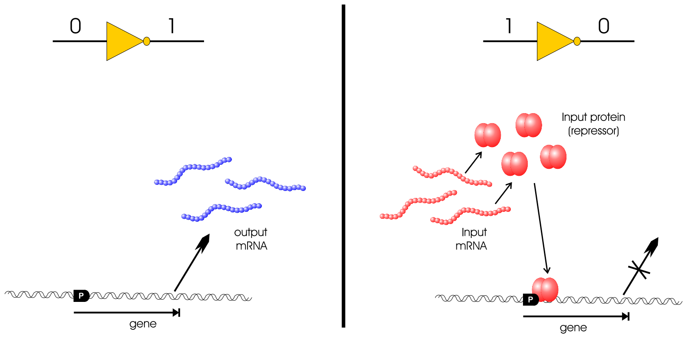

Figure 3: A simplified view of the two cases for a biochemical inverter.

Figure 3 describes how a biochemical inverter achieves the two states in digital inversion using genetic regulatory elements. Here, the concentration of a particular messenger RNA (mRNA) molecule represents a logic signal. In the first case, the input mRNA is absent and the cell transcribes the gene for the output mRNA using RNA Polymerase (RNAp) molecules. In the second case, the input mRNA is present and the cell translates the input mRNA into the input protein using ribosomes. The input protein then binds specifically to the gene at the promoter site (labeled “P”) and prevents the cell from synthesizing the output mRNA.

To represent multiple signals in a single cell requires different proteins that interact with specific DNA binding sites. Whereas electrical circuits seperate different signals spatially, the genetic circuits rely on chemical specificities. Finding a large enough library of non-interacting signals is therefore an important scalability issue. Besides the existence of thousands of different naturally occuring regulatory proteins, another potential source of a very large set of non-interacting signals is engineered Zinc Finger DNA binding proteins[4]. Importantly, the chemical isolation issue is only relevant to encoding a circuit in a single cell, which is one micron in diameter for *Escherichia coli*.

The implies gate[9] allows cells to receive control messages sent by humans or detect certain environmental conditions. The gate has two inputs, mRNA and an inducer molecule for the repressor protein coded by the mRNA, and has an mRNA output. In the absence of the input mRNA and its corresponding repressor, RNAp binds to the promoter and transcribes the output gene, yielding a high output. As with the inverter, if only the input repressor is present, it binds to the promoter and prevents transcription, yielding a low output. Finally, if both the repressor and the inducer are present, the inducer binds to the repressor and changes the conformation of the repressor. The conformation change prevents the repressor from binding to the operator, and allows RNAp to transcribe the gene, yielding a high output. The two gate inputs are not interchangeable. The input and output repressors can be connected to any other circuit component, but the inducer input is an intercellular signal, and is specifically coupled to the input repressor.

## 3   External Control of Signals

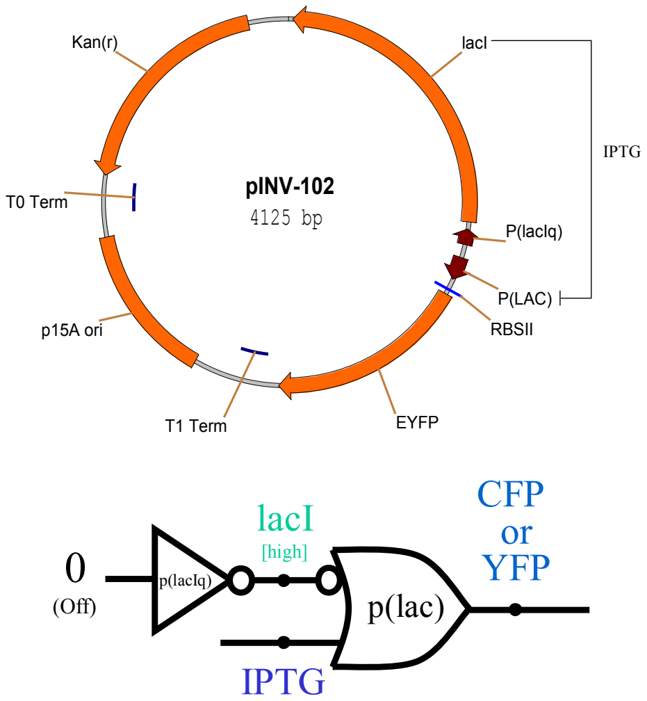

Figure 4: Genetic circuit to set protein expression levels. IPTG concentration controls the level of the output protein EYFP.

The first step in measuring the device physics of an inverter is to construct genetic circuits that allow the researcher to externally set the *in-vivo* level of a signal. This is performed using circuits where an inverter is connected to an implies gate. We constructed two such circuits, one on plasmid pINV-102 with the enhanced yellow fluorescent protein (EYFP) output protein (Figure 4) and another circuit on a similar plasmid named pINV-112-R1 with the enhanced cyan fluorescent protein (ECFP) as the output protein. The fluorescent proteins are both from Clontech[3]. The inverter that comprises the constitutive promoter *p(lacIq)* has an input that is always set to low, because the cell does not contain a repressor for the *p(lacIq)* promoter. Therefore, the output of the inverter, *lacI*, is constantly high. Then, since the *lacI* repressor input to the *p(lac)* implies gate is constantly high, the level of the inducer molecule input, IPTG (isopropylthio-*β*-galactoside), is positively correlated with the level of the output. The researcher controls the level of the output signal with this circuit by externally setting the level of IPTG, which freely diffuses into the cell.

In Figure 4, the double-stranded plasmid layout includes the following genetic elements: the p15A origin controlling the copy number of the plasmid in the cell, *kanamycin* antibiotic resistance for selective growth, promoters represented by short arrows, protein coding sequences downstream of specific promoters, and transcription terminators such as T1 Term. The promoters and protein coding sequences are either clockwise or counter-clockwise depending on the direction of the DNA strand which encodes them.

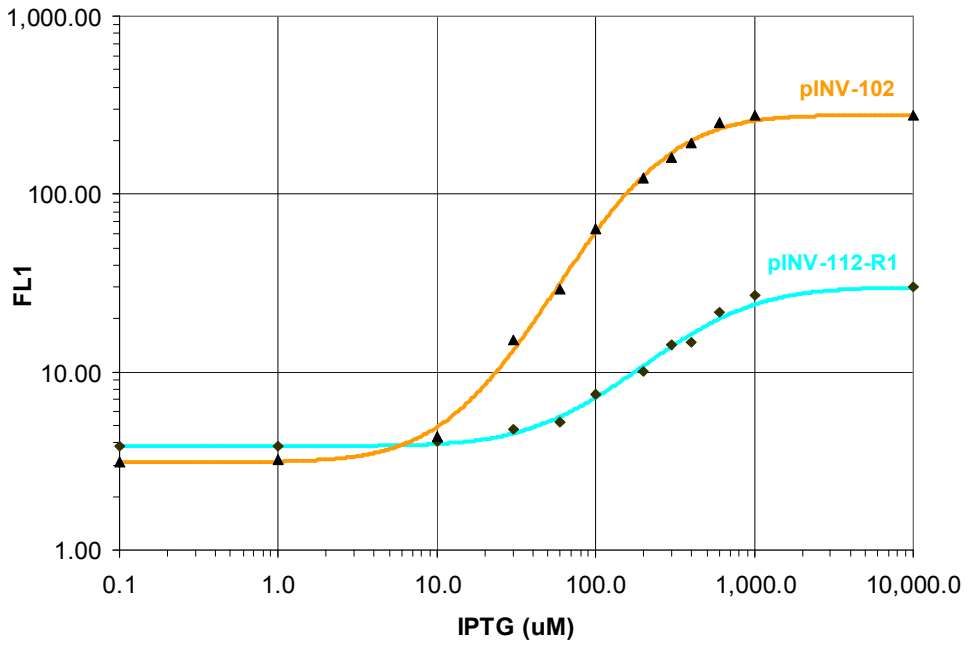

Figure 5: Controlling signal levels using external induction with IPTG.

Figure 5 shows data of *Escherichia coli* cells with the pINV-102 and pINV-112-R1 plasmids grown for approximately five hours in culture until they reach steady state. The construction of all plasmids and experimental conditions in this paper are described in detail seperately[9]. The data includes median fluorescence values obtained using Fluorescence-Activated Cell Sorting (FACS)[8] of the different cell populations induced with a range of IPTG concentrations. The graph shows how to control an *in-vivo* signal using external induction with IPTG. The relationship between the ECFP and EYFP fluorescence intensities in Figure 5 is used to normalize between simultaneous ECFP/EYFP readings in subsequent experiments in this paper. This genetic setup is used in the following sections to set the levels of input mRNA to the inverters under study.

## 4   The lacI/p(lac) Inverter

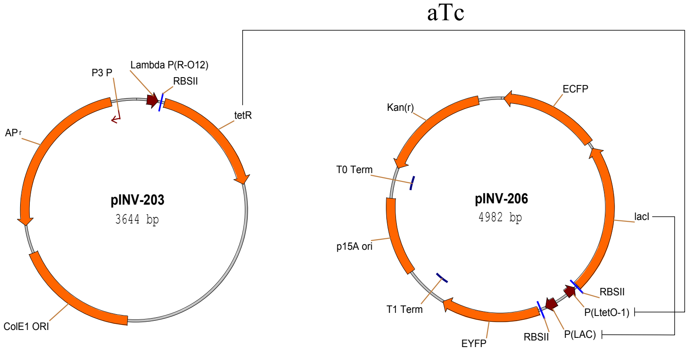

Figure 7: Genetic circuit to measure the transfer curve of the *lacI/p(lac)* inverter.

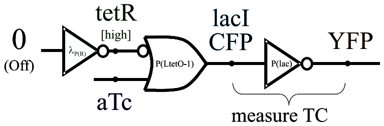

Figure 6: Gate level circuit diagram for pINV-203 and pINV-206

Figures 7 and 6 show the genetic circuit used to measure the device physics of an inverter based on the *lacI* repressor and the *p(lac)* promoter. The first two logic gates set the level of the input signal to the inverter in a mechanism similar to one used in the circuit from Section 3. Here, the \(\lambda P\_{(R-O12)}\) inverter functions as a constitutive promoter (no *cI* in the system) to set a constant high level of the Tet repressor (*tetR*). Then, through the *tetR/P(LtetO-1)* implies gate, the concentration of the aTc (anhydrotetracycline) inducer molecule controls the level of the lac repressor (*lacI*). *lacI* is the input protein to the inverter gate under study. The ECFP transcribed along with *lacI* reports the level of the input signal. Finally, EYFP reports the output signal expressed from the *lacI/p(lac)* inverter.

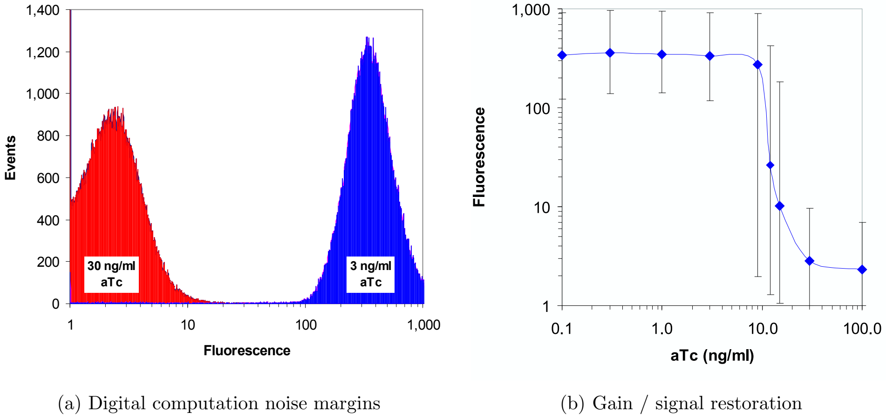

Figure 8: Transfer curve gain and noise margins for the *lacI/p(lac)* circuit.

The output of this circuit is the logic not of the aTc input signal. Figure 8(a) shows FACS cell population data of the EYFP output signal in seperate experiments where the cells were exposed to different aTc inducer input concentrations. For a low input concentration of \(3\frac{\mathrm{ng}}{\mathrm{ml}}\) aTc, the output of the circuit is appropriately high. For a high input concentration of \(30\frac{\mathrm{ng}}{\mathrm{ml}}\) aTc, the output of the circuit is correctly low. The figure also illustrates the good noise margins between low and high signal values because the two aTc input levels shown are immediately before and after the sharp transition from high to low output.

Figure 8(b) illustrates the transfer function of the circuit with respect to the level of the inducer. The figure relates aTc input levels to YFP output fluorescence levels, with error bars depicting the range that includes 95% of the flow cytometry fluorescence intensities of the cells recorded for the particular aTc level. The favorable noise margins and signal restoration of this circuit clearly demonstrate that digital-logic computation is feasible with genetic circuits.

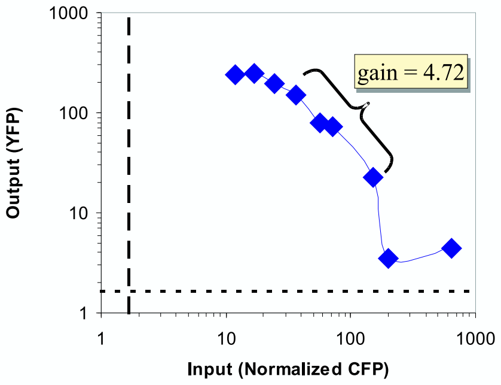

Figure 9: The *lacI/p(lac)* transfer curve.

By correlating ECFP and EYFP readings for the same experiment, Figure 9 shows the normalized transfer curve of the *lacI/p(lac)* inverter. The ECFP fluorescence intensities are normalized to the EYFP levels based on the experimental results from Section 3. After normalization, each point represents the median fluorescence intensities for a particular experimental condition of the input signal (ECFP) versus the output signal (EYFP). The gain of the inverter of 4.72 is sufficient for digital-logic computation, and is likely to be related to the pentameric nature of *lacI* repression[6].

The *lacI/p(lac)* gate characterized in this section is the first component of the cellular gate library. Next, we describe the addition of the second component to the gate library, the \(\mathit{cI}/\lambda P\_{(R-O12)}\) inverter. In particular, the following section demonstrates genetic process engineering to optimize the original behavior of this gate and obtain the desired behavior for digital computation.

## 5   Optimizing \(\mathit{cI}/\lambda P\_{(R-O12)}\) Inverters

While the gain exhibited by the *lacI/p(lac)* is sufficient, other repressor/promoter combinations can yield better signal restoration. One such example is the \(\mathit{cI}/\lambda P\_{(R-O12)}\) inverter. The *cI* repressor binds cooperatively to the \(\lambda\) promoter’s \(O\_{R1}\) and \(O\_{R2}\) operators, which results in high gain. The \(\lambda P\_{(R-O12)}\) is a synthetic promoter that we designed and that excludes \(O\_{R3}\) of the wild type \(\lambda\) promoter. The affinity of *cI* to \(O\_{R3}\) is weak and this operator would not significantly enhance the repression efficiency of *cI*.

The *cI* monomer, also known as \(\lambda\) repressor, has an amino domain comprised of amino acids 1-92, a carboxyl domain of residues 132-236, and 40 remaining amino acids that connect the two domains[7]. The monomers associate to form dimers, which can then bind to the 17bp operator regions. *cI*’s intrinsic affinity to \(O\_{R1}\) is about 10 times higher than to \(O\_{R2}\), and therefore typically binds \(O\_{R1}\) first. However, the binding of *cI* to \(O\_{R1}\) immediately increases the affinity of a second dimer to \(O\_{R2}\) because of the interaction with the previously bound dimer. As a result, repressor dimers bind to \(O\_{R1}\) and \(O\_{R2}\) almost simultaneously. From a circuit engineering perspective, this cooperative binding leads to a much desired high gain since the transition from low repression activity to high repression activity occurs over a small range of repressor concentrations.

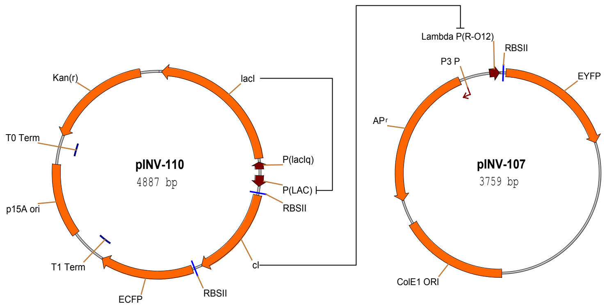

Figure 10: Genetic circuit to measure the transfer curve of \(\mathit{cI}/\lambda P\_{(R-O12)}\), using *lacI* as driver.

The genetic circuit to measure the device physics of the \(\mathit{cI}/\lambda P\_{(R-O12)}\) is logically similar to the one used to measure the *lacI/p(lac)* inverter (Figures 10). Here, the *lacI/p(lac)* implies gate controls the level of the *cI* input. For a particular experiment, the researcher sets the repressor level by controlling the IPTG concentration.

The logic interconnect of this circuit should result in EYFP fluorescence intensities that are inversely correlated with the IPTG input levels. However, as shown in Figure 2 (the flat line), the circuit is completely unresponsive to variations in the IPTG levels. The lack of response stems from the mismatch between the kinetic characteristics of the *lacI/p(lac)* gate versus the \(\mathit{cI}/\lambda P\_{(R-O12)}\) inverter. Specifically, with no IPTG, the fully repressed expression level from *p(lac)* still results in a low level of *cI* mRNA. Because the ribosome binding site is very efficient, the low mRNA level results in some translation of the *cI* protein. And because *cI* is a highly efficient repressor, even a low concentration represses the \(\lambda P\_{(R-O12)}\) promoter to the point where no fluorescence can be detected. This gate mismatch highlights the importance of understanding the device physics of the cellular gates. The following two sections describe genetic process engineering to modify genetic elements in the \(\mathit{cI}/\lambda P\_{(R-O12)}\) inverter such that the gate obtains the desired behavioral characteristics.

### 5.1   Modifying Ribosome Binding Sites

Ribosome Binding Site (RBS) sequences significantly control the rate of translation from the input mRNA signal to the input protein. These sequences align the ribosome onto the mRNA in the proper reading frame so that polypeptide synthesis can start correctly at the AUG initiation codon. The affinity of the ribosome’s 30S subunit to the RBS that it binds determines the rate of translation. This translation rate is included in a biochemical reaction for modeling and simulating the inverter using BioSPICE[10, 9]. For a given input mRNA level, a reduction in the translation rate yields a lower input protein level, which pushes the entire transfer curve upward and outward. BioSPICE simulations serve as an abstract model to study the effects of changing reaction kinetics of specific genetic components in the logic computation.

The sequences for the original highly efficient *cI* RBS used in the circuit above, as well as three other less efficient RBS’s from the literature[2] are:

orig:ATTAAAGAGGAGAAATTAAGCATG(strongest)
RBS-1:TCACACAGGAAACCGGTTCGATG
RBS-2:TCACACAGGAAAGGCCTCGATG
RBS-3:TCACACAGGACGGCCGGATG(weakest)

Starting from pINV-110, we constructed three new plasmids (pINV-112-R1, pINV-112-R2, pINV-112-R3) where the three weaker RBS’s replace the original RBS of the *cI*. pINV-112-R1 contains the strongest RBS, while pINV-112-R3 contains the weakest RBS.

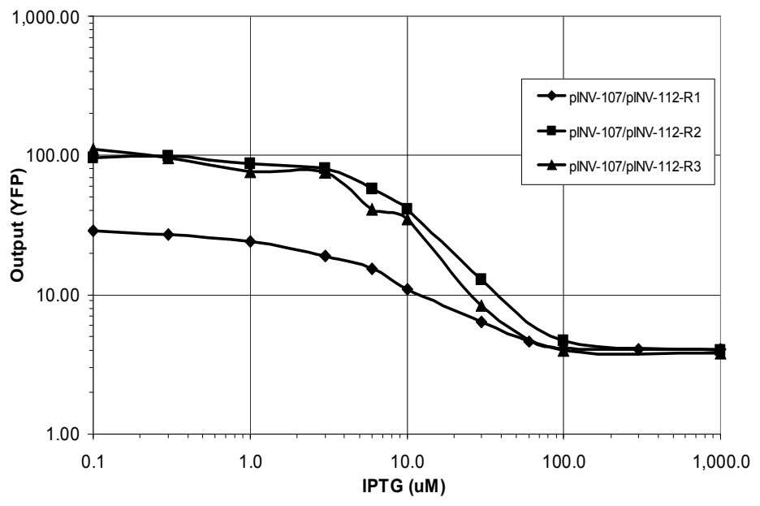

Figure 11: The effect of weaker RBS’s on the behavior of the \(\mathit{cI}/\lambda P\_{(R-O12)}\) circuit. Here the output YFP exhibits the desired inverse sigmoidal relationship to the IPTG input.

Figure 11 shows the dramatic effect of the RBS change on the behavior of the circuit, where now the output YFP exhibits the desired inverse sigmoidal relationship to the IPTG input. The circuit with the strongest RBS (pINV-107/pINV-112-R1) shows a moderate sensitivity to IPTG, while the circuits with the other two RBS’s display a more pronounced response to variations in IPTG.

### 5.2   Modifying Repressor/Operator Affinity

Replacing the strong ribosome binding site with weaker sites converted a non-functional circuit into a functional one, and demonstrated the utility of genetic process engineering. This section describes further modifications to the repressor/operator affinity that yield additional improvements in the performance of the circuit. These modifications are also motivated by BioSPICE simulations[10, 9]. The simulations show how reductions in the binding affinity of the repressor to the operator reshape the transfer curve of the inverter upward and outward.

To reduce the repressor/operator affinity, we constructed three new plasmids with modified \(O\_{R1}\) sequences using site-directed mutagenesis to have the following sequences:

orig:TACCTCTGGCGGCGGTGATA
mut4:TACATCTGGCGGCGGTGATA
mut5:TACATATGGCGGCGGTGATA
mut6:TACAGATGGCGGCGGTGATA

*cI*’s amino domain is folded into five successive stretches of α-helix, where α-helix 3 lies exposed along the surface of the molecule[7]. This α-helix recognizes the \(\lambda\) operators and binds the repressor to those particular DNA sequences. The two α-helix 3 motifs of the repressor’s dimer complex are separated by the same distance as the one separating successive segments of the major groove along one face of the DNA. These motifs efficiently bind the repressor dimer to the mostly symmetric \(\lambda\) operator regions, where each operator consists of two half-sites. The following is the consensus sequence for the twelve operator half-sites in the wild-type Bacteriophage \(\lambda\) (subscripts correspond to the frequency of the base pair in the given position):

$$\begin{array}{ccccccccc}
T\_{9} & A\_{12} & T\_{6} & C\_{12} & A\_{9} & C\_{11} & C\_{7} & G\_{9} & C\_{5} \\
C\_{2} & & C\_{3} & & T\_{2} & T\_{1} & T\_{4} & T\_{2} & T\_{1} \\
A\_{1} & & A\_{1} & & C\_{1} & & G\_{1} & C\_{1} &
\end{array}$$

In choosing mutations to perform, we conjectured that bases with high frequency in the consensus sequence would be significant to strong repressor/operator binding. mut4 is a one base pair mutation C→A of the fourth \(O\_{R1}\) position. mut5 is a two base pair mutation that also modifies the sixth \(O\_{R1}\) position C→A, and mut6 is a three base mutation that also modifies the fifth \(O\_{R1}\) position T→G.

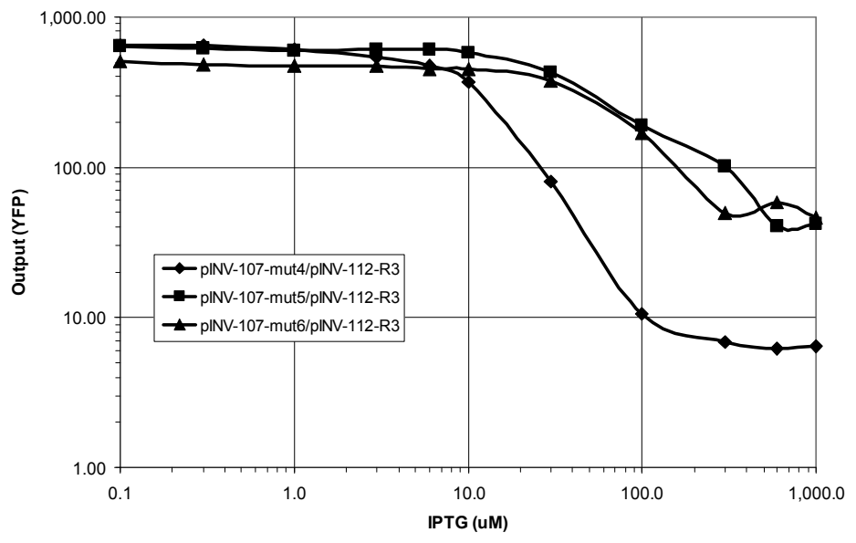

Figure 12: The effect of \(\lambda P\_{(R-O12)}\) \(O\_{R1}\) operator mutations on the behavior of the \(\mathit{cI}/\lambda P\_{(R-O12)}\) circuit

The experimental results in Figure 12 demonstrate the effect of coupling the three \(\lambda P\_{(R-O12)}\) \(O\_{R1}\) operator mutations with the weakest ribosome binding site from above. The two and three base pair \(O\_{R1}\) mutations, coupled with the weak RBS, produce a circuit where the highest levels of *cI* cannot repress the output of the \(\mathit{cI}/\lambda P\_{(R-O12)}\) gate. A one base pair mutation to \(O\_{R1}\) in plamids pINV-107-mut4/pINV-112-R3 yields a circuit with a well-behaved response to the IPTG signal, and is a good gate candidate for other biocircuits.

## 6   Conclusions

In summary, using genetic process engineering we first examined the behavioral characteristics of the \(\mathit{cI}/\lambda P\_{(R-O12)}\) inverter, and then genetically modified the gate until we produced a version with the desired inverse sigmoidal behavior. The design and experimental results illustrate how to convert a non-functional circuit with mismatched gates into a circuit that achieves the correct response (Figure 2). Note that in choosing genetic variations, the specific ribosome binding site modifications in Section 5.1 can be applied to any inverter and are independent from the specific genetic candidate. The operator mutations in Section 5.2 are specific to the \(\lambda P\_{(R)}\) and *cI* and cannot be generally applied to other operators. Accordingly, there are several strategies to optimizing a new component. First, one can test modifications that are applicable to any component. Second, one can study the particular component by reading the literature and performing laboratory experiments, and choose mutations based on the understanding of the specific biochemistry of the element. Third, one can perform large-scale random mutations on the element, and screen for mutants that have the desired behavior.

The device physics measurements in this paper facilitate biocircuit design because they enable prediction of the behavior of complex circuits using the characteristics of simple components. With the appropriate tools, the engineer of biocircuits can begin to design and produce large-scale circuits. In understanding the device physics of cellular gates, great emphasis must be placed on considering the special substrate properties, such as signal fluctuations and matching kinetic characteristics. The experimental results reported here represent an important effort to assemble a library of simple standardized biological components with the proper device physics that can be combined in predictable ways to engineer novel cell behaviors.

## References

1. M. Elowitz and S. Leibler. A synthetic oscillatory network of transcriptional regulators. *Nature*, 403:335–338, January 2000.
2. T. Gardner, R. Cantor, and J. Collins. Construction of a genetic toggle switch in *escherichia coli*. *Nature*, 403:339–342, January 2000.
3. G. Green, S. R. Kain, and R. Angres. Dual color detection of cyan and yellow derivatives of green fluorescent protein using conventional microscopy and 35-mm photography. In *Methods in Enzymology*, volume 327, pages 89–94, 2000.
4. H. A. Greisman and C. O. Pabo. A general strategy for selecting high-affinity zinc finger proteins for diverse dna target sites. *Science*, 275:657–661, 1997.
5. T. F. Knight Jr. and G. J. Sussman. Cellular gate technology. In *Proceedings of UCM98: First International Conference on Unconventional Models of Computation*, pages 257–272, Auckland, NZ, January 1998.
6. B. Muller-Hill. *The lac Operon: A Short History of a Genetic Paradigm*. Walter de Gruyter, 1996.
7. M. Ptashne. *A Genetic Switch: Phage lambda and Higher Organisms*. Cell Press and Blackwell Scientific Publications, Cambridge, MA, 2 edition, 1986.
8. H. M. Shapiro. *Practical Flow Cytometry*. Wiley-Liss, New York, NY, 1995. Third Edition.
9. R. Weiss. *Cellular Computation and Communications using Engineered Genetic Regulatory Networks*. PhD thesis, Massachusetts Institute of Technology, September 2001.
10. R. Weiss, G. Homsy, and T. F. Knight Jr. Toward in-vivo digital circuits. In *Dimacs Workshop on Evolution as Computation*, Princeton, NJ, January 1999.
11. R. Weiss, G. Homsy, and R. Nagpal. Programming biological cells. In *Eighth International Conference on Architectural Support for Programming Languages and Operating Systems, Wild and Crazy Ideas Session*, San Jose, California, October 1998.
