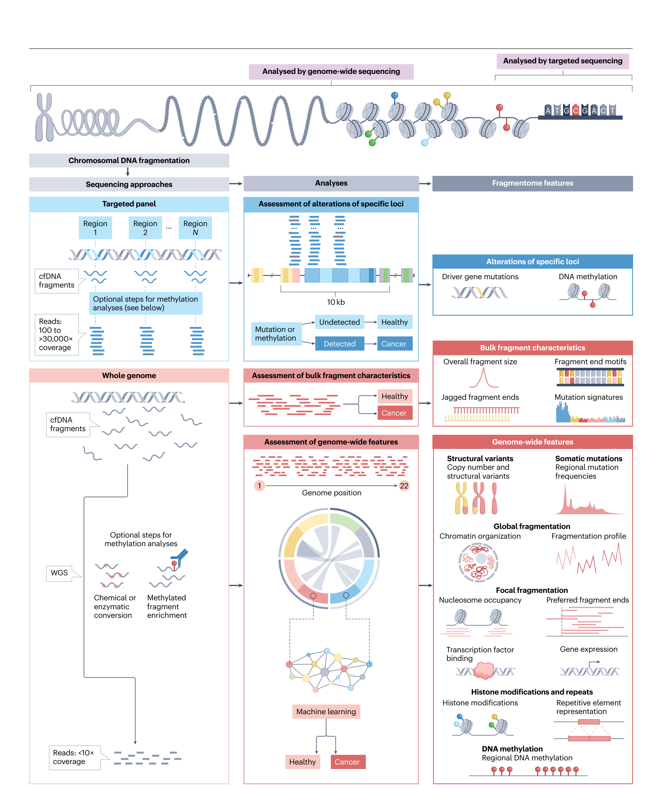
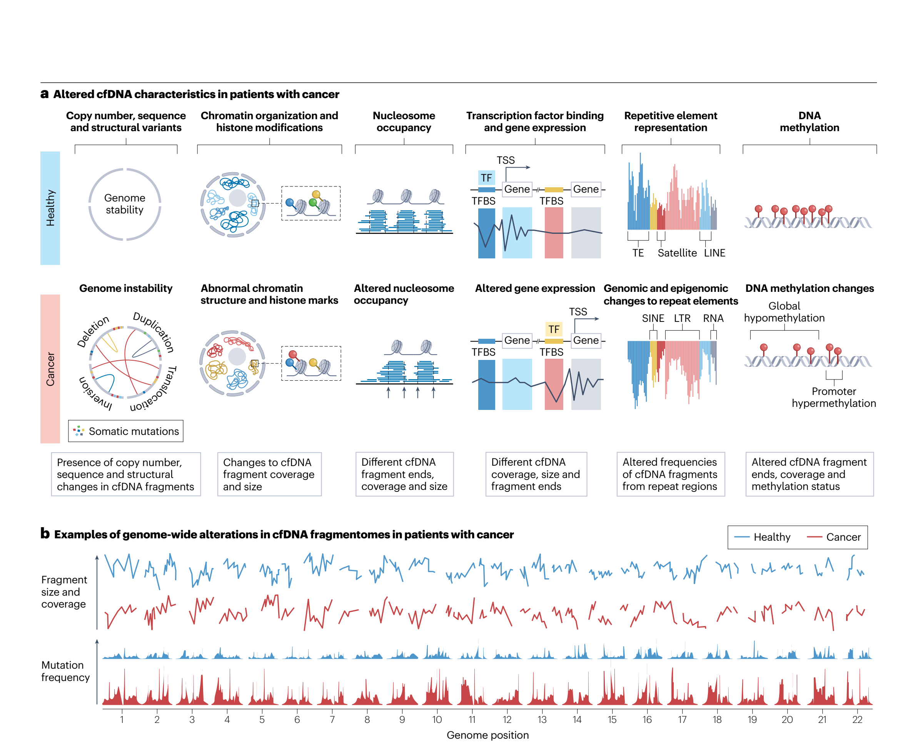
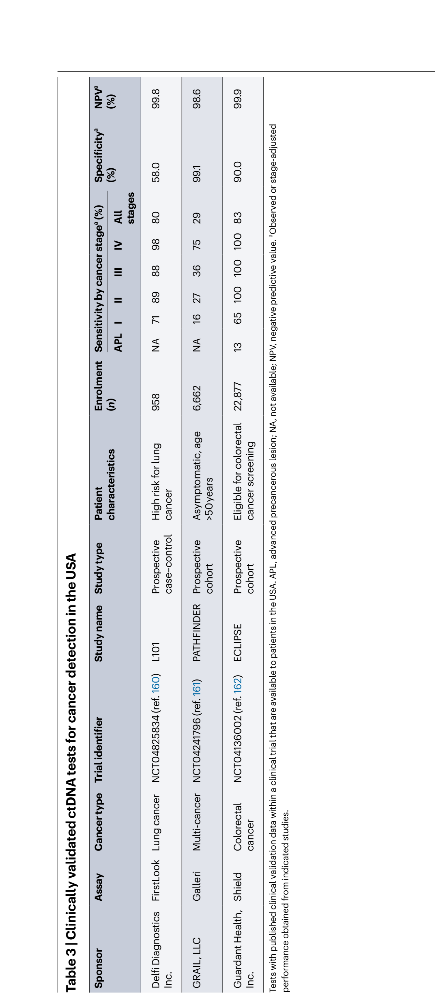

Genomic and fragmentomic landscapes of cell-free DNA for early cancer detection

Review article

<https://doi.org/10.1038/s41568-025-00795-x>

# Genomic and fragmentomic landscapes of cell-free DNA for early cancer detection

Daniel C. Bruhm1, Nicholas A. Vulpescu1, Zachariah H. Foda1,2, Jillian Phallen1, Robert B. Scharpf1,3 & Victor E. Velculescu1,2

1The Sidney Kimmel Comprehensive Cancer Center, Johns Hopkins University School of Medicine, Baltimore, MD, USA. 2Department of Medicine, Johns Hopkins University School of Medicine, Baltimore, MD, USA. 3Department of Biostatistics, Johns Hopkins Bloomberg School of Public Health, Baltimore, MD, USA. e-mail: velculescu@jhmi.edu

## Abstract

Genomic analyses of cell-free DNA (cfDNA) in plasma are enabling noninvasive blood-based biomarker approaches to cancer detection and disease monitoring. Current approaches for identification of circulating tumour DNA typically use targeted tumour-specific mutations or methylation analyses. An emerging approach is based on the recognition of altered genome-wide cfDNA fragmentation in patients with cancer. Recent studies have revealed a multitude of characteristics that can affect the compendium of cfDNA fragments across the genome, collectively called the ‘cfDNA fragmentome’. These changes result from genomic, epigenomic, transcriptomic and chromatin states of an individual and affect the size, position, coverage, mutation, structural and methylation characteristics of cfDNA. Identifying and monitoring these changes has the potential to improve early detection of cancer, especially using highly sensitive multi-feature machine learning approaches that would be amenable to broad use in populations at increased risk. This Review highlights the rapidly evolving field of genome-wide analyses of cfDNA characteristics, their comparison to existing cfDNA methods, and recent related innovations at the intersection of large-scale sequencing and artificial intelligence. As the breadth of clinical applications of cfDNA fragmentome methods have enormous public health implications for cancer screening and personalized approaches for clinical management of patients with cancer, we outline the challenges and opportunities ahead.

## Introduction

Despite efforts in prevention and treatment, cancer remains a leading cause of mortality worldwide1. Cancer screening has been shown to reduce mortality for certain cancer types. The first widely used cancer screening approach, the Papanicolaou test or ‘pap smear’, was introduced in 1923 and involved collecting cells from the cervix using a swab and examining them under a microscope to identify abnormal cells2. The pap smear is still widely used today, with current estimates suggesting that its use has led to at least an 80% reduction in both the incidence of cervical cancer and related mortality3.

**Table 1** | Cancer types with recommended screening

| Cancer type | Screening guidelines or programmes | Target population | Screening test(s) |
| --- | --- | --- | --- |
| **Universal age-based screening** | | | |
| Breast150 | Multiple national or international guidelines (USPSTF and others) | Generally starting at age 40-50 years and ending at age 69-74 years | Mammography |
| Colorectum150 | Multiple national or international guidelines (USPSTF and others) | Generally starting at age 45-55 years and ending at age 74 years | Colonoscopy, flexible sigmoidoscopy, FIT, FIT-DNA, gFOBT, CT colonography |
| Cervix150 | Multiple national or international guidelines (USPSTF and others) | Generally starting at age 18-29 years and ending at age 60-70 years | Cytology, HPV |
| **Universal screening in high-risk groupsa** | | | |
| Lung151 | Multiple national or international guidelines (USPSTF and others) | Generally starting at age 50-55 years and ending at age 70-80 years; ≥20-30 pack-year smoking history, with some requiring current smoking or having quit smoking within the last 10-15 years | LDCT |
| Liver152 | Multiple national or international guidelines (AASLD and others) | Individuals with cirrhosis or HBV or HCV infection and other high-risk characteristics | Ultrasound, AFP, DCP, AFP-L3 |
| **Geographic-based screening (with example screening programmes)** | | | |
| Stomach153 | Screening programmes in several Asian countries | Generally starting at age 40 years | Endoscopy, serum-pepsinogen test, barium tests |
| Head and neck (nasopharyngeal carcinoma)154 | Cancer screening programme in rural areas in China | Individuals at age 30-69 years with high-risk characteristics | EBV serology test followed by nasopharyngoscopy |
| Oesophagus154 | Screening programmes in China | Individuals at age 45-74 years with high-risk characteristics | Endoscopy |
| **Mixed recommendations on screening** | | | |
| Skin150 | Some guidelines (for example, Federal Joint Committee in Germany) recommending screening whereas others have concluded evidence is insufficient (for example, USPSTF) | No general consensus | Visual skin examination by a physician, self-examination |
| Prostate150 | Some guidelines recommend screening whereas others recommend against screening | Starting at age 40-50 years if recommended | PSA, DRE |

Cancer types are ordered within each category by prevalence1. AASLD, American Association for the Study of Liver Diseases; AFP, α-fetoprotein; AFP-L3, Lens culinaris agglutinin-reactive fraction of AFP; CT, computed tomography; DCBE, double-contrast barium enema; DCP, des-γ-carboxyprothrombin; DRE, digital rectal examination; EBV, Epstein-Barr virus; FIT, faecal immunochemical test; gFOBT, guaiac faecal occult blood test; HBV or HCV, hepatitis B or C virus; HPV, human papillomavirus; LDCT, low-dose computed tomography; PSA, prostate-specific antigen; USPSTF, US Preventative Services Task Force. aIndividuals with specific high-risk characteristics such as certain genetic variants may have different screening recommendations. For example, endometrial cancer screening by means of endometrial biopsy is recommended by the American Cancer Society for individuals 35 years or older that have or are at risk for hereditary non-polyposis colorectal cancer155. Another example is screening for pancreatic cancer, which has been recommended for high-risk individuals with >5% lifetime risk, including those individuals with a family history of cancer or who carry specific mutations156.

Motivated by subsequent large-scale studies demonstrating benefits of cancer screening for lung cancer4,5, colorectal cancer6,7, cervical cancer8 and breast cancer9,10, worldwide organizations have supported widespread screening programmes11. For example, in the USA, the US Preventative Services Task Force recommends regular screening, depending on age or exposure history, for cervical cancer using human papillomavirus or Pap test, for breast cancer using mammography, for colorectal cancer with colonoscopy or stool-based tests, and for lung cancer with low-dose computed tomography (LDCT)12. Other countries have screening programmes for individuals at increased risk for cancers of the liver, stomach, oesophagus, and head and neck (Table 1). Although most screening efforts are focused at asymptomatic populations at risk of disease, observational studies suggest that early diagnosis of cancer even in symptomatic individuals may improve outcomes13.

Nevertheless, many cancers are diagnosed at advanced stages, especially in regions with limited resources1. Most cancers do not have effective screening strategies, and even for those with existing screening modalities, several challenges have emerged. In the USA, compliance has been encouraging for colorectal cancer, breast cancer and cervical cancer (60–80%), but can still be improved, and remains particularly low for lung cancer, in which <6% of individuals adhere to screening guidelines14. In addition, in these populations, false-positive results from imaging are not uncommon. For example, for lung cancer screening with LDCT, the positive predictive value is only 3.8%, indicating that only a small fraction of individuals who had a positive LDCT were ultimately diagnosed with lung cancer15. About half of all women who receive a yearly mammogram will have a false-positive result over a 10-year time span16. There is a clear unmet clinical need for improved and accessible screening tests for these and other cancers.

Improved understanding of the cancer genome17–19, and the advent of massively parallel sequencing, also known as next-generation sequencing (NGS), has enabled rapid characterization of millions of cell-free DNA (cfDNA) fragments for genomic alterations at base pair resolution in healthy individuals and patients with cancer. Cancer genomes generally harbour thousands of genetic or epigenetic alterations20–22, and release of cfDNA from cancer cells affords a potential biomarker of disease23. Apoptosis, necrosis and active secretion are considered the main mechanisms responsible for generating cfDNA24. cfDNA represents naturally digested DNA fragments that are small in size (generally <200 bp) and can be detected in many bodily fluids including blood, saliva, urine, stool and cerebrospinal fluid, among others25. It is now generally accepted that cfDNA originates from nucleosomes, with most fragments associated with mononucleosomes (approximately ~167 bp in size) and a small fraction from dinucleosomes (approximately ~330 bp in size) or from larger fragments26. Most current research for cancer detection has focused on cfDNA in the circulation using the tumour-derived component termed circulating tumour DNA (ctDNA). For healthy individuals, the source of plasma cfDNA is largely from leukocytes, but it is also derived from megakaryocytes, erythrocyte progenitor cells, vascular endothelial cells, and hepatocytes, with small amounts from other cell types27. In individuals with cancer, ctDNA derived from dying cancer cells contributes to overall cfDNA levels28. ctDNA analyses were initially used for therapeutic stratification and informing clinical decisions during therapy29, and now cfDNA-based tests are increasingly being explored for their potential of early detection of cancer.

In this Review, we examine the characteristics of cfDNA in healthy individuals and how these change in patients with cancer. We assess fundamental strategies of targeted methods for cfDNA analyses that rely on the detection of somatic mutations or DNA methylation and limitations of these approaches. We review the early proof-of-concept studies for genome-wide analysis of the cfDNA fragmentome, its origin from nucleosomes that can reflect changes in chromatin structure, and the ability to recover genomic and epigenomic information with whole-genome sequencing (WGS). Lastly, we discuss how these discoveries have facilitated the adoption of liquid biopsies and cfDNA analyses in a wide-range of clinical applications.

## Characterizing cell-free DNA

**Fig. 1** | cfDNA features and analysis for early detection of cancer. Chromosomal DNA fragmentation is modulated by chromatin organization, including large-scale open and closed chromatin and smaller-scale nucleosome positioning, as well as other genomic and epigenomic characteristics, giving rise to the cfDNA fragmentome. Approaches for analysis of the cfDNA fragmentome have included targeted sequencing and genome-wide sequencing. Targeted sequencing involves enriching cfDNA fragments for specific sites in the genome and deep sequencing (for example, 100 to >30,000× sequence coverage) for the detection of mutations in cancer driver genes or changes in DNA methylation. Whole-genome sequencing (WGS) at low coverage (<10×, with optional steps for methylation detection) and analysis of the entire genome has enabled detection of an increasing compendium of alterations. Genome-wide features are typically analysed using machine learning models to develop classifiers that predict whether an individual has cancer. Early detection approaches that utilize these features are listed in Tables 2 and 3. When selecting a method for cfDNA analysis, each approach offers distinct advantages and disadvantages. Targeted approaches may improve the signal-to-noise ratio by focusing on cancer-specific alterations and using established error correction strategies. However, they require additional steps for target enrichment and deep sequencing, with performance limited by cfDNA input quantity and the need for matched white blood cell sequencing for mutation-based analyses. Whole-genome bulk analyses do not require target enrichment and are not limited by cfDNA input, but performance can be limited owing to small cancer-specific differences, few assessed features, and no positional information. Genome-wide analyses measure numerous features across the genome, combining positional insights with machine learning for high performance. They avoid target enrichment, require minimal cfDNA input, and enable biomarker identification using existing data sets. Disadvantages include the need for complex statistical approaches including machine learning to integrate many features and reliance on less-established error suppression methods. For some methylation analyses, additional steps for bisulfite or enzymatic treatment of cfDNA are required with either approach.

Since the discovery of nucleic acids in human blood plasma30, our understanding of the characteristics of cell-free DNA has evolved in parallel with technological advances facilitating the study of nucleic acids. Two primary avenues for sequencing and analysis of cfDNA have emerged, targeted and genome-wide approaches (Fig. 1). Compared with genome-wide approaches, targeted approaches require more complex laboratory assays involving enrichment of specific regions, tend to have greater technical and systematic sources of variation, are typically more expensive, and result in fewer observations used for test analyses. Novel methods are emerging for summarizing the multitude of characteristics of cfDNA fragments across the genome together with machine learning approaches for cancer detection. These include a recent explosion of genome-wide methods for analysis of cfDNA features, including for fragmentation characteristics, structural variants, somatic mutations, DNA methylation, and repetitive regions of the genome (Fig. 1). Here, we review the biological basis of these recent methods and their application for early detection of cancer.

### Genomic features of cfDNA

**Table 2** | Representative cfDNA-based early cancer detection approaches

| Overall approach | Method or study name | Assay | Features analysed | Initial cancer types analysed |
| --- | --- | --- | --- | --- |
| Targeted approaches | TEC-Seq37 | Targeted hybrid-capture NGS of 58 genes comprising 80.93 kb | Somatic mutations | Breast, colorectum, lung, ovary |
| Targeted approaches | CancerSEEK78 | PCR-based targeted sequencing of a 61-amplicon panel, immunoassay for eight proteins | Somatic mutations, proteins | Breast, colorectum, oesophagus, liver, lung, ovary, pancreas, stomach |
| Targeted approaches | Lung-CLiP39 | Targeted hybrid-capture NGS of 266 genes comprising 355 kb | Somatic mutations, CNVs | Lung |
| Targeted approaches | RealSeqS157, A-PLUS158 | PCR-based targeted sequencing of ~350,000 repetitive elements | Chromosomal CNVs, Alu element representation | 12 cancer types |
| Targeted approaches | Galleri75,a | Targeted hybrid-capture bisulfite sequencing of 17.2 Mb | DNA methylation | >50 cancer types |
| Targeted approaches | PanSEER74 | Bisulfite conversion followed by targeted PCR to amplify and sequence 595 genomic loci encompassing 11,787 CpG sites | DNA methylation | Colorectum, oesophagus, liver, lung, stomach |
| Targeted approaches | ELSA-seq76 | Bisulfite conversion and hybrid-capture of cfDNA covering 80,672 CpG sites comprising approximately 1.05 Mb | DNA methylation | Lung |
| Targeted approaches | Shield133,a | Barcoding of methylated and unmethylated cfDNA fragments followed by targeted hybrid-capture of ~1Mb | Somatic mutations in APC or KRAS, DNA methylation, fragment end positions | Colorectum |
| Targeted approaches | SPOT-MAS77 | Targeted hybrid-capture bisulfite sequencing of 450 regions encompassing 18,000 CpG sites and WGBS | DNA methylation, fragment end motifs, genome-wide fragmentation profile and CNVs | Breast, colorectum, stomach, lung, liver |
| Targeted approaches | Helzer et al.159 | Targeted hybrid-capture sequencing of 2.1–2.4Mb | Fragment size at first coding exons | Bladder, breast, lung, prostate |
| Bulk analyses | Mouliere et al.93 | Low-coverage WGS | Fragment size, CNVs | Bile duct, brain, breast, colorectum, kidney, ovary, pancreas, skin |
| Bulk analyses | Motif diversity score94 | Low-coverage WGS | Fragment end motifs | Colorectum, head and neck, liver, lung |
| Bulk analyses | Pointy59 | Low-coverage WGS | Somatic mutation signatures | Breast, colorectum, lung, ovary, pancreas, stomach |
| Bulk analyses | Chan et al.32 | WGBS | Bulk methylation | Breast, liver, lung, nasopharynx, smooth muscle |
| Bulk analyses | Jaggedness index95 | WGBS | Fragment jaggedness | Liver |
| Genome-wide approaches | Genome-wide structural variants |  |  |  |
| Genome-wide approaches | Plasma aneuploidy score from digital karyotyping58 | Low-coverage WGS | Chromosomal CNVs | Breast, colorectum |
| Genome-wide approaches | PARE18 | Low-coverage WGS | Rearrangements | Breast, colorectum |
| Genome-wide approaches | plasma-Seq53 | Low-coverage WGS | CNVs | Prostate |
| Genome-wide approaches | Chan et al.32 | WGBS | CNVs | Breast, liver, lung, nasopharynx, smooth muscle |
| Genome-wide approaches | Genome-wide global fragmentation |  |  |  |
| Genome-wide approaches | DELFI47,115,118,127 | Low-coverage WGS | Fragmentation profile, chromosomal CNVs, mtDNA representation | Breast, bile duct, colorectum, liver, lung, ovary, pancreas, stomach |
| Genome-wide approaches | FirstLook Lung128,a | Low-coverage WGS | Fragmentation profile, chromosomal CNVs, mtDNA representation | Lung |
| Genome-wide approaches | Wang et al.130, Zhang et al.129 | Low-coverage WGS | Fragmentation profile, CNVs, and fragment end motifs from bulk cfDNA analyses | Liver, lung |
| Genome-wide approaches | Genome-wide focal fragmentation |  |  |  |
| Genome-wide approaches | Jiang et al.131 | Low-coverage WGS | Fragment end positions | Liver |
| Genome-wide approaches | E-index123 | Low-coverage WGS | Fragment end positions | Bile duct, brain, breast, colorectum, liver, lung, ovary, pancreas, stomach |
| Genome-wide approaches (continued) | Ulz et al.113 | Low-coverage WGS | TFBS coverage | Colorectum |
| Genome-wide approaches (continued) | Griffin116 | Low-coverage WGS | TFBS coverage | Breast, bile duct, colorectum, lung, ovary, pancreas, stomach |
| Genome-wide approaches (continued) | LIQUORICE114 | Low-coverage WGS | Coverage at DNase I-hypersensitive sites | Ewing sarcoma |
| Genome-wide approaches (continued) | GALYFRE122 | Low-coverage WGS | Fragment end positions, fragment end motifs from bulk cfDNA analyses | 10 cancer types |
| Genome-wide approaches (continued) | CRAG140 | Low-coverage WGS | Coverage and size at fragmentation hot spots | Bile duct, breast, colorectum, liver, lung, ovary, pancreas, stomach |
| Genome-wide approaches (continued) | Bae et al.61 | Low-coverage WGS | Coverage and size at nucleosome-depleted regions, somatic mutation profiles | 10 cancer types |
| Genome-wide approaches (continued) | Stanley et al.141 | Low-coverage WGS | Nucleosome spacing in the first 10 kb of genes | Breast, colorectum, blood |
| Genome-wide approaches (continued) | Genome-wide somatic mutations |  |  |  |
| Genome-wide approaches (continued) | GEMINI60 | Low-coverage WGS | Somatic mutation profiles | Liver, lung |
| Genome-wide approaches (continued) | Genome-wide DNA methylation |  |  |  |
| Genome-wide approaches (continued) | cfMeDIP-seq46 | MeDIP optimized for cfDNA followed by sequencing | DNA methylation | Breast, bladder, blood, colorectum, kidney, lung, pancreas |
| Genome-wide approaches (continued) | HCC methylation score80 | Single-molecule real-time sequencing | DNA methylation | Liver |
| Genome-wide approaches (continued) | cfTAPS83 | TAPS optimized for cfDNA | DNA methylation, fragment size | Liver, pancreas |
| Genome-wide approaches (continued) | FRAGMA125 | Low-coverage WGS | DNA methylation signals from fragment end motifs | Liver |
| Genome-wide approaches (continued) | Noë et al.107 | Low-coverage WGS | DNA methylation signals from fragment end positions | Pancreas |
| Genome-wide approaches (continued) | AlphaLiquid Screening87 | EM-seq | DNA methylation, fragmentation profile, CNVs | Colorectum, liver, lung, prostate |
| Genome-wide approaches (continued) | EMMA131 | WGBS | DNA methylation | Oesophagus |
| Genome-wide approaches (continued) | Genome-wide repeats |  |  |  |
| Genome-wide approaches (continued) | ARTEMIS67 | Low-coverage WGS | Repetitive elements, coverage at regions enriched for certain histone marks or epigenetic states | Liver, lung |

cfDNA, cell-free DNA; CNV, copy number variation; EM-seq, enzymatic methyl sequencing; MeDIP, methylated DNA immunoprecipitation; NGS, next-generation sequencing; PARE, paired analyses of rearranged ends; TAPS, TET-assisted pyridine borane sequencing; TEC-Seq, targeted error correction sequencing; TFBS, transcription factor binding site; WGBS, whole-genome bisulfite sequencing; WGS, whole-genome sequencing. aLiquid biopsy screening tests that have been clinically validated.

Targeted detection of somatic mutations. Targeted sequencing involves enriching the pool of DNA for fragments from specific regions of interest. The two most common methods for analyses of cfDNA have been based on sequencing of PCR amplicons, in which specific primers are designed to hybridize to and enable PCR amplification of specific target sequences, and selection of regions through hybrid capture, where oligonucleotide probes are hybridized to target sequences that are then isolated. With all targeted sequencing methods, regions of interest must be identified a priori and, in the context of early detection of cancer from cfDNA, have largely been focused on areas containing common cancer-related somatic mutations or changes DNA methylation (Fig. 1). Approaches to detect somatic mutations in cfDNA initially gained traction with tumour-informed assays for monitoring of patients during therapy. On the basis of initial studies of individual mutations cfDNA31–33, these approaches involved sequencing at deep coverage (≥30,000×) of a specific gene or a few genes of interest and identifying tumour-specific (somatic) mutations in cfDNA of patients who were known to have these alterations in their corresponding tumours34–36 (Fig. 1). In the context of early cancer detection, the mutations present in the tumour of an individual are not known, and therefore a panel of genes commonly mutated in cancers may be used for targeted sequencing37–40 (Table 2). As an example, the targeted error correction sequencing approach described the capture of 58 cancer-related genes followed by deep sequencing at approximately 30,000× coverage and error correction through redundant sequencing and bioinformatics filters37.

Extensive efforts have been made to reduce error rates from targeted sequencing, typically relying on barcoding strategies coupled with consensus sequence formation using multiple reads of the same molecule, as well as bioinformatics filters, effectively reducing error rates from library preparation and sequencing from 10−3 to < 10−7 (ref. 41). However, other sources of non-tumour-specific (background) sequence changes can confound these analyses, including somatic mutations in white blood cells that may be clonally expanded, resulting in clonal haematopoiesis of indeterminate potential (CHIP) which may be detected in cfDNA42–44. Machine learning approaches such as Lung-CLiP that incorporate features of mutated fragments that differ between ctDNA and non-cancer-derived cfDNA in targeted regions may enrich for tumour-derived mutations39.

A universal challenge facing targeted sequencing approaches has been the low number of diploid genome equivalents per millilitre of blood (~1,500), which limits the sensitivity of detection of any specific alteration, whether mutation or methylation in origin45. Converging lines of analysis have led to the realization that broad genome-wide assessment of genomic or epigenomic alterations would provide increased sensitivity even using limited amounts of cfDNA46,47. In contrast to targeted sequencing and analyses of alterations to cfDNA fragments, genome-wide approaches could enable investigation of a broader compendium of ctDNA alterations across the genome (Fig. 1). Improved potential performance, decreasing costs of WGS, and simpler laboratory processes provide advantages of this method compared with those involving targeted enrichment.

**Fig. 2** | Differences in genome-wide cfDNA characteristics between individuals with and without cancer. a, Compared to normal cell-free DNA (cfDNA), circulating tumour DNA (ctDNA) from cancer cells may contain tumour-derived structural variants, including deletions, duplications, inversions and translocations, as well as cancer-associated somatic mutations. Large-scale alterations to chromatin organization in cancer genomes associate with altered fragment coverage and sizes across the genome, with fewer and smaller fragments typically associated with open, active chromatin and more and larger fragments with closed, inactive chromatin. Cell-type or cancer-associated differences in nucleosome positioning lead to regional differences in fragment end positions, coverage and size in cfDNA. Fragments may also be enriched or depleted and have altered size and end positions at specific transcription factor binding sites (TFBS) and transcription start sites (TSS) depending on the genes that are active in the cancer cells giving rise to ctDNA. Structural and epigenetic changes may also alter the frequency of repetitive elements in the circulation. ctDNA is generally globally hypomethylated but may also have hypermethylation of specific sites such as promoters. b, Genome-wide cfDNA characteristics are analysed with respect to their position in the genome, exemplified by regional fragment size and regional mutation frequencies. LINE, long interspersed nuclear element; LTR, long terminal repeat; SINE, short interspersed nuclear element; TE, transposable element.

Detection of genome-wide structural variants. Genome-wide analyses of cfDNA for cancer detection were initially performed over a decade ago for identification of tumour-specific structural changes48. Using a high-throughput approach for quantifying sequence representation across the genome, called digital karyotyping49, or through paired analyses of rearranged ends (PARE) to identify tumour-specific rearrangements50, these studies have revealed that chromosomal gains or losses, as well as rearrangements, were detectable in cfDNA from individuals with cancer without prior knowledge of the alterations in the tumour48 (Fig. 2). Additional studies showed that copy number changes were broadly detectable genome-wide in cfDNA from patients with a variety of cancers51–53. As cells contain multiple copies of the mitochondrial genome and the abundance of mitochondrial DNA (mtDNA) can be altered in cancers54, changes in mtDNA copy number has been reported in cfDNA from patients with several cancer types47,55,56. New methods to detect chromosomal abnormalities emerged, including plasma aneuploidy score48 or machine learning-based detection of chromosomal representation using DNA evaluation of fragments for early interception (DELFI)47. Additional approaches utilizing copy number alterations for quantifying levels of ctDNA, such as ichorCNA57 or DELFI tumour fraction58, can be used for noninvasive monitoring of tumour load in patients with cancer.

Genome-wide analyses of somatic mutations. Somatic mutation frequencies in cancer genomes can vary by orders of magnitude between cancer types and individual tumours, but they usually involve thousands to tens of thousands of single-nucleotide variants, hundreds to thousands of insertions or deletions (indels), and tens to hundreds of larger structural rearrangements (>100 bp in size) per tumour20. Declining sequencing costs coupled with methodological advances have enabled genome-wide analyses of the compendium of somatic mutations in the circulation even at single-molecule (1×) sequence coverage. One challenge that is shared with targeted approaches has been filtering of non-tumour-specific ‘background’ sequence changes occurring during library preparation, sequencing or alignment, somatic mutations from non-cancer cells, or germline variants59–61. Single-molecule mutation frequencies may also be influenced by variable error rates across samples and sequencing instruments, confounding comparisons of mutation frequencies between patients60,62,63. A single-molecule WGS method using patient-specific regional differences in mutation frequencies (that is, controlled within each individual) reduced sequencing-associated variability in mutation frequency estimates and improved detection of alterations in ctDNA60. This approach, called GEMINI, could be used to identify altered regional mutation profiles in cfDNA from individuals with cancer (Table 2 and Fig. 2). The regional mutational profiles across the genome reflected differences in replication timing, gene expression, histone modifications, and chromatin organization and could be used to detect cancer and identify the tissue of origin60. These studies were conducted using standard library preparation and low-coverage (<5×) WGS and may, therefore, enable facile integration with approaches utilizing other genome-wide features such as cfDNA fragmentation60,61.

Genome-wide analyses of repetitive elements. Repetitive elements, including long interspersed nuclear elements, short interspersed nuclear elements, long terminal repeats, transposable elements, and human satellite families, make up more than half of the human genome64 and have been broadly implicated in cancers65–67. These sequences have historically been difficult to study as their repetitive nature often precludes unique mapping of short sequence tags to their genomic origin, limiting analyses in cfDNA to specific repeat regions with common polymorphisms68 or microsatellites flanked by sufficiently unique sequence69,70. Long-read sequencing improves mapping to repetitive regions of the genome71; however, because most cfDNA fragments are small (<200 bp), mapping of these sequences does not benefit from long-read sequencing instruments. To overcome these challenges, an alignment-free approach called ARTEMIS has been developed67, identifying ~1.2 billion k-mers (sequences of length k) that can uniquely identify 1,280 repeat element types using typical WGS. Through analyses of WGS data from tumour tissues and cfDNA, the approach identified hundreds of altered repeat elements that had not been previously implicated across cancer types that were associated with structural variation and epigenetic states (Fig. 2). Machine learning models incorporating repeat element landscapes using direct analyses of cfDNA have detected individuals with early-stage lung and liver cancers, and may be used to improve tissue-of-origin determination in a multi-cancer screening setting67.

### Epigenetic characteristics of cfDNA

**Table 3** | Clinically validated cfDNA tests for cancer detection in the USA

| Sponsor | Assay | Cancer type | Trial identifier | Study name | Study type | Patient characteristics | Enrolment (n) | Sensitivity by cancer stage\* (%) | | | | | | Specificity\* (%) | NPV\* (%) |
| --- | --- | --- | --- | --- | --- | --- | --- | --- | --- | --- | --- | --- | --- | --- | --- |
| APL | I | II | III | IV | All stages |
| Delfi Diagnostics Inc. | FirstLook | Lung cancer | NCT04825834 (ref. 160) | L101 | Prospective case-control | High risk for lung cancer | 958 | NA | 71 | 89 | 88 | 98 | 80 | 58.0 | 99.8 |
| GRAIL, LLC | Galleri | Multi-cancer | NCT02421796 (ref. 161) | PATHFINDER | Prospective cohort | Asymptomatic, age >50 years | 6,662 | NA | 16 | 27 | 36 | 75 | 29 | 99.1 | 98.6 |
| Guardant Health, Inc. | Shield | Colorectal cancer | NCT04136002 (ref. 162) | ECLIPSE | Prospective cohort | Eligible for colorectal cancer screening | 22,877 | 13 | 65 | 100 | 100 | 100 | 83 | 90.0 | 99.9 |

Tests with published clinical validation data within a clinical trial that are available to patients in the USA. APL, advanced precancerous lesion; NA, not available; NPV, negative predictive value. \*Observed or stage-adjusted performance obtained from indicated studies.

*Source-page image of table (rotated landscape on page 9):*

Targeted DNA methylation-based approaches. Following early studies demonstrating that epigenetic changes were detectable in cfDNA72, methods involving targeted methylation analyses of cfDNA have been developed for early cancer detection73-77 (Fig. 1). These methods have historically detected methylated sites after treatment with bisulfite, a chemical compound that converts cytosine but not 5-methylcytosine (5mC) to uracil, which after PCR amplification gets converted to thymine in newly synthesized DNA strands78. A clinically used cfDNA targeted methylation assay is the Galleri test that uses hybridization capture of 17.2 Mb of genome and sequencing of these regions at moderate coverage (139×), enabling detection of different solid or haematological cancer types75. The sensitivity of this approach across cancer types by stage was 18% for stage I, 43% for stage II, 81% for stage III, and 93% for stage IV at high specificity (>99%)75 (Table 3). In a real-world study, the method detected only 8% of patients with cancer at stage I across all solid tumours and 9% of patients with cancer across all stages of lung cancer79. Thus, overall sensitivity and, in particular, detection of stage I disease remain a challenge with this approach. Multiple factors can contribute to the low detection rates for early-stage disease with this assay and related methods. First, ctDNA concentrations in many patients with cancer are often low80, a universal challenge of cfDNA-based early detection that is further hampered in this case by the targeted nature of the assay (<1% of the genome) in which ctDNA fragments outside these regions will be missed. Additionally, ctDNA fragments may be degraded or removed during bisulfite treatment or sample preparation. Whether the challenges faced by this approach for cancer detection are specific to the methodology or will be similar for other targeted methylation-based detection approaches remains to be seen.

#### Genome-wide analyses of cfDNA methylation.

One challenge with bisulfite treatment of DNA followed by NGS has been degradation of a substantial portion of DNA81. To overcome this issue, bisulfite-free methods for the detection of methylation in cfDNA have been developed. A derivative of the methylated DNA immunoprecipitation (MeDIP) approach82 optimized for cfDNA, called cfMeDIP-seq, involves immunoprecipitation of cell-free methylated DNA across the whole genome followed by sequencing46. This approach was applied to 189 plasma samples from 7 cancer types and to a validation cohort of 199 samples, demonstrating high performance for the detection of multiple solid or haematological cancer types46. A benefit of this approach was the simultaneous analysis of multiple methylated regions, providing a theoretically higher sensitivity than targeted approaches involving a limited number of methylated regions. A follow-up analysis of 608 blood samples suggested potentially high performance of the approach for the detection of brain cancers and determination of tumour subtypes83. A methylation-based approach, cfTAPS, uses TET-assisted pyridine borane sequencing (TAPS) treatment before PCR, which causes both 5mC and 5-hydroxymethylcytosine (5hmC) to be amplified as a thymine base84,85. Using this approach, altered DNA methylation was detected in regulatory regions in cfDNA from patients with hepatocellular carcinoma and pancreatic ductal adenocarcinoma, and the method could distinguish individuals with cancer from those without84. Another approach, EM-seq, used a series of enzymatic reactions to convert unmodified cytosines to uracil, which is replaced with thymine during PCR, enabling identification of sites with 5mC or 5hmC from as little as 100 pg of DNA86. Using this technique to analyse 950 plasma samples, a platform incorporating whole-genome methylation with other features indicated high sensitivity and specificity for the detection of colon cancer (n = 107), liver cancer (n = 113), lung cancer (n = 238) and prostate cancer (n = 131)87. An emerging area is direct detection of DNA methylation in cfDNA using an altered electrical signal in nanopore sequencing88,89 and single-molecule real-time sequencing using altered polymerase kinetics surrounding CpG sites90. Analyses of sequencing data from these long-read technologies has been found to broadly recapitulate features of cfDNA derived from short-read sequencing data, including copy number variation (CNV) profiles, nucleosome profiles, fragment end motifs, and inferred ctDNA concentrations91,92. Whereas short-read technologies are typically limited to analyses of fragments <600 bp90, long-read sequencing with these approaches enables analysis of longer cfDNA fragments (for example, >10 kb) that may contain a larger number of informative CpG sites that could be helpful for assessing the tissue of origin of a given fragment90. Although few studies have been conducted to date, initial efforts show promise for cancer detection using methylation derived from long-read sequencing90.

### Analyses of cfDNA fragmentation

#### Bulk cfDNA measurements.

Alongside advances in detecting tumour-derived variants in cfDNA, there have been extensive efforts to develop methods for cancer detection based on general characteristics of cfDNA fragments, largely using overall summaries or 'bulk' cfDNA measurements that are irrespective of genomic position. Examples include approaches which measure the overall size distribution of cfDNA93, the frequency of specific fragment end sequence motifs94, or the jaggedness of cfDNA fragments95, as well as overall methylation levels52,96 or mutation signatures59 (Fig. 1). Approaches to measure the overall size distribution of cfDNA benefited from fundamental work on the properties of cell-free DNA fragment sizes in patients with cancer or healthy controls observed through gel electrophoresis97,98, electron microscopy99,100 and PCR101-103. These previous studies have subsequently enabled, using NGS-based methods, a refined characterization of the overall size distribution of cfDNA fragments55,104,105. In individuals with cancer, there is a slight shift towards shorter sizes of cfDNA fragments26,103,104,106, and enriching for shorter cfDNA fragments has been shown to improve detection of ctDNA93. Reasons for the observed overall decrease in cfDNA sizes in patients with cancer can include global hypomethylation and increased gene expression107, which are common features of cancer genomes108. Other bulk properties of cfDNA have emerged using NGS-based methods that may be useful for cancer detection. Fragment end sequence motifs appear to be altered in individuals with cancer94. cfDNA from patients with hepatocellular carcinoma and several other cancer types showed a higher diversity of the 256 possible 4-mer fragment end motifs compared to individuals without cancer as quantified by a motif diversity score94. Another potentially useful property of most cfDNA are single-stranded ends termed 'jagged ends', as increased jaggedness has been observed in individuals with hepatocellular carcinoma95.

Both cfDNA jaggedness and end motif composition can be modulated by cleavage by specific nucleases95,109, but the role of such nucleases in human cancer remains unclear. For all such bulk analyses, caution must be used given the sensitivity of cfDNA fragments to rapid degradation and the potential that small changes in bulk populations, including in fragment ends, may result from differences in pre-analytical conditions of samples from different patient populations110.

Well-established characteristics of tumour genomes have led to additional methods for cancer detection using bulk cfDNA analyses. For example, using low-coverage WGS, the frequency of specific genomic sequence alterations that reflect mutagenic processes during tumour evolution, termed ‘mutational signatures’, has been directly identified in cfDNA from individuals with cancer59. Bulk epigenomic analyses of DNA methylation using whole-genome bisulfite sequencing have revealed global hypomethylation of cancer genomes that was detectable in plasma from individuals across a wide range of cancer types, including hepatocellular carcinoma, breast cancer, lung cancer, nasopharyngeal cancer, smooth muscle sarcoma, and neuroendocrine cancer as well as in urine of patients with bladder cancer52,96.

Although recent methods for bulk measurements of cfDNA using NGS may benefit from analysis of many fragments, such approaches ignore additional information from genome-wide position-dependent differences that may exist between individuals with and without cancer. For example, in individuals with cancer, cfDNA mutation frequencies were higher in heterochromatic regions of the genome where DNA repair may be impaired60. Overall, although bulk cfDNA approaches typically reflect small changes and none of these are currently used in clinically approved tests, they have helped pave the way towards understanding features of cfDNA.

#### Focal analyses of cfDNA fragmentation at regulatory sites.

It is now emerging that cfDNA fragmentation reflects chromatin structures and epigenetic changes across the genome. For example, it was demonstrated that cfDNA fragment coverage reflects nucleosome positions in the tissue of origin, providing a link between nucleosome arrangement and the pattern of cfDNA fragmentation111. Furthermore, fragmentation profiles (a combination of coverage and size of cfDNA) have been found to closely reflect chromatin compartmentalization47. In addition, the sites of modified chromatin structure and transcription factor binding identified in epigenomic studies of cancer tissues have been shown to be associated with altered cfDNA fragmentation61,112-118. As a result, high-resolution analyses of cfDNA fragments have enabled inference of expressed genes112,119, transcription factor binding113,115,118, nucleosome-depleted regions120, and large-scale chromatin organization47 in the tissue of origin (Fig. 2). Transcription factor binding may also directly protect short cfDNA fragments (35-80 bp) from degradation as shown using single-stranded library preparation and NGS111, providing yet another avenue for evaluating cfDNA fragments which may be altered in cancer.

Focal analyses of cfDNA involve measuring the quantity or characteristics of cfDNA fragments at small sites (for example, <1 kb) at specific locations that together typically comprise less than a few percent of the genome. Examples of focal features that have been evaluated for early detection of cancer include cfDNA coverage at transcription factor binding sites (TFBS) or other regulatory regions113-116,118, or the frequency of fragment ends at specific genomic locations107,121-123 (Table 2). Methods involving focal analyses of cfDNA fragments differ from targeted sequencing in that they do not involve target enrichment before sequencing. Instead, information from WGS has typically been used to assess cfDNA features at specific areas in the genome. Using low-coverage WGS (<10x coverage), a single focal feature may be covered by only a few cfDNA reads at any single region, and therefore these analyses have involved aggregating data from multiple regions into a meta-locus to derive more stable measurements.

An analysis of aggregated coverage at binding sites for 504 transcription factors enabled the identification of changes at TFBS and detection of a subset of individuals with early-stage colorectal cancers113. In an analysis of individuals with small-cell lung cancer (SCLC) in which the ASCL1 pioneer transcription factor is highly expressed, there was a prominent decrease in coverage aggregated across ~13,000 ASCL1-binding sites, enabling the detection of SCLC and distinguishing this subtype from non-small-cell lung cancer115. Similarly, in a cohort of individuals with liver cancer, altered coverage at transcription factor binding sites linked to liver cancer facilitated its detection in a screening population118. Although most research has focused on detecting cancers in adults, analyses of cfDNA from paediatric sarcoma patients using low-coverage WGS have revealed reduced fragment coverage at Ewing sarcoma-related DNase I-hypersensitive sites, transcription factor binding sites, and enhancers, allowing machine learning-based detection of patients with this condition114. Collectively, these studies highlight the potential to measure cancer-associated focal transcriptome alterations using cfDNA fragment abundances directly from cfDNA, which may be enhanced by adjusting for GC content-related coverage biases inherent to NGS experiments116,124.

Studies have also revealed distinct sites across the genome that are enriched or depleted for fragment ends in cfDNA from patients with cancer. These were initially found to be altered in liver cancers121 and have since been identified in many cancer types and have been associated with changes in DNA methylation and gene expression107,122,123. The proportion of fragment ends at methylated CpG sites has been shown to be increased compared to unmethylated ones107,125. Additionally, higher levels and larger sizes of cfDNA fragments have been independently associated with regions of CpG methylation107,123,126 and reduced gene expression107. Incorporating the distribution of cfDNA fragment end positions at CG and CCG sites in cfDNA-based cancer detection models enabled distinguishing individuals with pancreatic cancer from healthy individuals107.

Methods that utilize focal cfDNA features benefit from the fact that these features are often preferentially altered in specific cancer types. Therefore, they can provide insights into the tissue of origin and cancer subtype, which has implications for treatment and prognosis. However, as a result, features that are important for the detection of one cancer type may be suboptimal for the detection of other cancer types, necessitating multiple features and models for different clinical scenarios. Although focal approaches may have potentially strong signals at epigenetic hotspots, they often only utilize a small subset of the total sequencing data (for example, <1%) and may benefit from combination with genome-wide approaches that incorporate additional information118.

#### Genome-wide analyses of global cfDNA fragmentation.

Global cfDNA fragmentation approaches involve measuring the quantity and characteristics of cfDNA fragments across the entire genome, without restricting analyses to specific sites of interest. Although analyses of targeted, bulk or focal changes in cfDNA provided a limited view of overall genomic alterations, it became evident over time that cfDNA fragment characteristics vary across the genome and can be simultaneously assessed using a genome-wide approach47. This approach was particularly appealing as examining these characteristics across the genome increased the information content from low-coverage WGS, enabling the theoretical detection of many more alterations. As a result, it increased the sensitivity of these methods, wherein focused analyses of limited sites would be insufficient. One example is the DELFI method, which involves shallow WGS (1-2x coverage) of cfDNA47. Fragments are analysed with respect to their size and distribution in regions or 'bins' across the genome, creating 'fragmentation profiles' that can be compared between individuals (Fig. 2). In healthy individuals, cfDNA fragmentation profiles correlated with nucleosome distances, DNA fragmentation patterns of nuclease-treated nuclei from healthy lymphocytes, and chromatin conformation capture (Hi-C) data for open and closed compartments of lymphoblastoid cells47. In patients with cancer, fragmentation profiles appeared to result from a combination of chromatin changes and chromosomal and other large-scale genomic alterations in the neoplastic cells. A machine learning algorithm was trained to recognize the differences in these profiles and other features between individuals with and without cancer, enabling prediction of whether a new individual has cancer. In this initial description of the approach, DELFI was shown to detect seven types of cancer, including cancers of the bile duct, breast, colorectum, stomach, lung, ovary and pancreas, suggesting its potential to identify multiple types of cancer and their tissue of origin. Follow-up studies focusing on detection of specific cancers in patient populations at increased risk have demonstrated high performance in detecting lung cancer115, liver cancer118 or ovarian cancer127. These proof-of-concept studies paved the way for the larger prospective studies in intended use populations, which clinically validated the cfDNA fragmentome FirstLook blood test for enhancing lung cancer screening128. This study has demonstrated that the fragmentome-based blood test had the needed performance characteristics, including a negative predictive value (NPV) of 99.8%, to be clinically useful128 (Table 3). Variations of the genome-wide fragmentation approach have been incorporated in a number of other classifiers in development for noninvasive cancer detection77,87,114,129-131.

## Early cancer detection in at-risk populations

In principle, cfDNA-based tests could be used to improve existing screening programmes or to detect cancers for which no current screening modalities exist. Tests for early detection of cancer should ideally be accessible, affordable and scalable to large populations of individuals (Box 1). The considerations for implementation of single-cancer early-detection tests vary compared to those for multi-cancer early-detection tests and may also differ for individuals with cancer predisposition syndromes. Here, we briefly discuss practicalities related to implementation of cfDNA-based early detection and highlight the challenges and opportunities of these clinically validated tests.

### Box 1 | Important characteristics of cancer screening tests

Proof-of-concept studies, also known as discovery, are an initial step in the pathway to develop cell-free DNA (cfDNA) biomarkers and have important limitations. Studies used in discovery are often based on convenience samples that may have pre-analytical factors that are not fully known, or they may include participants that do not fall within the intended use population of the test. A subsequent case–control study with prospectively collected samples is an opportunity to refine the classifier with uniform collection and processing of samples in the intended use population. Classifiers developed from these case–control studies have a higher chance of succeeding in large clinical and analytical validation studies that are necessary for laboratory-developed tests.

#### Sensitivity

How often a test can identify early-stage cancers is crucial for any screening approach. For both single-cancer and multi-cancer early-detection tests that evaluate cancers for which screening is known to have a survival benefit, a high sensitivity (true-positive rate) and low false-negative rate is imperative. Otherwise, such tests risk falsely reassuring individuals that they are cancer-free and could discourage participation in established screening programmes.

#### Specificity

Maintaining a high specificity (true-negative rate) and a low false-positive rate is especially important for balancing the benefit-to-harm ratio in multi-cancer screening tests aimed at average-risk populations, in which the prevalence of cancer is low and the risk of complex and unnecessary follow-up diagnostic evaluations is high. Single-cancer tests in at-risk populations may tolerate a moderate specificity as follow-up tests typically involve already recommended screening approaches.

#### Positive predictive value

Of those with a positive cancer screening test, the proportion that have cancer (positive predictive value (PPV)) should be high to reduce harm from screening. High PPVs (for example, >10%) are important in screening for cancers with low prevalence if the follow-on diagnostic procedure is invasive and can be harmful to patient health. Lower PPVs (for example, <5%) may be acceptable if those testing positive are encouraged to receive already recommended follow-on noninvasive screening tests such as imaging.

#### Negative predictive value

Of the individuals with a negative cancer screening test, the negative predictive value (NPV) is the proportion that are cancer-free. In cancers for which there is a demonstrated clinical benefit for regular screening, a high NPV provides confidence that an individual with a negative test is cancer-free.

#### Scalability

Translating a high-performance approach to widespread clinical use poses important technical challenges. Simple laboratory procedures involving limited and robust reagents, equipment and laboratory processes are easier to scale.

#### Accessibility

Screening tests involving a standard blood draw taken at a routine physical exam may increase uptake compared to approaches necessitating travel to specialized sites that use imaging or require an invasive procedure. The cost of these tests needs to be low for feasibility on a population scale to avoid exacerbating existing health disparities.

### Focused early cancer detection in at-risk populations

Early cancer detection tests have typically been used to identify a specific cancer type in a population at increased risk, such as individuals of a certain age (for example, 50–80 years of age) and/or with certain exposures (for example, tobacco smoke or hepatitis B virus) (Table 1). Single-cancer blood tests can be optimized for identifying such cancers in which there is already sufficient evidence that early detection provides a net benefit. For example, it has been suggested that a liquid biopsy could serve as a screening method for augmenting LDCT imaging for lung cancer detection in high-risk individuals60,115,128. In this setting, the liquid biopsy approach would need to have high sensitivity to not deter individuals from seeking LDCT owing to a false-negative result. However, a moderate specificity may be acceptable as a positive test would result in the patient being encouraged to obtain follow-on screening they were already recommended to receive (that is, LDCT). The combined specificity and positive predictive value of a positive liquid biopsy pre-screen followed by a positive LDCT result would be higher than for LDCT alone115, potentially reducing the number of unnecessary invasive diagnostic procedures. In settings where resources are limited, a liquid biopsy screen for asymptomatic or even symptomatic individuals could enrich the population for individuals who tend to benefit from further investigation128,132. As an example, an individual with a positive test result using the FirstLook blood test for lung cancer would receive LDCT imaging of the lungs, whereas a negative test would suggest follow-up annual screening128.

Clinical studies evaluating cfDNA-based tests for other cancer types have also been conducted (Table 3). The recently developed Shield test for the detection of colorectal cancer identified 11 out of 17 (65%) individuals with stage I disease, and all individuals with stage II disease (n = 14), stage III disease (n = 17), or stage IV disease (n = 10) at a false-positive rate of 10.1%133. The detection rate of the assay among 1,116 participants with advanced precancerous lesions was 13.2% (95% confidence interval: 11.3–15.3), slightly above the false-positive rate of the assay. The low sensitivity for the detection of stage I disease and of precancerous lesions compared to stool testing or colonoscopy highlights the challenges of this approach for colorectal cancer screening. As another example of a clinically validated cfDNA test, detection of Epstein–Barr virus DNA by quantitative PCR for the identification of nasopharyngeal carcinoma has resulted in a high performance for the detection of this disease134, highlighting that viral biomarkers, although not applicable for most cancer types, may be effective in specific settings.

### Cancer predisposition syndromes

Germline variants in specific genes, such as BRCA1 or BRCA2, confer an exceptionally high risk of developing one or several types of cancer, often at an unusually early age, requiring intense prevention and surveillance measures for affected individuals135. cfDNA-based early detection approaches may be useful for cancer detection in individuals with cancer predisposition syndromes. In a longitudinal cohort of 89 individuals with Li-Fraumeni syndrome, an integrated cfDNA analysis of somatic mutations, CNVs, fragmentation, and DNA methylation from targeted sequencing, shallow WGS or cfMeDIP-seq has identified cancer-associated signals in select individuals earlier than conventional screening136. Another example is altered DNA fragmentation as measured by low-coverage WGS in patients with *PTEN* hamartoma tumour syndrome137. Given the high probability of individuals with cancer predisposition syndromes developing cancer, a cfDNA-based test on its own would need to have high sensitivity in this population to avoid false reassurance of being cancer-free owing to a false-negative test (Box 1). It is conceivable that cfDNA-based single-cancer or multi-cancer tests could be integrated in the future into existing surveillance programmes. Additional studies will need to assess whether incorporating these tests would yield improved patient outcomes, considering treatment options currently available.

## Multi-cancer early detection

In principle, multi-cancer cfDNA detection tests could be used for screening. However, an important consideration for multi-cancer tests is which cancer types to test for, as with current treatment options only a subset of cancers have convincingly demonstrated benefits from early detection. Widespread screening for cancer types that have no or weakly established net benefits from screening has the potential for substantial harm owing to overdiagnosis and/or overtreatment. A glaring example of overdiagnosis comes from an analysis of prostate-specific antigen testing for prostate cancer in the USA, using data from 1986 to 2005. This study suggested that over a million men were overdiagnosed and received unnecessary treatment, such as with surgery and radiation, for prostate cancer138. Beyond the anxiety, financial strain and other challenges associated with a cancer diagnosis, prostate cancer treatments can lead to long-term side effects including incontinence, impotence and other complications139.

When screening for multiple cancer types in an average-risk, asymptomatic population with relatively low cancer prevalence, it will be crucial to maintain a high specificity to minimize the risk of false-positive results and their negative consequences. Sensitivity to detect early precancerous lesions and early-stage disease must also be high to avoid providing false reassurance, which could discourage individuals from participating in established screening programmes for common cancers. Current clinically available multi-cancer approaches for early-stage lung, colon and breast cancers do not have sensitivities or NPVs high enough to detect or rule out disease, respectively, to be considered useful for screening in these common cancer types79.

An important component of any positive multi-cancer early detection test is pinpointing the probable tissue of origin of a cancer signal, thereby reducing the potential for a diagnostic odyssey. Epigenetic alterations captured through DNA methylation and fragmentation changes are particularly attractive for localizing cancers to their tissue of origin as these types of alterations may vary markedly between tissues46,47,61,75,84,87,115,140,141. Results from a clinical study involving the methylation-based Galleri assay indicated that although overall sensitivity for cancer detection was low, of the 35 out of 121 (29%) cancers that were detected, 29 (83%) were assigned to the correct anatomic location, indicating a relatively high predictive accuracy79. Other cfDNA approaches that analyse genetic alterations such as mutations in driver genes, mutation signatures or regional mutation frequencies, and/or structural variants that all differ by cancer type to varying extents, can also be useful for tissue-of-origin analyses38,47,59,60.

As earlier detection of cancers does not always translate into improved outcomes, exemplified, for instance, by increased ovarian cancer diagnosis through screening that did not lead to a survival benefit142, clinical trials evaluating survival benefit from blood-based cancer screening are crucial. Higher performing tests, as well as insights derived from comprehensive molecular tumour characterization

### Box 2 | Other applications of cfDNA-based assays

In addition to early detection of cancer, there are several other clinical scenarios in which cell-free DNA (cfDNA)-based assays are being evaluated. Here, we highlight three important areas, namely therapeutic stratification, disease monitoring, and detection of minimal residual disease.

#### Therapeutic stratification

Decades of studies in cancer genomics have identified somatic mutations in tumours that are associated with response or resistance to therapy, and these alterations are now being detected from liquid biopsies163. As an example, liquid biopsy approaches involving deep targeted sequencing of specific regions of the genome have been designed to detect mutations, copy number changes, and fusions such as those implicated in sensitivity or resistance to targeted therapies involving the *EGFR*, *KRAS*, *BRAF*, *ALK*, *BRCA2*, *PIK3CA* or *ESR1* genes among others, as well as microsatellite instability23,69,70,164. One challenge is that when ctDNA concentrations are low, liquid biopsies may miss alterations known to be present in the tumour tissue. Conversely, liquid biopsies may detect additional subclonal alterations that were missed by a single tumour biopsy37,163.

#### Disease monitoring

For late-stage patients with cancer, the increased burden of circulating tumour DNA (ctDNA) in plasma can be an early indication of resistance to treatment that often precedes clinical detection through imaging165,166. The ability to switch treatments at the first molecular signs of progression for improving overall survival is being evaluated in clinical trials167. Owing to clonal haematopoiesis of indeterminate potential (CHIP), parallel sequencing of white blood cells has been recommended by several studies43,44. The detection of altered genome-wide fragmentation patterns appears promising because the approach does not rely on a small number of mutations that may be subclonal, and CHIP mutations do not appear to affect characteristics of the fragmentome44,47. Larger studies using both targeted and genome-wide approaches are needed for a more definitive comparison of these approaches.

#### Detection of minimal residual disease

The fundamental challenge faced by blood-based approaches for the detection of remaining cancer after potentially curative treatment, termed minimal residual disease, is that ctDNA may comprise less than 0.01% of cfDNA molecules circulating in plasma168. In this setting, the most sensitive approaches have been ultra-deep sequencing using targeted mutation-based approaches in combination with sequencing of the primary tumour tissue to guide detection of clonal mutations in the tumour168. Tumour-informed genome-wide approaches may overcome challenges related to the low number of genome equivalents in plasma obtained from a standard blood draw and provide potentially more sensitive methods50,169. In the future, plasma-only genome-wide approaches may enable de novo detection of tumour-derived DNA without requiring availability of tumour tissue.

and improvements in cancer treatment, could increase associations between stage-shifting and overall survival.

## Future perspectives

cfDNA-based approaches for early cancer detection and for other applications (Box 2) have dramatically advanced in recent years and yet continue to evolve, with new technologies opening up possibilities for improved performance. Newer sequencing technologies are enabling higher-throughput analyses of cfDNA, including interrogation of relatively understudied long cfDNA fragments with long-read sequencing technologies143. PCR-free library preparation, using high-fidelity polymerases, or single-molecule redundant sequencing strategies144 could potentially improve performance of methods analysing genome-wide sequence changes. New approaches are enabling simultaneous analysis of both sequence and methylation changes in the same DNA fragments145,146. Studies have suggested that combining complementary analyses, such as protein biomarkers or targeted sequence mutations with cfDNA fragmentation, may improve performance47,127. Recently developed strategies to pharmacologically increase cfDNA abundance may improve the performance of targeted sequencing-based approaches147. Improved risk stratification using polygenic risk scores148 may improve test performance by enriching the population for those with higher risk for cancer149. Additional efforts and trials are needed to continue to improve these approaches and validate these tests for clinical use.

For newly developed approaches, accurate determination of test performance will need to await independent clinical validation. Comparing performance for unvalidated tests is typically problematic as studies outside of prospective trials are subject to confounding owing to variability of pre-analytical factors, assessment of symptomatic individuals, potential batch effects, and the possibility of overfitting through multiple evaluations of the analysed data. Improved understanding of biological changes in ctDNA characteristics from different cancer types in asymptomatic populations, combined with analytical and clinical validation of newly developed tests, would shed light on the approaches that have the highest tendency to succeed. Assessments of costs and scalability will ultimately be crucial to determine which methods can be widely accessible for screening programmes nationally and globally.

A critical question is whether ctDNA-based screening approaches can increase overall survival for patients with cancer types beyond those where screening is recommended. Achieving this would require ctDNA testing to detect cancer earlier or in individuals not currently screened using conventional approaches, and this early detection would need to translate into more effective therapies. Although clinical trials aimed to demonstrate an overall survival benefit may take years to complete, their results could ultimately determine the clinical value of these technologies and their role in cancer management.

## Conclusions

Decades of research uncovering the existence and origins of cfDNA, as well as the numerous unique properties of tumour-derived ctDNA, coupled with substantial technological advances to study nucleic acids, have resulted in an explosion of blood-based assays that promise aid early cancer detection. Although initial liquid biopsy approaches focused on deep targeted sequencing of a small subset of gene regions, the advances in technology now enable comprehensive analyses that capture a growing compendium of cancer-related alterations across the genome. These advances have resulted in widespread interest in liquid biopsies for noninvasive genomic profiling of cancers, disease monitoring in late-stage patients, detection of minimal residual disease, and now early detection of cancer. However, several important challenges remain. The vast majority of studies described here have analysed individuals with a confirmed cancer diagnosis or those whose blood samples were collected close to the time of diagnosis. In the context of screening asymptomatic individuals with potentially less advanced cancers, performance of cfDNA tests may be lower. The sensitivity of a screening test will need to be high even in early-stage disease so that individuals without a positive result will not be deterred from utilizing other existing screening approaches. Additionally, although the focus on performance is important, the cost-efficiency and accessibility of these tests will be crucial for widespread adoption. Balancing the creative urge to develop increasingly complex laboratory tests with the necessity of sensitive, scalable and accessible approaches will enable individuals worldwide to benefit from these efforts.

## Glossary

Apoptosis
:   A form of programmed cell death that can be initiated by either extracellular or intracellular mediators in response to a predefined developmental programme or in response to cellular stress.

Cancer screening
:   Population-scale testing of asymptomatic individuals for cancer.

Cell-free DNA
:   (cfDNA). DNA fragments that are not contained within cells, which can be produced through apoptosis, necrosis and active secretion.

cfDNA fragmentome
:   The genome-wide compendium of cfDNA fragments in the circulation, providing an integrated view of the chromatin, genome, epigenome and transcriptome states of normal and cancer cells of an individual.

Chromatin
:   A complex of DNA and proteins that can exist as open, 'active' chromatin termed euchromatin, or as heterochromatin, which refers to closed 'inactive' chromatin.

Circulating tumour DNA
:   (ctDNA). cfDNA fragments from tumour cells released into the bloodstream.

Classifiers
:   Algorithms that assign an entity to one or more groups.

Clonal haematopoiesis of indeterminate potential
:   (CHIP). A genetically distinct population of blood cells caused by somatic mutations in blood cell progenitors.

Diagnostic odyssey
:   When the process to diagnose a disease is long and difficult, often requiring multiple tests and procedures.

False-negative rate
:   The probability that an individual with cancer will test negative, which is equivalent to 1-sensitivity.

False-positive rate
:   The probability that an individual without cancer will test positive, which is equivalent to 1-specificity.

Germline variants
:   Genetic variants that were already present in the germline leading to its presence in all cells throughout the body.

Li-Fraumeni syndrome
:   A rare disorder resulting from pathogenic germline variants in the TP53 gene that greatly increases the risk of developing cancer.

Lymphoblastoid cells
:   Immortalized B lymphocytes generated by infection with Epstein-Barr virus.

Massively parallel sequencing
:   Often referred to as next-generation sequencing (NGS), this laboratory approach is used to determine the sequence of a large number of DNA fragments simultaneously.

Microsatellites
:   Short stretches of DNA wherein one to several nucleotides are repeated multiple times.

Necrosis
:   A form of cell death distinct from apoptosis; necrosis can be induced by irreversible cell injury and is characterized by breakdown in the plasma membrane and release of intracellular contents.

Negative predictive value
:   (NPV). The probability that an individual with a negative screening test does not have cancer.

Nucleosomes
:   Segments of DNA wrapped around histone proteins; a mononucleosome refers to a single nucleosome, whereas a di-nucleosome or tri-nucleosome refers to two or three nucleosomes.

Pack-year
:   A quantification of the smoking history of an individual determined by multiplying the number of packs of cigarettes smoked per day by the number of years of smoking.

Polygenic risk scores
:   (PRS). Scores derived from multiple genetic variants related to the risk of an outcome.

Polymorphisms
:   Variations in DNA sequence at specific positions in the genome that contribute to genetic variation and might alter the structure, function or expression of the gene product.

Positive predictive value
:   (PPV). The probability that an individual with a positive screening test has cancer.

Pre-analytical factors
:   Factors that occur before sample analysis in the laboratory that may influence test results, such as how samples are collected and stored, which have been shown to influence ctDNA levels.

PTEN hamartoma tumour syndrome
:   A rare genetic condition caused by germline mutations in the PTEN gene with multiple health implications including an increased risk of developing certain types of cancer.

Repetitive elements
:   Sequences of DNA that are repeated multiple times in the genome.

Sensitivity
:   The probability that an individual with cancer will test positive, which can be estimated directly from a case-control study as the proportion of cancers that test positive out of all cancers in the study (also known as the true-positive rate).

Specificity
:   The probability that an individual without cancer will test negative, which can be estimated directly from a case-control study as the proportion of individuals without cancer that test negative out of all individuals without cancer in the study (also known as the true-negative rate).

Stage-shifting
:   Detecting cancers at an earlier stage of the disease owing to screening.

Structural variants
:   Large genomic rearrangements that are typically >=50 bp.

*Published online: 4 March 2025*

## References

1. Sung, H. et al. Global Cancer Statistics 2020: GLOBOCAN estimates of incidence and mortality worldwide for 36 cancers in 185 countries. CA Cancer J. Clin. 71, 209–249 (2021).
2. Papanicolaou, G. N. & Traut, H. F. The diagnostic value of vaginal smears in carcinoma of the uterus. Am. J. Obstet. Gynecol. 42, 193–206 (1941).
3. National Cancer Institute. Cervical cancer screening (PDQ®)–health professional version; https://www.cancer.gov/types/cervical/hp/cervical-screening-pdq (accessed 14 May 2024).
4. National Lung Screening Trial Research Team. Reduced lung-cancer mortality with low-dose computed tomographic screening. N. Engl. J. Med. 365, 395–409 (2011).
5. de Koning, H. J. et al. Reduced lung-cancer mortality with volume CT screening in a randomized trial. N. Engl. J. Med. 382, 503–513 (2020).
6. Mandel, J. S. et al. Reducing mortality from colorectal cancer by screening for fecal occult blood. N. Engl. J. Med. 328, 1365–1371 (1993).
7. Reiko, N. et al. Long-term colorectal-cancer incidence and mortality after lower endoscopy. N. Engl. J. Med. 369, 1095–1105 (2013).
8. Sankaranarayanan, R. et al. HPV screening for cervical cancer in rural India. N. Engl. J. Med. 360, 1385–1394 (2009).
9. Tabár, L. et al. Reduction in mortality from breast cancer after mass screening with mammography. Randomised trial from the Breast Cancer Screening Working Group of the Swedish National Board of Health and Welfare. Lancet 325, 829–832 (1985).
10. Alexander, F. et al. 14 years of follow-up from the Edinburgh randomised trial of breast-cancer screening. Lancet 353, 1903–1908 (1999).
11. Division of Cancer Prevention and Control. Cancer screening tests; https://www.cdc.gov/cancer/dcpc/prevention/screening.htm (2024).
12. United States Preventive Services Taskforce. A & B recommendations; https://www.uspreventiveservicestaskforce.org/uspstf/recommendation-topics/uspstf-a-and-b-recommendations (2024).
13. Hamilton, W., Walter, F. M., Rubin, G. & Neal, R. D. Improving early diagnosis of symptomatic cancer. Nat. Rev. Clin. Oncol. 13, 740–749 (2016).
14. National Cancer Institute. Cancer trends progress report: early detection (NCI, 2024).
15. National Lung Screening Trial Research Team. Results of initial low-dose computed tomographic screening for lung cancer. N. Engl. J. Med. 368, 1980–1991 (2013).
16. American Cancer Society. Limitations of mammograms; https://www.cancer.org/ cancer/types/breast-cancer/screening-tests-and-early-detection/mammograms/ limitations-of-mammograms.html (2022).
17. Sjöblom, T. et al. The consensus coding sequences of human breast and colorectal cancers. Science 314, 268–274 (2006).
18. Greenman, C. et al. Patterns of somatic mutation in human cancer genomes. Nature 446, 153–158 (2007).
19. Chang, K. et al. The Cancer Genome Atlas Pan-Cancer Analysis Project. Nat. Genet. 45, 1113–1120 (2013).
20. The ICGC/TCGA Pan-Cancer Analysis of Whole Genomes Consortium. Pan-cancer analysis of whole genomes. Nature 578, 82–93 (2020).
21. Saghafinia, S., Mina, M., Riggi, N., Hanahan, D. & Ciriello, G. Pan-cancer landscape of aberrant DNA methylation across human tumors. Cell Rep. 25, 1066–1080.e8 (2018).
22. Baylin, S. B. & Jones, P. A. Epigenetic determinants of cancer. Cold Spring Harb. Perspect. Biol. 8, a019505 (2016).
23. Husain, H. & Velculescu, V. E. Cancer DNA in the circulation: the liquid biopsy. JAMA 318, 1272–1274 (2017).
24. Hu, Z., Chen, H., Long, Y., Li, P. & Gu, Y. The main sources of circulating cell-free DNA: apoptosis, necrosis and active secretion. Crit. Rev. Oncol. Hematol. 157, 103166 (2021).
25. Tivey, A., Church, M., Rothwell, D., Dive, C. & Cook, N. Circulating tumour DNA — looking beyond the blood. Nat. Rev. Clin. Oncol. 19, 600–612 (2022).
26. Thierry, A. R. Circulating DNA fragmentomics and cancer screening. Cell Genom. 3, 100242 (2023).
27. Loyfer, N. et al. A DNA methylation atlas of normal human cell types. Nature 613, 355–364 (2023). This study has determined methylation landscapes across a variety of human cell types and has used these to estimate the proportion of cfDNA that is derived from different cell types in healthy individuals.
28. Leon, S. A., Shapiro, B., Sklaroff, D. M. & Yaros, M. J. Free DNA in the serum of cancer patients and the effect of therapy. Cancer Res. 37, 646–650 (1977).
29. Wan, J. C. M. et al. Liquid biopsies come of age: towards implementation of circulating tumour DNA. Nat. Rev. Cancer 17, 223–238 (2017).
30. Mandel, P. & Métais, P. Nuclear acids in human blood plasma. C. R. Seances Soc. Biol. Fil. 142, 241–243 (1948).
31. Sorenson, G. D. et al. Soluble normal and mutated DNA sequences from single-copy genes in human blood. Cancer Epidemiol. Biomark. Prev. 3, 67–71 (1994).
32. Vasyukhin, V. et al. in Challenges of Modern Medicine Vol. 5 (eds Verna, R. & Shamoo, A.) 141–150 (Biotechnology Today, 1994).
33. Vasioukhin, V. et al. Point mutations of the N‐ras gene in the blood plasma DNA of patients with myelodysplastic syndrome or acute myelogenous leukaemia. Br. J. Haematol. 86, 774–779 (1994).
34. Forshew, T. et al. Noninvasive identification and monitoring of cancer mutations by targeted deep sequencing of plasma DNA. Sci. Transl. Med. 4, 136ra68 (2012).
35. Bettegowda, C. et al. Detection of circulating tumor DNA in earlyand late-stage human malignancies. Sci. Transl. Med. 6, 224ra24 (2014). This large-scale study demonstrates that ctDNA is detectable in patients with a range of cancer types in both advanced and early-stage disease using tumour-informed approaches.
36. Newman, A. M. et al. Integrated digital error suppression for improved detection of circulating tumor DNA. Nat. Biotechnol. 34, 547–555 (2016).
37. Phallen, J. et al. Direct detection of early-stage cancers using circulating tumor DNA. Sci. Transl. Med. 9, eaan2415 (2017). This systematic analysis shows that direct detection of sequence alterations in circulating DNA can be used to detect individuals with early-stage cancers.
38. Cohen, J. D. et al. Detection and localization of surgically resectable cancers with a multi-analyte blood test. Science 359, 926–930 (2018). This study describes the CancerSEEK blood test for initial evaluation of the detection of eight common cancer types using mutations in targeted regions and levels of circulating proteins.
39. Chabon, J. J. et al. Integrating genomic features for non-invasive early lung cancer detection. Nature 580, 245–251 (2020). This study introduces an approach integrating somatic mutations in targeted regions with genome-wide CNVs for noninvasive detection of lung cancer.
40. Lennon, A. M. et al. Feasibility of blood testing combined with PET-CT to screen for cancer and guide intervention. Science 369, eabb9601 (2020).
41. Salk, J. J., Schmitt, M. W. & Loeb, L. A. Enhancing the accuracy of next-generation sequencing for detecting rare and subclonal mutations. Nat. Rev. Genet. 19, 269–285 (2018).
42. Liu, J. et al. Biological background of the genomic variations of cf-DNA in healthy individuals. Ann. Oncol. 30, 464–470 (2019).
43. Razavi, P. et al. High-intensity sequencing reveals the sources of plasma circulating cell-free DNA variants. Nat. Med. 25, 1928–1937 (2019).
44. Leal, A. et al. White blood cell and cell-free DNA analyses for detection of residual disease in gastric cancer. Nat. Commun. 11, 525 (2020).
45. Heitzer, E., Haque, I. S., Roberts, C. E. S. & Speicher, M. R. Current and future perspectives of liquid biopsies in genomics-driven oncology. Nat. Rev. Genet. 20, 71–88 (2019).
46. Shen, S. Y. et al. Sensitive tumour detection and classification using plasma cell-free methylomes. Nature 563, 579–583 (2018). This study provides description of the genome-wide methylation-based cfMeDIP-seq method and its application for the detection of multiple cancer types.
47. Cristiano, S. et al. Genome-wide cell-free DNA fragmentation in patients with cancer. Nature 570, 385–389 (2019). This study demonstrates associations between cfDNA fragmentation profiles and large-scale chromatin organization and use of machine learning to evaluate genome-wide fragmentation profiles for early cancer detection of multiple cancer types and for determining their tissue of origin.
48. Leary, R. J. et al. Detection of chromosomal alterations in the circulation of cancer patients with whole-genome sequencing. Sci. Transl. Med. 4, 162ra154 (2012). This whole-genome analysis of cfDNA demonstrates that chromosomal gains and losses and structural rearrangements can be directly detected in the cfDNA of patients with cancer.
49. Wang, T.-L. et al. Digital karyotyping. Proc. Natl Acad. Sci. USA 99, 16156–16161 (2002).
50. Leary, R. J. et al. Development of personalized tumor biomarkers using massively parallel sequencing. Sci. Transl. Med. 2, 20ra14 (2010).
51. Chan, K. A. et al. Cancer genome scanning in plasma: detection of tumor-associated copy number aberrations, single-nucleotide variants, and tumoral heterogeneity by massively parallel sequencing. Clin. Chem. 59, 211–224 (2013).
52. Chan, K. C. A. et al. Noninvasive detection of cancer-associated genome-wide hypomethylation and copy number aberrations by plasma DNA bisulfite sequencing. Proc. Natl Acad. Sci. USA 110, 18761–18768 (2013).
53. Heitzer, E. et al. Tumor-associated copy number changes in the circulation of patients with prostate cancer identified through whole-genome sequencing. Genome Med. 5, 30 (2013).
54. Kopinski, P. K., Singh, L. N., Zhang, S., Lott, M. T. & Wallace, D. C. Mitochondrial DNA variation and cancer. Nat. Rev. Cancer 21, 431–445 (2021).
55. Jiang, P. et al. Lengthening and shortening of plasma DNA in hepatocellular carcinoma patients. Proc. Natl Acad. Sci. USA 112, E1317–E1325 (2015).
56. van der Pol, Y. et al. The landscape of cell-free mitochondrial DNA in liquid biopsy for cancer detection. Genome Biol. 24, 229 (2023).
57. Adalsteinsson, V. A. et al. Scalable whole-exome sequencing of cell-free DNA reveals high concordance with metastatic tumors. Nat. Commun. 8, 1324 (2017).
58. van ’t Erve, I. et al. Cancer treatment monitoring using cell-free DNA fragmentomes. Nat. Commun. 15, 8801 (2024).
59. Wan, J. C. M. et al. Genome-wide mutational signatures in low-coverage whole genome sequencing of cell-free DNA. Nat. Commun. 13, 4953 (2022).
60. Bruhm, D. C. et al. Single-molecule genome-wide mutation profiles of cell-free DNA for non-invasive detection of cancer. Nat. Genet. 55, 1301–1310 (2023). This study demonstrates that mutational signatures in cfDNA are altered in specific regions genome-wide in patients with cancer and can be used for early cancer detection.
61. Bae, M. et al. Integrative modeling of tumor genomes and epigenomes for enhanced cancer diagnosis by cell-free DNA. Nat. Commun. 14, 2017 (2023).
62. Abelson, S. et al. Integration of intra-sample contextual error modeling for improved detection of somatic mutations from deep sequencing. Sci. Adv. 6, eabe3722 (2020).
63. Ma, X. et al. Analysis of error profiles in deep next-generation sequencing data. Genome Biol. 20, 50 (2019).
64. Nurk, S. et al. The complete sequence of a human genome. Science 376, 44–53 (2022).
65. Rodriguez-Martin, B. et al. Pan-cancer analysis of whole genomes identifies driver rearrangements promoted by LINE-1 retrotransposition. Nat. Genet. 52, 306–319 (2020).
66. Lee, E. et al. Landscape of somatic retrotransposition in human cancers. Science 337, 967–971 (2012).
67. Annapragada, A. et al. Genome-wide repeat landscapes in cancer and cell-free DNA. Sci. Transl. Med. 16, eadj9283 (2024). This study describes a genome-wide cfDNA approach for quantifying repetitive elements and fragment coverage at sites of histone modifications for the detection of cancer.
68. Douville, C. et al. Detection of aneuploidy in patients with cancer through amplification of long interspersed nucleotide elements (LINEs). Proc. Natl Acad. Sci. USA 115, 1871–1876 (2018).
69. Georgiadis, A. et al. Noninvasive detection of microsatellite instability and high tumor mutation burden in cancer patients treated with PD-1 blockade. Clin. Cancer Res. 25, 7024–7034 (2019).
70. Willis, J. et al. Validation of microsatellite instability detection using a comprehensive plasma-based genotyping panel. Clin. Cancer Res. 25, 7035–7045 (2019).
71. Logsdon, G. A., Vollger, M. R. & Eichler, E. E. Long-read human genome sequencing and its applications. Nat. Rev. Genet. 21, 597–614 (2020).
72. Esteller, M. et al. Detection of aberrant promoter hypermethylation of tumor suppressor genes in serum DNA from non-small cell lung cancer patients. Cancer Res. 59, 67–70 (1999).
73. Xu, R. et al. Circulating tumour DNA methylation markers for diagnosis and prognosis of hepatocellular carcinoma. Nat. Mater. 16, 1155–1161 (2017).
74. Chen, X. et al. Non-invasive early detection of cancer four years before conventional diagnosis using a blood test. Nat. Commun. 11, 3475 (2020).
75. Liu, M. C. et al. Sensitive and specific multi-cancer detection and localization using methylation signatures in cell-free DNA. Ann. Oncol. 31, 745–759 (2020). This study has tested a targeted methylation assay for multi-cancer detection and tissue of origin in thousands of participants.
76. Liang, N. et al. Ultrasensitive detection of circulating tumour DNA via deep methylation sequencing aided by machine learning. Nat. Biomed. Eng. 5, 586–599 (2021).
77. Nguyen, V. T. C. et al. Multimodal analysis of methylomics and fragmentomics in plasma cell-free DNA for multi-cancer early detection and localization. eLife 12, RP89083 (2023).
78. Frommer, M. et al. A genomic sequencing protocol that yields a positive display of 5-methylcytosine residues in individual DNA strands. Proc. Natl Acad. Sci. USA 89, 1827–1831 (1992).
79. Schrag, D. et al. Blood-based tests for multicancer early detection (PATHFINDER): a prospective cohort study. Lancet 402, 1251–1260 (2023). This study describes the results from the PATHFINDER clinical trial involving >6,000 participants evaluating a targeted methylation assay for multi-cancer detection.
80. Jamshidi, A. et al. Evaluation of cell-free DNA approaches for multi-cancer early detection. Cancer Cell 40, 1537–1549.e12 (2022).
81. Grunau, C., Clark, S. J. & Rosenthal, A. Bisulfite genomic sequencing: systematic investigation of critical experimental parameters. Nucleic Acids Res. 29, E65-5 (2001).
82. Weber, M. et al. Chromosome-wide and promoter-specific analyses identify sites of differential DNA methylation in normal and transformed human cells. Nat. Genet. 37, 853–862 (2005).
83. Nassiri, F. et al. Detection and discrimination of intracranial tumors using plasma cell-free DNA methylomes. Nat. Med. 26, 1044–1047 (2020).
84. Siejka-Zielińska, P. et al. Cell-free DNA TAPS provides multimodal information for early cancer detection. Sci. Adv. 7, eabh0534 (2021).
85. Liu, Y. et al. Bisulfite-free direct detection of 5-methylcytosine and 5-hydroxymethylcytosine at base resolution. Nat. Biotechnol. 37, 424–429 (2019).
86. Vaisvila, R. et al. Enzymatic methyl sequencing detects DNA methylation at single-base resolution from picograms of DNA. Genome Res. 31, 1280–1289 (2021).
87. Kim, S. Y. et al. Cancer signature ensemble integrating cfDNA methylation, copy number, and fragmentation facilitates multi-cancer early detection. Exp. Mol. Med. 55, 2445–2460 (2023).
88. Katsman, E. et al. Detecting cell-of-origin and cancer-specific methylation features of cell-free DNA from nanopore sequencing. Genome Biol. 23, 158 (2022).
89. Lau, B. T. et al. Single-molecule methylation profiles of cell-free DNA in cancer with nanopore sequencing. Genome Med. 15, 33 (2023).
90. Choy, L. Y. L. et al. Single-molecule sequencing enables long cell-free DNA detection and direct methylation analysis for cancer patients. Clin. Chem. 68, 1151–1163 (2022).
91. van der Pol, Y. et al. Real‐time analysis of the cancer genome and fragmentome from plasma and urine cell‐free DNA using nanopore sequencing. EMBO Mol. Med. 15, e17282 (2023).
92. Martignano, F. et al. Nanopore sequencing from liquid biopsy: analysis of copy number variations from cell-free DNA of lung cancer patients. Mol. Cancer 20, 32 (2021).
93. Mouliere, F. et al. Enhanced detection of circulating tumor DNA by fragment size analysis. Sci. Transl. Med. 10, eaat4921 (2018). This analysis of bulk cfDNA fragment sizes demonstrates a general shortening of ctDNA across many cancer types and development of a classifier for cancer detection.
94. Jiang, P. et al. Plasma DNA end-motif profiling as a fragmentomic marker in cancer, pregnancy, and transplantation. Cancer Discov. 10, 664–673 (2020).
95. Jiang, P. et al. Detection and characterization of jagged ends of double-stranded DNA in plasma. Genome Res. 30, 1144–1153 (2020).
96. Cheng, T. H. et al. Noninvasive detection of bladder cancer by shallow-depth genome-wide bisulfite sequencing of urinary cell-free DNA for methylation and copy number profiling. Clin. Chem. 65, 927–936 (2019).
97. Stroun, M., Anker, P., Lyautey, J., Lederrey, C. & Maurice, P. A. Isolation and characterization of DNA from the plasma of cancer patients. Eur. J. Cancer Clin. Oncol. 23, 707–712 (1987).
98. Jahr, S. et al. DNA fragments in the blood plasma of cancer patients: quantitations and evidence for their origin from apoptotic and necrotic cells. Cancer Res. 61, 1659–1665 (2001).
99. Dennin, R. H. DNA of free and complexed origin in human plasma: concentration and length distribution. Klin. Wochenschr. 57, 451–456 (1979).
100. Giacona, M. B. et al. Cell-free DNA in human blood plasma. Pancreas 17, 89–97 (1998).
101. Diehl, F. et al. Detection and quantification of mutations in the plasma of patients with colorectal tumors. Proc. Natl Acad. Sci. USA 102, 16368–16373 (2005).
102. Thierry, A. R. et al. Origin and quantification of circulating DNA in mice with human colorectal cancer xenografts. Nucleic Acids Res. 38, 6159–6175 (2010).
103. Mouliere, F. et al. High fragmentation characterizes tumour-derived circulating DNA. PLoS ONE 6, e23418 (2011).
104. Underhill, H. R. et al. Fragment length of circulating tumor DNA. PLoS Genet. 12, e1006162 (2016).
105. Sanchez, C. et al. Circulating nuclear DNA structural features, origins, and complete profile revealed by fragmentomics. JCI Insight 6, e144561 (2021).
106. Mouliere, F. et al. Circulating cell-free DNA from colorectal cancer patients may reveal high KRAS or BRAF mutation load. Transl. Oncol. 6, 319–328 (2013).
107. Noë, M. et al. DNA methylation and gene expression as determinants of genome-wide cell-free DNA fragmentation. Nat. Commun. 15, 6690 (2024).
108. Jones, P. A. & Baylin, S. B. The fundamental role of epigenetic events in cancer. Nat. Rev. Genet. 3, 415–428 (2002).
109. Serpas, L. et al. Dnase1l3 deletion causes aberrations in length and end-motif frequencies in plasma DNA. Proc. Natl Acad. Sci. USA 116, 641–649 (2019).
110. Parpart-Li, S. et al. The effect of preservative and temperature on the analysis of circulating tumor DNA. Clin. Cancer Res. 23, 2471–2477 (2017).
111. Snyder, M. W., Kircher, M., Hill, A. J., Daza, R. M. & Shendure, J. Cell-free DNA comprises an in vivo nucleosome footprint that informs its tissues-of-origin. Cell 164, 57–68 (2016). This study demonstrates an association between nucleosome and transcription factor positioning and cfDNA fragments, providing evidence that nucleosomal patterns could inform the tissue of origin of cfDNA.
112. Ulz, P. et al. Inferring expressed genes by whole-genome sequencing of plasma DNA. Nat. Genet. 48, 1273–1278 (2016). This study demonstrates an association between focal cfDNA fragment coverage and gene expression.
113. Ulz, P. et al. Inference of transcription factor binding from cell-free DNA enables tumor subtype prediction and early detection. Nat. Commun. 10, 4666 (2019). This large study provides an analysis of the suitability of cfDNA fragment coverage patterns around transcription factor binding sites for cancer detection and subtype prediction.
114. Peneder, P. et al. Multimodal analysis of cell-free DNA whole-genome sequencing for pediatric cancers with low mutational burden. Nat. Commun. 12, 3230 (2021).
115. Mathios, D. et al. Detection and characterization of lung cancer using cell-free DNA fragmentomes. Nat. Commun. 12, 5060 (2021). This proof-of-concept study demonstrates the high performance of a cfDNA fragmentation-based assay for the detection of lung cancer and for noninvasive identification of lung cancer subtypes.
116. Doebley, A.-L. et al. A framework for clinical cancer subtyping from nucleosome profiling of cell-free DNA. Nat. Commun. 13, 7475 (2022).
117. Rao, S. et al. Transcription factor–nucleosome dynamics from plasma cfDNA identifies ER-driven states in breast cancer. Sci. Adv. 8, eabm4358 (2022).
118. Foda, Z. H. et al. Detecting liver cancer using cell-free DNA fragmentomes. Cancer Discov. 13, 616–631 (2023).
119. Esfahani, M. S. et al. Inferring gene expression from cell-free DNA fragmentation profiles. Nat. Biotechnol. 40, 585–597 (2022).
120. Zhu, G. et al. Tissue-specific cell-free DNA degradation quantifies circulating tumor DNA burden. Nat. Commun. 12, 2229 (2021).
121. Jiang, P. et al. Preferred end coordinates and somatic variants as signatures of circulating tumor DNA associated with hepatocellular carcinoma. Proc. Natl Acad. Sci. USA 115, E10925–E10933 (2018). This study shows that certain fragment end locations are overrepresented in cfDNA from individuals with hepatocellular carcinoma.
122. Budhraja, K. K. et al. Genome-wide analysis of aberrant position and sequence of plasma DNA fragment ends in patients with cancer. Sci. Transl. Med. 15, eabm6863 (2023).
123. An, Y. et al. DNA methylation analysis explores the molecular basis of plasma cell-free DNA fragmentation. Nat. Commun. 14, 287 (2023).
124. Benjamini, Y. & Speed, T. P. Summarizing and correcting the GC content bias in high-throughput sequencing. Nucleic Acids Res. 40, e72 (2012).
125. Zhou, Q. et al. Epigenetic analysis of cell-free DNA by fragmentomic profiling. Proc. Natl Acad. Sci. USA 119, e2209852119 (2022). This study describes an association between cfDNA fragmentation and DNA methylation.
126. Liu, Y. et al. FinaleMe: predicting DNA methylation by the fragmentation patterns of plasma cell-free DNA. Nat. Commun. 15, 2790 (2024).
127. Medina, J. E. et al. Early detection of ovarian cancer using cell-free DNA fragmentomes and protein biomarkers. Cancer Discov. 15, 105–118 (2024).
128. Mazzone, P. J. et al. Clinical validation of a cell-free DNA fragmentome assay for augmentation of lung cancer early detection. Cancer Discov. 14, 2224–2242 (2024). This prospective case–control study clinically validates a cfDNA fragmentation-based assay for the detection of lung cancer.
129. Zhang, X. et al. Ultrasensitive and affordable assay for early detection of primary liver cancer using plasma cell‐free DNA fragmentomics. Hepatology 76, 317–329 (2022).
130. Wang, S. et al. Multidimensional cell-free DNA fragmentomic assay for detection of early-stage lung cancer. Am. J. Respir. Crit. Care Med. 207, 1203–1213 (2022).
131. Liu, J. et al. Multimodal analysis of cfDNA methylomes for early detecting esophageal squamous cell carcinoma and precancerous lesions. Nat. Commun. 15, 3700 (2024).
132. Leal, A. I. C. et al. Cell-free DNA fragmentomes in the diagnostic evaluation of patients with symptoms suggestive of lung cancer. CHEST 164, 1019–1027 (2023).
133. Chung, D. C. et al. A cell-free DNA blood-based test for colorectal cancer screening. N. Engl. J. Med. 390, 973–983 (2024). This study describes a clinical trial evaluating a cfDNA blood-based test for the detection of colorectal cancer in an average-risk screening population.
134. Allen, C. K. C. et al. Analysis of plasma Epstein–Barr virus DNA to screen for nasopharyngeal cancer. N. Engl. J. Med. 377, 513–522 (2017). This large prospective cohort study demonstrates high performance for the detection of nasopharyngeal carcinoma through assessment of cell-free Epstein–Barr virus DNA.
135. Garber, J. E. & Offit, K. Hereditary cancer predisposition syndromes. J. Clin. Oncol. 23, 276–292 (2005).
136. Wong, D. et al. Early cancer detection in Li–Fraumeni syndrome with cell-free DNA. Cancer Discov. 14, 104–119 (2023). This proof-of-concept study involves a multimodal liquid biopsy assay for earlier detection of cancer in patients with a cancer predisposition syndrome.
137. Liu, D., Yehia, L., Dhawan, A., Ni, Y. & Eng, C. Cell-free DNA fragmentomics and second malignant neoplasm risk in patients with PTEN hamartoma tumor syndrome. Cell Rep. Med. 5, 101384 (2024).
138. Welch, H. G. & Albertsen, P. C. Prostate cancer diagnosis and treatment after the introduction of prostate-specific antigen screening: 1986–2005. J. Natl Cancer Inst. 101, 1325–1329 (2009).
139. Potosky, A. L. et al. Health outcomes after prostatectomy or radiotherapy for prostate cancer: results from the prostate cancer outcomes study. J. Natl Cancer Inst. 92, 1582–1592 (2000).
140. Zhou, X. et al. CRAG: de novo characterization of cell-free DNA fragmentation hotspots in plasma whole-genome sequencing. Genome Med. 14, 138 (2022).
141. Stanley, K. E. et al. Cell type signatures in cell-free DNA fragmentation profiles reveal disease biology. Nat. Commun. 15, 2220 (2024).
142. Menon, U. et al. Ovarian cancer population screening and mortality after long-term follow-up in the UK Collaborative Trial of Ovarian Cancer Screening (UKCTOCS): a randomised controlled trial. Lancet 397, 2182–2193 (2021).
143. Che, H. et al. Genomic origin, fragmentomics, and transcriptional correlation of long cell-free DNA molecules in human plasma. Genome Res. 34, 189–200 (2024).
144. Bae, J. H. et al. Single duplex DNA sequencing with CODEC detects mutations with high sensitivity. Nat. Genet. 55, 871–879 (2023).
145. Füllgrabe, J. et al. Simultaneous sequencing of genetic and epigenetic bases in DNA. Nat. Biotechnol. 41, 1457–1464 (2023).
146. Wang, Y. et al. Detection of rare mutations, copy number alterations, and methylation in the same template DNA molecules. Proc. Natl Acad. Sci. USA 120, e2220704120 (2023).
147. Martin-Alonso, C. et al. Priming agents transiently reduce the clearance of cell-free DNA to improve liquid biopsies. Science 383, eadf2341 (2024).
148. Yang, X., Kar, S., Antoniou, A. C. & Pharoah, P. D. P. Polygenic scores in cancer. Nat. Rev. Cancer 23, 619–630 (2023).
149. Kim, E. S. et al. Potential utility of risk stratification for multicancer screening with liquid biopsy tests. npj Precis. Oncol. 7, 39 (2023).
150. Ebell, M. H., Thai, T. N. & Royalty, K. J. Cancer screening recommendations: an international comparison of high income countries. Public Health Rev. 39, 7 (2018).
151. Adams, S. J. et al. Lung cancer screening. Lancet 401, 390–408 (2023).
152. Frenette, C. T., Isaacson, A. J., Bargellini, I., Saab, S. & Singal, A. G. A practical guideline for hepatocellular carcinoma screening in patients at risk. Mayo Clin. Proc. Innov. Qual. Outcomes 3, 302–310 (2019).
153. Leung, W. K. et al. Screening for gastric cancer in Asia: current evidence and practice. Lancet Oncol. 9, 279–287 (2008).
154. Xia, C. et al. Cancer screening in China: a steep road from evidence to implementation. Lancet Public Health 8, e996–e1005 (2023).
155. American Cancer Society. History of ACS recommendations for the early detection of cancer in people without symptoms; https://www.cancer.org/health-care-professionals/ american-cancer-society-prevention-early-detection-guidelines/overview/chronologicalhistory-of-acs-recommendations.html (2021).
156. Canto, M. I. et al. International Cancer of the Pancreas Screening (CAPS) Consortium summit on the management of patients with increased risk for familial pancreatic cancer. Gut 62, 339 (2013).
157. Douville, C. et al. Assessing aneuploidy with repetitive element sequencing. Proc. Natl Acad. Sci. USA 117, 4858–4863 (2020). This study describes an approach involving amplification of repetitive sequences in cfDNA and assessment of aneuploidy for the detection of cancer.
158. Douville, C. et al. Machine learning to detect the SINEs of cancer. Sci. Transl. Med. 16, eadi3883 (2024).
159. Helzer, K. T. et al. Fragmentomic analysis of circulating tumor DNA-targeted cancer panels. Ann. Oncol. 34, 813–825 (2023).
160. US National Library of Medicine. ClinicalTrials.gov https://www.clinicaltrials.gov/study/NCT04825834 (2024).
161. US National Library of Medicine. ClinicalTrials.gov https://www.clinicaltrials.gov/study/NCT02421796 (2024).
162. US National Library of Medicine. ClinicalTrials.gov https://www.clinicaltrials.gov/study/NCT04136002 (2024).
163. Cescon, D. W., Bratman, S. V., Chan, S. M. & Siu, L. L. Circulating tumor DNA and liquid biopsy in oncology. Nat. Cancer 1, 276–290 (2020).
164. Clark, T. A. et al. Analytical validation of a hybrid capture-based next-generation sequencing clinical assay for genomic profiling of cell-free circulating tumor DNA. J. Mol. Diagn. 20, 686–702 (2018).
165. Phallen, J. et al. Early noninvasive detection of response to targeted therapy in non-small cell lung cancer. Cancer Res. 79, 1204–1213 (2019).
166. Anagnostou, V. et al. Dynamics of tumor and immune responses during immune checkpoint blockade in non-small cell lung cancer. Cancer Res. 79, 1214–1225 (2018).
167. Thompson, J. C., Scholes, D. G., Carpenter, E. L. & Aggarwal, C. Molecular response assessment using circulating tumor DNA (ctDNA) in advanced solid tumors. Br. J. Cancer 129, 1893–1902 (2023).
168. Moding, E. J., Nabet, B. Y., Alizadeh, A. A. & Diehn, M. Detecting liquid remnants of solid tumors: circulating tumor DNA minimal residual disease. Cancer Discov. 11, 2968–2986 (2021).
169. Zviran, A. et al. Genome-wide cell-free DNA mutational integration enables ultra-sensitive cancer monitoring. Nat. Med. 26, 1114–1124 (2020).

### Acknowledgements

The authors thank the members of their laboratories for the critical review of the manuscript. This work was supported in part by the Dr. Miriam and Sheldon G. Adelson Medical Research Foundation, SU2C in-Time Lung Cancer Interception Dream Team Grant, Stand Up to Cancer-Dutch Cancer Society International Translational Cancer Research Dream Team Grant (SU2C-AACR-DT1415), the Gray Foundation, The Honorable Tina Brozman Foundation, the Commonwealth Foundation, the Mark Foundation for Cancer Research, the Cole Foundation, a research grant from Delfi Diagnostics, and US National Institutes of Health grants CA121113, CA006973, CA233259, CA062924 and CA271896. Stand Up To Cancer is a programme of the Entertainment Industry Foundation administered by the American Association for Cancer Research. The funders had no role in the study design, data collection and analysis, decision to publish, or preparation of the manuscript.

### Author contributions

All authors researched data for the article, contributed substantially to the discussion of the content, wrote the article, and reviewed and/or edited the manuscript before submission.

### Competing interests

D.C.B., Z.H.F, J.P. and R.B.S. are inventors on patent applications submitted by Johns Hopkins University related to cell-free DNA analyses. J.P. and R.B.S. are founders of Delfi Diagnostics, and R.B.S is a consultant for this organization. V.E.V. is a founder of Delfi Diagnostics, serves on the board of directors, and owns Delfi Diagnostics stock, which is subject to certain restrictions under university policy. Additionally, Johns Hopkins University owns equity in Delfi Diagnostics. V.E.V. divested his equity in Personal Genome Diagnostics (PGDx) to LabCorp in February 2022. V.E.V. is an inventor on patent applications submitted by Johns Hopkins University related to cancer genomic and cell-free DNA analyses that have been licensed to one or more entities, including Delfi Diagnostics, LabCorp, Qiagen, Sysmex, Agios, Genzyme, Esoterix, Ventana and ManaT Bio. Under the terms of these license agreements, the University and inventors are entitled to fees and royalty distributions. V.E.V. is an adviser to Viron Therapeutics and Epitope. These arrangements have been reviewed and approved by the Johns Hopkins University in accordance with its conflict-of-interest policies.

### Additional information

Peer review information Nature Reviews Cancer thanks Klaus Pantel, Trevor Pugh and the other, anonymous, reviewer(s) for their contribution to the peer review of this work.

Publisher’s note Springer Nature remains neutral with regard to jurisdictional claims in published maps and institutional affiliations. Springer Nature or its licensor (e.g. a society or other partner) holds exclusive rights to this article under a publishing agreement with the author(s) or other rightsholder(s); author self-archiving of the accepted manuscript version of this article is solely governed by the terms of such publishing agreement and applicable law.

© Springer Nature Limited 2025
