# Embedded 3D Bioprinting of Collagen Inks into Microgel Baths to Control Hydrogel Microstructure and Cell Spreading

Lucia G. Brunel, Fotis Christakopoulos, David Kilian, Betty Cai, Sarah M. Hull, David Myung, and Sarah C. Heilshorn*

## Abstract

Microextrusion-based 3D bioprinting into support baths has emerged as a promising technique to pattern soft biomaterials into complex, macroscopic structures. It is hypothesized that interactions between inks and support baths, which are often composed of granular microgels, can be modulated to control the microscopic structure within these macroscopic-printed constructs. Using printed collagen bioinks crosslinked either through physical self-assembly or bioorthogonal covalent chemistry, it is demonstrated that microscopic porosity is introduced into collagen inks printed into microgel support baths but not bulk gel support baths. The overall porosity is governed by the ratio between the ink’s shear viscosity and the microgel support bath’s zero-shear viscosity. By adjusting the flow rate during extrusion, the ink’s shear viscosity is modulated, thus controlling the extent of microscopic porosity independent of the ink composition. For covalently crosslinked collagen, printing into support baths comprised of gelatin microgels (15-50 μm) results in large pores (≈40 μm) that allow human corneal mesenchymal stromal cells (MSCs) to readily spread, while control samples of cast collagen or collagen printed in non-granular support baths do not allow cell spreading. Taken together, these data demonstrate a new method to impart controlled microscale porosity into 3D printed hydrogels using granular microgel support baths.

L. G. Brunel, S. M. Hull, D. Myung Department of Chemical Engineering Stanford University Stanford, CA 94305, USA

F. Christakopoulos, D. Kilian, B. Cai, S. C. Heilshorn Department of Materials Science and Engineering Stanford University Stanford, CA 94305, USA E-mail: heilshorn@stanford.edu

D. Myung Department of Ophthalmology Byers Eye Institute Stanford University School of Medicine Palo Alto, CA 94303, USA

D. Myung VA Palo Alto Health Care System Palo Alto, CA 94304, USA

The ORCID identification number(s) for the author(s) of this article can be found under https://doi.org/10.1002/adhm.202303325

DOI: 10.1002/adhm.202303325

## 1. Introduction

Embedded 3D bioprinting into support baths has emerged as a strategy to spatially pattern inks composed of soft or low-viscosity biomaterials into tissue-like constructs with high print fidelity.[1–3] A yield-stress support bath, composed of either a bulk gel[4–8] or granular microgels,[9–13] physically confines the deposited ink during the extrusion process. After printing, a crosslinking step solidifies the ink to maintain its printed geometry. Since support baths are temporary support structures, suitable materials typically have a removal mechanism (e.g., thermoreversible gelation) for facile extraction of the crosslinked print. Printing into support baths has broadened the biofabrication window,[14] allowing for the use of soft biomaterial inks that would otherwise collapse or deform during conventional extrusion into air.

While the embedded 3D bioprinting technique has gained popularity for its capability to expand the range of printable materials,[15] there has been limited exploration of the effects of the support bath’s interactions with the ink on the microstructure within the printed filaments and the ensuing response of encapsulated cells. Previous experimental and computational works have primarily focused on the effect of support baths on the printability and stability of filaments for improved print resolution.[16–18] For collagen filaments printed into a support bath of gelatin microparticles, a rough topography and embedded pores were previously observed, implying incorporation of the gelatin microparticles into the ink.[19] The porous microstructure increased the infiltration of cells into the printed hydrogel compared to a bulk gel.[19] However, it remained unknown which material properties and printing parameters enable control over internal print porosity, the effects of support bath materials with different structural morphologies on the print microstructure, and the response of cells included within the bioink during printing. We hypothesized that support baths can be designed to achieve not only macroscopic patterning but also microscopic patterning within the bioink materials. We aimed to control print microstructure using support bath material properties as design parameters to subsequently influence the response of encapsulated cells in the printed bioink. Specifically, we hypothesized that modulating the size of microgels comprising granular support baths and the viscosity ratio between the ink and support bath would influence the interactions between those materials, determining the sizes of pores and fraction of void space within the print.

To test this idea, we selected collagen-based inks, since collagen is the most abundant protein in human tissues and commonly desired for tissue engineering applications due to its biocompatibility and low immunogenicity.[20–22] Furthermore, collagen biomaterials have actively and successfully been used in clinical practice.[23] Designing biofabrication approaches that incorporate cells directly within the collagen biomaterial will facilitate the development of more biologically functional constructs for tissue engineering applications. However, common techniques for crosslinking collagen scaffolds such as dehydrothermal treatment, ultraviolet light irradiation, glutaraldehyde, or carbodiimide crosslinking chemistry increase the mechanical stability of the material but are often cytotoxic processes, limiting the ability to include cells during crosslinking.[24,25] In an example of a collagen ink for embedded 3D printing that has since been commercialized, acidified collagen that neutralizes and crosslinks through a pH shift in the support bath is used, also precluding the direct encapsulation of cells in the ink.[19] Therefore, we focus on two approaches for printing and crosslinking collagen that allow for cells to be included within the bioink during printing: (1) collagen that physically self-assembles into a gel through fiber formation at physiological temperatures (PHYS), and (2) collagen that covalently crosslinks into a gel through a bioorthogonal click chemistry (strain-promoted azide-alkyne cycloaddition, SPAAC).

In this work, we aim to tune the microstructure of collagen hydrogels through the fabrication environment and parameters during embedded 3D bioprinting. We consider the effects of the support bath physical properties, ink shear rate during extrusion, and relative viscosities of the ink and support bath materials on the microstructure of collagen inks crosslinked through either physical assembly or SPAAC crosslinking. The resultant microstructure from embedded 3D bioprinting affects the ability of encapsulated human corneal mesenchymal stromal cells (MSCs) to spread, demonstrating how biofabrication conditions can be used to control cell behavior. Interestingly, we show that SPAAC collagen allows for cell spreading when printed into a granular gel support bath—a similar result as in PHYS collagen–while maintaining stability against cell-induced contraction of the overall print, unlike PHYS collagen. Control over the dynamic interactions between cells and the printed material can be exerted by (1) leveraging the intricate relationship between support baths and inks to control the print microstructure and (2) selecting the crosslinking chemistry to control the hydrogel network properties. This work sheds light on new strategies for precise control in embedded 3D bioprinting applications.

## 2. Results and Discussion

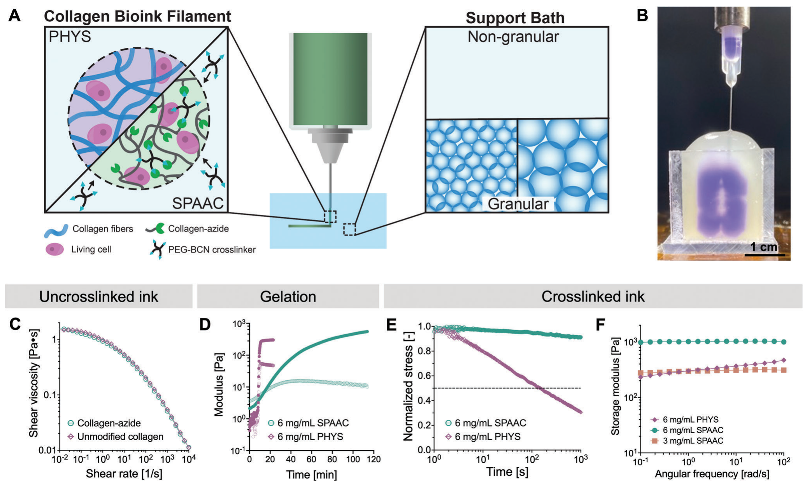

Figure 1. Collagen hydrogels with encapsulated cells are fabricated using embedded 3D bioprinting and crosslinked through physical self-assembly (PHYS) or bioorthogonal covalent chemistry (strain-promoted azide-alkyne cycloaddition, SPAAC). A) Cell-laden collagen inks are extruded into gel-phase support baths with granular or non-granular microstructures. B) A PHYS collagen ink is printed into a support bath of gelatin microparticles. The ink is colored with purple dye for visualization. C) The uncrosslinked ink materials used for extrusion have similar shear-thinning viscosities. D) The inks undergo gelation into hydrogels upon elevating the temperature of unmodified collagen to 37 °C for PHYS collagen or introducing the PEG-BCN crosslinker to the collagen-azide for SPAAC collagen. Filled symbols represent the storage modulus (G’), and open symbols represent the loss modulus (G”). E) PHYS collagen hydrogels demonstrate stress relaxing properties compared to SPAAC collagen. F) Representative frequency sweeps of PHYS and SPAAC collagen hydrogels.

Support baths for embedded 3D bioprinting are commonly composed of non-granular bulk gels or granular microgels (Figure 1A). Early demonstrations of microextrusion-based printing into a bath in the early 2010s utilized single-phase yield-stress materials based on Pluronic F-127, a triblock copolymer with a temperature-dependent phase transition between a physical hydrogel and a fluid. Under ambient conditions, this material formed a shear-thinning, non-granular bulk gel into which an ink could be printed.[26] We therefore chose Pluronic F-127 in this study as an example of a non-granular support bath.

To improve the self-healing nature of the support baths, subsequent studies in the mid-2010s designed granular materials composed of jammed microgels, which can transition from solid-like to fluid-like behavior under applied shear.[27] The seminal demonstrations of granular support baths used microgels made from crosslinked polyacrylic acid, known as Carbopol,[9] or from gelatin[10]. We therefore chose to study Carbopol and gelatin microparticles as representative granular support baths of different sizes: Carbopol is made from hydrating flocculated powders with diameters between 2–7 μm,[28] while gelatin microgels are made from hydrating microparticles with diameters between 15–50 μm[29]. While much previous work has focused on using support baths to improve the macroscopic geometric complexity of soft materials, we demonstrate that the support bath also integrates with the ink during the embedded 3D bioprinting process in controllable ways, resulting in reproducible microscale features.

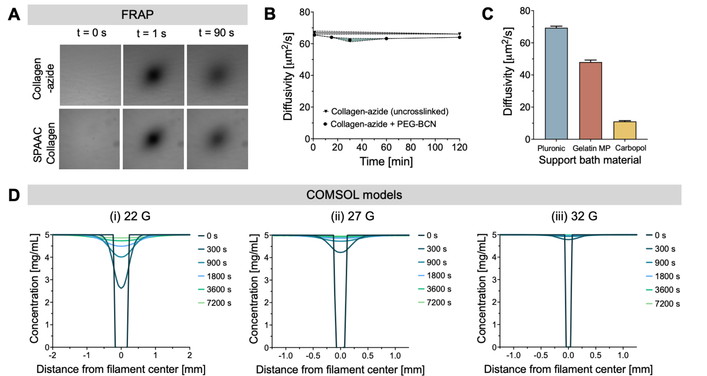

Figure S1. SPAAC crosslinking of the collagen-azide ink within the support bath is enabled by the diffusion of the PEG-BCN crosslinker through the support bath and into the printed ink. (A) Fluorescence recovery after photobleaching (FRAP) measurements of a 20-kDa fluorescent dextran were used to estimate the diffusion properties of the 20-kDa PEG-BCN crosslinker. (B) The diffusivity of the 20-kDa probe was assessed at timepoints over 2 h through either uncrosslinked collagen-azide, or collagen-azide mixed with the PEG-BCN crosslinker at t = 0. Over the course of the SPAAC crosslinking reaction between collagen-azide and PEG-BCN for 2 h, the diffusivity of the 20-kDa probe remained approximately constant (60-70 μm²/s), indicating that its diffusion was not severely hindered as the SPAAC collagen underwent gelation. (C) Diffusivity of the 20-kDa probe through Pluronic, gelatin microparticle, or Carbopol support baths. (D) The concentration profile of PEG-BCN was modeled using Fickian diffusion of the molecule from a support bath of gelatin microparticles (initially loaded with 5 mg/mL PEG-BCN) into the collagen-azide ink (initially containing no crosslinker). The diffusivity values of the 20-kDa probe measured with FRAP were used: ≈ 50 μm²/s for the gelatin microparticle support bath and ≈ 65 μm²/s for the collagen-azide ink. Based on the FRAP data, the models assumed that the diffusivity of the crosslinker through the collagen-azide ink remained approximately constant as the ink crosslinked. Printed filaments were considered from different nozzle gauges: (i) 22 G, (ii) 27 G, and (iii) 32 G.

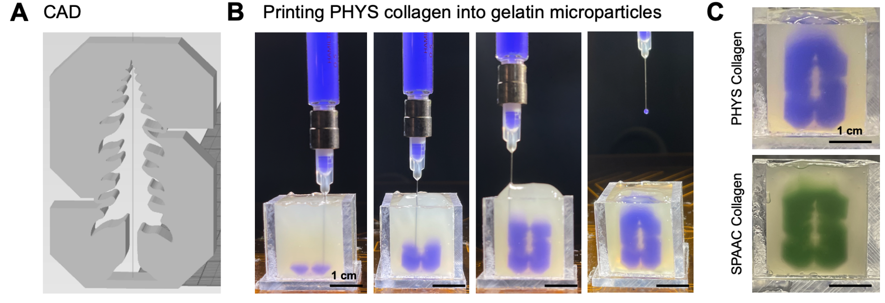

Figure S2. Collagen inks are printed into a 3D geometry within a support bath of gelatin microparticles. (A) CAD model of the print. (B) The PHYS collagen ink (purple) is extruded layer-by-layer. (C) PHYS collagen and SPAAC collagen inks after printing within the support bath, visualized through the addition of purple or green dye to the inks, respectively.

Collagen is a desired ink material for 3D bioprinting, especially with encapsulated cells.[20] Here we use collagen inks with cell-friendly crosslinking mechanisms: (1) physically-assembled (PHYS) collagen and (2) collagen crosslinked with strain-promoted azide-alkyne cycloaddition (SPAAC) (Figure 1A). To print PHYS collagen hydrogels, we first neutralize bovine type I collagen and encapsulate cells within the solution. After the bioink is printed into the support bath, it is heated to 37 °C to crosslink the collagen through formation of a self-assembled, physical network. To print SPAAC collagen hydrogels, we first neutralize bovine type I collagen and modify it with azide groups (collagen-azide). Cells are then encapsulated within the collagen-azide to form the bioink. During printing, the bioink is extruded into a support bath that contains 4-arm polyethylene glycol molecules with bicyclononyne end groups (PEG-BCN). The PEG-BCN crosslinker diffuses into the ink and reacts to induce gelation of the collagen-azide. The diffusivity of the crosslinker through the support baths and ink was determined by fluorescence recovery after photobleaching (FRAP), and the concentration profile of the crosslinker over time was calculated using a COMSOL Multiphysics model (Figure S1, Supporting Information). The PHYS and SPAAC collagen inks can be printed into custom-designed geometries in a support bath (Figure 1B; Figure S2, Supporting Information) for crosslinking and release.

The bioink materials—unmodified collagen solution (6 mg mL−1) for PHYS collagen and collagen-azide solution (6 mg mL−1) for SPAAC collagen—are shear-thinning (Figure 1C) and gel with a G’,G’’-crossover time of less than 20 min (Figure 1D). To induce gelation, either the temperature is raised to 37 °C for PHYS collagen, or the PEG-BCN crosslinker is mixed with the collagen-azide for SPAAC collagen. Due to the different crosslinking mechanisms and resultant hydrogel networks, the crosslinked collagen hydrogels differ in their mechanical properties. The viscoelasticity and stiffness of hydrogels can affect cell-matrix interactions, therefore governing fundamental cell processes.[30,31] As a network of self-assembled fibrils, PHYS collagen is viscoelastic and displays stress-relaxing behavior. On the other hand, SPAAC collagen is a network of covalently crosslinked molecules with primarily elastic behavior (Figure 1E). Furthermore, SPAAC collagen has a higher storage modulus than PHYS collagen of the same protein concentration. The concentration of SPAAC collagen can be lowered by half (3 mg mL−1 collagen-azide instead of 6 mg mL−1 collagen-azide) to reach a similar stiffness as 6 mg mL−1 PHYS collagen over the range of frequencies (0.1−100 rad s−1) measured with small amplitude oscillatory shear (Figure 1F).

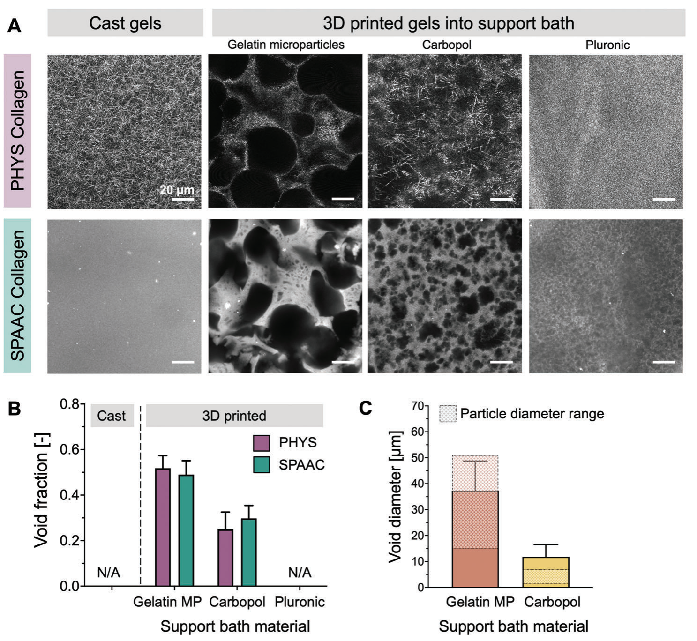

Figure 2. The physical morphology of the support bath affects the microstructure of the printed gel for both PHYS and SPAAC collagen inks. A) Representative images of the gel microstructure for PHYS and SPAAC collagen inks that are either cast into molds or printed into support baths of gelatin microparticles (MP), Carbopol, or Pluronic. B) Fraction of void space measured within the printed gels. Data are the mean ± standard deviation. C) Diameter of voids measured within the printed SPAAC collagen gel. Data are the mean ± standard deviation. The particle diameter ranges shown are reported by the manufacturers.

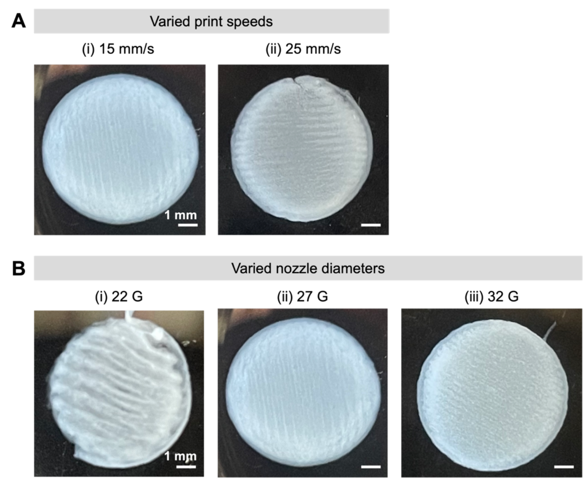

Figure S3. PHYS collagen gels are self-supporting after printing, crosslinking, and release from a gelatin microparticle support bath. The prints shown here had (A) varied print speeds, with a 27 G nozzle or (B) varied nozzle diameters, with a 15 mm/s print speed.

For collagen inks crosslinked with either the PHYS or SPAAC mechanisms, the morphology of the support bath used for the embedded 3D printing process affects the microstructure of the crosslinked gel. During printing, the support bath can become incorporated into the ink, leaving behind voids after ink crosslinking and release of the print (Figure 2). The removal mechanisms of the support baths are dependent on the properties of the material, e.g., undergoing a temperature-dependent phase transition from a hydrogel to a fluid upon heating to 37 °C for gelatin microparticles or cooling to 4 °C for Pluronic. After release from the support bath, the crosslinked prints were self-supporting gels that maintained their structural integrity after thorough washes to remove residual support bath material (Figure S3, Supporting Information). Images of the collagen print microstructures were taken either with confocal reflectance for the fibrous PHYS collagen gels or with fluorescence microscopy for the SPAAC collagen gels labeled with a fluorophore. While gels that were cast and crosslinked within a mold had a homogeneous, non-porous microstructure, gels that were 3D printed into a granular support bath of gelatin microparticles or Carbopol displayed porosity resulting from incorporated microgels. On the other hand, gels that were 3D printed into a non-granular bulk support bath (Pluronic) did not have detectable, distinct voids (Figure 2A,B). The measured diameter of the voids within the gels printed into granular support baths correlated with the size of the microgels that comprised the bath. Larger pores (≈40 μm) resulted from the larger gelatin microparticles (15–50 μm), and smaller pores (≈10 μm) resulted from the smaller Carbopol microparticles (2–7 μm) (Figure 2C). In both cases, the measured pore sizes were larger than the average reported particle size, which may be due to particle aggregation.

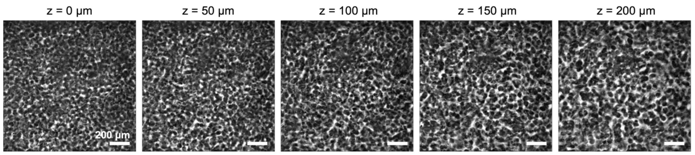

Figure S4. Representative images of the microstructure of fluorescently-labeled SPAAC collagen gels printed with a 27 G nozzle (inner diameter = 210 μm) into a gelatin microparticle support bath. After crosslinking and release of the print from the support bath, images were collected throughout the thickness of a filament, where z = 0 indicates the edge of the print, and increasing z indicates the depth into the print.

Previous studies have noted that microgel support baths cause surface roughness along the edges of a printed filament.[10,19,32] Interestingly, we observed that this effect was not limited solely to the interface between the ink and the microgel support bath but rather persisted through the entire thickness of an extruded filament within the print. In SPAAC collagen gels printed into a gelatin microparticle support bath with a 27 G nozzle (inner diameter = 210 μm), the entire depth of a filament from the edge of the print had a homogeneous distribution of voids (Figure S4, Supporting Information). This phenomenon is consistent with previous qualitative observations of a porous microstructure and increased cell infiltration through hydrogels fabricated with embedded 3D printing into a gelatin microparticle support bath.[19] Therefore, mixing between the ink and the microgel support bath appears prevalent not only at the print edges but also throughout the printed filaments under these conditions. Given the omnipresence of voids in the filaments after printing into microgel support baths, there may exist an upper limit for the percolation and fraction of void space upon which the structural integrity of the print decreases after removal from the support bath. However, the structural integrity of all prints in this work was not detectably affected by the presence of voids.

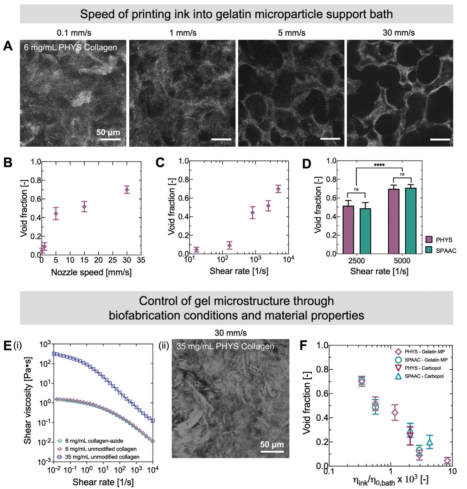

Figure 3. The printing conditions during embedded 3D printing into microgel support baths affect the microstructure of printed PHYS and SPAAC collagen inks. A) Representative confocal reflectance images of the microstructure of PHYS collagen gels printed into a gelatin microparticle support bath with nozzle speeds ranging between 0.1−30 mm s−1. B) Fraction of void space measured within the printed inks as a function of the nozzle speed. Data are the mean ± standard deviation. C) Fraction of void space measured within the printed inks as a function of the shear rate resulting from the various nozzle speeds. Data are the mean ± standard deviation. D) For 6 mg mL−1 PHYS or SPAAC collagen, the void fractions in the printed inks are similar to each other for a given shear rate (ns = not significant) but different between shear rates (****p<0.0001). E) (i) Representative flow curves of inks used for extrusion: 6 mg mL−1 collagen-azide (for SPAAC collagen) and 6 mg mL−1 or 35 mg mL−1 unmodified collagen (for PHYS collagen). Across all shear rates, the viscosity of 35 mg mL−1 unmodified collagen is greater than that of the 6 mg mL−1 unmodified collagen or 6 mg mL−1 collagen-azide. (ii) Representative confocal reflectance image of 35 mg mL−1 PHYS collagen after printing at 30 mm s−1 into a gelatin microparticle support bath. Distinct voids are not observed even for the higher nozzle speed (30 mm s−1) and corresponding shear rate (5 000 s−1). F) The void fraction for PHYS and SPAAC collagen inks printed into microgel support baths composed of gelatin microparticles or Carbopol is affected by the ratio of the ink viscosity to the support bath zero-shear viscosity. Data are the mean ± standard deviation.

Having demonstrated that differences in gel microstructure result from embedded 3D printing into different support baths, we aimed to control the porosity through the material properties and fabrication parameters (Figure 3). In all cases, for printing with a custom syringe-based extruder, we maintained a constant amount of extruded ink per distance of printed filament, E/Δx, where E corresponds to the plunger displacement. Using a greater print speed (gantry velocity at which the nozzle translates through the support bath, F) thus increases the flow rate (Equation 1, Q̇). The wall shear rate (Equation 2, 𝛾̇w) of the ink through the nozzle therefore also increases, as the ink is extruded faster to keep the amount of ink deposited per mm of filament constant.[33]

$$\dot{Q} = A \times \frac{E}{\Delta x / F}$$ (1)

$$\dot{\gamma}_w = \frac{\dot{Q}}{\pi R^3}\left[3 + \frac{1}{n}\right]$$ (2)

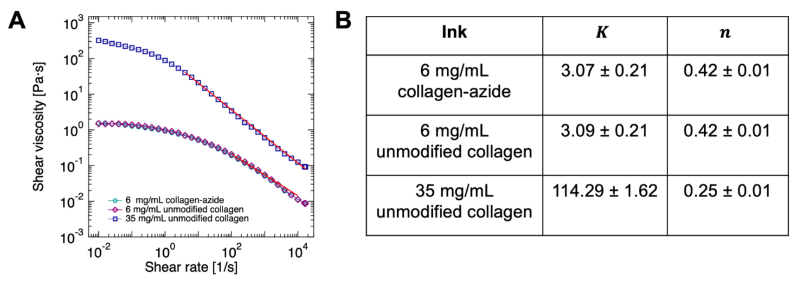

Figure S5. (A) The power-law model (\(\eta = K\dot{\gamma}^{n-1}\), where 𝜂 is viscosity, 𝐾 is the power-law constant or consistency index, 𝛾̇ is the shear rate, and 𝑛 is the power-law index) is fitted to the shear-thinning portion of the flow curves for the ink materials, as indicated by the red lines. (B) Fitted parameters obtained from the power-law model.

where A corresponds to the cross-sectional area of the syringe, R to the nozzle radius, and n is calculated from a power-law fit (𝜂 = K𝛾̇ⁿ⁻¹) of the viscosity curves (Figure S5, Supporting Information).

Due to its effect on shear rate, we observed that simply changing the speed of printing can therefore affect the porosity of the gel, as demonstrated with 6 mg mL−1 PHYS collagen in a support bath of gelatin microparticles (Figure 3A). Higher nozzle speeds during printing (corresponding to increased shear rate of the ink through the nozzle) caused the void fraction of the print to increase, indicating the incorporation of more gelatin microgels into the extruded ink filament (Figure 3B,C). For a given shear rate of the ink (2 500 s−1, corresponding to a print speed of 15 mm s−1, or 5 000 s−1, corresponding to a print speed of 30 mm s−1), the resultant void fraction was similar across ink materials for either PHYS or SPAAC collagen gels (6 mg mL−1 ink) (Figure 3D).

To explain why the shear rate of the ink through the nozzle affects porosity and has a similar result across both 6 mg mL−1 PHYS and SPAAC collagen, we considered the relationship between the shear rate and viscosity of the ink. We reasoned that at higher shear rates, the viscosity of the inks decreases, allowing for greater incorporation of the microgel support bath into the extruded ink. For a concentration of 6 mg mL−1, unmodified collagen (the ink for PHYS collagen) and collagen-azide (the ink for SPAAC collagen) have the same relationship between shear rate and shear viscosity (Figure 3E,i), explaining their similar responses to different print speeds. To explore this idea further, we printed a higher concentration (35 mg mL−1) of unmodified collagen ink that is more viscous for all examined shear rates. For this higher viscosity ink, we observed no voids formed from encapsulated microgels even for a high nozzle speed (30 mm s−1, corresponding to a shear rate of 5 000 s−1) (Figure 3Eii). Therefore, the viscosity of an ink—modulated either by changing the shear rate during extrusion or the protein concentration—can be used to control porosity during embedded 3D printing into a granular support bath.

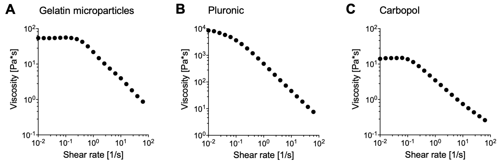

Figure S6. Representative flow curves for support baths comprised of (A) gelatin microparticles, (B) Pluronic, and (C) Carbopol.

We further reasoned that the viscosity of the granular support bath would also influence the extent of its incorporation into the ink. We hypothesized that since microgels are not as easily displaced in baths of higher viscosities, the microgels would be more readily incorporated into the ink to create void space in the final printed structure. To test this idea, we demonstrate that a dominating factor affecting void fraction is indeed the ratio between the shear viscosity of ink and the zero-shear viscosity of the support bath (Figure 3F). For a given ink, as the zero-shear viscosity of the support bath is increased, the void fraction also increases. The zero-shear viscosities for gelatin microparticles and Carbopol were measured to be 55 Pa s and 15 Pa s, respectively (Figure S6, Supporting Information). The differing support bath viscosities may contribute to the differences in overall void fraction observed between the granular support baths in Figure 2B, in which greater void fractions were observed for inks printed in gelatin microparticles than Carbopol. With this understanding, the void fraction of the resultant print can be systematically controlled by either modulating the composition of the ink, composition of the support bath, or simply through the printing conditions such as the print speed.

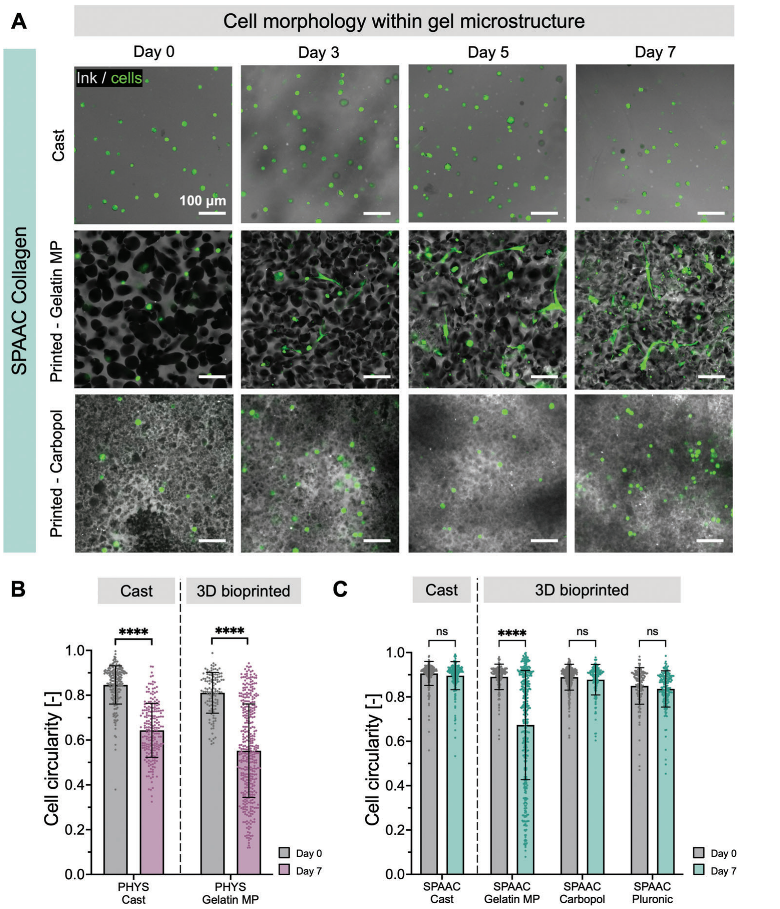

Figure 4. The extent of corneal MSC spreading within printed SPAAC collagen is related to the gel microstructure and void spaces caused by the support bath. A) Representative fluorescence images of the ink (gray) and cell morphology (green) for corneal MSC-laden SPAAC collagen gels. B) Corneal MSC circularity on Day 0 and Day 7 within PHYS collagen gels that were either cast or bioprinted into gelatin microparticles (MP). Circularity was calculated as 4𝜋*Area/Perimeter², with a perfect circle having a circularity of 1. Data are the mean ± standard deviation, ****p<0.0001. C) Corneal MSC circularity on Day 0 and Day 7 within SPAAC collagen gels that were either cast or bioprinted into gelatin microparticles (MP), Carbopol, or Pluronic. Data are the mean ± standard deviation, ns = not significant, ****p<0.0001.

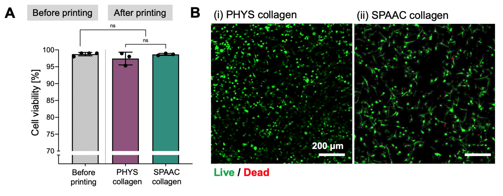

Figure S7. (A) Corneal MSCs are highly viable before and after the 3D bioprinting process within both PHYS and SPAAC collagen inks. Viability was assessed within 5 h before printing and within 5 h after printing. Data are the mean ± standard deviation, ns = not significant. (B) Representative images from a Live/Dead cytotoxicity assay of corneal MSCs within 5 h after printing in (i) PHYS and (ii) SPAAC collagen.

The morphology of cells and their ability to spread is an important consideration for tissue engineering.[34] We hypothesized that the spreading of encapsulated living cells within hydrogels could be modulated by changing the microstructure of the gel through the biofabrication process (Figure 4A). As a demonstration of cell-laden collagen inks, we chose MSCs that can be readily harvested and expanded from human donor corneas as the cell type.[35] Since collagen is the primary extracellular component of the human cornea, corneal MSC-laden collagen bioinks may be well-suited for applications in corneal tissue engineering.[36,37] The behavior of corneal MSCs within these materials has relevance toward the development of 3D bioprinted, engineered corneal tissue, which has the potential to address the worldwide shortage of donor corneas necessary for allograft transplantation to treat corneal blindness.[38] For both the PHYS and SPAAC collagen inks, encapsulated corneal MSCs remained highly viable during the bioprinting process, with greater than 95% cell viability (Figure S7, Supporting Information). When encapsulated in SPAAC collagen gels cast into molds, the corneal MSCs did not spread over 7 days. When 3D bioprinted into granular support baths, the corneal MSCs spread within SPAAC collagen hydrogels printed into a gelatin microparticle bath (which we have demonstrated creates larger pores in Figure 2C) and did not spread when printed into Carbopol (which creates smaller pores). Thus, while corneal MSCs can spread in PHYS collagen that is either printed or cast (Figure 4B), the cell morphology and circularity in SPAAC collagen are dependent on the microstructure of the gel (Figure 4C). The cell spreading observed in PHYS collagen in all cases, even when cast, is likely due to the stress relaxing nature and fibrous microstructure of self-assembled collagen,[39] which is not present in SPAAC collagen[40].

Within the same SPAAC collagen material, we demonstrated that the behavior of encapsulated corneal MSCs differs depending on whether the bioink was cast or printed into a support bath, and whether it was printed into a support bath with large or small microgels, affecting the void space available for the cells to spread effectively. This indicates that when designing inks to achieve a specific cell response, an important consideration is the microscale structure of the final printed construct, which is a result of both (1) the properties of the bulk hydrogel formed from the crosslinked ink and (2) the porous microstructure created from incorporation of the sacrificial support bath material into the print.

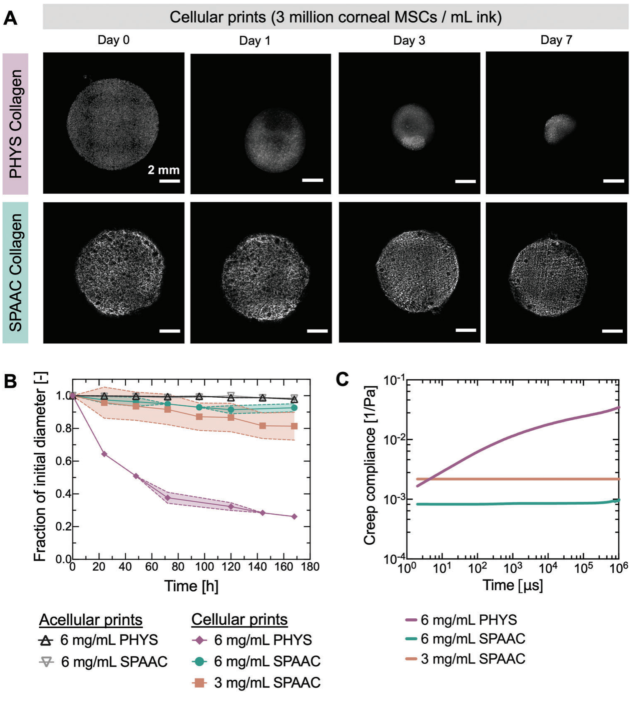

Figure 5. Stability of cell-laden PHYS and SPAAC collagen gels against cell-induced contraction. Bioinks were printed into 8-mm circular disks within a gelatin microparticle support bath, crosslinked, released from the support bath, and incubated in cell culture medium. A) Representative fluorescence images of print shapes over time. Prints fabricated from 6 mg mL−1 PHYS collagen bioinks with 3 million corneal MSCs mL−1 experienced severe contraction over 7 days in culture, while 6 mg mL−1 SPAAC collagen bioinks with 3 million corneal MSCs mL−1 demonstrated better shape fidelity. B) Rate of collagen gel contraction for cellular and acellular collagen prints crosslinked with PHYS or SPAAC mechanisms. Shaded regions represent the standard deviation from the mean. C) Representative creep compliance of collagen gels measured with dynamic light scattering microrheology (DLSμR).

Cells encapsulated within hydrogels can exert forces on their surrounding matrix, inducing changes in the shape of the overall hydrogel.[41,42] A common challenge of using conventional, PHYS collagen hydrogels in tissue engineering is the severe contraction of the material from encapsulated contractile cells.[43–45] We observed that the crosslinking mechanism of the collagen ink material affected the extent of cell-induced contraction of the bulk print (Figure 5). The corneal MSC spreading was similar in either PHYS collagen or SPAAC collagen when large pores (≈40 μm) were introduced into the print through embedded printing into a gelatin microparticle support bath (Figure 4B,C). However, due to the differences in the polymer network of the PHYS or SPAAC collagen, we hypothesized that the contractile cells would affect the overall macroscopic structure of these prints differently. In all cases, the embedded 3D bioprinting process was carried out in a gelatin microparticle support bath, and circular disks with an 8-mm diameter were printed. The corneal MSCs (with a cell density of 3 million cells mL−1 in the ink) contracted prints of 6 mg mL−1 PHYS collagen to ≈25% of their initial diameter over 7 days, whereas prints of 6 mg mL−1 SPAAC collagen with the same cell density over the same period of time remained at >90% of their initial diameter (Figure 5A). This contraction was caused by cell-generated forces, since acellular prints did not detectably contract. For 3 mg mL−1 SPAAC collagen—a “stiffness-matched” control with a similar storage modulus as 6 mg mL−1 PHYS collagen over most frequencies between 0.1−100 rad s−1 (Figure 1F)—contraction was still not as severe, as prints were still >80% of their initial diameter after 7 days (Figure 5B).

We attribute the differences in cell-induced contraction observed between the PHYS and SPAAC collagen prints to the matrix viscoelasticity resulting from the different nature of the crosslinks. This is already visible from the frequency-domain representation of Figure 1F in which the storage modulus of the PHYS collagen decreases with decreasing angular frequency, as the physical crosslinks relax. In contrast, the chemically crosslinked SPAAC collagen does not show a frequency dependence for the range examined (0.1–100 rad s−1). In order to further investigate the viscoelastic properties resulting from the PHYS and SPAAC collagen crosslinking techniques, we measured the creep compliance (J(t)) through dynamic light scattering microrheology (DLSμR).[46,47] Compared to bulk oscillatory shear measurements, DLSμR enabled the examination of the collagen hydrogels at lower forces (by following the Brownian motion of tracer particles) and for longer times (i.e., lower frequencies) at 37 °C without the risk of sample evaporation. As dynamic cell-matrix interactions span a wide range of time scales, DLSμR allows us to capture material properties that may provide insight to the observed differences between the PHYS and SPAAC collagen responses to forces from single cells.[48] For a lower timescale (i.e., higher frequency) in the time-domain representation of J(t), the creep compliance between the 3 mg mL−1 SPAAC collagen and 6 mg mL−1 PHYS collagen was identical, whereas with increasing time (i.e., lower frequencies), they deviated. The compliance of the PHYS collagen increased (i.e., decreasing stiffness), while the compliance of SPAAC collagen was constant (Figure 5C). Therefore, the more compliant PHYS collagen versus SPAAC collagen may allow cells to contract their surrounding matrix to a greater extent.

While cell-mediated contraction of biomaterials may be desired for some applications,[49–51] for bioprinted constructs, prints are generally intended to hold their geometric shape[52]. Here, we have now demonstrated a collagen printing and crosslinking approach that allows for spreading of encapsulated cells (through incorporation of the microgel support bath into the print to create voids) and stability against cell-induced contraction (through the type of crosslinking network, using covalent crosslinks with bioorthogonal chemistry).

## 3. Conclusion

The technique of embedded 3D bioprinting has gained immense popularity in the biofabrication field due to the ability to controllably pattern soft biomaterials into complex macroscopic structures. We report that the embedded 3D bioprinting process also offers the opportunity to control the microscopic structure within printed inks by leveraging interactions between the ink and the support bath.

In this study, we demonstrate that structural features within sacrificial granular support baths (i.e., microgels) can become incorporated into the printed ink to create porous void spaces that emerge after removing the support bath. The porosity is governed by the ratio between the shear viscosity of the ink and the zero-shear viscosity of the microgel support bath. Adjusting the flow rate modulates the viscosity of the shear-thinning ink, thus controlling the extent of porosity independent of the ink composition. Furthermore, the size of the voids is dictated by the size of the microgels or aggregates that comprise the granular support bath. Corneal MSCs printed within SPAAC collagen adopt different morphologies depending on the print microstructure that results from the support bath material chosen. The cells do not spread in prints fabricated in Pluronic support baths (non-granular, no pores) or in Carbopol support baths (granular, ≈10 μm pores) but do spread in prints fabricated in gelatin microparticle support baths (granular, ≈40 μm pores). Therefore, the microarchitectural properties of the print can be tuned to control cell phenotype.

In addition to approaches demonstrated in this work experimentally to control the relative viscosities of the ink and support bath material, we expect other printing parameters and material properties could be tuned in the future to achieve similar control over the overall extent of mixing between the ink and microgel support bath.

As one example, increasing the radius of the nozzle (R) used during printing while keeping all other material properties and printing parameters constant will decrease the wall shear rate experienced by the ink (Equation 2).[33] Therefore, we expect the average shear viscosity of these shear-thinning inks to be higher, leading to less mixing overall with the microgels and a lower print porosity. We observed for prints with 27 G nozzles (inner diameter = 210 μm) that the extent of gelatin microparticle mixing with the ink did not detectably vary throughout the thickness of a filament (Figure S4, Supporting Information). However, since pressure-driven flows within straight, cylindrical nozzles are nonhomogeneous,[33,53,54] a spatial dependence of mixing between the ink and microgels may become apparent with increasing the radius of the nozzle. This could possibly lead to lower mixing and less porosity in the center of the large filament (which experiences lower shear rates, and therefore a higher ink viscosity)[53] than at the edges.

As another example, to change the zero-shear viscosity of a granular support bath while keeping the microgel size and constituent material constant, the degree of packing of the microgels could be altered. Microgels are commonly jammed together through the processes of gravitational settling,[55,56] centrifugation,[19,57,58] vacuum-driven filtration,[59–61] or resuspension of dried microgel particles[62–64]. By adjusting the microgel jamming method and parameters (e.g., speed of centrifugation), the degree of microgel packing and therefore the rheological properties of the material are changed.[65] Increasing the degree of microgel packing (e.g., by increasing the speed of centrifugation) increases the storage modulus, yield stress, and zero-shear viscosity of the granular material.[19,65] Therefore, we expect that for a granular support bath with a higher degree of microgel packing and higher viscosity, the microgels are less easily displaced by the printed ink, leading to more mixing with the ink and a higher print porosity. This effect may be further exacerbated by the fact that the density of microgels available for incorporation into the printed ink increases with the degree of packing. As a caveat, however, the rheological properties of the granular support bath may not only affect mixing between the microgels and the ink but also the suitability of the granular material as a support bath for embedded 3D bioprinting.[1] A granular support bath with too high of a microgel packing degree may be too solid-like, resulting in an air crevice behind the path of the nozzle into which the ink can flow upward.[66] On the other hand, a granular support bath with too low of a microgel packing degree may be too liquid-like, causing the ink to undergo droplet breakup and move due to buoyancy forces.[67] Therefore, the support bath material must retain suitable rheological properties as a shear-thinning, self-healing, yield-stress fluid to allow for sufficient print fidelity.[68] These ideas could be complemented by experimental and computational fluid dynamics studies to also examine dynamic flows or pressure gradients generated within the support bath during the printing process,[9,17,68,69] which would likely also influence the mixing between the ink and support bath.

Future work could also explore the use of other structure features within the support bath, such as rod-shaped microgels or fibers that become incorporated within the ink. In general, heterogeneity of the microstructure of the print could be achieved through the simple approach of programming different flow rates for different regions of the print, thus affecting the extent of the support bath incorporation into the ink for different filaments within a single print; this would not require changing the composition of either the ink or the support bath. Additionally, the effect of the induced microstructure and void space on the integration of the engineered tissue with surrounding host tissue after implantation could be investigated to better inform the design of 3D bioprinted constructs.

Altogether, by understanding and tuning interactions between bioinks and support baths during embedded 3D bioprinting, this work represents an important advance toward control over the microstructure within bioprints to better guide cell behavior, enhancing the translational and therapeutic potential of 3D bioprinted constructs.

## 4. Experimental Section

**Synthesis of Ink Materials—Collagen-Azide:** Type I bovine atelocollagen solution (10 mg mL−1, Advanced BioMatrix) was modified with azide functional groups using N-hydroxysuccinimide (NHS) ester chemistry to react with primary amines on collagen.[37] First, the acidic collagen solution was neutralized on ice following instructions from the manufacturer, using 1.0 M sodium hydroxide solution (NaOH, Sigma), ultrapure deionized water (Millipore), and 10X phosphate buffered saline (PBS, Millipore) to reach a pH of 7.5 and a concentration of 8 mg mL−1 collagen. Azido-PEG4-NHS ester (BroadPharm) was dissolved in dimethyl sulfoxide (DMSO, Fisher) at a concentration of 100 mg mL−1 and added to the neutralized collagen solution at 2 molar equivalents relative to primary amines on the collagen. The solution was mixed well, rotated for 2 h at 4 °C, and then dialyzed overnight in a Slide-A-Lyzer dialysis kit (3.5-kDa MWCO, ThermoScientific) against 1X PBS at 4 °C. For fluorescently-labeled collagen-azide, 100 μg AlexaFluor647 NHS ester (ThermoFisher Scientific) was dissolved in 10 μL DMSO and added to 500 μL collagen-azide. The solution was covered with foil to protect from the light, mixed well, and rotated for 24 h at 4 °C. To remove unreacted dye, the solution was dialyzed in a Slide-A-Lyzer dialysis kit (7-kDa MWCO, ThermoScientific) for 3 days against 1X PBS at 4 °C. After dialysis, the fluorescently-labeled collagen-azide was mixed with non-fluorescent collagen-azide at a 1:20 ratio for use as a fluorescent collagen-azide ink for studies examining the gel microstructure. Collagen-azide was stored at 4 °C and used within 1 week of the bioconjugation reaction. The 8 mg mL−1 collagen-azide was diluted with cold PBS to 6 mg mL−1 collagen-azide immediately before use.

**Synthesis of Ink Materials—Unmodified Collagen:** To prepare 6 mg mL−1 unmodified collagen, type I bovine atelocollagen solution (10 mg mL−1, Advanced BioMatrix) was neutralized on ice immediately before use following instructions from the manufacturer. Briefly, 1.0 M NaOH (Sigma), ultrapure deionized water (Millipore), and 10X PBS (Millipore) were added to reach a pH of 7.5 and a concentration of 8 mg mL−1 collagen. The solution was then diluted with cold PBS to a concentration of 6 mg mL−1 collagen. To prepare 35 mg mL−1 unmodified collagen, we used the pH neutral, isotonic Lifeink 200 (Advanced Biomatrix), which is also bovine type I collagen.

**Synthesis of PEG-BCN Crosslinker:** The PEG-BCN crosslinker was synthesized as previously described.[32] In brief, PEG-amine (4 arm, 20-kDa, Creative PEGworks) was dissolved at 10 mg mL−1 in anhydrous DMSO. Then, (1R, 8S, 9S)-bicyclo[6.1.0]-non-4-yn-9ylmethyl N-succinimidyl carbonate (BCN-NHS, 1 molar equivalent relative to amines, Sigma) and triethylamine (1.5 molar equivalent relative to amines, Fisher) were added dropwise. The reaction was purged with nitrogen gas and proceeded overnight at room temperature with constant stirring. The solution was then dialyzed against ultrapure deionized water for 3 days, sterile filtered through a 0.22 μm filter, lyophilized, and stored at −80 °C before use.

**Rheometry:** Oscillatory shear measurements were conducted on an ARG2 rheometer (TA Instruments) equipped with a Peltier plate and a solvent trap to prevent evaporation. A cone-plate geometry with an angle of 1 ° and a diameter of 20 mm or a plate-plate geometry with a diameter of 40 mm were used. The data obtained from the two geometries were in excellent agreement with each other. Time-sweep measurements to follow the gelation of the different collagen inks were carried out at an angular frequency of 1 rad s−1 and a shear strain amplitude of 1%. Frequency-sweep measurements (between 10−1 and 102 rad s−1) were conducted at a shear strain amplitude of 1%.

Rotational measurements were conducted on an ARESG2 rheometer (TA Instruments) with a 25-mm serrated plate-plate geometry at 23 °C for shear rates between 10−2 and 104 s−1. The absence of wall-slip was verified by performing measurements at different operating gaps. For stress-relaxation measurements, an initial shear strain amplitude of 10% was used.

For microrheological examination, the mean-square displacement (MSD) was obtained from dynamic light scattering (DLS) measurements at 37 °C using PEG-coated, carboxylated latex microspheres (2 μm diameter, Polysciences) as tracer particles, following protocols previously established.[47] DLS experiments was performed using a Zetasizer Nano ZS (633 nm laser, Malvern) operated in 173° non-invasive backscatter detection mode. The gels with embedded tracer particles were formed in disposable 40 μL cuvettes (Malvern) for all measurements. The relationship between the MSD (〈Δr²〉) of a tracer particle in a viscoelastic medium and the shear creep compliance of the gel (J(t)), is given through \(\langle \Delta r^2 \rangle = \frac{k_B T}{\pi a}J(t)\), where k_B is the Boltzmann constant, T is the absolute temperature, and a is the tracer particle radius. In all cases, representative curves were shown based on at least n = 3 measurements.

**Ink and Support Bath Preparation:** The inks were loaded into a 2.5-mL gas-tight syringe (Hamilton) fitted with a straight, 27 G blunt-tip nozzle (Jenson Global) for printing, unless indicated otherwise. To prepare Pluronic support baths,[32] Pluronic F-127 powder (Sigma) was dissolved at 260 mg mL−1 in cold, sterile PBS and rotated overnight at 4 °C to thoroughly mix. To prepare Carbopol support baths,[70] Carbopol ETD2020 powder (Lubrizol) was dissolved by rotating overnight at room temperature at 7 mg mL−1 in 100 mL of sterile, ultrapure deionized water (Millipore) with 0.8 mL of 10 M NaOH (Sigma) to balance the pH to 7. The solution was degassed before use. To prepare gelatin microparticle support baths, LifeSupport (Advanced Biomatrix) was purchased and used following the manufacturer’s instructions. Briefly, the lyophilized LifeSupport was hydrated at 50 mg mL−1 in cold, sterile 1X PBS and centrifuged (5 min, 2 000 g). The supernatant was removed, and the jammed microgel slurry was used as the support bath. For the preparation of all support baths in which collagen-azide was to be printed and crosslinked with SPAAC chemistry, the PEG-BCN crosslinker was dissolved at 5 mg mL−1 in the solution used to hydrate the support bath polymer. Before printing, the support baths were added to custom-made polycarbonate containers and degassed to remove bubbles if necessary.

**Embedded 3D Printing:** Printing was carried out on a custom-built dual-extruder bioprinter modified from an M2 Rev E plastic 3D printer (MakerGear) as previously described.[32] Briefly, the thermoplastic extruder of the printer was removed and replaced with a mount designed to hold two Replistruder 4 syringe pumps. Additionally, the control board was replaced with a Duet 2 WiFi board with RepRapFirmware.[71] 3D CAD models were sliced using Simplify3D to obtain the G-codes. Both acellular and cellular printing was performed using 27 G nozzles with an extrusion width of 0.21 mm, layer height of 0.084 mm, and print speed of 15 mm s−1 unless indicated otherwise in the manuscript. Prints were either the Stanford logo (12.6 mm wide, 19 mm tall, and 5 mm thick; Figure 1) or disks (8 mm diameter, 1 mm thick; Figures 2–5). For the demonstrative prints of the Stanford logo, fluorescent microparticles were added to dye the inks for visualization. For 3D bioprinting with cells, the printing process was carried out in a sterile tissue culture cabinet. Lifeink (35 mg mL−1 unmodified collagen) was printed at 4 °C as suggested by the manufacturer to prevent gelation during printing, which was especially crucial when printing at low speeds. The 6 mg mL−1 unmodified collagen and 6 mg mL−1 collagen-azide inks were printed at room temperature. PHYS collagen was crosslinked within the support bath for 45 min at 37 °C. SPAAC collagen was crosslinked within the support bath for 2 h at room temperature. The prints were removed from the support bath after crosslinking was complete. For Pluronic or gelatin microparticle support baths, the support baths were incubated at 4 °C or 37 °C, respectively, to liquify the support bath. For Carbopol support baths, the support bath was removed through vigorous washing. In all cases, the prints were washed thoroughly with PBS after release from the support baths, before further culture or characterization.

**Cell Culture:** Corneal MSCs were isolated from human donor corneas (Lions Eye Institute for Transplant and Research) according to established protocols.[35,72] Cells were expanded in growth medium consisting of 500 mL MEM-Alpha (Corning), 50 mL fetal bovine serum (Gibco), 5 mL GlutaMax (Gibco), 5 mL non-essential amino acids (Gibco), and 5 mL Antibiotic-Antimycotic (Gibco). Growth medium was changed every other day, and corneal MSCs were passaged upon reaching 80% confluency. The corneal MSCs were used for experiments between passages 5–10. For 3D bioprinting, the corneal MSCs were trypsinized, counted, pelleted, and re-suspended in either 6 mg mL−1 collagen-azide (for SPAAC collagen) or 6 mg mL−1 unmodified collagen (for PHYS collagen) at a density of 3 × 106 cells mL−1 for use as the bioink. For encapsulation within control cast gels, the corneal MSCs were re-suspended at the same cell density in either 6 mg mL−1 collagen-azide and 5 mg mL−1 PEG-BCN (for SPAAC collagen) or 6 mg mL−1 unmodified collagen (for PHYS collagen). The solutions were then pipetted into silicone molds (4 mm diameter, 0.5 mm thickness, 10 μL material) and allowed to crosslink for 1 h at 37 °C. Both the cast gels and printed gels were submerged in growth medium after crosslinking. The medium was changed every other day during the duration of the culture period (7 days).

**Microscopy and Image Analysis:** All imaging was performed using either a STELLARIS 5 confocal microscope (Leica) with a 10X air objective, 20X oil immersion objective, or 40X oil immersion objective (for cell viability, cell circularity, and gel microstructure imaging) or a THUNDER imager (Leica) with a 2.5X air objective (for gel contraction imaging). Both cast gels and printed gels were placed within glass-bottom dishes (Thermo Scientific) for imaging. At least five images were taken in different areas of each sample, and image analysis was performed using FIJI (ImageJ2, Version 2.3.0/1.53f).

To assess the viability of the corneal MSCs after printing, Live/Dead staining was conducted within 5 h of printing using calcein AM and ethidium homodimer-1 (Life Technologies), following the manufacturer’s instructions. Cell viability was calculated as the number of live cells divided by the total number of cells. To visualize cell morphology over time, cells were labeled with CellTracker Green CMFDA (Thermo Fisher Scientific) prior to encapsulation, following the manufacturer’s instructions. The 2D projected area and perimeter of each cell were calculated by thresholding the images and removing objects with areas less than 10 μm². Cell circularity was calculated as 4𝜋*Area/Perimeter², with a perfect circle (i.e., a fully rounded cell) having a circularity of 1. To examine the microstructure of cast or printed gels, PHYS collagen gels were imaged using confocal reflectance, while SPAAC collagen gels were imaged using fluorescence microscopy. The diameters of the void spaces were measured with FIJI. To track the contraction of acellular and cellular prints over 7 days in culture, tile-scan images of the entire prints were taken, and the diameters of the prints were measured with FIJI.[73]

**Fluorescence Recovery After Photobleaching (FRAP) Measurements:** Ink and support bath materials were prepared with 1 mg mL−1 of a 20-kDa FITC-dextran probe (Sigma). 30 μL of material were loaded into a clear-bottom, half-area 96-well plate (Greiner Bio-One) and centrifuged to remove bubbles. FRAP experiments were performed using a STELLARIS 5 confocal microscope (Leica) with 60 s of photobleaching (110 μm x 110 μm area, 488 nm laser, 100% intensity) followed by 90 s of acquisition time. Diffusion coefficients were calculated using the “frap_analysis” MATLAB program.[74]

**Computational Modeling:** The diffusion of the PEG-BCN crosslinker into printed ink filaments over time was simulated using COMSOL Multiphysics (Version 5.6). A 3D finite element model was created using a time-dependent study in the “Transport of Diluted Species” module. The filament diameter was set to be equal to the outlet diameter of the print nozzle. To simulate crosslinker diffusion, the diffusivities obtained from FRAP measurements were used. For the gelatin microparticle support bath, D ≈ 50 μm² s−1. For the collagen-azide ink, D ≈ 65 μm² s−1. Both diffusivities were assumed to be constant over time. A tetrahedral physics-controlled mesh with the predefined “Extra Fine” element size was used. Concentration profiles as a function of distance from the ink filament were calculated for diffusion times of 0 to 2 h.

**Statistical Analysis:** Statistical analyses were performed using GraphPad Prism (Version 9.5). For comparisons of void fraction between SPAAC and PHYS collagen for different shear rates, statistical significance was assessed using a two-way analysis of variance (ANOVA) with a Tukey post-hoc test. For comparisons of cell viability, statistical significance was assessed using an ordinary one-way ANOVA with a Tukey post-hoc test. For comparisons of cell circularity, statistical significance was assessed using two-tailed Mann-Whitney tests. In all cases, n ≥ 3 for each condition, and p < 0.05 was considered as statistically significant. Data were presented as mean ± standard deviation unless specified otherwise.

## Supporting Information

Supporting Information is available from the Wiley Online Library or from the author.

## Acknowledgements

The authors acknowledge P. Cai for DLSμR training and helpful discussions. The authors acknowledge funding support from the National Science Foundation including DGE-165618 (L.G.B.) and DMR-2103812 (S.C.H.); the National Institutes of Health including F31-EY034785 (L.G.B), F31-EY030731 (S.M.H.), P30-EY026877 (D.M.), and R01-EY033363 (D.M.); the Swiss National Science Foundation including P500PN210723 (F.C.); the Stanford Knight-Hennessy Scholars Program (B.C.); the Stanford Bio-X Interdisciplinary Graduate Fellowship (S.M.H.), and a departmental core grant from Research to Prevent Blindness (D.M.). Part of this work was performed at the Stanford Nano Shared Facilities, supported by the NSF under award ECCS-2026822.

## Conflict of Interest

S.M.H. and S.C.H. are named inventors on United States Patent and Trademark Office application no. 17/637181 filed on 2/22/2022 by Stanford University.

## Data Availability Statement

The data that support the findings of this study are available from the corresponding author upon reasonable request.

## Keywords

embedded bioprinting, hydrogel microstructure, support baths, collagen inks

Received: September 29, 2023 Revised: December 14, 2023 Published online: February 26, 2024

[1] L. G. Brunel, S. M. Hull, S. C. Heilshorn, Biofabrication 2022, 14, 032001.

[2] D. J. Shiwarski, A. R. Hudson, J. W. Tashman, A. W. Feinberg, APL Bioeng. 2021, 5, 010904.

[3] A. Mccormack, C. B. Highley, N. R. Leslie, F. P. W. Melchels, Trends Biotechnol. 2020, 38, 584.

[4] C. B. Highley, C. B. Rodell, J. A. Burdick, Adv. Mater. 2015, 27, 5075.

[5] L. Shi, H. Carstensen, K. Hölzl, M. Lunzer, H. Li, J. Hilborn, A. Ovsianikov, D. A. Ossipov, Chem. Mater. 2017, 29, 5816.

[6] K. H. Song, C. B. Highley, A. Rouff, J. A. Burdick, Adv. Funct. Mater. 2018, 28, 1801331.

[7] S. M. Bakht, M. Gomez-Florit, T. Lamers, R. L. Reis, R. M. A. Domingues, M. E. Gomes, Adv. Funct. Mater. 2021, 31, 2104245.

[8] Q. Li, L. Ma, Z. Gao, J. Yin, P. Liu, H. Yang, L. Shen, H. Zhou, ACS Appl. Mater. Interfaces 2022, 14, 41695.

[9] T. Bhattacharjee, S. M. Zehnder, K. G. Rowe, S. Jain, R. M. Nixon, W. G. Sawyer, T. E. Angelini, Sci. Adv. 2015, 1, 1500655.

[10] T. J. Hinton, Q. Jallerat, R. N. Palchesko, J. H. Park, M. S. Grodzicki, H.-J. Shue, M. H. Ramadan, A. R. Hudson, A. W. Feinberg, Sci. Adv. 2015, 1, 1500758.

[11] S. R. Moxon, M. E. Cooke, S. C. Cox, M. Snow, L. Jeys, S. W. Jones, A. M. Smith, L. M. Grover, Adv. Mater. 2017, 29, 1605594.

[12] C. D. Morley, S. T. Ellison, T. Bhattacharjee, C. S. O’bryan, Y. Zhang, K. F. Smith, C. P. Kabb, M. Sebastian, G. L. Moore, K. D. Schulze, S. Niemi, W. G. Sawyer, D. D. Tran, D. A. Mitchell, B. S. Sumerlin, C. T. Flores, T. E. Angelini, Nat. Commun. 2019, 10, 3029.

[13] O. Jeon, Y. B. Lee, H. Jeong, S. J. Lee, D. Wells, E. Alsberg, Mater. Horiz. 2019, 6, 1625.

[14] S. Y. Nam, S.-H. Park, Adv. Exp. Med. Biol. 2018, 1064, 335.

[15] K. Zhou, Y. Sun, J. Yang, H. Mao, Z. Gu, J. Mater. Chem. B 2022, 10, 1897.

[16] Z.-T. Xie, D.-H. Kang, M. Matsusaki, Soft Matter 2021, 17, 8769.

[17] M. E. Prendergast, J. A. Burdick, Adv. Healthcare Mater. 2022, 11, 2101679.

[18] L. M. Friedrich, R. T. Gunther, J. E. Seppala, ACS Appl. Mater. Interfaces 2022, 14, 32561.

[19] A. Lee, A. R. Hudson, D. J. Shiwarski, J. W. Tashman, T. J. Hinton, S. Yerneni, J. M. Bliley, P. G. Campbell, A. W. Feinberg, Science 2019, 365, 482.

[20] E. O. Osidak, V. I. Kozhukhov, M. S. Osidak, S. P. Domogatsky, IJB 2020, 6, 270.

[21] Y. Wang, Z. Wang, Y. Dong, ACS Biomater. Sci. Eng. 2023, 9, 1132.

[22] A. K. Lynn, I. V. Yannas, W. Bonfield, J. Biomed. Mater. Res. Part B: Appl. Biomater. 2004, 71B, 343.

[23] R. Parenteau-Bareil, R. Gauvin, F. Berthod, Materials 2010, 3, 1863.

[24] Y.-H. Jiang, Y.-Y. Lou, T.-H. Li, B.-Z. Liu, K. Chen, D. Zhang, T. Li, Am. J. Transl. Res. 2022, 14, 1146.

[25] M. Nair, S. M. Best, R. E. Cameron, Appl. Sci. 2020, 10, 6911.

[26] W. Wu, A. DeConinck, J. A. Lewis, Adv. Mater. 2011, 23, H178.

[27] L. Riley, L. Schirmer, T. Segura, Curr. Opin. Biotechnol. 2019, 60, 1.

[28] Lubrizol 2007.

[29] LifeSupport® Support Slurry for FRESH Bioprinting (5244), Advanced BioMatrix, 2023.

[30] O. Chaudhuri, J. Cooper-White, P. A. Janmey, D. J. Mooney, V. B. Shenoy, Nature 2020, 584, 535.

[31] B. Yi, Q. Xu, W. Liu, Bioact. Mater. 2021, 15, 82.

[32] S. M. Hull, C. D. Lindsay, L. G. Brunel, D. J. Shiwarski, J. W. Tashman, J. G. Roth, D. Myung, A. W. Feinberg, S. C. Heilshorn, Adv. Funct. Mater. 2021, 31, 2007983.

[33] C. Macosko, Rheology: Principles, Measurements, and Applications, 1996.

[34] B. P. Chan, K. W. Leong, Eur. Spine J. 2008, 17, 467.

[35] Y. Du, M. L. Funderburgh, M. M. Mann, N. Sundarraj, J. L. Funderburgh, Stem Cells 2005, 23, 1266.

[36] D. Myung, P.-E. Duhamel, J. R. Cochran, J. Noolandi, C. N. Ta, C. W. Frank, Biotechnol. Prog. 2008, 24, 735.

[37] H. J. Lee, G. M. Fernandes-Cunha, K.-S. Na, S. M. Hull, D. Myung, Adv. Healthcare Mater. 2018, 7, 1800560.

[38] P. Gain, R. Jullienne, Z. He, M. Aldossary, S. Acquart, F. Cognasse, G. Thuret, JAMA Ophthalmol. 2016, 134, 167.

[39] D. Huang, Y. Li, Z. Ma, H. Lin, X. Zhu, Y. Xiao, X. Zhang, Sci. Adv. 2023, 9, ade9497.

[40] L. G. Brunel, S. M. Hull, P. K. Johansson, D. Myung, S. C. Heilshorn, Invest. Ophthalmol. Visual Sci. 2022, 63, 94.

[41] M. Ahearne, Interface Focus 2014, 4, https://doi.org/10.1098/rsfs.2013.0038.

[42] E. K. Paluch, C. M. Nelson, N. Biais, B. Fabry, J. Moeller, B. L. Pruitt, C. Wollnik, G. Kudryasheva, F. Rehfeldt, W. Federle, BMC Biol. 2015, 13, 47.

[43] F. Grinnell, Trends Cell Biol. 2000, 10, 362.

[44] X. Wang, Q. Gao, X. Han, B. Bu, L. Wang, A. Li, L. Deng, Proc. Natl. Acad. Sci. USA 2021, 118, e2106061118.

[45] T. Zhang, J. H. Day, X. Su, A. G. Guadarrama, N. K. Sandbo, S. Esnault, L. C. Denlinger, E. Berthier, A. B. Theberge, Front. Bioeng. Biotechnol. 2019, 7, 196.

[46] K. M. Schultz, E. M. Furst, Soft Matter 2012, 8, 6198.

[47] P. C. Cai, B. A. Krajina, M. J. Kratochvil, L. Zou, A. Zhu, E. B. Burgener, P. L. Bollyky, C. E. Milla, M. J. Webber, A. J. Spakowitz, S. C. Heilshorn, Soft Matter 2021, 17, 1929.

[48] B. A. Krajina, B. L. Lesavage, J. G. Roth, A. W. Zhu, P. C. Cai, A. J. Spakowitz, S. C. Heilshorn, Sci. Adv. 2021, 7, abe1969.

[49] E. Bell, B. Ivarsson, C. Merrill, Proc. Natl. Acad. Sci. USA 1979, 76, 1274.

[50] P. Muangsanit, V. Roberton, E. Costa, J. B. Phillips, Acta Biomater. 2021, 126, 224.

[51] R. D. Bowles, R. M. Williams, W. R. Zipfel, L. J. Bonassar, Tissue Eng., Part A 2010, 16, 1339.

[52] S. M. Hull, L. G. Brunel, S. C. Heilshorn, Adv. Mater. 2022, 34, 2103691.

[53] S. J. Müller, E. Mirzahossein, E. N. Iftekhar, C. Bächer, S. Schrüfer, D. W. Schubert, B. Fabry, S. Gekle, PLoS One 2020, 15, e0236371.

[54] L. M. Friedrich, R. T. Gunther, J. E. Seppala, Phys. Fluids 2022, 34, 083112.

[55] F. Li, V. X. Truong, P. Fisch, C. Levinson, V. Glattauer, M. Zenobi-Wong, H. Thissen, J. S. Forsythe, J. E. Frith, Acta Biomater. 2018, 77, 48.

[56] E. Sideris, D. R. Griffin, Y. Ding, S. Li, W. M. Weaver, D. Di Carlo, T. Hsiai, T. Segura, ACS Biomater. Sci. Eng. 2016, 2, 2034.

[57] D. R. Griffin, W. M. Weaver, P. O. Scumpia, D. Di Carlo, T. Segura, Nat. Mater. 2015, 14, 737.

[58] S. Xin, D. Chimene, J. E. Garza, A. K. Gaharwar, D. L. Alge, Biomater. Sci. 2019, 7, 1179.

[59] M. Shin, K. H. Song, J. C. Burrell, D. K. Cullen, J. A. Burdick, Adv. Sci. 2019, 6, 1901229.

[60] C. B. Highley, K. H. Song, A. C. Daly, J. A. Burdick, Adv. Sci. 2019, 6, 1801076.

[61] A. J. Seymour, S. Shin, S. C. Heilshorn, Adv. Healthcare Mater. 2021, 10, 2100644.

[62] A. Sinclair, M. B. O’kelly, T. Bai, H.-C. Hung, P. Jain, S. Jiang, Adv. Mater. 2018, 30, 1803087.

[63] C. D. Morley, J. Tordoff, C. S. O’bryan, R. Weiss, T. E. Angelini, Soft Matter 2020, 16, 6572.

[64] A. R. Anderson, E. Nicklow, T. Segura, Acta Biomater. 2022, 150, 111.

[65] T. H. Qazi, V. G. Muir, J. A. Burdick, ACS Biomater. Sci. Eng. 2022, 8, 1427.

[66] K. J. Leblanc, S. R. Niemi, A. I. Bennett, K. L. Harris, K. D. Schulze, W. G. Sawyer, C. Taylor, T. E. Angelini, ACS Biomater. Sci. Eng. 2016, 2, 1796.

[67] C. S. O’bryan, T. Bhattacharjee, S. Hart, C. P. Kabb, K. D. Schulze, I. Chilakala, B. S. Sumerlin, W. G. Sawyer, T. E. Angelini, Sci. Adv. 2017, 3, 1602800.

[68] A. K. Grosskopf, R. L. Truby, H. Kim, A. Perazzo, J. A. Lewis, H. A. Stone, ACS Appl. Mater. Interfaces 2018, 10, 23353.

[69] L. Friedrich, M. Begley, Bioprinting 2020, 19, e00086.

[70] T. J. Hinton, A. Hudson, K. Pusch, A. Lee, A. W. Feinberg, ACS Biomater. Sci. Eng. 2016, 2, 1781.

[71] K. Pusch, T. J. Hinton, A. W. Feinberg, HardwareX 2018, 3, 49.

[72] M. Eslani, I. Putra, X. Shen, J. Hamouie, A. Tadepalli, K. N. Anwar, J. A. Kink, S. Ghassemi, G. Agnihotri, S. Reshetylo, A. Mashaghi, R. Dana, P. Hematti, A. R. Djalilian, Stem Cells 2018, 36, 775.

[73] J. Schindelin, I. Arganda-Carreras, E. Frise, V. Kaynig, M. Longair, T. Pietzsch, S. Preibisch, C. Rueden, S. Saalfeld, B. Schmid, J.-Y. Tinevez, D. J. White, V. Hartenstein, K. Eliceiri, P. Tomancak, A. Cardona, Nat. Methods 2012, 9, 676.

[74] P. Jönsson, M. P. Jonsson, J. O. Tegenfeldt, F. Höök, Biophys. J. 2008, 95, 5334.
