Imaging-guided deep tissue in vivo sound printing

3D PRINTING

# Imaging-guided deep tissue in vivo sound printing

Elham Davoodi1, Jiahong Li1, Xiaotian Ma1, Alireza Hasani Najafabadi2, Jounghyun Yoo1, Gengxi Lu3, Ehsan Shirzaei Sani1, Sunho Lee1, Hossein Montazerian2,4, Gwangmook Kim1, Jason Williams5, Jee Won Yang6, Yushun Zeng3, Lei S. Li1,7, Zhiyang Jin1,6, Behnam Sadri1, Shervin S. Nia5,8, Lihong V. Wang1, Tzung K. Hsiai4, Paul S. Weiss4,5,8,9, Qifa Zhou3, Ali Khademhosseini2, Di Wu6, Mikhail G. Shapiro1,6, Wei Gao1\*

1Andrew and Peggy Cherng Department of Medical Engineering, Division of Engineering and Applied Science, California Institute of Technology, Pasadena, CA, USA. 2Terasaki Institute for Biomedical Innovation, Los Angeles, CA, USA. 3Alfred E. Mann Department of Biomedical Engineering, University of Southern CA, Los Angeles, CA, USA. 4Department of Bioengineering, University of CA, Los Angeles, Los Angeles, CA, USA. 5Department of Chemistry and Biochemistry, University of CA, Los Angeles, Los Angeles, CA, USA. 6Division of Chemistry and Chemical Engineering, CA Institute of Technology, Pasadena, CA, USA. 7Department of Electrical and Computer Engineering and Department of Bioengineering Rice University, 6100 Main St. Houston, TX, United States. 8CA Nanosystems Institute, University of California, Los Angeles, Los Angeles, CA, USA. 9Department of Materials Science and Engineering, University of California, Los Angeles, Los Angeles, CA, USA. \*Corresponding author. Email: weigao@caltech.edu

## Abstract

Three-dimensional printing offers promise for patient-specific implants and therapies but is often limited by the need for invasive surgical procedures. To address this, we developed an imaging-guided deep tissue in vivo sound printing (DISP) platform. By incorporating cross-linking agent–loaded low-temperature–sensitive liposomes into bioinks, DISP enables precise, rapid, on-demand cross-linking of diverse functional biomaterials using focused ultrasound. Gas vesicle–based ultrasound imaging provides real-time monitoring and allows for customized pattern creation in live animals. We validated DISP by successfully printing near diseased areas in the mouse bladder and deep within rabbit leg muscles in vivo, demonstrating its potential for localized drug delivery and tissue replacement. DISP’s ability to print conductive, drug-loaded, cell-laden, and bioadhesive biomaterials demonstrates its versatility for diverse biomedical applications.

Three-dimensional (3D) bioprinting has emerged as a transformative tool in medicine, enabling the creation of patient-specific implants (1, 2), intricate medical devices (3, 4), and tissue replacements (5–7). Advancing bioink formulations and extrusion- or light-based printing systems (8, 9) have driven this progress, unlocking applications in diverse fields such as tissue regeneration (10, 11), bioelectronics (12, 13), drug delivery (14, 15), and wound sealing (16, 17). However, the implantation of these constructs often requires invasive surgeries, limiting their utility for minimally invasive treatments (18, 19). In vivo printing technologies would enable direct fabrication of bioconstructs at defect sites within the body, eliminating the need for traditional implantation and facilitating rapid, on-site tissue repair. Although near-infrared (NIR) light has been explored as a biosafe energy source for in vivo printing, its applications remain restricted to subcutaneous tissues due to limited light penetration (20, 21).

Table. S1. Comparison of recent advances in ultrasound-based printing technologies.

| No | Ink composition/choice of materials | Crosslinking mechanism | In situ ultrasound monitoring of print | Prepolymer shelf-life under 4 °C | In vitro biocompatibility analysis before and after crosslinking | In vivo biocompatibility | Cell-encapsulation | In vivo printing demonstration | Ref. |
| --- | --- | --- | --- | --- | --- | --- | --- | --- | --- |
| 1 | US-ink prepolymers were formulated by mixing corsslinking agent-encapsulated liposome pellets with various prepolymers and additives. | By encapsulating different crosslinking agents within LTSLs, various crosslinking processes, including ionic crosslinking, oxidative crosslinking, and free radical polymerization are achieved. | Ultrasound imaging was used to detect and distinguish both the prepolymer and the crosslinked gel shapes through different GV strategies, utilizing various GV types and both B-mode and AM ultrasound imaging. This approach enabled precise FUS-targeting and gel formation confirmation thought detecting crosslinking agent release. | At least 450 days for alginate US-ink | In vitro biocompatibility of both US-ink and US-gel upon 7 days of exposure to cells. Encapsulating the crosslinking agent within the LTSLs reduce the risk of cytotoxicity for various initiators. | The biocompatibility of US-ink post-injection and US-gel post-printing was assessed after 7 and 30 days in a mouse model through H&E and immunofluoresce nce imaging. | US-ink prepolymer mixed with C2C12 cells, sound printed, and cell viability was assessed for 7 days. | Mouse and rabbit models | This work |
| 2 | Sono-inks were prepared by mixing vinyl oligomers, LCST-type acoustic absorbers, and initiators, as well as rheological modifiers | Chemical crosslinking process through free radical polymerization | Detecting the sono-ink and cavitation using B-mode ultrasound imaging | 167 days | In vitro cytocompatibility of sono-inks and cured hydrogels through live/dead study after 30-min exposure to sono-ink and 7 day for crosslinked hydrogel | N/A | N/A | N/A | (25) |
| 3 | Polydimethylsiloxan e (PDMS) composites | Sonochemical polymerization | N/A | PDMS shelf-life | Biocompatibility of printed parts for 7 days was assessed | N/A | N/A | N/A | (23) |
| 4 | Polydimethylsiloxan e (PDMS) | Sonochemical polymerization | N/A | PDMS shelf-life | N/A | N/A | N/A | N/A | (24) |
| 5 | Polyethylene glycol diacrylate (PEGDA) and polyvinyl alcohol methacrylate (PVA-MA) compositions | Radical polymerization | N/A | N/A | A cell viability of 60% was observed for the crosslinked cell-laden gel when cells not encapsulated in protective beads, while viability was 89% in the encapsulated groups. | N/A | Cells were encapsulated in protective beads (alginate or fibrin) using microfluidic T junction chip and mixed with prepolymer | N/A | (41) |

Ultrasound technology, known for its deep tissue penetration and noninvasive nature, offers a promising platform for in vivo printing. Its real-time imaging capabilities enable precise targeting and control during in situ fabrication of biomaterials (22). Focused ultrasound (FUS), in particular, allows for targeted energy delivery, facilitating processes such as acoustic cavitation induced radical polymerization of materials including polydimethylsiloxane (23, 24) or sonothermally induced polymerization of poly(ethylene glycol) diacrylate (PEGDA) (25) (table S1).

A major challenge within in vivo printing lies in development of versatile bioink formulations capable of accommodating diverse biomaterials for wide-ranging applicability across various medical scenarios while ensuring high biocompatibility and minimal toxicity from residual prepolymers. Comprehensive in vitro and in vivo studies are essential to address these issues. Additionally, advancing these technologies requires systems capable of large-scale and high-resolution printing, as well as seamless integration with real-time imaging, to ensure precise focal point positioning, minimize off-target tissue effects, and accelerate clinical translation.

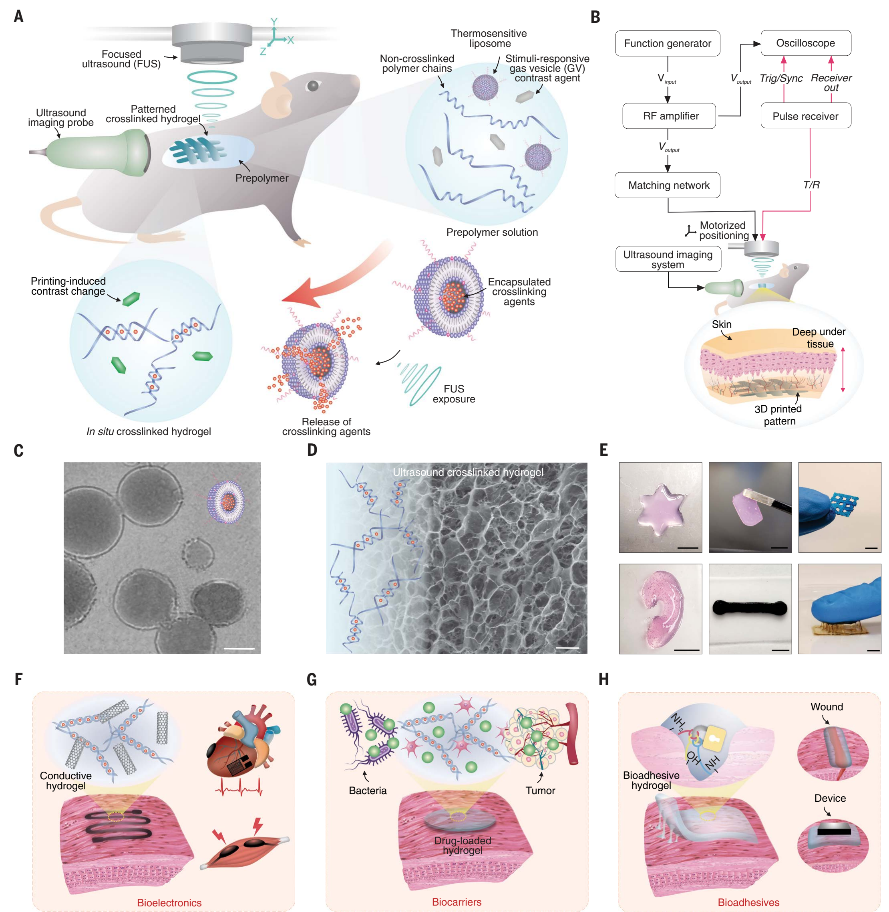

Fig. 1. Imaging-guided deep tissue in vivo sound printing (DISP). (A) Schematic of the DISP platform. The DISP system utilizes a US-ink composed of non–cross-linked prepolymer, cross-linking agent–loaded LTSLs, and GVs. The US-ink is injected into the body to noninvasively fabricate a precise functional biostructure in vivo. Integrated GV-based ultrasound imaging is employed to monitor the target organ, detect the presence of the prepolymer, and ensure accurate targeting and successful US-gel formation. (B) In vivo printing setup for FUS generation and monitoring. RF, radio frequency; T/R, transmitter/receiver. (C) TEM image of the cross-linking agent–loaded LTSLs. Scale bar, 100 nm. (D) SEM image of freeze-dried, 3D-printed alginate US-gel. Scale bar, 20 μm. (E) Functional hydrogel structures printed with sound in vivo printing. Scale bars, 5 mm. (F to H) DISP-based in vivo printing of bioelectronic devices for sensing and recording (F), biocarriers for drug delivery and tissue regeneration (G), and bioadhesives for wound sealing and device/tissue interfaces (H).

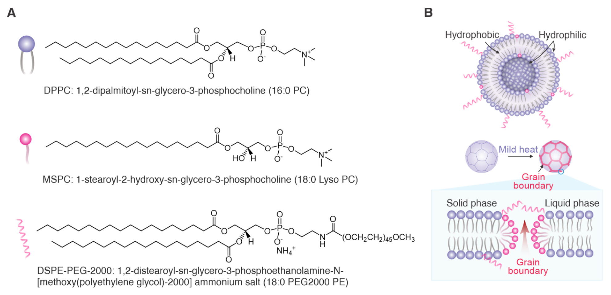

Fig. S1. Structure of low temperature sensitive liposomes (LTSLs). (A) LTSLs are primarily composed of DPPC phospholipids, with the inclusion of MSPC as a lysolipid and DSPE-PEG-2000 as a PEGylated lipid to enhance thermoresponsiveness. (B) Mild heating triggers the formation of gaps and nanopores at defect sites and grain boundaries, leading to the rapid release of encapsulated contents.

We developed an imaging-guided deep tissue in vivo sound printing (DISP) platform, which utilizes low-temperature–sensitive liposomes (LTSLs) as carriers for cross-linking agents to enable precise and controlled in situ fabrication of biomaterials within deep tissues (Fig. 1, A to C, and table S1). In DISP, LTSLs enhance biocompatibility by encapsulating cross-linking agents, preventing premature interaction with surrounding tissues and enabling on-demand release by means of FUS. Designed to respond to mild temperature changes slightly above body temperature, LTSLs enable activation of various cross-linking mechanisms, including ionic, oxidative, and free radical polymerization (Fig. 1, D and E).

DISP achieves high-resolution printing (~150 μm) and fast printing speeds (up to 40 mm s−1). A wide range of functional biomaterials, including conductive, drug-loaded, cell-laden, and bioadhesive hydrogels, were successfully printed (Fig. 1, F to H). Gas vesicle (GV)–based ultrasound imaging (26, 27) was integrated into the printing platform, allowing for real-time monitoring of the printing process, precise focal point positioning, and in situ cross-linking verification. As a proof of concept, we demonstrated in vivo printing within the bladders and muscles of live animals, with post procedure analyses confirming the high biocompatibility of both the prepolymers and printed hydrogels.

## The design and mechanism of deep tissue in vivo sound printing

DISP utilizes ultrasound-responsive bioinks—termed US-inks—specifically designed for precise and controlled in situ fabrication. US-inks are composed of biopolymers, cross-linking agent-encapsulated LTSLs, and GVs that act as ultrasound imaging contrast agents. These bioinks are delivered to the target sites through injection or catheters and are located using an ultrasound imaging setup integrated into 3D printing platform. This system accurately targets the FUS focal point onto the US-ink and continuously monitors the printing process.

The FUS transducer, controlled by an automatic positioning system, scans over the US-ink following a predefined G-code. Localized heating induced by FUS triggers the release of cross-linking agent from the LTSLs, enabling immediate in situ cross-linking of the US-ink (Fig. 1, A and B). Transmission electron microscopy (TEM) confirmed the integrity of the LTSLs (Fig. 1C) whereas scanning electron microscopy (SEM) revealed uniform cross-linking and the formation of US-gels (Fig. 1D). DISP enables the synthesis and precise patterning of functional US-gels with diverse properties, including conductivity, biocarrier capacity, and bioadhesion (Fig. 1E), expanding potential applications in bioelectronics, drug delivery, tissue regeneration, wound sealing, and other medical interventions (Fig. 1, F to H).

## Low-temperature–sensitive liposomes for controlled cross-linking

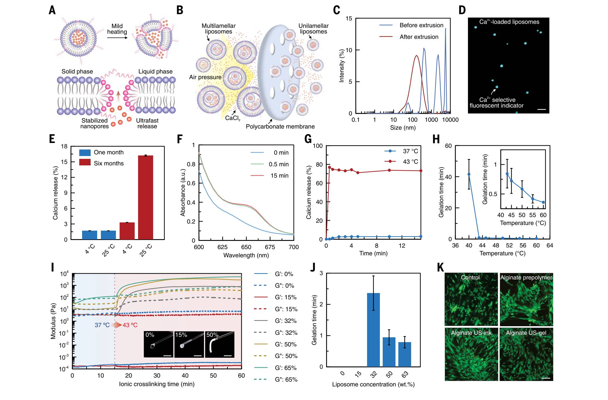

Fig. 2. Synthesis and characterization of low temperature sensitive liposomes for controlled release of cross-linking agents. (A) Schematic illustrating the formation of nanopores in lipid bilayers of LTSLs due to a phase transition from solid to liquid induced by mildly elevated temperatures. (B) Mass production of cross-linking agent (e.g., Ca2+)-loaded LTSLs through the extrusion process. (C) DLS analysis of LTSLs before and after extrusion. (D) Fluorescent imaging of Ca2+-loaded LTSLs using fura-2-acetoxymethyl ester as an intracellular calcium indicator. Scale bar, 3 μm. (E) Stability study showing Ca2+ release from LTSLs stored at 4°C and 25°C after 1 month and 6 months. (F) UV-vis analysis of LTSLs subjected to 43°C for various durations. (G) Temperature-dependent Ca2+ release from LTSLs at 43°C and 37°C. (H) Cross-linking time for alginate US-inks under various heating temperatures when LTSLs concentration is fixed at 50 wt%. (I) Ionic cross-linking of alginate US-inks with varying LTSL concentrations, evaluated by storage (Gʹ) and loss (Gʹʹ) modulus. (Inset) Images of the gelation status of alginate US-inks containing 0, 15, and 50% LTSLs after 30 s of exposure to 43°C. Scale bars, 5 mm. (J) Cross-linking time measurements for alginate US-inks with different LTSL concentrations. (K) Live/dead staining images of human dermal fibroblast cells cultured for 7 days with the alginate, alginate US-ink containing 50% LTSLs, and alginate US-gel. Scale bar, 100 μm. The error bars in the figures indicate the standard deviation from the mean (n = 3).

Low-temperature–sensitive liposomes are widely used in drug delivery due to their ability to precisely control release temperatures by engineering lipid bilayer properties. Although certain liposomes can be activated using low-frequency ultrasound from probe sonicators to compromise their membranes for cross-linking applications (28), LTSLs enable remote and precise activation through FUS, allowing superior spatial control. In this study, the LTSLs were designed to remain stable at 37°C and rapidly release encapsulated materials at ~41.7°C (29). Upon FUS exposure, temperature increases locally within the US-ink, which induces a phase transition in the LTSL lipid bilayer from a solid to a liquid state, creating nanopores in the bilayer structure (Fig. 2A).

Grain boundary defects in the solid phase were found to be crucial for the formation of stable nanopores in the lipid bilayers. To enhance lipid mobility and facilitate pore formation, pore-forming lysolipids and a small percentage of PEGylated lipids were incorporated into the lipid bilayer (fig. S1). During heating, these defects expand rapidly (29, 30), enabling controlled payload release while minimizing premature leakage at physiological temperatures, ensuring precise and reliable cross-linking for sound printing.

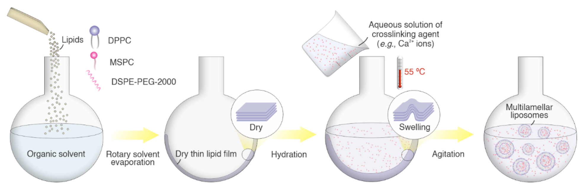

Fig. S2. Synthesis of LTSLs via dry lipid film hydration process. The synthesis of LTSLs includes dissolving DPPC, MSPC, and DSPE-PEG-2000 in an organic solvent, followed by rotary solvent evaporation to form a thin film of lipids. An aqueous solution of the crosslinking agent is subsequently added to the lipid film, followed by vigorous agitation to produce LTSLs.

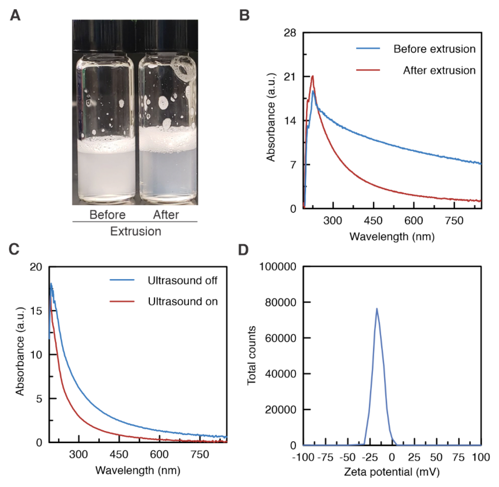

Fig. S3. Characterization of liposomal solutions. (A and B) Images (A) and UV-vis (B) absorbance of the liposomal solution before and after 10 cycles of extrusion through polycarbonate membrane. (C) UV-vis absorbance of the liposomal solution before and after FUS exposure. (D) Zeta potential analysis of Ca2+-encapsulated LTSLs in water.

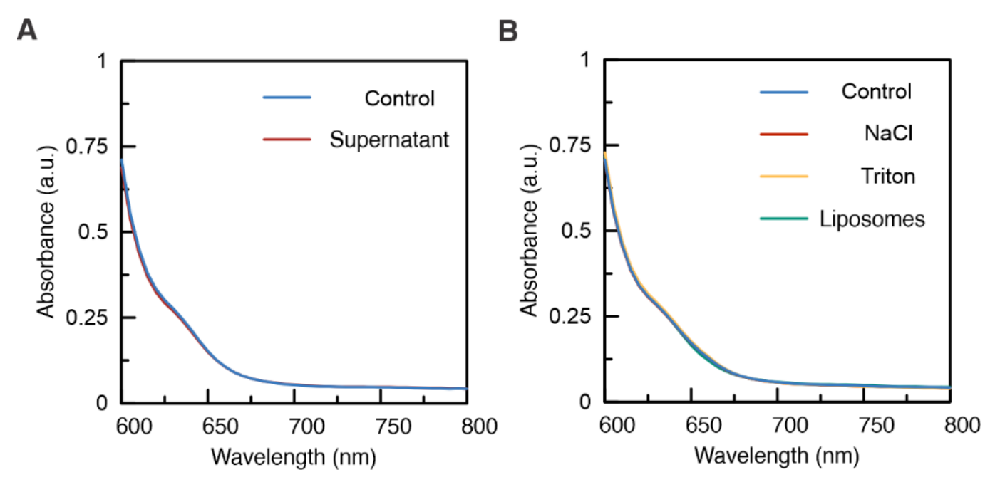

Fig. S4. Characterization of Ca2+-encapsulated LTSLs. (A) UV-vis absorbance of the supernatant after ultracentrifugation of liposomal solutions confirms the absence of free Ca2+ ions, indicating successful encapsulation. (B) UV-vis absorbance measurements of NaCl, Triton X-100, and liposomal solutions verify that these components do not interfere with the UV-vis readings.

LTSLs were synthesized using a dry lipid film hydration process followed by extrusion to achieve uniform size distribution (Fig. 2B and figs. S2 and S3). Dynamic light scattering (DLS) analysis confirmed the successful transition from multilamellar to unilamellar vesicles with smaller and more uniform sizes (Fig. 2C) (29). A zeta potential of −17.31 mV indicated high dispersibility and stability (fig. S3D). Additionally, two-photon microscopy verified the successful encapsulation of a CaCl2 cross-linking agent within the LTSLs for alginate-based US-inks (Fig. 2D) while unencapsulated CaCl2 and other residues were effectively removed through ultracentrifugation (fig. S4).

The LTSLs demonstrated long-term stability, maintaining consistent cross-linking performance even after 6 months of storage (Fig. 2E). Ultraviolet-visible (UV-vis) spectroscopy revealed a substantial Ca2+ release peak at 650 nm after 30 s of heating to 43°C (Fig. 2F). The LTSLs showed more than 77% release at 43°C with negligible release occurring at 37°C, ensuring controlled, on-demand cross-linking for US-inks (Fig. 2G). Optimizing lipid composition, lysolipid content, and liposome size can enhance release profiles while balancing permeability and stability to prevent premature leakage, enabling effective cross-linking during sound printing.

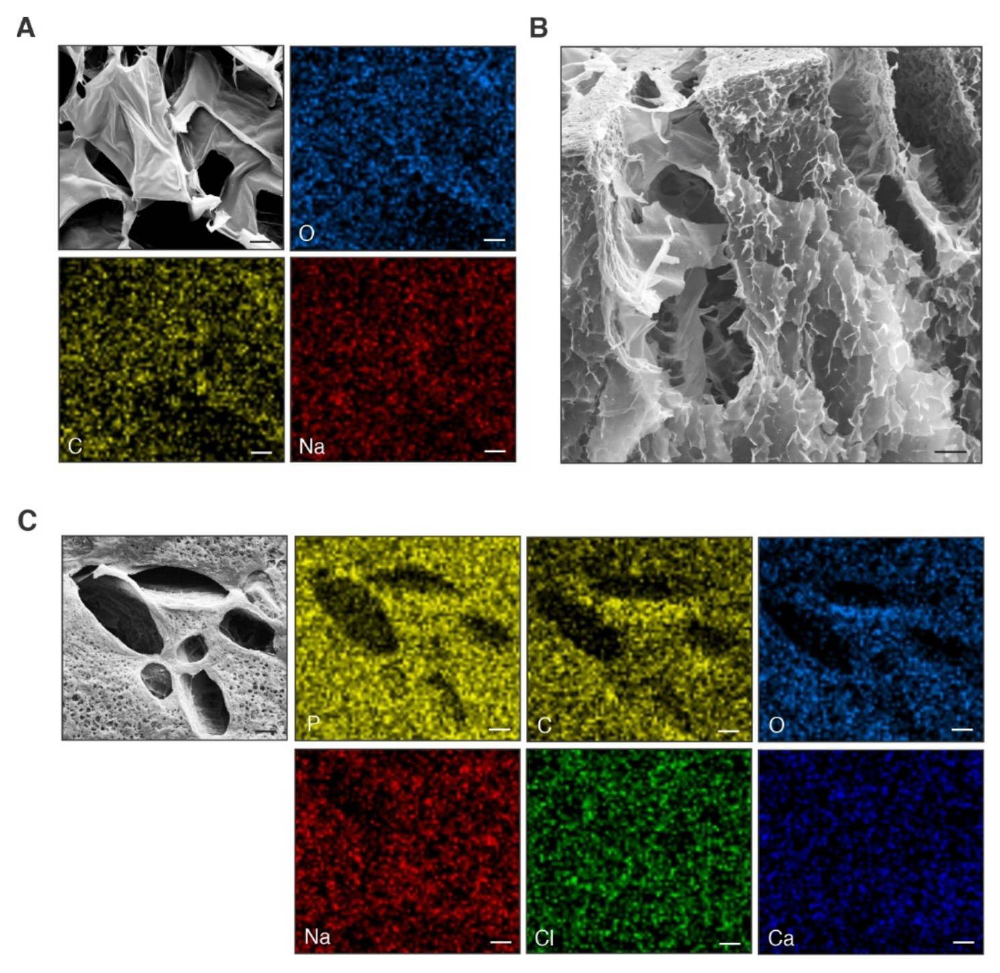

Fig. S5. Energy dispersive spectroscopy (EDS) analysis of alginate-based prepolymers. (A) EDS analysis of freeze-dried alginate prepolymer. Scale bars, 10 μm. (B and C) SEM image (B) and EDS analysis (C) of freeze-dried non-crosslinked alginate US-ink prepolymer containing alginate and Ca2+-loaded LTSLs. Scale bars, 20 and 10 μm, for B and C, respectively.

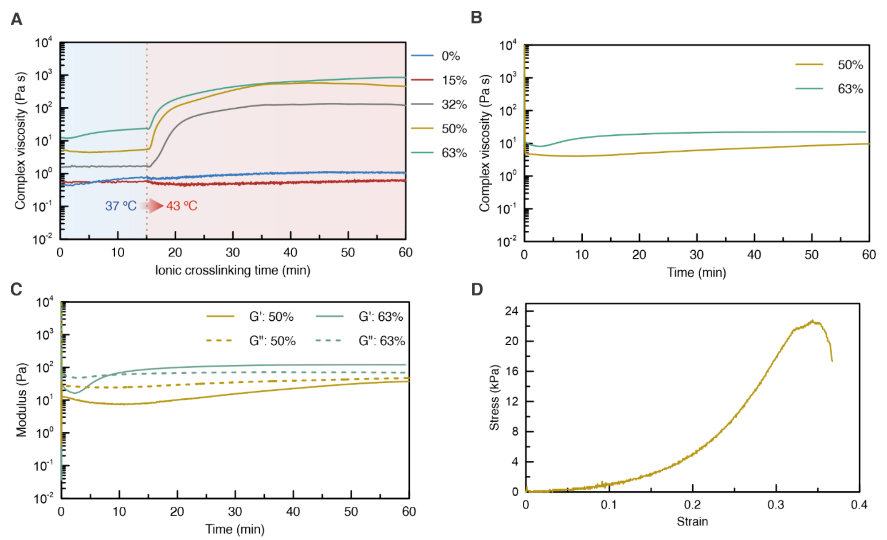

Fig. S6. Rheological and mechanical behavior of alginate US-ink and US-gel. (A and B) Complex viscosity of alginate US-ink with various LTSL concentrations upon mild heating (A) and at 37 °C (B). (C) Ionic crosslinking behavior of alginate US-ink at various LTSL concentrations at 37 °C, analyzed in terms of storage modulus (Gʹ) and loss modulus (Gʹʹ). (D) Mechanical properties of alginate US-gel crosslinked with 50% LTSLs under monotonic compressive loading.

Alginate US-ink was prepared by redistributing centrifuged LTSLs into an alginate solution. Energy-dispersive x-ray spectroscopy (EDS) confirmed the presence of calcium in the alginate US-ink (fig. S5). Elevated temperatures accelerated calcium release and reduced gelation times at fixed LTSL concentrations (Fig. 2H). Rheological studies demonstrated rapid gelation at LTSL concentrations of above 32 weight percent (wt%) (Fig. 2, I and J, and fig. S6A). However, concentrations exceeding 50 wt% led to undesirable self-association within 1 hour at 37°C (fig. S6, B and C). Therefore, 50 wt% was selected as the optimal concentration for alginate US-inks, enabling on-demand in situ alginate cross-linking (fig. S6D) and addressing the limitations of conventional ion diffusion–based cross-linking, which is impractical for in vivo applications.

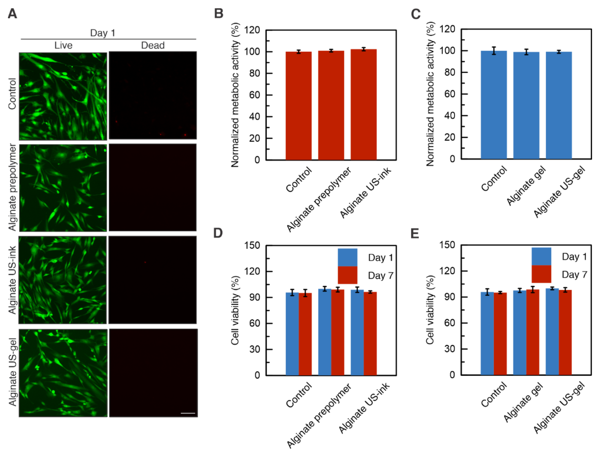

Fig. S7. In vitro biocompatibility of alginate US-ink and alginate US-gel. (A) Live/Dead staining images of human dermal fibroblast (HDF) cells on Day 1 of culture when exposed to alginate prepolymer, US-ink, and US-gel. Scale bar, 100 μm. (B and C) Metabolic activities of HDF cells on Day 1 of culture when exposed to the US-ink (B) and US-gel (C). (D and E) Viability of HDF cells on Day 1 and Day 7 of culture when exposed to the US-ink (D) and US-gel (E). The error bars in the figures indicate the standard deviation from the mean (n=3).

Biocompatibility is critical for both prepolymer and printed structures in biomedical applications. Live/dead viability assays performed on human dermal fibroblasts confirmed high cell viability and normal morphology after 7 days of culture (Fig. 2K and fig. S7).

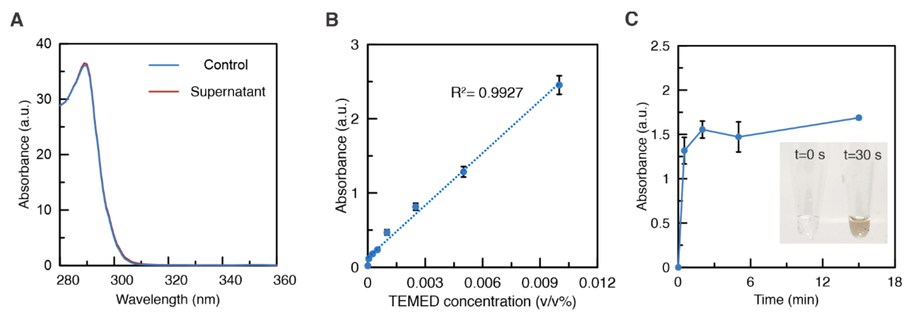

Fig. S8. Characterization of tetramethylethylenediamine (TEMED)-encapsulated LTSLs. (A) UV-vis absorbance of the supernatant after ultracentrifugation of liposomal solutions, confirming the absence of free TEMED molecules. (B) Calibration curve used to determine the concentration of released TEMED. (C) Release profile of TEMED from TEMED-encapsulated LTSLs upon mild heating at 43 °C. Inset, images of TEMED-encapsulated LTSLs before and after 30-s mild heating after exposure to dopamine. The error bars in the figures indicate the standard deviation from the mean (n=3).

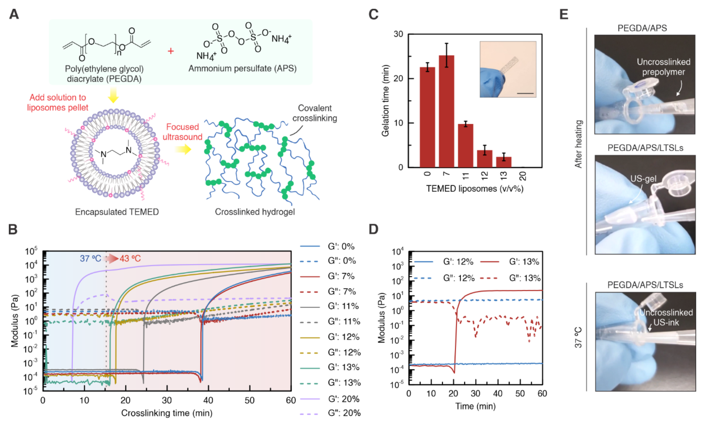

Fig. S9. Ultrasound crosslinking of poly(ethylene glycol) diacrylate (PEGDA) US-ink. (A) Composition of PEGDA US-ink, which includes TEMED-encapsulated LTSLs mixed with PEGDA prepolymer and ammonium persulfate (APS) as the initiator. (B) Crosslinking behavior of PEGDA US-ink at various concentrations of LTSLs upon mild heating at 43 °C, measured in terms of storage modulus (Gʹ) and loss modulus (Gʹʹ). (C) Crosslinking time of PEGDA US-ink at various concentrations of TEMED-encapsulated LTSLs. Inset, image of the printed PEGDA US-gel. Scale bar, 8 mm. (D) Crosslinking behavior of PEGDA US-ink at various concentrations of LTSLs at 37 °C, measured in terms of storage modulus (Gʹ) and loss modulus (Gʹʹ). (E) Effect of adding TEMED-LTSLs on PEGDA crosslinking. The error bars in the figures indicate the standard deviation from the mean (n=3).

The US-ink design strategy is versatile, supporting not only ionic cross-linking but also free radical polymerization. As a proof of concept, PEGDA-based US-inks were developed using tetramethylethylenediamine (TEMED)–loaded LTSLs, synthesized and purified in a similar manner (fig. S8A). TEMED release from LTSLs occurred rapidly, within 30 s at 43°C (fig. S8, B and C). These LTSLs were incorporated into a prepolymer mixture containing PEGDA monomers and ammonium persulfate initiator (fig. S9A). At 12% TEMED LTSL concentration, the shortest cross-linking times were achieved at 43°C, with no gelation observed after 1 hour at 37°C (fig. S9, B to E). Importantly, FUS exposure during in vivo printing further reduced cross-linking times due to rapid localized heating, outperforming conventional rheological setups.

## FUS-induced high-resolution 3D printing

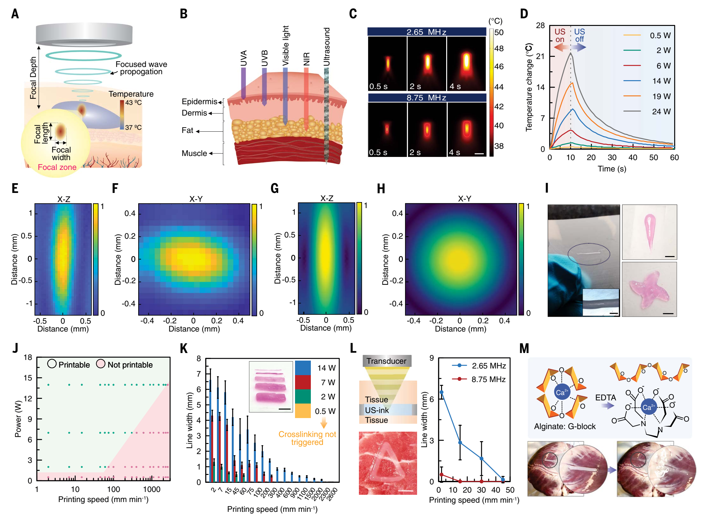

Fig. 3. Characterization of focused ultrasound-induced 3D printing. (A) Schematic of FUS wave propagation, illustrating precise targeting of US-ink. (B) Comparison of tissue penetration depths for ultrasound waves versus various light sources, highlighting ultrasound’s superior penetration. UVA, ultraviolet A; UVB, ultraviolet B; NIR, near-infrared. Note the inverse relationship between the ultrasound frequency with penetration depth. (C) Thermal simulations showing the temperature distribution at the focal point under different frequencies and exposure times. Scale bar, 2 mm. (D) Temperature profile at the focal point of FUS at 8.75 MHz during and after 10 s of ultrasound exposure. (E to H) Normalized pressure maps at the focal point using a 2.65-MHz transducer, experimental measurements using a hydrophone in the X-Z plane (E) and in the X-Y plane (F), and simulation results in the X-Z plane (G) and in the X-Y plane (H). (I) DISP-printed US-gel patterns. Scale bar for inset, 400 μm. Scale bars for patterns on the right, 4 mm. (J) Printability of the alginate US-ink with an 8.75-MHz transducer at various power levels and printing speeds. (K) Printing resolution in terms of line width for alginate US-ink using an 8.75 MHz transducer at different power levels and printing speeds. Scale bar, 5 mm. (L) Printing resolution of alginate US-ink, measured as line width, when printed under 15-mm-thick pork loin tissue at 18 W, with varying frequencies and printing speeds. (Inset) A deep tissue printed pattern on pork tissue. Scale bar, 5 mm. (M) Dissociation of alginate US-gels patterned on tissue using DISP, achieved by 5 min of treatment with 0.025 M EDTA solution. The error bars in the figures indicate the standard deviation from the mean (n = 3).

FUS waves precisely converge on a focal point (Fig. 3A) and effectively penetrate deep into tissues, reaching depths of several centimeters or more, far surpassing other energy delivery methods such as UV, visible, or NIR light, which are limited to a few millimeters as a result of absorption and scattering (Fig. 3B). In the DISP platform, FUS enables high-resolution in vivo printing with submillimeter focal zone.

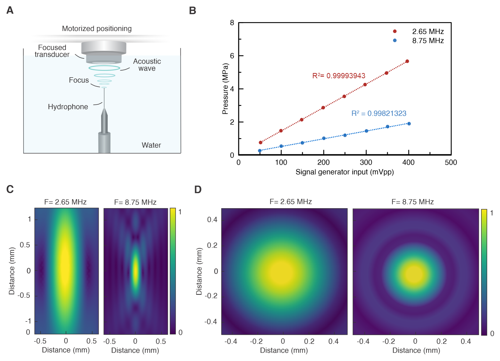

Fig. S10. Characterization of pressure at the focal point of a focused transducer. (A) Experimental setup for measuring the pressure at the focal point of the focused transducer using a hydrophone. (B) Calibration curve correlating the pressure at focal point with the signal generator input. (C and D) Normalized pressure maps at the center of focal point in the X-Z plane (C) and the X-Y plane (D) obtained by simulation.

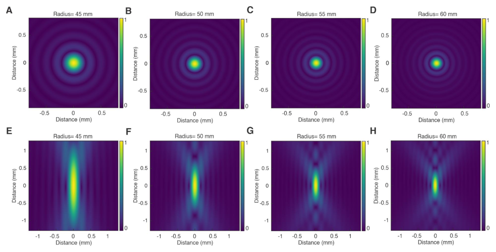

Fig. S11. Normalized pressure maps for transducers with various aperture sizes. The pressure maps are obtained at the focal point center in the X-Y plane (A to D) and the X-Z plane (E to H), obtained through simulation. The focal distance is constant in all conditions.

FUS exposure generates localized temperature increases at the focal point through acoustic energy absorption (31). Thermal characterization of the focal point reveals that the heating zone size depends on exposure time and frequency (Fig. 3C), with increased transducer power enhancing both pressure and temperature at the focal point (Fig. 3D and fig. S10, A and B) (32). Pressure zone measurements (Fig. 3, E and F) closely align with simulation results (Fig. 3, G and H and fig. S10, C and D), confirming that focal zone dimensions correlate with transducer frequencies. Simulations further indicate that enlarging transducer aperture reduces the focal zone size, thereby improving precision (fig. S11).

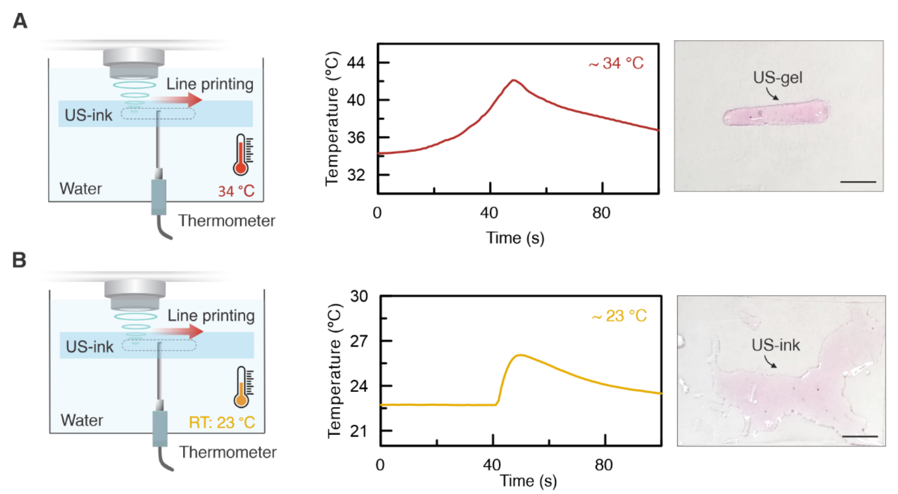

Fig. S12. Temperature evaluation of US-ink during printing process at various water bath temperatures. A wire thermocouple was incorporated into the US-ink, and a line was printed such that the transducer's focal point passed over the thermocouple. This setup allowed for the measurement of temperature changes at a specific point along the printed line when US-ink tank is located at water baths of (A) 34 °C and (B) 23 °C. Scale bars, 4mm.

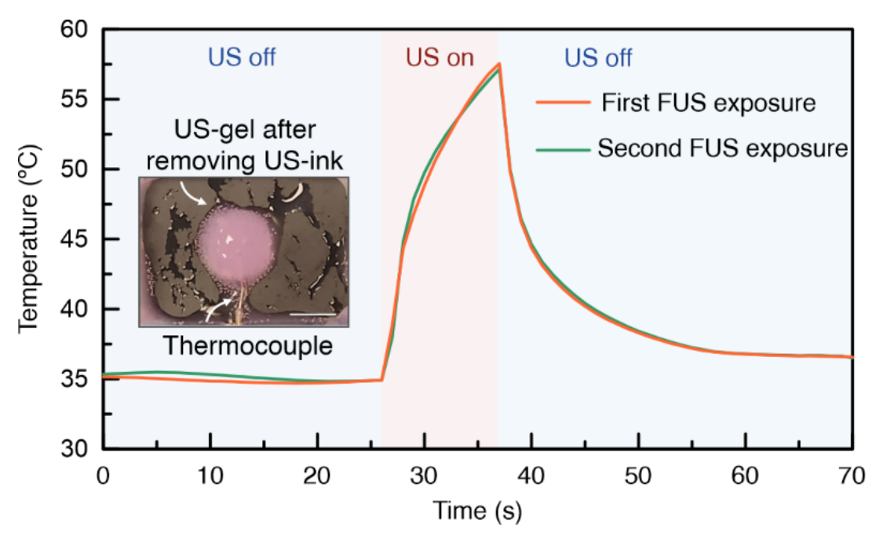

Fig. S13. Temperature changes upon FUS exposures. Temperature was measured at the focal point during the first and second FUS exposures at the same location using 8.75 MHz focused ultrasound for 10 seconds. Alginate US-ink was utilized in this study.

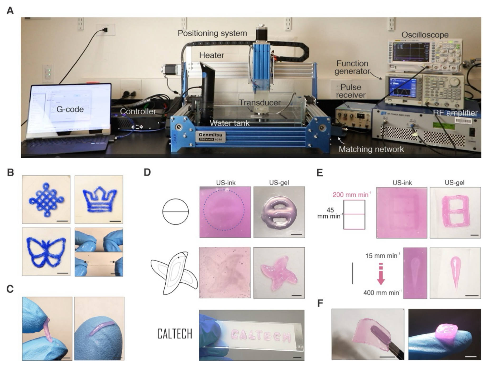

Fig. S14. Alginate US-gel patterns printed using a focused transducer. (A) DISP setup for sound printing. (B) Polydimethylsiloxane (PDMS) patterns printed using an 8.75 MHz transducer at a speed of 100 mm min−1 and 20 W crosslinked through sonochemical reactions. Scale bar, 10 mm. (C) Sound printing of alginate US-gel lines. Scale bars, 4 mm. (D) Printing of alginate US-gel patterns based on predefined G codes. Images on the left and right show the state before and after removing uncrosslinked US-ink, respectively. Scale bars, 4 mm. (E) Sound printing of patterns with varying resolutions by adjusting printing speeds, including the creation of gradient lines through speed variation during the printing process. Scale bars, 6 mm. (F) Printing rectangular alginate US-gel patterns using 8.75 MHZ FUS at 15 Watt and 5 mm min−1, with a 1 mm (left) and 3 mm (right) ink tank located on an agarose substrate. In this case, the layer height has been equal to the tank thickness due to higher power and lower speed applied. Scale bars, 6 mm. The pink color is used to enhance visualization.

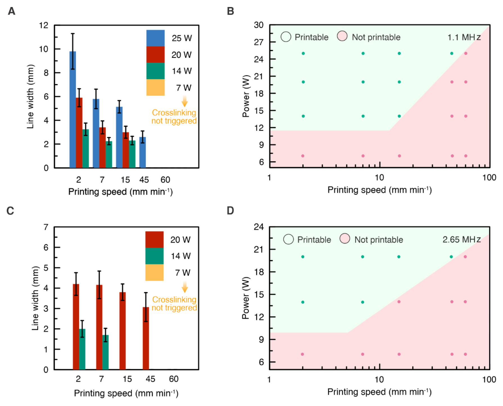

Fig. S15. Printing resolution and printability of alginate US-ink. (A and B) Printing resolution (A) and printability (B) of alginate US-ink, assessed by line width, when printed using a 1.1 MHz transducer at different power levels and printing speeds. (C and D) Printing resolution (C) and printability (D) of alginate US-ink, assessed by line width, when printed using a 2.65 MHz transducer at different power levels and printing speeds. The error bars in the figures indicate the standard deviation from the mean (n=3).

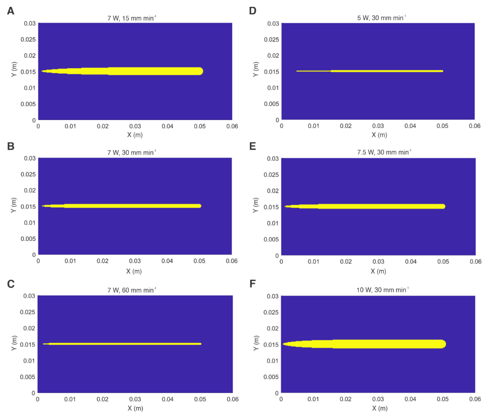

Fig. S16. Thermal simulation of printed lines at various printing parameters. The influence of printing speed (A to C) and power (D to F) on the heat diffusion and printing resolution are depicted. The yellow color highlights the area where the temperature exceeds the phase transition threshold.

**Movie S1.** Thermal simulation of printed lines at various printing parameters. The effects of printing speed (left) and power (right) on heat diffusion and printing resolution were studied.

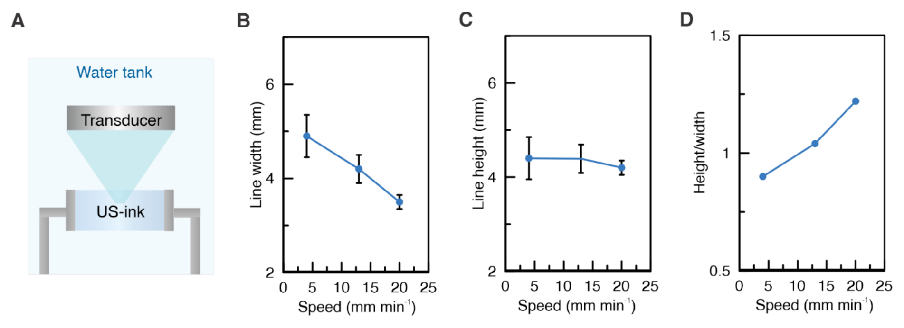

Fig. S17. The printing resolution in a 7 mm thick ink tank without agarose substrate. (A) Printing setup without a substrate underneath of the ink tank. Lateral (B) and axial (C) resolution of the lines printed at various speeds using an 8.75 MHz transducer. (D) Axial to lateral resolution ratio of lines printed at various speeds. The error bars in the figures indicate the standard deviation from the mean (n=3).

Within US-ink, localized heating and temperature gradients induced by ultrasound absorption trigger LTSL phase changes and initiate cross-linking (fig. S12). The temperature changes remained consistent across multiple FUS exposures (fig. S13). DISP-printed US-gel patterns were optimized by adjusting printing parameters, such as power and speed, at 8.75 MHz (Fig. 3, I to K, figs. S14 to S16, and movie S1), achieving resolutions as fine as 150 μm. Higher frequency FUS with a smaller focal zone and increased printing speed can further enhance resolution. Line width and height characterizations were performed for freestanding printing in a deeper 7-mm US-ink tank (fig. S17). Gradient-sized patterns were produced by varying printing power and speed during the process (fig. S14E).

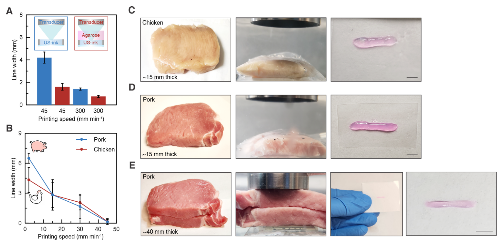

Fig. S18. Sound printing beneath agarose and thick tissue. (A) Printing resolution of alginate US-gels printed using an 8.75 MHz transducer at 14 W beneath a 30-mm-thick 3 wt.% agarose phantom, measured in terms of line width. Blue bars represent conditions where the US-ink is directly exposed to FUS, while red bars indicate conditions where the phantom is placed between the ink and the transducer. (B) Printing resolution of alginate US-gels printed using a 2.65 MHz transducer at 18 W beneath 15-mm-thick pork loin and chicken breast tissues, measured in terms of line width. (C and D) Sound printed US-gel lines under ~15 mm thick chicken (C) and 15 mm thick pork (D) using a 2.65 MHz transducer at 18 Watt and 15 mm min−1. Scale bars, 4 mm (E) Sound printed US-gel lines under ~40 mm thick pork tissue using a 2.65 MHz transducer at 24 Watt and 10 mm min−1. Scale bars, 2 mm. The error bars in the figures indicate the standard deviation from the mean (n=3).

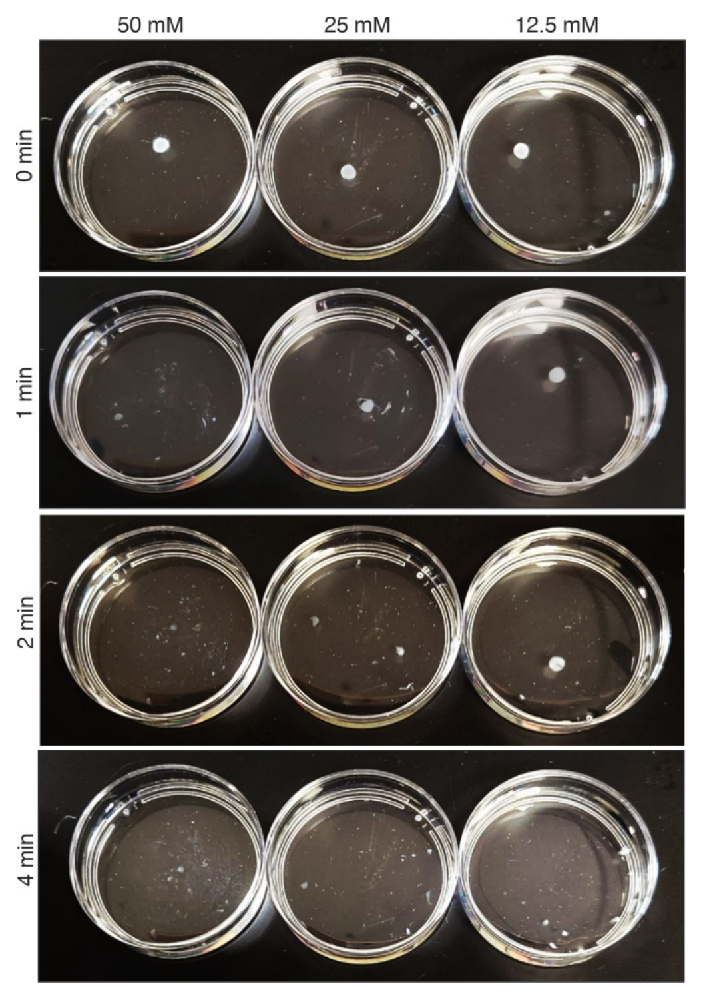

Fig. S19. Dissociation of alginate US-gel in EDTA. DISP-printed alginate US-gel undergoes dissociation when immersed in 0.05 M, 0.025 M, and 0.0125 M EDTA solutions.

DISP’s capabilities were further demonstrated by printing alginate US-gels beneath ~15 and ~40 mm-thick pork and chicken tissues at various resolutions (Fig. 3L and fig. S18). Additionally, the printed alginate US-gels can be selectively de-cross-linked and removed from tissue using chelate ethylenediaminetetraacetic acid (EDTA) (33) (Fig. 3M and fig. S19).

## Printing of functional biomaterials

Table S2. US-ink compositions introduced in this work.

| US-ink | Matrix solution | Final additive concentration | Encapsulated in LTSL | LTSL concentration in final solution (%)\* |
| --- | --- | --- | --- | --- |
| Alginate US-ink | Alginate 2.5 wt.% | N/A | CaCl2 500 mM | 50 |
| GelCA US-ink | GelCA 20 wt.% | N/A | NaIO4 47 mM | 20 |
| Conductive US-ink | Alginate 2.5 wt.% | CNT 5 wt.% | CaCl2 500 mM | 50 |
| PEGDA US-ink | PEGDA 35 wt.% | APS 0.5 wt.% | TEMED 50 v/v% | 12 |

\*Note that concentrations other than those listed above may have been used for certain characterizations, as specified in the corresponding sections.

Table S3. Printing parameters for the US-gel patterns in this work.

| Pattern | US-ink | Frequency (MHz) | Power (Watt) | Printing speed (mm min−1) | Figure |
| --- | --- | --- | --- | --- | --- |
| Lines | Alginate US-ink | 8.75 | 2 to 14 | 2 to 2300 | Fig. 3K |
| Triangle pattern under pork tissue | Alginate US-ink | 2.65 | 18 | 15 | Fig. 3L |
| Conductive lines for LED | Conductive US-ink | 8.75 | 14 | 2, 15, and 60 | Fig. S20C |
| Cell-laden structure | Alginate US-ink | 8.75 | 7 | 10 | Fig. 4I |
| In vivo printed US-gel | Alginate US-ink | 2.65 | 7 | 20 | Fig. 4N |
| GV-integrated line | Alginate US-ink | 8.75 | 5 | 10 | Fig. 5C |
| GV Ca2+ sensor-integrated line | Alginate US-ink | 8.75 | 5 | 10 | Fig. 5E |
| Lines | Alginate US-ink | 1.1 | 7 to 25 | 2 to 45 | Fig S15A |
| Lines | Alginate US-ink | 2.65 | 7 to 20 | 2 to 45 | Fig S15C |
| Thin line | Alginate US-ink | 8.75 | 14 | 1000 | Fig. 3I |
| Lines | Alginate US-ink | 8.75 | 14 | 100 | Fig. S14C |
| Circle | Alginate US-ink | 8.75 | 7 | 100 | Fig. S14D |
| Bird | Alginate US-ink | 8.75 | 7 | 100 | Fig. S14D |
| CALTECH | Alginate US-ink | 8.75 | 13 | 200 | Fig. S14D |
| Ladder | Alginate US-ink | 8.75 | 14 | 45 and 200 | Fig. S14E |
| Drop | Alginate US-ink | 8.75 | 15 | 15 to 400 | Fig. S14E |
| Rectangle | Alginate US-ink | 8.75 | 15 | 5 | Fig. S14F |
| Lines under pork and chicken | Alginate US-ink | 2.65 | 18 | 2 to 45 | Fig. S18B |
| Conductive line | Conductive US-ink | 8.75 | 14 | 30 | Fig. S20D |

The DISP technology offers a versatile platform for printing a wide range of functional biomaterials, unlocking applications in bioelectronics, drug delivery, tissue engineering, wound sealing, and beyond (tables S2 and S3). By enabling precise control over material properties and spatial resolution, DISP is ideal for creating functional structures and patterns directly within living tissues.

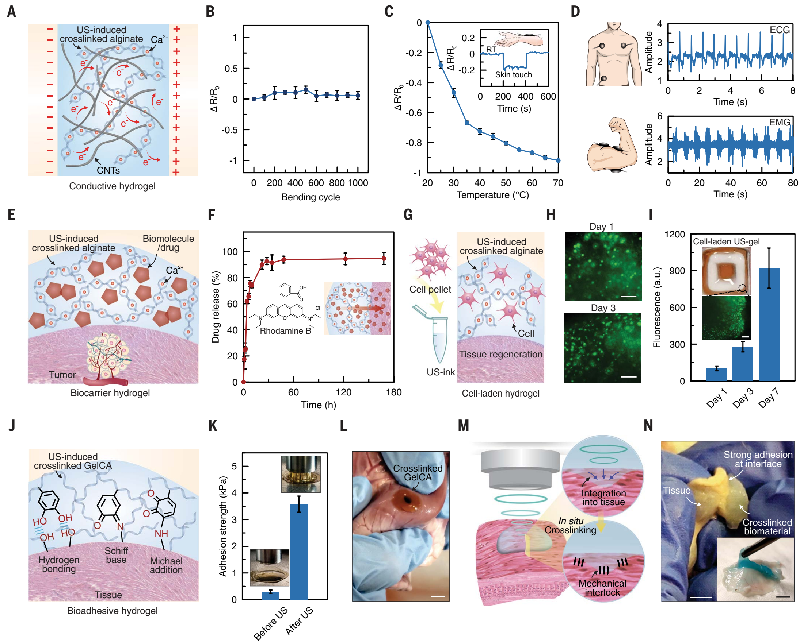

Fig. 4. Deep tissue in vivo sound printing-based 3D printing of functional biomaterials for various medical applications. (A) Schematic of conductive US-ink composed of CNT additives entangled within alginate US-ink, cross-linked using FUS. (B) Conductive US-gel patterns maintain stable electrical properties under cyclic bending deformations. (C) Temperature sensing using printed conductive US-gels. (Inset) Consistent and reversible temperature sensor response upon contact with human skin. RT, room temperature. (D) DISP-printed conductive US-gel sensors for ECG and EMG recordings in a human participant. (E) Integration of therapeutic biomolecules within US-ink, forming biocarrier US-gels for potential drug delivery applications. (F) Continuous and sustainable release of a model drug rhodamine B from US-gels. (G) Cell-encapsulated US-gels prepared by integrating cells within biocompatible US-inks followed by printing using an 8.75-MHz transducer at 7 W and a printing speed of 10 mm min−1. (H) Live/dead staining images of C2C12 mouse myoblast cells encapsulated within alginate US-gels on days 1 and 3 after printing. Scale bars, 100 μm. (I) Metabolic activity of cells assessed from days 1 to 7 after printing. (Insets) Images of the cell-laden US-gel pattern, printed with an 8.75-MHz transducer at 7 W and 10 mm min−1, showing live cells 3 days after printing. Scale bar, 200 μm. (J) Catechol-modified gelatin–caffeic acid conjugates (GelCA) US-inks mixed with NaIO4 liposomes for bioadhesive applications. (K) Adhesion strength of GelCA US-ink before and after cross-linking. (Inset) Images of the GelCA US-ink before and after mild heating and cross-linking. (L) Ex vivo adhesion testing of GelCA US-gel for sealing punctured heart tissue. Scale bar, 5 mm. (M) In vivo US-induced adhesion, where FUS facilitates prepolymer jetting towards tissue, followed by in situ cross-linking of alginate US-ink to achieve mechanical interlock. (N) Alginate US-gels printed in vivo following intradermal injection of US-ink and cross-linking using a 2.65-MHz transducer at 7 W, with a printing speed of 20 mm min−1 on live animals. The strong interfacial adhesion is observed between the alginate US-gel and tissue, with blue dye applied for visibility. Scale bars, 6 mm. The error bars in the figures indicate the standard deviation from the mean (n = 3).

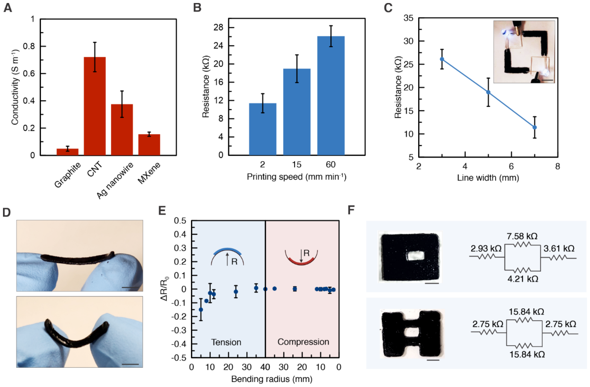

Fig. S20. Electrical characterization of conductive patterns. (A) Conductivity of alginate solutions containing various conductive additives. (B) Electrical resistance of printed conductive US-gel lines with CNT additives fabricated at various printing speeds, using an 8.75 MHz transducer at 14 W. (C) Conductive US-gels printed using an 8.75 MHz transducer at 14 W, with printing speeds of 60, 15, and 2 mm min−1 (left to right), resulting in varying line widths and a range of electrical resistance. Inset, a pattern of conductive US-gel used to power light-emitting diodes. Scale bar, 5 mm. (D) Stand-alone conductive line created through DISP, subjected to bending deformation. Scale bars, 4 mm. (E) DISP-printed conductive patterns maintain stable electrical properties under mechanical bending deformations. (F) Images and corresponding circuit diagram for conductive electronic circuit patterns printed with varying line widths and resolutions. Scale bars, 5 mm. The error bars in the figures indicate the standard deviation from the mean (n=3).

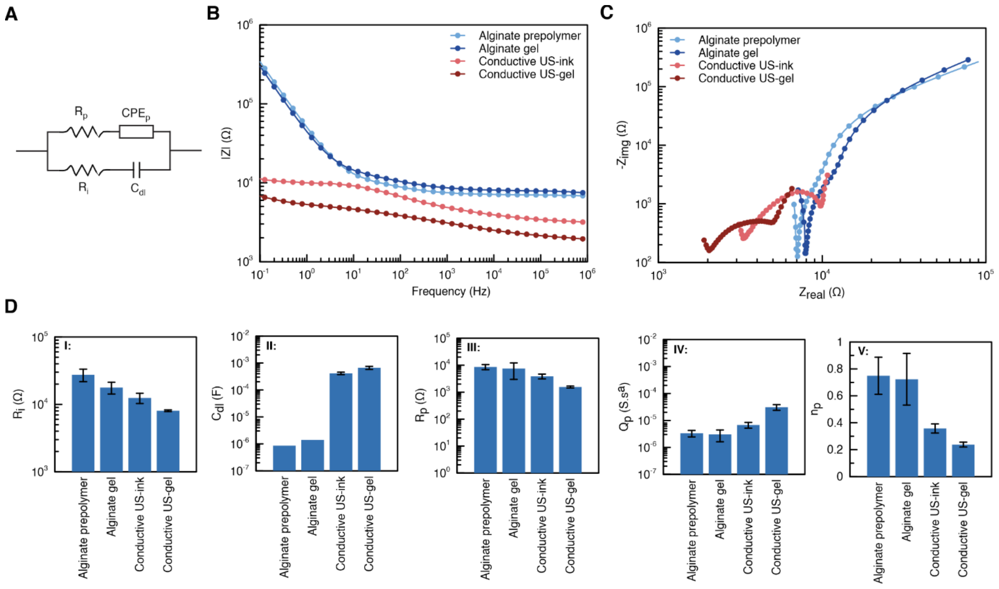

Fig. S21. Impedance spectroscopy analysis of conductive US-ink and US-gel. (A) The equivalent circuit model used for interpreting the impedance data, assuming negligible charge transfer at the electrodes. (B and C) Impedance magnitude plots (B) and Nyquist plots (C) for conductive US-ink and US-gel with CNT additives. Zimg and Zreal represent the imaginary and real components of impedance, respectively. (D) Effects of material properties on the fitting parameters of the circuit model. The model includes a resistor Ri (I), representing ionic conduction, in series with a capacitor Cdl (II), representing double-layer capacitance. These components are in parallel with a resistor Rp (III) and a constant phase element CPEp (IV and V), which accounts for the insulating components that prevent direct CNT contacts. The fitting parameters derived from the circuit model include Ri, Cdl, Rp, Qp, and np, where Ri and Rp denote the resistances of their respective resistors, Cdl represents the capacitance associated with the capacitor, and Qp and np are the constant and exponent values of the capacitive phase element CPEp. The error bars in the figures indicate the standard deviation from the mean (n=3).

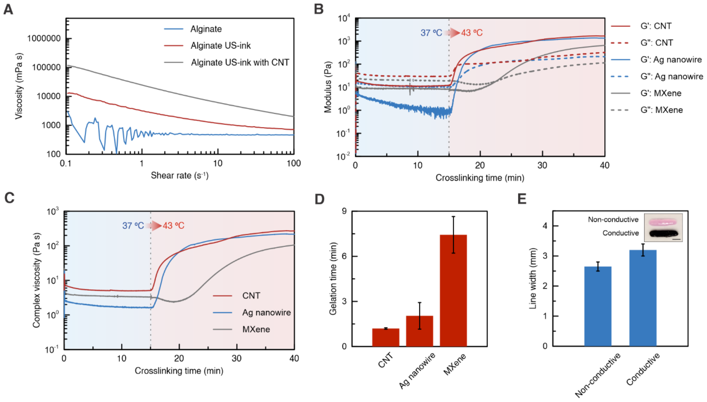

Fig. S22. Characterization of shear thinning properties and crosslinking in conductive US-inks. (A) Effect of LTSLs and CNT addition on viscosity and shear thinning properties. (B) Ionic crosslinking behavior of conductive US-inks with different conductive additives, measured in terms of storage modulus (Gʹ) and loss modulus (Gʹʹ) under mild heating at 43 °C. Samples were initially exposed to 37 °C for 15 min to better mimic biological conditions. (C) Complex viscosity of conductive US-ink with various additives upon mild heating. (D) Ionic crosslinking time for conductive US-inks with various conductive additives under mild heating at 43 °C. (E) Comparison of line widths for non-conductive and conductive US-gels printed using DISP. Inset, images of DISP-printed non-conductive and conductive US-gels. Scale bar, 2 mm. The error bars in the figures indicate the standard deviation from the mean (n=3).

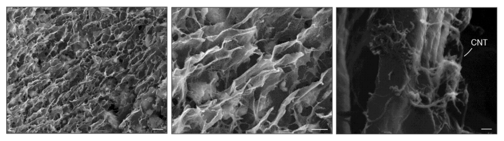

Fig. S23. SEM characterization of conductive US-gels. SEM images of freeze-dried conductive US-gel with CNT additives at various magnifications, demonstrating effective crosslinking and CNT entanglement within the US-gel. Scale bars, 20 µm, 10 µm, 200 nm from left to right.

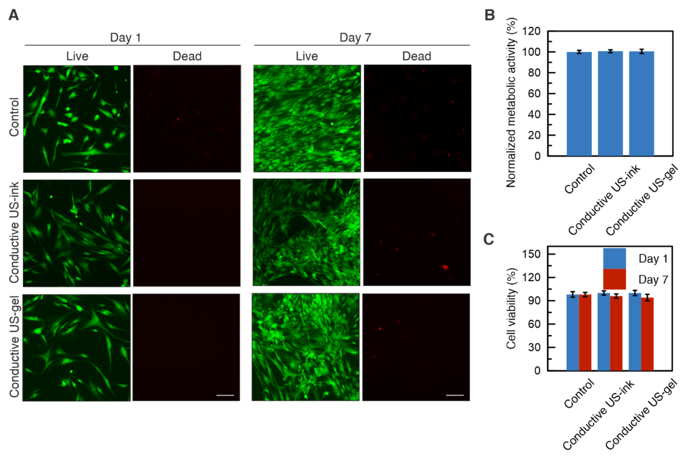

Fig. S24. In vitro biocompatibility of conductive US-ink and conductive US-gel. (A) Live/Dead staining images of HDF cells on Day 1 and Day 7 of culture, when exposed to conductive US-ink and US-gel with CNT additives. Scale bars, 100 μm. (B) Metabolic activities of HDF cells on Day 1 of culture when exposed to the US-ink and US-gel. (C) Viability of HDF cells on Day 1 and Day 7 of culture when exposed to the US-ink and US-gel. The error bars in the figures indicate the standard deviation from the mean (n=3).

Using DISP, we successfully printed hydrogel bioelectronics using alginate US-inks containing conductive additives such as carbon nanotubes (CNTs), Ag nanowires (AgNWs), and MXene flakes (Fig. 4A). DISP’s nozzle-free approach avoids clogging issues commonly encountered in traditional printing methods when using inks with high additive concentrations. By optimizing printing parameters—such as speed, power, and CNT concentration—tailored hydrogel circuits with adjustable resistance and patterns were achieved (fig. S20). A calibration curve demonstrated an inverse relationship between resistance and line width, consistent with the theoretical predictions (fig. S20C). Conductive US-inks with CNTs substantially improved both ohmic and ionic conductivity of alginate by nearly an order of magnitude through enhanced electron transfer within CNT networks (fig. S21). Despite increased viscosity due to CNT additives, the ink’s shear-thinning properties allowed for effective injection (fig. S22A). CNT-based inks also exhibited shorter gelation times compared with US-inks with other conductive additives (fig. S22, B to D) and slightly wider printed lines than their nonconductive counterparts as a result of higher acoustic absorption (fig. S22E). These conductive US-gels maintained stable conductivity during tensile and compressive loads, making them ideal for wearable and implantable bioelectronics (Fig. 4B and fig. S20, D to F). Additionally, a hybrid ink combining CNTs and AgNWs achieved a tenfold conductivity increase. SEM confirmed the structural integrity and entanglement of CNT fibers within the US-gels (fig. S23). Biocompatibility studies showed no apparent cytotoxicity for conductive US-ink and US-gels (fig. S24). DISP-printed hydrogel bioelectronics demonstrated promising applications for personalized health monitoring, including resistive skin temperature sensors with high sensitivity across physiologically relevant temperature ranges (Fig. 4C) and biopotential electrodes for reliable monitoring of physiological vital signs, such as electrocardiogram (ECG) and electromyogram (EMG) (Fig. 4D).

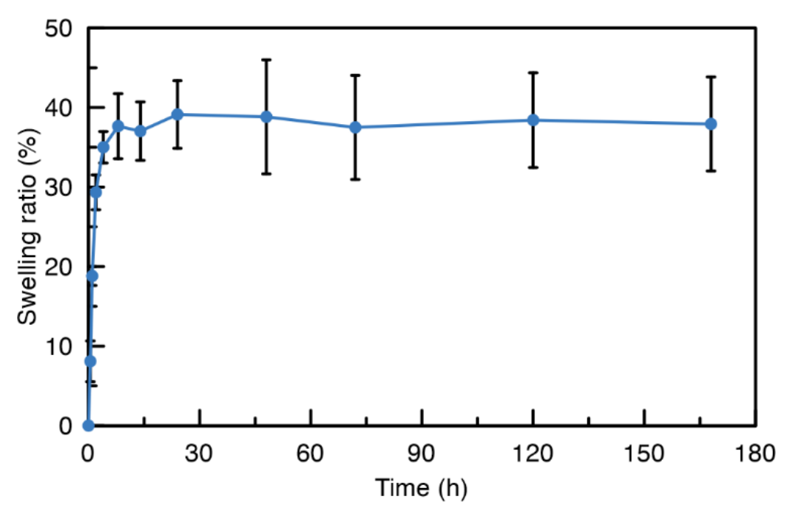

Fig. S25. Swelling behavior of alginate US-gel. Swelling properties of alginate US-gel in DI water over a 7-day period. The error bars in the figures indicate the standard deviation from the mean (n=3).

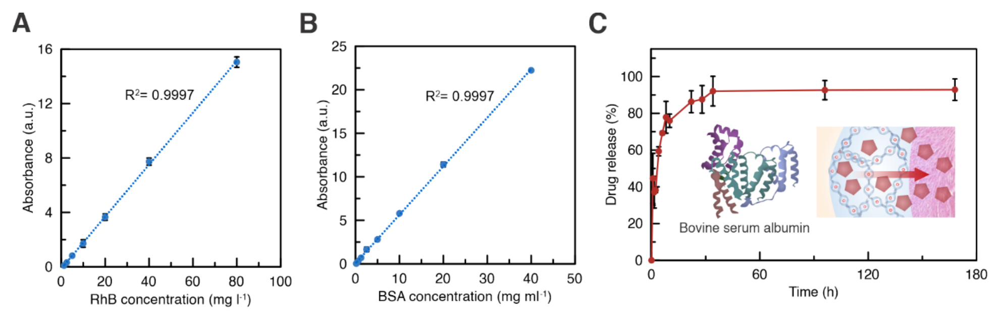

Fig. S26. Drug release from US-gel. (A and B) Calibration curves for determining the concentration of rhodamine B (RhB) (A) and bovine serum albumin (BSA) (B). (C) Continuous release of BSA, used as a large drug model, from biocarrier US-gels for drug delivery applications. The error bars in the figures indicate the standard deviation from the mean (n=3).

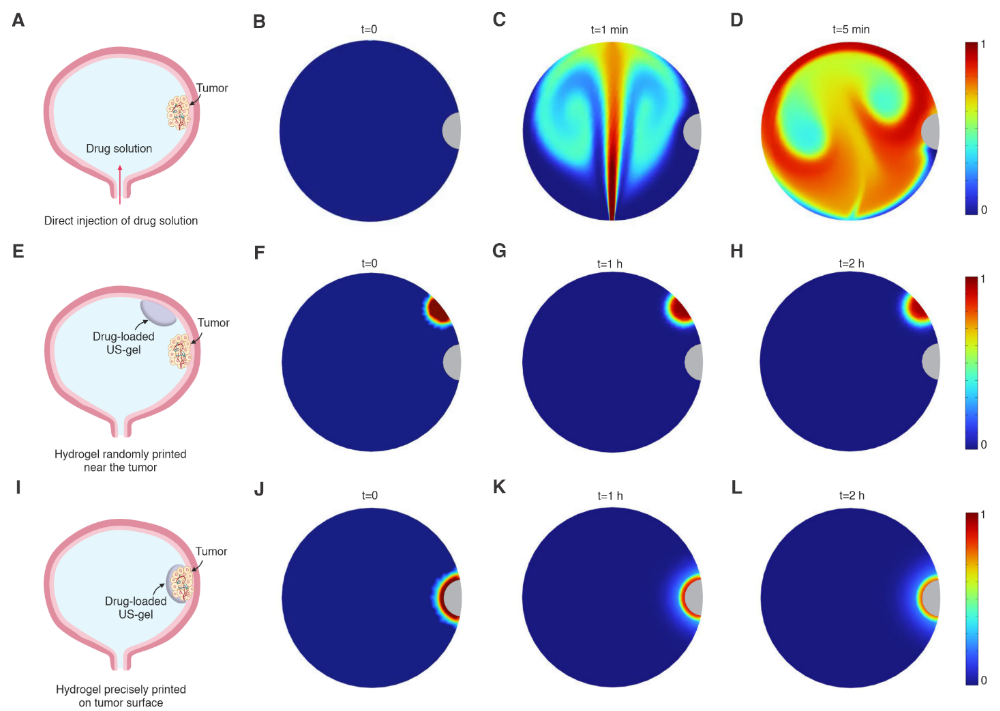

Fig. S27. Drug delivery for tumor treatment. (A to L) Simulation of drug distribution for direct injection (A to D), random printing of drug-loaded hydrogel on the bladder surface (E to H), and precise printing of drug-loaded hydrogel on the tumor (I to L).

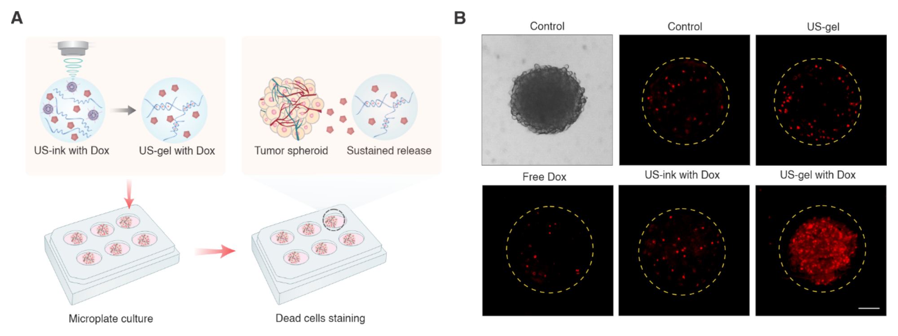

Fig. S28. In vitro evaluation of drug release from US-gels. (A) 3D tumor spheroids were cultured in a microplate with a cell-repellent surface to simulate the 3D microenvironment of the tumor and then exposed to doxorubicin (Dox)-encapsulated US-gel for sustained drug release. (B) Tumor spheroids were exposed to US-gel, free Dox, US-ink with Dox, and US-gel with Dox to assess tumor cell viability by measuring the proportion of dead cells after 3 days, with media refreshed regularly. Scale bar, 100 μm.

DISP-printed US-gels can also function as biocarriers, capable of encapsulating a wide range of small and large molecules and thus enabling targeted in vivo printing of therapeutics at the desired location for sustained and localized drug delivery (Fig. 4, E and F, and figs. S25 to S27). In vitro studies with 3D tumor microspheroids revealed substantially greater cell death after exposure to doxorubicin (Dox)-loaded US-gels compared with the free drug administration. This enhanced therapeutic effect persisted for 3 days, even after multiple media changes, simulating more realistic in vivo conditions (fig. S28).

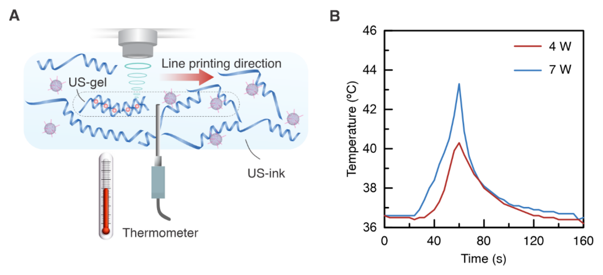

Fig. S29. Temperature evaluation of US-ink during printing process. (A) A wire thermocouple was embedded within the US-ink, and a line was sound-printed so that the focal point of the transducer passed across the thermocouple, enabling the measurement of temperature changes at a specific point on the printed line. (B) Local temperature changes at a point on the sound-printed lines, printed using an 8.75 MHz transducer at a speed of 10 mm min−1.

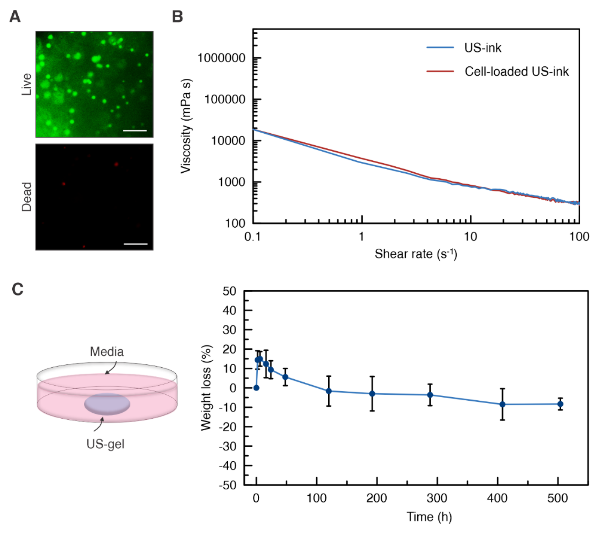

Fig. S30. Biocompatibility and rheological properties of US-gel. (A) The live/dead images of cell-laden US-gel just after ultrasound printing. Scale bars, 100 µm. (B) Rheological properties of the cell-laden US-ink with a cell density of 3 × 106 cells ml−1. (C) Alginate US-gel in DMEM media over a 3-week period. The error bars in the figures indicate the standard deviation from the mean (n=4).

DISP enables minimally invasive tissue regeneration through in vivo printing of cell-laden hydrogels directly into affected areas. Patterns of cell-laden alginate US-gels were printed at low ultrasound amplitudes, ensuring safe temperature conditions for the cells (fig. S29). The printed cells exhibited high viability for 7 days after printing (Fig. 4, G to I, and fig. S30A), with no substantial cytotoxic effect on morphology or function. Additionally, incorporating cells into the US-ink did not notably alter the prepolymer’s rheological properties (fig. S30B). To evaluate the stability of the US-gel, its swelling and degradation in cell media was assessed (fig. S30C). This advance opens new possibilities for minimally invasive tissue regeneration deep within the body.

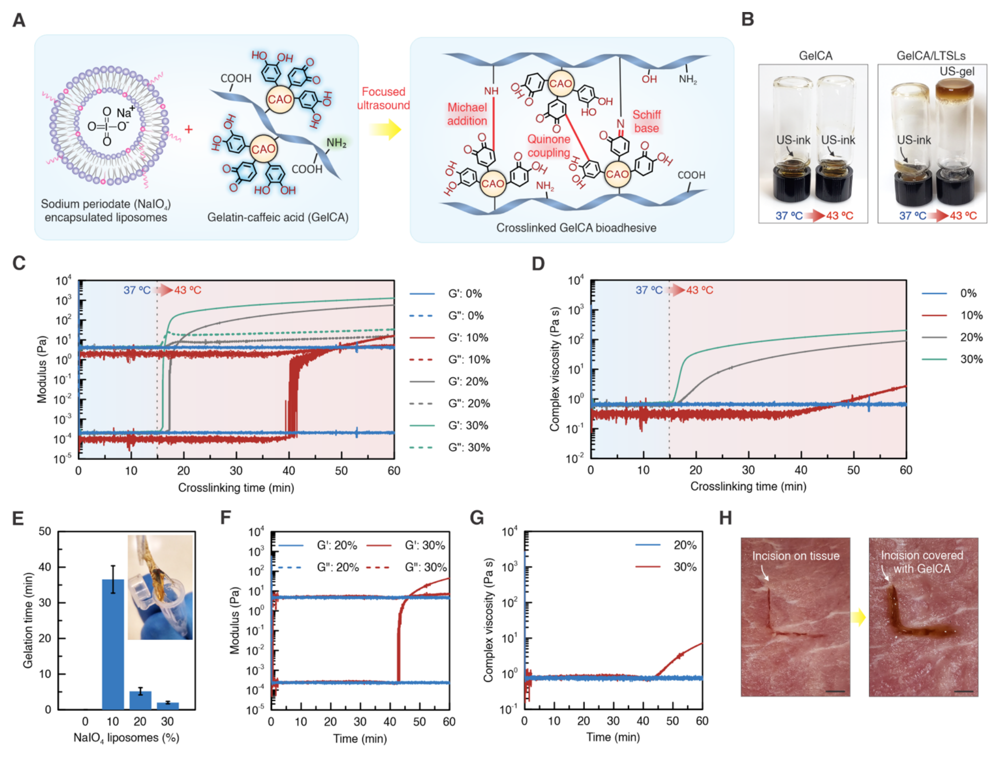

Fig. S31. Characterization of crosslinking in bioadhesive GelCA US-ink. (A) NaIO4 is encapsulated within the LTSLs and mixed with GelCA prepolymer to create bioadhesive US-ink. (B) Effect of adding NaIO4-LTSLs on GelCA crosslinking. (C to D) Crosslinking behavior (C) and complex viscosity (D) of GelCA US-ink with various LTSL concentrations upon mild heating. (E) Gelation time of the GelCA US-ink is evaluated for different LTSL concentrations. (F to G) Rheological behavior (F) and complex viscosity (G) of GelCA US-ink with various LTSL concentrations at 37 °C. (H) An illustration of GelCA US-gel used for covering incision on tissue. Scale bars, 4 mm. The error bars in the figures indicate the standard deviation from the mean (n=3).

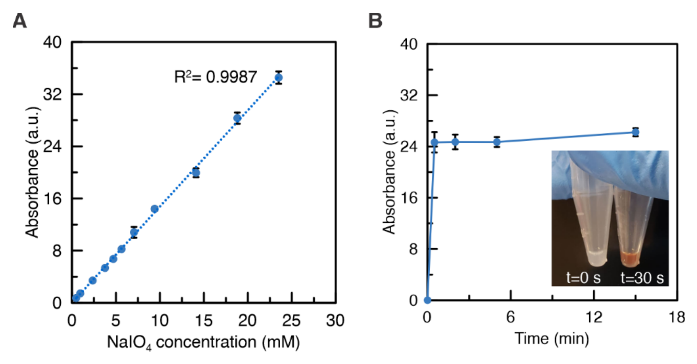

Fig. S32. Characterization of NaIO4-encapsulated LTSLs. (A) Calibration curve used to determine the concentration of released NaIO4. (B) Release profile of NaIO4 from NaIO4-encapsulated liposomes upon mild heating at 43°C. Inset, images of NaIO4-encapsulated LTSLs before and after 30-s mild heating after exposure to dopamine. The error bars in the figures indicate the standard deviation from the mean (n=3).

In vivo printing of bioadhesives offers a noninvasive approach to seal tissue ruptures and lacerations, enabling on-demand formation of bioadhesive patterns over wounds of various shapes. To achieve this, we developed a prepolymer solution of catechol-modified gelatin-caffeic acid conjugates (GelCA) (34), with sodium periodate (NaIO4) encapsulated in the LTSLs to form GelCA US-ink. Upon FUS exposure, NaIO4 was released, triggering cross-linking and forming a tissue-adhesive hydrogel (Fig. 4J and fig. S31A). NaIO4 was released from LTSLs within 30 s of mild heating at 43°C (fig. S32), producing GelCA US-gel with increased bioadhesion strength (Fig. 4, K and L). The optimal NaIO4 LTSL concentration of 20% ensured effective cross-linking without premature gelation after 1 hour at 37°C (fig. S31).

Additionally, the typically nonadhesive alginate US-inks developed adhesive properties when printed using higher US amplitudes and extended exposure times, aligning with literature reports on US-induced adhesion (35). The ultrasound facilitates the integration of the prepolymer into the tissue, followed by in situ cross-linking, which enhances the mechanical interlocking of alginate US-gels within the tissue (Fig. 4, M and N).

## In vivo evaluation of DISP printing in live animals

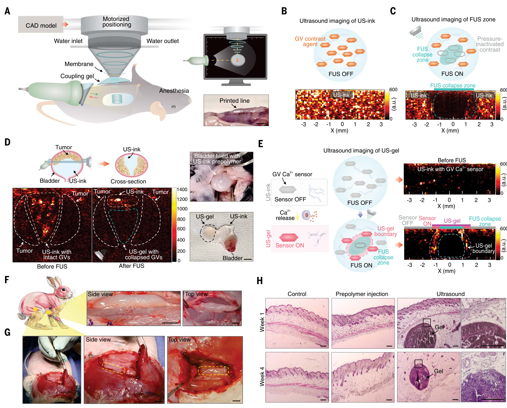

Fig. 5. Imaging-guided deep tissue sound printing in vivo. (A) Setup for sound printing in vivo in live animals, employing ultrasound imaging for precise targeting. (Inset) A linear pattern printed in vivo in a mouse. Scale bar, 4 mm. (B and C) Schematic of AM-mode ultrasound imaging with a GV contrast agent used to monitor US-ink distribution in vivo (B) and to ensure precise targeting (C). Ultrasound image inset in (C): A line of GV-integrated alginate US-ink printed and imaged in a cross section. GVs in areas not exposed to FUS remained intact whereas those exposed to FUS collapsed. (D) In vivo printing of US-gels on a tumor site in the bladder of an anesthetized mouse. Successful targeting confirmed by GV collapse. After printing, the mouse bladder was extracted to verify successful printing. Scale bar, 4 mm. (E) In situ Ca2+ sensing using GV Ca2+ sensors integrated into alginate US-inks, designed to activate upon exposure to Ca2+. A line was printed and imaged in a cross section using AM-mode ultrasound imaging. Higher pressures in the center of the printed line led to partial collapse of GV Ca2+ sensors whereas GV Ca2+ sensors at the boundary of the printed US-gel were activated, confirming the shape. (F) US-gel line printed using a 2.65 MHz FUS at 11 W and 15 mm min−1 on the abdominal muscle in a rabbit model. Scale bars, 5 mm. (G) The US-gel line printed deep into the adductor muscle and below the biceps femoris muscle using 2.65 MHz FUS at 20 W and 10 mm min−1. Scale bars, 5 mm. (H) In vivo biocompatibility study of US-ink injected intradermally and ultrasound-printed US-gel in mice, assessed through hematoxylin and eosin (H&E) staining of skin tissues at 1 week and 4 weeks after printing. Scale bars, 200 μm.

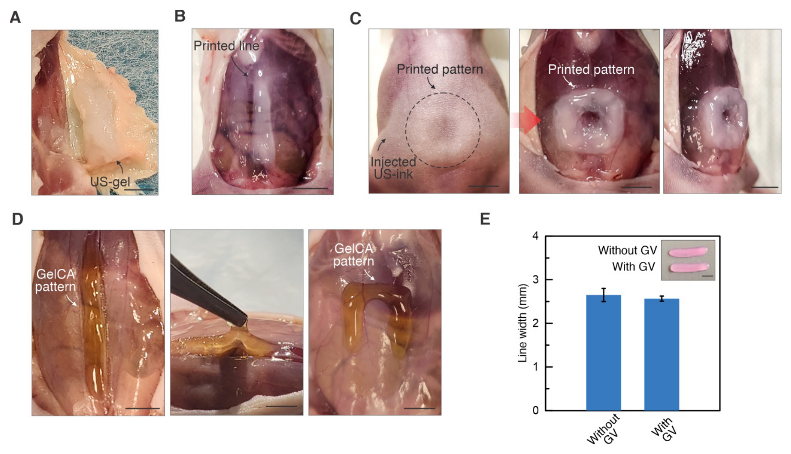

Fig. S33. Minimally invasive printing of alginate US-gel patterns in vivo in mice. (A) In vivo gelation of US-ink by DISP. Scale bar, 5 mm. (B) DISP-printed alginate US-gel line on the mouse’s abdomen using a 2.65 MHz transducer at 17 W and printing speed of 20 mm min−1. Scale bar, 5 mm. (C) DISP-printed alginate US-gel pattern printed on the mouse’s abdomen using a 2.65 MHz transducer at 17 W and printing speed of 20 mm min−1. The left image shows the abdomen immediately after printing. Scale bars, 5 mm. In all images, the patterns were sound printed minimally invasively in the body. US-ink was injected, and FUS was applied to the target location to form the patterns. After euthanizing, the skin was removed only to confirm successful patterning. (D) GelCA bioadhesive patterns on the mice abdomen. Scale bars, 5 mm. (E) Alginate US-gel lines printed with and without GV addition under the same printing conditions. Scale bar, 3 mm. The error bars in the figures indicate the standard deviation from the mean (n=3).

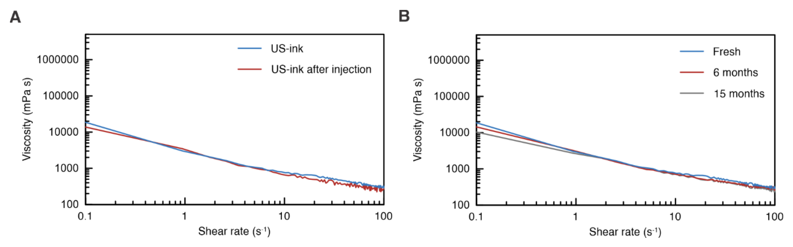

Fig. S34. Effect of injection shear force and shelf-life on the rheological properties of US-ink. (A) Rheological characterization was performed before and after injecting the US-ink through a 25-gauge needle to assess its viscosity and shear-thinning behavior. (B) Rheological properties of fresh alginate US-ink, composed of alginate solution mixed with crosslinker-loaded liposomes, compared to those after 6 months and 15 months post-synthesis stored in 4 °C.

In vivo experiments were conducted using a mouse model (Fig. 5A and fig. S33). The shear force experienced during the in vivo injection of the prepolymer did not substantially affect the rheological properties of the US-ink (fig. S34A). Additionally, the alginate US-ink stored at 4°C exhibited a long shelf life of at least 450 days, reinforcing its suitability for DISP applications (fig. S34B). As a proof of concept, the DISP technique was used to print US-gels in the mouse bladder, with the goal of developing a potential platform for treating severe bladder cancer.

Ultrasound imaging plays a critical role in precisely positioning the prepolymer within deep tissue, which is vital for effective in vivo applications such as tissue regeneration and drug delivery. Accurate targeting, achieved through meticulous calibration of the FUS transducer relative to the imaging transducer, minimizes the risk of off-target effects and prevents unintended exposure of healthy tissues. Moreover, integrating stimuli-responsive GV contrast agents and GV Ca2+ sensors with US-ink provides real-time feedback during the printing process (26, 36). This integration confirms US-gel formation, monitors print shape, and tracks cross-linking dynamics. Compared with magnetic resonance imaging-guided techniques used for temperature evaluation at the focal point, GVs offers direct visualization of the printed US-gel (37, 38). Integrating a stimuli-responsive GV contrast agent with prepolymer led to a high contrast allowed for easy visualization of the US-ink using amplitude-modulation (AM) mode ultrasound imaging (27). The inclusion of GVs not only facilitated accurate bioink delivery to the bladder but also enabled confirmation of gel formation upon FUS exposure, as the collapse of GVs indicated successful targeting (Fig. 5, B and C). This capability enables precise printing directly onto the diseased area of the organ, and the presence of GVs in the US-ink had a negligible effect on printing resolution (fig. S33E).

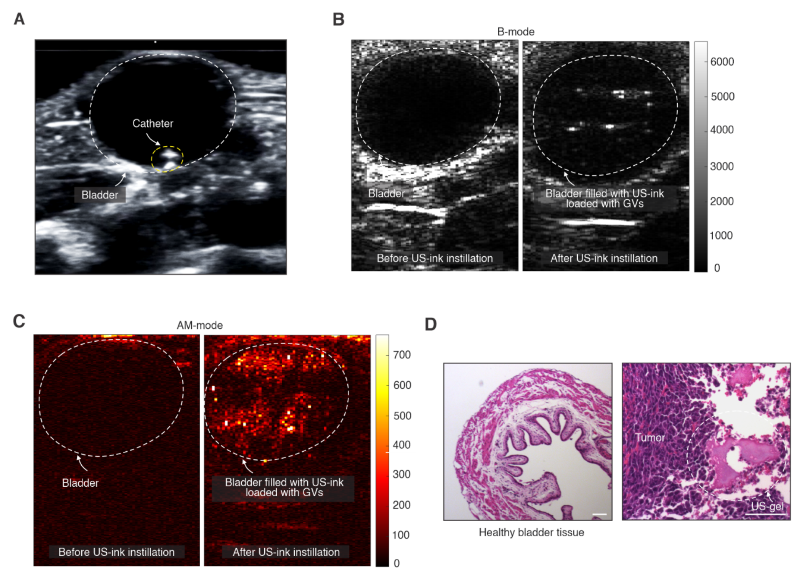

Fig. S35. In vivo ultrasound imaging of the mouse bladder. (A) B-mode ultrasound imaging used to confirm the successful catheter instillation into the bladder before injecting the US-ink. (B and C) B-mode (B) and AM-mode (C) ultrasound imaging of the mouse bladder before and after instillation of the US-ink. (D) H&E staining of bladder tissues after DISP-based printing of US-gel near the tumor, showing healthy and tumor-incorporated tissues. Scale bars, 100 µm.

DISP was further explored for localized drug delivery, in which drug-loaded US-gels were printed near the tumor site. Ultrasound imaging was employed to monitor the printing process while the animal was under anesthesia. The catheter’s position was monitored using B-mode ultrasound imaging to ensure successful instillation before injecting the US-ink into the bladder (fig. S35A). FUS was then applied to target the US-ink near the tumor, leading to the collapse of some GVs, confirming effective targeting. Clear US-gel was observed from the abdomen of the sacrificed animal, confirming successful in vivo printing (Fig. 5D and fig. S35).

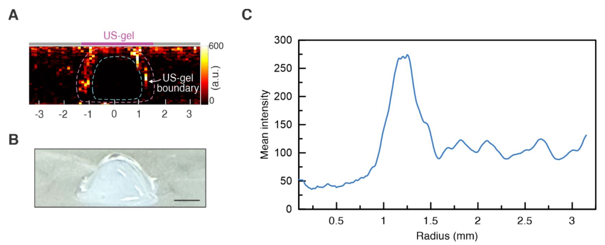

Fig. S36. In situ monitoring of the printed pattern. Printed US-gel pattern visualized using AM mode ultrasound imaging with GV Ca2+ sensors incorporated within the US-ink. (A and B) AM mode imaging (A) and cross-sectional image (B) of the printed line. Scale bar, 1 mm. (C) Radial intensity profile showing the cross-sectional radius of the printed line.

To further assess the Ca2+ release zone and determine the size and shape of the printed US-gel in situ, GV Ca2+ sensors were incorporated into the US-ink (39). These sensors remained inactive during AM mode imaging but became activated upon FUS-induced Ca2+ release, producing noticeable contrast (Fig. 5E and fig. S36). At higher ultrasound amplitudes, some GV Ca2+ sensors collapsed at the center of the printed structure, where maximum pressure was applied, whereas the boundary of the printed US-gel remained clearly distinguishable.

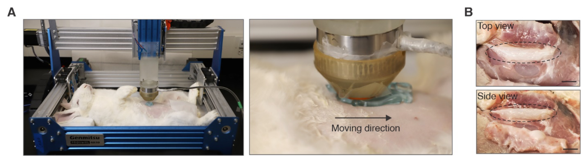

Fig. S37. Ex vivo sound printing in rabbits. (A) A cone has been used for DISP setup. (B) US-gel line printed on the abdominal muscle.

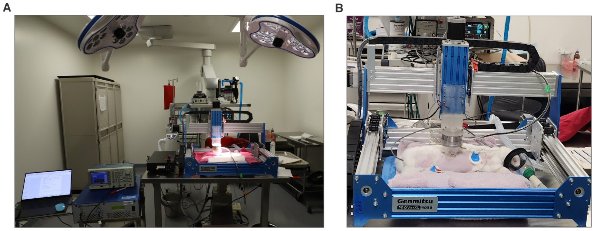

Fig. S38. In vivo sound printing in rabbits. (A) DISP setup for in vivo sound printing of US-gel patterns in a rabbit within the surgery room. (B) Line printing via DISP while the rabbit is under anesthesia.

**Movie S2.** In vivo sound printing in a live rabbit. Alginate US-gel line printing using 2.65 MHz FUS on the abdominal muscle of an anesthetized rabbit. The video is sped up 2.5x.

To demonstrate in larger animal models, both ex vivo and in vivo experiments were conducted on rabbits (Fig 5, F and G, figs. S37 and S38, and movie S2). Successful in vivo printing was achieved on the exposed abdominal muscle, deep within the adductor muscle, and beneath the biceps femoris muscle, highlighting the ability to target deeper tissue layers for applications such as tissue replacement.

Practical in vivo printing faces challenges such as tissue heterogeneity and dynamic environments that affect ultrasound absorption and cross-linking. Minimal disruption from tissue movement was observed during experiments under anesthesia, but printing on dynamic organs such as the lungs or heart remains challenging. GV Ca2+ sensors, coupled with AM ultrasound imaging, enable real-time monitoring and adjustment of printing parameters to address these challenges. Future advancements, such as machine learning–based adaptive transducer positioning, could further enhance precision in complex scenarios such as cardiac printing.

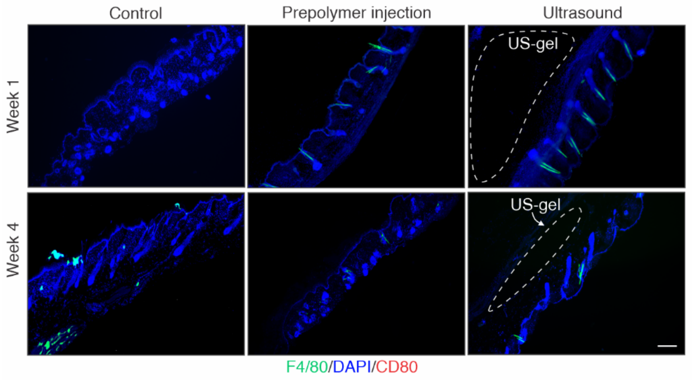

Fig. S39. In vivo study of the immunomodulatory effects. Evaluation of skin tissues following intradermal injection of US-ink and DISP-based printing of US-gel in mice, assessed at one week and four weeks post-printing. Immunofluorescent staining of F4/80 (green), CD80 (red), and 4′,6-diamidino-2-phenylindole (DAPI) (blue). Scale bar, 200 μm.

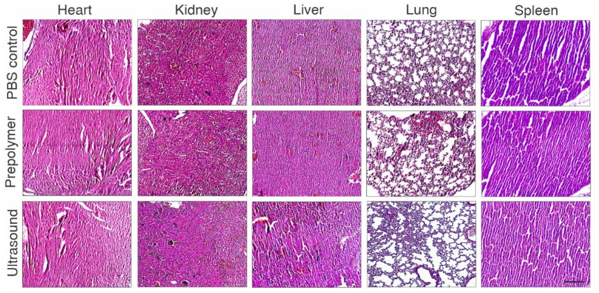

Fig. S40. In vivo biocompatibility of US-ink and Us-gel. H&E staining of tissues from various organs at four weeks post-printing to assess biocompatibility. Scale bar, 200 μm.

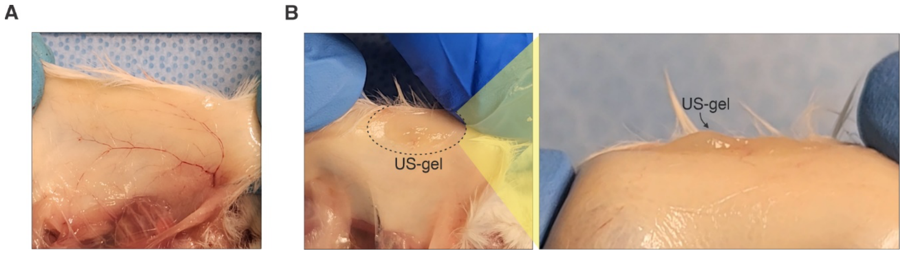

Fig. S41. In vivo evaluation of US-ink and US-gel one week post-printing. (A and B) Intradermally injected US-ink (A) and ultrasound printed US-gel (B) in mice, assessed one week after the procedures. The US-ink was not detected at the injection site, while the US-gel remained visible at the printed location.

In vivo biocompatibility analyses, conducted through hematoxylin and eosin (H&E) and immunofluorescent staining, confirmed biocompatibility of both the US-ink and resulting US-gel (Fig. 5H and fig. S39). H&E staining showed no tissue damage or abnormal immune cell infiltration whereas immunofluorescent staining revealed minimal proinflammatory activity and macrophage infiltration. CD80 markers showed no significant increase in proinflammatory activity and F4/80 markers indicated macrophage distribution consistent with normal physiological remodeling, without excessive or clustered immune responses. No signs of toxicity were observed, and tissues from other organs showed no notable changes (fig. S40). In the group that received only the US-ink injection, the US-ink was completely cleared by the body in 7 days. However, in the group exposed to FUS, the US-gel persisted (fig. S41).

## Conclusions

Ultrasound-guided in vivo sound printing using cross-linking agent–loaded LTSLs enables precise, high-speed, high-resolution fabrication of functional biostructures deep within the body. A wide range of bioinks—including conductive, drug-loaded, cell-laden, and bioadhesive formulations—were designed utilizing diverse cross-linking chemistries. Real-time ultrasound imaging ensures precise targeting and controlled in situ cross-linking. Both in vitro and in vivo studies confirmed high biocompatibility of both prepolymers and printed hydrogels. As a proof of concept, in vivo printing was successfully demonstrated in the mouse bladder and rabbit leg muscles, showcasing its potential for targeted therapeutic interventions and tissue replacement.

## REFERENCES AND NOTES

1. S. S. Robinson et al., Nat. Biomed. Eng. 2, 8–16 (2018).

2. I. M. Lei et al., Nat. Commun. 12, 6260 (2021).

3. Y. Bao, N. Paunović, J. Leroux, Adv. Funct. Mater. 32, 2109864 (2022).

4. D. Joung et al., Adv. Funct. Mater. 30, 1906237 (2020).

5. A. C. Weems, M. C. Arno, W. Yu, R. T. R. Huckstepp, A. P. Dove, Nat. Commun. 12, 3771 (2021).

6. Z. Luo et al., Adv. Funct. Mater. 34, 2309173 (2024).

7. Y. Wu et al., Adv. Funct. Mater. 34, 2313088 (2024).

8. N. M. Larson et al., Nature 613, 682–688 (2023).

9. J. T. Toombs et al., Science 376, 308–312 (2022).

10. A. K. Gaharwar, I. Singh, A. Khademhosseini, Nat. Rev. Mater. 5, 686–705 (2020).

11. E. Davoodi et al., Adv. Healthc. Mater. 11, e2102123 (2022).

12. Y. Song et al., Sci. Adv. 9, eadi6492 (2023).

13. T. Zhou et al., Nat. Mater. 22, 895–902 (2023).

14. J. Wang et al., Adv. Drug Deliv. Rev. 174, 294–316 (2021).

15. Q. Ge et al., Sci. Adv. 7, eaba4261 (2021).

16. C. Wang et al., Nat. Rev. Mater. 9, 550–566 (2024).

17. S. J. Wu et al., Nat. Commun. 15, 1215 (2024).

18. Z. Zhu, H. S. Park, M. C. McAlpine, Sci. Adv. 6, eaba5575 (2020).

19. C. Zhou et al., Nat. Commun. 12, 5072 (2021).

20. A. Urciuolo et al., Nat. Biomed. Eng. 4, 901–915 (2020).

21. Y. Chen et al., Sci. Adv. 6, eaba7406 (2020).

22. Y. S. Zhang, A. Dolatshahi-Pirouz, G. Orive, Science 385, 604–606 (2024).

23. M. Habibi, S. Foroughi, V. Karamzadeh, M. Packirisamy, Nat. Commun. 13, 1800 (2022).

24. M. Derayatifar, M. Habibi, R. Bhat, M. Packirisamy, Nat. Commun. 15, 6691 (2024).

25. X. Kuang et al., Science 382, 1148–1155 (2023).

26. M. G. Shapiro et al., Nat. Nanotechnol. 9, 311–316 (2014).

27. D. Maresca, D. P. Sawyer, G. Renaud, A. Lee-Gosselin, M. G. Shapiro, Phys. Rev. X 8, 041002 (2018).

28. V. Nele et al., Adv. Mater. 32, e1905914 (2020).

29. D. Needham, J.-Y. Park, A. M. Wright, J. Tong, Faraday Discuss. 161, 515–534, discussion 563–589 (2013).

30. T. Ta, T. M. Porter, J. Control. Release 169, 112–125 (2013).

31. C. M. I. Quarato et al., Diagnostics (Basel) 13, 855 (2023).

32. R. Cuccaro, C. Magnetto, P. A. G. Albo, A. Troia, S. Lago, Phys. Procedia 70, 187–190 (2015).

33. D. M. Najjar, E. J. Cohen, C. J. Rapuano, P. R. Laibson, Am. J. Ophthalmol. 137, 1056–1064 (2004).

34. H. Montazerian et al., Cell Rep. Phys. Sci. 4, 101259 (2023).

35. Z. Ma et al., Science 377, 751–755 (2022).

36. D. Wu et al., Sci. Adv. 9, eadd9186 (2023).

37. M. de Smet, E. Heijman, S. Langereis, N. M. Hijnen, H. Grüll, J. Control. Release 150, 102–110 (2011).

38. N. Hijnen et al., Proc. Natl. Acad. Sci. U.S.A. 114, E4802–E4811 (2017).

39. Z. Jin et al., Ultrasonic reporters of calcium for deep tissue imaging of cellular signals. bioRxiv 2023.11.09.566364 [Preprint] (2023); https://doi.org/10.1101/2023.11.09.566364

## Acknowledgments

Fluorescence microscopy was performed at the Advanced Light Microscopy/Spectroscopy Laboratory and Leica Microsystems Center of Excellence at the California NanoSystems Institute at UCLA (RRID:SCR\_022789) with funding support from NIH Shared Instrumentation grant S10OD025017 and NSF Major Research Instrumentation grant CHE-0722519. The TEM imaging was supported by the BioPACIFIC Materials Innovation Platform of the National Science Foundation under award DMR-1933487 and by the National Institutes of Health under award S10OD18111. Funding: This work was funded by the following: National Institutes of Health grants R01DC021461 and R01HL155815 (to W.G.); American Cancer Society grant RSG-21-181-01-CTPS (to W.G.); Heritage Medical Research Institute (to W.G.); National Institutes of Health grant T32EB023858 (to E.D.); National Institutes of Health grant T32GM145388 (to S.S.N.); Challenge Initiative at UCLA (to P.S.W.) Author contributions: Conceptualization: E.D. and W.G. Methodology: E.D. and W.G. Investigation: E.D., J.L., X.M., A.H.N., J.Y., G.L., E.S.S., S.L., H.M., G.K., J.W., J.W.Y, Y.Z., L.S.L., Z.J., B.S., S.S.N. Funding acquisition: W.G. Supervision: W.G., L.V.W., T.K.H., P.S.W., Q.Z., A.K., D.W., and M.G.S. Writing - original draft: E.D. and W.G. Writing - review & editing: All authors. Competing interests: W.G. is a cofounder and advisor at Persperity Health. L.S.L. has a financial interest in BLOCH Quantum Imaging Solutions, although the latter did not support this work. W.G. and E.D. are inventors on patent application US18/444,514, submitted by the California Institute of Technology. Data and materials availability: The customized finite element analysis code used for thermal simulations of the ultrasound printing process is available upon request. All other data are available in the main text or the supplementary materials. License information: Copyright © 2025 the authors, some rights reserved; exclusive licensee American Association for the Advancement of Science. No claim to original US government works. https://www.science.org/about/science-licenses-journal-article-reuse

## Supplementary Materials

science.org/doi/10.1126/science.adt0293 Materials and Methods; Figs. S1 to S41; Tables S1 to S3; References (40, 41); MDAR Reproducibility Checklist; Movies S1 and S2

Submitted 8 September 2024; accepted 3 March 2025

10.1126/science.adt0293

CORRECTED 9 MAY 2025; SEE BELOW

This PDF file includes:

Materials and Methods

Figs. S1 to S41

Tables S1 to S3

References

Other supplementary material for this manuscript includes the following:

MDAR Reproducibility Checklist

Movies S1 and S2

Correction: An error during the publication process resulted in the main supplementary file not being posted; this has been corrected and the complete SM is now available.

## Materials and Methods

### Materials

Sodium alginate (W201502), calcium chloride (CaCl2, C1016), gelatin from porcine skin (G2500), caffeic acid (CA), ethylenediaminetetraacetic acid (EDTA), sodium chloride (NaCl), ammonium persulfate (APS), poly(ethylene glycol) diacrylate (average molecular weight ~700 Da), N,N,N′,N′-tetramethylethylenediamine (TEMED), bovine serum albumin, Triton X-100, dopamine hydrochloride, and sodium periodate (NaIO4) were acquired from Sigma-Aldrich. 1-Ethyl-3-(3-dimethylaminopropyl)carbodiimide (EDC) and N-hydroxysuccinimide (NHS) were purchased from TCI Chemicals, USA. Chloroform and agarose were acquired from Fisher Scientific. Dulbecco’s phosphate-buffered saline (PBS) and rhodamine B (RhB) were supplied by Thermo Fisher Scientific, USA. Lipids were purchased from Avanti Polar Lipids, Inc. Fura-2 AM ester was purchased from Biotum, USA. Sylgard 184 polydimethylsiloxane silicone elastomer was supplied by DOW Inc., USA.

### Synthesis of low temperature sensitive liposomes (LTSLs)

The LTSLs were prepared using a lipid composition of 1,2-dipalmitoyl-sn-glycero-3-phosphocholine (DPPC), 1-stearoyl-2-hydroxy-sn-glycero-3-phosphocholine (MSPC), and 1,2-distearoyl-sn-glycero-3-phosphoethanolamine-N-[methoxy(polyethylene glycol)-2000] ammonium salt (DSPE-PEG-2000). A lipid mixture in an 86:4:10 molar ratio of DPPC, MSPC, and DSPE-PEG-2000 was dissolved in chloroform. The organic solvent was then evaporated using a rotary evaporator under a stream of nitrogen gas, forming a thin layer of lipid on the glass walls of the flask. The flask was left in the fume hood for 4 h to ensure full removal of chloroform. Then, a 500 mM CaCl2 solution was added to rehydrate the lipid film for 1 h at 55 °C, followed by vigorous stirring, resulting in Ca2+ encapsulation at a concentration of 240 mg dl−1 of liposomes. Notably, higher CaCl2 concentrations in the hydrating solution can destabilize the lipid bilayer, thereby reducing encapsulation efficiency. To produce and size unilamellar liposomes, the solution was extruded through a polycarbonate membrane (Whatman® Nucleopore TrackEtched™ membranes) using a jacketed liposome extruder (Genizer LLC, USA) for at least 10 cycles at 55 °C. The liposomal solution was then stored at 4 °C. To remove the free CaCl2 and form liposome pellets, the solution underwent three centrifuge washes at 22,700 g for 90 min each. A similar process was used for the liposomes encapsulating other crosslinking agents. Rehydrating the dry lipid film in 47 mM NaIO4 or 50% v/v TEMED led to the formation of NaIO4-encapsulated and TEMED-encapsulated liposomes, respectively.

### Synthesis of US-ink

Ultrasound-responsive prepolymers, termed US-ink, were formulated by mixing liposome pellets with various prepolymers. Alginate US-ink was formed by mixing 2.5 wt.% alginate with varying amount of Ca2+-loaded LTSLs, followed by degassing. For PEGDA US-inks, PEGDA solutions were mixed with varying amounts of TEMED-encapsulated liposomes and ammonium persulfate (APS) to obtain a final concentration of 0.5 wt.% APS. In this mixture, APS served as the initiator, while the TEMED LTSLs acted as the catalyst. The amount of LTSLs was optimized based on subsequent rheological tests and crosslinking mechanism characterization.

Conductive alginate US-inks were prepared by adding a conductive additive—such as graphite, carbon nanotubes (CNTs), silver nanowires, or MXene (12)—at a final concentration of 5 wt.%, along with 50 wt.% of Ca2+-loaded LTSLs. To further enhance the conductivity, Ag nanowires (0.5 wt.%) were added to the conductive US-ink composition with CNT additives. For PDMS patterns, a PDMS base prepolymer was mixed with its curing agent in a 10:1 ratio and printed using an 8.75 MHz transducer at 20 W and 100 mm min−1, unless otherwise specified. To enhance visualization, an oil-based dye was mixed with the base prepolymer at a concentration of 2 wt.%.

### Sound in vivo printing setup

The sound in vivo printing setup consists of a single element FUS transducer (H-102 and H-108, Sonic Concepts, USA), operating at frequencies of 1.1, 2.65, and 8.75 MHz. Initially, a Panametrics 5072PR pulser-receiver was used to excite the transducer with a short electrical pulse, and the received signal was monitored with an oscilloscope (Rigol DS1054, UltraVision Tech.) to determine the focal point of the FUS transducer. The FUS transducer was mounted on a motorized positioning system, which provided precise 3D spatial control and adjustable movement speed. The transducer was driven by a function generator (AFG3252, Tektronix, Beaverton, OR) and the signals were amplified by an RF power amplifier (A075, Electronics and Innovation, Rochester, NY), with the output power displayed on the amplifier. For the 8.75 MHz frequency, a matching network was used to connect the RF power amplifier to the FUS transducer, optimizing the transmitted power. The transducer’s movement followed a G-code to form desired patterns, with the power and printing speed adjustable either beforehand or programmatically during the printing process. For most characterizations, unless otherwise specified, the US-ink was transferred into a 2 mm thick frame, covered on both sides with TPX® Polymethylpentene film (CS Hyde Co., USA), and secured using double-sided adhesive. The setup was then placed on a 2 mm thick, 2 wt.% agarose substrate to simulate tissue and exposed to ultrasound.

The lines were printed using continuous-wave focused ultrasound at various frequencies and amplitudes. Ink tanks of various depths were used depending on the printed samples; however, a focus-boundary lateral distance of at least 10 mm in the X-Y plane was maintained under all conditions to avoid any reflection or absorption by the tank walls. Additionally, the samples were inspected to ensure no undesired crosslinking occurred on the tank walls. The ink tank was enclosed with ultrasound-transparent membranes on both the top and bottom.

For temperature-related characterizations, a thermocouple data logger (TC-08, Pico Technology, Cambridgeshire, UK) was employed to monitor the temperature at the focal point of the FUS transducer during printing. All the printed patterns are created in a water bath maintained at 37 °C to simulate human body temperature, unless otherwise specified. Uniaxial compression testing of the US-gel was performed using a force gauge (Mark-10) at a rate of 2 mm min−1 on disk-shaped samples with a diameter of 6 mm and a thickness of 3.7 mm.

### Preparation of gas vesicles (GVs)

GV samples were prepared according to previously published protocols (40). Briefly, Wildtype GVs from Anabaena flos-aquae were stripped of their native outer layer of GvpC by treatment with 6 M of urea solution buffered with 100 mM of Tris-HCl (pH: 8–8.5). Two rounds of centrifugally assisted floatation at 300 g for 4 h in 4°C with removal of the subnatant liquid after each round were performed to ensure complete removal of native GvpC.

### Preparation of GV Ca2+ sensors

Ca2+ responsive GvpC (34, URoC1-EF4KO) was expressed and purified following similar protocol as published in previous work (40). Briefly, the plasmid encoding the Ca2+ responsive GvpC was transformed to chemically competent BL21(DE3) cells (Invitrogen) and grew overnight for 14–16 h at 37 °C in 5 ml starter cultures of 2xYT medium with 50 µg ml−1 of kanamycin. Starter cultures were diluted 1:100 in auto-induction Terrific Broth (Novagen 71491) with 50 µg ml−1 of kanamycin and were incubated at 30 °C (250 revolutions per minute (RPM) shaking) for 20-24 h. Cells were then collected by centrifugation at 5,000 g. GvpC was purified from inclusion bodies by lysing the cell pellet at room temperature using SoluLyse (Amsbio L200500), supplemented with lysozyme (400 µg ml−1) and DNase I (10 µg ml−1). Inclusion body pellets were isolated by centrifugation at 15,000 g for 10 min then resuspended in a solubilization buffer (20 mM Tris-HCl, 500 mM NaCl, 6 M urea, pH 8.0) before incubation with Ni-NTA resin (Qiagen) for 2 h at 4 °C for His-tag purification. The wash and elution buffers consisted of the same composition as the solubilization buffer but with 20 mM and 250 mM of imidazole, respectively.

The engineered GvpCs were then added to the stripped GVs in 6 M of urea in twofold molar excess according to the formula: 2 × OD500 × 480 nM × volume of GVs (in liters). The mixture of stripped GVs (OD500 = 4-5) and engineered GvpC in 6 M of urea buffer was loaded into regenerated cellulose dialysis membrane with a 6–8 kDa molecular weight cutoff (Spectra/Por® 132675T) and was allowed to refold slowly through dialysis in PBS for at least 12 h at 4 °C. The final recombinant GVs were resuspended in PBS after subnatant removal and quantified using pressure-sensitive OD measurements at 500 nm using a NanoDrop.

### Ultrasound imaging of GVs and GV Ca2+ sensors

GVs were imaged with a linear array probe (Verasonics, L22-14vX) using Verasonics Vantage ultrasound system. B-mode and AM images were acquired using parabolic B-mode (pB-mode, focus = 10 mm, aperture = 4 mm) and cross-propagating amplitude modulation (27) (xAM, angle = 19.5 degrees, aperture = 6.5mm) sequences, respectively. The input voltage to the transducer was adjusted each time to prevent GVs from collapsing during imaging. Both B-mode and AM images used 64 ray lines. The center frequency, on-time duty cycle, and number of half-cycles were 15.625 MHz, 0.67, and 2, respectively. Received signals were accumulated 50 times. The time interval between pulse transmissions was 32 µs. The pixel size of the reconstructed images was set to 50 µm laterally and 1 µm axially.

### Transmission electron microscopy

Liposomes were vitrified using a Vitrobot Mark III (TFS) and subsequently imaged using a Spectra 300C (S)TEM (TFS) at 300 kV. Images were captured by a Falcon 3EC direct electron camera (TFS) at a magnification of 37,000x with a defocus of -3 µm.

### Scanning electron microscopy and energy dispersive spectroscopy

The microstructural features were analyzed through scanning electron microscopy (SEM). Prior to imaging, a thin layer of approximately 5 nm of Pt was sputtered onto the surface of the freeze-dried samples. SEM images were taken using a ZEISS 1550VP microscope equipped with an Oxford X-Max SDD X-ray energy dispersive spectrometer system, operating at an acceleration voltage of 10 kV.

### Ca2+ selective fluorescent indicator

A 25% v/v liposomal solution in deionized (DI) water was diluted 50-fold with 50% glycerol in DI water to prepare a 0.5 ml solution. Then, 100 µl of 2 µM Fura-2am ester, a ratiometric fluorescent dye selective for Ca2+, was added to the solution. The mixture was vortexed for 10 min to ensure uniform dispersion and then incubated for 30 min to allow the dye to penetrate the liposome membranes. Two-photon microscopy was performed using a Leica SP8 MP-DIVE microscope. The tunable two-photon laser was set to 680 nm with power setting of ~1.12 W (20% of maximum) for excitation. The transmitted two-photon fluorescence emission channel was set to 470–550 nm. Images were collected using a 40x water immersion objective lens (NA=1.1).

### Dynamic light scattering

A Nano ZS Zetasizer (Malvern Panalytical Ltd, UK) was utilized for dynamic light scattering (DLS) analysis to determine the size distribution and zeta potential of Ca2+-encapsulated LTSLs. The liposomal solutions were analyzed after ultracentrifugation. The LTSL solutions were prepared at a concentration of 0.05% w/v in DI water and loaded into disposable cuvettes (DTS1070, Malvern Panalytical Ltd, UK). The refractive indices were set to 1.331 for the dispersant and 1.45 for the material, respectively, with a material absorption constant of 0.001.

### UV–vis spectroscopy

UV-vis measurements were conducted using a NanoDrop One microvolume UV-vis spectrophotometer (ThermoFisher Scientific, USA) with 2 μl samples from the liposomal solutions. The effect of ultrasound on LTSLs was evaluated after ultracentrifugation. UV-vis analysis was performed on LTSLs dispersed in DI water at a concentration of 30% w/v, both before and after exposure to focused ultrasound at 2.65 MHz and 19 W.

### Quantifying calcium loading into liposomes

To determine the maximum possible release from liposomes (representing the total encapsulated Ca2+), an Arsenazo III assay (LiquiColor® Test, VWR International) was used. Briefly, LTSLs were mixed with an equal volume of 10% v/v Triton X-100 in water and incubated for 30 min at 43 °C, followed by shaking at 1000 RPM. The resulting solution was mixed with 0.1 M NaCl to achieve a final LTSL concentration of 10% v/v. The solution was collected, mixed with Arsenazo reagent, and incubated for 10 min. Then, the absorbance was measured at 650 nm using a microplate reader (BioTek UV-vis Synergy 2, VT, USA). The concentration of Ca2+ in the sample is determined based on the concentration of the standard solution.

### Temperature-induced release of calcium ions

The release of Ca2+ from the Ca2+-loaded LTSLs upon heating was characterized using an Arsenazo III assay. Briefly, 0.1 M NaCl solutions were heated to 43 °C on an Eppendorf shaker. Liposomal solutions were then added to the NaCl to achieve a final LTSL concentration of 10% v/v. 2 μl of the solution were collected at various time points during heating and mixed with 200 µl of Arsenazo reagent. After 10 min of incubation, absorbance was measured at 650 nm. The percentage of Ca2+ release from LTSLs upon heating was obtained using the following equation:

$$\displaystyle \mathit{Calcium\ Release}\,(\%) = \frac{A\_s - A\_0}{A\_t - A\_0} \times 100$$

(1)

where, As, A0, and At represent the absorbance of sample after heating and release, the absorbance of sample at 23 °C or before release, and the absorbance of sample after complete release following Triton X-100 treatment, respectively. In a separate study, solutions of 0.1 M NaCl, 10% v/v Triton X-100, and liposomes were separately added to Arsenazo reagent to confirm that the change in absorbance upon heating the liposomes is solely due to Ca2+ release and not influenced by other agents used in the characterization.

### Temperature-induced release of TEMED and sodium periodate

The release of TEMED from the TEMED-loaded LTSLs was characterized using a 12.5 wt.% dopamine solution. Briefly, DI water was heated to 43 °C on an Eppendorf shaker. Liposomal solutions were then added to the heated water to achieve a final LTSL concentration of 30% v/v. 16 µl of the solution were collected at various time points during heating and mixed with 4 µl of 12.5 wt.% dopamine solution, resulting a final LTSL concentration of 25% v/v. After 10 min of incubation, the absorbance was measured at 320 nm using 2 µl samples.

To determine the maximum possible release from TEMED-loaded LTSLs (representing the total encapsulated capacity), the LTSL was mixed with an equal volume of 10% v/v Triton X-100 in water and incubated for 30 min at 43 °C, followed by shaking at 1000 RPM. 10 µl of this solution was then mixed with 4 µl of 12.5 wt.% dopamine solution and 6 µl of DI water. The percentage of TEMED release from LTSLs upon heating was calculated using the same equation mentioned previously.

To obtain the calibration curve, TEMED solutions of various concentrations were prepared in DI water. 5 µl of each solution were mixed with 4 µl of 12.5 wt.% dopamine solution and 11 µl of water, following the protocol outlined above. UV-vis absorbance was measured after 10 min. A similar process was conducted for the supernatant after centrifugation, instead of the liposomal solution, to confirm the absence of free TEMED molecules. The results were compared to a control PBS. The same process was also followed to assess the release of sodium periodate from NaIO4-loaded LTSLs.

### Rheological tests and crosslinking time

Rheological characterizations were conducted using a MCR 302 rheometer (Anton Paar, Austria) equipped with a parallel-plate measuring system with an 8 mm diameter. The tests were conducted using 75 μl of US-ink solutions with a 0.5 mm gap size. To evaluate the crosslinking behavior of the US-ink, the storage modulus (Gʹ) and loss modulus (Gʹʹ) of the pre-gel solutions were monitored. The US-inks were first equilibrated at 37 °C for 15 min. Subsequently, a linear temperature increase from 37 °C to 43 °C was applied, while Gʹ and Gʹʹ were recorded at a strain amplitude of 10% and a frequency of 1 Hz. The gelation time was determined as the point where the Gʹ and Gʹʹ curves intersected. To evaluate the potential crosslinking of US-ink at body temperature, additional rheological studies were conducted at a fixed temperature of 37 °C. Viscosity measurements were taken at shear rates ranging from 1 to 100 s⁻¹ at room temperature.

### In vitro biocompatibility

Normal adult human dermal fibroblasts cells (HDFs), primary dermal fibroblasts derived from human skin tissue (Homo sapiens), were provided by Lonza. HDF cells were cultured with fibroblast basal medium supplemented with fibroblast growth kit components (ATCC) under 37 °C and 5% CO2. Cells were sub-cultured upon reaching 80% confluence, and all experiments were conducted using cells at passages 4 to 10. Prepolymers of 1.25 wt.% alginate and alginate US-ink were prepared, each with an average volume of 38 µl. Crosslinked disk-shaped samples of 1.25 wt.% alginate (crosslinked by CaCl2 diffusion) and alginate US-gel were also prepared, with the same average volume. Prior to the experiment, all samples were disinfected by washing with 70% ethanol and exposing them to ultraviolet (UV) light for 30 min. Cells were seeded at a density of 1 × 105 cells per well in a 24-well cell culture plate, and the 24-well cell culture inserts containing samples were placed on top. The cells were then treated with growth media and incubated at 37°C with 5% CO2. For the control group, inserts without samples were placed into the wells.

Live/dead cell imaging and viability tests were conducted using the LIVE/DEAD™ Viability/Cytotoxicity Kit (Invitrogen). For cell staining, 0.5 μl ml−1 of calcein AM and 2 μl ml−1 of ethidium homodimer-1 in PBS were added to each well, followed by incubation at 25°C for 15 min. Live cells were labeled green by calcein AM, while dead cells were labeled red by ethidium homodimer-1. After washing the cells twice with PBS, the stained cells were visualized using an Axio Observer inverted microscope (ZEISS). Cell viability was determined using ImageJ software by calculating the percentage of live cells relative to the total number of cells (live + dead).

Metabolic activity of cells was evaluated using PrestoBlue assay (Thermo Fisher Scientific). A total of 500 µl of medium containing 10% v/v PrestoBlue reagent was added to each well, and the cells were incubation at 37 °C for 45 min. After incubation, the PrestoBlue solution from each well was transferred to a new 96-well plate, and the fluorescence was measured at excitation 540 nm/emission 590 nm using a plate reader (BioTek Instruments).

### Swelling characterization of US-gel

To determine the mass swelling ratio, disk-shaped alginate US-gels with a diameter of 7 mm and a thickness of 2 mm were weighed initially. The samples were then incubated in 2.5 ml of DI water at 37 °C. Mass measurements were taken at various time points, and the swelling ratios were calculated based on the measurements.

### Simulation of temperature and pressure at the focal point

The finite element method (FEM) simulations were conducted using COMSOL Multiphysics 6.0 (Stockholm, Sweden). The acoustic module and the bioheat transfer module were coupled for simulations of the acoustic field and ultrasound-induced thermal effects. Both frequency-domain studies and time-dependent studies were performed. The simulation setup used spherical-focused ultrasound transducers with varying center frequencies (2.65 MHz and 8.75 MHz) to heat up the material. The transducer input voltage for all simulations is 200 mV. Acoustic pressure distribution and attenuation were simulated in the frequency domain. Then, the computed ultrasound power dissipation in the frequency domain is used in the time-dependent simulation as the heat source. Time dependent simulation was performed for 10 s time with 0.5 s time step. Acoustic boundaries were perfectly matched to prevent reflections and standing waves. The acoustic and thermodynamic material properties used in the simulations were as follows: density ρ=973 kg m−3, thermal conductivity kiso=0.3 W (m·K)−1, speed of sound c = 1500 m s−1, heat capacity at constant pressure Cp = 3000 J (kg·K)−1, and acoustic attenuation coefficient α= 0.42 dB MHz−1 cm−1. Briefly, the acoustic attenuation coefficient was determined using a pulse-echo test. The setup included a customized ultrasound transducer with a central frequency of 15 MHz, connected to a Panametrics 5900PR pulse-receiver. A customized ink chamber, containing either the developed material or water, was placed between the transducer and a quartz reflector. The transducer transmitted pulsed ultrasound waves through the material or water, which were then reflected by the quartz reflector. The transducer subsequently received the reflected ultrasound waves. Assuming the acoustic attenuation in water is negligible, the amplitude of the received reflected ultrasound wave decreases as it propagates through the material due to acoustic attenuation. The acoustic attenuation coefficient can thus be quantified by comparing the amplitude differences between the reflected signals from water and the developed material of the same thickness. The acoustic attenuation coefficient is obtained using the following equation:

$$\displaystyle \frac{A}{A\_0} = e^{-\alpha \times 2L}$$

(2)

where 𝛼 is the attenuation constant, L is the material thickness, and A and A0 are the recorded amplitudes of material and water, respectively.

Thermal simulation of the ultrasound printing process was conducted using customized finite element analysis code in MATLAB. The heating process is described by:

$$\displaystyle \frac{\partial T}{\partial t} = \frac{\kappa}{\rho C}\nabla^2 T + \frac{Q}{\rho C}$$

(3)

where T, t, 𝜅, 𝜌, 𝐶, and Q represent temperature, time, thermal conductivity, density, heat capacity and heating energy respectively.

### Simulation of drug delivery

Simulation of the drug delivery process was conducted using commercial software COMSOL Multiphysics through finite element analysis. The fluid behavior is described by the Navier-Stokes equation for incompressible flow:

$$\displaystyle \begin{aligned}\left(\frac{\partial v}{\partial t} + (v \cdot \nabla)v\right) &= -\nabla p + \mu\nabla^2 v \\ \nabla \cdot v &= 0\end{aligned}$$

(4)

where 𝜌, 𝑣, 𝑡, 𝑝 and 𝜇 denote liquid density, flow velocity, time, pressure and viscosity respectively. The convection diffusion is described by:

$$\displaystyle \frac{\partial c}{\partial t} + v\nabla c = D\nabla^2 c$$

(5)

where 𝑐 and 𝐷 denote the concentration and diffusion coefficient, respectively. The diffusion coefficient of drug is 1 × 10−10 m2 s−1. Initial concentration in the hydrogel or drug solution are normalized to be 1. For the direct injection model, the injection flow rate is 1 mm s−1 and the injection finish at t=2 min.

### Experimental characterization of pressure maps at the focal point

The voltage-pressure calibration and the pressure field of the transducer were measured using a calibrated fiber-optic hydrophone (Precision Acoustics, Dorchester, UK) attached to a 3-axis robotic stage (X slide, Velmex, Bloomfield, NY). Sinusoidal input signals were generated with a waveform generator (BK Precision Corp, Yorba Linda, CA) and amplified with a high-frequency amplifier (Amplified Research, Souderton, PA). Signals were recorded using an oscilloscope (Keysight Tech. Santa Rosa, CA). The measurement was performed in a degassed water (Aquas-10 water conditioner, ONDA Corporation, Sunnyvale, CA) at room temperature.

### Electrical measurements

To evaluate the electrical properties, amperometric analyses were performed using a two-probe setup connected to a CHI 660E electrochemical station, with an input voltage of 1 V. To assess the effect of printing conditions on line width and electrical properties, conductive US-gel lines with varying widths and a thickness of 1 mm were printed and affixed to electrodes spaced 10 mm apart. For characterizing temperature sensitivity, the electrical resistance was recorded regularly as the temperature increased from 20 °C to 70 °C. Temperature sensing of the conductive US-gels (with CNT additive) was assessed by placing the US-gel sensors on a hot plate, with the temperature of the samples monitored using an IR thermometer.

### Biopotential signals recording

Conductive US-gels (with CNT additive) were utilized to record electrophysiological signals. For electrocardiogram (ECG) and electromyography (EMG) monitoring, the reference electrode was placed on the leg. In ECG monitoring, the working electrodes were positioned on the right and left arms. For EMG monitoring, the working electrodes were placed at both ends of the biceps brachii muscle. The electrophysiological signals were captured using an open-source hardware shield (SparkFun, AD8232) and digitally processed through a 50 Hz low-pass filter using MATLAB.

### Drug release characterization

Drug-loaded alginate US-gels were evaluated for potential applications in drug delivery. Alginate Us-ink was incorporated with bovine serum albumin (BSA), as large molecule drug model, achieving a final BSA concentration of 80 mg ml−1. For a small drug molecule model, alginate US-ink was incorporated with RhB to reach a final RhB concentration of 160 mg l−1. Disk-shaped samples, with a diameter of 7 mm and a thickness of 2 mm, were crosslinked and immersed in 2 ml of PBS. At least 3 samples were prepared for each condition. Over a period of 7 days, 2 µl of the immersion solution was collected at various time points, and UV-vis absorbance was measured at 279 nm for BSA and 556 nm for RhB. Calibration curves were generated for both RhB and BSA across a range of concentrations to quantify the release.

### In vitro evaluation of drug release to 3D tumor spheroids

3D tumor spheroids were cultured to simulate the tumor microenvironment. T24 cancer cells were seeded at a density of 6 × 103 cells per well in 100 µl DMEM media containing 10% fetal bovine serum (FBS) and 1% penicillin/streptomycin (Lonza) in a 96-well microplate with cell-repellent surface (Greiner Bio-One GmbH). The spheroids were allowed to grow for 5 days before treatment.

The spheroids were then transferred to a 96-well plate with a flat bottom, and 100 µl of media was added to each well. The spheroids were exposed to 20 µl of following treatments: US-gel, doxorubicin (Dox) in media solution, US-ink with Dox, and US-gel with Dox. The Dox-loaded samples had a fixed Dox concentration of 96 µM. All samples were sterilized under UV for 30 min before placing them in contact with the spheroids. After 30 min of exposure, the media was refreshed to mimic the fluid dynamics of the human body, which is particularly relevant in organs like bladder. The samples and spheroids were then incubated for 72 h. Following incubation, the spheroids were rinsed with PBS, stained, and assessed for viability using the same method as previously described.

### Sound printing of cell-laden US-ink

Mouse myoblast cells (C2C12) from ATCC (CRL-1772), were cultured in a T-75 flask (Corning, USA) with DMEM supplemented with 10% FBS, 100 U ml−1 penicillin, and 100 µg ml−1 streptomycin. Once the cells reached 80% confluency, the culture medium was removed and discarded, and the cells were washed twice with DPBS. Next, 2 ml of Trypsin-EDTA solution was added to the flask, followed by incubation at 37°C for 5 min. After confirming the cell detachment, 8 ml of complete growth medium was added, and the cells were gently aspirated by pipetting. The cell suspension was then transferred to a centrifuge tube and centrifuged at 200 g for 5 min to obtain a cell pellet. The pellet was then resuspended in 1 ml of complete culture medium. After cell counting, the cell concentration was adjusted to the desired level by adding the appropriate volume of complete culture medium, followed by another centrifugation to form a pellet.

The bioink was prepared by mixing US-ink prepolymer with C2C12 cell pellet at a cell density of 3 × 106 cells ml−1. The bioink was then transferred into a 2 mm thick frame, which served as a spacer to provide enough space for the bioink. The frame was covered with TPX® Polymethylpentene film (CS Hyde Co., USA) on both sides and secured using double-sided adhesive, allowing exposure to ultrasound. The bioink was then transferred to the printing setup, and a 13 mm × 13 mm cube was sound-printed using an 8.75 MHz transducer at 7 W and a speed of 10 mm min−1. Live/dead cell viability and PrestoBlue assays were conducted following a similar procedure as previously described.

### Synthesis of gelatin-catechol conjugates (GelCA)

Gelatin was modified with catechol motifs to synthesize GelCA. First, caffeic acid (CA) was dissolved in a 50% v/v DMSO solution in DI water to achieve a final CA concentration of 4.25% w/v. NaIO4 was then added into the CA solution under magnet stirring for 1 h to synthesize oxidized CA. Next, a solution containing 50% v/v DMSO in water, along with EDC (0.96% w/v) and NHS (0.58% w/v), was added to the mixture for the activation reaction, which proceeded for 2 h.

Separately, gelatin was dissolved in a 50% v/v DMSO in water at 50 °C for 1 h to reach a final gelatin concentration of 1.33% w/v. The gelatin solution was then combined with the NHS-activated oxidized CA solution, and the conjugation reaction was allowed to occur at room temperature for 24 h. The resulting GelCA solution was dialyzed in DI water for 3 days, with the dialysis water refreshed three times daily. Finally, the samples were freeze-dried over a period of 3 days. To prepare the GelCA bioadhesive US-inks, freeze-dried GelCA was dissolved in DI water at a concentration of 20 v/v%. NaIO4-encapsulated LTSLs were then added to the GelCA solution at various concentrations.

### Adhesion strength for bioadhesive US-ink

The adhesion force generated by crosslinked US-gels was evaluated through rheological characterizations. A 75 μl sample of GelCA US-ink was applied onto the rheometer plate, with the initial temperature set at 37 °C. Rheological measurements were performed using an 8 mm diameter parallel-plate system with a 0.5 mm gap. The temperature was then increased to 43 °C to activate the release of crosslinking agent and initiate the subsequent crosslinking of GelCA. After 5 min, the torque measurement system was raised, and the normal force was recorded at a rate of 0.5 mm min−1. A similar test was conducted with the GelCA US-ink maintained at 37 °C, representing the pre-crosslinking condition. Adhesion strength was calculated by dividing the maximum reaction force by the interfacial surface area.

### In vivo printing in live animal

A murine bladder cancer model was developed to evaluate the application of in vivo printing for precise targeting and printing within live animals, with potential applications in cancer treatment. All animal studies were approved by the Institutional Animal Care and Use Committee (protocol No. IA23-1810, No. IA23-1859, and IA24-1904) at the California Institute of Technology and were conducted strictly in compliance with the guidelines and protocols with proper animal care.

For this study, 10-week-old female C57BL/6J mice (The Jackson Laboratory) were used. The surgery was conducted under aseptic procedures and the animal was maintained on a heating pad with proper anesthetic depth (isoflurane, 1–5%) during the procedure. A total of 5 × 104 MB49 cells (Applied Biological Materials Inc.) in 20 μl DPBS were orthotopically injected into the bladder wall of each mouse using a 31-gauge insulin syringe. Four days after the tumor inoculation, the animals were anesthetized, and the bladder was emptied. Subsequently, 200 μl of alginate US-ink with 240 pM GV was instilled intravesically through a closed IV catheter (0.7 mm × 19 mm, BD Intima II).

Throughout the instillation process, the B-mode and AM-mode ultrasound imaging were used to confirm the successful instillation and the presence of US-ink in the bladder. The animal was then transferred to a customized setup for bladder imaging and printing. The setup was designed to ensure the focal point of the FUS remained in a fixed position relative to the imaging probe, allowing ultrasound imaging to be used for precise targeting of the prepolymer within the body, specifically near the tumor site. B-mode ultrasound imaging was used to identify the location of the tumor within the bladder based on anatomical features and allowed image-guided positioning of the FUS focus. AM ultrasound imaging was used to confirm the presence of the GV-containing US-ink near the tumor site and was subsequently used to image the FUS-induced contrast changes in GVs to confirm that the FUS targeted the correct region. During the procedure, the animal remained anesthetized and was monitored for health conditions. After printing to confirm the successful gelation, the mouse was euthanized, and its bladder was collected for further analysis.

For studies on rabbits, 9-week-old female New Zealand white rabbits (Western Oregon Rabbit Co.) were sedated (acepromazine, 0.25–1 mg kg−1, SQ) and anesthetized (ketamine 35 mg kg−1, IM, and xylazine 5 mg kg−1, IM) prior to being maintained on isoflurane gas anesthesia (1-5%) delivered via a gas mask. Ophthalmic ointment was applied to the corneas to prevent dryness. A pulse oximeter was attached to monitor vital signs. The hair over the surgical site was shaved with a clipper and disinfected with a 70% ethanol solution. A heating pad was placed underneath the rabbits to maintain body temperature. US-ink was injected onto the abdominal muscle, and printing was performed. In another study, under isoflurane anesthesia, an incision was made in the adductor muscle below the biceps femoris to mimic a potential tissue loss scenario. In this case, the biceps femoris muscle was reflected, and an incision was made in the adductor muscle. The reflected muscle was then placed in its original location after the prepolymer injection. A customized cone with a smaller height was used to focus on deeper tissue regions. The printing procedure was carried out, and the printed sample was examined.

### In vivo biocompatibility

The biocompatibility of the US-ink, US-gel, and sound printing technology was assessed following approved protocols (protocol No. IA23-1810, No. IA23-1859, No. 22925-01 and No. 22747-02). Alginate US-ink was prepared as previously described and sterilized under UV for 30 min. Black C57BL/6 mice (Jackson Laboratory in the USA) were housed in pathogen-free facilities under standard laboratory conditions, including a controlled temperature of 25 °C, purified water, and laboratory pellets. For the study, 0.1 ml of alginate US-ink was injected intradermally into the mice. The first group of mice remained unexposed to FUS, while the second group was exposed to FUS at 2.65 MHz and 7 W, with the transducer moving at a speed of 20 mm min−1. A coupling cone filled with degassed water and an ultrasound-transparent membrane was used for the transducer, and the mice were placed on a heating pad during the treatment. All surgical procedures were conducted under anesthesia with 1.5% v/v isoflurane in oxygen, and pain management was maintained with an injection of carprofen. Skin and organ tissues were harvested from the mice one or four weeks post-treatment, following euthanasia by carbon dioxide inhalation. The tissue samples were fixed by immersing them in a 10% v/v formalin solution, embedded in paraffin, and sectioned into 7 μm thick sections. Cellular structure and morphology were evaluated using hematoxylin and eosin (H&E) staining.

### In vivo immunofluorescence staining

Immunofluorescent staining was performed on skin tissue samples following a similar treatment as described in the previous section. Anti-mouse F4/80, a known marker for detecting macrophages in mice, was used with a focus on identifying the CD80 subtype, which is associated with pro-inflammatory responses. The levels of CD80 marker can indicate the presence of inflammation in the treated area. CD80 (B7-1) Monoclonal Antibody (16-10A1) from eBioscience™, F4/80 antibody (Cl:A3-1) from Bio-Rad, and DAPI (EN62248) from Invitrogen™, have been used for this study. For immunofluorescent staining, tissue sections were deparaffinized by submerging the slides in a xylene substitute for 5 min. To rehydrate the tissues, they were sequentially washed in ethanol solutions (100%, 90%, and 70%) for 5 min each, followed by a 5-min rinse in PBS. The tissues were then treated with 10% normal goat serum for 30 min in a humid chamber and subsequently stained. The slides were then imaged using a Keyence microscope. Fluorescent images were captured using widefield microscopy at one and four weeks post-treatment.

## References and Notes

1. S. S. Robinson, S. Alaie, H. Sidoti, J. Auge, L. Baskaran, K. Avilés-Fernández, S. D. Hollenberg, R. F. Shepherd, J. K. Min, S. N. Dunham, B. Mosadegh, Patient-specific design of a soft occluder for the left atrial appendage. Nat. Biomed. Eng. 2, 8–16 (2018). doi:10.1038/s41551-017-0180-z Medline

2. I. M. Lei, C. Jiang, C. L. Lei, S. R. de Rijk, Y. C. Tam, C. Swords, M. P. F. Sutcliffe, G. G. Malliaras, M. Bance, Y. Y. S. Huang, 3D printed biomimetic cochleae and machine learning co-modelling provides clinical informatics for cochlear implant patients. Nat. Commun. 12, 6260 (2021). doi:10.1038/s41467-021-26491-6 Medline

3. Y. Bao, N. Paunović, J. Leroux, Challenges and opportunities in 3D printing of biodegradable medical devices by emerging photopolymerization techniques. Adv. Funct. Mater. 32, 2109864 (2022). doi:10.1002/adfm.202109864

4. D. Joung, N. S. Lavoie, S. Guo, S. H. Park, A. M. Parr, M. C. McAlpine, M. C. McAlpine, 3D printed neural regeneration devices. Adv. Funct. Mater. 30, 1906237 (2020). doi:10.1002/adfm.201906237

5. A. C. Weems, M. C. Arno, W. Yu, R. T. R. Huckstepp, A. P. Dove, 4D polycarbonates via stereolithography as scaffolds for soft tissue repair. Nat. Commun. 12, 3771 (2021). doi:10.1038/s41467-021-23956-6 Medline

6. Z. Luo, L. Lian, T. Stocco, J. Guo, X. Mei, L. Cai, S. M. Andrabi, Y. Su, G. Tang, H. Ravanbakhsh, W. Li, M. Wang, X. Kuang, C. E. Garciamendez‐Mijares, D. Wang, Z. Wang, J. Liao, M. Xie, J. Xie, H. Kang, A. O. Lobo, Z. Zhou, Y. S. Zhang, Y. S. Zhang, 3D assembly of cryo(bio)printed modular units for shelf‐ready scalable tissue fabrication. Adv. Funct. Mater. 34, 2309173 (2024). doi:10.1002/adfm.202309173

7. Y. Wu, X. Yang, D. Gupta, M. A. Alioglu, M. Qin, V. Ozbolat, Y. Li, I. T. Ozbolat, Dissecting the interplay mechanism among process parameters toward the biofabrication of high‐quality shapes in embedded bioprinting. Adv. Funct. Mater. 34, 2313088 (2024). doi:10.1002/adfm.202313088 Medline

8. N. M. Larson, J. Mueller, A. Chortos, Z. S. Davidson, D. R. Clarke, J. A. Lewis, Rotational multimaterial printing of filaments with subvoxel control. Nature 613, 682–688 (2023). doi:10.1038/s41586-022-05490-7 Medline

9. J. T. Toombs, M. Luitz, C. C. Cook, S. Jenne, C. C. Li, B. E. Rapp, F. Kotz-Helmer, H. K. Taylor, Volumetric additive manufacturing of silica glass with microscale computed axial lithography. Science 376, 308–312 (2022). doi:10.1126/science.abm6459 Medline

10. A. K. Gaharwar, I. Singh, A. Khademhosseini, Engineered biomaterials for in situ tissue regeneration. Nat. Rev. Mater. 5, 686–705 (2020). doi:10.1038/s41578-020-0209-x

11. E. Davoodi, H. Montazerian, M. Zhianmanesh, R. Abbasgholizadeh, R. Haghniaz, A. Baidya, H. Pourmohammadali, N. Annabi, P. S. Weiss, E. Toyserkani, A. Khademhosseini, Template‐enabled biofabrication of thick 3D tissues with patterned perfUSA.ble macrochannels. Adv. Healthc. Mater. 11, e2102123 (2022). doi:10.1002/adhm.202102123 Medline

12. Y. Song, R. Y. Tay, J. Li, C. Xu, J. Min, E. Shirzaei Sani, G. Kim, W. Heng, I. Kim, W. Gao, 3D-printed epifluidic electronic skin for machine learning-powered multimodal health surveillance. Sci. Adv. 9, eadi6492 (2023). doi:10.1126/sciadv.adi6492 Medline

13. T. Zhou, H. Yuk, F. Hu, J. Wu, F. Tian, H. Roh, Z. Shen, G. Gu, J. Xu, B. Lu, X. Zhao, 3D printable high-performance conducting polymer hydrogel for all-hydrogel bioelectronic interfaces. Nat. Mater. 22, 895–902 (2023). doi:10.1038/s41563-023-01569-2 Medline

14. J. Wang, Y. Zhang, N. H. Aghda, A. R. Pillai, R. Thakkar, A. Nokhodchi, M. Maniruzzaman, Emerging 3D printing technologies for drug delivery devices: Current status and future perspective. Adv. Drug Deliv. Rev. 174, 294–316 (2021). doi:10.1016/j.addr.2021.04.019 Medline

15. Q. Ge, Z. Chen, J. Cheng, B. Zhang, Y.-F. Zhang, H. Li, X. He, C. Yuan, J. Liu, S. Magdassi, S. Qu, 3D printing of highly stretchable hydrogel with diverse UV curable polymers. Sci. Adv. 7, eaba4261 (2021). doi:10.1126/sciadv.aba4261 Medline

16. C. Wang, E. Shirzaei Sani, C.-D. Shih, C. T. Lim, J. Wang, D. G. Armstrong, W. Gao, Wound management materials and technologies from bench to bedside and beyond. Nat. Rev. Mater. 9, 550–566 (2024). doi:10.1038/s41578-024-00693-y

17. S. J. Wu, J. Wu, S. J. Kaser, H. Roh, R. D. Shiferaw, H. Yuk, X. Zhao, A 3D printable tissue adhesive. Nat. Commun. 15, 1215 (2024). doi:10.1038/s41467-024-45147-9 Medline

18. Z. Zhu, H. S. Park, M. C. McAlpine, 3D printed deformable sensors. Sci. Adv. 6, eaba5575 (2020). doi:10.1126/sciadv.aba5575 Medline

19. C. Zhou, Y. Yang, J. Wang, Q. Wu, Z. Gu, Y. Zhou, X. Liu, Y. Yang, H. Tang, Q. Ling, L. Wang, J. Zang, Ferromagnetic soft catheter robots for minimally invasive bioprinting. Nat. Commun. 12, 5072 (2021). doi:10.1038/s41467-021-25386-w Medline

20. A. Urciuolo, I. Poli, L. Brandolino, P. Raffa, V. Scattolini, C. Laterza, G. G. Giobbe, E. Zambaiti, G. Selmin, M. Magnussen, L. Brigo, P. De Coppi, S. Salmaso, M. Giomo, N. Elvassore, Intravital three-dimensional bioprinting. Nat. Biomed. Eng. 4, 901–915 (2020). doi:10.1038/s41551-020-0568-z Medline

21. Y. Chen, J. Zhang, X. Liu, S. Wang, J. Tao, Y. Huang, W. Wu, Y. Li, K. Zhou, X. Wei, S. Chen, X. Li, X. Xu, L. Cardon, Z. Qian, M. Gou, Noninvasive in vivo 3D bioprinting. Sci. Adv. 6, eaba7406 (2020). doi:10.1126/sciadv.aba7406 Medline

22. Y. S. Zhang, A. Dolatshahi-Pirouz, G. Orive, Regenerative cell therapy with 3D bioprinting. Science 385, 604–606 (2024). doi:10.1126/science.add8593 Medline

23. M. Habibi, S. Foroughi, V. Karamzadeh, M. Packirisamy, Direct sound printing. Nat. Commun. 13, 1800 (2022). doi:10.1038/s41467-022-29395-1 Medline

24. M. Derayatifar, M. Habibi, R. Bhat, M. Packirisamy, Holographic direct sound printing. Nat. Commun. 15, 6691 (2024). doi:10.1038/s41467-024-50923-8 Medline

25. X. Kuang, Q. Rong, S. Belal, T. Vu, A. M. López López, N. Wang, M. O. Arıcan, C. E. Garciamendez-Mijares, M. Chen, J. Yao, Y. S. Zhang, Self-enhancing sono-inks enable deep-penetration acoustic volumetric printing. Science 382, 1148–1155 (2023). doi:10.1126/science.adi1563 Medline

26. M. G. Shapiro, P. W. Goodwill, A. Neogy, M. Yin, F. S. Foster, D. V. Schaffer, S. M. Conolly, Biogenic gas nanostructures as ultrasonic molecular reporters. Nat. Nanotechnol. 9, 311–316 (2014). doi:10.1038/nnano.2014.32 Medline

27. D. Maresca, D. P. Sawyer, G. Renaud, A. Lee-Gosselin, M. G. Shapiro, Nonlinear X-wave ultrasound imaging of acoustic biomolecules. Phys. Rev. X 8, 041002 (2018). doi:10.1103/PhysRevX.8.041002 Medline

28. V. Nele, C. E. Schutt, J. P. Wojciechowski, W. Kit-Anan, J. J. Doutch, J. P. K. Armstrong, M. M. Stevens, Ultrasound‐triggered enzymatic gelation. Adv. Mater. 32, e1905914 (2020). doi:10.1002/adma.201905914 Medline

29. D. Needham, J.-Y. Park, A. M. Wright, J. Tong, Materials characterization of the low temperature sensitive liposome (LTSL): Effects of the lipid composition (lysolipid and DSPE-PEG2000) on the thermal transition and release of doxorubicin. Faraday Discuss. 161, 515–534, discussion 563–589 (2013). doi:10.1039/C2FD20111A Medline

30. T. Ta, T. M. Porter, Thermosensitive liposomes for localized delivery and triggered release of chemotherapy. J. Control. Release 169, 112–125 (2013). doi:10.1016/j.jconrel.2013.03.036 Medline

31. C. M. I. Quarato, D. Lacedonia, M. Salvemini, G. Tuccari, G. Mastrodonato, R. Villani, L. A. Fiore, G. Scioscia, A. Mirijello, A. Saponara, M. Sperandeo, A review on biological effects of ultrasounds: Key messages for clinicians. Diagnostics (Basel) 13, 855 (2023). doi:10.3390/diagnostics13050855 Medline

32. R. Cuccaro, C. Magnetto, P. A. G. Albo, A. Troia, S. Lago, Temperature increase dependence on ultrasound attenuation coefficient in innovative tissue-mimicking materials. Phys. Procedia 70, 187–190 (2015). doi:10.1016/j.phpro.2015.08.109

33. D. M. Najjar, E. J. Cohen, C. J. Rapuano, P. R. Laibson, EDTA chelation for calcific band keratopathy: Results and long-term follow-up. Am. J. Ophthalmol. 137, 1056–1064 (2004). doi:10.1016/j.ajo.2004.01.036 Medline

34. H. Montazerian, E. Davoodi, A. H. Najafabadi, R. Haghniaz, A. Baidya, N. Annabi, A. Khademhosseini, P. S. Weiss, Injectable gelatin-oligo-catechol conjugates for tough thermosensitive bioadhesion. Cell Rep. Phys. Sci. 4, 101259 (2023). doi:10.1016/j.xcrp.2023.101259

35. Z. Ma, C. Bourquard, Q. Gao, S. Jiang, T. De Iure-Grimmel, R. Huo, X. Li, Z. He, Z. Yang, G. Yang, Y. Wang, E. Lam, Z. H. Gao, O. Supponen, J. Li, Controlled tough bioadhesion mediated by ultrasound. Science 377, 751–755 (2022). doi:10.1126/science.abn8699 Medline

36. D. Wu, D. Baresch, C. Cook, Z. Ma, M. Duan, D. Malounda, D. Maresca, M. P. Abundo, J. Lee, S. Shivaei, D. R. Mittelstein, T. Qiu, P. Fischer, M. G. Shapiro, Biomolecular actuators for genetically selective acoustic manipulation of cells. Sci. Adv. 9, eadd9186 (2023). doi:10.1126/sciadv.add9186 Medline

37. M. de Smet, E. Heijman, S. Langereis, N. M. Hijnen, H. Grüll, Magnetic resonance imaging of high intensity focused ultrasound mediated drug delivery from temperature-sensitive liposomes: An in vivo proof-of-concept study. J. Control. Release 150, 102–110 (2011). doi:10.1016/j.jconrel.2010.10.036 Medline

38. N. Hijnen, E. Kneepkens, M. de Smet, S. Langereis, E. Heijman, H. Grüll, Thermal combination therapies for local drug delivery by magnetic resonance-guided high-intensity focused ultrasound. Proc. Natl. Acad. Sci. U.S.A. 114, E4802–E4811 (2017). doi:10.1073/pnas.1700790114 Medline

39. Z. Jin, A. Lakshmanan, R. Zhang, T. A. Tran, C. Rabut, P. Dutka, M. Duan, R. C. Hurt, D. Malounda, Y. Yao, M. G. Shapiro, Ultrasonic reporters of calcium for deep tissue imaging of cellular signals. bioRxiv 2023.11.09.566364 [Preprint] (2023); doi:10.1101/2023.11.09.566364

40. A. Lakshmanan, G. J. Lu, A. Farhadi, S. P. Nety, M. Kunth, A. Lee-Gosselin, D. Maresca, R. W. Bourdeau, M. Yin, J. Yan, C. Witte, D. Malounda, F. S. Foster, L. Schröder, M. G. Shapiro, Preparation of biogenic gas vesicle nanostructures for use as contrast agents for ultrasound and MRI. Nat. Protoc. 12, 2050–2080 (2017). doi:10.1038/nprot.2017.081 Medline

41. L. Debbi, M. Machour, D. Dahis, H. Shoyhet, M. Shuhmaher, R. Potter, Y. Tabory, I. Goldfracht, I. Dennis, T. Blechman, T. Fuchs, H. Azhari, S. Levenberg, Ultrasound mediated polymerization for cell delivery, drug delivery, and 3D printing. Small Methods 8, e2301197 (2024). doi:10.1002/smtd.202301197 Medline
