Article

# Developmental organization of sensory and sympathetic ganglia

<https://doi.org/10.1038/s41586-026-10313-0>
**Received:** 10 March 2025
**Accepted:** 20 February 2026
**Published online:** 1 April 2026

Keng Ioi Vong1,2,15, Yanina D. Alvarez3, Qingquan Zhang4, Jiaming Weng1,2,5, Geoffroy Noel6, Scott T. Barton6, Changuk Chung1,2,7, Robyn Howarth1,2, Naomi Meave1,2, Fiza Jiwani1,2, Sai B. Patarlapalli8,9,10, Fenyong Yao4, Fugui Zhu4, Chelsea Barrows1,2, Arzoo Patel1,2, Jian Xiong Wang3, Neil C. Chi4,11,12,13, Stephen F. Kingsmore2, Melanie D. White3,14, Xiaoxu Yang8,9,10,15 ✉ & Joseph G. Gleeson1,2 ✉

## Abstract

The neural crest generates a broad spectrum of cell types that migrate across the body plan to populate multiple tissues1. However, the relationship between lineages of neural crest derivatives remains unclear, and the extent to which neural crest cells delaminated from the neural tube have specified fates remains debated. Here, leveraging CRISPR barcoding in mice and mosaic variant barcode analysis in humans, we demonstrate robust bilateral progenitor clonal spread of neural crest progenitors along the rostrocaudal axis but limited clonal overlap between sensory and sympathetic lineages. Computational modelling of mosaic variants suggests that most neural crest cells show strong fate restriction before delamination. Real-time imaging of quail embryos further shows a fibroblast-growth-factor-dependent rostrocaudal dispersion of neural crest cells across multiple axial levels. These findings support a model in which neural crest fate bias predominantly emerges within the neural tube, with only a minor subset of delaminated progenitors retaining multipotency to generate both sensory and sympathetic derivatives.

1Department of Neurosciences, University of California San Diego, La Jolla, CA, USA. 2Rady Children’s Institute for Genomic Medicine, San Diego, CA, USA. 3Institute for Molecular Bioscience, The University of Queensland, Brisbane, Queensland, Australia. 4Division of Cardiology, Department of Medicine, University of California San Diego, La Jolla, CA, USA. 5Program in Bioinformatics and Systems Biology, University of California San Diego, La Jolla, CA, USA. 6Division of Anatomy, School of Medicine, University of California San Diego, La Jolla, CA, USA. 7Graduate School of Medical Science and Engineering, Korea Advanced Institute of Science and Technology, Daejeon, Korea. 8Department of Human Genetics, University of Utah, Salt Lake City, UT, USA. 9Utah Center for Genetic Discovery, Salt Lake City, UT, USA. 10Genomics, Epigenetics, and Metabolism Program, Huntsman Cancer Institute, Salt Lake City, UT, USA. 11Department of Bioengineering, University of California San Diego, La Jolla, CA, USA. 12Institute for Genomic Medicine, University of California San Diego, La Jolla, CA, USA. 13Institute of Engineering in Medicine, University of California San Diego, La Jolla, CA, USA. 14School of Biomedical Sciences, The University of Queensland, Brisbane, Queensland, Australia. 15These authors contributed equally: Keng Ioi Vong, Xiaoxu Yang. ✉e-mail: xiaoxu.yang@genetics.utah.edu; jogleeson@health.ucsd.edu

The principle of cell fate decision has been a central question of developmental biology. Waddington’s ‘landscape model’ predicts decisions resulting from largely irreversible processes whereby multipotent progenitors progressively lose potency to commit to fate, akin to a ball rolling down branching valleys. Cell fate decisions often involve two stages: an early phase in which progenitors become more likely to adopt certain fate(s), which are at least partially reversible when exposed to non-native environments; and a late phase in which cell fate decisions are predominantly irreversible even in non-native environments2.

The neural crest (NC) gives rise to diverse cell types critical for the vertebrate body plan, including peripheral nervous system ganglia, craniofacial skeleton and smooth muscle, among others, creating challenges in understanding mechanisms of cell fate decisions3. The early emergence, rapid expansion and mobility of NC cells during development have presented hurdles for precise fate mapping4–6. Some have suggested that the NC does not entirely conform to Waddington’s model, because cells retain plasticity during migration, and cell fate decisions can be influenced by extrinsic signals such as morphogens7,8. Conventional NC lineage tracing in avian embryos has led to conflicting models with regard to whether NC cells delaminating from the neural tube are multipotent or are fate-specified9–20. Several studies, starting with the pioneering work of Weston and Le Douarin in chick–quail chimeras, established NC origins, and suggested most are fate-restricted9,21, as have some recent studies14,22,23. However, others suggested delaminated cells are multipotent, capable of contributing both sensory (dorsal root ganglia (DRG)) and sympathetic ganglia (SG)17–19.

During nearly each cell cycle, cells acquire somatic mosaic variants (MVs) that are faithfully inherited by daughter cells as ‘barcodes’24,25. Rapid proliferation during embryogenesis creates clones carrying MVs, which, when assessed in cellular pools, show varying allelic fractions (AFs) that reflect clonal populations. Analysing these MVs as tracing barcodes to reconstruct clonal relationships, an approach called mosaic variant barcode analysis (MVBA), has proven powerful in deconvolving lineages in the brain and haematopoietic system in humans26–28. Here, leveraging MVBA and live cell imaging to infer clonal dynamics, we sought to resolve two central questions in NC cell fate decision: (1) are trunk NC progenitors already fate-specified before delamination with regard to contributing to DRG or SG and (2) how are the different DRG and SG cells across the body axes clonally related?

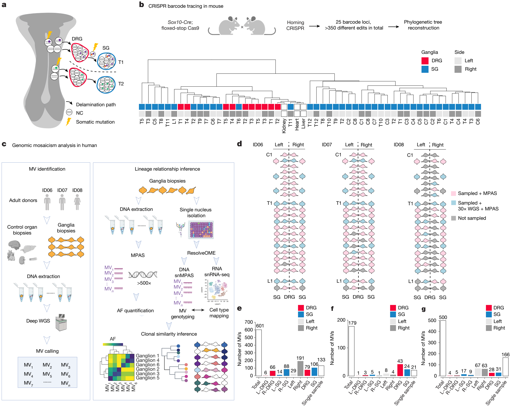

Fig. 1 | Analysis of clonal relationships between DRG and SG by MVBA in mice and humans. a, Resolving lineage relationship of DRG and SG by profiling MVs in progeny. Cells acquire MVs (lightning bolts) either before (purple and green) or after (orange) neural tube delamination (grey). Cells sharing MVs are probably derived from common ancestors, and tissues with similar mosaic landscapes are phylogenetically related. b, DRG and SG clonal relationships studied with Homing CRISPR in mice. Sox10-Cre drives Cas9 expression in delaminating NC cells for in vivo barcode editing. Representative lineage dendrogram clustered with Manhattan distances (percentage of barcode edits in individual ganglion). Bulk organs showed limited NC contribution. DRG tended to cluster with DRG, and SG with SG, across multiple axial levels. Representative dendrogram of n = 2 independent experiments in 1-month-old mice. c, Strategy to deconvolve lineage: Tissue collection: DRG and SG dissected from two male donors and one female donor. Other major organs were also collected to infer clonal relationships; MV discovery: 300× and 30× WGS of bulk peripheral organs and ganglia biopsies, respectively, identified candidate MVs. Candidate MVs quantified in dissected tissues or single nuclei by MPAS or snMPAS, respectively. AFs of validated MVs in individual ganglia anatomically mapped. Lineage relationships of ganglia inferred by computing clonal similarities. d, Individual DRG and SG sampled from the three adult donors. Pink, analysed by MPAS; blue, analysed by 30× WGS and MPAS; grey boxes, not analysed owing to suboptimal tissue integrity or sequencing quality. C, cervical; T, thoracic, L, lumbar. e–g, MV counts identified from donors ID06 (e), ID07 (f) and ID08 (g), classified by tissue and anatomical distribution. Variants detected 1.5× more frequently in a group were defined as ‘enriched’ (Methods). Non-mosaic (that is, heterozygous) variants excluded. L, left; R, right. Panels created in BioRender: a,b, Yang, X. https://biorender.com/r0pu7s7 (2026); c, Yang, X. https://biorender.com/aqnc90f (2026).

Applying MVBA to mice using CRISPR–Cas9, and to humans using naturally occurring MVs (summarized in Fig. 1a), complemented by live imaging in quail embryos, here we perform an unbiased assessment of clonal relationships among DRG and SG, spanning cervical to lumbar levels. In mice, we find that delaminated NC progenitors predominantly give rise to a single DRG or SG lineage, suggesting strong fate bias before delamination. Single-cell transcriptomic analysis further suggests emergence of fate bias in pre-delaminated NC as early as embryonic day (E) 8.5. Next, by evaluating three neurotypical human donors, our data indicate that most NC progenitors are fate-specified before delamination. Moreover, the DRG and SG from the same or neighbouring levels were often phylogenetically distinct, whereas ganglia belonging to the same type were often clonally related even across multiple spinal levels. Cell movements that conformed to these findings were documented in real-time by imaging quail embryos. Furthermore, we demonstrate that the rostrocaudal clonal spread depends on fibroblast growth factor (FGF) signalling gradient. Together, our study contrasts the prevailing model positing that delaminated NC cells are largely multipotent.

### Delaminating NC progenitors produce a single lineage in mouse

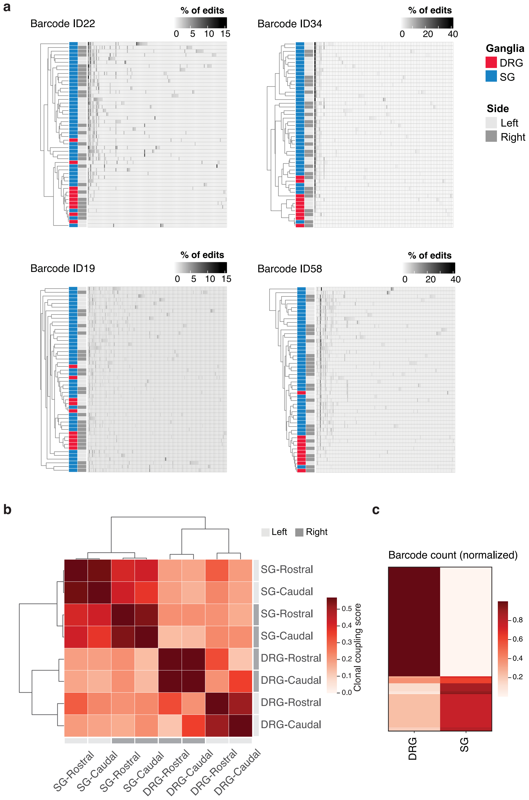

Extended Data Fig. 1 | Analysis of clonal relationships between sensory (DRG) and sympathetic ganglia (SG) by Homing CRISPR barcoding in mice. (a) Representative hierarchical clustering of ganglia with Manhattan distances using the percentage of edits at individual barcode locus of Homing CRISPR mouse. The dendrograms showed an overall pattern in which DRG and SG clustered independently. Red, DRG; Blue, SG. (b-c) Estimation of ganglia clonal similarities using DARLIN mouse model. (b) Dendrogram showing the clonal coupling score of DRG and SG from rostral or caudal levels. DARLIN barcode alleles were crossed with a doxycycline-inducible Cas9 mice. Barcode edits were induced by doxycycline injection at E8.5. Ganglia were dissected at E14.5. Results indicated rostral and caudal DRG shared more similar clones than DRG from left and right sides. Similarly, rostral and caudal SG were more clonally related than SG from left and right. DRG and SG shared fewest clones and were least similar. (c) Heatmap showing the normalized barcode count in DRG and SG. Y-axis indicated individual edits. Most clones were not shared between DRG and SG.

To reconstruct clonal relationships among trunk NC derivatives, we used the Homing CRISPR barcoding mouse29 with Cas9 under the control of Sox10-Cre, chosen because expression initiates first in NC cells delaminating from the neural tube30. Individual DRG and SG were isolated from 1-month-old mice, followed by targeted amplification of barcode loci. We reconstructed the phylogenetic tree of DRG and SG based on the percentage of identical edits in each ganglion, considering multiple barcode loci. Notably, SG and DRG largely clustered independently (Fig. 1b). For example, the largest clade consisted of 27 SG without a single DRG. Analysis of individual loci indicated that Cas9 edits were predominantly distributed to either DRG or SG but not shared. This implied that the fate of Sox10-Cre-labelled delaminated NC cells was mostly restricted to a single ganglion type (Extended Data Fig. 1a). To orthogonally verify these findings, we analysed clonal lineages of DRG and SG using an independent CRISPR barcoding mouse model, DARLIN31, under control of a doxycycline-inducible Cas9 allele. Doxycycline was injected at E8.5, followed by ganglia dissection at E14.5. Hierarchical clustering of clonal similarities confirmed shared lineage relationships between the same type of ganglia along the rostrocaudal axis, without clear left–right bias (Extended Data Fig. 1b,c). These results are seemingly at odds with models suggesting that delaminated NC progenitors are largely multipotent and can give rise to cells within both DRG and SG, and instead suggest they are largely clonally independent.

### Single-cell analysis confirms mouse NC fate bias

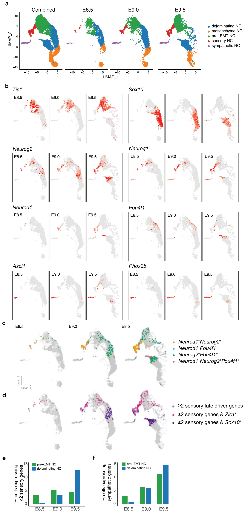

Extended Data Fig. 2 | Single-cell RNA sequencing of mouse NC cells between E8.5 and E9.5. (a) UMAP of NC cells isolated from Wnt1-Cre;R26R-LSL-TdTomato mouse embryos at E8.5 (2,192 cells), E9.0 (7,148 cells) and E9.5 (6,775). Cell types were annotated using previously defined markers. (b) Expression pattern of marker genes for pre-EMT NC (Zic1), delaminating NC (Sox10) and previously established fate driver genes for sensory (Neurog2, Neurog1, Neurod1 and Pou4f1) or sympathetic cells (Ascl1, Phox2b) at E8.5, E9.0 and E9.5. (c) Co-expression of sensory fate driver genes at E8.5, E9.0 and E9.5. (d) Co-expression of sensory fate driver genes and pre-EMT NC marker Zic1 or delaminating NC marker Sox10. (e) Quantification of the percentage of cells expressing at least 2 sensory fate driver genes (Neurog2, Neurog1, Neurod1, Pou4f1) in pre-EMT NC or delaminating NC. (f) Quantification of the percentage of cells expressing any sympathetic fate driver genes (Phox2b, Ascl1) in pre-EMT NC or delaminating NC.

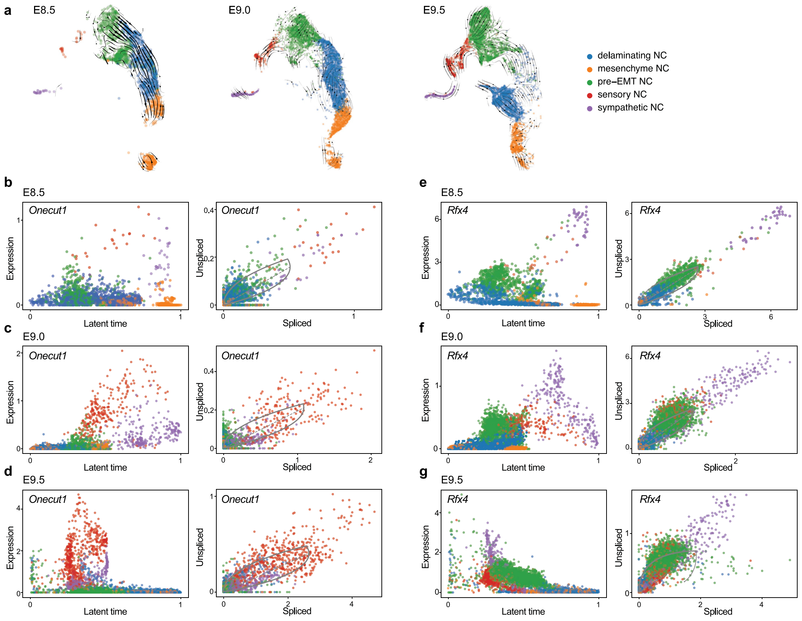

Extended Data Fig. 3 | RNA velocity analysis of mouse NC development. (a) RNA velocity analysis on UMAP at E8.5, E9.0 or E9.5 suggests the direction of NC development. (b-d) Identification of putative sensory fate bias regulatory genes by differential kinetics test to estimate dynamics of splicing. Latent time and phase plots showing sensory fate-biased expression dynamics of Onecut1 at (b) E8.5 (P = 3.61 × 10−3) and (d) E9.5 (P = 5.93 × 10−4), but not at E9.0 (c; P > 0.05). (e-g) Latent time and phase plots showing statistically significant sympathetic fate-biased expression dynamics of Rfx4 at (e) E8.5 (P = 7.72 × 10−64), (f) E9.0 (P = 8.06 × 10−98) and (g) E9.5 (P = 1.02 × 10−73).

To further examine the possibility of NC fate specification before delamination, we analysed the single-cell transcriptome of Wnt1-Cre-marked NC cells isolated from E8.5, E9.0 or E9.5 mouse embryos (Extended Data Fig. 2a). Transcription factors suggested to drive sensory fate include those encoded by Neurog1, Neurog2, Neurod1 and Pou4f1 (ref. 12). By E8.5 and E9.0, many NC progenitors already co-expressed at least two of these transcription factors. Remarkably, cells expressing at least two sensory transcription factors were more commonly Zic1+, a marker for NC progenitors before delamination (pre-epithelial-to-mesenchymal transition (pre-EMT) NC), rather than Sox10+, a marker for delaminating NC (Extended Data Fig. 2b–d). Likewise, a substantial fraction of pre-EMT NC cells already expressed sympathetic transcription factors (Extended Data Fig. 2e,f). Furthermore, RNA velocity analysis suggested distinct transcription factors showed significant sensory or sympathetic fate-biased expression dynamics between E8.5 and E9.5 (Extended Data Fig. 3). These findings suggest that NC cells exhibit fate bias as early as E8.5, prior to delamination.

### Identification of somatic MVs in human DRG and SG

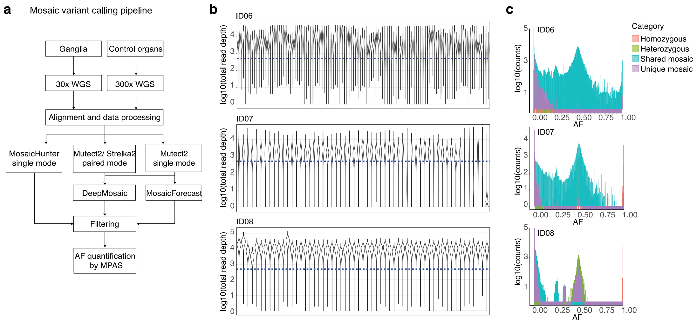

Extended Data Fig. 4 | Workflow for mosaic variant barcode analysis (MVBA). (a) Bioinformatic workflow for the identification of candidate mosaic variants (MVs). See Methods for a detailed description. (b) Violin plots of log-transformed total read depths (y-axes) of all somatic MVs in 140 samples from ID06 and 57 from either ID07 or ID08 (x-axes). The blue dashed lines indicate 500x read depth. (c) The distribution of the allelic fraction of MVs categorized into ‘homozygous’, ‘heterozygous’, ‘shared mosaic’, or ‘unique mosaic’ variants in all the samples from the 3 donors. AF, allelic fraction.

To compare results in humans, we performed MVBA analysis using naturally occurring somatic MVs from two male donors (ID06 and ID07) and one female donor (ID08) (Fig. 1c,d). We isolated 94 DRG and 93 SG in total across bilateral cervical, thoracic and lumbar levels. To distinguish somatic MVs from germline variants, we also profiled peripheral organs including the brain, heart, liver, kidneys and skin. A subset of ganglia and organ biopsies were subjected to 30× or 300× whole-genome sequencing (WGS), respectively, followed by state-of-the-art MV calling and filtering to identify candidate MVs (Extended Data Fig. 4a and Methods). We conducted ultra-deep massive parallel amplicon sequencing (MPAS) to both validate all candidate MVs and quantify AFs. We identified more than 1,200 bona fide MVs and measured AFs at greater than 500× coverage (Fig. 1e–g and Extended Data Fig. 4b,c).

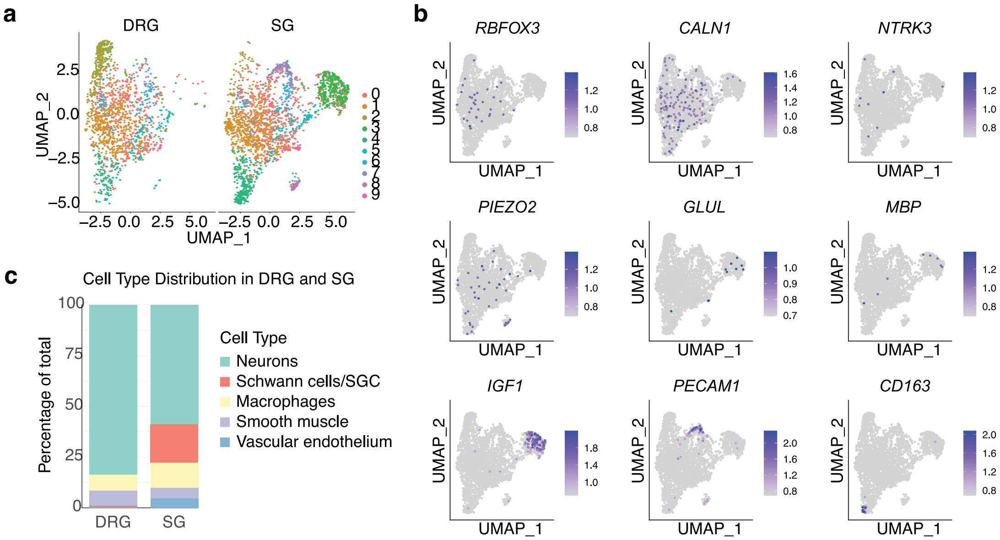

Extended Data Fig. 5 | Single-nucleus transcriptomic analysis of DRGs and SGs from donors. (a) Estimation of cell type proportion in the DRG and SG from donor ID08 by single-nucleus RNA sequencing. Uniform manifold approximation and projection (UMAP) graph from single-nucleus RNA sequencing with nuclei isolated from DRG (n = 1,714) and SG (n = 2,652). (b) Feature plot showing expression of known markers for major cell types in DRG and SG. (c) Bar graph showing cell type proportion in the DRG and SG following annotation of cluster identity with marker gene expression.

To estimate the percentage of ganglia DNA derived from NC, we performed single-nucleus RNA sequencing (snRNA-seq). Analysis of ganglia from donor ID08 suggested that trunk NC derivatives accounted for approximately 80% of sequenced cells in DRG or SG (Extended Data Fig. 5). Notably, more than 30% of MVs showed AF differences of at least 1.5-fold (that is, 50%) between DRG and SG of donors ID06 and ID07 (30.8% and 37.4%, respectively; Fig. 1e–g and Methods). This proportion was slightly lower in ID08, probably because fewer DRG were isolated owing to variable sample quality resulting from longer post-mortem intervals (Methods). Nevertheless, these observations confirmed that MVBA can be used to delineate clonal relationships of paraspinal ganglia.

### Cells within DRG and SG are clonally distinct in humans

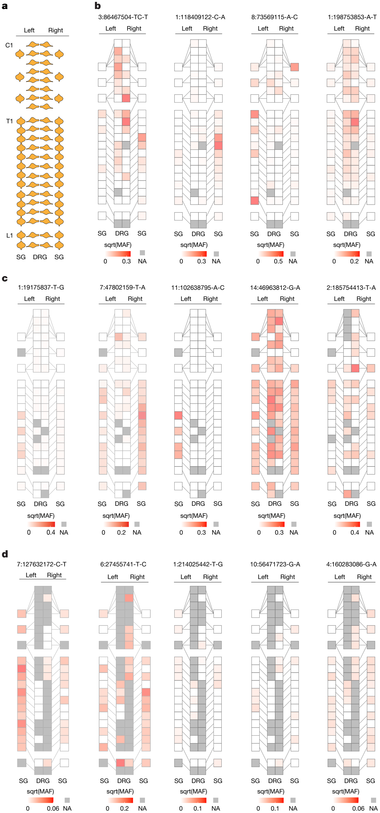

Fig. 2 | Spatial distribution of clonal MVs in human DRG and SG. a, Schematic of DRG and SG dissected from human donors. b–d, Geographical maps of the square-root-transformed AFs of individual MVs (sqrt(MAF)) (that is, ‘geoclones’): example geoclones in ID06 (b), ID07 (c) and ID08 (d) based upon hg38 reference genomic coordinates (at top). Colours, sqrt(MAFs). NA, tissue not available. Note that individual MVs often spread across multiple axial levels but were rarely shared between DRG and SG of the same level. sqrt(MAF), square-root-transformed mutant AF.

To visualize the distribution of clonal MVs across the body, we mapped the AF of each MV onto a schematic body plan (Fig. 2a–d), referred to as a ‘geoclone’. Consistent with the findings that more than 30% of MVs were enriched in either type of ganglia, there were numerous examples of MVs shared between a single type of ganglion across different axial levels but not between DRG and SG of proximal levels. For example, MV chromosome 3:86467504-TC-T of donor ID06 was enriched in almost all DRG spanning across C2 to T8 levels (Fig. 2b). Another MV, chromosome 7:47802159-T-A of donor ID07, was distributed bilaterally in SG across up to 12 spinal levels apart (Fig. 2c). However, these MVs often were not found in both DRG and SG of the same level. Approximately one-third of MVs were enriched (that is, at least 1.5-fold difference) or exclusive in either type of ganglia (Fig. 1e–g).

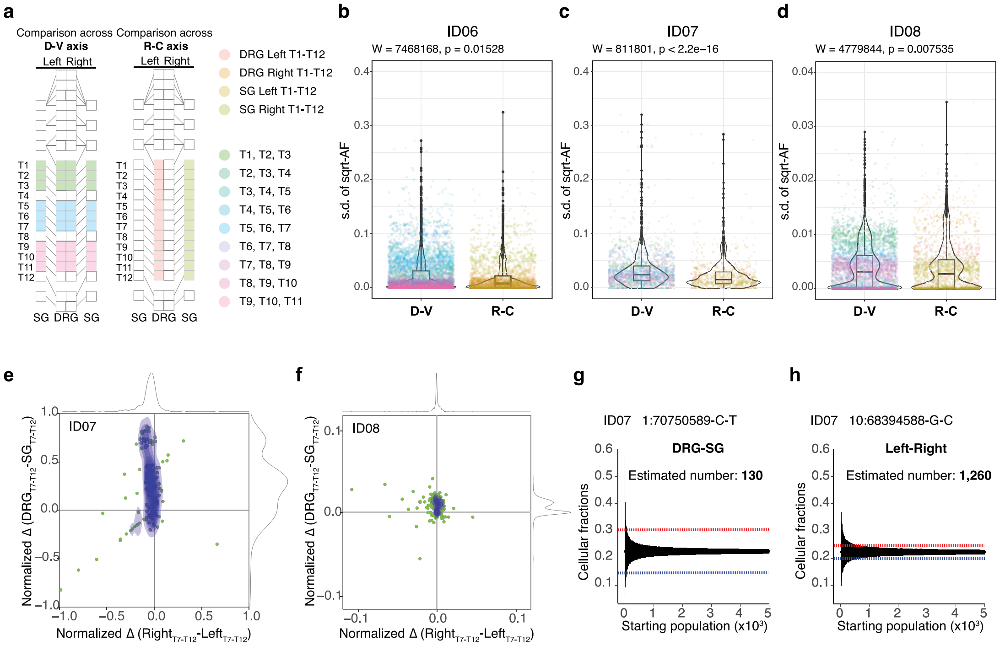

Extended Data Fig. 6 | Spatial distribution of clonal MVs in human DRGs and SGs. (a) Schematics showing the comparison in the difference of AF for all MVs along the dorsoventral (D-V) axis (between DRG and SG) and along the rostrocaudal (R-C) axis (between all thoracic levels). Different colors indicate the ganglia used for quantification of standard deviation. Comparison made between every 12 different ganglia either along D-V or R-C axis. (b-d) Violin plots showing the standard deviation of square-root transformed allelic fraction (s.d. of sqrt-AF) for the variants from ID06 (b), ID07 (c), and ID08 (d) compared between the D-V axis and R-C axis. Each dot represents individual MVs, with the color of the dots indicating the specific ganglia from which standard deviation was quantified, either along the D-V or R-C axis. Lower hinge of box indicates 25th percentile, middle line within box indicates 50th percentile, upper hinge of box indicates 75th percentile. Whiskers extend from the hinges to the largest/smallest values that are within 1.5-time inter-quartile-range of the hinge. Data points beyond whisker ends are plotted individually as outliers. N = 13\*number of MVs in individual donor, number of MVs in ID06, ID07 and ID08 are 827, 252 and 511 respectively. P values are from two-tailed Mann-Whitney U tests. W statistics are the sum of the ranks. (e-f) Contour plots showing the normalized difference in the allelic fraction of each mosaic variant observed from ID07 (e) and ID08 (f) between DRG and SG at T7-T12 levels (y-axis) and between left and right (x-axis). Green dots: individual mosaic variants. Blue contour: 2D Kernel density estimation. Grey curves: kernel density estimation along the x- or y-axis. (g-h) Representative variants from ID07 for simulating the cell number prior to DRG-SG separation (g) and prior to left-right separation (h). Blue and red dashed lines: difference in average AF for the individual variant between DRG and SG or between left and right. Black lines: 95% bands of hypergeometric distribution from each simulated starting population size.

Next, to evaluate whether these examples reflected the overall spatial organization of clonal MVs, we calculated the individual variance in AF between ganglia along the rostrocaudal axis (that is, between the ganglia of same type on each side) and the dorsoventral axis (that is, between all ganglia of a spinal level). We considered only the thoracic levels, in which DRG and SG develop in equivalent pairs. Because there are 12 DRG and SG on each side but only 4 ganglia at each spinal level, when quantifying variance at the dorsoventral axis we used a ‘rolling-level average’ approach that included ganglia from every 3 spinal levels (Extended Data Fig. 6a and Methods). In all three donors, the overall variance in MV distributions between DRG and SG along the dorsoventral axis was significantly larger than that between spinal levels along the rostrocaudal axis (Extended Data Fig. 6b–d). These findings suggest that MVs were often more restricted to ganglia of the same type across different axial levels, whereas DRG and SG from the same or proximal levels were more clonally distinct.

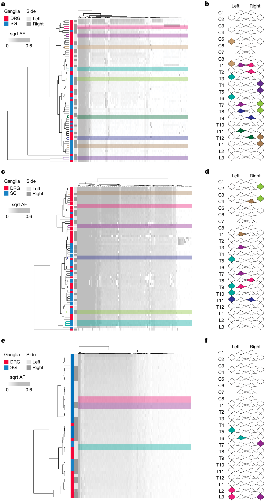

Fig. 3 | DRG and SG are clonally independent tissues in humans. a,c,e, Hierarchical clustering heatmaps with Manhattan distances using square-root transformed AFs of MVs from ID06 (a), ID07 (c) or ID08 (e). Note that DRG and SG predominantly clustered separately, whereas the left and right tend to intermix together, suggesting the lineage relationship between ganglia was not driven by their anatomical position but rather by their identity (DRG or SG). Statistical confidence for the dendrogram was tested with 10,000 bootstrapping analyses. Coloured branches indicate pairs of statistically stable ganglia with approximated unbiased P > 95%. b,d,f, Ganglia from statistically stable branches mapped to anatomical body plan of ID06 (b), ID07 (d) or ID08 (f) with corresponding colours. Note most branches consist of the same type of ganglia at different axial levels, with a few examples of different types of ganglia from adjacent levels. No branches consist of DRG and SG from the same level. sqrt, square-root-transformed.

To assess overall lineage relationships between all sampled ganglia, we performed hierarchical clustering displaying AFs of all MVs in a phylogenetic dendrogram (Fig. 3a,c,e). For all three human donors, DRG were predominantly clustered separately from SG. Therefore, DRG across different levels were clonally more similar among themselves, as were SG. By contrast, DRG and SG were often phylogenetically distant from each other. Notably, clonal relationships of ganglia lacked observable constraints along the rostrocaudal axis, nor were they segregated between the left and right sides. In addition, we performed bootstrap analysis to assess the statistical robustness of the dendrogram clustering pattern (Fig. 3a–f, and see also Supplementary Fig. 2). Almost all (16 of 18) were significantly stable, indicating that the closest lineage relationships consisted of pairs of either DRG or SG that were 2–6 axial levels apart. By contrast, no statistically significant stable branches were formed by any pair of DRG and SG from the same level. These results suggest that DRG and SG from the same level represent predominantly clonally independent lineages derived from divergent ancestral populations.

### Human NC cell fate specification precedes delamination

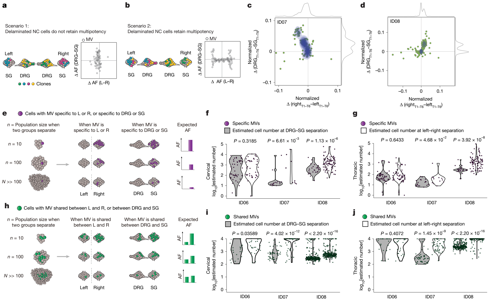

Fig. 4 | NC cell fate specification occurs before left–right determination. a,b, Modelling two possible scenarios whereby clones are more similar among left and right (L/R) than DRG and SG (scenario 1, a) or the opposite (scenario 2, b). Axes, normalized AF difference of each MV between the DRG/SG (y axis) versus L/R (x axis). c,d, Normalized AF difference of each MV observed from ID07 (c) and ID08 (d) between DRG/SG (y axis) versus L/R (x axis). Green dots, individual MVs. Blue contour, two-dimensional kernel density MV estimation plots highlighted. Grey curves, kernel density estimation along the x or y axis. The mostly vertical distribution suggests greater AF difference between DRG/SG than L/R. e, Effect of founder population size on AF of MVs. Cells acquire MVs (purple dots) after the L/R split, distributing to one side exclusively; or after DRG/SG fate specification, thus found in one type of ganglion. AFs quantified under three founder population cell number scenarios: n = 10, n = 100 or n ≫ 100 shown. For cells specific to one group, a smaller number of cells immediately after L/R split, or after DRG/SG specification, correlate with higher AFs difference. f,g, Estimated minimum size of the founder population at DRG/SG versus L/R split in cervical (f) or thoracic regions (g), suggesting NC cell fate specification occurs before L/R split. P values, two-tailed Mann–Whitney U tests. The y axis, log10-transformed estimated cell population size. h, Effect of founder population size AFs. Green, MVs acquired during early embryogenesis before the L/R versus DRG/SG split but with varying AFs (green dots). A larger hypothetical founder population size correlated with a smaller AF difference. i,j, Estimated maximum size of founder population at DRG/DG versus L/R split in cervical (i) or thoracic regions (j), suggesting NC cell fate specification occurs before L/R split. The y axis, log10-transformed estimated cell population size.

The phylogenetic relationships implied that DRG and SG are derived from distinct progenitor pools, raising the possibility that NC progenitors have fate bias within the human neural tube before delamination. Given that delaminated NC cells rarely revert their decision on migrating to either side32, MVs shared bilaterally probably arose before delamination. If delaminated NC cells give rise to only one cell type, the MVs acquired before delamination should distribute to both sides but specific to either DRG or SG, whereas MVs acquired after delamination should distribute to only one (or very few) ganglion of only one side, that is, to either DRG or SG (Fig. 4a). By contrast, if delaminated NC cells retain multipotency to generate both cell types, MVs acquired before delamination should be shared bilaterally across several ganglia from the same level irrespective of type, whereas those acquired after delamination should be shared between DRG and SG of the same side (Fig. 4b). A third possibility could be that both scenarios exist at the same time in a continuum with progressive fate restriction.

To test these scenarios, we compared the AF difference for each MV between the left and right sides against that between the DRG and SG in corresponding axial levels. Intriguingly, most MVs exhibited fewer AF differences between left and right while simultaneously showing higher AF variation between DRG and SG (Fig. 4c,d and Extended Data Fig. 6e,f). Although many MVs were distributed bilaterally, they were often exclusive to either DRG or SG. These findings suggest NC progenitors are fate-specified before delamination and commitment to either side.

Because cell number increases steadily during embryogenesis, we estimated whether NC fate specification or delamination occurs first by simulating the relative cell population size when NC progenitors are first fate-specified and first delaminated. Considering MVs that were fully lateralized or exclusive to either type of ganglion (‘group-specific’ MV), and assuming each MV was nascently acquired in a single progenitor, the observed AF for any group-specific MV can predict the minimum possible cell number at the time of group separation, that is, left–right commitment or DRG versus SG cell fate restriction (Fig. 4e). Thus, if the MV arises when the cell population is relatively small, a higher group-specific AF will result. We simulated the minimum possible population size at the point of group separation in all three donors. For donors ID07 and ID08, the cell population at the time of DRG or SG fate commitment was significantly smaller than that at delamination to either side, whereas the size difference for donor ID06 was relatively modest (Fig. 4f). This trend was consistent across cervical and thoracic levels (Fig. 4g). These findings suggest multipotency of delaminated NC cells is not a predominant mechanism of NC development.

In addition, we performed a stepwise simulation to estimate the cell number of the common progenitor for different sample groups (that is, DRG and SG or left and right) based on a hypergeometric distribution model we previously published27,33 (Methods). The difference in AF for shared MVs should correlate with the maximum possible cell number at the time the groups separate, with larger AF differences estimating smaller population sizes at the time of separation (Fig. 4h and Methods). We performed a stepwise simulation for all the shared MVs using previously published mathematical methods (Extended Data Fig. 6g,h). The maximum possible cell number at NC fate specification was significantly lower than that at left–right commitment (Fig. 4i,j). The results further suggest that most delaminated NC cells are fate-specified and give rise to either DRG or SG.

### Single-cell analysis confirms human DRG and SG clonality

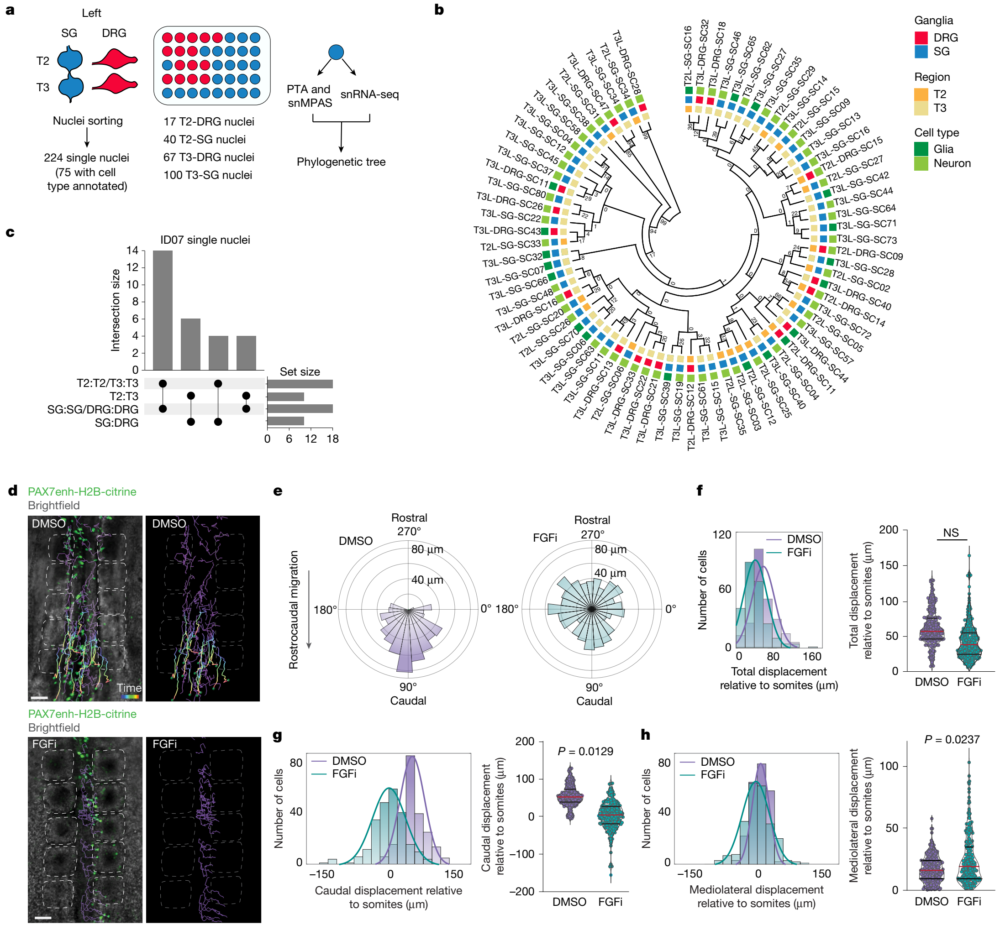

Fig. 5 | Rostrocaudal migration across multiple levels distributes clones specific to DRG or SG. a, Strategy for deconvolving the phylogenetic relationship of ganglia at single-cell resolution. MVs genotyped by snMPAS in 224 nuclei isolated from both the DRG and SG at T2 and T3 levels of donor ID07. Of these, cell type was inferred in 75 nuclei by snRNA-seq. PTA, primary template-directed amplification. b, Phylogenetic tree based on the 184 MVs in 75 single nuclei with cell type information. Numbers at branches of the tree are bootstrap values supporting each edge. c, Upset plot showing the number of terminal branches shared between types of ganglia (SG:SG, DRG:DRG or SG:DRG) and axial levels (T2:T2, T3:T3 or T2:T3). Results suggest among the most clonally related pairs, cells from the same ganglion are the most frequent, whereas cells from DRG and SG of the same level are less frequent than expected by chance. d, Representative tracks showing the migration paths of NC progenitors following treatment with DMSO or FGF receptor inhibitor (FGFi). Brackets indicate somites. Paths of cells migrated more than 82 μm indicated by time-coded colours. Paths of cells migrated less than 82 μm indicated by purple. e, Polar weighted histogram showing the directionality of NC migration following FGFi treatment, which repressed caudal migration but increased lateral migration. n = 237 cells from 4 control embryos; n = 243 cells from 4 embryos treated with FGFi. f, Bar and scatter plots showing the total displacement of NC cells following DMSO or FGFi treatment. g, Bar and scatter graphs showing the displacement of NC cells along the rostrocaudal axis. Caudal migration was significantly reduced following FGFi treatment (P = 0.0129). h, Bar and scatter graphs showing the displacement of NC cells along the mediolateral axis. Lateral migration of NC cells was significantly increased following FGFi treatment (P = 0.0237). Scale bars, 50 μm. NS, not significant.

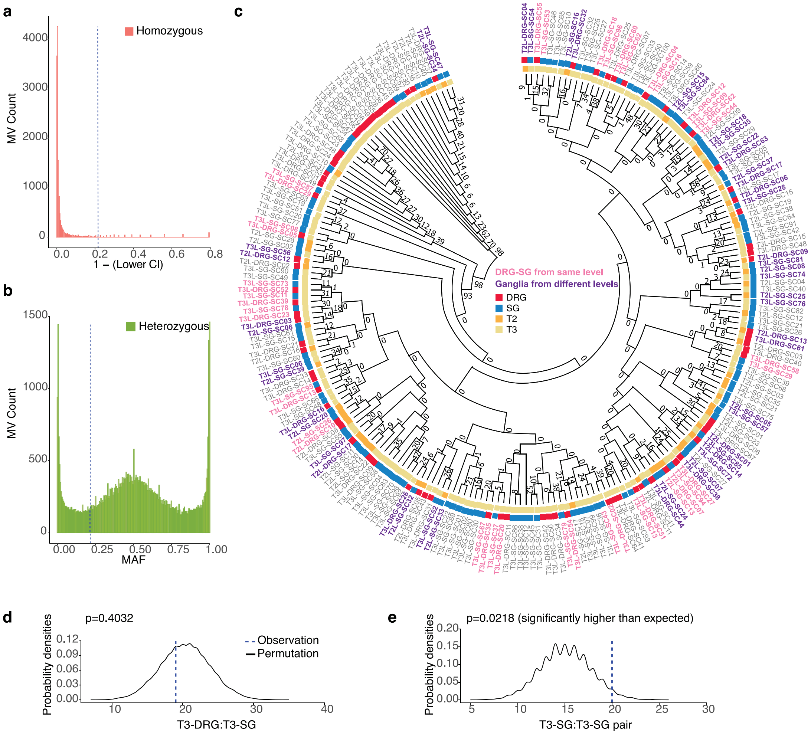

Extended Data Fig. 7 | Clonal analysis of DRGs and SGs at single-nucleus resolution. (a) False positive rate of mosaic variant genotyping by snMPAS. Distribution of the reference homozygous variants from ID07, with the x-axis representing 1 minus the lower bound of 95% binominal confidence interval (95% CI). The blue dashed line indicates the cut-off for a false discovery rate of 5%. (b) False negative rate of mosaic variant genotyping by snMPAS. Distribution of the upper bound of 95% binominal confidence interval. The blue dashed line indicates the cut-off for a false discovery rate of 5% (c) Phylogenetic tree after 1,000 bootstrap replications from the 184 MVs in the 224 single nuclei. The numbers at branches of the tree are bootstrap values supporting each edge. Purple indicates a terminal branch pair that consists of both DRG and SG from the same level (either T2:T2 or T3:T3). Pink indicates ganglia pairs from different levels at the terminal branch (T2:T3). (d-e) Graphs comparing the actual number of terminal branches observed in the phylogeny tree (blue dashed line, observation) and the distribution of expected number after 10,000 permutations (black line, permutation) for T3-DRG: T3-SG pair (p = 0.4032, permutation test) (d) and T3-SG: T3-SG pair (p = 0.0218, permutation test) (e).

As we performed MVBA analysis from bulk tissue biopsies, we asked whether similar clonal relationships can be recapitulated at the single-cell level. Thus, we performed single-nucleus simultaneous genomic and transcriptomic amplification from the same cell using the ResolveOME workflow28,34, followed by genotyping for MVs with single-nucleus massive parallel amplicon sequencing (snMPAS) and cell type identification with snRNA-seq (Fig. 5a and Extended Data Fig. 7a–c). We profiled a total of 224 human single nuclei from both types of ganglia at the T2 and T3 levels of the left side. Owing to suboptimal RNA quality probably resulting from post-mortem intervals, we could annotate cell type for only 75 out of the 224 nuclei, using expression of pan-neuronal or glial marker genes (55 neurons and 20 glia) (Fig. 5a).

To deconvolve lineage relationships between isolated single cells, we reconstructed a phylogenetic tree using MVs genotyped for all 224 cells, in which the terminal branches of the tree indicated the most closely related pairs of cells. More than half of the terminal branches contained pairs of cells from different levels (Extended Data Fig. 7c). We performed a permutation test by randomly shuffling the labels of the 224 nuclei and computing the probabilities of different terminal branch combinations. The terminal branches with pairs of cells from the SG of T3 (T3-SG:T3-SG) were significantly more common than random (Extended Data Fig. 7d,e), suggesting frequent local clonal expansion within the ganglion.

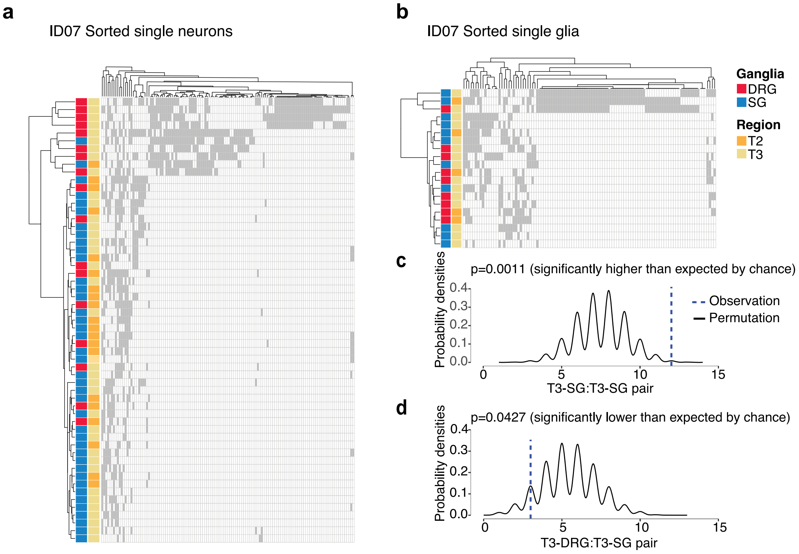

Extended Data Fig. 8 | Clonal relationship of single nuclei of DRGs and SGs. (a-b) Hierarchical clustering with Manhattan distances from a total of 55 neurons (a) and 20 glia (b) from the DRG and SG at T2 and T3 levels of ID07. Note that DRGs and SGs predominantly clustered separately at both levels, suggesting the lineage relationship between ganglia is not driven by spinal level but rather by identity (DRG or SG). (c-d) Number of terminal branches observed in the phylogeny tree (blue dashed line, observation) and distribution expected after 10,000 permutations (black line: permutation) for T3-SG: T3-SG pair (p = 0.0011, permutation test) (c) and T3-DRG: T3-SG pair (p = 0.0427, permutation test) (d).

As more than 80% of ganglionic cells were neurons or glial cells derived from NC (Extended Data Fig. 5), we asked whether the clonal relationships were driven by a particular cell type. We performed hierarchical clustering using MVs genotyped by snMPAS in the 75 cells assigned as either neurons or glia. Cells from DRG and SG, regardless of cell type, clustered independently in the dendrograms (Fig. 5b and Extended Data Fig. 8a,b). Half of all 28 terminal branches in the phylogenetic tree were shared by nuclei within a single ganglion, again implying local clonal expansion during gangliogenesis (Fig. 5c). Remarkably, 10 of the 14 remaining branches comprised cells from different axial levels, suggesting cells from ganglia of T2 and T3 levels more frequently shared the closest clonal relationships, and implying that the clonal relationship between ganglia was organized across different axial levels rather than between DRG and SG (Fig. 5c). We performed a permutation test for the statistical significance of the terminal branch composition. As expected, the occurrence of the T3-SG:T3-SG pair, indicative of local proliferation in the SG, was significantly more frequent than random (P = 0.0011) (Extended Data Fig. 8c). Interestingly, the branches shared by DRG and SG from the same level (T3-DRG:T3-SG) were significantly less prevalent than random (P = 0.0427) (Extended Data Fig. 8d), further suggesting clonal relationships were organized rostrocaudally across different axial levels.

### FGF-dependent NC migration along the rostrocaudal axis

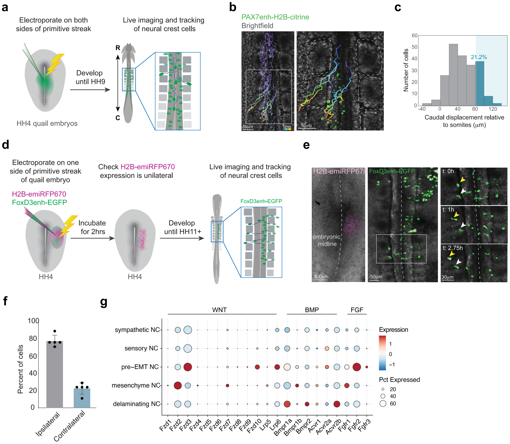

Extended Data Fig. 9 | Live imaging of NC migration in quail embryos. (a) Experimental design for real-time imaging of NC progenitor migration in quail embryos. Quail embryos at Hamburger-Hamilton stage 4 (HH4) were electroporated with Pax7 enhancer-driven citrine reporter and allowed to develop until HH9. Cells were imaged for 6 h. (b) Representative tracks showing migration paths of NC cells expressing Pax7 reporter. Right panel: magnification of boxed region from left panel. Brackets: somites. Scale bar: 50 μm. (c) Histogram showing the rostrocaudal migration distance of 212 cells (n = 6 embryos) tracked for 6 h each. Blue shading: cells migrating caudally by more than 1 somite (mean somite length 81 ± 1 µm, n = 92 somites from 6 embryos). There were 21.2% of NC cells migrating rostrocaudally across more than 1 somite level. (d) Schematic of experimental design to evaluate midline-crossing migration of NC progenitors. Quail embryos at HH4 were electroporated with H2B-RFP and FoxD3 enhancer-driven EGFP on one side. Spatial specificity of electroporation was confirmed by inspecting H2B-RFP expression 2 h later. Live imaging and tracking of FoxD3+ NC progenitors were then performed at HH11. (e-f) Quantification of cells migrating on the side of electroporation (ipsilateral) and crossing the midline (contralateral) indicated that 20% of NC migrated to the opposite side during the 6 h of imaging (n = 5 embryos). (g) Dot plot showing gene expression of receptors for major signaling pathways in the mouse NC cells from single-cell RNA sequencing to identify putative signaling pathways guiding NC cell migration.

The shared clonal relationship between ganglia along the rostrocaudal axis might imply progenitors migrate along the neural tube and disseminate clones to different spinal levels. To directly observe NC progenitor dynamics during embryogenesis, we performed real-time imaging of quail embryos electroporated with NC-specific Pax7 enhancer reporter (Extended Data Fig. 9a), first expressed in cells fated to become NC at the neural plate border6. Tracking of cell migratory paths within the 6 h of imaging showed 21.2% of NC progenitors migrated along the rostrocaudal axis across more than one somite level (Extended Data Fig. 9b,c and Supplementary Video 1). Because numerous clones were distributed bilaterally, we asked whether NC progenitors cross the midline to disseminate clones to both sides. To test this possibility, we electroporated the NC-specific reporter to one side of the quail embryo neural tube. We observed around 20% of labelled cells migrated across the midline before delamination, taking up contralateral positions (Extended Data Fig. 9d–f).

To identify potential signalling pathways that guide the rostrocaudal migration of NC progenitors, we first examined the expression of receptors for major signalling molecules in mouse NC cells. FGF receptors were enriched in pre-EMT and delaminating NC progenitors (Extended Data Fig. 9g). FGF signalling blockade accelerates the delamination of trunk NC progenitors35. To test whether FGF signalling is required for rostrocaudal migration, we incubated quail embryos with the pan-FGF receptor inhibitor infigratinib. Cells that migrated along the rostrocaudal axis by more than 1-somite distance dropped from 19.35% in dimethylsulfoxide (DMSO) control to 1.35% following inhibition of FGF signalling (Fig. 5d and Supplementary Videos 2 and 3). Although total migration distance did not differ, NC cells showed significantly reduced migration along the rostrocaudal axis and significantly increased displacement along the mediolateral axis (Fig. 5e–h). The findings suggest that rostrocaudal migration of NC cells depends on FGF signalling and that the NC cells tend to delaminate from the neural tube in the absence of an FGF signalling gradient.

### Clonal spread of NC cells during rostrocaudal migration

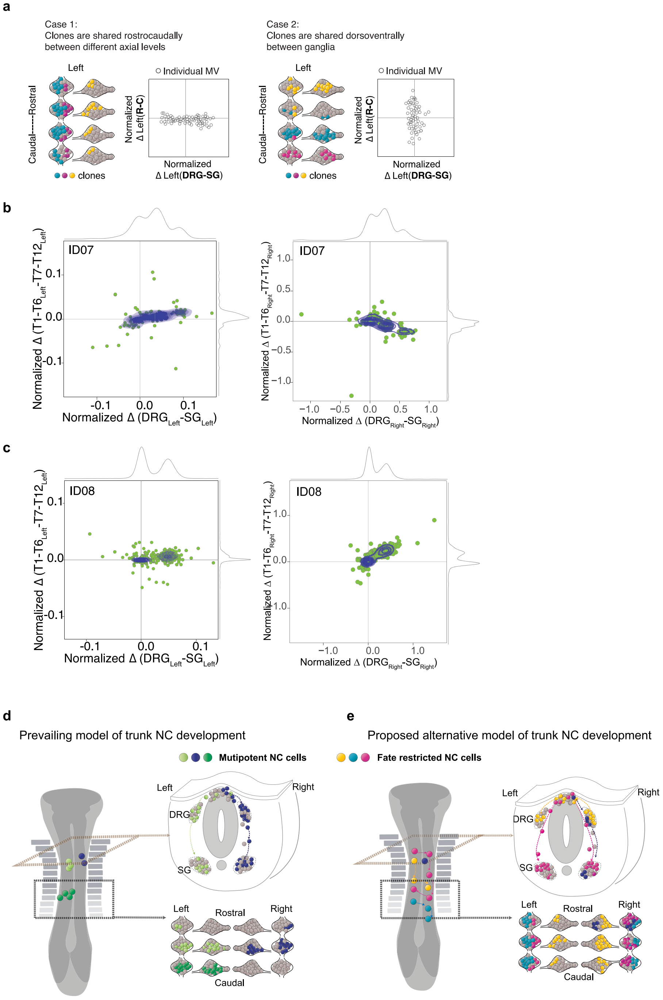

Extended Data Fig. 10 | NC migration distributes clones bilaterally across axial levels while mostly restricted to either DRG or SG. (a) Models and predicted contour plots of possible cases whereby MVs are shared between ganglia along the rostrocaudal axis but restricted dorsoventrally (case 1, left) or shared the dorsoventral axis while restricted rostrocaudally (case 2, right). Axes: normalized AF difference between rostral and caudal against that between DRG and SG. In case 1, most MVs deviate from the center along the x-axis but cluster at the center of the y-axis because MVs are shared among rostral and caudal levels. In case 2, most MVs cluster around the center at the x-axis but not the y-axis since clones are more frequently shared dorsoventrally between DRG and SG, but not between different levels. Clones with genomic similarity are colored similarly. (b-c) MV contour plots observed from ID07 (b) and ID08 (c) thoracic levels with the normalized difference in AFs between rostral (defined as T1-T6 levels) and caudal (defined as T7-T12 levels) (y-axis) vs. normalized difference between the DRG and SG (x-axis). Green dots: individual MVs. Blue contours: kernel density estimation of MV distributions. Grey curves: kernel density estimation along the respective axes. Data for the left-sided or right-sided ganglia are plotted separately. (d-e) Comparison of the prevailing model of trunk NC development and the proposed model based on findings from this study. In the prevailing model (d), delaminated NC cells are multipotent, giving rise to both DRG and SG (blue, dark green, and light green cells). The NC cells do not migrate rostrocaudally until reaching the SG, while cells of the DRG do not migrate across different levels. In our proposed model (e), most NC cells are cell fate-specified (red, cyan, and yellow cells) but a minority of NC cells are multipotent (dark blue cells). NC cells migrate rostrocaudally and take up contralateral positions prior to delamination, thereby distributing descendant cells across multiple levels but mostly exclusive to either DRG or SG lineage.

Our data from human MV analysis did not exclude the possibility that NC progenitors retain multipotency during rostrocaudal migration. We postulated two models representing extreme ends: (1) NC cells specify to either DRG or SG lineages during times of rostrocaudal migration, predominantly disseminating clones across different levels but not across DRG and SG dorsoventrally (Extended Data Fig. 10a, left); (2) NC cells have the potency to generate both DRG and SG during rostrocaudal migration (Extended Data Fig. 10a, right). Although these two scenarios are mutually exclusive for one progenitor, they may co-exist within an organism at the population level. Thus, to evaluate the prevalence of either model, we plotted the normalized AF difference for each MV between the rostral (T1–T6) and caudal (T7–T12), versus between the DRG and SG, using contour graphs for the results of all MVs. For most MVs, the AF differed substantially between DRG and SG but only subtly between rostral and caudal levels, resulting in a flat contour shape (Extended Data Fig. 10b,c). Together, the results supported the first model, whereby most NC cells are specified to either DRG or SG lineages during rostrocaudal migration (Extended Data Fig. 10a,b).

## Discussion

Here we performed a comprehensive large-scale analysis of trunk NC lineage relationships in mice and humans, complemented by live imaging in quail embryos, revealing previously unrecognized aspects of NC development: (1) NC cell fate specification occurs predominantly before delamination; (2) committed NC cells can traverse the midline before delamination and migrate robustly across multiple spinal levels; and (3) fate-specified NC cells can migrate rostrocaudally in the neural tube, thereby disseminating clones bilaterally but often specifically to either DRG or SG of multiple spinal levels (Extended Data Fig. 10d,e). These observations revise the current concept of NC development.

The pivotal question of whether delaminated NC cells are inherently multipotent or rather represent a heterogeneous pool of progenitors with restricted fates has been debated for decades14,15,17,21,22,36,37. The methodologies used in the previous studies were mostly limited to dye labelling or viral tracing, which may be confounded by rapid cell divisions or labelling of cell mixtures in the embryo. Other studies that might be more definitive include multicolour fluorescent Confetti reporters, but may be limited by analysis within a single somite level or may have missed rostrocaudal cell movements we observed herein. Such potential technical challenges in previous studies were at least partly overcome in our study by MVBA in humans leveraging spontaneously arising MVs that spread naturally by progenitor expansion and migration during development, and which are thought to be static throughout life.

Using MVBA, we performed an unbiased analysis of clonal relationships among ganglia from the cervical to lumbar levels. Several independent lines of evidence suggest most NC cells are already fate-specified before delamination: (1) MVs were seldom shared between proximally located DRG and SG, both in humans and mice; (2) DRG and SG were more clonally similar within-group than between-group; (3) cell population size was significantly smaller when cell fate splits between DRG and SG than when NC cells delaminate. Single-cell sequencing experiments in mice further suggest a strong sensory or sympathetic lineage bias, which accounts for a large degree of clonal separation between DRG and SG observed in the CRISPR barcode mouse models.

MVBA circumvents the need for transgenic manipulation and allows reconstruction of clonal dynamics in humans. Analysing lineage trajectories during human embryonic development is not feasible. MVBA allows reconstruction of early developmental events by analysing late-stage donor tissues. Owing to the post-mortem interval of human cadavers, single-nucleus transcriptional profiling was possible in only a minority of nuclei assessed. Although our results suggest NC cell fate specification predominantly occurs within the neural tube, single-nucleus sequencing suggests a minor population of delaminated NC progenitors are multipotent in humans. Thus, we confirm their presence as described in previous publications17.

However, because we leverage naturally occurring somatic MVs, it is almost impossible to pinpoint the exact timing when each MV arises. Similarly, although previous studies demonstrated Sox10-Cre mediates recombination in delaminating NC17, we cannot rule out the possibility that a fraction of the Cre-mediated Cas9 edits arise later in development. Nonetheless, the bilateral distribution of MVs probably implies their emergence before delamination. Correspondingly, hierarchical clustering using AFs of MVs in both humans and mice shows no significant lateralization, suggesting most analysed MVs occur before or during delamination.

Whereas the classical Waddington’s model suggests development as a ball rolling down a hill with branching valleys, our findings may imply the landscape for NC development more resembles successive valleys in which progenitors undergo developmental decisions towards DRG versus SG fate, and subsequently delaminate to the left versus right. The model takes stochasticity into account, thus potentially accounting for a fraction of progenitors generating both DRG and SG after delamination.

Rostrocaudal migration of trunk NC cells was thought to be possible only within a narrow temporal and spatial window, primarily reserved for cells that reached the ganglia38. Delaminated trunk NC cells were observed to migrate exclusively through the rostral but not the caudal half of each sclerotome. Only after SG cells reach the ventral edge of the sclerotome, near the dorsal aorta, can they extend interganglionic filopodia, forming a contiguous narrow stream spanning up to two segments rostrally or caudally from their axial origins39. Cells destined for DRG were not expected to migrate ventrally past the sclerotome and thus were not thought to migrate across axial levels39,40. Our observations do not disagree with these conclusions, but suggest that rostrocaudal clonal spread is extensive, crossing multiple axial levels, probably as a result of movement immediately before leaving the neural tube. This clonal spread is unlikely to be a result simply of general extension of the embryonic body, because MVs were often exclusive to either DRG or SG. Indeed, upon abolishing the FGF signalling gradient, NC cells failed to migrate across multiple somite levels but instead moved laterally out of the neural tube. Our data support a model in which FGF activity is required to restrain premature emigration from the neural tube to distribute the clones across multiple spinal levels.

In summary, our findings suggest a strong fate bias for sensory or sympathetic lineage in pre-delaminating NC progenitors. These results are clinically relevant as they may provide insights into human neurocristopathies41–43, for example, in neuroblastoma caused by the uncontrolled proliferation of sympathoadrenal lineage. The revised model of fate specification for sensory versus sympathetic lineage may suggest that tumorigenic driver mutation can be acquired early within the neural tube.

## Online content

Any methods, additional references, Nature Portfolio reporting summaries, source data, extended data, supplementary information, acknowledgements, peer review information; details of author contributions and competing interests; and statements of data and code availability are available at https://doi.org/10.1038/s41586-026-10313-0.

## References

1. Bronner, M. E. & LeDouarin, N. M. Development and evolution of the neural crest: an overview. Dev. Biol. 366, 2–9 (2012).

2. Le Douarin, N. M. & Dupin, E. The “beginnings” of the neural crest. Dev. Biol. 444, S3–S13 (2018).

3. Le Douarin, N. M. A life in Science with the avian embryo. Int. J. Dev. Biol. 62, 19–33 (2018).

4. Teillet, M. A., Kalcheim, C. & Le Douarin, N. M. Formation of the dorsal root ganglia in the avian embryo: segmental origin and migratory behavior of neural crest progenitor cells. Dev. Biol. 120, 329–347 (1987).

5. Lallier, T. E. & Bronner-Fraser, M. A spatial and temporal analysis of dorsal root and sympathetic ganglion formation in the avian embryo. Dev. Biol. 127, 99–112 (1988).

6. Basch, M. L., Bronner-Fraser, M. & Garcia-Castro, M. I. Specification of the neural crest occurs during gastrulation and requires Pax7. Nature 441, 218–222 (2006).

7. Hovland, A. S. et al. Pluripotency factors are repurposed to shape the epigenomic landscape of neural crest cells. Dev. Cell 57, 2257–2272 (2022).

8. Thomas, S. et al. Human neural crest cells display molecular and phenotypic hallmarks of stem cells. Hum. Mol. Genet. 17, 3411–3425 (2008).

9. Weston, J. A. A radioautographic analysis of the migration and localization of trunk neural crest cells in the chick. Dev. Biol. 6, 279–310 (1963).

10. Noden, D. M. An analysis of migratory behavior of avian cephalic neural crest cells. Dev. Biol. 42, 106–130 (1975).

11. Serbedzija, G. N., Bronner-Fraser, M. & Fraser, S. E. A vital dye analysis of the timing and pathways of avian trunk neural crest cell migration. Development 106, 809–816 (1989).

12. Soldatov, R. et al. Spatiotemporal structure of cell fate decisions in murine neural crest. Science 364, eaas9536 (2019).

13. Erickson, A. G. et al. Unbiased profiling of multipotency landscapes reveals spatial modulators of clonal fate biases. Preprint at bioRxiv https://doi.org/10.1101/2024.11.15.623687 (2024).

14. Krispin, S., Nitzan, E., Kassem, Y. & Kalcheim, C. Evidence for a dynamic spatiotemporal fate map and early fate restrictions of premigratory avian neural crest. Development 137, 585–595 (2010).

15. McKinney, M. C. et al. Evidence for dynamic rearrangements but lack of fate or position restrictions in premigratory avian trunk neural crest. Development 140, 820–830 (2013).

16. Vincent, E. et al. Ret deficiency decreases neural crest progenitor proliferation and restricts fate potential during enteric nervous system development. Proc. Natl Acad. Sci. USA 120, e2211986120 (2023).

17. Baggiolini, A. et al. Premigratory and migratory neural crest cells are multipotent in vivo. Cell Stem Cell 16, 314–322 (2015).

18. Bronner-Fraser, M. & Fraser, S. Developmental potential of avian trunk neural crest cells in situ. Neuron 3, 755–766 (1989).

19. Bronner-Fraser, M. & Fraser, S. E. Cell lineage analysis reveals multipotency of some avian neural crest cells. Nature 335, 161–164 (1988).

20. Nitzan, E. et al. A dynamic code of dorsal neural tube genes regulates the segregation between neurogenic and melanogenic neural crest cells. Development 140, 2269–2279 (2013).

21. Henion, P. D. & Weston, J. A. Timing and pattern of cell fate restrictions in the neural crest lineage. Development 124, 4351–4359 (1997).

22. Harris, M. L. & Erickson, C. A. Lineage specification in neural crest cell pathfinding. Dev. Dyn. 236, 1–19 (2007).

23. Luo, R., Gao, J., Wehrle-Haller, B. & Henion, P. D. Molecular identification of distinct neurogenic and melanogenic neural crest sublineages. Development 130, 321–330 (2003).

24. Ju, Y. S. et al. Somatic mutations reveal asymmetric cellular dynamics in the early human embryo. Nature 543, 714–718 (2017).

25. Coorens, T. H. H. et al. Extensive phylogenies of human development inferred from somatic mutations. Nature 597, 387–392 (2021).

26. Lee-Six, H. et al. Population dynamics of normal human blood inferred from somatic mutations. Nature 561, 473–478 (2018).

27. Breuss, M. W. et al. Somatic mosaicism reveals clonal distributions of neocortical development. Nature 604, 689–696 (2022).

28. Chung, C. et al. Cell-type-resolved mosaicism reveals clonal dynamics of the human forebrain. Nature 629, 384–392 (2024).

29. Leeper, K. et al. Lineage barcoding in mice with homing CRISPR. Nat. Protoc. 16, 2088–2108 (2021).

30. Britsch, S. et al. The transcription factor Sox10 is a key regulator of peripheral glial development. Genes Dev. 15, 66–78 (2001).

31. Li, L. et al. A mouse model with high clonal barcode diversity for joint lineage, transcriptomic, and epigenomic profiling in single cells. Cell 186, 5183–5199 (2023).

32. Kulesa, P., Bronner-Fraser, M. & Fraser, S. In ovo time-lapse analysis after dorsal neural tube ablation shows rerouting of chick hindbrain neural crest. Development 127, 2843–2852 (2000).

33. Ye, A. Y. et al. A model for postzygotic mosaicisms quantifies the allele fraction drift, mutation rate, and contribution to de novo mutations. Genome Res. 28, 943–951 (2018).

34. Marks, J. R. et al. Unifying comprehensive genomics and transcriptomics in individual cells to illuminate oncogenic and drug resistance mechanisms. Preprint at bioRxiv https://doi.org/10.1101/2022.04.29.489440 (2023).

35. Martinez-Morales, P. L. et al. FGF and retinoic acid activity gradients control the timing of neural crest cell emigration in the trunk. J. Cell Biol. 194, 489–503 (2011).

36. Stanley, E. F., Ehrenstein, G. & Russell, J. T. Evidence for anion channels in secretory vesicles. Neuroscience 25, 1035–1039 (1988).

37. Serbedzija, G. N., Fraser, S. E. & Bronner-Fraser, M. Pathways of trunk neural crest cell migration in the mouse embryo as revealed by vital dye labelling. Development 108, 605–612 (1990).

38. Krull, C. E. Segmental organization of neural crest migration. Mech. Dev. 105, 37–45 (2001).

39. Kasemeier-Kulesa, J. C., Kulesa, P. M. & Lefcort, F. Imaging neural crest cell dynamics during formation of dorsal root ganglia and sympathetic ganglia. Development 132, 235–245 (2005).

40. Yip, J. W. Migratory patterns of sympathetic ganglioblasts and other neural crest derivatives in chick embryos. J. Neurosci. 6, 3465–3473 (1986).

41. Etchevers, H. C., Dupin, E. & Le Douarin, N. M. The diverse neural crest: from embryology to human pathology. Development 146, dev169821 (2019).

42. Fries, L. E., Dharma, S., Chakravarti, A. & Chatterjee, S. Variability in proliferative and migratory defects in Hirschsprung disease-associated RET pathogenic variants. Am. J. Hum. Genet. 112, 863–875 (2025).

43. Kaufman, C. K. et al. A zebrafish melanoma model reveals emergence of neural crest identity during melanoma initiation. Science 351, aad2197 (2016).

**Publisher’s note** Springer Nature remains neutral with regard to jurisdictional claims in published maps and institutional affiliations.

Springer Nature or its licensor (e.g. a society or other partner) holds exclusive rights to this article under a publishing agreement with the author(s) or other rightsholder(s); author self-archiving of the accepted manuscript version of this article is solely governed by the terms of such publishing agreement and applicable law.

© The Author(s), under exclusive licence to Springer Nature Limited 2026

## Methods

### Human donor recruitment

Organs of ID06, ID07 and ID08 were collected from the University of California (UC) San Diego Anatomical Material Program. Organs of ID06 were donated by a 70-year-old male individual. Organs of ID07 were donated by an 85-year-old male individual. Organs of ID08 were donated by a 74-year-old female individual. All three donors were documented to be of European ancestry and were neurotypical at the time of demise. Organs were collected within a 13-h post-mortem interval for all donors (ID06: 13 h, ID07: 11 h, ID08: 6 h). Previous medical history showed no signs of neurological, psychiatric or cancer diseases. Donors tested negative for infection with HIV, hepatitis B or COVID-19 before dissection. According to existing law 45 CFR 46.102(e)(1), the use of human anatomical cadaver specimens of ID06, ID07 and ID08 is exempt from oversight of the UC San Diego Human Research Protections Program Institutional Review Board (IRB) but is subject to oversight by the UC San Diego Anatomical Materials Review Committee (AMRC). This study was overseen and approved by the AMRC with approval number 106135. Donors met AMRC qualifications: (1) obtained information or biospecimens through intervention or interaction with the individual, and uses, studies or analyses the information or biospecimens; or (2) obtained, used, studied, analysed or generated identifiable private information or identifiable biospecimens.

### Tissue dissection from human donors

All dissection was performed by an anatomical pathologist (G.N. and S.T.B.). For dissection to capture MVs from DRG and SG of ID06, ID07 and ID08, laminectomy was first performed, and the entire spinal cord was collected and snap-frozen on dry ice. Dissection was then performed to collect DRG and SG from cervical, thoracic and lumbar levels. Dissected specimens were snap-frozen on dry ice. Organ samples including the left and right prefrontal cortex, cerebellum, left and right kidneys, left and right heart wall, as well as the liver, were biopsied with an 8-mm skin punch and samples were also snap-frozen on dry ice. After dissection, samples were stored at −80 °C.

### DNA extraction from tissue

Small biopsies were bisected on dry ice, with half stored for future single-nuclei isolation, and the other half homogenized with a Pellet Pestle Motor (Kimble, 749540-0000) and resuspended with 450 μl of RLT buffer (Qiagen, 40724) in a 1.5-ml microcentrifuge tube (USA Scientific, 1615-5500). DNA was extracted using the Qiagen DNeasy Blood & Tissue kit following standard protocols from the manufacturer (Qiagen, 69506).

### Whole-genome library preparation and sequencing

The 300× WGS was performed to identify clonal MV detection27, with the following modifications to improve the MV barcoding strategy by including 30× WGS from clonally distributed variants from each single ganglion. This allowed the detection of locally shared clonal MVs at a significantly reduced sequencing cost, compared with 300× from each sample, while still retaining good sensitivity for MVs. The 300× WGS (8 samples from ID06, 8 samples from ID07 and 17 samples from ID08) was performed on 1.0 μg of extracted DNA for PCR-free library construction using the KAPA HyperPrep PCR-Free Library Prep kit (Roche, KK8505). Mechanical shearing using the Covaris microtube system (Covaris, SKU 520053) was performed to generate fragments with a peak size of approximately 400 base pairs (bp), and then fragmented DNA samples were used to generate a library using Illumina dual index adaptors. Beads-based double-size selection was performed to ensure the fragment sizes were between 300 and 600 bp as measured by Agilent DNA High Sensitivity NGS Fragment Analysis Kit (Agilent, DNF-474-0500). For 30× WGS (34 ganglia from ID06, 22 ganglia from ID07 and 18 ganglia from ID08), more than 1.0 ng of DNA was used as input, and libraries were prepared with the NEBNext Ultra II FS DNA Library Prep Kit for Illumina following the manufacturer’s guide, indexed with IDT for Illumina TruSeq UDI, then quantified with the KAPA Library Quantification Kits for Illumina platforms (Roche/KAPA Biosystems, KK4824) on a Roche LightCycler 480 Instrument (Roche). Libraries with concentrations of more than 3 nM and fragments with peak size of 400 bp were sequenced on an Illumina NovaSeq 6000 Flow Cell (FC), in 6–8 independent pools. For each sequencing run, 24 WGS libraries were normalized to obtain a final concentration 2 nM using 10 mM Tris-HCl (pH 8 or 8.5; Fisher Scientific, 50-190-8153); 0.5–1% PhiX library was spiked in as positive control. The normalized libraries in a pool with a total of 311 μl of libraries were denatured with 77 μl of 0.2 N NaOH (VWR, 82023-092) at room temperature for 8 min and terminated with 78 μl of 400 mM Tris-HCl, then 400 pM pool was loaded on the S4 FC using Illumina SBS kits (Illumina, 20012866) with the following setting on the NovaSeq 6000: PE150:S4 FC, dual Index, Read 1:151, Index\_Read2:8; Index\_Read3:8; Read 4:151. The target for WGS with high-quality sequencing raw data was 120 GB or greater with a Q30 > 90% per library per sequencing run. FASTQ files were generated with Picard’s (v.2.20.7) bcl2fastq2 command from raw sequence signals for ID06, ID07 and ID08.

### WGS data processing

FASTQ files were then aligned to the human\_g1k\_v37\_decoy genome by BWA’s (v.0.7.17) mem with -K 100000000 -Y parameters, with SAM files to BAM files via SAMtools’s (v.1.7) view command. BAM files were subsequently sorted by SAMBAMBA’s (v.0.7.0) sort command and duplicated reads marked by its markdup command. Reads aligned to the insertion/deletion (INDEL) regions were re-aligned with GATK’s (v.3.8-1) RealignerTargetCreator and IndelRealigner following the best practice guideline. Base quality scores were recalibrated using GATK’s (v.3.8.1) BaseRecalibrator and PrintReads. Germline heterozygous variants were called by GATK’s (v.3.8.1) HaplotypeCaller. The distribution of library DNA insertion sizes for each sample was summarized by Picard’s (v.2.20.7) CollectInsertSizeMetrics. The depth of coverage of each sample was calculated by BEDTools’s (v.2.27.1) coverage command. The code and Snakemake wrapper of the pipeline are freely accessible on GitHub (https://github.com/shishenyxx/Human\_DRG\_SG).

### Mosaic single nucleotide variant/INDEL detection in WGS data

Mosaic single nucleotide variants/mosaic small (typically below 20 bp) INDELs were called by using a combination of four different computational methods: (1) MosaicHunter (single-mode, v.1.0)44 with a posterior mosaic probability greater than 0.05, 30× and 300× models for samples with different expected depth of coverage; (2) single-mode GATK’s (v.4.0.4) Mutect2 (ref.45) with ‘PASS’ followed by DeepMosaic (v.1.0.1)46; (3) single-mode of GATK’s (v.4.0.4) Mutect2 with ‘PASS’ followed by MosaicForecast (v.8-13-2019)47 with models trained at different depths for 30× (30× model) and 300× (250× model), and implemented for sample-specific or tissue-shared variants; (4) the intersections of variants from the paired-mode of Mutect2 and Strelka2 (v.2.9.2) (set on ‘pass’ for all variant filter criteria)48 were collected for sample-specific variants. For the panel of normal samples required for the pipeline of DeepMosaic and MosaicForecast, we used an in-house panel of similarly (300×) sequenced normal tissues (n = 15 sperm and 11 blood samples from 11 individuals)49. For ‘tumour’–‘normal’ comparisons, required by Mutect2 and Strelka2 pipelines, we used left–right combined heart tissues as ‘normal’. Variants were excluded if: (1) residing in segmental duplication regions as annotated in the UCSC genome browser (UCSC SegDup) or RepeatMasker regions50; (2) residing within a homopolymer or dinucleotide repeat with more than 3 units; or (3) overlapped with annotated germline INDELs. We further removed any variants with population allele frequency higher than 0.001 in gnomAD (v.2.1.1)51. Finally, variants with a lower confidence interval (CI) of AF < 0.001 were considered noise from the reference homozygous variant and removed. Fractions of mutant alleles (that is, AF) for variants called in one sample were calculated in all the other samples together with the exact binomial CIs using scripts described below for MPAS analysis. This bioinformatic pipeline yielded a total of 3,357 candidate MVs for ID06, 3,380 candidate MVs for ID07 and 2,415 candidate MVs for ID08 (for each skin sample, because of the clonal nature only 100 of the total calls were randomly selected) that were interrogated with MPAS. Scripts for variant filtering are provided on GitHub (https://github.com/shishenyxx/Human\_DRG\_SG).

### Single-nucleus transcriptome profiling and primary template-directed amplification

After isolation of nuclei and sorting with BD Influx cell sorting machine (BD), a total of 224 single nuclei from each of four samples (left T2 DRG, left T2 SG, left T3 DRG and left T3 SG from ID07) were snap-frozen on dry ice. Nuclei underwent the ResolveOME workflow (BioSkryb Genomics)28. In brief, Biotin-dT-primed first-strand complementary DNA was generated. After termination of the reaction and nuclear lysis, whole-genome amplification with primary template-directed amplification was performed. The messenger RNA-derived cDNA was affinity purified with streptavidin beads from the combined pool of cDNA and amplified genome. The remaining cDNA was pre-amplified on beads. Independently, amplified cDNA and single-cell genomic DNA from each cell underwent SPRI (Beckman Coulter, B23319) cleanup before library preparation. Illumina libraries were prepared using the ResolveOME library preparation kit (BioSkryb Genomics) with NEXTFLEX Unique Dual Index Barcodes (PerkinElmer Applied Genomics, NOVA-534100). Libraries were sequenced at low-pass (2 × 50-bp paired-end), targeting 2 million reads, on a NextSeq (Illumina) instrument. Libraries of interest were identified based on quality control (QC) sequencing and were subsequently sequenced at paired-end 150 bp (DNA libraries) and paired-end 100 bp (RNA-derived libraries) on a NovaSeq X Plus (Illumina) platform on a 25B flowcell.

### MPAS and snMPAS

Three customized AmpliSeq Custom DNA Panels for Illumina (Illumina, 20020495) were used for MPAS for ID06, ID07 and ID08. Apart from MVs detected in ID06, ID07 and ID08 described above, we randomly selected 253 high-confidence heterozygous variants from ID06, 231 from ID07 and 181 from ID08 as positive control heterozygous variants, which showed measured AFs between 48% and 52% for all the sequenced bulk tissues, with reading depths between 270× and 330×, all of which were present in gnomAD at population allele frequencies. We also randomly selected 123 alternative homozygous variants from ID06, 115 from ID07 and 100 from ID08 as negative controls, to exclude potential contamination or amplification bias, which showed measured approximately 0% AF across all sequenced samples, with average depth 270–330×, and gnomAD (v.2.1.1) allele frequency > 0.5. Candidate MVs as well as heterozygous and homozygous variants were subjected to the AmpliSeq design system for each of the donors. Amplicon pools were designed from ID06 (208852), ID07 (208853) and ID08 (212497), respectively. Regions of 2,546 mosaic candidates, 212 heterozygous variants and 101 homozygous variants were designed for ID06; 2,607 mosaic candidates, 181 heterozygous variants and 101 homozygous variants for ID07; as well as 1,893 mosaic candidates, 143 heterozygous variants and 91 homozygous variants for ID08. DNA from extracted tissue (for bulk sample MPAS) or amplified from single nuclei (for snMPAS) was diluted to 5 ng μl−1 in low Tris-EDTA buffer provided in the AmpliSeq Library PLUS (384 Reactions) kit (Illumina, 20019103). An unrelated control DNA sample was included in individual plates of MPAS or snMPAS. AmpliSeq was carried out following the manufacturer’s protocol (Illumina, document 1000000036408v07). After amplification and FUPA treatment, libraries were barcoded with AmpliSeq CD Indexes (Illumina, 20031676) and pooled with similar molecular numbers based on measurements made with a Qubit dsDNA High Sensitivity kit (Thermo Fisher Scientific, Q32854). To avoid index hopping, the three MPAS library pools ID06, ID07 and ID08, and the snMPAS library pool for ID07, were sequenced on separate lanes on different NovaSeq X Plus runs. In total, 209.2 GB of FASTQ data were obtained from the ID06 MPAS libraries, 49.1 GB of FASTQ data were obtained from the ID07 MPAS libraries, 143 GB of FASTQ data were obtained from the ID08 MPAS libraries and 150 GB of FASTQ data were obtained from the ID07 snMPAS libraries, all aiming for average 10,000× for each variant.

### Data analysis for MPAS and snMPAS

Raw reads from MPAS and snMPAS were mapped to the human\_g1k\_v37\_decoy genome with BWA’s (v.0.7.17) mem command. BAM files were processed without removing PCR duplicates. Reads near INDELs were re-aligned with GATK’s (v.3.8.1) IndelRealigner and base qualities scores were recalibrated with GATK’s (v.3.8.1) BaseRecalibrator. The final BAM files were parsed by SAMtools’s (v.1.7) mpileup and the 95% CIs of the measured AFs of all the candidate MVs, together with the homozygous (negative control) and heterozygous (positive control) variants, were estimated based on an exact binomial estimation (https://github.com/shishenyxx/Human\_DRG\_SG). Following depth calculation, regions of 2,546 mosaic candidates, 212 heterozygous variants (positive controls) and 101 homozygous variants (negative controls) were detected and subjected to the next genotyping steps for ID06; 2,607 mosaic candidates, 181 heterozygous variants and 101 homozygous variants for ID07; as well as 1,893 mosaic candidates, 143 heterozygous variants and 91 homozygous variants for ID08. The genotypes of candidate MVs from MPAS were determined by comparing them with the AF distributions of the reference homozygous and heterozygous variants. The exact binomial lower bounds of all reference homozygous variants with greater than 30 read depth were estimated, and the 95% single-tail confidence thresholds for the lower bounds were calculated to be 0.0278686750 (ID06), 0.0454769028 (ID07) and 0.0034990564 (ID08). The distributions of the exact binomial upper bounds of all heterozygous variants were calculated, and 0.4084610–0.5799192 (ID06), 0.4166667–0.5710154 (ID07) and 0.4644791–0.5381781 (ID08) were the thresholds for the upper bounds based on approximately 5% false discovery rate, on the basis of the built-in heterozygous and alternative homozygous genomic positions. Mosaic candidates from WGS were considered positive if variants met the following criteria at the same DNA samples: (1) the 95% exact binomial lower bound was higher than the lower bound limit for each donor; (2) the upper CI of the unrelated control sample was lower than the lower bound of the same variants in the donors; (3) the 95% exact binomial upper bound was lower than the upper bound threshold; (4) the sequencing depth was more than 30; and (5) the assessed alternative allele was supported by ≥3 reads. (6) For each donor, variants were detected in the original WGS tissue or adjacent DRG or SG. These criteria ensured the false positive rate for each variant was under 5%. After the MPAS quantification, 827 MVs from ID06, 252 MVs from ID07 and 511 MVs from ID08 were considered positively validated in the sample in which the variant was originally detected. The validation rate was 32.5% (827 of 2,546), 9.7% (252 of 2,607) and 27.0% (511 of 1,893) in ID06, ID07 and ID08, respectively. We used 511 MVs from ID08 for all the analyses presented throughout the Article. In snMPAS, mosaic candidates from WGS were considered positive if the lower CI of AF was larger than the upper CI of AF in the normal control sample. To assess the precision of snMPAS data, we first calculated the chance of failure of detection of true-positive variant calls (dropout), using heterozygous variants. Based on AF values of the variants known as heterozygous in ID06, ID07 and ID08 bulk and homozygous in control bulk samples, those mis-genotyped heterozygous variants were recovered as heterozygous in snMPAS, resulting in an estimated false negative rate of 19%. Next, we calculated the chance of false positive discovery using homozygous genomic sites. The known homozygous genomic positions in bulk samples recovered as homozygous were 95%, resulting in an estimated false positive rate of roughly 5%.

### Permutation test for the significance of the snMPAS result

Permutation tests for the significance of the snMPAS result were based on the known false negative rate and false positive rate described above. Variants in single nuclei were genotyped. Detection events of each MV were randomly re-assigned within a total of 224 nuclei, maintaining the original detection frequency. The observed number of the type of ganglia (SG:SG, DRG:DRG or SG:DRG) and the axial levels (T2:T2, T3:T3 or T2:T3) were used as outcomes. A random distribution was generated from 10,000 permutations. The probability of observing terminal clusters was used as the one-tailed permutation P value. A similar permutation analysis was also performed for the 75 nuclei from which the cell identity was inferred. Codes for the permutation analysis are provided on GitHub (https://github.com/shishenyxx/Human\_DRG\_SG).

### snRNA-seq with Chromium platform

Nuclei were isolated from dissected ganglia following mincing by scissors and disrupted with a pellet pestle, then resuspended in sorting buffer containing 1% BSA, stained with DAPI and sorted with BD Influx FACS. Sorted nuclei were resuspended in sorting buffer at around 800–1,000 nuclei per μl. Gel beads emulsion generation, cDNA and sequencing library constructions were performed in accordance with instructions in the Chromium Single Cell 3′ Reagent Kits User Guide (v.3.1).

### snRNA-seq analysis

For the snRNA-seq data made with the Chromium platform, fastq files from single-nucleus libraries were processed through the Cell Ranger (v.7.0.2) analysis pipeline with –include-introns option and hg19 reference genome. Seurat (v.4.0.5) package was used to handle single-nucleus data objects. Data from each nucleus passed a control filter (nCount > 400, nFeature\_RNA < 2,000, percentage of mitochondrial gene < 10%), with a total of 15,896 protein-coding genes used for further downstream analysis. Data were normalized and scaled with the most variable 1,000 features using the ‘ScaleData’ functions. Dimensionality reduction by principal component analysis (PCA) and uniform manifold approximation and projection (UMAP) embedding was performed using runPCA and runUMAP functions. Clustering was performed by FindNeighbors and FindClusters functions. For the full-length transcript snRNA-seq through the ResolveOME platform, QC was carried out for raw FASTQ from snRNA-seq from ResolveOME files using fastqc (v.0.11.8). Preprocessing was carried out with cutadapt (v.1.16). Cleaned FASTQ files were aligned to GRCh38 human genome and gencode (v.27) gtf annotation using STAR (v.2.6.0c). Aligned BAM files were indexed with SAMtools (v.1.7). PCR duplicates were marked with Picard (v.2.20.7) MarkDuplicates. Post-alignment QC used Picard (v.2.20.7) CollectRnaSeqMetrics, CollectInsertSizeMetrics and CollectGcBiasMetrics as well as qualimap (v.2.2.2-dev). Raw read counts were collected with featureCounts (v.2.0.0). Transcripts were collected with rsem (v.1.3.1) with seed 12345 using the same gtf file. For snRNA-seq data made with both the Chromium platform and ResolveOME, cell type identification was performed using known cell type markers expressed in DRG and SG as well as using positive markers found by FindAllMarkers function with the 1,000 most variable features in scaled data. The final visualization of various snRNA-seq data was performed by r-ggplot2 (v.3.3.5).

### Phylogenetic tree analysis

From the 184 MVs in 224 raw and 75 cell-type-resolved single nuclei from ID07, the alleles at each genomic position were combined into one ‘pseudo-sequence’ for each sample, and a sequenced-based phylogenic tree was reconstructed to deconvolve the clonal relationship between single cells. Multiple sequence alignments were carried out with MUSCLE with manual correction for INDELs based on the information genotyped on each locus. An ‘evolutionary model’ was selected to infer the phylogeny of sequenced cells. The evolutionary history was inferred using the Minimum Evolution method52. Evolutionary distances were computed using the Maximum Composite Likelihood method53, using base substitutions per site. The Minimum Evolution tree was searched using the close-neighbour-interchange algorithm at a search level of 1 (ref. 54). The neighbour-joining algorithm55 was used to generate the initial tree. Phylogenetic analyses were conducted with Molecular Evolutionary Genetics Analysis (MEGA, v.11.0.13)56, and the nearest-neighbour-interchange heuristic method, the bootstrap consensus phylogenetic tree after 1,000 bootstrap replications was generated. All ambiguous positions were removed for each sequence pair (pairwise deletion option), with a total of 189 positions in the final dataset. Cell types were based on transcriptomic information from the cell. For bootstrap analysis of bulk tissues, after 1,000 bootstrap replications and using the nearest-neighbour interchange heuristic method, the bootstrap consensus phylogenetic tree was generated. A bootstrap value of greater than 95 (that is, approximately unbiased P > 95%) rejects the hypothesis that the cluster does not exist with a significance level less than 5%.

### Estimate the number of starting cell populations

Variants shared by different groups of cells are used to estimate the upper bound starting populations. Based on the corrected value, if \(\mathrm{Number\ of\ positive\ variants}\_{\mathrm{Group1}} = 0 \text{ or } \mathrm{Number\ of\ positive\ variants}\_{\mathrm{Group2}} = 0\), the variant is defined as ‘group 1 specific or group 2 specific’; if

$$0.666667 < \frac{\frac{\mathrm{Number\ of\ positive\ variants}\_{\mathrm{Group1}}}{\mathrm{Total\ samples}\_{\mathrm{Group1}}}}{\frac{\mathrm{Number\ of\ positive\ variants}\_{\mathrm{Group2}}}{\mathrm{Total\ samples}\_{\mathrm{Group2}}}} < 1.5$$,

the variant is defined as ‘shared between group 1 and group 2’; if

$$1.5 < \frac{\frac{\mathrm{Number\ of\ positive\ variants}\_{\mathrm{Group1}}}{\mathrm{Total\ samples}\_{\mathrm{Group1}}}}{\frac{\mathrm{Number\ of\ positive\ variants}\_{\mathrm{Group2}}}{\mathrm{Total\ samples}\_{\mathrm{Group2}}}} < \infty$$,

the variant is defined as ‘Group 1 enriched’; if

$$0 < \frac{\frac{\mathrm{Number\ of\ positive\ variants}\_{\mathrm{Group1}}}{\mathrm{Total\ samples}\_{\mathrm{Group1}}}}{\frac{\mathrm{Number\ of\ positive\ variants}\_{\mathrm{Group2}}}{\mathrm{Total\ samples}\_{\mathrm{Group2}}}} < 0.6667$$,

the variant is defined as ‘Group 2 enriched’. For any given variant, it is shared between different groups (such as between DRG and SG, or between left and right samples), the different presentations of the cells carrying the variant between each group indicate the number of starting cell population size when they split. Assuming that both groups had a similar number of cells at starting, according to the law of large numbers, the smaller the starting population is, the higher the difference expected to be observed between each population. On the other hand, stepwise simulation helps us to obtain the number of cells that could support the observed difference between the two groups. We tested 1,000 values from starting cell number n = 0 to 10,000 with step size 10. For each starting cell number, the hypergeometric distribution CI of the given success (based on average group MAF) is calculated. Variants that are specific to one sample group (DRG-specific or SG-specific, Left-specific or Right-specific) are used to estimate the lower bound of the starting population before the groups split from the common progenitor. Under the assumption that only one cell was carrying the mutation when the two groups of cells were present, we estimated:

$$\mathrm{Number}\_{\mathrm{Starting\ population}\_i} = \frac{1}{2 \times \mathrm{Average\ allelic\ fraction}\_{\mathrm{Group}\_i}}$$

Clustered variant groups from ID06 with known bias resulting from potential local clonal expansion were excluded. The concept of this estimation is similar to that described previously27.

### Comparing the AF differences between ganglia chains and ganglia at similar levels

To compare the AF differences within DRG and SG chains against those between DRG and SG at similar levels, we carried out a standard deviation analysis. To ensure a comparable sample size, each of the AFs of variants in ganglia at the thoracic level is used for calculation. ‘Rostrocaudal’ deviation within the ganglia chain is calculated as \(\sqrt{\frac{\sum (AF\_i - \overline{AF\_{\mathrm{ganglia\ chain}}})^2}{\mathrm{Number\ of\ ganglia\ in\ the\ chain}}}\) for each of the DRG-L, SG-L, DRG-R and SG-R chains, whereas *i* is the *i*th thoracic level. ‘Dorsoventral’ deviation within the neighbour (*i* − 1, *i*, *i* + 1)th levels was calculated as \(\sqrt{\frac{\sum (AF\_i - \overline{AF\_{\mathrm{at\ the}\,(i-1,i,i+1)\mathrm{th\ levels}}})^2}{\mathrm{Number\ of\ DRG\ and\ SG\ at\ the}\,(i-1,i,i+1)\mathrm{th\ levels}}}\), where AF*i* is from any left or right DRG or SG in the (*i* − 1, *i*, *i* + 1)th levels. We ensure a fair comparison by considering 12 ganglia for both rostrocaudal (DRG or SG from T1–T12) and dorsoventral axes (left DRG/SG and right DRG/SG for 3 adjacent axial levels). As these groups contain the same number of observations (12 in each group), their AF standard deviations for each MV probably reflect the deviation of cellular factions of clones during rostral–caudal and DRG–SG migrations.

### Mouse experiments

All experiments were performed in accordance with the Institutional Animal Care and Use Committee protocols at UC San Diego. All mice were kept in 12 h light/dark cycles and fed ad libitum.

### Mouse lineage tracing with Homing CRISPR

The Sox10-Cre mouse57 (JAX 025807) was crossed with ROSA26-LSL-Cas9-GFP mice58 (JAX 026175), then with Homing CRISPR MARC1-PB7 mice29 (MMRRC 0654240UCD), and genotyped following standard protocols. Ganglia were dissected from 1-month-old mice, followed by tissue lysis, DNA extraction, targeted loci amplification, sequencing on a miSeq platform and data analysis, following the detailed protocol previously published29.

### Mouse lineage tracing with DARLIN

The DARLIN barcode mouse model and doxycycline-inducible Cas9 (ODInCas9) were described previously31,59. Doxycycline at 25 mg per gram of body weight was administered to pregnant females via retro-orbital injection. The rostral and caudal halves of sympathetic chains and DRG were dissected. Bulk RNA was isolated with TRIzol. Targeted reverse transcription and library preparation were performed according to a published protocol, and data analysis was performed based on published methods60. Detailed parameters and codes are provided on GitHub (https://github.com/XiaoxuYangLab/Human\_DRG\_SG/tree/main/Analysis/Darline).

### Single-cell RNA sequencing and analysis

Trunks of Wnt1-Cre;TdTomato (JAX 022137 (ref. 61), 007914 (ref. 62)) mouse embryos were dissected and pooled according to stages. Cells were pooled from embryos of at least two litters. Tissues were dissociated in 0.25% Trypsin/EDTA and sorted using a flow cytometer (for gating strategy, see Supplementary Fig. 1). Gel beads emulsion generation and cDNA and sequencing library construction were performed following the Chromium Single Cell 3′ Reagent Kits User Guide (v.4). A library pool was sequenced using NovaSeq X. Fastq files from single-cell libraries were processed through the Cell Ranger (v.9.0.1) analysis pipeline. Seurat (v.4.0.5) package was used to handle single-cell data objects. Nuclei that passed a QC filter (number of genes > 500, number of reads > 1,000, percentage of mitochondrial genes < 10%) were used for downstream analysis. Protein-coding genes were used for further downstream analysis. Data were normalized and scaled with SCTransform functions. Dimensionality reduction by PCA and UMAP embedding was performed using RunPCA and RunUMAP functions. Clustering was performed by FindNeighbors and FindClusters functions. Cell type identification was performed using known cell type markers.

### RNA velocity analysis

RNA velocity was analysed separately for the E8.5, E9.0 and E9.5 timepoints to infer developmental trajectories using scVelo (v.0.3.3) and Scanpy (v.1.11.4). Spliced and unspliced transcript abundances were quantified using velocyto (v.0.17.17) against the mm10 (GRCm38) reference genome with repeat masking from 10x Genomics. For each time point, loom files from biological replicates were merged into a single stage-specific loom matrix using loompy (v.3.0.6). Following integration with Seurat-derived cell annotations and UMAP embeddings, the standard scVelo preprocessing pipeline was applied (filter\_and\_normalize with min\_shared\_counts = 20 and 2,000 highly variable genes, PCA with 30 components, a k-nearest-neighbour graph with 30 neighbours and 30 principal components, and computation of spliced/unspliced moments). Velocity fields were estimated using the dynamical modelling framework (recover\_dynamics). Finally, focusing on a curated set of transcription factors, we applied scVelo’s differential\_kinetic\_test at each time point, comparing lineage-specific fits (sensory NC versus all NC, or sympathetic NC versus all NC, defined from cell-type labels) with a single global kinetic fit of each gene’s spliced–unspliced phase portrait, and prioritized transcription factors with statistically significant lineage-biased kinetics as candidate regulators of sensory and sympathetic NC differentiation.

### Quail experiment

Wild-type quails (Coturnix japonica) were hosted and bred at the University of Queensland. All experiments were approved by the University of Queensland Health Sciences Animal Ethics Committee (2023/AE000559). All experiments were independently repeated at least three times with similar results. One quail embryo was defined as a biological replicate (n = 1). Embryos were randomly allocated to experimental groups. Representative images shown in the figures are from experiments that were replicated independently a minimum of three times with comparable outcomes. Sex as a variable is not relevant at the stages studied.

### Quail embryo culture

Eggs were kept at 14 °C before use and incubated at 37.5 °C in a humidified atmosphere until the desired stage. Quail eggs were cooled for approximately 1 h at room temperature before culture. A 5-ml syringe (Nipro) and an 18 G sterile needle (BD PrecisionGlide) were used to aspirate 2 ml of thin albumin from the blunt end of the egg. A small window (approximately 1.0 × 0.5 cm²) was cut on the top of the eggshell to facilitate visualization and staging. Embryos were staged based on morphological criteria as described previously63. Embryos were cultured according to a protocol described previously64. In brief, the egg yolk and albumin were slid out of the shell into a 35-mm petri dish with the embryo resting at the top of the yolk. The albumin covering the surface of the embryo was carefully wiped away with Kimwipe tissue. A piece of 1.5 × 1.5-cm² filter paper with a 0.2 × 1.0-cm² hole in the centre was placed onto the surface of the embryo. The filter paper was then cut along the edge and placed onto a 35-mm one-well dish pre-coated with 1 ml of agar-albumin. The yolk was washed away from the embryo using preheated Hanks’ Balanced Salt solution (HBSS). After washing, the embryo was transferred into another 35-mm one-well dish pre-coated with 1 ml of agar-albumin mixture consisting of 0.3% w/v bacto-agar and 50% v/v albumin.

### Quail embryo electroporation

Ex ovo electroporation of PAX7enh-H2B-Citrine at 2.0 μg μl−1 or FoxD3enh-EGFP (2.0 μg μl−1) with H2B-emiRFP670 (0.5 μg μl−1) was performed with paddle platinum electrodes and NEPA21 Type II super electroporator (NepaGene). Hamburger–Hamilton stage 4 embryos were placed dorsal side down into the HBSS solution directly over the electrode. Approximately 1 μl of the plasmid was injected between the ectoderm and vitelline membrane with a glass capillary. For the unilateral electroporation experiments, the plasmid was injected on only one side and expression of H2B-emiRFP670 was used to confirm unilateral expression. A series of square electrical pulses (three pulses, 3 V per pulse with 50-ms pulse length) were applied followed by 500-ms resting pulses. Following electroporation, embryos were transferred to an agar-albumin-coated dish and incubated at 37.5 °C in a humidified environmental chamber until Hamburger–Hamilton stage 9. PAX7enh-H2B-Citrine was a kind gift from R. Williams, H2B-emiRFP670 was a gift from V. Verkhusha (Addgene plasmid 136571) and pNC2-EGFP (FoxD3-enhancer-driven EGFP plasmid) was a gift from M. Bronner.

### FGF inhibition

For FGF inhibition, cultured embryos were treated with the pan-FGF receptor inhibitor infigratinib (NVP-BGJ398, Focus Bioscience at 10 μM diluted in HBSS). A 20 μl drop of infigratinib or DMSO control was pipetted onto an agar-albumin coated dish, and the embryo was placed on top, dorsal side down. A further 20 μl of infigratinib or DMSO control was pipetted onto the ventral side of the embryo. The embryos were incubated at 37.5 °C in a humidified environmental chamber for 1.5 h before imaging began.

### Live imaging and image processing

Electroporated embryos were allowed to rest for at least 1 h at room temperature and then transferred dorsal side facing down to a six-well imaging plate pre-coated with 250 μl of agar-albumin. All live imaging was done at the IMB microscopy facility (University of Queensland) supported by the Australian Cancer Research Foundation. Live imaging was performed on a Zeiss Axiovert 200 Inverted Microscope Stand with LSM 710 Meta Confocal Scanner fitted with dedicated GaAsP 488-nm detectors for increased sensitivity, with environmental chambers at 37.5 °C while imaging. Z-stacks were taken to encompass the entire dorsal half of the neural tube, the overlying ectoderm and the surrounding mesoderm. The time-lapse imaging was registered in Imaris 10.0.1 (Bitplane) to account for embryo movement or drift over time. PAX7-enh-H2B-Citrine-positive cells were then tracked in Imaris, and track positions were exported to MATLAB (MATLAB v.R2021a) for track displacement calculation. The track displacement was normalized to the displacement of the somite at the same axial level as the track starting point, to account for posterior elongation of the embryo. Somite displacement was measured using the Brightfield channel in FIJI. The centre position for each somite was measured as the centroid of a rectangular selection enclosing the somite. Somite length was measured using a straight line parallel to the rostrocaudal axis in FIJI in all of the imaged embryos. Statistical analysis was performed using Prism GraphPad software (v.10.0.2).

### Statistical tests and packages for customized plots

Hierarchical clustering with P value via bootstrap resampling was performed using the r-pvclust (v.2.2.0) package. Pearson’s product–moment correlation was calculated using cor.test() in R. One-way analysis of variance with Tukey multiple comparisons of means was performed with aov() and TukeyHSD() functions. Various heatmaps with dendrograms and sidebars were generated by the ComplexHeatmap (v.2.16.0) package. Various plots including violin plots, scatter plots, contour plots, bar plots, upset plots and lolliplots were generated using r-ggplot2 (v.3.4.3). The oncoplot was generated using maftools (v.2.16.0) in R. UMAP analysis was performed with the r-umap (v.0.2.10.0) package. snRNA-seq data were analysed and plotted using the Seurat4 (v.4.2.0) package in R.

### Reporting summary

Further information on research design is available in the Nature Portfolio Reporting Summary linked to this article.

### Data availability

Raw whole-genome sequencing, massive parallel amplicon sequencing (MPAS), single-nucleus MPAS (snMPAS), mouse single-cell RNA sequencing and human single-nucleus sequencing data are available from the SRA (accession number PRJNA799597); human\_g1k\_v37 reference genome from http://ftp.1000genomes.ebi.ac.uk/vol1/ftp/technical/reference/; gnomAD reference panel from https://gnomad.broadinstitute.org/; and mm10 (GRCm38) reference genome from https://www.ncbi.nlm.nih.gov/datasets/genome/GCF\_000001635.20/.

### Code availability

Codes for the data processing and annotation are provided at GitHub (https://github.com/shishenyxx/Human\_DRG\_SG).

44. Huang, A. Y. et al. MosaicHunter: accurate detection of postzygotic single-nucleotide mosaicism through next-generation sequencing of unpaired, trio, and paired samples. Nucleic Acids Res. 45, e76 (2017).

45. Benjamin, D. et al. Calling somatic SNVs and indels with Mutect2. Preprint at bioRxiv https://doi.org/10.1101/861054 (2019).

46. Yang, X. et al. Control-independent mosaic single nucleotide variant detection with DeepMosaic. Nat. Biotechnol. 41, 870–877 (2023).

47. Dou, Y. et al. Accurate detection of mosaic variants in sequencing data without matched controls. Nat. Biotechnol. 38, 314–319 (2020).

48. Kim, S. et al. Strelka2: fast and accurate calling of germline and somatic variants. Nat. Methods 15, 591–594 (2018).

49. Gullace, S. et al. Universal fabrication of highly efficient plasmonic thin-films for label-free SERS detection. Small 17, e2100755 (2021).

50. Nassar, L. R. et al. The UCSC Genome Browser database: 2023 update. Nucleic Acids Res. 51, D1188–D1195 (2023).

51. Karczewski, K. J. et al. The mutational constraint spectrum quantified from variation in 141,456 humans. Nature 581, 434–443 (2020).

52. Rzhetsky, A. & Nei, M. A simple method for estimating and testing minimum-evolution trees. Mol. Biol. Evol. 9, 945–967 (1992).

53. Tamura, K., Nei, M. & Kumar, S. Prospects for inferring very large phylogenies by using the neighbor-joining method. Proc. Natl Acad. Sci. USA 101, 11030–11035 (2004).

54. Nei, M. & Kumar, S. Molecular Evolution and Phylogenetics (Oxford Univ. Press, 2000).

55. Saitou, N. & Nei, M. The neighbor-joining method: a new method for reconstructing phylogenetic trees. Mol. Biol. Evol. 4, 406–425 (1987).

56. Tamura, K., Stecher, G. & Kumar, S. MEGA11: Molecular Evolutionary Genetics Analysis version 11. Mol. Biol. Evol. 38, 3022–3027 (2021).

57. Matsuoka, T. et al. Neural crest origins of the neck and shoulder. Nature 436, 347–355 (2005).

58. Platt, R. J. et al. CRISPR-Cas9 knockin mice for genome editing and cancer modeling. Cell 159, 440–455 (2014).

59. Lundin, A. et al. Development of an ObLiGaRe doxycycline inducible Cas9 system for pre-clinical cancer drug discovery. Nat. Commun. 11, 4903 (2020).

60. Li, L. et al. DARLIN mouse for in vivo lineage tracing at high efficiency and clonal diversity. Nat. Protoc. 20, 2319–2344 (2025).

61. Lewis, A. E., Vasudevan, H. N., O’Neill, A. K., Soriano, P. & Bush, J. O. The widely used Wnt1-Cre transgene causes developmental phenotypes by ectopic activation of Wnt signaling. Dev. Biol. 379, 229–234 (2013).

62. Madisen, L. et al. A robust and high-throughput Cre reporting and characterization system for the whole mouse brain. Nat. Neurosci. 13, 133–140 (2010).

63. Ainsworth, S. J., Stanley, R. L. & Evans, D. J. Developmental stages of the Japanese quail. J. Anat. 216, 3–15 (2010).

64. Alvarez, Y. D. et al. A Lifeact-EGFP quail for studying actin dynamics in vivo. J. Cell Biol. https://doi.org/10.1083/jcb.202404066 (2024).

Acknowledgements We thank all the individuals who donate their bodies and tissues for the advancement of scientific research. We thank J. Wallingford (UT Austin), B. Hamilton (UCSD) and K. Liu (UCL) for feedback and M. Bronner (Caltech) for advice. We thank M. Bronner (Caltech) and R. Williams (U Manchester) for FoxD3enh-GFP and Pax7enh-GFP plasmids, respectively; K. Kennedy (Bioskryb) for support with ResolveOME; and S. Wang and L. Li (Westlake) for data analysis with DARLIN. We thank C. Fine, M. Espinoza and M. Banihassan (UCSD) for FACS technical support, and acknowledge the UCSD Stem Cell Program and CIRM Major Facilities (grant no. FA1-00607) at the Sanford Consortium for Regenerative Medicine, the NIMH (grants no. U01MH108898 and no. R01MH124890 to J.G.G. and no. R21MH134401 to X.Y.), the Larry L. Hillblom Foundation (to J.G.G.), the NICHD (grants no. P01HD104436 to J.G.G. and no. R00HD111686 to X.Y.), the Simons Foundation (grant no. SFI-AN-AR-00012194 to K.I.V.), the Rady Children’s Institute for Genomic Medicine, the San Diego Supercomputer Center (SDSC) (grant no. TG-IBN19002), and SIG grant no. S10OD026929 to UCSD IGM and grant no. S10OD021644 supporting the Center for High Performance Computing (CHPC) and Utah Center for Genetic Discovery (UCGD) at the University of Utah. We acknowledge the Institute for Molecular Bioscience Advanced Imaging Platform, the ARC (grant no. DP220101878) and the NHMRC (grant no. 2013027, 2038843) to M.D.W.

Author contributions K.I.V., X.Y. and J.G.G. conceived the project and designed the experiments. K.I.V., X.Y., C.C., R.H., N.M., Q.Z., F.J., S.B.P., F.Y., F.Z., C.B., A.P., N.C.C., S.F.K. and J.W. performed experiments and data analysis. Y.D.A., J.X.W. and M.D.W. performed live imaging and data analysis. G.N. and S.T.B. performed the dissection of human donors; K.I.V., Q.Z. and F.J. performed mouse dissections. K.I.V., X.Y. and J.G.G. drafted and revised the manuscript with input from all authors.

Competing interests The authors declare no competing interests.

## Additional information

Supplementary information The online version contains supplementary material available at https://doi.org/10.1038/s41586-026-10313-0.

Correspondence and requests for materials should be addressed to Xiaoxu Yang or Joseph G. Gleeson.

Peer review information Nature thanks Igor Adameyko, Hanna Berk-Rauch and Sumantra Chatterjee for their contribution to the peer review of this work. Peer reviewer reports are available.

Reprints and permissions information is available at http://www.nature.com/reprints.

---

Corresponding author(s): Joseph Gleeson, Xiaoxu Yang

Last updated by author(s): 02/06/2026

## Reporting Summary

Nature Portfolio wishes to improve the reproducibility of the work that we publish. This form provides structure for consistency and transparency in reporting. For further information on Nature Portfolio policies, see our Editorial Policies and the Editorial Policy Checklist.

## Statistics

For all statistical analyses, confirm that the following items are present in the figure legend, table legend, main text, or Methods section.

n/a | Confirmed

☐ | ☒ | The exact sample size (n) for each experimental group/condition, given as a discrete number and unit of measurement

☒ | ☐ | A statement on whether measurements were taken from distinct samples or whether the same sample was measured repeatedly

☐ | ☒ | The statistical test(s) used AND whether they are one- or two-sided Only common tests should be described solely by name; describe more complex techniques in the Methods section.

☒ | ☐ | A description of all covariates tested

☐ | ☒ | A description of any assumptions or corrections, such as tests of normality and adjustment for multiple comparisons

☐ | ☒ | A full description of the statistical parameters including central tendency (e.g. means) or other basic estimates (e.g. regression coefficient) AND variation (e.g. standard deviation) or associated estimates of uncertainty (e.g. confidence intervals)

☐ | ☒ | For null hypothesis testing, the test statistic (e.g. F, t, r) with confidence intervals, effect sizes, degrees of freedom and P value noted Give P values as exact values whenever suitable.

☐ | ☒ | For Bayesian analysis, information on the choice of priors and Markov chain Monte Carlo settings

☒ | ☐ | For hierarchical and complex designs, identification of the appropriate level for tests and full reporting of outcomes

☒ | ☐ | Estimates of effect sizes (e.g. Cohen's d, Pearson's r), indicating how they were calculated

Our web collection on statistics for biologists contains articles on many of the points above.

## Software and code

Policy information about availability of computer code

Data collection WGS and MPAS/snMPAS were performed on Illumina instruments using their propriertary platform and DRAGEN platform (WGS only).

Data analysis Flowjo (v10.10), Mutect2 (v4.0.4.0 from GATK), MosaicHunter (single-mode, v 1.0), GATK (v 4.0.4), DeepMosaic (v 1.0.1), MosaicForecast (v 8-13-2019), Strelka2 (v 2.9.2), gnomAD (v 2.1.1), Bismark (v 0.23.1), Snakemake (v 6.12.3), BEDTools (v 2.27.1), Python (v 3.10), R (4.1.3), MEGA (v11.0.13), MUSCLE (v1), Cell Ranger (v7.0.2 used for single-nucleus RNA seq with ResolveOME, v9.0.1 used for single-cell RNA seq), Seurat (v4.0.5), fastqc (v0.11.8), cutadapt (v1.16), GRCh38 human genome and gencode (v27) gtf anntotation using STAR (v2.6.0c), SAMtools (v1.7), Picard (v2.20.7), qualimap (v2.2.2-dev), featureCounts (v2.0.0), rsem (v1.3.1), r-pvclust (v2.2.0), ComplexHeatmap (v2.16.0), r-ggplot2 (v3.3.5 for snRNAseq result visualization, v3.4.3 for other panels), maftools (v2.16.0), r-umap (v0.2.10.0), SAMBAMBA (v0.7.0), scVelo (v0.3.3), velocyto (v0.17.17), loompy (v3.0.6). Scripts for variant filtering are provided on GitHub (https://github.com/shishenyxx/Human\_DRG\_SG).

For manuscripts utilizing custom algorithms or software that are central to the research but not yet described in published literature, software must be made available to editors and reviewers. We strongly encourage code deposition in a community repository (e.g. GitHub). See the Nature Portfolio guidelines for submitting code & software for further information.

## Data

Policy information about availability of data

All manuscripts must include a data availability statement. This statement should provide the following information, where applicable: - Accession codes, unique identifiers, or web links for publicly available datasets - A description of any restrictions on data availability - For clinical datasets or third party data, please ensure that the statement adheres to our policy

Raw whole genome sequencing, massive parallel amplicon sequencing data (MPAS), single nucleus MPAS (snMPAS), mouse single-cell RNA sequencing and human single-nucleus RNA sequencing data are available through SRA (accession number: PRJNA799597). Thuman\_g1k\_v37 reference genome: http://ftp.1000genomes.ebi.ac.uk/vol1/ftp/technical/reference/; gnomAD reference panel: https://gnomad.broadinstitute.org/; mm10 (GRCm38) reference genome: https://www.ncbi.nlm.nih.gov/datasets/genome/GCF\_000001635.20/

## Research involving human participants, their data, or biological material

Policy information about studies with human participants or human data. See also policy information about sex, gender (identity/presentation), and sexual orientation and race, ethnicity and racism.

Reporting on sex and gender We use already expired postmortem organs from donated cadavers, which are not considered as human subjects.

Reporting on race, ethnicity, or other socially relevant groupings N/A

Population characteristics Donor ID06, Age 70, Male; Donor ID07, Age 85, Male; Donor ID08, Age 74, Female. All three donors were documented to be of European ancestry and were neurotypical at the time of demise. Prior medical history showed no signs of neurological, psychiatric, or cancer diseases. Donors ID06, 07, 08 were used for mosaicism analyses. Additional donor ID 9214 were used for ganglia single-nucleus RNA sequencing. Age 85, Male.

Recruitment There are no human subject participants.

Ethics oversight According to 45 CFR 46.102(e)(1), The use of human anatomical cadaver specimens are exempt from oversight of the University of California, San Diego Human Research Protections Program (IRB) but are subject to oversight by the University of California, San Diego Anatomical Materials Review Committee (AMRC). This study was overseen and approved by the AMRC. The approval number is 106135. Donors met AMRC qualifications: (i) Obtain information or biospecimens through intervention or interaction with the individual, and uses, studies, or analyzes the information or biospecimens; or (ii) Obtains, uses, studies, analyzes, or generates identifiable private information or identifiable biospecimens.

Note that full information on the approval of the study protocol must also be provided in the manuscript.

## Field-specific reporting

Please select the one below that is the best fit for your research. If you are not sure, read the appropriate sections before making your selection.

☒ Life sciences · ☐ Behavioural & social sciences · ☐ Ecological, evolutionary & environmental sciences

For a reference copy of the document with all sections, see nature.com/documents/nr-reporting-summary-flat.pdf

## Life sciences study design

All studies must disclose on these points even when the disclosure is negative.

Sample size 3 independent human donors; >=2 independent mice; >=4 independent quails for each experiment. No power calculation was performed as no comparison between control and experimental groups was made. Sample size is chosen to represent consistent observation of biological phenomenon.

Data exclusions We did not exclude any generated sequencing data, but filtered detected variants as described in the methods.

Replication Results are replicated for each human donor, individual mouse, and individual quail embryos. Each individual animal represents biological replicate.

Randomization No randomization is required as no controls vs mutants involved.

Blinding No blinding is required as no controls vs mutants involved.

## Reporting for specific materials, systems and methods

We require information from authors about some types of materials, experimental systems and methods used in many studies. Here, indicate whether each material, system or method listed is relevant to your study. If you are not sure if a list item applies to your research, read the appropriate section before selecting a response.

## Materials & experimental systems

n/a | Involved in the study

☒ | ☐ | Antibodies

☒ | ☐ | Eukaryotic cell lines

☒ | ☐ | Palaeontology and archaeology

☐ | ☒ | Animals and other organisms

☒ | ☐ | Clinical data

☒ | ☐ | Dual use research of concern

☒ | ☐ | Plants

## Methods

n/a | Involved in the study

☒ | ☐ | ChIP-seq

☐ | ☒ | Flow cytometry

☒ | ☐ | MRI-based neuroimaging

## Animals and other research organisms

Policy information about studies involving animals; ARRIVE guidelines recommended for reporting animal research, and Sex and Gender in Research

Laboratory animals Mice were housed in vivarium with monitored temperature (68-72 degrees Fahrenheit) and humidity (30-70%). Mice at 2-8-month old were used for colony maintenance and breeding. Age of animals used in specific experiments were provided in the manuscript. The following mouse strains were used: Rosa26-floxed STOP-Cas9 knockin on B6J, (Jackson Laboratories Strain #026175); B6;CBA-Tg(Sox10-cre), Jackson Laboratories Strain #025807, Wnt1-Cre (Jackson Laboratories Strain #022137), LSL-TdTomato (Jackson Laboratories Strain #007914), DARLIN (Jackson Laboratories Strain #038750), MARC1-PB7 (MMRRC Strain #065424-UCD). Wildtype quails (Coturnix japonica) were also used.

Wild animals No wild animals were used in the study

Reporting on sex Sex is not determined to be a factor.

Field-collected samples No field collected samples were used in the study

Ethics oversight All experiments with mice were performed in accordance with the Institutional Animal Care and Use Committees (IACUC) protocols S15113 at UC San Diego. Experiments with quails were performed at the University of Queensland with approval from The University of Queensland Health Sciences Animal Ethics Committee (2023/AE000559).

Note that full information on the approval of the study protocol must also be provided in the manuscript.

## Plants

> **Seed stocks** Report on the source of all seed stocks or other plant material used. If applicable, state the seed stock centre and catalogue number. If plant specimens were collected from the field, describe the collection location, date and sampling procedures.

> **Novel plant genotypes** Describe the methods by which all novel plant genotypes were produced. This includes those generated by transgenic approaches, gene editing, chemical/radiation-based mutagenesis and hybridization. For transgenic lines, describe the transformation method, the number of independent lines analyzed and the generation upon which experiments were performed. For gene-edited lines, describe the editor used, the endogenous sequence targeted for editing, the targeting guide RNA sequence (if applicable) and how the editor was applied.

> **Authentication** Describe any authentication procedures for each seed stock used or novel genotype generated. Describe any experiments used to assess the effect of a mutation and, where applicable, how potential secondary effects (e.g. second site T-DNA insertions, mosiacism, off-target gene editing) were examined.

## Flow Cytometry

### Plots

Confirm that:

☒ The axis labels state the marker and fluorochrome used (e.g. CD4-FITC).

☒ The axis scales are clearly visible. Include numbers along axes only for bottom left plot of group (a 'group' is an analysis of identical markers).

☒ All plots are contour plots with outliers or pseudocolor plots.

☒ A numerical value for number of cells or percentage (with statistics) is provided.

### Methodology

Sample preparation For sorting of single nucleus for ResolveOME or single nucleus RNA seq, DRG or SG tissue were homogenized in 0.5 ml of ice-cold NIB (composed of 0.25 M sucrose, 25 mM KCl, 5 mM MgCl2, 10 mM Tris pH 7.5, 100 mM DTT, and 0.1% Triton X-100) and subjected to homogenization, incubated on a rocker for 5 min at 4 °C and then centrifuged at 300g employing low acceleration and braking in a swinging-bucket centrifuge, and the pellet was reconstituted in 0.5 ml of sorting buffer and filtered through a 70-um strainer. Nuclei in the flow-through were stained with propidium iodide and sorted. For sorting of single-cell from mouse embryos, trunks were dissected and minced, digested in 0.25% trypsin/EDTA and mechanically dissociated. Cell pellet was washed in PBS and filtered through 70-um strainer. Dead cells were labeled by DAPI.

Instrument BD Influx

Software BD FACS Sortware v 1.2.0.142

Cell population abundance Nuclei were sorted based on propidium iodide staining in unbiased manner. Mouse neural crest was sorted based on TdTomato signal. Approximately 5%, 10% and 15% of total population are sorted at embryonic day 8.5, 9.0 and 9.5 respectively.

Gating strategy Standard procedure. Doublet excluded. Nuclei positive for PI collected.

☒ Tick this box to confirm that a figure exemplifying the gating strategy is provided in the Supplementary Information.
