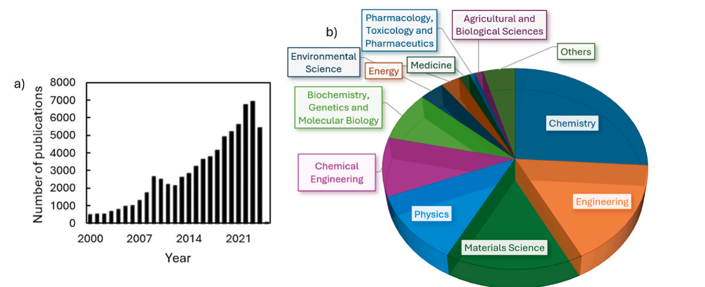
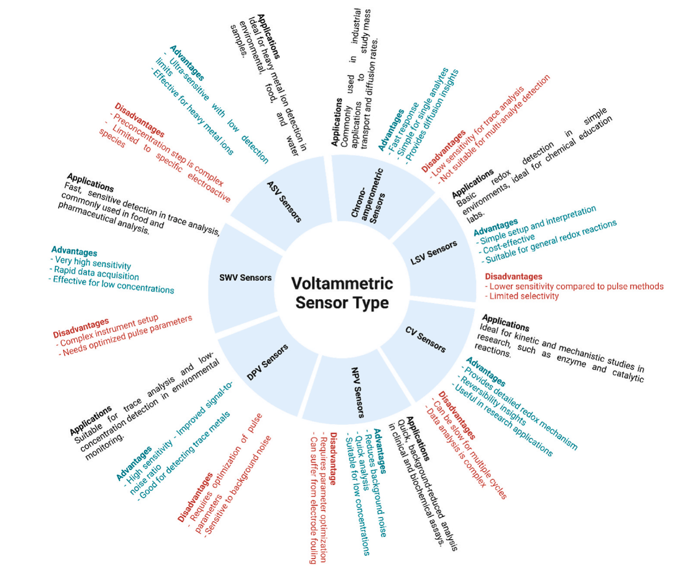
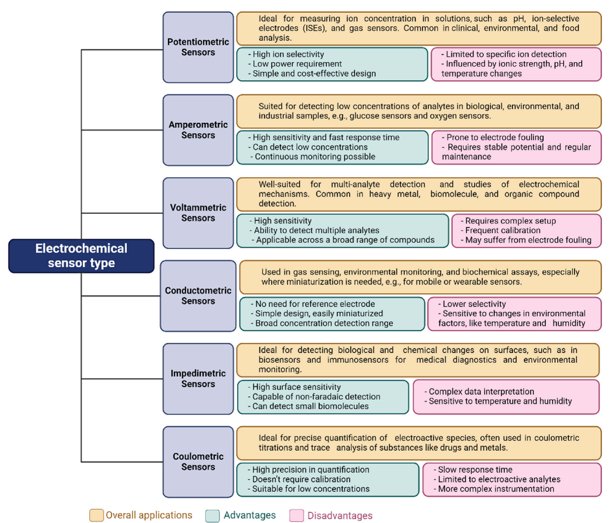
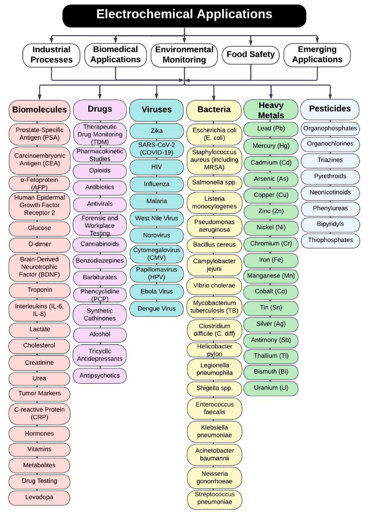
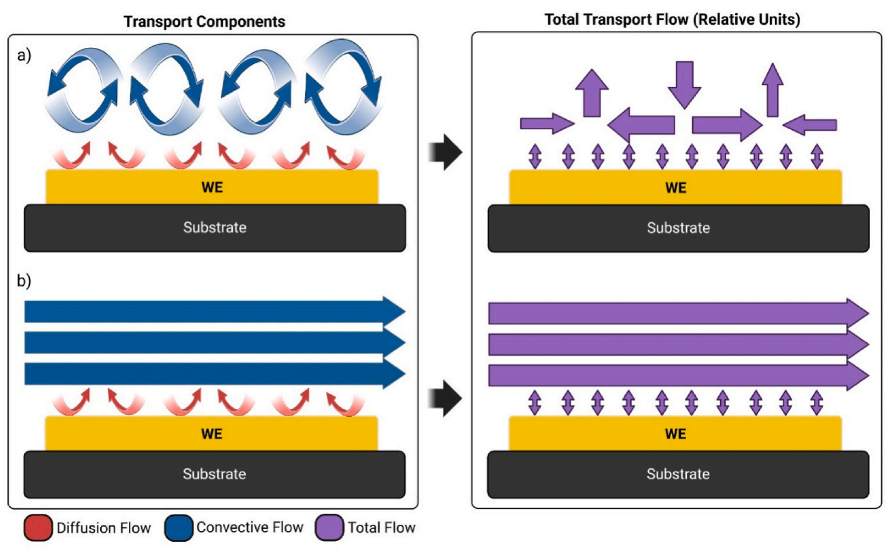
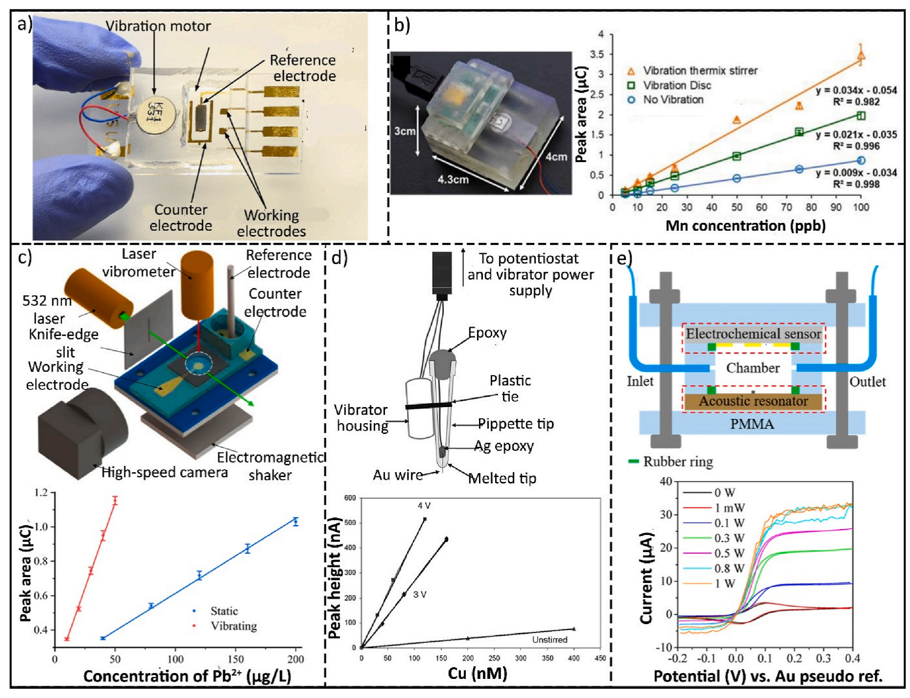
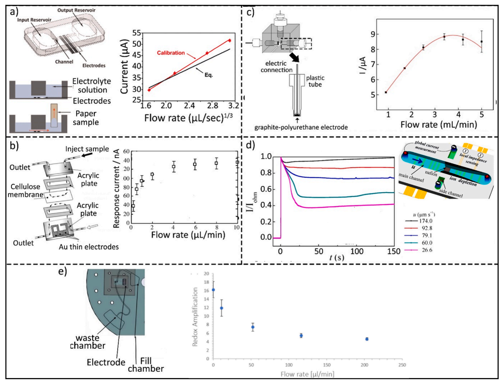
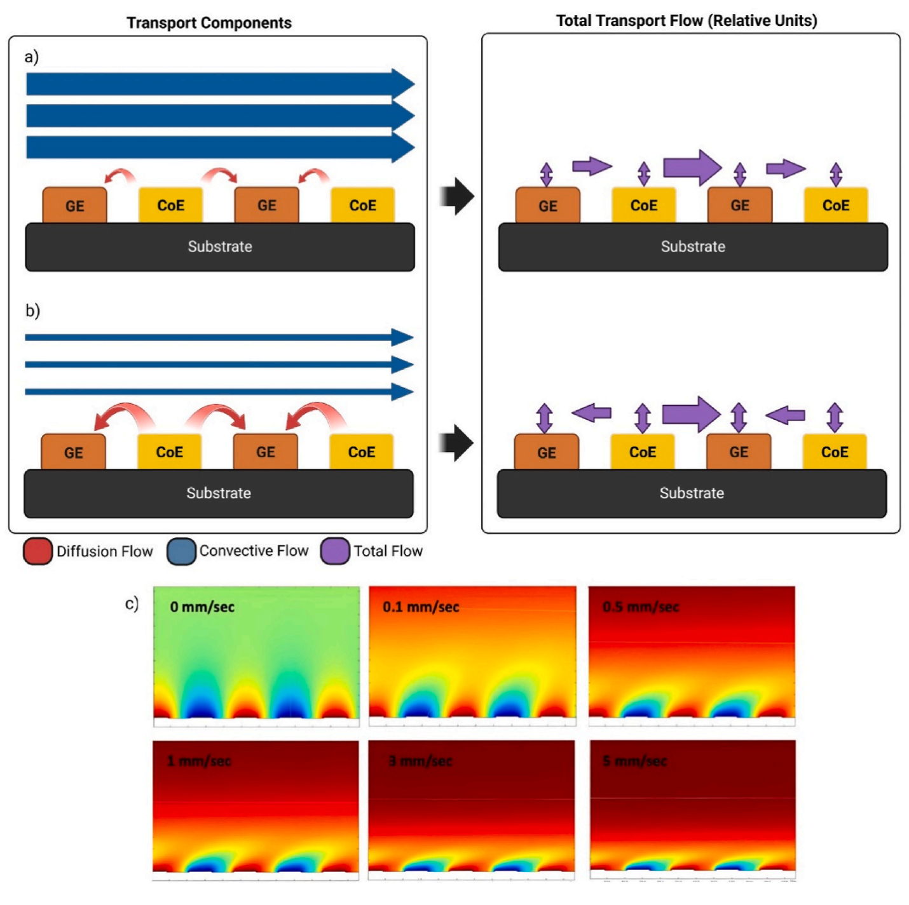

# Electrochemical sensors: Types, applications, and the novel impacts of vibration and fluid flow for microfluidic integration
Masoud Madadelahi a,*, Fabian O. Romero-Soto a, Rudra Kumar a, Uriel Bonilla Tlaxcala a, Marc J. Madou a,b

a School of Engineering and Sciences, Tecnologico de Monterrey, Av. Eugenio Garza Sada, NL, 2501, Sur, 64849, Monterrey, Mexico

b Department of Mechanical and Aerospace Engineering, University of California Irvine, Irvine, CA, 92697, USA

* Corresponding author. E-mail address: masoud.m@tec.mx (M. Madadelahi).

[https://doi.org/10.1016/j.bios.2024.117099](https://doi.org/10.1016/j.bios.2024.117099)

Received 30 September 2024; Received in revised form 8 December 2024; Accepted 22 December 2024; Available online 2 January 2025

0956-5663/© 2025 The Authors. Published by Elsevier B.V. This is an open access article under the CC BY-NC license (http://creativecommons.org/licenses/by-nc/4.0/).

## A R T I C L E I N F O

Keywords: Electrochemical sensor Convection Vibration Hydrodynamic flow Microfluidics

## A B S T R A C T

> Electrochemical sensors are part of a diverse and evolving world of chemical sensors that are impacted by high demand and ongoing technological advancements. Electrochemical sensors offer benefits like cost-efficiency, short response time, ease of use, good limit of detection (LOD) and sensitivity, and ease of miniaturization while providing consistent analytical results. These sensors are employed in various fields—such as healthcare and diagnostics, environmental monitoring, and the food industry—to detect bacteria, viruses, heavy metals, pesticides, and more. In this review, we provide a comprehensive overview of electrochemical sensing techniques, with a focus on enhancing sensor performance through the integration of vibration and hydrodynamic flow in microfluidic systems. We present a structured comparison of these methods, utilizing tables to highlight the approaches most effective for performance enhancement. Additionally, we classify various electrochemical sensing applications, offering insights into the practical utilization of these two techniques for lowering the LOD. Finally, we present a comparative analysis of relevant studies, highlighting how hydrodynamic flow and vibration impact the sensing mechanism. We also explore the potential of these techniques to facilitate the development of automated, high-throughput microfluidic platforms, thereby optimizing their functionality and efficiency.

## 1. Introduction

In 1991, the International Union of Pure and Applied Chemistry (IUPAC) defined a chemical sensor as “a device that converts chemical information—ranging from the concentration of a specific component in a sample to a complete compositional analysis—into an analytically useful signal. This chemical information can arise from a chemical reaction involving the analyte or from a physical property of the system being studied.” (Hulanicki et al., 1991) Electrochemical sensors, a crucial subcategory of chemical sensors, operate by measuring electrical signals during a chemical reaction. These voltage or current signals can be translated into analytes’ concentration, making them invaluable for a variety of applications. Electrochemical sensors offer practical benefits such as cost-efficiency, short response time, ease of use, good limit of detection (LOD) and sensitivity, and ease of miniaturization, all while consistently delivering reliable analytical results.

Fig. 1. Data retrieved from Scopus using the keywords "electrochemical AND sensors": (a) annual publication count (Covering the years 2000 through 2024) and (b) distribution across various research fields where these publications appear.

Given these advantages, electrochemical sensors have been extensively researched for a wide range of applications. Fig. 1 shows the number of publications related to electrochemical sensors and the field of these publications. This diagram indicates that publications in this field are on the rise, with most contributions originating from chemistry, engineering, and materials science.

Microfluidics has emerged as a pivotal platform for the miniaturization of fluidic systems, offering transformative capabilities across diverse applications. These include diagnostics through techniques such as polymerase chain reaction (PCR) (Madadelahi et al., 2024), (Madadelahi and Madou, 2023), advanced methods for cell separation (Dalili et al., 2019), cell encapsulation (Dortaj et al., 2024), (Taravatfard et al., 2023), and numerous other biomedical and analytical processes. To date, a variety of components and forces have been successfully integrated into microfluidic devices, including centrifugal (Hwu et al., 2022) and acoustic forces (Kordzadeh-Kermani et al., 2023), electrokinetic mechanisms (Li, 2022), optical sensors (Sanii et al., 2024), and more. Among these, electrochemical sensors stand out as promising candidates for integration, enabling the development of versatile sample-to-answer systems that streamline analysis and enhance functionality.

In this review, we present different electrochemical sensing techniques, focusing on improving sensor performance by incorporating vibration and hydrodynamic flow in microfluidic systems. We also categorize various electrochemical sensing applications, providing insights into how these two enhancement techniques can be effectively leveraged to achieve lower LOD for different applications in future studies. Hydrodynamic flow facilitates the integration of electrochemical sensing methods into microfluidic devices, while vibration offers a novel and cost-effective strategy for improving detection limits for electrochemical sensors in no-flow analytes. By explaining the underlying physical principles, summarizing relevant publications, and offering our perspective on future directions, this review provides a comprehensive understanding of these enhancement techniques and their potential for advancing electrochemical sensor performance in diverse applications.

## 2. Types and working principles of electrochemical sensors

Electrochemical sensors are categorized into several types, including potentiometric, amperometric, voltammetric, impedimetric, and conductometric sensors. Each type functions based on unique electrochemical principles to measure parameters like ion concentration, current response, conductivity, etc. This section provides a concise overview and comparison of their working principles, advantages, disadvantages, and limitations.

### 2.1. Potentiometric sensors

Potentiometric sensors are a class of electrochemical devices that operate by measuring the electromotive force (EMF) or potential difference between a reference and working electrode (WE) while operating under conditions of negligible current flow. The measured potential is directly linked to the concentration or activity of a specific ion, enabling precise measurement based on the Nernst equation (Bard and Faulkner, 2001). For a reaction:

$$\mathrm{Ox} + n e^{-} \rightarrow \mathrm{Red} \tag{1}$$

the Nernst equation, at a constant concentration of the reduced species (Red) at 298 K is given by Equation (2).

$$E = E^{0} + \frac{0.0592}{n}\log[\mathrm{Ox}] \tag{2}$$

Where.

- E = electrode potential (measured potential difference)
- E° = electrode’s potential in standard conditions
- n = number of electrons transferred per reactant species in the electrochemical reaction
- Ox = concentration of oxidized species

Equation (1) represents a general form of a redox reaction. From Equation (2), the electrochemical potential difference measured by the sensor exhibits a direct logarithmic dependence on the concentration of the oxidized species [Ox] present in the solution.

### 2.2. Amperometric sensors

Amperometric sensors are analytical devices designed to quantify the concentration of specific electroactive species by detecting the current generated through their oxidation or reduction at an electrode under a constant applied potential. The fixed voltage applied to the WE, induces an electrocatalytic redox reaction involving the target analyte. The relationship between electric charge and the amount of substance transformed during the electrochemical reactions is governed by Faraday’s law of electrolysis. This is mathematically expressed as Equation (3).

$$N = \frac{Q}{nF} \tag{3}$$

Where.

- N = number of moles of substance transformed (in moles)
- Q = total electric charge passed through the system (in coulombs)
- F = Faraday’s constant (≈96,485 C/mol)
- n = number of electrons transferred per molecule of reactant in the electrochemical reaction (stoichiometric coefficient)

In an amperometric sensor, the current i is recorded over time t, and it corresponds to the rate of the electrochemical reaction occurring at the electrode surface:

$$i = \frac{dQ}{dt} \tag{4}$$

Therefore, the reaction rate (in moles per second) can be expressed as,

$$\mathrm{Rate}(\mathrm{mol}/\mathrm{s}) = \frac{dN}{dt} = \frac{i}{nF} \tag{5}$$

This shows that the reaction rate is directly linked to the analyte’s concentration, resulting in a measurable electric current. The sensor measures this current, which corresponds to the analyte concentration. By recording and analyzing this current, the sensor provides precise quantitative information about the analyte concentration in the sample.

### 2.3. Voltammetric sensors

Fig. 2. Comparison of various voltammetric sensors, including their advantages and disadvantages: Linear Sweep Voltammetry (LSV), Cyclic Voltammetry (CV), Normal Pulse Voltammetry (NPV), Differential Pulse Voltammetry (DPV), Square Wave Voltammetry (SWV), Anodic Stripping Voltammetry (ASV), and Chronoamperometry (CA).

Voltammetric sensors are analytical devices designed to measure the electrochemical properties of a solution by analyzing the current response with respect to a systematically varied applied potential. The principle behind these sensors involves applying a potential on a WE that changes with time, generating a current response that corresponds to the changing analyte concentration near the electrode surface (Lopez-Tellez et al., 2022). The resulting current is monitored and recorded as a voltammogram, offering comprehensive information on the redox behavior and concentration of the analyte in the solution. There are various voltammetric methods available, including cyclic voltammetry (CV), stripping voltammetry (SV), square-wave voltammetry (SWV), linear sweep voltammetry (LSV), differential pulse voltammetry (DPV), etc. In Fig. 2, we provide a brief description of various types of voltammetric sensors with advantages and disadvantages listed.

### 2.4. Conductometric sensors

Conductometric electrochemical sensors quantify the total concentration of ions in a solution by measuring its electrical conductivity. These sensors function by applying an alternating current between two electrodes, and the measured conductivity is proportional to the ionic concentration and mobility in the solution. The conductivity κ (in S/m) can then be derived based on the resistance between the electrodes, using the formula κ = L/A⋅R, where R is the measured resistance, A is the electrode’s surface area, and L is the distance between the electrodes (Baranwal et al., 2022).

### 2.5. Impedimetric sensors

In an impedimetric electrochemical sensor, one applies a small AC voltage across a working and a counter electrode at different potentials of the WE vs. a reference electrode to measure the resulting AC and thus determine the impedance of an electrochemical cell. The impedance is often represented as a complex quantity, with both real and imaginary components, and is generally plotted as a Nyquist plot. It shows the relationship between the real (resistance) and imaginary component (reactance) of the impedance, which varies with the frequency of the applied AC signal, or as a Bode plot, which shows the impedance and phase angle as a function of the applied AC frequency (Lazanas and Prodromidis, 2023).

### 2.6. Coulometric sensors

Coulometric sensors measure the concentration of analytes by quantifying the total charge needed to complete an electrochemical reaction. These sensors drive an electrochemical reaction by passing a known amount of electric charge through a sample, completely converting the target analyte into a different chemical form. The charge required for this conversion is linearly related to the analyte concentration in the sample.

In coulometric sensors, the current (I) is measured over time, and the total charge is calculated using the integration of Equation (4) as shown in Equation (6).

$$Q = \int_{0}^{t} I\,dt \tag{6}$$

Fig. 3. Comparison of various types of electrochemical sensors, their advantages, and disadvantages.

A comparative study of various types of electrochemical sensors, as well as their advantages and disadvantages, is given in Fig. 3.

## 3. Applications of electrochemical sensors

Electrochemical sensors have found applications across a diverse range of fields. A wide variety of electrochemical assays incorporating diverse electrode materials enables enzymes, antibodies, aptamers, and bioinspired receptors to precisely and efficiently capture targets, leading to enhanced specificity. Over the last 20 years, nanomaterials, including but not limited to conductive polymers, metal oxides, metals, and metal-organic or carbon-based frameworks, have also been incorporated in electrochemical assays. This is why electrochemical biosensors are among the most widely utilized types of biosensors (Chaubey and Malhotra, 2002).

Fig. 4. Applications of electrochemical sensors for detecting biomolecules, drugs, viruses, bacteria, heavy metals, and pesticides. Additional details on these applications are provided in Tables 1–6

In this section, we will classify various electrochemical sensor applications into five key categories: Biomedical, environmental, food safety, industrial, and emerging applications. Most of these categories encompass specific lists of target analytes. Fig. 4 highlights the use of electrochemical sensors for detecting biomolecules, heavy metals, viruses, bacteria, pesticides, and drugs across these diverse applications. In Section 4, we will delve into advancements in electrochemical sensors’ LOD improvement techniques, including vibration and hydrodynamic flow. Understanding how these methods enhance sensor performance is crucial, as they directly impact the effectiveness of the applications discussed. By integrating these applications with enhanced detection techniques, we can achieve more effective monitoring and management strategies, ultimately leading to better outcomes in addressing critical challenges.

The following sections provide a review of these five application areas.

### 3.1. Biomedical applications

**Table 1. List of biomolecules to be detected using electrochemical sensors.**

<table>
    <thead><tr><th>Biomolecules</th><th></th><th>Substrate</th><th>Detection method</th><th>LOD</th><th>Ref.</th></tr></thead>
    <tbody><tr><td>Early Secreted Antigen Target-6 (ESAT-6): Utilized for diagnosing and monitoring tuberculosis infections</td><td></td><td>Screening 4D7 ESAT-6 monoclonal antibodies on an electrode functionalized with nitrogen-doped graphene oxide</td><td>CV</td><td>7.0 pg/mL</td><td>Xia et al. (2023)</td></tr><tr><td>Prostate-Specific Antigen (PSA): Used for diagnosing and monitoring prostate cancer.</td><td></td><td>Glassy carbon, screen-printed, boron-doped diamond, carbon paste, exfoliated graphite, and gold electrodes are used</td><td>CV, DPV, LSV and SWV</td><td>8.74 fg/mL</td><td>Özyurt et al., 2022</td></tr><tr><td>Carcinoembryonic Antigen (CEA): Commonly used in the detection and management of colorectal cancer.</td><td></td><td>Drop-casting gold nanoparticle-manganese dioxide onto the screen-printed carbon electrode.</td><td>CV, EIS</td><td>0.10 pg/mL</td><td>Manasa et al. (2022)</td></tr><tr><td>α-Fetoprotein (AFP): Used for diagnosing liver cancer and certain types of testicular and ovarian cancers.</td><td></td><td>Graphene-based nanomaterials, such as graphene oxide, reduced graphene oxide, and graphene nanocomposites.</td><td>CV and EIS</td><td>0.075 pg/mL</td><td>Shao and Liu (2024)</td></tr><tr><td>Human Epidermal Growth Factor Receptor 2 (HER2): Associated with breast cancer, HER2 is a key biomarker in cancer therapeutics.</td><td></td><td>Glassy carbon electrode to enhance the detection signal</td><td>CV and EIS</td><td>0.049 pg/mL</td><td>Xu et al. (2023)</td></tr><tr><td>Glucose: Vital for diabetes monitoring, glucose detection is widely supported by electrochemical biosensors.</td><td></td><td>A highly selective Fe@ZnO composite material was synthesized using a straightforward annealing method and then drop-cast onto a screen-printed electrode.</td><td>CV</td><td>0.30 μM</td><td>Dong et al. (2021)</td></tr><tr><td>D-dimer: Used in the detection of blood clotting disorders and often in the diagnosis of pulmonary embolism.</td><td>blood clotting disorders</td><td>The p-type silicon wafer was cleaned using piranha solution, a mixture of sulfuric acid and hydrogen peroxide in a 3:1 ratio, and then rinsed with distilled water.</td><td>DPV</td><td>124 fM</td><td>Krishnan et al. (2022)</td></tr><tr><td></td><td>pulmonary embolism</td><td>A glassy carbon electrode modified with cadmium sulfide quantum dots connected to chitosan and multi-walled carbon nanotubes</td><td>DPV</td><td>6.3 nM</td><td>Mruthunjaya and Torriero (2024)</td></tr><tr><td>Brain-Derived Neurotrophic Factor (BDNF): Used in studying neurodegenerative diseases and brain injuries.</td><td></td><td>A molecularly imprinted polymer, and integrated with a system of thin-film metal electrodes for rapid detection.</td><td>DPV</td><td>9 pg/mL</td><td>Ayankojo et al. (2023)</td></tr><tr><td>Troponin: A biomarker critical for detecting heart attacks and other cardiovascular conditions.</td><td></td><td>This sensor is made up of silver nanoparticles, MoS2, and reduced graphene oxide.</td><td>DPV</td><td>0.27 pg/mL</td><td>Li et al. (2021)</td></tr><tr><td>Interleukins (IL-6, IL-8): Common inflammatory biomarkers, often elevated in autoimmune disorders and infections.</td><td></td><td>A flexible electrochemical immunosensor based on carbon fiber is proposed</td><td>CV and DPV</td><td>0.05 fg/mL</td><td>Madhu et al. (2023)</td></tr><tr><td>Lactate: Important for assessing metabolic conditions and athletic performance.</td><td></td><td>Evaluation of both LSG and Ag/AgCl-modified LSG as reference electrodes for chronoamperometric detection of lactate</td><td>CV</td><td>0.11 mM</td><td>Madden et al. (2022)</td></tr><tr><td>Cholesterol: Monitored for cardiovascular risk assessment.</td><td></td><td>A sensor based on a platinum/reduced graphene oxide/poly nanocomposite-modified electrode</td><td>CV and DPV</td><td>3.0 μg/mL</td><td>Yadav et al. (2021)</td></tr><tr><td>Creatinine: Indicates kidney function and is used in renal disease monitoring.</td><td></td><td>A copper oxide-ionic liquid/reduced graphene oxide modified electrode was used for non-enzymatic creatinine detection.</td><td>CV</td><td>37.3 μM</td><td>Teekayupak et al. (2023)</td></tr><tr><td>Levodopa (L-Dopa)</td><td></td><td>Tyrosinase enzyme was immobilized on the surface of screen-printed carbon electrodes</td><td>CA</td><td>300 nM</td><td>Ding et al. (2024)</td></tr><tr><td>Urea: Another kidney function marker, often assessed alongside creatinine.</td><td></td><td>The surface area of the nickel electrode was initially chemically oxidized to nickel hydroxide</td><td>CV</td><td>1.0 × 10−6 M</td><td>Quadrini et al. (2023)</td></tr><tr><td>Tumor Markers (various): Such as CA-125 for ovarian cancer and HER2 for breast cancer.</td><td>CA-125</td><td>A platinum-titania composite based glassy carbon electrode.</td><td>DPV, CV and EIS</td><td>0.0096 ng/mL</td><td>Er et al. (2022)</td></tr><tr><td></td><td>HER2</td><td>Gold sensor chips combined with amperometric detection</td><td>DPV and CV</td><td>1.06 ng/mL</td><td>Wignarajah et al. (2023)</td></tr><tr><td>C-reactive Protein (CRP): A marker for inflammation and infection.</td><td></td><td>Zinc oxide nanotubes modified with monoclonal anti-C-reactive protein antibodies of the mouse immunoglobulin G1 isotype</td><td>CV</td><td>0.15 nM</td><td>Dhara and Mahapatra (2020)</td></tr><tr><td>Interleukins: Various cytokines that indicate immune response and inflammation.</td><td></td><td>A flexible electrochemical immunosensor based on carbon fiber</td><td>CV and DPV</td><td>0.05 fg/mL</td><td>Madhu et al. (2023)</td></tr><tr><td>Hormones: Such as insulin, cortisol, and thyroid hormones for metabolic and endocrine disorders.</td><td>insulin</td><td>Gold was deposited onto polyurethane using electron beam evaporation</td><td>SWV</td><td>0.1 ng/mL</td><td>Park et al. (2020)</td></tr><tr><td></td><td>cortisol</td><td>An electrode modified with single-walled carbon nanotubes</td><td>DPV and SWV</td><td>1 pg/mL</td><td>Karuppaiah et al. (2023)</td></tr><tr><td></td><td>thyroid hormones</td><td>The sensor is based on a glassy carbon electrode modified with a nanocomposite of iron oxide and graphene</td><td>CV, DPV and EIS</td><td>27 nM</td><td>Baluta et al. (2023)</td></tr><tr><td>Catecholamines: Like dopamine and adrenaline, linked to stress and metabolic responses.</td><td></td><td>The first microneedle-based sensor with highly nanoporous gold (h-nPG) for continuous monitoring of catecholamine</td><td>EIS</td><td>100 nM</td><td>Tortolini et al. (2022)</td></tr><tr><td>Vitamins: Such as vitamin D and B12, monitored for deficiencies</td><td>vitamin D</td><td>heterogeneous nanostructures consisting of molybdenum disulfide and an electrochemically reduced graphene oxide composite</td><td>DPV</td><td>0.02 ng/mL</td><td>Park et al. (2022)</td></tr><tr><td></td><td>B12</td><td>Bimetallic palladium-gold nanostructures were electrodeposited onto a polypyrrole/carbon fiber paper electrode</td><td>DPV</td><td>1.32 pM</td><td>Akshaya et al. (2020)</td></tr><tr><td>Metabolites: Like amino acids and fatty acids, assessed for metabolic disorders.</td><td>amino acids</td><td>Composed of graphene, reduced graphene oxide, carbon nanoparticles, carbon nanodots, carbon nanofibers, and carbon nanotubes.</td><td>DPV</td><td>0.0063 μM</td><td>Imanzadeh et al. (2023)</td></tr><tr><td></td><td>fatty acids</td><td>Screen-printed electrodes were used as the substrate electrode. The electrode was modified with gold nanoparticles and a composite of ferrocene, graphene oxide, and multiwalled carbon nanotubes</td><td>DPV</td><td>0.48 nM</td><td>Zhang et al. (2024)</td></tr></tbody>
  </table>

CV: Cyclic voltammetry, EIS: Electrochemical impedance spectroscopy, SWV: Square Wave Voltammetry, CA: Chronoamperometry, DPV: Differential Pulse Voltammetry, SWASV: Square Wave Anodic Stripping Voltammetry, ASV: Anodic Stripping Voltammetry, PEC: Photoelectrochemical, PAD: Pulsed Amperometric Detection.

**Table 2. Overview of various viruses detected using electrochemical sensors.**

<table>
    <thead><tr><th>Virus</th><th>Substrate</th><th>Detection method</th><th>LOD</th><th>Ref.</th></tr></thead>
    <tbody><tr><td>Zika</td><td>A gold multiplex device with one counter electrode, two reference electrodes, and four working electrodes.</td><td>CV and EIS</td><td>1.17 ng/mL</td><td>Sampaio et al. (2022)</td></tr><tr><td>SARS-CoV-2 (COVID-19)</td><td>AuNPs/Pthi-Ald/ITO</td><td>EIS</td><td>0.48 fg/mL</td><td>Aydı et al. (2022)</td></tr><tr><td>Hepatitis B and C Viruses</td><td>Electrochemical paper-based analytical devices (ePADs)</td><td>CV and EIS</td><td>18.2 pg/mL for Hepatitis B and 1.19 pg/mL for Hepatitis C</td><td>Boonkaew et al. (2021)</td></tr><tr><td>HIV</td><td>They prepared a gold nanoparticle-modified indium tin oxide electrode through electrochemical deposition.</td><td>CV, SWV, EIS, DPV</td><td>3.0 × 10−13 M</td><td>Valizadeh et al. (2017)</td></tr><tr><td>Influenza</td><td>1,3,5-tris(4-aminophenyl) benzene and 1,4-benzenedicarboxaldehyde monomers to synthesize TPB-DVA covalent organic frameworks nanomaterials as electrode materials using a Schiff base reaction</td><td>CV, EIS, DPV, and CA</td><td>5.42 fM</td><td>Yan et al. (2023)</td></tr><tr><td>Malaria</td><td>The electrodes are composed of conductive polymers, metal-organic frameworks, graphene, nanofibers, carbon nanotubes, and nanoparticles.</td><td>DPV</td><td>16 ng/mL</td><td>Nate et al. (2022)</td></tr><tr><td>West Nile Virus</td><td>The double-layer MXene/Tr-WNV aptamer assembled on the Au electrode</td><td>SWV</td><td>2.57 pM</td><td>Park et al. (2023)</td></tr><tr><td>Norovirus</td><td>Glassy carbon electrodes, 3 mm in diameter, were polished with aluminum oxide powder of 0.3 and 0.05 μm</td><td>DPV</td><td>0.84 copies/mL</td><td>Zhao et al. (2022)</td></tr><tr><td>Cytomegalovirus (CMV)</td><td>In this study, a silicon microcantilever (OCTO500S, Micromotive, Germany) was employed</td><td>DPV</td><td>30 pg/mL</td><td>Alzahrani et al. (2023)</td></tr><tr><td>Human Papillomavirus (HPV)</td><td>An amine ionic liquid-functionalized reduced graphene oxide nano platform.</td><td>DPV</td><td>1.3 nM</td><td>Mousavi et al. (2021)</td></tr><tr><td>Ebola Virus</td><td>Geno sensor based on DNA capture probe on SPCE</td><td>EIS</td><td>4.7 nM</td><td>Sharma et al. (2022)</td></tr><tr><td>Dengue Virus</td><td>A label-free electrochemical immunosensor, which consists of a glassy carbon electrode coated with modified polyaniline, was proposed for enhanced detection capabilities.</td><td>DPV</td><td>0.33 ng/mL</td><td>Dhal et al. (2020)</td></tr></tbody>
  </table>

**Table 3. List of drugs detected by electrochemical sensors.**

<table>
    <thead><tr><th>Drug</th><th></th><th>Substrate</th><th>Detection method</th><th>LOD</th><th>Ref.</th></tr></thead>
    <tbody><tr><td>Detection of Illicit Drugs Targeted Analytes: Cocaine, amphetamines, methamphetamines, heroin, and morphine, detected through metabolites in saliva, blood, or urine.</td><td>Cocaine</td><td>Glassy carbon, screen-printed, boron-doped diamond, carbon paste, exfoliated graphite, and gold electrodes are utilized.</td><td>EIS and DPV</td><td>1.29 pM</td><td>Bilge et al. (2022)</td></tr><tr><td></td><td>amphetamines</td><td>NanoMIPs were immobilized onto carbon electrodes using a chitosan/graphene composite material</td><td>DPV</td><td>0.3 nM</td><td>Truta et al. (2023)</td></tr><tr><td></td><td>methamphetamines</td><td>Measurement was performed using a self-assembled boron-doped diamond electrode as an effective platform.</td><td>CV and DPV</td><td>178.2 nM</td><td>Khorablou et al. (2021)</td></tr><tr><td></td><td>heroin</td><td>The GO @ CMC.MgO/GCE electrode is used as an electrochemical sensor to simultaneously</td><td>DPV</td><td>1 × 10−7 μM</td><td>Javed et al. (2023)</td></tr><tr><td></td><td>morphine</td><td>A platinum wire and a silver-silver chloride (Ag/AgCl, 3 M KCl) reference electrode were employed.</td><td>CV and DPV</td><td>1.9 nM</td><td>Bahrami et al. (2020)</td></tr><tr><td>Therapeutic Drug Monitoring (TDM) Targeted Analytes: Lithium (for bipolar disorder), antiepileptic drugs (e.g., carbamazepine, valproate), and immunosuppressants (e.g., tacrolimus), measured in blood samples to manage dosage levels accurately.</td><td>Lithium</td><td>The sensor consists of a bare carbon screen-printed electrode</td><td>CV and DPV</td><td>1.22 μM</td><td>Hanitra et al. (2020)</td></tr><tr><td></td><td>carbamazepine</td><td>The gadolinium vanadate nanostructure decorated with functionalized carbon nanofibers nanocomposite was synthesized using the hydrothermal method and then fabricated onto a glassy carbon electrode.</td><td>EIS and CV</td><td>0.0018 μM</td><td>Mariyappan et al. (2022)</td></tr><tr><td></td><td>immunosuppressants</td><td>The electroreduction of Azp on a bare glassy carbon electrode (GCE) shows an insufficient and broad signal, indicating a high overpotential.</td><td>DPV</td><td>74.65 nM</td><td>Kumar et al. (2022)</td></tr><tr><td>Pharmacokinetic Studies Targeted Analytes: Active drug compounds and their metabolites, allowing analysis of drug absorption, distribution, metabolism, and excretion across various drug classes.</td><td></td><td>The electrochemical aptamer-based (E-AB) sensor uses an aptamer self-assembled on a gold electrode through alkane-thiols as the recognition element.</td><td>SWV</td><td>100 nM</td><td>Qin et al. (2024)</td></tr><tr><td>Point-of-Care Testing Targeted Analytes: Illicit and prescription drug metabolites, designed for rapid testing in roadside or clinical emergency settings for drugs such as opioids and amphetamines.</td><td>Opioids such as morphine, codeine, and heroin for substance abuse testing.</td><td>Morphine A platinum wire and a silver-silver chloride (Ag/AgCl, 3 M KCl) reference electrode were employed.</td><td>CV and DPV</td><td>1.9 nM</td><td>Bahrami et al. (2020)</td></tr><tr><td></td><td></td><td>codeine A polymeric thin film was formed on the surface of the glassy carbon electrode</td><td>CV and DPV</td><td>0.0150 pM</td><td>Yence et al. (2023)</td></tr><tr><td></td><td></td><td>heroin The GO@CMC.MgO/GCE electrode is used as an electrochemical sensor to simultaneously</td><td>DPV</td><td>1 × 10−7 μM</td><td>Javed et al. (2023)</td></tr><tr><td></td><td></td><td>Fentanyl (FT) The screen-printed carbon electrode transducer incorporates nitrogen-doped mesoporous carbon nanoparticles derived from zeolitic imidazolate framework-8</td><td>SWV</td><td>9.9 μg/L</td><td>Zhou et al. (2024)</td></tr><tr><td></td><td>amphetamines</td><td>NanoMIPs were immobilized onto carbon electrodes using a chitosan/graphene composite material</td><td>DPV</td><td>0.3 nM</td><td>Truta et al. (2023)</td></tr><tr><td>Detection of Antibiotics and Antiviral Drugs Targeted Analytes: Antibiotics (e.g., tetracyclines, beta-lactams) and antivirals (e.g., acyclovir), typically monitored in blood or plasma for dosage management in vulnerable patients.</td><td>Antibiotics</td><td>Modified copper(I) oxide nanoparticles, nitrogen-doped graphene, and perfluorosulfonic acid were applied onto a glassy carbon electrode</td><td>CV and DPV</td><td>0.34 μmol/L</td><td>Wang et al. (2021)</td></tr><tr><td></td><td>antivirals</td><td>A flexible screen-printed carbon electrode is custom-made using PET sheets</td><td>EIS, CV, DPV and SWV</td><td>0.0067 μM</td><td>Sharma and Hwa (2022)</td></tr><tr><td>Forensic and Workplace Testing Targeted Analytes: Traces of illicit substances such as THC (cannabis), MDMA (ecstasy), and synthetic cannabinoids to determine recent drug usage in various biological matrices.</td><td>THC (cannabis)</td><td>A screen-printed graphene electrode modified with copper phthalocyanine</td><td>DPV</td><td>1.370 μg/L</td><td>Pholsiri et al. (2023)</td></tr><tr><td></td><td>MDMA (ecstasy)</td><td>The nanomaterials used were either carbon-based, such as single-walled carbon nanotubes, graphene oxide, and nanodiamond particles, or metallic nanoparticles, including gold nanoparticles and palladium nanoparticles.</td><td>DPV</td><td>0.018 μM</td><td>Drăgan et al. (2023)</td></tr><tr><td></td><td>synthetic cannabinoids</td><td>A platinum wire was used as the auxiliary electrode, and a silver/silver chloride reference electrode with a 3 M sodium chloride solution was employed.</td><td>DPV</td><td>0.01 mM</td><td>Merli et al. (2024)</td></tr><tr><td>Cannabinoids: Detection of THC and CBD for cannabis use monitoring.</td><td>THC</td><td>A screen-printed graphene electrode modified with copper phthalocyanine</td><td>DPV</td><td>1.370 μg/L</td><td>Pholsiri et al. (2023)</td></tr><tr><td></td><td>CBD</td><td>A molecular imprinting-based sensor on a multi-walled carbon nanotubes modified electrode</td><td>CV and DPV</td><td>0.37 ng/mL</td><td>Merli et al. (2024)</td></tr><tr><td>Benzodiazepines: Detection of drugs like diazepam and alprazolam for anxiety and insomnia treatment.</td><td>diazepam</td><td>Electrodes were modified with multiwalled carbon nanotubes and poly(3,4-ethylenedioxythiophene).</td><td>SWV</td><td>0.06 μM</td><td>Corsato et al. (2024)</td></tr><tr><td></td><td>alprazolam</td><td>Detection using a co-induced material on a glassy carbon electrode</td><td>CV and EIS</td><td>0.3 μg/L</td><td>Phua et al. (2023)</td></tr><tr><td>Barbiturates: Monitoring of older sedative drugs like phenobarbital.</td><td></td><td>Unique micro-sized imprinted polymer/multiwalled carbon nanotube-based sensors are introduced for potentiometric sensing of barbital</td><td>DPV and CV</td><td>1.0 × 10−7 M</td><td>Al Shagri et al. (2022)</td></tr><tr><td>Phencyclidine (PCP): Assessment of PCP use in drug screenings.</td><td></td><td>To meet this requirement, various types of electrodes are used, including glassy carbon electrode, noble metal electrode, screen-printed electrode, diamond-like electrode, carbon paste electrode, and different modified electrodes.</td><td>SWV</td><td>0.011 μM</td><td>Ren et al. (2021)</td></tr><tr><td>Synthetic Cathinones: Known as &quot;bath salts,&quot; these substances are increasingly common in drug tests.</td><td></td><td>A screen-printed sensor modified with chemically deposited boron-doped diamond.</td><td>DPV</td><td>0.66 μmol/L</td><td>Melo et al. (2023)</td></tr><tr><td>Alcohol: Detection of ethanol levels for impairment assessments.</td><td></td><td>Commercial screen-printed carbon electrodes modified with polyaniline</td><td>CV</td><td>0.045 mM/L</td><td>Biscay et al. (2021)</td></tr><tr><td>Tricyclic Antidepressants: Monitoring of medications like amitriptyline and nortriptyline.</td><td></td><td>Screen-printed carbon-based electrodes function as working electrodes</td><td>DPV</td><td>1.1 × 10−7 M</td><td>Ferancov et al. (2001)</td></tr><tr><td>Antipsychotics: Detection of medications such as risperidone and olanzapine.</td><td>risperidone</td><td>The glassy carbon electrode was polished using an electrode polishing kit before any modification.</td><td>CV</td><td>10.62 nM</td><td>Basavapura Ravikumar et al. (2023)</td></tr><tr><td></td><td>olanzapine</td><td>A novel and easy-to-construct electrochemical sensor built on a two-dimensional printed reduced graphene oxide electrode modified with polymer</td><td>CV and EIS</td><td>0.91 nM</td><td>Thangphatthanarungruang et al. (2024)</td></tr></tbody>
  </table>

Healthcare is one of the most important applications for electrochemical sensors. One of the most prominent examples in this field is glucose sensors, now one of the most widely used devices to monitor blood glucose for diabetes care. Point of care is an important healthcare area in which electrochemical sensors play significant roles in the fast and easy detection of molecules like lactate (Madden et al., 2022), cholesterol (Yadav et al., 2021), urea (Quadrini et al., 2023), creatinine (Teekayupak et al., 2023), levodopa(L-dopa) (Moon et al., 2021), (Ding et al., 2024), (Zhao et al., 2024). In Table 1, we list some of the most important biomarkers that have been detected using electrochemical sensors. Electrochemical biosensors have also been widely employed to detect viral infections such as dengue (Anusha et al., 2019), (Dhal et al., 2020), and influenza (Yang et al., 2024), (Yan et al., 2023). These sensors can detect viral antigens or nucleic acids, allowing for point-of-care diagnostics and mass screening during outbreaks. Electrochemical biosensors are also used for detecting respiratory pathogens, including respiratory syncytial virus (RSV) (e Silva et al., 2024), (Xia et al., 2023) and, SARS-CoV-2 (COVID-19) (Kumar et al., 2022), (Aydı et al., 2022). The latter sensors often incorporate nanomaterials to enhance sensitivity and are suitable for detecting multiple pathogens simultaneously (Ang et al., 2023). In Table 2, we list viruses that have been detected using electrochemical sensors with their materials, detection method, and LOD. Drug testing is another application of electrochemical sensors. In Table 3, we list drugs that have been sensed using electrochemical sensors.

### 3.2. Environmental monitoring

**Table 4. Summary of different heavy metals identified using electrochemical sensors.**

<table>
    <thead><tr><th>Heavy metals</th><th>Substrate</th><th>Detection method</th><th>LOD</th><th>Ref.</th></tr></thead>
    <tbody><tr><td>Lead (Pb): A widely monitored toxic metal, especially prevalent in water and soil testing.</td><td>A cost-effective electrode material, copper, which allows for simple fabrication</td><td>ASV</td><td>21 nM</td><td>Kang et al. (2017)</td></tr><tr><td>Mercury (Hg): Frequently detected in industrial waste and contaminated water sources.</td><td>A graphene electrode modified with polyglycine</td><td>CV and DPV</td><td>0.8 μM</td><td>Raril and Manjunatha (2020)</td></tr><tr><td>Cadmium (Cd): Monitored in environmental and food safety applications due to its toxicity.</td><td>A uniform polymer film of multi-walled carbon nanotubes and polyaniline/reduced polystyrene was deposited onto the glassy carbon electrode</td><td>SWV and DPV</td><td>3.8 nM</td><td>Yi et al. (2022)</td></tr><tr><td>Arsenic (As): Commonly detected in groundwater, particularly in regions with arsenic contamination.</td><td>An electrochemical sensor that integrates a conducting polymer (polyaniline), a cationic polymer, and graphene oxide nanosheets functionalized with acrylic acid for reinforcement.</td><td>CV and DPV</td><td>0.12 μM</td><td>Hamid Kargari et al. (2023)</td></tr><tr><td>Copper (Cu): Used to monitor industrial discharges and environmental samples.</td><td>electrochemical sensing of Cu2+ ions using transition metal complexes</td><td>CV and DPV</td><td>1.2 × 10−6 M</td><td>(Ramdass et al., 2017), (Qiao et al., 2019)</td></tr><tr><td>Zinc (Zn): Detected in various environmental and biological samples.</td><td>Sensitive electrochemical sensor using a graphene–polyaniline nanocomposite</td><td>CV</td><td>1 μg/L</td><td>Ruecha et al. (2015)</td></tr><tr><td>Nickel (Ni): Monitored in industrial waste and environmental pollution studies.</td><td>electrochemical platform based on screen-printed electrodes</td><td>CV and EIS</td><td>2.5 μg/L</td><td>Selvolini and Marrazza (2023)</td></tr><tr><td>Chromium (Cr): Particularly Cr(VI), which is toxic, is commonly detected in industrial pollution.</td><td>Printed carbon nanotubes (CNTs) onto the different electrodes</td><td>SWV</td><td>0.8 μg/L</td><td>Hilali et al. (2020)</td></tr><tr><td>Iron (Fe): Detected in water samples for quality control and monitoring.</td><td>The working electrode of the screen-printed device consists of a carbon-based material, likely screen-printed carbon, and has been modified with a nanocomposite made of carbon black and gold nanoparticles. This modification was achieved using a drop-casting technique.</td><td>SWV</td><td>0.05 mg/L</td><td>Mazzaracchio et al. (2023)</td></tr><tr><td>Manganese (Mn): Monitored in water systems and industrial processes.</td><td>A solid-state electropolymerization process was developed to prepare the ITO/Manganese phthalocyanine-tannic acid/azo-polyaniline electrode</td><td>CV, CA, and SWV</td><td>4.2 μg/L</td><td>Akyü et al. (2019)</td></tr><tr><td>Cobalt (Co): Used in monitoring batteries, industrial waste, and environmental pollution.</td><td>screen-printed electrodes</td><td>CV and EIS</td><td>2.4 μg/L</td><td>Selvolini and Marrazza (2023)</td></tr><tr><td>Tin (Sn): Detected in environmental samples and industrial processes.</td><td>bismuth film electrode (BiFE)</td><td>DPV and stripping voltammetry</td><td>2.1 × 10−9 mol/L</td><td>Grabarczyk et al. (2023)</td></tr><tr><td>Silver (Ag): Monitored in environmental and clinical samples.</td><td>A carbon paste electrode modified with gold nanoparticles and DNA probes</td><td>DPV</td><td>90 pM–1 nM</td><td>Xu et al. (2021)</td></tr><tr><td>Antimony (Sb): Detected in industrial and environmental monitoring.</td><td>Boron-doped diamond nanoparticles applied to the surface of a screen-printed electrode</td><td>SWV</td><td>2.41 × 10−8 M</td><td>Jiwanti et al. (2023)</td></tr><tr><td>Thallium (Tl): Used in detecting pollution and contamination, particularly in water samples.</td><td>Surface modifications of a glassy electrode with a nanocomposite made of MnO2 magnetic sepiolite and multi-walled carbon nanotubes</td><td>SWASV</td><td>0.03 ppb</td><td>Jin et al. (2023)</td></tr><tr><td>Bismuth (Bi): Monitored in environmental and pharmaceutical applications.</td><td>A glassy carbon disc electrode from BASi as the working electrode, a graphite rod acted as the counter electrode, and a Hg/HgO (1 M KOH) electrode as the reference electrode.</td><td>ASV</td><td>8.5 ppb</td><td>Arnot and Lambert (2021)</td></tr><tr><td>Uranium (U): Detected in environmental samples, particularly in areas with mining activities.</td><td>An ion-imprinted polymer as an artificial receptor</td><td>DPV</td><td>0.43 μg/L</td><td>Hojatpanah et al. (2022)</td></tr></tbody>
  </table>

**Table 5. Summary of different pesticides identified using electrochemical sensors.**

<table>
    <thead><tr><th>pesticides</th><th></th><th>Substrate</th><th>Detection method</th><th>LOD</th><th>Ref.</th></tr></thead>
    <tbody><tr><td>Organophosphates</td><td>Chlorpyrifos</td><td>An electrochemical sensor imprinted for detecting CPF</td><td>CV and DPV</td><td>4.08 × 10−9 mol/L</td><td>Xu et al. (2017a)</td></tr><tr><td></td><td>Malathion</td><td>A copper-based porous coordination polymer (BTCA-P-Cu-CP) utilized as a modifier for a CPE</td><td>CV</td><td>0.17 nM</td><td>Al’Abri et al. (2019)</td></tr><tr><td></td><td>Parathion</td><td>nanoporous gold (NPG)</td><td>CV and DPV</td><td>0.02 μM</td><td>Gao et al. (2019)</td></tr><tr><td></td><td>Diazinon</td><td>A carbon paste electrode modified with CNT</td><td>CV and DPV</td><td>75 nM</td><td>zahirifar et al. (2019)</td></tr><tr><td></td><td>Dichlorvos (DDVP)</td><td>A gold nanoparticle and multi-walled carbon nanotube nanocomposite-modified glassy carbon electrode</td><td>CV and DPV</td><td>5 nM</td><td>Chen et al. (2021)</td></tr><tr><td></td><td>Fenitrothion</td><td>glassy carbon electrode (GCE) modified with polysilicon</td><td>DPV</td><td>1.5 nmol/L</td><td>Ensafi et al. (2017)</td></tr><tr><td></td><td>Phorate</td><td>Apt/rGO-CuNPs on screen printed carbon electrodes</td><td>CV</td><td>0.3 nM</td><td>Fu et al. (2019a)</td></tr><tr><td></td><td>Azinphos-methyl</td><td>A nanoscale biosensor developed to simultaneously detect catechol and azinphos methyl, utilizing a screen-printed electrode that has been enhanced with iridium oxide and tyrosinase.</td><td>CV and EIS</td><td>2.964 μM</td><td>Erkmen et al. (2020)</td></tr><tr><td>Organochlorines</td><td>DDT (Dichlorodiphenyltrichloroethane)</td><td>An impedance-based chemical sensor that employs magnetic Fe3O4 and molecularly imprinted polymer magnetic nanoparticles coated with polydopamine.</td><td>EIS</td><td>6 × 10−12 mol/L</td><td>Miao et al. (2020)</td></tr><tr><td></td><td>Endosulfan</td><td>An electrochemical sensing technique for the selective oxidation of endosulfan using nickel oxide nanoparticles embedded in a glassy carbon electrode.</td><td>DPV</td><td>0.17 nM</td><td>Bakhsh et al. (2021)</td></tr><tr><td></td><td>Lindane</td><td>A glassy carbon electrode, either in its unmodified form or with a polymer coating, used as the working electrode.</td><td>CV</td><td>30 nM</td><td>Noori et al. (2021)</td></tr><tr><td></td><td>Heptachlor</td><td>pyrolytic graphite electrode (EPG)</td><td>CV</td><td>2.92 mg/L</td><td>Wu (2011)</td></tr><tr><td></td><td>Chlordane</td><td>Employing a glassy carbon electrode that has been modified with copper oxide anchored to polyaniline.</td><td>CV</td><td>11.8 μM</td><td>Sudharsan et al. (2023)</td></tr><tr><td></td><td>Dieldrin</td><td>A three-electrode setup that includes a saturated calomel reference electrode (SCE), a platinum coil auxiliary electrode, and a Metrohm Type E410 hanging mercury drop electrode (HMDE) serving as the working electrode.</td><td>indirect adsorptive stripping voltammetry</td><td>0.7 ppb</td><td>Li et al. (1990)</td></tr><tr><td></td><td>Aldrin</td><td>oxide-based electrodes, using copper-oxide-modified carbon paste electrode</td><td>DPV</td><td>0.02 μM</td><td>Kanoun et al. (2021)</td></tr><tr><td>Triazines</td><td>Atrazine</td><td>MnO2-NiO nanocomposite</td><td>EIS</td><td>400 × 10−9 M</td><td>Udayan (2023)</td></tr><tr><td></td><td>Simazine</td><td>An electrochemiluminescence sensor based on molecular imprinting, which utilizes the luminescence properties of a molecularly imprinted polymer combined with perovskite.</td><td>CV</td><td>0.06 μg/L</td><td>Pan et al. (2022)</td></tr><tr><td></td><td>Prometryn</td><td>An extremely sensitive electrochemical aptasensor for prometryn, featuring a highly specific and high-affinity aptamer in conjunction with silver-gold nanoflowers.</td><td>DPV</td><td>60 pg/mL</td><td>Zhang et al. (2023)</td></tr><tr><td>Pyrethroids</td><td>Cypermethrin</td><td>Silver and nitrogen co-doped zinc oxide was prepared via the sol-gel process, and subsequently, Ag-N@ZnO was ultrasonically deposited onto activated carbon derived from coconut husk.</td><td>CV</td><td>6.7 × 10−14 M</td><td>Li et al. (2019)</td></tr><tr><td></td><td>Deltamethrin</td><td>Gold-labelled antibody probes</td><td>CV</td><td>0.009 ng/mL</td><td>Xiang et al. (2022)</td></tr><tr><td></td><td>Permethrin</td><td>A highly sensitive electrochemiluminescence sensor that incorporates iron oxide nanomaterials and gold nanoparticles.</td><td>CV</td><td>8.7 × 10−10 mol/L</td><td>Zhao et al. (2021)</td></tr><tr><td></td><td>Lambda-cyhalothrin</td><td>A sensor and biosensor immersed in phosphate-buffered saline (PBS) and a solution containing 7.0 mmol/L glutathione and 0.2 mmol/L chloronitrobenzene.</td><td>CV</td><td>3.72 μg/L</td><td>Ramdass et al. (2017)</td></tr><tr><td>Neonicotinoids</td><td>Imidacloprid</td><td>A sensor made of functionalized multi-walled carbon nanotubes, modified with 0.5% Nafion, and integrated onto a glassy carbon electrode.</td><td>SWV</td><td>3.74 × 10−8 mol/L</td><td>Bruzaca et al. (2021)</td></tr><tr><td></td><td>Thiamethoxam</td><td>Cobalt oxide nanoparticles synthesized through a hydrothermal process and incorporated into a graphitic carbon nitride composite.</td><td>EIS</td><td>4.9 nM</td><td>Ganesamurthi et al. (2020)</td></tr><tr><td></td><td>Clothianidin</td><td>Silver nanoparticle-modified electrodes</td><td>CV</td><td>2.4 nM</td><td>Fu et al. (2019b)</td></tr><tr><td></td><td>Acetamiprid</td><td>An electrochemical aptasensor that uses a nanocomposite of nitrogen-doped graphene combined with the conducting polymer polypyrrole.</td><td>DPV</td><td>1.15 × 10−13 g/mL</td><td>Wang et al. (2022)</td></tr><tr><td>Phenylureas</td><td>Diuron</td><td>sensor based on nanocrystalline cellulose (NC) modified carbon paste electrode (CPE)</td><td>CV</td><td>0.35 μM</td><td>Serge et al. (2021)</td></tr><tr><td></td><td>Linuron</td><td>An electrode modified with silica gel, referred to as SG/CPE</td><td>CV and SWV</td><td>3.94 nM</td><td>Prabhu et al. (2021)</td></tr><tr><td></td><td>Monolinuron</td><td>An electrochemically activated pencil graphite electrode, designated as PGE</td><td>DPV</td><td>5.8⋅10−7 M</td><td>Buleandra et al. (2019)</td></tr><tr><td>Bipyridyls</td><td>Paraquat</td><td>An electrochemical sensor with lead oxide nanoparticles applied to a screen-printed silver working electrode.</td><td>CV</td><td>1.1 mM</td><td>Traiwatcharanon et al. (2022)</td></tr><tr><td></td><td>Diquat</td><td>Fabrication of a carbon electrode on carbon fiber paper, incorporating methane as an additional source to improve the material’s electronic properties.</td><td>DPV</td><td>0.001 μmol/L</td><td>de Sá et al. (2024)</td></tr><tr><td>Thiophosphates</td><td>Fenthion</td><td>An electrochemical sensor utilizing a molecularly imprinted polymer.</td><td>CV, EIS, and DPV</td><td>0.05 mg/kg</td><td>Aghoutane et al. (2021)</td></tr><tr><td></td><td>Methamidophos</td><td>Reduced graphene oxide-chitosan (RGOCHI)/methamidophos electrochemical biosensor</td><td>CV</td><td>between 0.05 and 0.52 ppb</td><td>Zhang et al. (2022a)</td></tr><tr><td></td><td>Glyphosate</td><td>An electroanalytical technique that uses a graphite oxide paste electrode.</td><td>CV, SWV, EIS</td><td>1.7 × 10−8 mol/L</td><td>Santos et al. (2020)</td></tr><tr><td></td><td>2,4-D (2,4-Dichlorophenoxyacetic acid)</td><td>An electrode was fabricated by electro-polymerizing ortho-phenylenediamine in the presence of DNA and 2,4-D.</td><td>DPV</td><td>4.0 fM</td><td>Azadmehr and Zarei (2019)</td></tr><tr><td></td><td>Bentazone</td><td>Mixed oxides served an excellent CPE-modifier</td><td>CV and EIS</td><td>0.4 μM</td><td>Korina et al. (2024)</td></tr></tbody>
  </table>

Electrochemical sensors are essential in environmental monitoring, particularly for detecting pollutants and hazardous compounds (Hanrahan et al., 2004), (He et al., 2023). These sensors are used to quantify the levels of heavy metals (Ding et al., 2021), (Meng et al., 2023), pesticides (Wang et al., 2020), and organic pollutants in water, soil, and air. Portable electrochemical sensing devices allow for on-site analysis, providing immediate data crucial for safeguarding the environment and adhering to regulatory requirements. Electrochemical gas sensors are widely used in air quality monitoring to detect harmful gases such as sulfur dioxide, carbon monoxide, and nitrogen oxides. This aids in safeguarding public safety and managing pollution. In Tables 4 and 5, we list heavy metals and pesticides that have been detected using electrochemical sensors with their materials, detection method, and LOD.

### 3.3. Food quality

**Table 6. Summary of different bacteria identified using electrochemical sensors.**

<table>
    <thead><tr><th>Bacteria</th><th>Substrate</th><th>Detection method</th><th>LOD</th><th>Ref.</th></tr></thead>
    <tbody><tr><td>Escherichia coli (E. coli): Commonly detected in water quality monitoring and food safety tests.</td><td>Gold electrodes, were used for the immobilization of thiol-modified probe DNA</td><td>EIS</td><td>1.6 × 10−8 M</td><td>Wasiewska et al. (2023)</td></tr><tr><td>Staphylococcus aureus (including MRSA): Detected in healthcare settings and food safety.</td><td>An electrochemical sensor based on graphene-chitosan-cyclodextrin modification</td><td>CV, SWV</td><td>12 CFU/mL</td><td>Li et al. (2024)</td></tr><tr><td>Salmonella spp.: Frequently monitored in foodborne illness investigations.</td><td>An electrochemical DNA biosensor designed for selective identification, incorporating a specific single-stranded capture probe on a surface of gold nanoparticles and polycysteine.</td><td>DPV</td><td>6.8 × 10−25 mol/L</td><td>Bacchu et al. (2022)</td></tr><tr><td>Listeria monocytogenes: Detected in food processing environments.</td><td>Utilize platinum and screen-printed carbon electrodes modified with a molecularly polymer imprinted polymer in the design of an electrochemical sensor</td><td>PAD</td><td>70 CFU/mL</td><td>(Liustrovaite et al., 2023)</td></tr><tr><td>Pseudomonas aeruginosa: Monitored in clinical settings and water treatment plants.</td><td>An electrochemical sensor utilizing a screen-printed electrode functionalized with gold nanoparticles and reduced graphene oxide</td><td>CV and EIS</td><td>1.34 μM</td><td>Rashid et al. (2021)</td></tr><tr><td>Bacillus cereus: Commonly detected in food contamination cases.</td><td>chitosan/gelatin-modified electrode</td><td>CV</td><td>10 CFU/mL</td><td>Yashini et al. (2022)</td></tr><tr><td>Campylobacter jejuni: Used in food safety monitoring, especially in poultry.</td><td>The biosensor design consists of glassy carbon electrodes based on multi-walled, nanostructured carbon nanotubes</td><td>EIS</td><td>10³ CFU/mL</td><td>Suganthan et al. (2024)</td></tr><tr><td>Vibrio cholerae: Detected in water samples in regions prone to cholera outbreaks.</td><td>electrospun carbon nanofibers (CNFs) as the electrode platform</td><td>CV and SWV</td><td>1.2 × 10−13 g/mL</td><td>Ozoemena et al. (2020)</td></tr><tr><td>Mycobacterium tuberculosis (TB): Applied in point-of-care diagnostics for tuberculosis.</td><td>Graphene Oxide Based Electrochemical Genosenso</td><td>CV and DPV</td><td>3.4 pM</td><td>Javed et al. (2021)</td></tr><tr><td>Clostridium difficile (C. diff): Monitored in hospital environments.</td><td>A glassy carbon electrode covered with a nanocomposite of gold nanoparticles and reduced graphene oxide.</td><td>DPV</td><td>0.2 fM</td><td>Chamgordani et al. (2024)</td></tr><tr><td>Helicobacter pylori: Detected in clinical samples for gastrointestinal health assessments.</td><td>A nanocomposite composed of polypyrrole nanotubes and carbocylated multiwalled carbon nanotubes</td><td>EIS</td><td>2.06 pg/mL</td><td>Jaradat et al. (2024)</td></tr><tr><td>Legionella pneumophila: Monitored in water systems for Legionnaires’ disease risk.</td><td>A self-assembled monolayer of 16-amino-1-hexadecanethiol was covalently linked to a gold substrate.</td><td>EIS</td><td>10 CFU/mL</td><td>Laribi et al. (2020)</td></tr><tr><td>Shigella spp.: Detected in water and foodborne illness cases.</td><td>An electrochemical DNA biosensor where the detection (capture) probe is immobilized on a surface of poly melamine (P-Mel) and poly glutamic acid (PGA), using a disuccinimidyl suberate (DSS) functionalized flexible indium tin oxide (ITO) electrode.</td><td>DPV</td><td>7.4 × 10−22 mol/L</td><td>Ali et al. (2023)</td></tr><tr><td>Enterococcus faecalis: Monitored in clinical and environmental samples.</td><td>A light-assisted electrochemical biosensor incorporating a glassy carbon electrode modified with a nanocomposite of gold-coated iron oxide and carbon quantum dots.</td><td>PEC</td><td>3 CFU/mL</td><td>Babu et al. (2024)</td></tr><tr><td>Klebsiella pneumoniae: Used in hospital infection control.</td><td>electroconductive nanomaterials, such as polydopamine, polyaniline, and graphene</td><td>EIS</td><td>3 CFU/mL</td><td>Jo et al. (2022)</td></tr><tr><td>Acinetobacter baumannii: Detected in healthcare-associated infections.</td><td>chitosan-modified single-use pencil graphite electrodes</td><td>DPV</td><td>1.86 nM</td><td>Eksin (2022)</td></tr><tr><td>Neisseria gonorrhoeae: Applied in sexually transmitted infection diagnostics.</td><td>An electrochemical impedimetric immunosensor with a nanocomposite of polypyrrole nanotubes and carbon nanotubes on a screen-printed carbon electrode</td><td>CV and EIS</td><td>45 aM</td><td>Gupta et al. (2023)</td></tr><tr><td>Streptococcus pneumoniae: Monitored in clinical samples for respiratory infections.</td><td>electrochemical biosensors using the P3 oligonucleotide sequence</td><td>CV</td><td>10⁶ CFU/mL</td><td>Goikoetxea et al. (2024)</td></tr></tbody>
  </table>

Electrochemical sensors play an important role in enhancing food safety and quality, hence providing significant benefits to the food sector. These sensors identify are used to detect pathogens, poisons, and allergens, guaranteeing adherence to food safety regulations. Electrochemical biosensors have the ability to rapidly detect the presence of E. coli, Salmonella, and other detrimental microbes in food samples. Furthermore, these sensors are used to check the freshness of food by detecting biochemical indicators linked to decay, such as ammonia and biogenic amines. This capacity is essential for decreasing food waste and improving the management of the shelf-life of perishable items. Electrochemical sensors have also been used to detect biological pathogens like E. coli (Xu et al., 2017b), (Panhwar et al., 2019) and Staphylococcus aureus (Li et al., 2024). Table 6 presents information on different bacteria that have been detected using electrochemical sensors.

### 3.4. Industrial applications

Electrochemical sensors play a crucial role in industrial settings, enabling process control and optimization. They are applied for monitoring pH levels, corrosion rates, and chemical concentrations in different industrial processes. Electrochemical sensors play a crucial role in the chemical and petrochemical industries by detecting dangerous situations, such as the presence of explosive gas combinations or leaks, to ensure safe operations. In pharmaceutical manufacturing, these sensors are used for real-time monitoring of medication production processes, guaranteeing the quality and uniformity of the output while reducing waste.

### 3.5. Emerging applications

In addition to their conventional uses, electrochemical sensors are now being extensively investigated for their potential applications in emerging domains such as wearable technology, lab-on-a-chip systems, nanomedicine, and smart packaging. For example, incorporating adaptable electrochemical sensors into wearable devices allows for the non-intrusive tracking of physiological factors such as the composition of perspiration, including the measurement of hypoxanthine levels. This provides valuable information about hydration levels, electrolyte equilibrium, and stress indicators. Smart packaging utilizes these sensors to provide real-time monitoring of the quality and freshness of packaged items, resulting in improved traceability and customer safety (Ghaani et al., 2018).

In most of these applications, one often endeavors to lower the LOD by different methods. Two methods that have been used in some studies are stirring/vibrating the sensor cell (for a stagnant analyte) or flowing the analyte by the sensor surface in lab-on-a-chip devices. We will review different studies about these two methods in the following sections.

## 4. Electrochemical signal amplification through vibration and flow

Mass transport to an electrochemical sensing surface can be significantly improved through external actuation mechanisms, which actively direct analytes to the electrode surface (Brownlee et al., 2017). Efficient mass transport ensures that the target analyte is continuously consumed at the WE without significant depletion. This maintains a consistently thin diffusion layer, enhancing the output electrical signal and improving the sensor’s LOD (Challier et al., 2013). Mechanical perturbations are a common approach to promote convective transport, which reduces the diffusion layer thickness during electrochemical measurements. Two key methods of external actuation include (1) inducing relative motion between the electrode and the analyte through vibration and (2) generating hydrodynamic flow of the analyte. Both techniques not only enhance the interaction between the analyte and the sensing surface but also lower the LOD by increasing the analyte flux to the electrode, enabling the detection of lower analyte concentrations.

This section reviews advances in signal amplification during electrochemical detection using vibration and hydrodynamic flow. In section 4.1, we review and compare the effects of vibration and hydrodynamic flow on detecting analytes using different electrochemical methods. Subsequent subsections address vibration (section 4.2) and hydrodynamic flow separately (section 4.3). For each, we provide details on the detection scheme, electrode material, target analyte and its concentration, electrochemical technique, and the configuration of the convection method used. The literature review focuses on studies published in the last eighteen years that specifically explore the electrochemical applications of these convection methods.

### 4.1. The effect of vibration and hydrodynamic flow on the detection of analytes across different electrochemical methods

Vibration and hydrodynamic flow are often used to enhance analyte detection across various electrochemical sensors by promoting efficient mass transport and reducing interference effects. In the case of potentiometric sensors, vibration increases the rate of ion exchange at the electrode surface and prevents the buildup of reaction products, resulting in more stable and consistent potential readings. As a consequence, this dynamic motion improves the limit of detection of the sensor, which is particularly advantageous for detecting analytes at trace levels. In amperometric techniques, vibration again minimizes the accumulation of reaction byproducts, leading to faster response times and more stable current signals. Voltammetric sensors similarly benefit from vibration and hydrodynamic flow. Vibration enhances the movement of analytes, preventing product buildup and providing sharper, reproducible voltammograms, especially at low concentrations.

Mechanical vibration significantly enhances the performance of conductometric sensors by improving the transport of ions and analytes to the sensor surface, reducing the stagnant diffusion layer, and increasing ion mobility, leading to faster response times and greater sensitivity. Vibrations help prevent biofouling by removing biological or particulate matter from the electrode surface, ensuring prolonged sensor life and stable performance.

Impedimetric sensors experience performance gains through the use of vibration, which enhances ion exchange by improving mass transport to and from the electrode surface. Additionally, vibration helps mitigate the accumulation of biofilms or reaction byproducts, maintaining a clean electrode interface and ensuring effective charge transfer and stable impedance readings.

Additionally, in coulometric sensors, vibration facilitates consistent analyte delivery, Promoting mass transport by disrupting stagnant layers, enhancing the diffusion of ions to the electrode, and preventing the buildup of the reaction byproducts on the electrode surface, which is critical for accurate total charge measurements. The combined effects of vibration and hydrodynamic flow across these platforms lead to improved LOD, faster response times, and improved measurement stability, making them invaluable for applications in environmental monitoring, healthcare, and food safety.

Hydrodynamic flow significantly enhances the performance of electrochemical sensors such as potentiometric, amperometric, conductometric, impedimetric, and coulometric by continuously delivering fresh analyte ions to the electrode surface. This action enhances the formation of concentration gradients and minimizes potential drift, enabling faster equilibration and more accurate, real-time potential measurements.

Hydrodynamic flow in potentiometric sensors enhances performance by inducing convection currents in the electrolyte, which complement diffusion and reduce the thickness of the Nernst diffusion layer. This process improves ion transport dynamics by directing ions toward the sensor’s surface, ensuring consistent contact with the electrode. Consequently, the potential stabilizes more rapidly after changes in analyte concentration. By replenishing ions near the electrode interface, hydrodynamic flow accelerates the establishment of electrochemical equilibrium, enabling faster, more stable, and accurate potential measurements.

In amperometric sensors, hydrodynamic flow significantly enhances performance by improving mass transport. The flow improves the concentration gradient between the bulk solution and the electrode surface, ensuring efficient diffusion of the analyte to the electrode. This effect reduces the thickness of the diffusion layer. Techniques such as rotating disk electrodes or flow cells drive this process by actively replenishing the analyte at the electrode surface, increasing the flux and allowing for a large, more stable current response. These improvements result in faster detection times, heightened sensitivity, and a lower LOD, making amperometric sensors particularly effective for applications that demand rapid and reliable measurements, such as environmental monitoring and clinical diagnostics.

The effect of hydrodynamic flow is equally impactful in voltammetric sensors. It accelerates analyte diffusion, reducing concentration polarization at the electrode surface. This also facilitates more efficient electron transfer reactions during the electrochemical process. Consequently, it leads to stronger current signals, faster stabilization of the system, shorter detection times, and improved sensitivity and limit of detection (LOD). These benefits make voltammetric sensors highly effective for real-time applications, such as environmental monitoring and clinical diagnostics.

Hydrodynamic flow enhances the performance of conductometric sensors primarily by improving convective mass transport, which ensures a consistent and rapid replenishment of ions to the sensors’s surface. By actively reducing the diffusion layer thickness, it minimizes limitations caused by ion diffusion. This improved mass transport leads to faster stabilization of the measured conductivity and enhances sensitivity, particularly in detecting changes in ion concentrations. Such features make hydrodynamic flow advantageous for rapid and accurate detection of analytes in applications like water quality monitoring, and environmental sensing.

Impedimetric sensors achieve more consistent and stable impedance readings due to enhanced analyte diffusion and the establishment of a uniform ion concentration and distribution in the solution surrounding the electrode, facilitated by hydrodynamic flow. This mechanism reduces polarization effects and optimizes the electrochemical reaction environment, resulting in faster, more reliable, and precise analyte detection.

Coulometric sensors benefit significantly from hydrodynamic flow, ensuring a continuous delivery of target analytes to the electrode surface. This enhances the completeness of electrochemical reactions and facilitates the efficient removal of reaction byproducts. These effects contribute to more accurate total charge measurements, thereby improving the sensor’s sensitivity, lowering the limit of detection (LOD), and enhancing reproducibility. Such attributes are particularly critical for applications demanding high precision, such as in environmental monitoring and healthcare diagnostics.

**Table 7. The effect of vibration on the detection of analytes across different electrochemical methods.**

<table>
    <thead><tr><th>Electrochemical Methods</th><th>Effect of Vibration</th><th>Advantages</th><th>Challenges/ Limitations</th></tr></thead>
    <tbody><tr><td>Cyclic Voltammetry (CV)</td><td>Enhances analyte diffusion to electrode surface, improving peak current and sensitivity.</td><td>Higher sensitivity; Increased peak current and more pronounced redox signal</td><td>Excessive vibration may cause noise in readings. Compatibility issues with viscous or complex systems.</td></tr><tr><td>Amperometry</td><td>Improves mass transport by disrupting boundary layer, allowing analytes to reach electrode more rapidly.</td><td>Enhanced current response; increased sensitivity</td><td>Potential for signal instability due to high vibration.</td></tr><tr><td>Chronopotentiometry</td><td>Stabilizes signal by promoting homogeneous analyte distribution near the electrode surface.</td><td>Faster attainment of steady-state conditions</td><td>High vibration may lead to irregular signal patterns.</td></tr><tr><td>Electrochemical Impedance Spectroscopy (EIS)</td><td>Provides consistent mass transport, improving signal stability and phase shift response.</td><td>Better reproducibility and stable measurements, shortening the time required for accurate measurements</td><td>Possible interference in impedance signal analysis.</td></tr><tr><td>Differential Pulse Voltammetry (DPV)</td><td>Vibration may selectively affect adsorption-desorption rates, enhancing selectivity for specific analytes.</td><td>Improved selectivity; sharper peak resolution</td><td>Precision may suffer if vibration is inconsistent.</td></tr><tr><td>Square Wave Voltammetry (SWV)</td><td>Amplifies redox current by accelerating electron transfer kinetics at vibrating electrode surface.</td><td>Increased signal strength; rapid measurements</td><td>May require tuning to avoid over- or under-sensitivity.</td></tr><tr><td>Chronoamperometry</td><td>Aids in reducing fouling by promoting constant surface movement, preventing buildup of interfering substances.</td><td>Reduced fouling; extended electrode lifespan</td><td>High vibration may disrupt consistent readings.</td></tr></tbody>
  </table>

**Table 8. Effect of hydrodynamic flow on the detection of analytes across various electrochemical methods.**

<table>
    <thead><tr><th>Electrochemical Method</th><th>Effect of Hydrodynamic Flow</th><th>Advantages</th><th>Challenges/ Limitations</th></tr></thead>
    <tbody><tr><td>Cyclic Voltammetry (CV)</td><td>Increases analyte diffusion to the electrode, reducing concentration polarization and enhancing redox reaction rates.</td><td>Higher current response, better-defined redox peaks, and improved peak resolution.</td><td>High flow rates may distort peak shapes and make data interpretation complex.</td></tr><tr><td>Differential Pulse Voltammetry (DPV)</td><td>Enhances mass transport, leading to rapid analyte response and minimizing signal drift.</td><td>Increased sensitivity and sharper, more defined peak currents for trace-level analytes.</td><td>Requires precise flow control to avoid peak broadening or signal noise.</td></tr><tr><td>Chronopotentiometry</td><td>Maintains consistent analyte concentration, reducing depletion at the electrode surface.</td><td>Stable potential readings and improved reproducibility with faster response times.</td><td>Flow rate variations can introduce potential instability, affecting the measurement accuracy.</td></tr><tr><td>Amperometry</td><td>Boosts analyte delivery to the electrode, reducing detection time and enhancing current response.</td><td>Higher current response, reduced response time, and greater accuracy for concentration analysis.</td><td>Potential issues with reproducibility at high flow rates; may require more frequent calibration.</td></tr><tr><td>Square Wave Voltammetry (SWV)</td><td>Improves analyte transport, reducing background noise and peak distortion due to concentration gradients.</td><td>Enhanced peak resolution, better signal-to-noise ratio, and higher sensitivity.</td><td>Requires stable flow to avoid excessive background noise; peak shapes may vary with flow changes.</td></tr><tr><td>Linear Sweep Voltammetry (LSV)</td><td>Increases the rate of analyte diffusion, allowing for quicker and more consistent responses.</td><td>Increased sensitivity and more defined current response over a range of analyte concentrations.</td><td>High flow rates may alter diffusion layer thickness, affecting the linearity of responses.</td></tr><tr><td>Electrochemical Impedance Spectroscopy (EIS)</td><td>Minimizes concentration gradients, creating a more homogeneous ionic environment near the electrode.</td><td>More stable impedance response, improved sensitivity, and reliable measurements for real-time analysis.</td><td>High flow may disturb the electrical double layer (EDL) stability, leading to impedance variability.</td></tr><tr><td>Coulometric Sensors</td><td>Enhances the replenishment of analytes, reducing depletion effects at the electrode surface and enabling complete reactions.</td><td>Increased accuracy in total charge measurement, improving quantification for low-concentration analytes.</td><td>Precise flow control is necessary to ensure accurate readings, as varying flow rates can impact total charge measurement.</td></tr></tbody>
  </table>

Overall, the combined influence of vibration and hydrodynamic flow optimizes mass transport, accelerates response times, and enhances the stability, sensitivity, and LOD of various electrochemical sensor types, making them highly effective for real-time, high-accuracy measurements. Table 7 shows the comparative study on the effect of vibration and Table 8 shows the effect of hydrodynamic flow for various types of electrochemical methods, as well as their advantages and challenges.

### 4.2. Electrochemical signal amplification through mechanical vibration

Fig. 5. Schematic illustrating the effect of the convection methods over the diffusion in one working electrode. (a) Mechanical vibration induces vortices (blue arrows) interacting with the diffusion flow (red arrows) near the electrode surface. The resulting total flow (purple arrows) represents the dominant path followed by the redox analyte, characterized by a dispersed and chaotic flow pattern with varying directions due to the vortices. (b) The effect of hydrodynamic flow in electrochemical sensors to renovate analytes on the electrode surface. When hydrodynamic flow dominates, it significantly outweighs the diffusion flow. (For interpretation of the references to color in this figure legend, the reader is referred to the Web version of this article.)

Mechanical vibrations may be generated using a vibrator motor. A vibrator motor is driven by an electrical signal characterized by its voltage amplitude and frequency, which induce an electromagnetic field to a magnet that hits an unbalanced internal mass (Finley et al., 1999). A vibrator motor transfers mechanical vibration with the highest efficiency at the resonant vibration frequency (Cai et al., 2002). The vibrator motor may be integrated either in contact with the substrate of the electrochemical cell or directly with the bulk solution to transfer the mechanical perturbations. The propagating vibration waves create vortices in the sample liquid, which facilitate continuous mixing and enhance the exchange of analyte molecules between the bulk solution and the diffusion layer near the electrode surface, thereby lowering the LOD (see Fig. 5a) (Collins et al., 2017), (Oberti et al., 2009). Several groups have studied mechanical vibration in electrochemical sensors to enhance the signal generated during redox reactions, typically by optimizing the electrical input to the vibrator motor (Wang et al., 2023), (Boselli et al., 2021), (Peled et al., 2015), (Zhang et al., 2022b), (Liu et al., 2021). This enhancement is quantified by the ratio of the limiting current measured in a WE with an enabled convective method over the limiting current in a static WE, referred to as the signal enhancement ratio (SER). Vibration-enhanced electrochemical sensors can be classified based on the frequency of the electrical supply powering the vibrator motor: direct current (DC) or 0 Hz, low-frequency vibrations ranging from 0 to 1000 Hz, and high-frequency vibrations above 1 kHz.

Fig. 6. Design of electrochemical sensors to implement mechanical vibration for signal enhancement. (a) Photograph of the electrochemical sensor and vibrator motor attached to the fabricated PDMS holder. Figure reprinted from (Zhang et al., 2015) with permission from Elsevier. (b) Electrochemical sensor and vibrator motor integrated on a 3D printed interface housing for detection of manganese. Reprinted with permission from (Boselli et al., 2021) (Copyright 2021 American Chemical Society) (c) Schematic of the experimental setup for the vibrational test during electrochemical sensing of lead. Figure reprinted from (Zhang et al., 2022b) with permission from Elsevier. (d) Schematic of the vibrating microwire electrode embedded into a pipette tip for determination of copper. Figure reprinted from (Chapman and Van Den Berg, 2007) with permission from Elsevier. (e) Schematic of the assembly for the electrochemical sensing of ferrocene using frequency up to gigahertz range. Reprinted with permission from (Zheng et al., 2019) (Copyright 2019 American Chemical Society).

There are vibrator motor models that can be actuated using a DC electric input, where the mechanical perturbations are modulated depending on the voltage amplitude. These mechanical perturbations’ frequencies could be estimated using an accelerometer or a portable vibration meter. Zhang et al. designed a Polydimethylsiloxane (PDMS) holder with a coin-sized motor supplied with 2.2 V. They measured the mechanical vibration frequency of their device, which reached 7 kHz (see Fig. 6a) (Zhang et al., 2015). Using mechanical vibrations during differential pulse stripping voltammetry (DPSV), the gold electrode sensor registered an SER of 1.5 for the LOD of 244 and 445 nM for lead and cadmium, respectively. Other authors placed the vibrator motor directly below the electrochemical sensor. For example, Wang et al. utilized an 11 mm coin-size vibrator motor at 7 V DC to improve the LOD of a carbon electrode for the determination of Indole-3-acetic acid (Wang et al., 2023). Using DPV, they showed that the vibration improved the diffusion-limited current with an SER of 2 for a concentration of 50 nM of Indole-3-acetic acid. However, they did not measure the mechanical vibration of the motor using 7 V. Boselli et al. designed a holder to vibrate a platinum electrode to detect manganese in drinking water, where they powered with 3 V DC to the motor (Boselli et al., 2021). They reported that the mechanical perturbations induced vibration to the sensor at 200 Hz. The manganese deposition and subsequent detection were performed using the CSV technique, resulting in a sensor with an SER of 4 and an LOD of 91 nM (see Fig. 6b). Another author developed a single-use holder to hold a gold screen-printed electrode (SPE) and a coin-shaped vibrator motor to detect bisphenol A (Wang et al., 2019). The vibrator motor was powered at 3 V DC, but the vibration frequency during measurements was not reported. Using LSV, the device produced an SER of 1.9 and achieved an LOD of 131 nM of bishpenol A. They demonstrated that vibration significantly accelerated the deposition of bisphenol A, reducing the accumulation time from 240 s without vibration to just 60 s with vibration. This time reduction was attributed to the increased mass transport induced by the vibration. Gamboa et al. focused on attaching a vibrator motor to a gold SPE and submerging the device into the solution for the detection of Arsenic (III) (Gamboa et al., 2014). Deposition and detection of Arsenic (III) was performed using linear sweep anodic stripping voltammetry (LSASV). The vibrator motor ran at 4 V DC, and the sensor achieved an SER of up to 1.15 for an LOD of 6.67 nM of Arsenic (III). However, they did not measure the frequency of the mechanical vibration induced by the motor powered by 4 V.

For vibrating devices operating at DC, the enhancement signal is exhibited by the mechanical vibrations coming from a powered vibrator motor. However, directly controlling the vibration frequency through electrical signal modulation could significantly enhance mechanical vibration performance, offering greater precision than relying solely on the voltage amplitude.

In the case of vibrator motors driven by low-frequency AC (0–1000 Hz), the vibration frequency applied to the electrochemical sensor and analyte can be controlled by modulating the frequency input of the vibrator motor. By controlling both the amplitude of the electric potential and the frequency input, one can further improve the control and optimization of the mechanical vibration. For example, Peled et al. used a standard speaker as a vibrator motor operating at 6 V and 250 Hz to enhance the detection of uranyl (Peled et al., 2015). The vibrator motor was directly connected to a gold microwire to improve mass transfer during the uranyl deposition process, followed by measurement using anodic stripping voltammetry (ASV). This approach achieved a signal enhancement ratio (SER) of 2 for an LOD of 0.196 nM of uranyl. Similarly, Morris et al. used an 8.8 mm coin-size vibrator motor attached to a boron-doped diamond electrode, operating at 3 V and 200 Hz. Their device was submerged into a 250 mL glass beaker filled with river for detection cadmium (II). Using ASV, the sensor achieved an SER of up to 5.3 and an LOD of 35.6 nM (Morris et al., 2021). Zhang et al. focused on optimizing the frequency input to a gold electrode mounted on a vibrator platform (see Fig. 6c) (Zhang et al., 2022b). This setup composition was utilized to analyze the best-enhanced signal response from a frequency range of 20–100 Hz to detect lead. By using a small voltage (e.g., 10 mV), they established 34 Hz as the frequency input with a best-enhanced signal response. They achieved an SER of up to 6 and an LOD of 48.3 nM of lead. To detect copper, Chapman et al. coupled a coin-size vibrator motor to a gold microwire (Chapman and Van Den Berg, 2007). The sensor was coupled with the motor vibrator, as shown in Fig. 6d, and was immersed in a beaker with tap water to detect copper. The voltage input to the motor could be changed from 0 to 4V. They focused on optimizing the motor voltage at a fixed 200 Hz frequency. They found that 3 V was the optimal motor potential. The device achieved an SER of up to 14 and an LOD of 0.034 nM copper.

Some authors have worked with yet higher vibration frequencies to analyze the signal response in electrochemical sensors performance. Liu et al. fabricated a gold SPE to detect imidacloprid, which can cause significant water and soil pollution in large quantities (Liu et al., 2021). A 10 mm-diameter vibrator motor running at 2V and 4 kHz was attached to the SPE. They estimated an SER of up to 1.83 for an LOD of 69 nM of imidacloprid using DPV as a technique. Zhang et al. also fabricated a vibrating electrode by depositing a gold layer over a polyvinylidene fluoride (PVFD) film, acting as a piezoelectric diaphragm to improve the analysis of copper (Zhang et al., 2020). The diaphragm’s deflection caused the electrochemical cell to vibrate at 3 V and a frequency of 6 kHz. The device could detect 5.82 nM of copper using ASV with an SER of 4.

**Table 9. Summary of contributions in the enhancement of the electrochemical sensors by mechanical vibration.**

<table>
    <thead><tr><th>Electrode Material</th><th>Technique</th><th>Analyte</th><th>Limito f detection (nM)</th><th>Elec. potential (V)</th><th>Signal frequency (Hz)</th><th>Signal enhancement ratio</th><th>Ref.</th></tr></thead>
    <tbody><tr><td>Carbon</td><td>DPV</td><td>Indole-3-acetic acid</td><td>50</td><td>7</td><td>DC</td><td>2</td><td>Wang et al. (2023)</td></tr><tr><td>Platinum</td><td>CSV</td><td>Manganese</td><td>91</td><td>3</td><td>DC/200 Hz as vibration frequency</td><td>4</td><td>Boselli et al. (2021)</td></tr><tr><td>boron-doped diamond</td><td>ASV</td><td>Cadmium</td><td>35.6</td><td>3</td><td>200 Hz</td><td>5.3</td><td>Morris et al. (2021)</td></tr><tr><td>Gold</td><td>DPV</td><td>Imidacloprid</td><td>69</td><td>2</td><td>≈4 kHz</td><td>1.83</td><td>Liu et al. (2021)</td></tr><tr><td></td><td>ASV</td><td>Copper</td><td>5.82</td><td>3</td><td>6 kHz</td><td>4</td><td>Zhang et al. (2020)</td></tr><tr><td></td><td>LSV</td><td>Bisphenol A</td><td>131</td><td>3</td><td>DC</td><td>1.9</td><td>Wang et al. (2019)</td></tr><tr><td></td><td>ASV</td><td>Uranyl</td><td>0.196</td><td>6</td><td>250 Hz</td><td>2</td><td>Peled et al. (2015)</td></tr><tr><td></td><td>DPSV</td><td>Cadmium and lead</td><td>244</td><td>2.2</td><td>DC/7 kHz as vibration frequency</td><td>1.5</td><td>Zhang et al. (2015)</td></tr><tr><td></td><td>LSASV</td><td>Arsenic</td><td>6.67</td><td>4</td><td>DC</td><td>1.15</td><td>Gamboa et al. (2014)</td></tr><tr><td></td><td>ASV</td><td>Copper</td><td>0.038</td><td>3</td><td>200 Hz</td><td>14</td><td>Chapman and Van Den Berg (2007)</td></tr><tr><td></td><td>ASV</td><td>Bismuth</td><td>95</td><td>0.01</td><td>0.1–6 kHz</td><td>≈11</td><td>Zhang et al. (2022c)</td></tr><tr><td></td><td>ASV</td><td>Lead</td><td>48.3</td><td>0.01</td><td>34 Hz</td><td>≈6</td><td>Zhang et al. (2022b)</td></tr><tr><td></td><td>CV/Amp</td><td>ferrocene</td><td>1x10⁶</td><td>0.1–1 W</td><td>2.54 GHz</td><td>21.9</td><td>Zheng et al. (2019)</td></tr></tbody>
  </table>

In a more recent study, the same authors redesigned the fabrication of the gold electrode on PVDF film to achieve a diaphragm deflection limited to only the electrochemical cell (Zhang et al., 2022c). To detect bismuth ions, they determined that using an ultra-small voltage amplitude (i.e., 0.01 V) was enough to deflect the diaphragm to induce mechanical vibration. Following the characterization of the frequency input, they determined that 6 kHz was the resonant frequency to optimize the deflection response during detection. Integrating the bubble deflection increases the amount of sample volume disturbed inside the microchamber. The diaphragm deflection at 6 kHz enhanced the SER to 11 to detect 95 nM of bismuth. Zheng et al. achieved a very high signal enhancement ratio of 21.9 by integrating a solidly mounted resonator directly into the sample volume with a gold electrode on the opposite chamber wall, operating in 1 V as voltage amplitude and frequency range of 100 MHz to 10 GHz (Zheng et al., 2019). By determining the resonant frequency of 2.54 GHz, 1 × 106 nM of ferrocene to analyze the signal response, achieving an SER of 21.9 (see Fig. 6e). However, the authors just focused on using one ferrocene concentration (i.e., 1 × 106 nM). Therefore, the study lacks to empathize if the reported approach can be used to reduce the LOD to detect ferrocene. Studies on high-frequency vibrations demonstrated optimizations similar to those achieved with the electric input used for vibrators in low-frequency studies. Most vibrators discussed in this context were custom-fabricated to operate exclusively at high frequencies. To maximize signal enhancement, each vibrator motor must function at its resonant frequency and under a high electric potential input. Furthermore, the optimized vibration force can be influenced by the strength of the motor’s attachment to the device and any additional weight placed on the vibrator.Integrating mechanical vibration as a convective method significantly improves the LOD of electrochemical sensors for detection using voltammetric techniques. Most of the authors selected the electrode material based on its electrical and biological properties, such as those of carbon and gold. We observed that most vibrating electrochemical sensors with high SER were electrically supplied at low and high frequencies. The better performance at low frequencies can be attributed to stronger vibrations with greater mass displacement, while vibrations at high frequencies are faster but produce smaller displacements. A few studies have reported very high SER at high frequencies, where they integrated miniaturized vibrator motors that generate mechanical vibrations in a specific target area within the sample volume (Zheng et al., 2019), (Zhang et al., 2022c). Therefore, a local mechanical vibration improves the signal response by delimiting the perturbed area without dispersing the vibrations to undesirable sensor parts, such as the electrical connections. Table 9 summarizes the reported research on electrochemical signal amplification through mechanical vibration.

### 4.3. Electrochemical signal amplification through hydrodynamic flow

Implementing hydrodynamic flow in an electrochemical cell improves the mass transfer of redox species to the sensing surface. The continuous replenishment of the redox analyte at the sensing surface, driven by forced convection, minimizes the thickness of the diffusion layer. The influence of hydrodynamic flow on the thickness of the diffusion layer (δ) can be estimated using the relationship of the Sherwood number (Sh):

$$Sh = \frac{L}{\delta} \tag{7}$$

where L represents the characteristic length. The Sherwood number is correlated with the Reynolds number (Re) and the Schmidt number (Sc) based on the relationship expressed in Equation (8) (Bergman et al., 2011).

$$Sh = C \cdot Re^{m} \cdot Sc^{n} \tag{8}$$

where C, m, and n are empirical constants obtained experimentally. The Reynolds number pertains to liquid flow characteristics in convection as defined by Equation (9).

$$Re = \frac{uL}{\nu} \tag{9}$$

and the Schmidt number pertains to the relative importance of convection over diffusion for the target analyte:

$$Sc = \frac{\nu}{D_j} \tag{10}$$

where u indicates the flow velocity and ν the kinematic viscosity of the liquid. Considering an approximation of a laminar flow over a flat surface, we can substitute Equations (7), (9) and (10) into Equation (8). The empirical values of C, m, and n are given by 0.644, 1/2, and 1/3, respectively (Wang, 2006), (Shevchuk, 2009):

$$\frac{L}{\delta} = 0.664 \cdot \left(\frac{uL}{\nu}\right)^{1/2} \cdot \left(\frac{\nu}{D_j}\right)^{1/3} \tag{11}$$

Then, Equation (11) can be rearranged in terms of the diffusion layer thickness, leading to:

$$\delta = \frac{L}{0.664\left(\frac{uL}{\nu}\right)^{1/2}\left(\frac{\nu}{D_j}\right)^{1/3}} \tag{12}$$

Overall, the diffusion layer thickness decreases as the velocity of the hydrodynamic flow increases. As shown in Fig. 5b, the blue arrows indicate the increase in hydrodynamic flow velocity, which compresses the thin diffusion layer at the single working electrode, resulting in a convection-controlled regime. The diffusion-limited current measured on a single WE in a rectangular microchannel can be estimated from Equation (13).

$$i = 1.47nFc_j\left(\frac{D_j A}{B}\right)u^{1/3} \tag{13}$$

where A indicates the working surface area and B is the channel height (Dalili et al., 2019). Equation (13) shows that the limiting current increases linearly proportional to the cubic root of the flow velocity applied in the microchannel. To verify this equation, several authors analyzed different ranges of flow rates to deliver the target analyte into the electrochemical cell (Teixeira et al., 2007), (Bathany et al., 2015), (Kitikul et al., 2017), (Kurita et al., 2006), (Lamberti et al., 2012), (Lourencao et al., 2017). We can conclude that the diffusion-limited current increases at higher flow velocity because the diffusion layer thickness is reduced considerably (see Equation (12)).

Fig. 7. Design of electrochemical sensors to implement hydrodynamic flow for signal enhancement. (a) Illustration of the electrochemical sensor embedded on a microfluidic device with induced flow by paper strip. Figure reprinted from (Bathany et al., 2015) with permission from Elsevier. (b) Schematic representation of a microfluidic device to mimic dialysis. Each microchannel is separated by a membrane. Figure reprinted from (Kurita et al., 2006) with permission from Elsevier. (c) Schematic of the electrochemical flow cell intended for detection of L-dopa by amperometry. Figure reprinted from (Teixeira et al., 2007) with permission from Elsevier. d) Schematic of a microchannel with flow actuated by ion concentration polarization. Reprinted with permission from (Park et al., 2019) (Copyright 2019 American Chemical Society). (e) Illustration of interdigitated electrodes attached to a CD microfluidic device for flow analysis actuated by centrifugation. Figured reprinted from (Bauer et al., 2019) by MDPI editorial.

Bathany et al. utilized a carbon electrode to monitor the flow rate of 10 mM potassium ferrocyanide due to paper-wicking (Bathany et al., 2015). Using nitrocellulose strips to induce the flow motion, the electrode achieved a maximum SER of 2 during amperometric recordings using 0.192 mL/min as a flow rate (see Fig. 7a). To measure potassium ferricyanide with CV, Adesokan et al. used a gold electrode and achieved an SER of 1.9 at 0.25 mL/min (Adesokan et al., 2016). Experimental results demonstrated that the limiting current becomes saturated at a flow rate of 0.25 mL/min due to the rapid removal of the redox product by the hydrodynamic flow. This suggests a significant reduction in the diffusion layer thickness at 0.25 mL/min, driven by enhanced mass transport dominated by convection. Therefore, we can identify a convection-dominated regime at high flow rates (i.e., above 0.25 mL/min). Kurita et al. reported the integration of a gold electrode into a microchip composed of two microchannels separated by a membrane, designed to mimic the blood analysis during dialysis (Kurita et al., 2006). The electrochemical study consisted of amperometric measurements to detect 0.1 mM of dopamine, with input flow rates ranging from 0.0002 to 0.01 mL/min. Meanwhile, the perfusate flow, such as phosphate-buffered saline, was maintained at a constant rate of 0.005 mL/min. The sensor achieved an SER of 3.5 with a minimum flow rate up to 0.004 mL/min (see Fig. 7b). Li et al. conceptualized comb-shaped working and counter electrodes embedded in Parafilm® channels for heavy metal detection at 0.05 mg/L (Li et al., 2023). Using 0.1 mL/min during ASV, the sensor achieved an SER of 1.42 for detecting lead, copper, and mercury. Lamberti et al. presented a platinum/iridium electrode into a microchannel to quantify glucose and hydrogen peroxide over liquid flow (Lamberti et al., 2012). They performed amperometric measurements at 0.5 mL/min, achieving an SER of 1.2 to detect hydrogen peroxide. Kitikul et al. implemented a high-speed flow rate into an electrochemical biosensor based on glutamate oxidase linked with chitosan over a carbon nanotube gold nanowire (Kitikul et al., 2017). They used CV to detect 10 mM glutamate and reported an SER of 1.95 at a flow rate of 1 mL/min. Teixeira et al. designed a T-junction-arranged electrochemical cell with a flow injection system to detect L-dopa, where the WE was based on graphite–polyurethane (Teixeira et al., 2007). The electrochemical cell achieved an SER of 1.8 for 0.01 mM of L-dopa, showing a decreasing electrical current with flow rates higher than 3.4 mL/min (see Fig. 7c). Lourencao et al. implemented another electrochemical sensor for hormone detection, using porous boron-doped diamonds as the WE material to detect epinephrine and acetaminophen (Lourencao et al., 2017). Through amperometric measurements, the sensor could detect 0.1 mM of epinephrine and acetaminophen at 2.7 mL/min to achieve the SERs of 1.33 and 1.38, respectively. Park et al. differentiated their electrochemical system by enabling the liquid flow through an applied current for ionic concentration polarization (Park et al., 2019). Using a stepwise 7 V as an input signal and the solution filled with potassium chloride, the device could generate up to 10.44 mL/min. The device could achieve an SER of up to 2.35 to detect insulin (see Fig. 7d).

Another means to enhance an electrochemical sensor signal is through redox amplification. Here we briefly review the impact of convection on redox amplification. When employing two WE at different applied potentials, the limiting current behavior described by Equation (12) for a single working electrode is replaced by the steady-state solution proposed by Aoki et al. (Aoki, 1990), Equation (14), which accounts for the limiting current of two planar interdigitated working electrodes (IDEs).

$$\left|I_{\mathrm{lim}}\right| = mbnFc_jD_j\left[0.637\ln\left\{2.55\left(1 + \frac{w_a}{w_g}\right)\right\} - \frac{0.19}{\left(1 + \frac{w_a}{w_g}\right)^2}\right] \tag{14}$$

where |Ilim| is the limiting current density, wa is the width of the microbands, wg is the gap between the microbands, m is the number of microband pairs, and b is the length of microbands. The current enhancement is due to the lateral overlap of the concentration profiles between the two working electrodes. This overlap leads to the diffusional transport of the analyte between the electrodes before it diffuses back to the bulk of the solution, a process known as redox cycling, which involves local renewal of the analyte (Odijk et al., 2008). This way, upon deploying an assay, a redox species current can be dramatically enhanced. The closer the adjacent electrodes are, the higher the collection efficiency (CE). The latter is defined as:

$$CE = \frac{I_{\mathrm{col}}}{I_{\mathrm{gen}}} \tag{15}$$

where Icol and Igen are the limiting current densities measured in the collector electrode and generator electrode, respectively.

The more times a reversible redox species diffuses back and forth between the generator and collector, before finally diffusing to the bulk solution, the higher the redox amplification (RA) factor, which is defined as Equation (16).

$$RA = \frac{1}{1 - CE^2} \tag{16}$$

This leads to a significant signal-to-noise increase as the faradaic current is amplified, but the capacitive charging current is not. This also means that a steady state is reached much faster.

Fig. 8. Schematic showing the flow components (left side) and the total flow (right side) involving two working electrodes. (a) High-speed hydrodynamic flow (blue arrows) and diffusion via redox cycling (red arrows) are involved. In this scenario, the effect of hydrodynamic flow is dominant in the total flow, making the diffusion effect less significant. (b) Slow-speed hydrodynamic flow and electron exchange via redox cycling again occur, but here, the effect of hydrodynamic flow is not dominant in the total flow, allowing diffusion to occur in the opposite direction of the flow. (c) The simulation represents the concentration profiles of the target analyte in an interdigitated electrode (IDE) at various flow velocities. The highest concentration (red gradient) is located at the generator electrode, while the lowest concentration (blue gradient) is at the collector electrode. At a high flow rate, the concentration profile is aligned with the direction of the flow input. Figure reprinted from (Dotan et al., 2023)with permission from Elsevier. (For interpretation of the references to color in this figure legend, the reader is referred to the Web version of this article.)

At a high flow rate, the hydrodynamic flow dominates the diffusion flow in the separation gaps, entering a convection-controlled regime, where enabling a high flow velocity greatly reduces the diffusion layer thickness. As shown in Fig. 8a, a high-speed flow rate (blue arrows) forces the diffusion flow (red arrows) to align with the direction of the flow input. However, at a low flow rate, the interplay between hydrodynamic flow and redox cycling enhances diffusion in the direction of the hydrodynamic flow while slightly suppressing diffusion in the opposite direction, i.e., the redox-cycling-controlled regime. As shown in Fig. 8b, the low-speed flow rate (blue arrows) enhances the diffusion flow (red arrows) in the direction of the flow input while slightly suppressing the diffusion flow in the opposite direction. Fig. 8c visualizes a simulation conducted by Dotan et al. to estimate the concentration profile of the target analyte in an IDE at varying hydrodynamic flow rates (Dotan et al., 2023). The highest concentration of the target analyte (indicated by the red gradient) is observed at the generator electrode, while the lowest concentration (represented by the blue gradient) occurs at the collector electrode. The simulation also reveals the distortion of the concentration profile as the hydrodynamic flow increases, with the distortion becoming most pronounced in the direction of the flow input. By analyzing several flow velocities, they proposed the existence of the transition velocity between the redox-cycling and convection-controlled regimes, yielding:

$$\upsilon_{\mathrm{flow}} = \frac{0.335}{w_g} + 0.04 \tag{17}$$

where υflow is the velocity flow for the dominance transition between the diffusion and convection regimes. Experimentally, they achieved the RA of 1.5 at a low flow rate (e.g., 0.09 mL/min) using a 5 μm IDE for the detection of potassium ferricyanide/ferrocyanide. Bauer et al. tested a platinum 3 μm IDE at different flow rates in a Lab-on-a-Disc platform using 9 mM potassium ferricyanide/ferrocyanide redox couple (Bauer et al., 2019). The sensor achieved the RA of 4 at 0.2 mL/min with CV. Fig. 7e shows the decrease of the RA against the increasing of the flow rate, denoting the effect of the dominance of the convective flow over the diffusion occurring between gaps.

The implementation of liquid flow for electrochemical signaling provides significant enhancement, depending on optimizing the flow rate for each device. However, most electrochemical sensors experience electrical saturation at high flow rates, particularly in analyses involving high-speed flows (Teixeira et al., 2007), (Kurita et al., 2006), (Lamberti et al., 2012). Electrochemical studies have shown that the optimal signal enhancement ratio occurs at low-speed flow rates, e.g., below 0.25 mL/min. The decrease in the electrical signal at high-speed liquid flow can be attributed to the reduced exposure of the redox analyte to the sensing surface due to a lower diffusion rate (i.e., low Dj) (Kitikul et al., 2017). By using a single working electrode, this reduction of the signal response at high-speed flow rate can be visualized in Fig. 7b and c. Electrical optimization can vary not only with the flow rate but also with the dimensions of the microfluidic device, such as the microchannel height, as described by Equation (14). Moreover, there is a trend toward implementing IDEs with liquid flow to improve mass transfer, with studies reporting the highest enhancement ratios using the IDE scheme (Bauer et al., 2019), (Dotan et al., 2023). While IDE-based systems show higher electrical signal enhancement compared to traditional three-electrode systems, the redox amplification decreases at high-speed flow rates. In such cases, convective transport overwhelms the diffusion transport occurring at the IDE surface (Kamath and Madou, 2014). Nevertheless, studies using IDEs reported an increase in the signal response, whether using three-electrode or four-electrode systems.

**Table 10. Summary of contributions in the enhancement of the electrochemical sensors by hydrodynamic flow.**

<table>
    <thead><tr><th>Electrode Material</th><th>Electrode system</th><th>Technique</th><th>Analyte</th><th>Concentration (mM)</th><th>Flow rate (mL/min)</th><th>Signal enhancement ratio</th><th>Ref.</th></tr></thead>
    <tbody><tr><td>graphite–polyurethane</td><td>3-electrode system</td><td>Amp</td><td>L-Dopa</td><td>0.01</td><td>1–5</td><td>&gt;1.8</td><td>Teixeira et al. (2007)</td></tr><tr><td>Carbon</td><td>3-electrode system</td><td>Amp</td><td>Ferrocyanide</td><td>10</td><td>0–0.192</td><td>≈2</td><td>Bathany et al. (2015)</td></tr><tr><td>Glassy carbon/gold nanowire</td><td>3-electrode system</td><td>CV</td><td>Glutamate</td><td>10</td><td>0.5–5</td><td>1.95</td><td>Kitikul et al. (2017)</td></tr><tr><td>Porous boron-doped diamond</td><td>3-electrode system</td><td>Amp</td><td>epinephrine and acetaminophen</td><td>0.1</td><td>1.25–2.7</td><td>1.33, and 1.38</td><td>Lourencao et al. (2017)</td></tr><tr><td>Platinum/Iridium</td><td>3-electrode system</td><td>Amp</td><td>glucose and hydrogen peroxide</td><td>1 - 5, and 10 - 100</td><td>0–0.05, and 0–0.5</td><td>0.4, and 1.2</td><td>Lamberti et al. (2012)</td></tr><tr><td>Platinum</td><td>4-electrode system (IDE)</td><td>CV</td><td>Ferricyanide/ ferrocyanide</td><td>9</td><td>0.01–0.2</td><td>12 to 4.6</td><td>Bauer et al. (2019)</td></tr><tr><td></td><td>3-electrode system</td><td>DPV</td><td>Lead, copper, ferricyanide</td><td>0.05–7 mg/L</td><td>0.1</td><td>&gt;1.42</td><td>Li et al. (2023)</td></tr><tr><td>Gold</td><td>2-electrode system</td><td>Amp</td><td>Insulin</td><td>NA</td><td>1.596–10.44</td><td>≈2.35</td><td>Park et al. (2019)</td></tr><tr><td></td><td>3-electrode system</td><td>CV</td><td>Ferricyanide</td><td>2</td><td>0.05–0.25</td><td>1.2, and 1.9</td><td>Adesokan et al. (2016)</td></tr><tr><td></td><td>3-electrode system</td><td>Amp</td><td>dopamine</td><td>0.1</td><td>0.0002–0.01</td><td>≈3.5</td><td>Kurita et al. (2006)</td></tr><tr><td></td><td>4-electrode system (IDE)</td><td>CV</td><td>ferricyanide</td><td>6</td><td>0–0.09</td><td>1.5–4</td><td>Dotan et al. (2023)</td></tr></tbody>
  </table>

Similar to electrochemical sensors coupled with mechanical vibration, the selection of electrode material is typically focused on conductive materials to facilitate electron transfer between the target analyte and the electrode surface. Integrating hydrodynamic flow into the microfluidic system improves the transport of the analyte to the electrode surface. However, the choice of electrode material depends on the specificity of the detection, as in the cases of L-dopa (Teixeira et al., 2007) and glutamate (Kitikul et al., 2017). Table 10 summarizes reported research works on electrochemical signal amplification through hydrodynamic flow.

## 5. Future perspective

The future of electrochemical sensors is poised for transformation, with mechanical vibration and hydrodynamic flow at the forefront of innovation. Mechanical vibration-based electrochemical sensors are anticipated to play a pivotal role in advancing the detection of pathogens, heavy metal ions, pesticides, and other analytes discussed in section 3. This will be achieved by improving sensitivity, selectivity, and response time. Future advancements will focus on optimizing vibration parameters such as frequency, amplitude, and waveform shape to facilitate specific analyte interactions and achieve tailored responses. Adjusting the vibrational frequency can significantly boost mass transport by thinning the boundary layer and accelerating analyte delivery to the electrode surface. However, there will be a critical need to fine-tune these frequencies carefully, as overly high settings could destabilize the interaction, hindering performance. Amplitude optimization will be equally crucial. Higher amplitudes can improve analyte access, but there is a risk of inducing turbulence and compromising signal stability if the amplitude is too extreme. The shape of the waveform—whether sinusoidal, square, or triangular—also affects how analytes interact with the electrode. Each waveform type has distinct oscillatory behaviors that may benefit different sensing applications, emphasizing the importance of selecting the appropriate shape for specific targets. A new direction in mechanical vibration-based electrochemical sensors would be the integration of two WEs to enhance diffusion transport by replenishing consumed species by redox cycling. Combining the enhanced transports, convection and diffusion, would further improve the sensor sensitivity for continuous sampling. Future sensor designs are expected to integrate these advances into compact, real-time microfluidic devices equipped with wireless data communication. This development will facilitate on-site diagnostics and environmental monitoring, offering solutions that are especially valuable in resource-constrained settings lacking laboratory infrastructure.

Hydrodynamic flow-based electrochemical sensors also promise substantial advancements. These sensors could overcome the limitations of diffusion-reliant systems by employing controlled analyte flow toward the electrode surface. By reducing boundary layer thickness and enhancing analyte flux, response times and detection limits can be dramatically improved. This will increase sensor sensitivity, making them versatile for methods like amperometry, voltammetry, and impedance spectroscopy. Such versatility will be crucial for comprehensive multi-analyte sensing, particularly in environmental and biomedical contexts. Despite progress in optimizing flow rate ranges, there is a significant knowledge gap in how flow directionality affects signal enhancement. Addressing this will be a focal point of future research, emphasizing applications in food and water quality monitoring. Exploring variations in flow direction could lead to more efficient and robust sensor systems, enhancing performance in scenarios requiring rapid and reliable detection.

The convergence of mechanical vibration and hydrodynamic flow techniques represents the next frontier in sensor technology. Combining these methods is expected to result in high-performance sensors with improved mass transport, reduced biofouling, and the capacity for continuous sampling. These hybrid sensors could become essential for real-time monitoring in diverse fields, including environmental health, food safety, and public health surveillance. Furthermore, integrating microfluidic and lab-on-chip technologies will enable the miniaturization of these sensors, making them ideal for portable, point-of-care applications. This will be especially transformative in remote or resource-limited areas where access to traditional laboratory equipment is limited.

## 6. Conclusion

Electrochemical sensors are part of a diverse and evolving world of chemical sensors that are affected by high demand and ongoing technological advancements. In this review paper, we reviewed different types of electrochemical sensors and different applications. Then, we talked about the effect of different methods to enhance the performance of electrochemical sensors. Using fluid flow over electrochemical sensors is one method. This way, we can enhance the process of mass transfer by renewing species over the electrochemical sensor due to laminar flow. In this application, there is a limit in the velocity of species; although high-speed flow can still improve sensor performance, there is often an optimal flow rate beyond which the electrical signal decreases. The flow rate and electrode material choice are critical for maximizing sensor performance in various electrochemical applications. Another method to enhance mass transfer and improve the detection signal in electrochemical sensors is mechanical vibration. Vibration can disrupt laminar flow near the electrode surface. This improvement of mass transfer depends on the electric potential amplitude and vibration frequency, with distinct effects observed for DC, low-frequency, and high-frequency vibrations. As we reviewed different studies in this review paper, low-frequency vibrations (0–1000 Hz) typically yield moderate signal enhancements, with some systems achieving high enhancement ratios (up to 14). High-frequency vibrations (above 1000 Hz) can significantly boost the signal, with some devices reporting extremely high enhancement ratios (up to 21.9). Thus, choosing vibration frequency, electric potential amplitude, and electrode type is critical in optimizing sensor performance for various electrochemical applications. Both hydrodynamic flow and mechanical vibration enhance mass transfer in electrochemical sensors, but while flow continuously renovates the laminar layers over the electrode surface, vibration actively disrupts the laminar flow, leading to distinct enhancements depending on the method and conditions used. We observed a gap in fundamental research regarding the impact of vibration on the liquid medium and its relation to sensor signals. To address this, our research group is conducting a fundamental study to clarify these effects at small scales and link them to various electrochemical sensors.

## CRediT authorship contribution statement

Masoud Madadelahi: Writing – review & editing, Writing – original draft, Supervision, Project administration, Methodology, Investigation, Conceptualization. Fabian O. Romero-Soto: Writing – review & editing, Writing – original draft. Rudra Kumar: Writing – review & editing, Writing – original draft. Uriel Bonilla Tlaxcala: Writing – original draft. Marc J. Madou: Writing – review & editing.

## Conflict of interest

There are no conflicts of interest to declare.

## Declaration of competing interest

The authors declare that they have no known competing financial interests or personal relationships that could have appeared to influence the work reported in this paper.

## Acknowledgment

Figures 2, 3, 5, 8a, 8b and the graphical abstract were created with Biorender.com. M.M. acknowledges the funding provided by CONAHCYT in the form of a scholarship as a member of the National System of Researchers (CVU:969467) and the financial support of the FEMSA foundation. FORS would like to thank the Federico Baur Endowed Chair.

## Data availability

No data was used for the research described in the article.

## References

Adesokan, B.J., Quan, X., Evgrafov, A., Heiskanen, A., Boisen, A., Sørensen, M.P., 2016. Experimentation and Numerical Modeling of Cyclic Voltammetry for Electrochemical Micro-sized Sensors under the Influence of Electrolyte Flow. Elsevier B.V. https://doi.org/10.1016/j.jelechem.2015.12.029

Aghoutane, Y., El Bari, N., Laghrari, Z., Bouchikhi, B., 2021. Electrochemical detection of Fenthion Insecticide in Olive Oils by a sensitive non-enzymatic Biomimetic sensor enhanced with metal nanoparticles. MDPI AG 64. https://doi.org/10.3390/csac2021-10773.

Akshaya, K.B., Anitha, V., Nidhin, M., Sudhakar, Y.N., Louis, G., 2020. Electrochemical sensing of vitamin B12 deficiency marker methylmalonic acid using PdAu-PPy tailored carbon fiber paper electrode. Talanta 217. https://doi.org/10.1016/j.talanta.2020.121028.

Akyüz, D., Koca, A., 2019. An electrochemical sensor for the detection of pesticides based on the hybrid of manganese phthalocyanine and polyaniline. Sens Actuators B Chem 283, 848–856. https://doi.org/10.1016/j.snb.2018.11.155.

Al Shagri, L.M.S., Kamel, A.H., Abd-Rabboh, H.S.M., Bajaber, M.A., 2022. Molecularly imprinted polymer modified with an MWCNT nanocomposite for the fabrication of a Barbital Solid-contact ion-selective electrode. ACS Omega 7 (37), 32988–32995. https://doi.org/10.1021/acsomega.2c02250.

Ali, M.R., et al., 2023. Label free flexible electrochemical DNA biosensor for selective detection of Shigella flexneri in real food samples. Talanta 253 (Feb). https://doi.org/10.1016/j.talanta.2022.123909.

Alzahrani, K.E., Assaifan, A.K., Al-Gawati, M., Alswieleh, A.M., Albrithen, H., Alodhayb, A., 2023. Microelectromechanical system-based biosensor for label-free detection of human cytomegalovirus. IET Nanobiotechnol. 17 (1), 32–39. https://doi.org/10.1049/nbt2.12109.

Al’Abri, A.M., et al., 2019. Highly sensitive and selective determination of malathion in vegetable extracts by an electrochemical sensor based on Cu-metal organic framework. J Environ Sci Health B 54 (12), 930–941. https://doi.org/10.1080/03601234.2019.1652072.

Ang, P.C., et al., 2023. Electrochemical Biosensor Detection on Respiratory and Flaviviruses. Springer Science and Business Media, Deutschland GmbH. https://doi.org/10.1007/s00253-023-12400-y.

Anusha, J.R., Kim, B.C., Yu, K.H., Raj, C.J., 2019. Electrochemical biosensing of mosquito-borne viral disease, dengue: a review. Elsevier. https://doi.org/10.1016/j.bios.2019.111511.

Aoki, K., 1990. Approximate models of interdigitated array electrodes for evaluating steady-state currents. J. Electroanal. Chem. Interfacial Electrochem. 284 (1), 35–42. https://doi.org/10.1016/0022-0728(90)87060-W.

Arnot, D.J., Lambert, T.N., 2021. Bismuth detection in Alkaline electrolyte via anodic stripping voltammetry for Battery separator evaluation. Electroanalysis 33 (3), 797–803. https://doi.org/10.1002/elan.202060412.

Ayankojo, A.G., Boroznjak, R., Reut, J., Tuvikene, J., Timmusk, T., Syritski, V., 2023. Electrochemical sensor based on molecularly imprinted polymer for rapid quantitative detection of brain-derived neurotrophic factor. Sens Actuators B Chem 397. https://doi.org/10.1016/j.snb.2023.134656.

Aydın, E.B., Aydın, M., Sezgintürk, M.K., 2022. Label-free and reagent-less electrochemical detection of nucleocapsid protein of SARS-CoV-2: an ultrasensitive and disposable biosensor. New J. Chem. 46 (19), 9172–9183. https://doi.org/10.1039/D2NJ00046F.

Azadmehr, F., Zarei, K., 2019. An imprinted polymeric matrix containing DNA for electrochemical sensing of 2,4–dichlorophenoxyacetic acid. Microchim. Acta 186 (12). https://doi.org/10.1007/s00604-019-3980-x.

Babu, S., Kathirvel, R., Periakaruppan, P., 2024. A glassy carbon electrode modified with gold decorated iron oxide/carbon dots for light assisted voltammetric detection of antibiotic resistant microbe Enterococcus faecalis. Biosens. Bioelectron. X 20, 100532. https://doi.org/10.1016/j.biosx.2024.100532.

Bacchu, M.S., et al., 2022. A DNA functionalized advanced electrochemical biosensor for identification of the foodborne pathogen Salmonella enterica serovar Typhi in real samples. Anal. Chim. Acta 1192. https://doi.org/10.1016/j.aca.2021.339332.

Bahrami, G., Ehzari, H., Mirzabeigy, S., Mohammadi, B., Arkan, E., 2020. Fabrication of a sensitive electrochemical sensor based on electrospun magnetic nanofibers for morphine analysis in biological samples. Mater. Sci. Eng. C 106. https://doi.org/10.1016/j.msec.2019.110183.

Bakhsh, H., et al., 2021. NiO nanostructures based functional none-enzymatic electrochemical sensor for ultrasensitive determination of endosulfan in vegetables. J. Food Meas. Char. 15 (3), 2695–2704. https://doi.org/10.1007/s11694-021-00860-7.

Baluta, S., et al., 2023. A novel strategy for selective Thyroid hormone determination based on an electrochemical biosensor with graphene nanocomposite. Sensors 23 (2). https://doi.org/10.3390/s23020602.

Baranwal, J., Barse, B., Gatto, G., Broncova, G., Kumar, A., 2022. Electrochemical sensors and their applications: a review. Chemosensors 10 (9), 363. https://doi.org/10.3390/chemosensors10090363.

Bard, A.J., Faulkner, L.R., 2001. Electrochemical Methods : Fundamentals and Applications, second ed. Wiley.

Basavapura Ravikumar, S., et al., 2023. Development of a highly sensitive electrochemical sensor using Sm2CuZrO6 double perovskite as an Electrocatalyst for determination of Risperidone antipsychotic drug in tablet samples. ACS Omega 8 (50), 47781–47790. https://doi.org/10.1021/acsomega.3c06254.

Bathany, C., Han, J.R., Abi-Samra, K., Takayama, S., Cho, Y.K., 2015. An electrochemical-sensor system for real-time flow measurements in porous materials. Biosens. Bioelectron. 70, 115–121. https://doi.org/10.1016/j.bios.2015.03.002.

Bauer, M., Bartoli, J., Martinez-Chapa, S.O., Madou, M., 2019. Wireless electrochemical detection on a microfluidic Compact Disc (CD) and evaluation of redox-amplification during flow. Micromachines 10 (1). https://doi.org/10.3390/mi10010031.

Bergman, T.L., Lavine, A.S., Incropera, F.P., DeWitt, D.P., 2011. Fundamentals of Heat and Mass Transfer, 7 ed. John Wiley & Sons, Chichester, England.

Bilge, S., Dogan-Topal, B., Gürbüz, M.M., Yücel, A., Sınağ, A., Ozkan, S.A., 2022. Recent Advances in Electrochemical Sensing of Cocaine: A Review. Elsevier B.V. https://doi.org/10.1016/j.trac.2022.116768

Biscay, J., Findlay, E., Dennany, L., 2021. Electrochemical monitoring of alcohol in sweat. Talanta 224. https://doi.org/10.1016/j.talanta.2020.121815.

Boonkaew, S., et al., 2021. An automated fast-flow/delayed paper-based platform for the simultaneous electrochemical detection of hepatitis B virus and hepatitis C virus core antigen. Biosens. Bioelectron. 193. https://doi.org/10.1016/j.bios.2021.113543.

Boselli, E., Wu, Z., Friedman, A., Claus Henn, B., Papautsky, I., 2021. Validation of electrochemical sensor for determination of manganese in drinking water. Environ. Sci. Technol. 55 (11), 7501–7509. https://doi.org/10.1021/acs.est.0c05929.

Brownlee, B.J., Marr, K.M., Claussen, J.C., Iverson, B.D., 2017. Improving sensitivity of electrochemical sensors with convective transport in free-standing, carbon nanotube structures. Sens Actuators B Chem 246, 20–28. https://doi.org/10.1016/j.snb.2017.02.037.

Bruzaca, E.E.S., et al., 2021. Electrochemical sensor based on multi-walled carbon nanotubes for imidacloprid determination. Anal. Methods 13 (18), 2124–2136. https://doi.org/10.1039/d1ay00198a.

Buleandra, M., Popa, D.E., David, I.G., Bacalum, E., David, V., Ciucu, A.A., 2019. Electrochemical behavior study of some selected phenylurea herbicides at activated pencil graphite electrode. Electrooxidation of linuron and monolinuron. Microchem. J. 147, 1109–1116. https://doi.org/10.1016/j.microc.2019.04.042.

Cai, W., Pillay, P., Tang, Z., 2002. Impact of stator windings and end-bells on resonant frequencies and mode shapes of switched reluctance motors. IEEE Trans. Ind. Appl. 38 (4), 1027–1036. https://doi.org/10.1109/TIA.2002.800594.

Challier, L., Miranda-Castro, R., Marchal, D., Noël, V., Mavré, F., Limoges, B., 2013. Kinetic rotating droplet electrochemistry: a simple and versatile method for reaction progress Kinetic analysis in Microliter volumes. J. Am. Chem. Soc. 135 (38), 14215–14228. https://doi.org/10.1021/ja405415q.

Chamgordani, S.Z., Yadegar, A., Azimirad, M., Ghourchian, H., 2024. An ultrasensitive genosensor for detection of toxigenic and non-toxigenic Clostridioides difficile based on a conserved sequence in surface layer protein coding gene. Talanta 275. https://doi.org/10.1016/j.talanta.2024.126014.

Chapman, C.S., Van Den Berg, C.M.G., 2007. Anodic stripping voltammetry using a vibrating electrode. Electroanalysis 19 (13), 1347–1355. https://doi.org/10.1002/elan.200703873.

Chaubey, A., Malhotra, B., 2002. Mediated biosensors. Biosens. Bioelectron. 17 (6–7), 441–456.

Chen, Y., He, K., Sun, F., Wei, D., Li, H., 2021. Efficient electrochemical sensor based on multi-walled carbon nanotubes/gold nanocomposite for detection of Dichlorvos pesticide in Agricultural food. Int. J. Electrochem. Sci. 16, 1–12. https://doi.org/10.20964/2021.03.53.

Collins, D.J., Ma, Z., Han, J., Ai, Y., 2017. Continuous micro-vortex-based nanoparticle manipulation via focused surface acoustic waves. Lab Chip 17 (1), 91–103. https://doi.org/10.1039/C6LC01142J.

Corsato, P.C.R., de Lima, L.F., Paschoarelli, M.V., de Araujo, W.R., 2024. Electrochemical sensing at the fingertips: wearable glove-based sensors for detection of 4-nitrophenol, picric acid and diazepam. Chemosphere 363 (Sep). https://doi.org/10.1016/j.chemosphere.2024.142771.

Dalili, A., Samiei, E., Hoorfar, M., 2019. A review of sorting, separation and isolation of cells and microbeads for biomedical applications: microfluidic approaches. Royal Society of Chemistry. https://doi.org/10.1039/c8an01061g.

de Sá, B.S., et al., 2024. Methane-derived electrochemical sensor for determination of paracetamol and diquat. Mater. Chem. Phys. 315. https://doi.org/10.1016/j.matchemphys.2024.129025.

Dhal, A., Kalyani, T., Ghorai, S., Sahu, N.K., Jana, S.K., 2020. Recent development of electrochemical immunosensor for the diagnosis of dengue virus NSI protein: a review. KeAi Communications Co. https://doi.org/10.1016/j.sintl.2020.100030.

Dhara, K., Mahapatra, D.R., 2020. Review on Electrochemical Sensing Strategies for C-Reactive Protein and Cardiac Troponin I Detection. Elsevier Inc. https://doi.org/10.1016/j.microc.2020.104857.

Ding, R., Cheong, Y.H., Ahamed, A., Lisak, G., 2021. Heavy metals detection with paper-based electrochemical sensors. Anal. Chem. 93 (4), 1880–1888. https://doi.org/10.1021/acs.analchem.0c04247.

Ding, S., et al., 2024. A fingertip-wearable microgrid system for autonomous energy management and metabolic monitoring. Nat Electron 7 (9), 788–799. https://doi.org/10.1038/s41928-024-01236-7.

Dong, Q., Ryu, H., Lei, Y., 2021. Metal Oxide Based Non-enzymatic Electrochemical Sensors for Glucose Detection. Elsevier Ltd. https://doi.org/10.1016/j.electacta.2021.137744.

Dortaj, H., et al., 2024. Droplet-based microfluidics: an efficient high-throughput portable system for cell encapsulation. J. Microencapsul. 41 (6), 479–501. https://doi.org/10.1080/02652048.2024.2382744.

Dotan, T., Nazarenko, M., Atiya, Y., Shacham-Diamand, Y., 2023. Transport effects in biochip sensors with redox cycling amplification. Electrochim. Acta 459 (Aug). https://doi.org/10.1016/j.electacta.2023.142520.

Drăgan, A.M., et al., 2023. Microneedle array-based electrochemical sensor functionalized with SWCNTs for the highly sensitive monitoring of MDMA in interstitial fluid. Microchem. J. 193. https://doi.org/10.1016/j.microc.2023.109257.

e Silva, T.S., e Freitas, G.R.O., Ferreira, L.F., Franco, D.L., 2024. Development of a label-free impedimetric immunosensor for the detection of respiratory syncytial virus. J. Solid State Electrochem. 28 (11), 4015–4027. https://doi.org/10.1007/s10008-024-05999-z.

Eksin, E., 2022. An electrochemical assay for sensitive detection of Acinetobacter baumannii gene. Talanta 249. https://doi.org/10.1016/j.talanta.2022.123696.

Ensafi, A.A., Rezaloo, F., Rezaei, B., 2017. Electrochemical determination of Fenitrothion organophosphorus pesticide using Polyzincon modified-glassy carbon electrode. Electroanalysis 29 (12), 2839–2846. https://doi.org/10.1002/elan.201700406.

Er, O.F., Kivrak, H., Ozok, O., Çelik, S., Kivrak, A., 2022. A novel electrochemical sensor for monitoring ovarian cancer tumor protein CA 125 on benzothiophene derivative based electrodes. J. Electroanal. Chem. 904. https://doi.org/10.1016/j.jelechem.2021.115854.

Erkmen, C., Kurbanoglu, S., Uslu, B., 2020. Fabrication of poly(3,4-ethylenedioxythiophene)-iridium oxide nanocomposite based Tyrosinase biosensor for the dual detection of catechol and azinphos methyl. Sens Actuators B Chem 316. https://doi.org/10.1016/j.snb.2020.128121.

Ferancová, A., Korgová, E., Buzinkaiová, T., Kutner, W., Štěpánek, I., Labuda, J., 2001. Electrochemical sensors using screen-printed carbon electrode assemblies modified with the β-cyclodextrin or carboxymethylated β-cyclodextrin polymer films for determination of tricyclic antidepressive drugs. Anal. Chim. Acta 447 (1), 47–54. https://doi.org/10.1016/S0003-2670(01)01308-3.

Finley, W.R., Hodowanec, M.M., Holter, W.G., 1999. An analytical approach to solving motor vibration problems. In: Industry Applications Society 46th Annual Petroleum and Chemical Technical Conference (Cat.No. 99CH37000). IEEE, pp. 217–232. https://doi.org/10.1109/PCICON.1999.806440.

Fu, J., An, X., Yao, Y., Guo, Y., Sun, X., 2019a. Electrochemical aptasensor based on one step co-electrodeposition of aptamer and GO-CuNPs nanocomposite for organophosphorus pesticide detection. Sens Actuators B Chem 287, 503–509. https://doi.org/10.1016/j.snb.2019.02.057.

Fu, J., An, X., Yao, Y., Guo, Y., Sun, X., 2019b. Electrochemical aptasensor based on one step co-electrodeposition of aptamer and GO-CuNPs nanocomposite for organophosphorus pesticide detection. Sens Actuators B Chem 287, 503–509. https://doi.org/10.1016/j.snb.2019.02.057.

Gamboa, J.C.M., Cornejo, L., Squella, J.A., 2014. Vibrating screen printed electrode of gold nanoparticle-modified carbon nanotubes for the determination of arsenic(III). J. Appl. Electrochem. 44 (12), 1255–1260. https://doi.org/10.1007/s10800-014-0727-6.

Ganesamurthi, J., Keerthi, M., Chen, S.M., Shanmugam, R., 2020. Electrochemical detection of thiamethoxam in food samples based on Co3O4 Nanoparticle@Graphitic carbon nitride composite. Ecotoxicol. Environ. Saf. 189. https://doi.org/10.1016/j.ecoenv.2019.110035.

Gao, X., Gao, Y., Bian, C., Ma, H., Liu, H., 2019. Electroactive nanoporous gold driven electrochemical sensor for the simultaneous detection of carbendazim and methyl parathion. Electrochim. Acta 310, 78–85. https://doi.org/10.1016/j.electacta.2019.04.120.

Ghaani, M., Pucillo, F., Olsson, R.T., Scampicchio, M., Farris, S., 2018. A bionanocomposite-modified glassy carbon electrode for the determination of 4,4′-methylene diphenyl diamine. Anal. Methods 10 (34), 4122–4128. https://doi.org/10.1039/C8AY01376D.

Goikoetxea, G., et al., 2024. Fluorescent and electrochemical detection of nuclease activity associated with Streptococcus pneumoniae using specific oligonucleotide probes. Analyst 149 (4), 1289–1296. https://doi.org/10.1039/d3an01532g.

Grabarczyk, M., Wlazlowska, E., Fialek, M., 2023. Electrochemical Methods for the Analysis of Trace Tin Concentrations—Review. Multidisciplinary Digital Publishing Institute (MDPI). https://doi.org/10.3390/ma16247545.

Gupta, N., Kumar, D., Das, A., Sood, S., Malhotra, B.D., 2023. Conductive Ink-Coated paper-based Supersandwich DNA biosensor for ultrasensitive detection of Neisseria gonorrhoeae. Biosensors 13 (4). https://doi.org/10.3390/bios13040486.

Hamid Kargari, S., Ahour, F., Mahmoudian, M., 2023. An electrochemical sensor for the detection of arsenic using nanocomposite-modified electrode. Sci. Rep. 13 (1). https://doi.org/10.1038/s41598-023-36103-6.

Hanitra, I.N., Criscuolo, F., Pankratova, N., Carrara, S., De Micheli, G., 2020. Multichannel Front-end for electrochemical sensing of Metabolites, drugs, and electrolytes. IEEE Sens J 20 (7), 3636–3645. https://doi.org/10.1109/JSEN.2019.2959885.

Hanrahan, G., Patil, D.G., Wang, J., 2004. Electrochemical sensors for environmental monitoring: design, development and applications. J. Environ. Monit. 6 (8), 657–664. https://doi.org/10.1039/B403975K.

He, Q., et al., 2023. Research on the construction of portable electrochemical sensors for environmental compounds quality monitoring. Mater Today Adv 17, 100340. https://doi.org/10.1016/J.MTADV.2022.100340.

Hilali, N., Mohammadi, H., Amine, A., Zine, N., Errachid, A., 2020. Recent Advances in Electrochemical Monitoring of Chromium. MDPI AG. https://doi.org/10.3390/s20185153.

Hojatpanah, M.R., Khanmohammadi, A., Khoshsafar, H., Hajian, A., Bagheri, H., 2022. Construction and application of a novel electrochemical sensor for trace determination of uranium based on ion-imprinted polymers modified glassy carbon electrode. Chemosphere 292. https://doi.org/10.1016/j.chemosphere.2021.133435.

Hulanicki, A., Glab, S., Ingman, F., 1991. Chemical sensors: definitions and classification. Pure Appl. Chem. 63 (9), 1247–1250.

Hwu, A.T., et al., 2022. Centrifugal disc liquid reciprocation flow considerations for antibody binding to COVID antigen array during microfluidic integration. Lab Chip. https://doi.org/10.1039/d2lc00213b.

Imanzadeh, H., Sefid-Sefidehkhan, Y., Afshary, H., Afruz, A., Amiri, M., 2023. Nanomaterial-based Electrochemical Sensors for Detection of Amino Acids. Elsevier B.V. https://doi.org/10.1016/j.jpba.2023.115390

Jaradat, H., et al., 2024. Detection of H. pylori outer membrane protein (HopQ) biomarker using electrochemical impedimetric immunosensor with polypyrrole nanotubes and carbon nanotubes nanocomposite on screen-printed carbon electrode. Biosens. Bioelectron. 249. https://doi.org/10.1016/j.bios.2023.115937.

Javed, A., Abbas, S.R., Hashmi, M.U., Babar, N.U.A., Hussain, I., 2021. Graphene oxide based electrochemical genosensor for label free detection of mycobacterium tuberculosis from raw clinical samples. Int J Nanomedicine 16, 7339–7352. https://doi.org/10.2147/IJN.S326480.

Javed, A., Fatima, B., Hussain, D., Zahra Jawad, S.E., Subhan, M., Najam-ul-Haq, M., 2023. Effect of narcotic drugs on neurotransmitter: electrochemical determination of heroin and dopamine by graphene oxide/carboxymethylcellulose/magnesium oxide nanohybrid membrane. J. Mol. Liq. 384. https://doi.org/10.1016/j.molliq.2023.122154.

Jin, X., et al., 2023. Evaluation of thallium ion as an effective ion in human health using an electrochemical sensor. Environ. Res. 238. https://doi.org/10.1016/j.envres.2023.117026.

Jiwanti, P.K., et al., 2023. Sensitive and selective electrochemical sensor for Antimony using boron-doped diamond nanoparticles. Sensor. Mater. 35 (12), 4167–4176. https://doi.org/10.18494/SAM4599.

Jo, H.J., Ryu, J.S., Robby, A.I., Kim, Y.S., Chung, H.J., Park, S.Y., 2022. Rapid and selective electrochemical sensing of bacterial pneumonia in human sputum based on conductive polymer dot electrodes. Sens Actuators B Chem 368. https://doi.org/10.1016/j.snb.2022.132084.

Kamath, R.R., Madou, M.J., 2014. Three-dimensional carbon interdigitated electrode Arrays for redox-amplification. Anal. Chem. 86 (6), 2963–2971. https://doi.org/10.1021/ac4033356.

Kang, W., et al., 2017. Determination of lead with a copper-based electrochemical sensor. Anal. Chem. 89 (6), 3345–3352. https://doi.org/10.1021/acs.analchem.6b03894.

Kanoun, O., et al., 2021. A review of nanocomposite-modified electrochemical sensors for water quality monitoring. Sensors 21 (12). https://doi.org/10.3390/s21124131.

Karuppaiah, G., Lee, M.H., Bhansali, S., Manickam, P., 2023. Electrochemical Sensors for Cortisol Detection: Principles, Designs, Fabrication, and Characterisation. Elsevier Ltd. https://doi.org/10.1016/j.bios.2023.115600

Khorablou, Z., Shahdost-fard, F., Razmi, H., Yola, M.L., Karimi-Maleh, H., 2021. Recent advances in developing optical and electrochemical sensors for analysis of methamphetamine: a review. Chemosphere 278. https://doi.org/10.1016/j.chemosphere.2021.130393.

Kitikul, J., Satienperakul, S., Preechaworapun, A., Pookmanee, P., Tangkuaram, T., 2017. A simple flow amperometric electrochemical biosensor based on chitosan Scaffolds and gold nanowires modified on a glassy carbon electrode for detection of glutamate in food products. Electroanalysis 29 (1), 264–271. https://doi.org/10.1002/elan.201600263.

Kordzadeh-Kermani, V., Dartoomi, H., Azizi, M., Ashrafizadeh, S.N., Madadelahi, M., 2023. Investigating the performance of the multi-Lobed Leaf-shaped oscillatory Obstacles in Micromixers using bulk acoustic waves (BAW): mixing and chemical reaction. Micromachines 14 (4). https://doi.org/10.3390/mi14040795.

Korina, E., Karaberova, A., Bol’shakov, O., Golovin, M., Kuznetsov, M., Stanković, D., 2024. Zero-waste preparation of mixed oxides for submicromolar sensing of Bentazone pesticide. Environmental Pollution 345. https://doi.org/10.1016/j.envpol.2024.123494.

Krishnan, H., Gopinath, S.C.B., Arshad, M.K.M., Zulhaimi, H.I., Anbu, P., Subramaniam, S., 2022. Molecularly imprinted polymer enhances affinity and stability over conventional aptasensor for blood clotting biomarker detection on regimented carbon nanohorn and gold nanourchin hybrid layers. Sens Actuators B Chem 363. https://doi.org/10.1016/j.snb.2022.131842.

Kumar, N., Shetti, N.P., Jagannath, S., Aminabhavi, T.M., 2022. Electrochemical sensors for the detection of SARS-CoV-2 virus. Chem. Eng. J. 430. https://doi.org/10.1016/j.cej.2021.132966.

Kumar Mall, V., Prakash Ojha, R., Tiwari, P., Prakash, R., 2022. Immunosuppressive drug sensor based on MoS2-polycarboxyindole modified electrodes. Results Chem 4. https://doi.org/10.1016/j.rechem.2022.100345.

Kurita, R., Yabumoto, N., Niwa, O., 2006. Miniaturized one-chip electrochemical sensing device integrated with a dialysis membrane and double thin-layer flow channels for measuring blood samples. Biosens. Bioelectron. 21 (8), 1649–1653. https://doi.org/10.1016/j.bios.2005.07.016.

Lamberti, F., Luni, C., Zambon, A., Andrea Serra, P., Giomo, M., Elvassore, N., 2012. Flow biosensing and sampling in indirect electrochemical detection. Biomicrofluidics 6 (2). https://doi.org/10.1063/1.4705368.

Laribi, A., Allegra, S., Souiri, M., Mzoughi, R., Othmane, A., Girardot, F., 2020. Legionella pneumophila sg1-sensing signal enhancement using a novel electrochemical immunosensor in dynamic detection mode. Talanta 215. https://doi.org/10.1016/j.talanta.2020.120904.

Lazanas, A.C., Prodromidis, M.I., 2023. Electrochemical impedance Spectroscopy─A Tutorial. Am. Chem. Soc. https://doi.org/10.1021/acsmeasuresciau.2c00070.

Li, Dongqing, 2022. Electrokinetic Microfluidics and Nanofluidics, first ed. Springer, Cham. https://doi.org/10.1007/978-3-031-16131-5.

Li, C., James, B.D., Magee, R.J., 1990. The determination of organochlorine compounds by adsorptive stripping voltammetry, part I: p,p′-DDT and dieldrin. Electroanalysis 2 (1), 63–67. https://doi.org/10.1002/elan.1140020112.

Li, Y., et al., 2019. A robust electrochemical sensing of molecularly imprinted polymer prepared by using bifunctional monomer and its application in detection of cypermethrin. Biosens. Bioelectron. 127, 207–214. https://doi.org/10.1016/j.bios.2018.12.002.

Li, J., et al., 2021. A novel graphene-based nanomaterial modified electrochemical sensor for the detection of Cardiac Troponin I. Front. Chem. 9. https://doi.org/10.3389/fchem.2021.680593.

Li, Z., et al., 2023. Flow-based compact microfluidic electrochemical cell with Parafilm® channels. Electrochim. Acta 470, 143349. https://doi.org/10.1016/j.electacta.2023.143349.

Li, G., Li, J., Yang, Z., 2024. An electrochemical sensor based on graphene-chitosancyclodextrin modification for the detection of Staphylococcus aureus. Carbon Letters 34 (1), 495–504. https://doi.org/10.1007/s42823-023-00518-y.

Liu, C., et al., 2021. Ratiometric electrochemical analysis on a flexibly-fabricated vibratory electrode module for reliable and selective determination of imidacloprid. Sens Actuators B Chem 329. https://doi.org/10.1016/j.snb.2020.129228.

Liustrovaite, V., et al., 2023. Towards electrochemical sensor based on molecularly imprinted polypyrrole for the detection of bacteria—Listeria monocytogenes. Polymers 15 (7). https://doi.org/10.3390/polym15071597.

Lopez-Tellez, J., Ramirez-Montes, S., Ferreira, T.A., Santos, E.M., Rodriguez, J.A., 2022. Application of voltammetric sensors for pathogen bacteria detection: a review. Chemosensors 10 (10), 424. https://doi.org/10.3390/chemosensors10100424.

Lourencao, B.C., Pinheiro, R.A., Silva, T.A., Corat, E.J., Fatibello-Filho, O., 2017. Porous boron-doped diamond/CNT electrode as electrochemical sensor for flow-injection analysis applications. Diam. Relat. Mater. 74, 182–190. https://doi.org/10.1016/j.diamond.2017.03.006.

Madadelahi, M., Madou, M.J., 2023. Rational PCR reactor design in microfluidics. Multidisciplinary Digital Publishing Institute (MDPI). https://doi.org/10.3390/mi14081533.

Madadelahi, M., Agarwal, R., Martinez-Chapa, S.O., Madou, M.J., 2024. A roadmap to high-speed polymerase chain reaction (PCR): COVID-19 as a technology accelerator. Elsevier. https://doi.org/10.1016/j.bios.2023.115830.

Madden, J., et al., 2022. Electrochemical sensor for enzymatic lactate detection based on laser-scribed graphitic carbon modified with platinum, chitosan and lactate oxidase. Talanta 246. https://doi.org/10.1016/j.talanta.2022.123492.

Madhu, S., Han, J.H., Jeong, C.W., Choi, J., 2023. Sensitive electrochemical sensing platform based on Au nanoflower-integrated carbon fiber for detecting interleukin-6 in human serum. Anal. Chim. Acta 1238. https://doi.org/10.1016/j.aca.2022.340644.

Manasa, G., Mascarenhas, R.J., Malode, S.J., Shetti, N.P., 2022. Graphene-based electrochemical immunosensors for early detection of oncomarker carcinoembryonic antigen. Biosens. Bioelectron. X 11. https://doi.org/10.1016/j.biosx.2022.100189.

Mariyappan, V., Sundaresan, R., Chen, S.M., Ramachandran, R., 2022. Ultrasensitive electrochemical sensor for the detection of carbamazepine based on gadolinium vanadate nanostructure decorated functionalized carbon nanofiber nanocomposite. Chemosphere 307. https://doi.org/10.1016/j.chemosphere.2022.135803.

Mazzaracchio, V., et al., 2023. A smart paper-based electrochemical sensor for reliable detection of iron ions in serum. Anal. Bioanal. Chem. 415 (6), 1149–1157. https://doi.org/10.1007/s00216-023-04537-6.

Melo, L.M.A., et al., 2023. Use of a lab-made screen-printed sensor with chemically deposited boron-doped diamond for simple and selective electrochemical detection of the synthetic cathinone N-ethylpentylone in forensic samples. Electrochim. Acta 465. https://doi.org/10.1016/j.electacta.2023.142996.

Meng, R., et al., 2023. The Innovative and Accurate Detection of Heavy Metals in Foods: A Critical Review on Electrochemical Sensors. Elsevier Ltd. https://doi.org/10.1016/j.foodcont.2023.109743

Merli, D., Lio, E., Protti, S., Coccia, R., Profumo, A., Alberti, G., 2024. Molecularly Imprinted Polymer-based voltammetric sensor for amino acids/indazole derivatives synthetic cannabinoids detection. Anal. Chim. Acta 1288. https://doi.org/10.1016/j.aca.2023.342151.

Miao, J., Liu, A., Wu, L., Yu, M., Wei, W., Liu, S., 2020. Magnetic ferroferric oxide and polydopamine molecularly imprinted polymer nanocomposites based electrochemical impedance sensor for the selective separation and sensitive determination of dichlorodiphenyltrichloroethane (DDT). Anal. Chim. Acta 1095, 82–92. https://doi.org/10.1016/j.aca.2019.10.027.

Moon, J.M., et al., 2021. Non-invasive sweat-based tracking of L-dopa Pharmacokinetic profiles following an oral tablet administration. Angewandte Chemie - International Edition 60 (35), 19074–19078. https://doi.org/10.1002/anie.202106674.

Morris, A., Serrano, N., Díaz-Cruz, J.M., Bendavid, A., Chen, M., Vepsäläinen, M., 2021. Vibrating boron-doped diamond electrode: a new, durable and highly sensitive tool for the detection of cadmium. Anal. Chim. Acta 1188. https://doi.org/10.1016/j.aca.2021.339166.

Mousavi, S.M., et al., 2021. Recent Progress in Electrochemical Detection of Human Papillomavirus (HPV) via Graphene-Based Nanosensors. Hindawi Limited. https://doi.org/10.1155/2021/6673483.

Mruthunjaya, A.K.V., Torriero, A.A.J., 2024. Electrochemical Monitoring in Anticoagulation Therapy. Multidisciplinary Digital Publishing Institute (MDPI). https://doi.org/10.3390/molecules29071453.

Nate, Z., Gill, A.A.S., Chauhan, R., Karpoormath, R., 2022. Recent progress in electrochemical sensors for detection and quantification of malaria. Academic Press Inc. https://doi.org/10.1016/j.ab.2022.114592.

Noori, J.S., Mortensen, J., Geto, A., 2021. Rapid and sensitive quantification of the pesticide lindane by polymer modified electrochemical sensor. Sensors 21 (2), 1–9. https://doi.org/10.3390/s21020393.

Özyurt, C., Uludağ, İ., İnce, B., Sezgintürk, M.K., 2022. Biosensing Strategies for Diagnosis of Prostate Specific Antigen. Elsevier B.V. https://doi.org/10.1016/j.jpba.2021.114535

Oberti, S., Neild, A., Wah Ng, T., 2009. Microfluidic mixing under low frequency vibration. Lab Chip 9 (10), 1435–1438. https://doi.org/10.1039/b819739c.

Odijk, M., Olthuis, W., Dam, V.A.T., van den Berg, A., 2008. Simulation of redox-cycling Phenomena at interdigitated array (IDA) electrodes: amplification and selectivity. Electroanalysis 20 (5), 463–468. https://doi.org/10.1002/elan.200704105.

Ozoemena, O.C., Maphumulo, T., Shai, J.L., Ozoemena, K.I., 2020. Electrospun carbon nanofibers as an electrochemical Immunosensing platform for Vibrio cholerae Toxin: Aging effect of the redox probe. ACS Omega 5 (11), 5762–5771. https://doi.org/10.1021/acsomega.9b03820.

Pan, Q.F., et al., 2022. Highly selective molecularly imprinted-electrochemiluminescence sensor based on perovskite/Ru(bpy)32+ for simazine detection in aquatic products. Sci. Total Environ. 843. https://doi.org/10.1016/j.scitotenv.2022.156925.

Panhwar, S., Hassan, S.S., Mahar, R.B., Carlson, K., Rajput, M. ul H., Talpur, M.Y., 2019. Highly sensitive and selective electrochemical sensor for detection of Escherichia coli by using L-cysteine functionalized iron nanoparticles. J. Electrochem. Soc. 166 (4), B227–B235. https://doi.org/10.1149/2.0691904JES/XML.

Park, S., Abu-Rjal, R., Rosentsvit, L., Yossifon, G., 2019. Novel electrochemical flow sensor based on sensing the convective-diffusive ionic concentration layer. ACS Sens. 4 (7), 1806–1815. https://doi.org/10.1021/acssensors.9b00431.

Park, Y.M., et al., 2020. Flexible and highly ordered nanopillar electrochemical sensor for sensitive insulin evaluation. Biosens. Bioelectron. 161. https://doi.org/10.1016/j.bios.2020.112252.

Park, J., et al., 2022. Ultrasensitive detection of 25-hydroxy vitamin D3 in real saliva using sandwich-type electrochemical aptasensor. Sens Actuators B Chem 355. https://doi.org/10.1016/j.snb.2021.131239.

Park, H., et al., 2023. Fast-response electrochemical biosensor based on a truncated aptamer and MXene heterolayer for West Nile virus detection in human serum. Bioelectrochemistry 154. https://doi.org/10.1016/j.bioelechem.2023.108540.

Peled, Y., Krent, E., Tal, N., Tobias, H., Mandler, D., 2015. Electrochemical determination of low levels of uranyl by a vibrating gold microelectrode. Anal. Chem. 87 (1), 768–776. https://doi.org/10.1021/ac503719r.

Pholsiri, T., Khamcharoen, W., Vimolmangkang, S., Siangproh, W., Chailapakul, O., 2023. Paper-based electrochemical sensor for simultaneous detection of salivary Δ9-tetrahydrocannabinol and thiocyanate to differentiate illegal cannabis smokers. Sens Actuators B Chem 383. https://doi.org/10.1016/j.snb.2023.133571.

Phua, C.H., Saisahas, K., Soleh, A., Promsuwan, K., Saichanapan, J., Limbut, W., 2023. Electrode modified with reduced graphene oxide decorated with gold nanoparticles co-induced by laser for electrochemical alprazolam sensor. Microchem. J. 195. https://doi.org/10.1016/j.microc.2023.109380.

Prabhu, K., Malode, S.J., Shetti, N.P., 2021. Highly sensitive electrochemical sensor for the detection and quantification of Linuron based on silica gel modified carbon paste electrode. Environ. Technol. Innov. 23. https://doi.org/10.1016/j.eti.2021.101687.

Qiao, Y., et al., 2019. Laser-activatable CuS Nanodots to Treat Multidrug-resistant bacteria and Release copper ion to accelerate healing of infected Chronic Nonhealing Wounds. ACS Appl. Mater. Interfaces 11 (4), 3809–3822. https://doi.org/10.1021/acsami.8b21766.

Qin, S.N., et al., 2024. Real-time monitoring of daunorubicin pharmacokinetics with nanoporous electrochemical aptamer-based sensors in vivo. Sens Actuators B Chem 411. https://doi.org/10.1016/j.snb.2024.135710.

Quadrini, L., Laschi, S., Ciccone, C., Catelani, F., Palchetti, I., 2023. Electrochemical methods for the determination of urea: current trends and future perspective. Elsevier B.V. https://doi.org/10.1016/j.trac.2023.117345.

Ramdass, A., Sathish, V., Babu, E., Velayudham, M., Thanasekaran, P., Rajagopal, S., 2017. Recent Developments on Optical and Electrochemical Sensing of copper(II) Ion Based on Transition Metal Complexes. Elsevier B.V. https://doi.org/10.1016/j.ccr.2017.06.002

Raril, C., Manjunatha, J.G., 2020. Fabrication of novel polymer-modified graphene-based electrochemical sensor for the determination of mercury and lead ions in water and biological samples. J Anal Sci Technol 11 (1). https://doi.org/10.1186/s40543-019-0194-0.

Rashid, J.I.A., et al., 2021. An electrochemical sensor based on gold nanoparticlesfunctionalized reduced graphene oxide screen printed electrode for the detection of pyocyanin biomarker in Pseudomonas aeruginosa infection. Mater. Sci. Eng. C 120. https://doi.org/10.1016/j.msec.2020.111625.

Ren, S., Zeng, J., Zheng, Z., Shi, H., 2021. Perspective and application of modified electrode material technology in electrochemical voltammetric sensors for analysis and detection of illicit drugs. Elsevier B.V. https://doi.org/10.1016/j.sna.2021.112821.

Ruecha, N., Rodthongkum, N., Cate, D.M., Volckens, J., Chailapakul, O., Henry, C.S., 2015. Sensitive electrochemical sensor using a graphene-polyaniline nanocomposite for simultaneous detection of Zn(II), Cd(II), and Pb(II). Anal. Chim. Acta 874, 40–48. https://doi.org/10.1016/j.aca.2015.02.064.

Sampaio, I., Quatroni, F.D., Yamauti Costa, J.N., Zucolotto, V., 2022. Electrochemical detection of Zika and Dengue infections using a single chip. Biosens. Bioelectron. 216. https://doi.org/10.1016/j.bios.2022.114630.

Sanii, B., Loo, J., Ahmadzadegan, A., Eldridge, B., 2024. Optical sensors to measure microfluidic pressure, concentration, and particle-size in an RNA-therapeutic manufacturing platform. Biophys. J. 123 (3), 142a. https://doi.org/10.1016/j.bpj.2023.11.982.

Santos, J.S., Pontes, M.S., Santiago, E.F., Fiorucci, A.R., Arruda, G.J., 2020. An efficient and simple method using a graphite oxide electrochemical sensor for the determination of glyphosate in environmental samples. Sci. Total Environ. 749. https://doi.org/10.1016/j.scitotenv.2020.142385.

Selvolini, G., Marrazza, G., 2023. On spot detection of nickel and cobalt from exhausted batteries by a smart electrochemical sensor. Talanta 253. https://doi.org/10.1016/j.talanta.2022.123918.

Serge, M.F., et al., 2021. Electrochemical determination of Diuron in soil using a Nanocrystalline Cellulose modified carbon paste electrode. Int. J. Electrochem. Sci. 16, 1–15. https://doi.org/10.20964/2021.05.31.

Shao, H., Liu, Z., 2024. Epitope imprinted electrochemical sensor for highly sensitive detection of alpha-fetoprotein. Electrochim. Acta 484. https://doi.org/10.1016/j.electacta.2024.144094.

Sharma, T.S.K., Hwa, K.Y., 2022. Architecting hierarchal Zn3V2O8/P-rGO nanostructure: electrochemical determination of anti-viral drug azithromycin in biological samples using SPCE. Chem. Eng. J. 439. https://doi.org/10.1016/j.cej.2022.135591.

Sharma, P., et al., 2022. Analytical Methods for Ebola Virus Detection. Elsevier Inc. https://doi.org/10.1016/j.microc.2022.107333.

Shevchuk, I.V., 2009. Turbulent heat and mass transfer over a rotating disk for the Prandtl or Schmidt numbers much larger than unity: an integral method. Heat Mass Tran. 45 (10), 1313–1321. https://doi.org/10.1007/s00231-009-0505-x.

Sudharsan, S., Rajaram, R., Kumar, S., Swaminathan, P., Ramanujam, K., Neelakantan, L., 2023. Copper oxide anchored polyaniline modified glassy carbon electrode: a new sensor platform for the Amperometric determination of Chlorpyrifos. Electrochim. Acta 471. https://doi.org/10.1016/j.electacta.2023.143305.

Suganthan, B., et al., 2024. A Bacteriophage protein-based impedimetric electrochemical biosensor for the detection of Campylobacter jejuni. Biosensors 14 (8), 402. https://doi.org/10.3390/bios14080402.

Taravatfard, A.Z., et al., 2023. Nitrogen-functionalized graphene quantum dot incorporated GelMA microgels as fluorescent 3D-tissue Constructs. Nanoscale 15 (40), 16277–16286. https://doi.org/10.1039/D3NR02612D.

Teekayupak, K., et al., 2023. Portable smartphone integrated 3D-Printed electrochemical sensor for nonenzymatic determination of creatinine in human urine. Talanta 254. https://doi.org/10.1016/j.talanta.2022.124131.

Teixeira, M.F.S., Marcolino-Júnior, L.H., Fatibello-Filho, O., Dockal, E.R., Bergamini, M. F., 2007. An electrochemical sensor for l-dopa based on oxovanadium-salen thin film electrode applied flow injection system. Sens Actuators B Chem 122 (2), 549–555. https://doi.org/10.1016/j.snb.2006.06.032.

Thangphatthanarungruang, J., Pasakon, P., Wisitsoraat, A., Tuantranont, A., Intasanta, V., Karuwan, C., 2024. Facile surface modification of the poly(L-cysteine) on 2D-printed reduced graphene oxide electrode to fabricate a highly sensitive electrochemical sensor for determining the antipsychotic drug olanzapine. Surface. Interfac. 46. https://doi.org/10.1016/j.surfin.2024.104145.

Tortolini, C., Cass, A.E.G., Pofi, R., Lenzi, A., Antiochia, R., 2022. Microneedle-based nanoporous gold electrochemical sensor for real-time catecholamine detection. Microchim. Acta 189 (5). https://doi.org/10.1007/s00604-022-05260-2.

Traiwatcharanon, P., Siriwatcharapiboon, W., Jongprateep, O., Wongchoosuk, C., 2022. Electrochemical paraquat sensor based on lead oxide nanoparticles. RSC Adv. 12 (25), 16079–16092. https://doi.org/10.1039/d2ra02034c.

Truta, F., et al., 2023. NanoMIPs-based electrochemical sensors for selective detection of amphetamine. Microchem. J. 191. https://doi.org/10.1016/j.microc.2023.108821.

Udayan, A. Prathap M., 2023. Electrochemical detection of herbicide atrazine using porous MnO2-NiO nanocatalyst. Mater. Sci. Eng., B 290. https://doi.org/10.1016/j.mseb.2023.116302.

Valizadeh, A., Sohrabi, N., Badrzadeh, F., 2017. Electrochemical Detection of HIV-1 by Nanomaterials. Taylor and Francis Ltd. https://doi.org/10.1080/21691401.2017.1282494.

Wang, J., 2006. Practical considerations. In: Analytical Electrochemistry. Wiley, pp. 115–163. https://doi.org/10.1002/0471790303.ch4.

Wang, W., et al., 2019. Miniaturized device with a detachable three-electrode system and vibration motor for electrochemical analysis based on disposable electrodes. Sens Actuators B Chem 297. https://doi.org/10.1016/j.snb.2019.126719.

Wang, W., et al., 2020. Recent Advances in Nanomaterials-Based Electrochemical (Bio) sensors for Pesticides Detection. Elsevier B.V. https://doi.org/10.1016/j.trac.2020.116041

Wang, Q., et al., 2021. Recent Advances in Electrochemical Sensors for Antibiotics and Their Applications. Elsevier B.V. https://doi.org/10.1016/j.cclet.2020.10.025

Wang, J., Zhang, D., Xu, K., Hui, N., Wang, D., 2022. Electrochemical assay of acetamiprid in vegetables based on nitrogen-doped graphene/polypyrrole nanocomposites. Microchim. Acta 189 (10). https://doi.org/10.1007/s00604-022-05490-4.

Wang, Y.H., et al., 2023. Vibration for enhancement of electrochemical analysis of biomolecules in a droplet on the rough surface of a disposable working electrode. Anal. Chim. Acta 1256. https://doi.org/10.1016/j.aca.2023.341158.

Wasiewska, L.A., Juska, V.B., Seymour, I., Burgess, C.M., Duffy, G., O’Riordan, A., 2023. Electrochemical Nucleic Acid-Based Sensors for Detection of Escherichia coli and Shiga Toxin-Producing E. coli—Review of the Recent Developments. John Wiley and Sons Inc. https://doi.org/10.1111/1541-4337.13132.

Wignarajah, S., Chianella, I., Tothill, I.E., 2023. Development of electrochemical immunosensors for HER-1 and HER-2 analysis in serum for Breast cancer Patients. Biosensors 13 (3). https://doi.org/10.3390/bios13030355.

Wu, Y., 2011. Direct electrochemistry of cytochrome P450 6A1 in mimic bio-membrane and its application for pesticides sensing. Sens Actuators B Chem 156 (2), 773–778. https://doi.org/10.1016/j.snb.2011.02.037.

Xia, Y., et al., 2023. Picogram level electrochemical impedimetric immunosensor for monitoring Mycobacterium tuberculosis based on specific and sensitive ESAT-6 monoclonal antibody. Talanta 253. https://doi.org/10.1016/j.talanta.2022.124052.

Xiang, Y., et al., 2022. Novel electrochemical immunosensor based on an Abs-AuNPs@ZIF-67 probe for the simultaneous detection of Fenpropathrin and Deltamethrin in vegetables. Int. J. Electrochem. Sci. 17. https://doi.org/10.20964/2022.04.23.

Xu, W., Wang, Q., Huang, W., Yang, W., 2017a. Construction of a novel electrochemical sensor based on molecularly imprinted polymers for the selective determination of chlorpyrifos in real samples. J Sep Sci 40 (24), 4839–4846. https://doi.org/10.1002/jssc.201701004.

Xu, M., Wang, R., Li, Y., 2017b. Electrochemical biosensors for rapid detection of Escherichia coli O157:H7. Talanta 162, 511–522. https://doi.org/10.1016/J.TALANTA.2016.10.050.

Xu, K., Pérez-Ràfols, C., Cuartero, M., Crespo, G.A., 2021. Electrochemical detection of trace silver. Electrochim. Acta 374. https://doi.org/10.1016/j.electacta.2021.137929.

Xu, Y., et al., 2023. An ultrasensitive ratiometric electrochemical aptasensor based on metal-organic frameworks and nanoflower-like Bi2CuO4 for human epidermal growth factor receptor 2 detection. Bioelectrochemistry 154. https://doi.org/10.1016/j.bioelechem.2023.108542.

Yadav, H.M., Park, J.D., Kang, H.C., Lee, J.J., 2021. Recent development in nanomaterial-based electrochemical sensors for cholesterol detection. Multidisciplinary Digital Publishing Institute (MDPI). https://doi.org/10.3390/chemosensors9050098.

Yan, J., Cheng, Q., Liu, H., Wang, L., Yu, K., 2023. Sensitive and rapid detection of influenza A virus for disease surveillance using dual-probe electrochemical biosensor. Bioelectrochemistry 153. https://doi.org/10.1016/j.bioelechem.2023.108497.

Yang, Y., et al., 2024. Influenza virus detection using an electrochemical biosensor based on DSN and RCA. Microchem. J. 199. https://doi.org/10.1016/j.microc.2024.109998.

Yashini, M., Auddy, I., Shanmugasundaram, S., Vidyalakshmi, R., Sunil, C.K., 2022. Characterization of antibody Immobilization on chitosan/Gelatin-modified electrode and its application to Bacillus cereus detection in Cereal-based food. Food Anal. Methods 15 (9), 2382–2393. https://doi.org/10.1007/s12161-022-02299-y.

Yence, M., Cetinkaya, A., Çorman, M.E., Uzun, L., Caglayan, M.G., Ozkan, S.A., 2023. Fabrication of molecularly imprinted electrochemical sensors for sensitive codeine detection. Microchem. J. 193. https://doi.org/10.1016/j.microc.2023.109060.

Yi, Y., Zhao, Y., Zhang, Z., Wu, Y., Zhu, G., 2022. Recent Developments in Electrochemical Detection of Cadmium. Elsevier B.V. https://doi.org/10.1016/j.teac.2021.e00152

zahirifar, F., Rahimnejad, M., Abdulkareem, R.A., Najafpour, G., 2019. Determination of Diazinon in fruit samples using electrochemical sensor based on carbon nanotubes modified carbon paste electrode. Biocatal. Agric. Biotechnol. 20. https://doi.org/10.1016/j.bcab.2019.101245.

Zhang, W., Zhang, H., Williams, S.E., Zhou, A., 2015. Microfabricated three-electrode on-chip PDMS device with a vibration motor for stripping voltammetric detection of heavy metal ions. Talanta 132, 321–326. https://doi.org/10.1016/j.talanta.2014.08.075.

Zhang, T., Liu, Q., Wei, X., Jiang, Z., Cui, T., 2020. A vibrating membrane working electrode for highly sensitive anodic stripping voltammetry. Sens Actuators B Chem 311. https://doi.org/10.1016/j.snb.2020.127948.

Zhang, K., et al., 2022a. A highly sensitive electrochemical Methamidophos Immobilized AChE biosensor for organophosphorus pesticides detection. Int. J. Electrochem. Sci. 17. https://doi.org/10.20964/2022.04.44.

Zhang, T., Zhou, P., Simon, T., Cui, T., 2022b. Vibrating a sessile droplet to enhance mass transfer for high-performance electrochemical sensors. Sens Actuators B Chem 362. https://doi.org/10.1016/j.snb.2022.131788.

Zhang, T., Zhou, P., Simon, T., Cui, T., 2022c. Vibrating an air bubble to enhance mass transfer for an ultra-sensitive electrochemical sensor. Sens Actuators B Chem 354. https://doi.org/10.1016/j.snb.2021.131218.

Zhang, Z., et al., 2023. A novel electrochemical aptasensor for ultrasensitive detection of herbicide prometryn based on its highly specific aptamer and Ag@Au nanoflowers. Talanta 265. https://doi.org/10.1016/j.talanta.2023.124838.

Zhang, H., et al., 2024. Development of surface molecular-imprinted electrochemical sensor for palmitic acid with machine learning assistance. Talanta 275. https://doi.org/10.1016/j.talanta.2024.126124.

Zhao, Y., et al., 2021. Ultrasensitive electrochemiluminescence biosensor for permethrin based on iron oxide nanomaterials and Au nanoparticles. Microchem. J. 168. https://doi.org/10.1016/j.microc.2021.106487.

Zhao, H., et al., 2022. Electrochemical sensor for human norovirus based on covalent organic framework/pillararene heterosupramolecular nanocomposites. Talanta 237. https://doi.org/10.1016/j.talanta.2021.122896.

Zhao, G., Li, Z., Huang, X., Zhang, Q., Liu, Y., Yu, X., 2024. Recent advances of sweat sampling, sensing, energy-harvesting and data-display toward flexible sweat electronics. OAE Publishing Inc. https://doi.org/10.20517/ss.2024.04.

Zheng, Z., et al., 2019. Miniature gigahertz acoustic resonator and on-chip electrochemical sensor: an emerging combination for Electroanalytical Microsystems. Anal. Chem. 91 (24), 15959–15966. https://doi.org/10.1021/acs.analchem.9b04508.

Zhou, J., et al., 2024. Submersible voltammetric sensing probe for rapid and extended remote monitoring of opioids in community water systems. Microchim. Acta 191 (8). https://doi.org/10.1007/s00604-024-06520-z.
